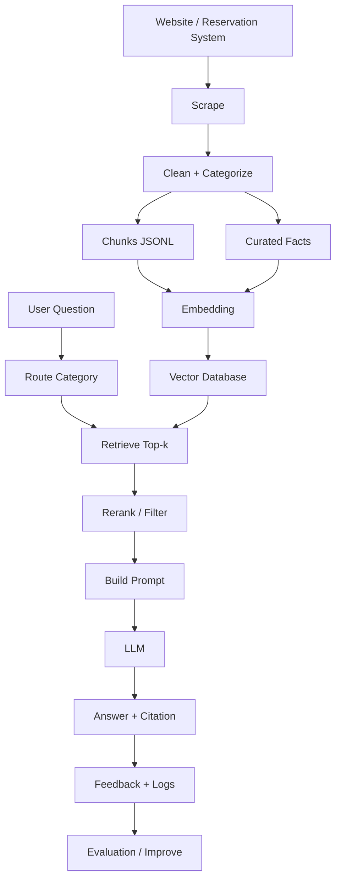

# 02 — Full Pipeline ภาพรวมทั้งหมด

นี่คือ pipeline เต็มสำหรับทำ AI Chatbot ของเว็บ PSU Esports Studio - Phuket

---

## Pipeline ใหญ่ทั้งหมด

```text
Phase 1: Data
  เว็บหลัก + ระบบจอง
  -> scrape
  -> clean
  -> classify category
  -> chunk
  -> curated facts

Phase 2: Index
  chunks/facts
  -> embedding
  -> vector database
  -> metadata

Phase 3: Retrieval
  user question
  -> route category
  -> retrieve top-k
  -> rerank/filter
  -> build context

Phase 4: Generation
  context + question
  -> prompt
  -> LLM
  -> answer + citation

Phase 5: App
  API
  -> UI
  -> user feedback

Phase 6: Quality
  eval testset
  -> regression test
  -> improve data/retrieval/prompt

Phase 7: Production
  deploy
  -> monitor
  -> update data
```

---

## Phase 1: Data Pipeline

ข้อมูลเริ่มต้นมาจาก:

- เว็บหลัก
- ระบบจอง
- policy pages
- services pages
- competition pages
- knowledge pages

ผลลัพธ์ที่ต้องได้:

```text
all_pages.jsonl
all_chunks.jsonl
faq_facts.jsonl
```

ทำไมต้องมี `faq_facts.jsonl`:

- กฎจองและรายชื่อเกมควรเป็นข้อมูลสั้น ชัด ตอบง่าย
- ข้อมูลจากเว็บบางหน้าเป็นบทความยาวเกิน
- curated facts ช่วยให้บอทตอบคำถาม fact ได้แม่นกว่า

---

## Phase 2: Index Pipeline

ขั้นตอน:

1. โหลด `faq_facts.jsonl`
2. โหลด `all_chunks.jsonl`
3. เลือก category ที่จะใช้
4. embed text
5. เก็บ vector + metadata

metadata ที่ต้องเก็บ:

```json
{
  "id": "...",
  "category": "reservation",
  "subcategory": "booking_rules",
  "title": "กฎการจองบริการ",
  "url": "https://esports.computing.psu.ac.th/",
  "record_type": "curated_fact"
}
```

---

## Phase 3: Retrieval Pipeline

เมื่อผู้ใช้ถาม:

```text
คำถาม: PS5 มีเกมอะไรบ้าง
```

ระบบควร:

1. ตรวจ keyword ว่าเป็นเรื่องอุปกรณ์/เกม
2. route ไปหมวด `services`
3. embed คำถาม
4. search ใน vector DB
5. prefer curated facts
6. return top-k context

---

## Phase 4: Generation Pipeline

เอา context ที่ค้นได้มาสร้าง prompt:

```text
System:
ตอบจาก context เท่านั้น

Context:
[1] เกมบน PlayStation 5 ...
[2] Our Games ...

Question:
PS5 มีเกมอะไรบ้าง
```

LLM ต้องตอบ:

- เป็นภาษาไทย
- มีรายการเกม
- มีแหล่งอ้างอิง
- ไม่เดาเกมที่ไม่มีใน context

---

## Phase 5: Chat UI

UI แรกควรทำง่าย:

- Streamlit

UI จริง:

- Web frontend + FastAPI

หน้าจอควรมี:

- ช่องถาม
- คำตอบ
- sources
- ปุ่ม feedback

---

## Phase 6: Evaluation Pipeline

ใช้ `eval/testset.jsonl`

ตรวจ:

- expected category ตรงไหม
- must contain อยู่ในคำตอบไหม
- คำตอบมี source ไหม
- คำถาม real-time ตอบว่าเช็กไม่ได้ไหม
- คำถามข้อมูลส่วนตัวปฏิเสธไหม

---

## Phase 7: Production Pipeline

เมื่อพร้อม:

```text
Docker
-> deploy backend
-> deploy frontend
-> connect vector db
-> add logging
-> schedule data update
```

---

## ภาพรวม Mermaid



