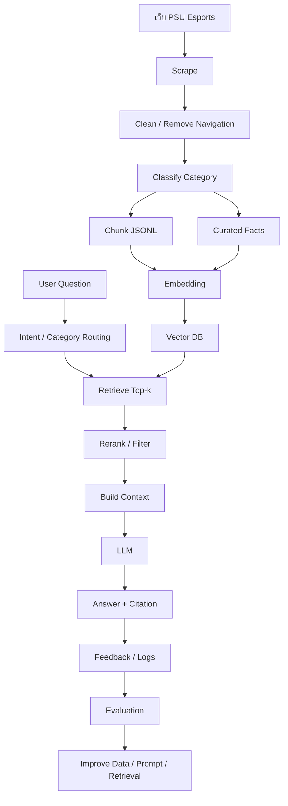

# Pipeline Diagram

```mermaid
flowchart TD
  A["เว็บ PSU Esports"] --> B["Scrape"]
  B --> C["Clean / Remove Navigation"]
  C --> D["Classify Category"]
  D --> E["Chunk JSONL"]
  D --> F["Curated Facts"]
  E --> G["Embedding"]
  F --> G["Embedding"]
  G --> H["Vector DB"]
  I["User Question"] --> J["Intent / Category Routing"]
  J --> K["Retrieve Top-k"]
  H --> K
  K --> L["Rerank / Filter"]
  L --> M["Build Context"]
  M --> N["LLM"]
  N --> O["Answer + Citation"]
  O --> P["Feedback / Logs"]
  P --> Q["Evaluation"]
  Q --> R["Improve Data / Prompt / Retrieval"]
```

