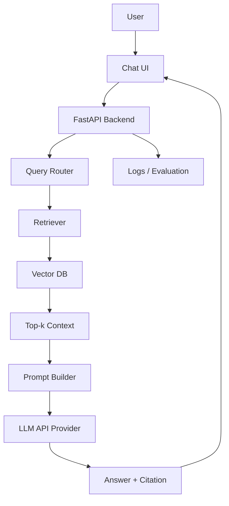
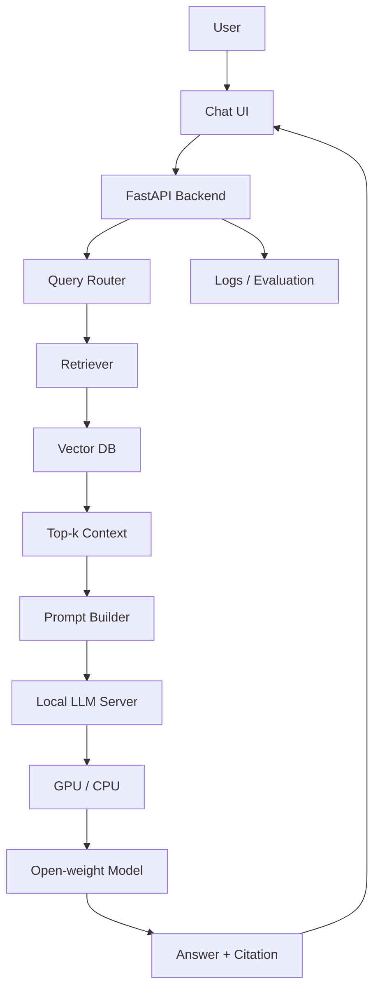
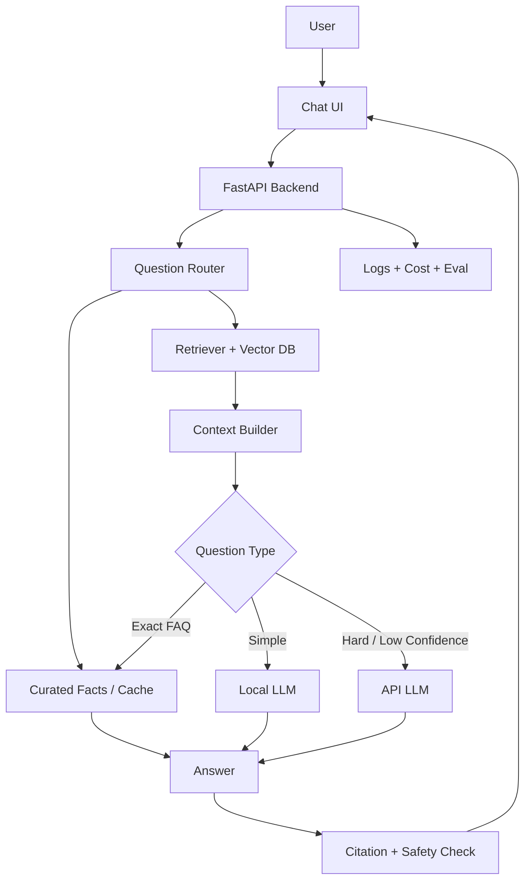
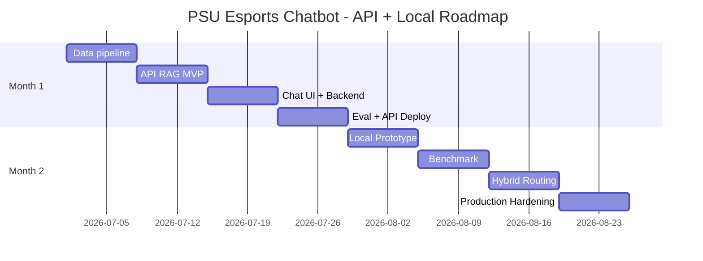

# Local vs API Diagrams

## API Architecture

```mermaid
flowchart TD
  A["User"] --> B["Chat UI"]
  B --> C["FastAPI Backend"]
  C --> D["Query Router"]
  D --> E["Retriever"]
  E --> F["Vector DB"]
  F --> G["Top-k Context"]
  G --> H["Prompt Builder"]
  H --> I["LLM API Provider"]
  I --> J["Answer + Citation"]
  J --> B
  C --> K["Logs / Evaluation"]
```

## Local Architecture

```mermaid
flowchart TD
  A["User"] --> B["Chat UI"]
  B --> C["FastAPI Backend"]
  C --> D["Query Router"]
  D --> E["Retriever"]
  E --> F["Vector DB"]
  F --> G["Top-k Context"]
  G --> H["Prompt Builder"]
  H --> I["Local LLM Server"]
  I --> L["GPU / CPU"]
  L --> M["Open-weight Model"]
  M --> J["Answer + Citation"]
  J --> B
  C --> K["Logs / Evaluation"]
```

## Hybrid Architecture

```mermaid
flowchart TD
  A["User"] --> B["Chat UI"]
  B --> C["FastAPI Backend"]
  C --> D["Question Router"]
  D --> E["Curated Facts / Cache"]
  D --> F["Retriever + Vector DB"]
  F --> G["Context Builder"]
  G --> H{"Question Type"}
  H -->|Simple| I["Local LLM"]
  H -->|Hard / Low Confidence| J["API LLM"]
  H -->|Exact FAQ| E
  E --> K["Answer"]
  I --> K
  J --> K
  K --> L["Citation + Safety Check"]
  L --> B
  C --> M["Logs + Cost + Eval"]
```

## Two Month Roadmap

```mermaid
gantt
  title PSU Esports Chatbot - API + Local Roadmap
  dateFormat  YYYY-MM-DD
  section Month 1
  Data pipeline           :a1, 2026-07-01, 7d
  API RAG MVP             :a2, after a1, 7d
  Chat UI + Backend       :a3, after a2, 7d
  Eval + API Deploy       :a4, after a3, 7d
  section Month 2
  Local Prototype         :b1, after a4, 7d
  Benchmark               :b2, after b1, 7d
  Hybrid Routing          :b3, after b2, 7d
  Production Hardening    :b4, after b3, 7d
```

