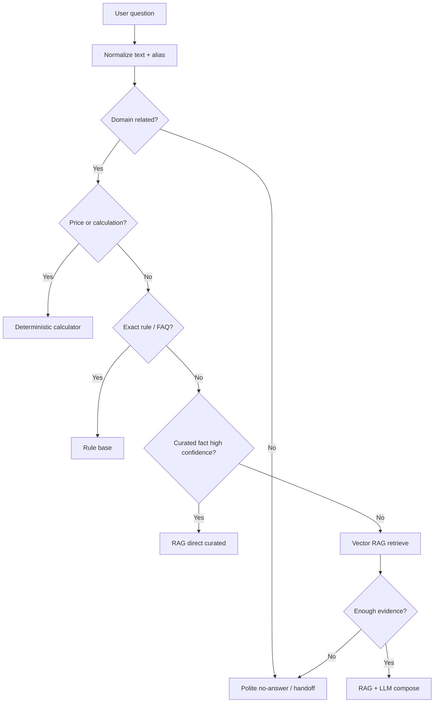

# Route Pipeline

เป้าหมายของ route คือเลือกวิธีตอบที่เหมาะกับคำถามแต่ละชนิด ไม่ปล่อยให้ทุกอย่างเข้า LLM หมด เพราะ LLM ช้าและมีโอกาสแต่งคำตอบเอง

## ภาพรวมเส้นทาง



## Route ที่แนะนำ

| Route | ใช้เมื่อ | จุดเด่น | ความเสี่ยง |
|---|---|---|---|
| `deterministic_calculator` | ราคา, เวลา, session, ค่าปรับ, การแปลงหน่วย | เร็วและไม่มั่ว | ต้องมี data table ครบ |
| `rule_fast_path` | FAQ ตายตัว เช่น จองล่วงหน้า, เช็คอิน, ยกเลิก | เร็วมาก | ถ้า pattern แข็งเกินไปจะหลุด |
| `rag_direct_curated` | มี curated fact ตรงคำถาม และตอบได้โดยไม่ต้องเรียบเรียงเยอะ | คุม source ได้ดี | ต้องดูแล curated facts |
| `rag_llm` | คำถามต้องสรุปหลายส่วน เช่น ขั้นตอนการจอง, กฎหลายข้อ | ตอบเป็นภาษาคน | ช้ากว่าและต้องบังคับ grounding |
| `clarify` | ข้อมูลไม่พอ เช่น ถามราคาแต่ไม่บอกกลุ่มผู้ใช้ | ลดตอบผิด | ต้องออกแบบคำถามกลับให้ดี |
| `no_answer` | อยู่นอกขอบเขตเว็บ/ข้อมูลไม่มีจริง | ไม่มั่ว | ผู้ใช้อาจอยากได้คำแนะนำต่อ |

## หลักการเลือก route

1. ถ้าคำถามเป็นตัวเลข/ราคา/คำนวณ ให้เข้า calculator ก่อน
2. ถ้าคำถามเป็นกฎที่มีคำตอบคงที่ ให้เข้า rulebase ก่อน
3. ถ้าคำถามถามข้อมูลทั่วไปและมี curated fact ตรง ให้ตอบจาก curated fact
4. ถ้าคำถามต้องรวบรวมหลาย chunk ให้ใช้ RAG + LLM
5. ถ้าหลักฐานไม่พอ ให้ตอบสุภาพว่าไม่พบข้อมูลที่ยืนยันได้ และเสนอสิ่งที่ผู้ใช้ถามต่อได้

## Confidence แบบใช้งานจริง

แต่ละ route ควรคืน object ประมาณนี้:

```json
{
  "route": "deterministic_calculator",
  "confidence": 0.95,
  "reason": "พบ keyword ราคา + service=vr + group=general_student + duration=30min",
  "answer_type": "calculation",
  "sources": ["service_fee_image_2026"]
}
```

## เรื่องคำเหมือนและคำสะกดผิด

ไม่ควรใช้ cosine similarity กว้าง ๆ กับ rulebase ทั้งหมด เพราะคำบางคำคล้ายกันแต่ intent คนละอย่าง เช่น เปิด/ปิด, จอง/ยกเลิก, check-in/payment

แนวทางที่เหมาะกว่า:

- ทำ alias dictionary สำหรับ entity สำคัญ เช่น กลุ่มผู้ใช้, บริการ, วัน, หน่วยเวลา
- ใช้ fuzzy matching เฉพาะภายใน entity ที่จำกัดขอบเขตแล้ว
- ถ้าคะแนน fuzzy ต่ำหรือชนกันหลายกลุ่ม ให้ route เป็น `clarify`
- อย่าให้ fuzzy ไปเลือกคำตอบทั้งก้อนเองโดยไม่มีหลักฐาน

## Clarify ที่ควรตอบแบบมีประโยชน์

ถ้าถามว่า `นักเรียนเล่น VR เท่าไหร่` และไม่รู้ว่าเป็นนักเรียน PSU หรือสถาบันอื่น ควรตอบ:

> หมายถึงนักเรียน/นักศึกษา PSU หรือ นักเรียน/นักศึกษาต่างสถาบันครับ?  
> ถ้าเป็น PSU Student and Staff ราคา 0 บาท แต่ถ้าเป็น PSU Alumni/General Student ราคา 190 บาทสำหรับ VR 30 นาที และ 375 บาทสำหรับ VR 1 ชั่วโมง

แบบนี้ดีกว่าตอบว่าไม่มีข้อมูล เพราะช่วยให้ผู้ใช้เข้าใจราคาคร่าว ๆ และรู้ว่าต้องระบุอะไรเพิ่ม
