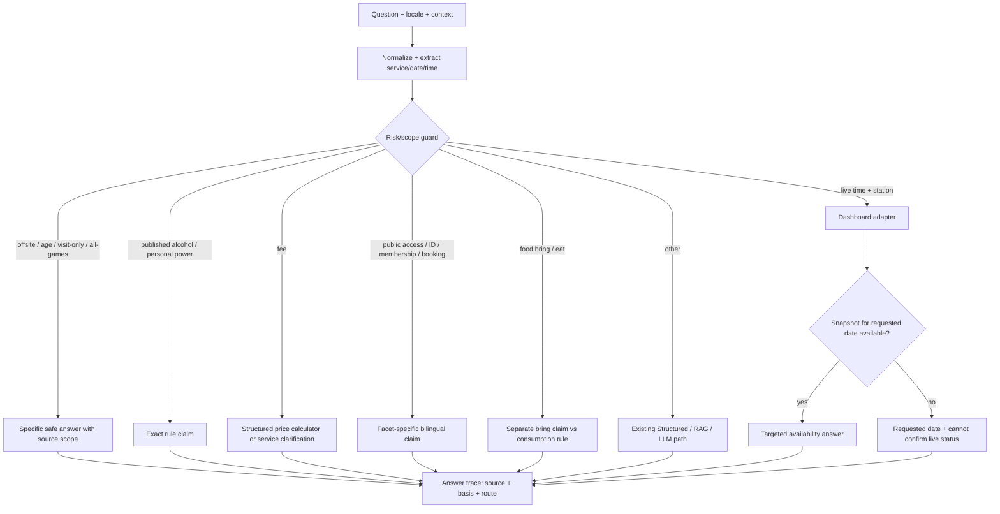

# วิเคราะห์คำตอบจากผลตรวจของผู้ใช้และการทดสอบข้ามหมวด

วันที่ตรวจ: 2026-09-25 (Asia/Bangkok)

## 1. ขอบเขตหลักฐานและวิธีอ่านคะแนน

| ชุดข้อมูล | จำนวน | สิ่งที่วัดได้ | สิ่งที่ห้ามสรุป |
|---|---:|---|---|
| Export ที่ผู้ใช้ติ๊กเอง | 200 | คุณภาพคำตอบ **เก่า**: ผิด 103, ใกล้เคียง 62, ถูก 35 | ไม่ใช่ผลตรวจคำตอบที่แก้แล้ว |
| English/Thai projection จากผลติ๊ก | 200 | คู่คำถามใช้หา route regression | ไม่ใช่ human-reviewed English |
| ชุด 400 ที่เคยรายงาน 400/400 | 400 | contract ของ route/facet หลังแก้รอบแรก | ไม่ใช่ความแม่นยำ 100%; มีเพียง 80 กลุ่มคำถามแกน กลุ่มละ 5 รูปประโยค |
| Intent-trap bilingual v2 | 1,000 | ราคา, การจอง, สิทธิ์, อาหาร, slot และขอบเขต | 100 live slots ไม่ใช่การยืนยันความว่างจริงหาก Dashboard ล่ม |
| Master Ground Truth v2 | 10,000 | coverage กว้าง: 5,000 ต่อภาษา | Gold หลายข้อเป็น generated paraphrase ที่ยังรอคนตรวจ |
| Novel adversarial probes | 41 | สำนวนใหม่และ negative controls ข้าม facet | 41/41 ตาม contract ไม่ใช่การพิสูจน์ production accuracy |

ข้อมูล 400 ข้อมีหมายเหตุอย่างน้อย 7 ข้อที่ไม่ตรง facet ของคำถาม: 5 ข้อถามเอกสารแต่หมายเหตุพูดเพียงการจอง/จ่ายเงิน และ 2 ข้อถามอาหารแต่หมายเหตุเป็นข้อความการจอง. จึงห้ามใช้ note เป็น Gold answer แบบคัดลอกตรง ๆ. `review_status=scenario_curated_pending_review` ในชุดใหม่บอกชัดว่าต้องให้คนตรวจ.

ผล full run ก่อนงานรอบนี้ (`2026-09-23`) คือไทย 4,386/5,000 และอังกฤษ 4,433/5,000 **ตามตัวตรวจอัตโนมัติ**. ไทยพลาดมากใน `studio_rules_penalties` 148, `reservation_policy` 98, `compound_context_boundary` 95 และ `equipment` 75. อังกฤษพลาด `competition_rules` 436; ในผลอังกฤษทั้งหมดมี 469 ข้อที่คาด answer แต่ได้ `localization_pending`. นี่เป็น baseline เก่า ไม่ใช่คะแนนหลังแก้วันที่ 25 และไม่ได้แปลว่าระบบตอบผิดข้อเท็จจริงทุกข้อ: ต้องแยก Gold/source conflict และคำแปลที่รออนุมัติ.

## 2. Root Cause ที่ยืนยันจากคำตอบจริง

| รหัส | อาการก่อนแก้ | สาเหตุใน Flow | ผลกระทบ | การแก้รอบนี้ |
|---|---|---|---|---|
| F1 | `คนนอกใช้ PC ฟรีไหม` ตอบเพียงว่าเข้าใช้ได้ | public-access intercept ทำงานก่อน price facet | ไม่ตอบคำถามราคา | แยก monetary signal และส่งคำถามที่ระบุบริการกลับ calculator |
| F2 | `คนทั่วไปจอง PC ต้องจ่ายเท่าไหร่` ไป Dashboard ที่ล่ม | live classifier ใช้คำ `จอง` เปล่า ๆ เป็น availability | ตอบว่าเช็ก Slot ไม่ได้แทนราคา | ต้องมี predicate การจองว่างจริง; price veto ก่อน live |
| F3 | `คนต่างมหาวิทยาลัยต้องอายุเท่าไร` ไปถามราคา | `เท่าไร` ถูกตีเป็นราคาโดยไม่ดูว่าเป็นอายุ | ถามกลับผิดเรื่อง | ตัด `เท่าไร` ที่ไม่มีหน่วยเงินออกจาก price signal; age guard ให้ safe no-answer |
| F4 | `Does a non-PSU guest need membership or national ID?` แสดงรายชื่อเจ้าหน้าที่ | token `member` แย่ง semantic route; policy guard ไม่รับ membership เป็น access facet | คำตอบผิด target | เลือก policy claim สำหรับสมาชิก/เอกสารก่อน staff directory |
| F5 | คำถามเวลาเฉพาะเจาะจงได้คำตอบสิทธิ์ทั่วไป | protected access อยู่ก่อน live/calendar | ไม่บอกว่าเวลานั้นปิดหรือว่าง | time-specific access ผ่านไป calendar/live; dashboard ล่มตอบไม่ยืนยันข้อมูลสด |
| F6 | ถามนำเบียร์มาดื่มใช้เวลานานและ no-answer | สำนวน `เบียร์` ไม่เข้า rule ที่มีแต่ `แอลกอฮอล์` | กฎความปลอดภัยไม่ถูกอ่าน | ชี้ไปที่ published alcohol rule; แยกดื่มกับแค่พก |
| F7 | ชาร์จโทรศัพท์กลายเป็นถามค่า `charge` | คำอังกฤษกำกวม + ไม่มี personal-power facet | คำตอบคนละเรื่อง | กฎข้อ 4.8 สำหรับการใช้ปลั๊กกับอุปกรณ์ส่วนตัวชนะราคา |
| F8 | ถามยืม PS5 กลับบ้าน ได้คำตอบขึ้นต้นว่า `Yes` | สิทธิ์จองบริการถูกขยายเป็นสิทธิ์นำทรัพย์สินออก | unsupported permission | offsite guard: ไม่ยืนยันสิทธิ์จากการจอง |
| F9 | ถามว่าเล่นได้ `ทุกเกม` ตอบเพียงว่าเข้าใช้ศูนย์ได้ | ขยายสิทธิ์สถานที่เป็นสิทธิ์ทุกเกม | overclaim | ตอบว่าต้องแยกเกม/โซน; ไม่ฟันธงทุกเกม |
| F10 | ถามค่าเข้า `ดูเฉย ๆ` ถูกบังคับเลือกโซน | ตารางราคาใช้กับบริการจอง ไม่ใช่ผู้มาเยี่ยมชม | ทำให้เข้าใจผิดว่ามีค่าเข้า/ต้องจอง | safe no-answer ที่แยกค่าเยี่ยมชมจากค่าบริการ |
| F11 | คำถามอาหาร/น้ำที่โต๊ะเกมตอบกฎกว้าง ๆ | rule บอกเฉพาะพื้นที่ที่กำหนด ไม่บอกว่าโต๊ะเป็นพื้นที่นั้น | ผู้อ่านอาจอนุมานเอง | ระบุว่าไม่ยืนยันโต๊ะนี้เป็นพื้นที่ที่กำหนด แล้วอ้างกฎเดิม |
| F12 | คำถาม Slot ตอน Dashboard ล่มไม่บอกวันที่ | unavailable response ไม่ใช้ selected date | ผู้ใช้ไม่รู้ว่าตรวจวันไหน | แสดงวันที่ที่ร้องขอและคง no-live-evidence wording |
| F13 | `What would a member of the public pay to play?` ตอบสิทธิ์จอง และ `What would I pay to use a station?` แสดงรายการอุปกรณ์ | English price detector รับ `cost/fee` แต่ไม่รับโครง `what would ... pay`; เมื่อไม่มี service ที่ระบุจึงหลุดไป route อื่น | ตอบคนละประเด็นทั้งที่ควรถามว่าอยากทราบราคาโซนใด | ตรวจ `pay to use/play` และ `what ... pay` ก่อน public/equipment route; ถ้าไม่รู้บริการให้ถามกลับเฉพาะโซน |
| F14 | คำถาม `Friday` ในชุดทดสอบตก 10 ข้อเมื่อรันวันที่ 25 ก.ย. | Gold สร้างเมื่อ 24 ก.ย. และคาดวันที่ 25 แต่ runtime บนวันศุกร์ตีความ `Friday` เปล่าเป็นศุกร์ถัดไป | คะแนนตกตามวันที่รัน ทั้งที่การตอบเว็บไม่เปลี่ยน | Evaluator ตรึง `today_bangkok` เฉพาะ live-date cases ตาม `metadata.reference_date`; เว็บยังใช้วันจริง และ `this Friday` แยกจาก bare `Friday` |

## 3. แหล่งข้อมูลและระดับความมั่นใจ

- เว็บไซต์จอง `https://esports.computing.psu.ac.th/` ระบุกฎจองล่วงหน้าอย่างน้อย 1 ชั่วโมง, ชำระภายใน 10 นาที, ใช้ Student/Staff/National ID ในแบบฟอร์มและเอกสารเช็กอิน, อาหาร/เครื่องดื่มเฉพาะพื้นที่ที่กำหนด, ห้ามดื่มแอลกอฮอล์, และห้ามใช้อุปกรณ์ส่วนตัวกับปลั๊กโดยไม่ได้รับอนุญาต.
- `public_access` และ `food_bring` ใน `data/curated/service_policy_answers.json` ยังใช้ `basis=reviewer_interpretation_with_site_context`. ช่อง National ID และกฎพื้นที่อาหาร **ไม่ได้เขียนชัดทุกนัย** ว่าทุกคนเข้าใช้ได้หรือพกอาหารทุกชนิดเข้ามาได้. เจ้าของศูนย์ต้องยืนยันก่อนถือเป็นนโยบายที่พร้อมเผยแพร่.
- `personal_power` ใช้ `basis=site_explicit` จากกฎข้อ 4.8. ข้อห้ามดื่มแอลกอฮอล์เป็น site-explicit แต่สิทธิ์เพียง **พก** แอลกอฮอล์เข้าไม่ได้ระบุแยก จึงตอบข้อจำกัดนี้อย่างตรงไปตรงมา.
- ราคาเฉพาะใช้ calculator/ข้อมูลราคาของระบบเดิม; งานนี้ไม่ได้อนุมัติราคาหรือเปลี่ยนตารางราคา. คำถามสิทธิ์อย่างเดียวไม่สร้างตัวเลขราคา.
- ข้อกำหนดอายุขั้นต่ำ, การนำอุปกรณ์กลับบ้าน และค่าเข้าชมเฉย ๆ ไม่พบข้อความยืนยันในหน้ากฎที่อ้างอิง จึงไม่สร้างข้ออ้างว่าอนุญาตหรือห้ามเด็ดขาด.

## 4. Flow ที่ใช้อยู่หลังแก้



การเลือก claim เฉพาะ facet ไม่ใช่การให้ model แต่ง policy. RAG/LLM ยังรับคำถามที่ guard ไม่มั่นใจ; คำตอบเชิงอนุญาตที่มีผลจริงต้องยึดแหล่งข้อมูล/การอนุมัติ ไม่เพิ่ม alias รายประโยคเพื่อเอาคะแนน.

## 5. ผลตรวจรอบนี้

| Run | ผล | ข้อจำกัด |
|---|---|---|
| Novel probes `master_gt_eval_20260925_134440.json` | 41/41 ตาม route/status/text contract | ผู้ตรวจยังไม่ได้อ่าน/รับรองทุกคำตอบ |
| Unit/regression หลังแก้ | 69/69 | mock และ deterministic checks ไม่แทน production load |
| Master bilingual stratified sample ล่าสุด `master_gt_eval_20260925_190017.json` | 118/120 | 2 English equipment uses ไม่มี localization ที่อนุมัติ; English GPU เป็น safe no-answer และถูกนับถูกต้องหลังแก้ตัวประเมิน |
| Intent-trap ก่อนแก้ `pay` และวันที่ `master_gt_eval_20260925_134941.json` | 975/1,000 | 15 ข้อ EN ผิด route จริง; 10 ข้อ Gold วันที่ไม่ตรงวันรัน |
| Intent-trap หลังแก้ `master_gt_eval_20260925_185702.json` | **1,000/1,000 ตาม auto contract** (TH 500, EN 500); P50 0.0448s, P95 0.5605s, P99 2.1514s, Max 6.0995s | 100/100 live slot ตอบ `live_booking_status_unavailable` เพราะ Dashboard ไม่พร้อม; **ไม่ใช่การตรวจว่าว่างจริง**. 1,000 ข้อนี้เป็น paraphrases จากสถานการณ์แกน ไม่ใช่ 1,000 เจตนาอิสระ และยังรอ human review |
| Live slot rerun หลังเปิด Dashboard จริง `master_gt_eval_20260925_210910.json` | 100/100 ตาม auto contract; ทั้ง 100 ข้อเป็น `pipeline:live_booking_status_fast_path` | Endpoint `http://127.0.0.1:8091/api/chatbot-status` ตอบ `source=remote_csv_live` และมี resource 18 รายการ. 95 ข้อได้คำตอบสถานะ, 5 ข้อถาม Nintendo เครื่อง 2 ที่ไม่มีใน Dashboard จึง no-answer อย่างเจาะจง. ยังไม่ได้เทียบรายการจองทีละช่องกับระบบเจ้าของศูนย์ |

ตัวอย่างที่แก้แล้ว: `What would a member of the public pay to play?` และ `What would I pay to use a station if I have not chosen a zone?` ตอนนี้ถามกลับให้เลือก PC/PS5/Nintendo/Cockpit/VR ไม่แสดงอุปกรณ์หรือขั้นตอนจอง. `Friday` ที่ไม่ระบุ `this` ใช้วันอ้างอิง 2026-09-24 เฉพาะใน evaluator จึงทวนผลได้; การใช้จริงยังอ้างวันไทยปัจจุบัน.

**เหตุผลที่ RAG ทำงานเพียง 10/1,000 ข้อ:** Intent-trap corpus แบ่ง 10 หมวด หมวดละ 100 ข้อ และแต่ละสถานการณ์แกนถูกขยายเป็น 5 รูปประโยค. Engine ให้ protected intent, live booking, English direct handler และ deterministic answer ตอบก่อน RAG เมื่อหลักฐานเฉพาะทางชัดแล้ว. `--allow-llm --rag-fallback` เป็นการอนุญาตให้ใช้ Model ไม่ใช่คำสั่งบังคับให้ทุกข้อเรียก Model. 10 ข้อที่เป็น `pipeline:rag_direct_curated` ล้วนอยู่ใน `damage_responsibility`: ถามพวงมาลัย Cockpit พังหรือเครื่อง Nintendo Switch ตก อย่างละ 5 รูปประโยค. ชุดนี้ไม่ได้ออกแบบวัดความสามารถ RAG/LLM เป็นหลัก จึง **ไม่ใช่** ผลพิสูจน์ว่า Model อ่านหลักฐานใหม่แล้วตอบถูกครบ. ต้องมีชุด RAG-first ที่เป็นคำถามใหม่จริงและตรวจ source-target-facet โดยคน; ไม่ควรบังคับ RAG ให้ตอบราคาและ Slot สดซึ่งมีแหล่งข้อมูลที่ตรงกว่า.

## 6. งานที่ยังไม่ควรปิด

1. **Owner policy approval (P0):** ยืนยันบุคคลภายนอกและการพกอาหารเข้าศูนย์พร้อมข้อความข้อยกเว้น; ก่อนอนุมัติห้ามนับเป็น site-explicit. นำ decision/version/ผู้อนุมัติเข้า registry แล้วรันซ้ำ.
2. **Human review คำตอบใหม่ (P0):** Export ปุ่มตรวจเดิมเป็นคำตอบเก่า. ให้ผู้ใช้ตรวจตัวอย่างจากแต่ละกลุ่มคำถามแกน รวมทั้ง English ที่เดิมเป็น projection, โดยเฉพาะ no-answer ที่อาจปลอดภัยแต่ไม่ช่วยผู้ใช้.
3. **Live booking verification (P0):** ทดสอบ plugin จาก `D:\Download New\booking_dashboard_v26_slot_balanced_layout\booking_dashboard_v26_slot_balanced_layout` แล้ว: API aggregate-only บน `127.0.0.1:8091` ตอบ `remote_csv_live` และ 100 live queries เข้าทางนี้ครบ. แต่ยังต้องใช้ fixture ที่ล็อกวัน/เครื่อง/ช่วงเวลา/สถานะ และเทียบผลกับรายการจองจริงของเจ้าของศูนย์ รวมทั้งทดสอบ CSV ล่ม/ข้อมูลค้าง/พร้อมกันหลายคน. การผ่าน route contract ไม่เท่ากับตรวจว่าทุกเครื่องว่างถูกต้อง.
4. **Date semantics (P1):** evaluator ใช้ `metadata.reference_date` ใน live-date cases แล้ว แต่คำว่า `Friday` แบบไม่ระบุ `this` ยังเป็นความกำกวมเชิงผลิตภัณฑ์เมื่อผู้ใช้ถามในวันศุกร์. ต้องกำหนด UX ว่าควรถามกลับหรือใช้ศุกร์ถัดไป พร้อมทดสอบแยกจาก fixture วันที่.
5. **English localization approval (P1):** 469 `localization_pending` ใน full English baseline ต้องให้คนตรวจคำแปลกฎการแข่งขันและข้อมูลอื่นก่อน publish; ห้ามแก้ด้วย runtime translation ที่อาจเปลี่ยนเงื่อนไข.
6. **Broader facet planner (P2):** มีคำถามหลายเจตนาที่อาจต้องตอบทั้งสิทธิ์+เวลา/ราคาในข้อความเดียว. Flow ปัจจุบันเลือก facet หลักเพื่อป้องกัน overclaim; ต้องออกแบบการรวม verified drafts และ source contract ก่อนให้ LLM เรียบเรียง.
7. **Production SLA (P2):** ผล serial ไม่ยืนยัน 20 วินาทีภายใต้ concurrent users, worker crash, WordPress outage และ model cold start. ต้องมี HTTP load test และ trace ต่อ stage.
8. **Evaluator external-blocked taxonomy (P2):** แก้ `equipment_spec_unverified_en` และ `live_booking_status_unavailable` ให้จัดเป็น `no_answer` แล้วสำหรับ run ใหม่ แต่ auto contract ยังนับ 100 live cases ที่ Dashboard ล่มเป็น pass เพราะตอบอย่างปลอดภัย. ต้องแยก `external_blocked` จาก `verified_pass` ในรายงานก่อนใช้คะแนนนี้บริหารงาน; ไฟล์ raw เก่าคงสถานะเดิมเพื่อรักษาหลักฐาน.
9. **Generalization (P2):** คำถาม Novel ยังมีเพียง 41 ข้อและชุด 1,000 มีการขยายรูปประโยค 5 แบบต่อสถานการณ์. ต้องเก็บคำถามผู้ใช้ใหม่จริงแบบไม่ซ้ำ template และให้คนตรวจ answer grounding, ความครบของประเด็น, และความเป็นธรรมชาติทั้งสองภาษา โดยไม่แก้ Gold หลังเห็น output เพียงเพื่อเพิ่มคะแนน.

## 8. การต่อ Booking Dashboard บนเครื่องจริง

`app/booking/live_status.py` อ่าน `PSU_LIVE_BOOKING_STATUS_URL` ซึ่งค่าเริ่มต้นคือ `http://127.0.0.1:8091/api/chatbot-status`. ตัวส่งมอบแบบเปิดครั้งเดียวมีสำเนา plugin ใน `booking_dashboard/` และ `Start-PSU-Esports-Chatbot.ps1` พยายามเปิด Dashboard บนพอร์ต 8091 ก่อนเปิด Chatbot. การรัน evaluator จาก source tree ตรง ๆ **ไม่ได้เปิด Dashboard อัตโนมัติ**; นี่คือสาเหตุของ 100 `live_booking_status_unavailable` ในรอบ 1,000 เดิม. หากพอร์ต 8091 ถูกโปรแกรมอื่นใช้ หรือ WordPress CSV ดึงไม่สำเร็จ ให้ถือข้อมูลสดว่าไม่พร้อม; ห้ามสลับไปใช้ sample CSV เป็นคำตอบผู้ใช้.

ผลตรวจ 2026-09-25: endpoint ของ plugin ตอบวันที่ 2026-09-28, `source=remote_csv_live`, 18 resources; คำถาม PC #02 เวลา 13:00, PC+VR และคำถามอังกฤษได้คำตอบเฉพาะเป้าหมาย. ชุด 100 live queries ผ่าน auto contract ทั้งหมด แต่ยังไม่มี independent booking oracle เพื่อรับรองสถานะจริงรายช่อง.

## 7. วิธีทวนผล

```powershell
python -m unittest tests.test_intent_trap_protected_flow tests.test_review_grounded_service_policy tests.test_master_ground_truth_route_regressions tests.test_intent_trap_ground_truth_1000 tests.smoke_test_live_booking_status tests.test_master_ground_truth_eval_status -q
python -u -X utf8 tools/run_master_ground_truth_eval.py --corpus data/eval/review_grounded_novel_20260925.jsonl --allow-llm --rag-fallback
python -u -X utf8 tools/run_master_ground_truth_eval.py --corpus data/eval/intent_trap_bilingual_1000_v2.jsonl --allow-llm --rag-fallback
```

ทุก run เขียนไฟล์ใหม่ใน `reports/master_ground_truth_eval/` และไม่แก้ Raw Log เดิม. เปรียบเทียบคะแนนต้องบอกเสมอว่าเป็น `auto contract`, `human reviewed`, `external blocked` หรือ `stale Gold`.
