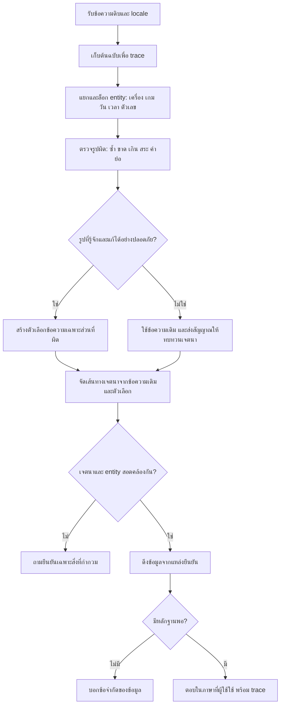

# Flow พัฒนาความเข้าใจข้อความไทยผิดรูป — PSU Esports Chatbot

เริ่ม 29 กันยายน 2026 · อ้างอิงผลวิจัย `THAI_TYPO_AND_INTENT_DEEP_RESEARCH_20260929.md` ในพื้นที่ส่งมอบ Codex · สถานะ: วนทดสอบ 4 รอบแล้ว ดูผลและข้อจำกัดใน [รายงาน](101_thai_noisy_input_four_round_report_20260929.md)

## เป้าหมายและขอบเขต

ให้แชทบอทอ่านคำถามของศูนย์ที่พิมพ์ซ้ำ ขาด เกิน สลับ เปลี่ยนสระ/วรรณยุกต์ และภาษาพูดได้ดีขึ้น โดยคำตอบข้อเท็จจริงยังมาจากข้อมูลที่ตรวจสอบได้ ไม่ให้ตัวแก้คำเปลี่ยน `PC1` เป็น `PC11`, `10:00` เป็น `11:00`, ราคา, วันที่ หรือชื่อเกมโดยเดา

## Flow ของคำถามหนึ่งครั้ง

### กติกาความปลอดภัย

1. แก้เฉพาะข้อความเพื่อช่วยจัดเส้นทาง ไม่แก้ข้อเท็จจริงในต้นทางและไม่เขียนทับข้อความผู้ใช้
2. คำทั่วไป/คำทักทายกู้ได้เมื่อเจตนาเฉพาะและไม่มีคำถามสำคัญต่อท้าย
3. ตัวเลข เวลา วันที่ หมายเลขเครื่อง ราคา รหัส และชื่อเกมที่ใกล้กันเป็นค่า protected; หากกำกวมให้ถาม
4. การตรวจคำผิดกับการตอบสถานะจองเป็นคนละชั้น: จับเจตนาถูกยังไม่เท่ากับ API คืนสถานะถูก
5. ตัวอย่างที่สร้างขึ้นเพื่อทดสอบต้องแยกจากข้อมูลผู้ใช้จริง; ห้ามนำ log ส่วนบุคคลไปฝึกโดยอัตโนมัติ

## วนทดสอบ 4 รอบ

| รอบ | งาน | สิ่งที่บันทึก | เกณฑ์ผ่านก่อนต่อ |
|---|---|---|---|
| 1: Baseline | สร้างชุดคู่ clean/noisy หลายเจตนาและตัวอย่างป้องกันการแก้เกิน รัน r8/pilot ปัจจุบัน | route, answer mode, entity, latency, ประเภทคำผิด, root cause | ระบุข้อผิดพลาดเป็นรายกรณี ไม่ตีความจาก route อย่างเดียว |
| 2: กู้รูปคำไทย | เพิ่มการสร้าง candidate เฉพาะคำเจตนาไทยที่มีหลักฐานว่าผิดบ่อย พร้อมคงต้นฉบับ | ผลก่อน/หลังและ false positive | clean และ protected entity ไม่ถอยหลัง |
| 3: ความหมาย/บริบท | ทดสอบคำถามผสม ภาษาพูด และคำคล้ายกัน; แก้การเลือกเจตนา/การถามกลับเท่าที่พิสูจน์ได้ | paired evaluation + regression | ไม่ให้คำทักทาย/คำผิดกลบคำถามจอง ราคา เกม หรือเวลา |
| 4: ตรวจซ้ำ/วิจัยเพิ่ม | หางานวิจัยต้นฉบับตรงกับ failure ที่เหลือ ทดสอบซ้ำบนแพ็กเกจใหม่และรัน regression ที่เกี่ยวข้อง | รายงานผลรวม, failure ที่ค้าง, หลักฐาน paper, แพ็กเกจทดลอง | แยกสิ่งที่ผ่านอัตโนมัติออกจากสิ่งที่ไม่มีคำตอบจริงหรือเจ้าของยังไม่ยืนยัน |

## วิธีประเมิน

ชุดข้อมูลใหม่มี `clean_question`, `noisy_question`, `expected_intent`, `noise_type`, `protected_values`, `expected_answer_contains` เฉพาะเมื่อรู้คำตอบจริง วัดแยก: intent accuracy, answer check เมื่อมี gold, protected-value preservation, false positive, clarification ที่เหมาะสม และ p50/p95 latency. หากคำถามจองสดไม่มี fixture ที่รู้ว่าว่าง/ถูกจองจริง ให้วัดเพียงการแยกเป้าหมายและการเชื่อม API แล้วติดป้ายว่า **ยังไม่ยืนยันผลสถานะ**

## หลักฐานวิจัยตั้งต้น

- [Misspelling Semantics in Thai](https://aclanthology.org/2022.lrec-1.24/): ข้อความเขียนผิดอาจมีความหมายเพิ่ม การ normalize ทุกคำเสี่ยงเสียข้อมูล
- [Domain Adaptation of Thai Word Segmentation](https://aclanthology.org/2020.emnlp-main.315/): การตัดคำขึ้นกับโดเมน
- [Robustness of Intent Classification to Real-world Noise](https://aclanthology.org/2021.nlp4convai-1.7/): typo และ paraphrase ทำให้ intent/slot ลดลง; augmentation ต้องวัดข้ามชนิด noise
- [ByT5](https://arxiv.org/abs/2105.13626): โมเดล byte มีความทนต่อ noise ในงานที่ทดลอง แต่ยังต้องวัดบน PSU

ผลจริงของแต่ละรอบบันทึกในรายงานแยกโดยไม่แก้ log เดิม
