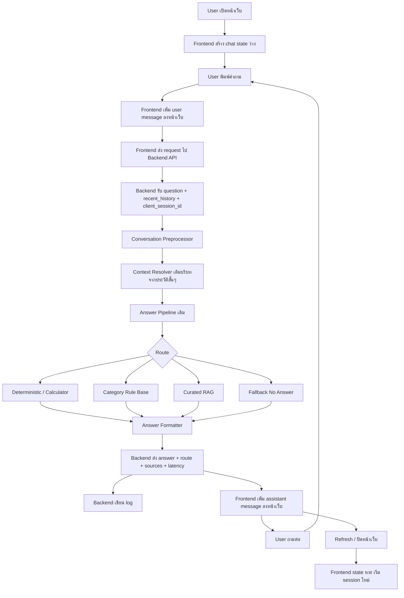

# Web Chat Session Memory Pipeline

เอกสารนี้สรุป pipeline สำหรับนำ PSU Esports Chatbot ไปวางบนเว็บ โดยเน้นกรณีที่ผู้ใช้คุยต่อเนื่องได้ในหน้าเว็บ แต่ถ้า refresh หน้าเว็บ ปิดเว็บ หรือกลับเข้ามาใหม่ ประวัติที่แสดงในหน้าแชทจะหายและเริ่มใหม่

## คำตอบสั้น

ทำได้

ถ้าอยากให้ประวัติในหน้าเว็บหายเมื่อ refresh/ออกเว็บ ให้เก็บ conversation history ไว้ที่ frontend memory เท่านั้น เช่น React state, Vue state, Svelte store หรือ JavaScript variable ในหน้าเว็บ

แต่ถ้าเป็นระบบจริง ควรแยกเป็น 2 ชั้น:

1. Chat UI memory: ประวัติที่ผู้ใช้เห็นในหน้าเว็บ หายได้เมื่อ refresh
2. Backend log: บันทึกหลังบ้านสำหรับ debug, วิเคราะห์คำถาม, วัดคุณภาพคำตอบ และทำรายงาน

ดังนั้นผู้ใช้จะเห็นเหมือนเริ่มใหม่ทุกครั้ง แต่ทีมพัฒนายังมี log สำหรับปรับปรุงระบบ

## รูปแบบการจำประวัติบนเว็บ

### แบบที่ 1: Frontend memory only

เหมาะกับ demo/MVP ที่ต้องการให้ refresh แล้วหาย

คุณสมบัติ:

- คุยต่อเนื่องได้ตราบเท่าที่หน้าเว็บยังไม่ refresh
- refresh แล้วประวัติหาย
- ปิด tab แล้วประวัติหาย
- ไม่ต้องใช้ database เพื่อแสดงประวัติ
- ทำง่ายที่สุด
- เหมาะกับ demo วันแรก หรือ prototype

ข้อจำกัด:

- ถ้า user กด refresh โดยไม่ตั้งใจ ประวัติหายทันที
- ถ้าต้องการ debug ต้องมี backend log แยก
- ถ้ามีหลาย tab แต่ละ tab จะมีประวัติแยกกัน

ตัวอย่าง flow:

```text
เปิดหน้าเว็บ
-> สร้าง messages = []
-> user พิมพ์คำถาม
-> เพิ่ม user message เข้า messages
-> ส่งคำถาม + ประวัติสั้นๆ ไป backend
-> ได้คำตอบ
-> เพิ่ม assistant message เข้า messages
-> render บนหน้าเว็บ
-> refresh หน้าเว็บ
-> messages กลับเป็น []
```

### แบบที่ 2: sessionStorage

เหมาะกับกรณีอยากให้ refresh แล้วยังอยู่ แต่ปิด tab แล้วค่อยหาย

คุณสมบัติ:

- refresh หน้าเดิมแล้วประวัติยังอยู่
- ปิด tab แล้วประวัติหาย
- ไม่แชร์ข้าม tab
- ไม่ต้องมี login

ข้อจำกัด:

- ประวัติอยู่ที่ browser ฝั่งผู้ใช้
- ไม่เหมาะเก็บข้อมูล sensitive
- ถ้าต้องการวิเคราะห์คำถาม ยังควรมี backend log

### แบบที่ 3: localStorage

เหมาะกับกรณีอยากให้กลับมาเว็บเดิมแล้วประวัติยังอยู่บน browser เครื่องเดิม

คุณสมบัติ:

- refresh แล้วยังอยู่
- ปิด browser แล้วเปิดใหม่ยังอยู่
- ทำง่าย

ข้อจำกัด:

- ไม่เหมาะถ้าต้องการให้ประวัติหายเมื่อออกจากเว็บ
- ถ้าใช้คอมสาธารณะ คนอื่นอาจเห็นประวัติ
- ไม่เหมาะกับข้อมูลส่วนตัว

### แบบที่ 4: Server session + database

เหมาะกับ production จริง

คุณสมบัติ:

- server เก็บ history/log
- user กลับมาใหม่แล้วยังดึงประวัติได้ ถ้ามี session cookie หรือ login
- ใช้วิเคราะห์คุณภาพคำตอบได้
- รองรับหลายอุปกรณ์ได้ถ้ามี login

ข้อจำกัด:

- ต้องมี database
- ต้องออกแบบ privacy, retention, deletion
- ซับซ้อนกว่า frontend memory

## แนวทางที่แนะนำสำหรับโปรเจกต์นี้

สำหรับตอนนี้ แนะนำทำแบบผสม:

```text
Frontend:
  เก็บ messages ใน memory เท่านั้น
  refresh แล้วประวัติที่หน้าเว็บหาย

Backend:
  เก็บ conversation log แบบไม่ต้องเอากลับมาโชว์ user
  ใช้เพื่อ debug และปรับปรุง RAG/rule/calculator
```

เหตุผล:

- ทำง่ายและเร็ว
- เหมาะกับ MVP
- หน้าเว็บไม่ต้องมีระบบ login
- ลดปัญหา privacy เพราะ user ไม่เห็นประวัติเก่าในเครื่องสาธารณะ
- ยังมี log หลังบ้านไว้ดูว่าบอทตอบผิดตรงไหน

## ภาพรวม Pipeline



## Pipeline แบบละเอียด

### Stage 1: Frontend Chat UI

หน้าที่:

- แสดงกล่อง chat
- เก็บ messages ชั่วคราวใน memory
- ส่งคำถามไป backend
- แสดงคำตอบ
- แสดง route/debug เฉพาะในโหมด developer

ข้อมูลที่ frontend ควรถือไว้:

```json
{
  "messages": [
    {
      "role": "user",
      "text": "เด็ก สจล เล่น VR เท่าไหร่",
      "created_at": "2026-07-02T14:20:00+07:00"
    },
    {
      "role": "assistant",
      "text": "ราคา VR สำหรับกลุ่ม General Student: 30 นาที 190 บาท, 1 ชั่วโมง 375 บาท",
      "created_at": "2026-07-02T14:20:01+07:00"
    }
  ],
  "client_session_id": "temp-uuid-in-browser-memory"
}
```

ถ้าต้องการให้ refresh แล้วหาย:

- ห้าม save messages ลง localStorage
- ห้าม save messages ลง sessionStorage
- สร้าง `client_session_id` ใหม่ทุกครั้งที่โหลดหน้าเว็บ

### Stage 2: Request Builder

ตอน user กดส่ง ให้ frontend ส่งข้อมูลประมาณนี้:

```json
{
  "question": "แล้ว 1 ชั่วโมงล่ะ",
  "client_session_id": "temp-uuid-in-browser-memory",
  "recent_history": [
    {
      "role": "user",
      "text": "เด็ก สจล เล่น VR เท่าไหร่"
    },
    {
      "role": "assistant",
      "text": "ราคา VR สำหรับกลุ่ม General Student: 30 นาที 190 บาท, 1 ชั่วโมง 375 บาท"
    }
  ],
  "debug": false
}
```

ไม่ควรส่ง history ทั้งหมดถ้ายาวมาก ให้ส่งแค่ล่าสุดประมาณ 5-10 messages

### Stage 3: Backend API

Endpoint ที่ควรมี:

```text
POST /api/chat
```

Input:

```json
{
  "question": "แล้ว 1 ชั่วโมงล่ะ",
  "client_session_id": "temp-uuid",
  "recent_history": [],
  "debug": false
}
```

Output:

```json
{
  "answer": "ราคา 375 บาท สำหรับ VR 1 ชั่วโมง กลุ่มนักศึกษาหรือนักเรียนต่างสถาบัน / มหาลัยอื่น",
  "mode": "pipeline:deterministic_calculator_fast",
  "route_category": "service_fee",
  "route_intent": "service_fee_query",
  "sources": [
    "https://esports.computing.psu.ac.th/wp-content/uploads/2026/01/PSU-Esports-Studio-phuket-SERVICE-FEE-2026.png"
  ],
  "latency_sec": 0.04,
  "session_memory": {
    "service": "vr",
    "user_group": "general_student",
    "duration": "60_minutes"
  }
}
```

### Stage 4: Context Resolver

นี่คือส่วนที่ทำให้ถามต่อเนื่องได้

ตัวอย่าง:

```text
ก่อนหน้า:
User: เด็ก สจล เล่น VR เท่าไหร่
Bot: ราคา VR สำหรับ General Student: 30 นาที 190 บาท, 1 ชั่วโมง 375 บาท

คำถามใหม่:
User: แล้ว 1 ชั่วโมงล่ะ
```

ถ้าส่งคำถามใหม่เข้าระบบตรงๆ อาจไม่รู้ว่า 1 ชั่วโมงของอะไร

Context Resolver ต้องแปลงเป็น:

```text
เด็ก/นักศึกษาต่างสถาบัน เล่น VR 1 ชั่วโมง ราคาเท่าไหร่
```

ข้อมูลที่ควร extract จากประวัติ:

```json
{
  "last_service": "vr",
  "last_user_group": "general_student",
  "last_duration": null,
  "last_day": null,
  "last_intent": "service_fee_query"
}
```

คำถามที่ควรใช้ memory:

- แล้ว 1 ชั่วโมงล่ะ
- แล้วครึ่งชั่วโมงล่ะ
- ถ้าเป็นคนทั่วไปล่ะ
- แล้ววันศุกร์ล่ะ
- รอบบ่ายล่ะ
- ราคาเท่าไหร่
- ต้องจองไหม

คำถามที่ไม่ควรใช้ memory มากเกินไป:

- เปลี่ยนเรื่องชัดเจน เช่น "กฎการแข่งมีอะไรบ้าง"
- ถามข้อมูลทั่วไปใหม่ เช่น "เปิดกี่โมง"
- ถามนอกโดเมน

### Stage 5: Answer Pipeline เดิม

หลัง rewrite คำถามแล้วค่อยส่งเข้า pipeline เดิม:

```text
rewritten_question
-> preprocess
-> entity extraction
-> guard
-> route
-> deterministic calculator / rule / RAG
-> formatter
-> validator
```

ไม่ควรให้ LLM เป็นตัวจำทุกอย่างตั้งแต่แรก เพราะ:

- ช้ากว่า
- ควบคุมคำตอบยากกว่า
- เปลืองทรัพยากร
- เสี่ยงตอบมั่วถ้า history ยาวหรือมีข้อมูลปนกัน

ควรใช้ memory แบบ structured ก่อน เช่น service, group, duration, day

### Stage 6: Logging

ถึงแม้หน้าเว็บ refresh แล้วประวัติหาย แต่ backend ควรเก็บ log เพื่อดูคุณภาพระบบ

ข้อมูลที่ควรเก็บ:

```json
{
  "timestamp": "2026-07-02T14:20:01+07:00",
  "channel": "web",
  "client_session_id": "temp-uuid",
  "question": "แล้ว 1 ชั่วโมงล่ะ",
  "rewritten_question": "นักศึกษาต่างสถาบัน เล่น VR 1 ชั่วโมง ราคาเท่าไหร่",
  "answer": "ราคา 375 บาท สำหรับ VR 1 ชั่วโมง กลุ่มนักศึกษาหรือนักเรียนต่างสถาบัน / มหาลัยอื่น",
  "mode": "pipeline:deterministic_calculator_fast",
  "route_category": "service_fee",
  "route_intent": "service_fee_query",
  "sources": [
    "service_fee_image_2026"
  ],
  "latency_sec": 0.04,
  "validation_ok": true,
  "fallback_reason": null
}
```

สำหรับ MVP ใช้ JSONL ได้:

```text
data/logs/web_chat_2026-07-02.jsonl
```

สำหรับ production ควรใช้ SQLite/PostgreSQL:

```text
chat_sessions
chat_messages
chat_logs
answer_feedback
```

## สิ่งที่ควรเพิ่มตอนนี้ก่อน Deploy จริง

### 1. Chat API

เพิ่ม backend endpoint:

```text
POST /api/chat
```

หน้าที่:

- รับคำถามจากเว็บ
- รับ recent_history
- เรียก Context Resolver
- เรียก answer pipeline เดิม
- ส่งคำตอบกลับเป็น JSON
- เขียน log

### 2. Context Resolver

เพิ่ม module ใหม่ เช่น:

```text
app/session/context_resolver.py
```

หน้าที่:

- อ่าน recent_history
- ดึง slot สำคัญ เช่น service, user_group, duration, day, intent
- rewrite คำถาม follow-up ให้ชัดขึ้น

ตัวอย่าง:

```text
"แล้ว 1 ชั่วโมงล่ะ"
-> "VR 1 ชั่วโมง สำหรับกลุ่ม General Student ราคาเท่าไหร่"
```

### 3. Session Memory Schema

เพิ่ม schema ประมาณนี้:

```json
{
  "last_service": null,
  "last_user_group": null,
  "last_duration": null,
  "last_day": null,
  "last_time_slot": null,
  "last_intent": null
}
```

### 4. Web Chat UI

ทำหน้าเว็บง่ายๆ:

- กล่องแสดงข้อความ
- input พิมพ์คำถาม
- ปุ่มส่ง
- loading state
- error state
- ปุ่ม clear chat
- debug panel เฉพาะ dev mode

ถ้าต้องการ refresh แล้วหาย:

- messages ใช้ state ในหน้าเว็บเท่านั้น
- ไม่ save ลง localStorage/sessionStorage

### 5. Backend Log

เพิ่ม logger:

```text
app/session/chat_logger.py
```

เริ่มจาก JSONL ก่อน:

```text
data/logs/chat_web_YYYY-MM-DD.jsonl
```

ข้อมูลต้องมี:

- timestamp
- question
- rewritten_question
- answer
- route/mode
- latency
- sources
- fallback/no-answer reason

### 6. Safety / Privacy Policy

ต้องกำหนดก่อน deploy:

- เก็บ log กี่วัน
- เก็บ user id ไหม
- ลบข้อมูลได้ไหม
- ไม่ควรเก็บเบอร์โทร/เลขบัตร/ข้อมูลส่วนตัวถ้าไม่จำเป็น
- ถ้าเก็บ user id ให้ hash หรือทำ anonymous id

### 7. Fallback UX

ถ้าระบบไม่พบข้อมูล ควรตอบแบบช่วยเหลือ:

```text
ยังไม่พบข้อมูลที่ยืนยันได้เกี่ยวกับค่าปรับเมาส์พังในฐานข้อมูลตอนนี้ครับ
แนะนำให้ติดต่อเจ้าหน้าที่ศูนย์เพื่อยืนยันก่อนใช้งานจริง
```

ไม่ควรตอบมั่วหรือเดาราคา

### 8. Test Set สำหรับ Multi-turn

ต้องมี Ground Truth เพิ่มแบบ conversation ไม่ใช่แค่ single question

ตัวอย่าง:

```json
{
  "case_id": "multi_price_001",
  "turns": [
    {
      "user": "เด็ก สจล เล่น VR เท่าไหร่",
      "expected_keywords": ["190", "375", "VR", "General Student"]
    },
    {
      "user": "แล้ว 1 ชั่วโมงล่ะ",
      "expected_keywords": ["375", "VR", "1 ชั่วโมง"]
    }
  ]
}
```

### 9. Deployment Readiness

ก่อน deploy จริงควรมี:

- Dockerfile
- docker-compose.yml
- health check endpoint เช่น `GET /health`
- environment variables
- log path หรือ database connection
- rate limit
- CORS config
- error monitoring
- backup/restore ถ้าใช้ database

## Recommended MVP Build Order

ลำดับที่ควรทำก่อน:

1. ทำ `POST /api/chat`
2. ทำ web chat UI แบบ memory only
3. ทำ backend JSONL logging
4. ทำ Context Resolver แบบ rule-based ง่ายๆ
5. เพิ่ม multi-turn test set
6. ทดสอบกับคำถามจริง 50-100 ชุด
7. เพิ่ม Docker สำหรับรันทั้ง frontend/backend
8. ค่อยเพิ่ม database ถ้าต้องการเก็บ log จริงจัง

## ตัวอย่าง Multi-turn ที่ควรรองรับ

### ราคา

```text
User: เด็กจุฬาเล่น VR เท่าไหร่
Bot: ราคา VR สำหรับกลุ่ม General Student: 30 นาที 190 บาท, 1 ชั่วโมง 375 บาท
User: แล้ว 1 ชั่วโมงล่ะ
Bot: ราคา 375 บาท สำหรับ VR 1 ชั่วโมง กลุ่ม General Student
```

### เปลี่ยนกลุ่มผู้ใช้

```text
User: PS5 ราคาเท่าไหร่
Bot: ยังไม่ทราบกลุ่มผู้ใช้ จึงแสดงราคาทุกกลุ่ม...
User: ถ้าเป็นเด็ก มอ ล่ะ
Bot: ราคา 0 บาท สำหรับ PlayStation 5 กลุ่ม PSU Student and Staff
```

### เวลาเปิด

```text
User: วันจันทร์เล่นได้ไหม
Bot: วันจันทร์ช่วงเช้า 09:00-12:00 เป็น Maintenance เล่นไม่ได้ และช่วงบ่าย 13:00-16:00 เปิดให้เล่น
User: แล้ววันศุกร์ล่ะ
Bot: วันศุกร์ช่วงเช้า 09:00-12:00 เปิดให้เล่น แต่ช่วงบ่าย 13:00-16:00 เป็น Maintenance
```

### คำถามคลุมเครือ

```text
User: แล้วราคาเท่าไหร่
Bot: หมายถึงบริการไหนครับ เช่น PlayStation 5, Nintendo Switch, Cockpit หรือ VR
```

## ข้อควรระวัง

### อย่าใส่ history ทั้งหมดเข้า LLM

ควรสรุปหรือดึงเฉพาะ slot สำคัญ เช่น service, user_group, duration, day

### อย่าใช้ memory ถ้าผู้ใช้เปลี่ยนเรื่องชัดเจน

เช่น ถามจาก `VR ราคาเท่าไหร่` แล้วถาม `กฎการแข่งขันมีอะไรบ้าง` ไม่ควรลากบริบท VR ไปด้วย

### อย่าทำให้ no-answer กลายเป็นคำตอบมั่ว

ถ้าไม่มีข้อมูลจริง ให้ตอบว่าไม่มีข้อมูลที่ยืนยันได้ และแนะนำช่องทางติดต่อ

### ควรแยก debug กับ user answer

สำหรับ user จริงไม่ต้องโชว์:

- route
- confidence
- trace
- retrieved ids

แต่ใน dev mode ควรโชว์เพื่อ debug

## สรุป

ทำเว็บที่คุยต่อเนื่องได้และ refresh แล้วประวัติหายได้ โดยใช้ frontend memory only

แต่เพื่อให้ใช้งานจริงดีขึ้น ควรเพิ่ม:

- Chat API
- Context Resolver
- Session Memory แบบ structured
- Backend log
- Multi-turn Ground Truth
- Docker/deploy config

แนวทางนี้จะทำให้ระบบยังเร็วและควบคุมได้ เพราะคำถามที่แน่ชัดยังตอบด้วย deterministic/rule/calculator เหมือนเดิม ส่วน RAG/LLM ใช้เฉพาะกรณีที่ต้องค้นข้อมูลหรือเรียบเรียงจาก context จริงๆ
