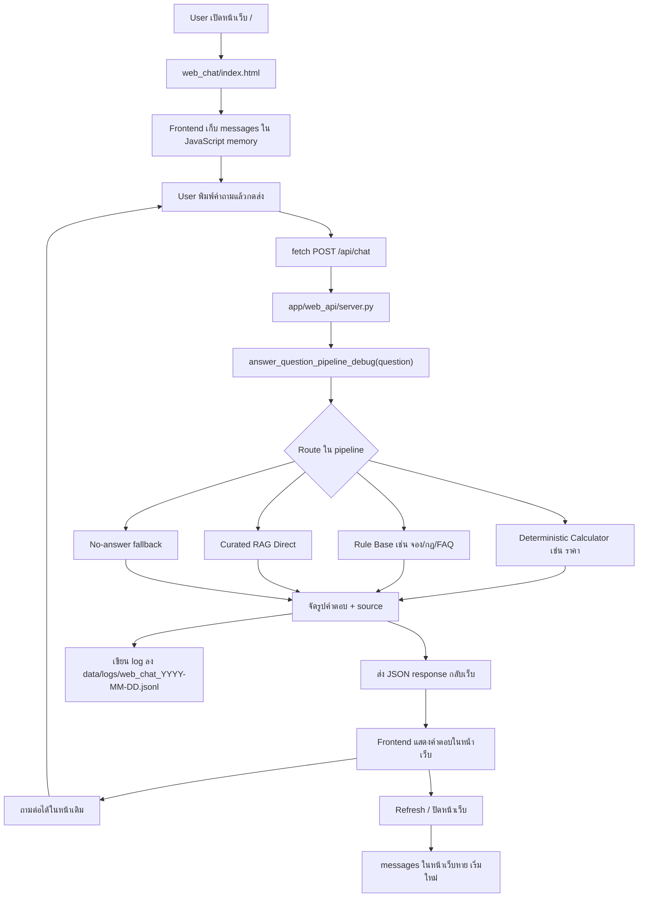

# Web Chat API Flow

เอกสารนี้อธิบาย flow ของเว็บแชท MVP ที่เพิ่มเข้ามา เพื่อให้พิมพ์คำถามบนเว็บแล้วเรียก API ไปยัง answer pipeline เดิมได้

## ไฟล์ที่เพิ่ม

```text
C:\Users\Chokhun\Downloads\Learn-LLM\18_PSU_Esports_Update_Route_Data\app\web_api\server.py
C:\Users\Chokhun\Downloads\Learn-LLM\18_PSU_Esports_Update_Route_Data\web_chat\index.html
C:\Users\Chokhun\Downloads\Learn-LLM\18_PSU_Esports_Update_Route_Data\web_chat\styles.css
C:\Users\Chokhun\Downloads\Learn-LLM\18_PSU_Esports_Update_Route_Data\web_chat\app.js
```

## Diagram



## วิธีรัน

เปิด PowerShell:

```powershell
cd "C:\Users\Chokhun\Downloads\Learn-LLM\18_PSU_Esports_Update_Route_Data"
py -3 -m app.web_api.server --host 127.0.0.1 --port 8018
```

แล้วเปิด:

```text
http://127.0.0.1:8018/
```

## API

### POST /api/chat

Request:

```json
{
  "question": "เด็ก สจล เล่น VR เท่าไหร่",
  "client_session_id": "browser-temp-uuid",
  "recent_history": [],
  "debug": true
}
```

Response:

```json
{
  "ok": true,
  "answer": "ราคา VR สำหรับกลุ่ม ...",
  "mode": "pipeline:deterministic_calculator_fast",
  "route_category": "service_fee",
  "route_intent": "service_fee_query",
  "confidence": 0.97,
  "latency_sec": 0.01,
  "sources": [
    {
      "id": "service_fee_image_2026",
      "url": "https://esports.computing.psu.ac.th/wp-content/uploads/2026/01/PSU-Esports-Studio-phuket-SERVICE-FEE-2026.png"
    }
  ],
  "validation_ok": true
}
```

## ประวัติแชท

ตอนนี้หน้าเว็บเก็บประวัติไว้ใน JavaScript memory เท่านั้น

ผลลัพธ์:

- คุยต่อในหน้าเดิมได้
- กดล้างแชทแล้วหาย
- refresh หน้าเว็บแล้วหาย
- ปิดหน้าเว็บแล้วหาย
- backend ยังเก็บ log แยกไว้ที่ `data/logs`

## สิ่งที่ยังไม่ได้ทำในรอบนี้

- ยังไม่ได้ทำ Context Resolver สำหรับคำถามต่อเนื่องแบบ "แล้ว 1 ชั่วโมงล่ะ"
- ยังไม่ได้ทำ session memory ฝั่ง server
- ยังไม่ได้ทำ Dockerfile
- ยังไม่ได้ทำ authentication หรือ admin dashboard

รอบนี้ตั้งใจทำให้เว็บเรียก API และถามตอบได้ก่อน
