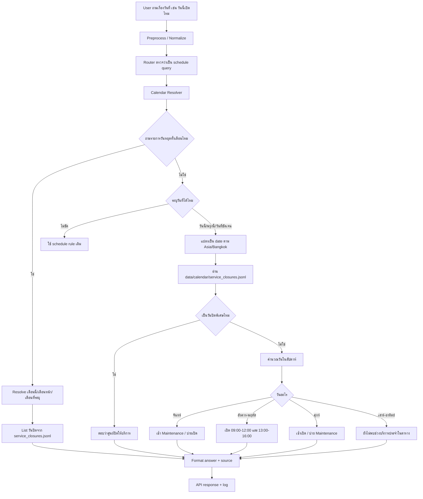

# Calendar + Holiday Pipeline

เอกสารนี้สรุปการเพิ่มความสามารถให้ chatbot รู้วันที่ปัจจุบัน และตอบคำถามเรื่องวันนี้/พรุ่งนี้/วันที่ระบุ/วันหยุดราชการได้

## เป้าหมาย

ให้ระบบตอบคำถามแนวนี้ได้:

```text
วันนี้เปิดไหม
พรุ่งนี้เปิดไหม
28 กรกฎา เปิดไหม
30/7/2026 ศูนย์เปิดรึเปล่า
วันนี้วันอะไร
วันหยุดราชการเปิดไหม
วันไหนหยุดบ้างในเดือนนี้
เดือนนี้ศูนย์ปิดวันไหนบ้าง
```

โดยต้องดู 2 ชั้น:

1. วันปิดพิเศษ/วันหยุดราชการ
2. ตารางเปิด-ปิดปกติของศูนย์

วันปิดพิเศษต้องมีสิทธิ์ override ตารางปกติ เช่น 28-30 กรกฎาคม 2026 ถ้าเป็นวันหยุดราชการ ศูนย์ต้องปิด ถึงแม้ตามตารางปกติวันอังคาร-พฤหัสบดีจะเปิดก็ตาม

## ไฟล์ที่เพิ่ม/แก้

```text
C:\Users\Chokhun\Downloads\Learn-LLM\18_PSU_Esports_Update_Route_Data\app\calendar\service_calendar.py
C:\Users\Chokhun\Downloads\Learn-LLM\18_PSU_Esports_Update_Route_Data\data\calendar\service_closures.jsonl
C:\Users\Chokhun\Downloads\Learn-LLM\18_PSU_Esports_Update_Route_Data\app\runtime\fast_answer.py
C:\Users\Chokhun\Downloads\Learn-LLM\18_PSU_Esports_Update_Route_Data\app\pipeline\router.py
C:\Users\Chokhun\Downloads\Learn-LLM\18_PSU_Esports_Update_Route_Data\app\web_api\server.py
C:\Users\Chokhun\Downloads\Learn-LLM\18_PSU_Esports_Update_Route_Data\web_chat\index.html
C:\Users\Chokhun\Downloads\Learn-LLM\18_PSU_Esports_Update_Route_Data\web_chat\app.js
```

## Diagram



## Local Calendar Config

วันปิดพิเศษเก็บไว้ที่:

```text
data/calendar/service_closures.jsonl
```

รูปแบบ:

```json
{"date":"2026-07-28","title":"วันหยุดราชการ","status":"closed","note":"ศูนย์ปิดให้บริการตามวันหยุดราชการ/วันปิดพิเศษที่ระบุไว้ในระบบ","source":"manual_admin_config"}
```

ตอนนี้เพิ่มไว้แล้ว:

```text
2026-07-28 closed
2026-07-29 closed
2026-07-30 closed
```

หมายเหตุ: ข้อมูลนี้เป็น manual admin config ควรให้ศูนย์หรือผู้ดูแลยืนยันก่อนใช้ production

## คำตอบตัวอย่าง

### วันนี้เปิดไหม

ถ้าวันนี้ของระบบคือ 02/07/2026:

```text
วันนี้ 02/07/2026 (วันพฤหัสบดี): วันพฤหัสบดีเปิดให้เล่น 09:00-12:00 และ 13:00-16:00
วันที่อ้างอิงของระบบ: วันนี้คือ 02/07/2026 (วันพฤหัสบดี) ตามเวลาไทย
```

### 28 กรกฎา เปิดไหม

```text
วันที่ 28/07/2026 (วันอังคาร): ศูนย์ปิดให้บริการ (วันหยุดราชการ)
ศูนย์ปิดให้บริการตามวันหยุดราชการ/วันปิดพิเศษที่ระบุไว้ในระบบ
หมายเหตุ: วันปิดพิเศษ/วันหยุดราชการจะ override ตารางเปิดปิดปกติ
```

### วันไหนหยุดบ้างในเดือนนี้

ถ้าวันที่อ้างอิงของระบบคือ 02/07/2026:

```text
เดือนกรกฎาคม 2026 มีวันปิดให้บริการ 3 วัน:
- 28/07/2026 (วันอังคาร): วันหยุดราชการ
- 29/07/2026 (วันพุธ): วันหยุดราชการ
- 30/07/2026 (วันพฤหัสบดี): วันหยุดราชการ
```

## API ภายนอกสำหรับวันหยุด ใช้ดีไหม

ใช้ได้ แต่ไม่ควรเรียก API ภายนอกทุกครั้งที่ user ถาม

### ปัญหาถ้าเรียกทุกคำถาม

- latency เพิ่ม อาจเพิ่มตั้งแต่หลัก 100ms ถึงหลายวินาทีตาม network
- ถ้า API ล่ม ระบบตอบวันหยุดไม่ได้
- ถ้าเครื่อง deploy ไม่มี internet จะพัง
- อาจติด rate limit
- ข้อมูลวันหยุดของแต่ละ API อาจไม่ตรงกับวันที่ศูนย์ปิดจริง
- วันปิดของศูนย์อาจไม่ใช่วันหยุดราชการทั้งหมด เช่น ปิดซ่อม ปิดกิจกรรม ปิดเฉพาะช่วงเวลา

### แนวทางที่เหมาะ

ใช้ local cache เป็นหลัก:

```text
External/Public Holiday API
-> sync เป็นรอบ เช่น วันละครั้ง/เดือนละครั้ง
-> admin ตรวจ/แก้
-> save ลง data/calendar/service_closures.jsonl หรือ database
-> runtime chatbot อ่านจาก local cache
```

ข้อดี:

- ตอน user ถามจะเร็วมาก
- ไม่มี dependency ต่อ internet ระหว่างตอบ
- admin override ได้
- เหมาะกับ Docker/local deployment

## Production Recommendation

สำหรับ MVP:

```text
ใช้ data/calendar/service_closures.jsonl แบบ manual
```

สำหรับ production:

```text
ใช้ database table service_calendar_closures
มี admin UI หรือ CSV upload
มี scheduled sync จาก holiday source
แต่ตอนตอบ user อ่านจาก local database/cache เท่านั้น
```

Schema ที่แนะนำ:

```json
{
  "date": "2026-07-28",
  "status": "closed",
  "title": "วันหยุดราชการ",
  "open_slots": [],
  "note": "ศูนย์ปิดให้บริการ",
  "source": "admin",
  "updated_at": "2026-07-02T20:00:00+07:00"
}
```

ถ้าปิดแค่บางช่วงเวลา:

```json
{
  "date": "2026-08-05",
  "status": "partial",
  "closed_slots": ["afternoon"],
  "open_slots": ["morning"],
  "note": "ปิดช่วงบ่ายเพื่อตรวจอุปกรณ์"
}
```

## Test

เพิ่ม test ใน:

```text
tests/smoke_test_answer_pipeline.py
```

โดย fix วันที่ระบบด้วย:

```text
PSU_ESPORTS_TODAY=2026-07-02
```

คำถามที่ test:

```text
วันนี้เปิดไหม
พรุ่งนี้เปิดไหม
28 กรกฎา เปิดไหม
30/7/2026 ศูนย์เปิดรึเปล่า
วันไหนหยุดบ้างในเดือนนี้
เดือนนี้ศูนย์ปิดวันไหนบ้าง
```

ผลที่คาดหวัง:

- วันนี้ = 02/07/2026 วันพฤหัสบดี เปิด 09:00-12:00 และ 13:00-16:00
- พรุ่งนี้ = 03/07/2026 วันศุกร์ เช้าเปิด บ่าย Maintenance
- 28/07/2026 = ปิดให้บริการ
- 30/07/2026 = ปิดให้บริการ
- เดือนกรกฎาคม 2026 = มีวันปิด 3 วัน คือ 28, 29, 30 กรกฎาคม

## สิ่งที่ควรทำต่อ

- เพิ่มรายการวันหยุด/วันปิดจริงจากศูนย์ให้ครบทั้งปี
- เพิ่ม partial closure ถ้าปิดบางช่วง
- เพิ่มคำถามภาษาอังกฤษ เช่น "Are you open today?"
- เพิ่ม Context Resolver ให้ถามต่อได้ เช่น "แล้วพรุ่งนี้ล่ะ"
- ทำ admin update flow สำหรับเพิ่มวันปิดโดยไม่แก้โค้ด
