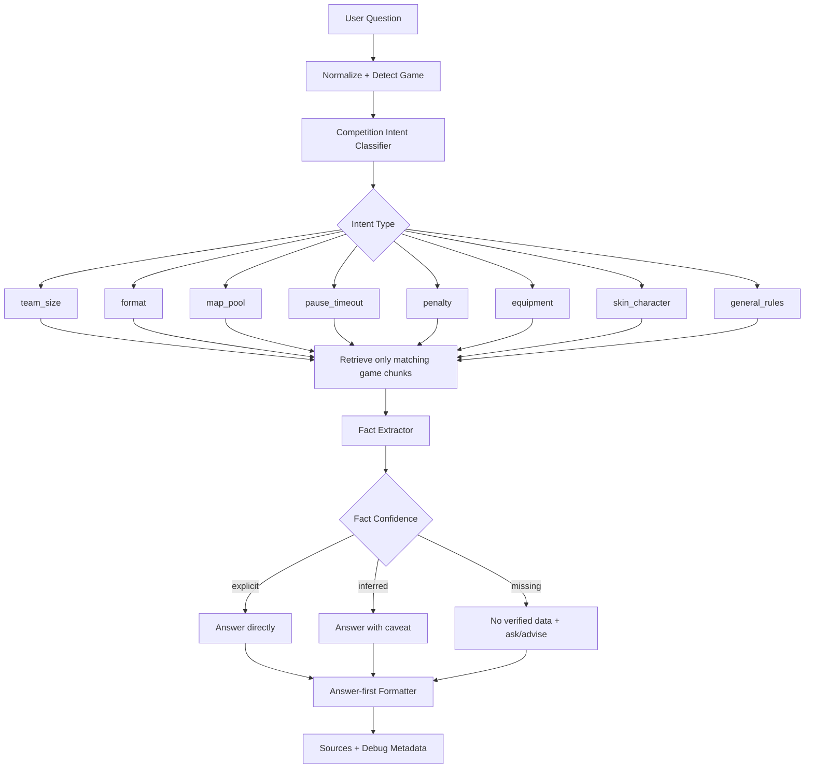

# Competition Rules QA Quality Pipeline

เอกสารนี้สรุปปัญหาที่พบหลังเพิ่มข้อมูลกติกาการแข่งขัน และ pipeline ที่ควรทำต่อเพื่อให้ chatbot ตอบคำถามกติกาแข่งได้ตรงประเด็น ถูกต้อง และอ่านเป็นธรรมชาติขึ้น

## ปัญหาที่พบ

ตัวอย่างคำถาม:

```text
สมาชิกในทีม ROV ต้องมีกี่คน
```

คำตอบเดิม:

```text
คำตอบ: 4. ระเบียบและกติกาการแข่งขัน
```

ปัญหานี้เกิดจากหลายสาเหตุรวมกัน:

1. Retrieval ดึงหัวข้อกว้างแทนข้อเท็จจริง
2. เอกสาร RoV ไม่ได้ระบุคำว่า "สมาชิกในทีมมีกี่คน" ตรงๆ
3. ข้อมูลที่ใกล้ที่สุดคือคำว่า "การแข่งขัน 5v5"
4. ระบบยังไม่ได้แยกชนิดคำถามละเอียดพอ เช่น ถามจำนวนคน, ถามบทลงโทษ, ถาม map pool
5. answer formatter เดิมยังเอา chunk แรกมาตอบตรงๆ มากเกินไป

## หลักคิดใหม่

คำตอบหมวดกติกาการแข่งขันต้องแยก 3 แบบ:

```text
1. Explicit Fact
   ข้อมูลมีระบุชัด เช่น CS2 ทีมละ 5 คน

2. Inferred Fact
   ข้อมูลไม่ได้บอกตรงๆ แต่สรุปจากกติกาได้ เช่น RoV ระบุ 5v5 จึงลงแข่งพร้อมกันฝ่ายละ 5 คน

3. Missing Fact
   ข้อมูลไม่มีจริง ต้องตอบว่าไม่พบข้อมูลที่ยืนยันได้ และไม่เดา
```

ตัวอย่างที่ดี:

```text
คำตอบ: ไฟล์กติกา RoV ระบุว่าแข่งขันในโหมด 5v5 จึงยืนยันได้ว่าลงแข่งพร้อมกันฝ่ายละ 5 คน แต่ยังไม่พบจำนวนสมาชิกทีมรวมหรือตัวสำรองที่ระบุชัดเจนในไฟล์นี้

รายละเอียดที่เกี่ยวข้อง:
- ผู้เข้าแข่งขันทุกคนต้องมีฮีโร่อย่างน้อย 18 ตัว สำหรับการเข้าแข่งขันในโหมด “การแข่งขัน 5v5”

อ้างอิงจากกติกา: Arena of Valor (RoV) / Blueket Games 2025 ประเภททีมชาย
```

## Pipeline ที่ควรใช้



## Stage 1: Detect Game

ต้องจับชื่อเกมก่อน เพื่อกันข้อมูลข้ามเกม

```text
CS2 -> Counter-Strike 2
VALORANT / วาโล -> VALORANT
RoV / Arena of Valor / AOV / Blueket -> Arena of Valor (RoV)
Tekken / Tekken 8 -> Tekken 8
```

ถ้าถามกติกาแต่ไม่ระบุเกม:

```text
หมายถึงกติกาของเกมไหนครับ เช่น CS2, VALORANT, RoV หรือ Tekken 8
```

## Stage 2: Detect Intent

ควรแยก intent เช่น:

```text
team_size: ทีมละกี่คน, สมาชิกกี่คน, ผู้เล่นกี่คน
format: แข่งแบบไหน, BO3 ไหม, FT2 คืออะไร
map_pool: ใช้ map อะไร, map pool มีอะไรบ้าง
pause_timeout: pause ได้กี่ครั้ง, technical timeout
penalty: ทำผิดโดนอะไร, มาสายโดนอะไร, โกงโดนอะไร
equipment: ใช้เครื่องอะไร, เอาอุปกรณ์มาเองได้ไหม
skin_character: ใช้สกินได้ไหม, ตัวละคร DLC ได้ไหม
eligibility: ใครสมัครได้, คุณสมบัติผู้เล่น
schedule: แข่งวันไหน, รายงานตัวกี่โมง
```

## Stage 3: Retrieve

หลักการ retrieve:

- filter ด้วยเกมก่อน
- boost chunk ที่ตรง intent
- ไม่เลือกหัวข้อกว้างถ้ามีบรรทัด fact ที่ตรงกว่า
- ถ้า top hit เป็น heading อย่างเดียว ให้เลื่อนไปใช้ hit ถัดไป

ตัวอย่าง:

```text
ถาม: สมาชิกในทีม ROV ต้องมีกี่คน
ควรดึง: บรรทัดที่มี "5v5"
ไม่ควรดึง: "4. ระเบียบและกติกาการแข่งขัน"
```

## Stage 4: Fact Extraction

หลัง retrieve แล้ว ต้อง extract ข้อเท็จจริง ไม่ใช่ตอบทั้ง chunk

ตัวอย่าง rules:

```text
team_size:
  ถ้ามี "ผู้เล่น 5 คน" -> explicit fact
  ถ้ามี "5v5" -> inferred fact ว่าลงแข่งพร้อมกันฝ่ายละ 5 คน
  ถ้าไม่มี -> missing fact

map_pool:
  ดึงชื่อ map ทั้งหมดเป็น list

penalty:
  ดึงบรรทัดที่มี "ปรับแพ้", "ตัดสิทธิ์", "แบน"

pause:
  ดึงจำนวนครั้ง + เวลา เช่น 2 ครั้ง, 60 วินาที
```

## Stage 5: Answer Formatter

รูปแบบคำตอบที่ควรใช้:

```text
คำตอบ: ...

รายละเอียดที่เกี่ยวข้อง:
- ...

อ้างอิงจากกติกา: เกม / รายการ
แหล่งข้อมูล: ...
```

ถ้าเป็น inferred fact:

```text
คำตอบ: จากข้อมูลที่มี ระบุว่าเป็นโหมด 5v5 จึงสรุปได้ว่าลงแข่งพร้อมกันฝ่ายละ 5 คน แต่ยังไม่พบจำนวนสมาชิกทีมรวมหรือตัวสำรองที่ระบุชัดเจน
```

ถ้าไม่มีข้อมูล:

```text
คำตอบ: ยังไม่พบข้อมูลที่ยืนยันได้ในไฟล์กติกาว่าทีมสามารถมีตัวสำรองได้กี่คนครับ
ข้อมูลที่พบมีเพียง...
```

## Stage 6: Test Set

ต้องทำ Ground Truth เฉพาะกติกาแข่งเพิ่ม

ตัวอย่าง:

```json
{
  "question": "สมาชิกในทีม ROV ต้องมีกี่คน",
  "expected": ["5v5", "ฝ่ายละ 5 คน", "ยังไม่พบจำนวนสมาชิกทีม"],
  "category": "competition_rules",
  "intent": "team_size",
  "answer_policy": "inferred_fact"
}
```

ชุดคำถามที่ควรเพิ่ม:

```text
CS2 ทีมละกี่คน
CS2 ใช้ map อะไรบ้าง
CS2 ขอ technical pause ได้กี่ครั้ง
VALORANT timeout ได้กี่ครั้ง
VALORANT map pool มีอะไรบ้าง
VALORANT ถ้าใช้ exploit โดนอะไร
RoV สมาชิกทีมกี่คน
RoV ใช้สกินได้ไหม
RoV เริ่มแข่งช้า 15 นาทีโดนอะไร
Tekken 8 เล่นแบบไหน
Tekken 8 ใช้ DLC character ได้ไหม
Tekken 8 pause ได้ไหม
```

## สิ่งที่แก้แล้วตอนนี้

- เพิ่ม game filter สำหรับ competition rules
- เพิ่ม Thai n-gram tokenizer
- เพิ่ม answer-first formatter สำหรับ competition rules
- เพิ่ม intent สำหรับ team size / timeout / map pool / skin / equipment / penalty / late start
- แก้เคส RoV team size ให้ตอบจาก 5v5 พร้อม caveat
- เพิ่ม smoke test กันไม่ให้ตอบหัวข้อกว้าง

## สิ่งที่ควรทำต่อ

1. สร้าง `competition_rule_fact_cards.jsonl`

แยก fact สำคัญออกจากเอกสารเป็นบัตรข้อมูล เช่น:

```json
{
  "id": "rov_team_size_active_players",
  "game": "Arena of Valor (RoV)",
  "intent": "team_size",
  "answer_type": "inferred_fact",
  "answer": "แข่งขันโหมด 5v5 จึงลงแข่งพร้อมกันฝ่ายละ 5 คน แต่ยังไม่พบจำนวนสมาชิกทีมรวมหรือตัวสำรอง",
  "evidence": "ผู้เข้าแข่งขันทุกคนต้องมีฮีโร่อย่างน้อย 18 ตัว สำหรับการเข้าแข่งขันในโหมด การแข่งขัน 5v5"
}
```

2. ทำ Ground Truth หมวดกติกาแข่ง 100-200 ข้อ

3. ทำ evaluator ที่แยก `explicit / inferred / missing`

4. ทำ fallback ที่สุภาพเมื่อข้อมูลไม่มีจริง

5. ทำ admin flow สำหรับเพิ่ม/แก้ fact card ได้ โดยไม่ต้องแก้โค้ด

## สรุป

ปัญหาหลักไม่ใช่แค่ retrieval แต่เป็น data modeling ด้วย

ถ้าจะให้ตอบกติกาการแข่งขันดีจริง ควรมีทั้ง:

- raw document chunks สำหรับ RAG
- fact cards สำหรับคำถามที่พบบ่อยและต้องแม่น
- answer policy สำหรับตอบตรงประเด็น
- test set สำหรับกัน regression

## Update 2026-07-02: Fact Card First Implemented

ทำตาม pipeline นี้แล้วในรอบล่าสุด โดยเพิ่มชั้น `competition_rule_fact_cards.jsonl` และให้ระบบหมวด `competition_rules` ตรวจ fact card ก่อนเข้า curated RAG

ไฟล์ที่เพิ่ม:

```text
data/competition_rules/competition_rule_fact_cards.jsonl
docs/16_competition_fact_cards_flow_update.md
```

ไฟล์โค้ดที่ปรับ:

```text
app/pipeline/retrieval.py
app/pipeline/engine.py
app/pipeline/router.py
tests/smoke_test_answer_pipeline.py
```

Flow ใหม่:

```text
User question
-> preprocess
-> route_intent
-> if competition_rules: retrieve_competition_fact_cards
-> if confident: answer_from_competition_fact_hits
-> else: retrieve_curated + answer_from_curated_hits
-> else: no_answer
```

mode ใหม่:

```text
pipeline:competition_fact_card
```

ผลที่ได้:

- เคสกติกาที่มีคำตอบชัดตอบเร็วขึ้นมาก เพราะไม่ต้องใช้ LLM
- คำตอบเริ่มด้วยคำตอบหลักก่อน เช่น จำนวนคน/จำนวนครั้ง/ราคา/ข้อห้าม
- มี evidence และ source ต่อท้าย
- เคส RoV team size ตอบแบบ inferred fact: ยืนยัน 5v5 และฝ่ายละ 5 คน แต่ไม่ฟันธงจำนวน roster รวม/ตัวสำรอง เพราะไฟล์ไม่ได้ระบุ
- ยัง fallback ไป curated RAG ได้เมื่อไม่มี fact card

ดูรายละเอียดเต็มได้ที่:

```text
docs/16_competition_fact_cards_flow_update.md
```
