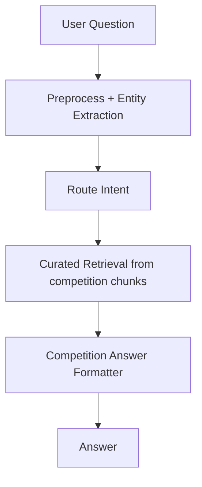
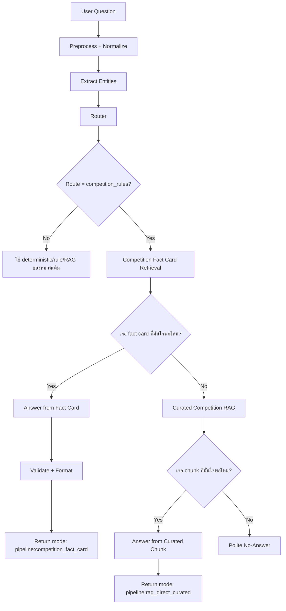

# Competition Rules Fact Card Flow Update

วันที่อัปเดต: 2026-07-02

เอกสารนี้สรุปการพัฒนา flow ภายในของ Chatbot สำหรับคำถามหมวดกติกาการแข่งขัน เช่น CS2, VALORANT, RoV และ Tekken 8 หลังจากพบว่าการใช้ curated RAG อย่างเดียวบางครั้งดึงหัวข้อกว้างหรือ chunk ที่ไม่ตรงคำถาม ทำให้คำตอบดูแปลก เช่น ถามจำนวนสมาชิกทีม RoV แต่ตอบหัวข้อเอกสารแทน

## เป้าหมาย

ทำให้คำถามกติกาการแข่งขันตอบได้:

- ตรงคำถามมากขึ้น
- เริ่มด้วยคำตอบที่ user ต้องการก่อน
- มีหลักฐานอ้างอิงจากไฟล์กติกา
- ไม่มั่วในกรณีข้อมูลไม่ชัด
- เร็วกว่า RAG/LLM เพราะใช้ fact card ก่อน
- ขยายต่อได้ง่ายเมื่อมีไฟล์กติกาใหม่

## ปัญหาก่อนแก้

เดิม flow ของหมวด `competition_rules` เป็นแบบนี้:



ข้อดีคือรองรับคำถามกว้างๆ จากเอกสารจริง แต่ข้อเสียคือ:

- เอกสารเป็น chunk จากหัวข้อย่อย บาง chunk มีแค่ชื่อหัวข้อ ไม่ใช่คำตอบ
- คำถามที่ต้องการตัวเลข/กฎสั้นๆ เช่น "ทีมละกี่คน" อาจไปเจอหัวข้อทั่วไป
- ข้อมูลบางอย่างเป็น implicit เช่น RoV มี 5v5 แต่ไม่ได้เขียนจำนวน roster รวม
- formatter ต้องเดาจาก text lines ทำให้บางครั้งตอบไม่ครบหรือตอบกว้างเกิน
- ไม่มี data layer ที่บอกชัดว่า fact ไหนเป็น explicit, inferred หรือ missing

## สิ่งที่เพิ่ม

เพิ่มไฟล์ fact card:

```text
data/competition_rules/competition_rule_fact_cards.jsonl
```

ไฟล์นี้เก็บคำตอบสำคัญของกติกาการแข่งขันในรูปแบบ structured data โดยแต่ละบรรทัดคือ 1 fact card

ตัวอย่าง schema:

```json
{
  "id": "rov_team_size_active_players",
  "category": "competition_rule_fact",
  "game": "Arena of Valor (RoV)",
  "tournament": "Blueket Games 2025 ประเภททีมชาย",
  "intent": "team_size",
  "answer_type": "inferred_fact",
  "question_patterns": [
    "สมาชิกในทีม ROV ต้องมีกี่คน",
    "RoV ทีมละกี่คน"
  ],
  "answer": "ไฟล์กติกา RoV ระบุว่าแข่งขันในโหมด 5v5 จึงยืนยันได้ว่าลงแข่งพร้อมกันฝ่ายละ 5 คน แต่ยังไม่พบจำนวนสมาชิกทีมรวมหรือตัวสำรองที่ระบุชัดเจนในไฟล์นี้",
  "evidence": "เอกสารระบุการเข้าแข่งขันในโหมดการแข่งขัน 5v5 แต่ไม่ได้ระบุจำนวน roster รวม/ตัวสำรองแบบชัดเจน",
  "source_url": "local://competition_rules/competition_rules_rov_blueket_2025_men",
  "tags": ["competition_rules", "rov", "team_size", "5v5"]
}
```

## Flow ใหม่

หลังแก้แล้ว flow ของหมวดกติกาการแข่งขันเป็นแบบนี้:



## เหตุผลที่ตอบเร็วขึ้น

คำถามที่ match fact card ไม่ต้องเรียก LLM และไม่ต้องค้นเอกสารยาวๆ แบบเต็มรูปแบบ

สิ่งที่เกิดขึ้นจริง:

1. ตรวจ game จากคำ เช่น `CS2`, `VALORANT`, `RoV`, `Tekken`
2. ตรวจ intent จากคำ เช่น `ทีมละกี่คน`, `timeout`, `map`, `skin`, `DLC`
3. ให้คะแนน fact card จาก game + intent + token overlap + question pattern
4. ถ้าคะแนนถึง threshold จะตอบจาก fact card ทันที
5. ถ้าไม่มั่นใจค่อย fallback ไป curated RAG

ดังนั้นคำถามที่ชัด เช่น `Tekken 8 ใช้ DLC character ได้ไหม` จะตอบได้เร็วมาก เพราะเจอ fact card ตรงๆ

## Intent ที่รองรับใน Fact Cards

ตอนนี้เพิ่ม intent หลักเหล่านี้:

- `team_size`: จำนวนผู้เล่น/สมาชิกทีม
- `map_pool`: แผนที่ที่ใช้แข่งขัน
- `pause`: pause, timeout, technical pause, disconnect
- `skin`: สกิน/Default Skin
- `equipment`: เครื่องหรืออุปกรณ์ที่ใช้แข่ง
- `late_start`: มาสาย/เริ่มช้า/เกิน 15 นาที
- `format`: รูปแบบการแข่งขัน เช่น BO3, FT2, 1v1
- `character`: ตัวละคร, agent, DLC
- `rematch`: remake, rematch, First Blood

## Fact Cards ที่เพิ่มแล้ว

### Counter-Strike 2

- `cs2_team_size_players`: ทีมละ 5 คน
- `cs2_map_pool`: Ancient, Anubis, Dust 2, Inferno, Mirage, Nuke, Train
- `cs2_format_single_elim_bo3`: Single Elimination, รอบรอง/รอบชิง BO3
- `cs2_pause_policy`: Technical Pause ทีมละ 2 ครั้ง รวมไม่เกิน 10 นาที และ Tactical Timeout ทีมละ 4 ครั้ง ครั้งละ 30 วินาที

### VALORANT

- `valorant_team_size_players`: ทีมละ 5 คน
- `valorant_map_pool`: Abyss, Ascent, Bind, Corrode, Haven, Lotus, Sunset
- `valorant_tactical_timeout`: Tactical Timeout ทีมละ 2 ครั้งต่อแผนที่ ครั้งละ 60 วินาที และ Overtime เพิ่ม 1 ครั้ง
- `valorant_emergency_pause`: Emergency/Technical Pause ทีมละ 1 ครั้งต่อแผนที่ รวมสูงสุด 10 นาที
- `valorant_agent_map_restriction`: Agent ใหม่รอประมาณ 2 สัปดาห์, map ใหม่รอประมาณ 4 สัปดาห์

### Arena of Valor (RoV)

- `rov_team_size_active_players`: ยืนยันได้ว่าลงแข่งพร้อมกันฝ่ายละ 5 คนจากโหมด 5v5 แต่ยังไม่พบจำนวน roster รวม/ตัวสำรอง
- `rov_skin_default_only`: ใช้เฉพาะ Default Skin
- `rov_late_start_forfeit`: เริ่มช้าเกิน 15 นาที ถูกปรับแพ้ในรอบนั้น
- `rov_pause_disconnect`: หยุดเกมได้สูงสุด 5 ครั้ง ครั้งละไม่เกิน 1 นาที
- `rov_rematch_first_blood`: ขอแข่งใหม่ได้ก่อน First Blood และก่อน 2 นาที
- `rov_device_mobile_only`: ใช้โทรศัพท์มือถือ ไม่อนุญาต Tablet/iPad

### Tekken 8

- `tekken8_format_ps5_1v1`: Offline, PS5, 1v1, FT2, R3, 60 วินาที
- `tekken8_equipment_ps5`: แข่งขันบน PlayStation 5
- `tekken8_character_dlc_rule`: ใช้ตัวละครได้ทุกตัวยกเว้น DLC และห้าม customization
- `tekken8_pause_penalty`: ห้าม Pause หลังเริ่มเกม ถ้าตั้งใจกดหยุดจะถูกปรับแพ้ 1 Round

## Output Policy ใหม่

คำตอบจาก fact card จะใช้รูปแบบ:

```text
คำตอบ: ...

หลักฐานจากกติกา:
- ...

หมายเหตุ: ...  # เฉพาะกรณี inferred_fact

อ้างอิงจากกติกา: เกม / รายการ
แหล่งข้อมูล: local://competition_rules/...
```

หลักคือให้ตอบสิ่งที่ user ถามไว้บรรทัดแรกก่อน แล้วค่อยให้หลักฐานและแหล่งข้อมูลด้านล่าง

## ตัวอย่างผลลัพธ์หลังแก้

คำถาม:

```text
สมาชิกในทีม ROV ต้องมีกี่คน
```

คำตอบ:

```text
คำตอบ: ไฟล์กติกา RoV ระบุว่าแข่งขันในโหมด 5v5 จึงยืนยันได้ว่าลงแข่งพร้อมกันฝ่ายละ 5 คน แต่ยังไม่พบจำนวนสมาชิกทีมรวมหรือตัวสำรองที่ระบุชัดเจนในไฟล์นี้

หลักฐานจากกติกา:
- เอกสารระบุการเข้าแข่งขันในโหมดการแข่งขัน 5v5 แต่ไม่ได้ระบุจำนวน roster รวม/ตัวสำรองแบบชัดเจน

หมายเหตุ: คำตอบนี้เป็นการสรุปจากข้อมูลที่มีในไฟล์กติกา ไม่ใช่ข้อมูล roster/ตัวสำรองที่ระบุเป็นตัวเลขแยกไว้

อ้างอิงจากกติกา: Arena of Valor (RoV) / Blueket Games 2025 ประเภททีมชาย
แหล่งข้อมูล: local://competition_rules/competition_rules_rov_blueket_2025_men
```

## ไฟล์โค้ดที่แก้

- `app/pipeline/retrieval.py`
  - เพิ่ม `load_competition_fact_cards()`
  - เพิ่ม `retrieve_competition_fact_cards()`
  - เพิ่ม `answer_from_competition_fact_hits()`
  - เพิ่ม game/intent scoring สำหรับ fact card

- `app/pipeline/engine.py`
  - เพิ่มขั้นตอน fact-card-first ก่อน curated RAG สำหรับ `competition_rules`
  - mode ใหม่คือ `pipeline:competition_fact_card`

- `app/pipeline/router.py`
  - เพิ่มคำ route เช่น `character`, `dlc`, `stage`, `rematch`, `first blood`

- `tests/smoke_test_answer_pipeline.py`
  - เพิ่ม test ให้เคสกติกาสำคัญต้องผ่าน `pipeline:competition_fact_card`
  - เพิ่มเคส CS2 technical pause, Tekken 8 DLC character, RoV iPad

## ผลทดสอบ

คำสั่งที่รัน:

```powershell
py -3 -m py_compile app\pipeline\retrieval.py app\pipeline\engine.py app\pipeline\router.py
py -3 tests\smoke_test_answer_pipeline.py
py -3 tests\smoke_test_fast_runtime.py
```

ผลลัพธ์:

- Syntax ผ่าน
- `ANSWER QUALITY PIPELINE SMOKE TEST OK`
- `FAST RUNTIME SMOKE TEST OK`
- API local ที่ `http://127.0.0.1:8018/api/chat` ตอบเคส fact card ได้แล้ว

ตัวอย่าง latency ผ่าน API:

- `สมาชิกในทีม ROV ต้องมีกี่คน`: mode `pipeline:competition_fact_card`, ประมาณ 0.0157 วินาที
- `CS2 technical pause ได้กี่ครั้ง`: mode `pipeline:competition_fact_card`, ประมาณ 0.0159 วินาที
- `Tekken 8 ใช้ DLC character ได้ไหม`: mode `pipeline:competition_fact_card`, ประมาณ 0.0179 วินาที
- `VALORANT แผนที่ที่ใช้แข่งมีอะไรบ้าง`: mode `pipeline:competition_fact_card`, ประมาณ 0.0100 วินาที

## สิ่งที่ควรพัฒนาต่อ

1. เพิ่ม fact card ให้ครบทุกหัวข้อในไฟล์กติกา

ตอนนี้ครอบคลุมคำถามสำคัญ แต่ยังควรเพิ่มหัวข้อ:

- คุณสมบัติผู้สมัคร/ผู้เข้าแข่งขัน
- การเช็คอิน/รายงานตัวก่อนแข่ง
- การประท้วง/ยื่นเรื่อง
- การสื่อสารผ่าน Discord
- การใช้อุปกรณ์ส่วนตัว
- ข้อห้ามเรื่อง bug/exploit
- การตั้งค่าห้องแข่ง
- รูปแบบการ ban/pick map
- การตัดสินกรณี disconnect เพิ่มเติม

2. เพิ่ม `answer_type`

ตอนนี้ใช้หลักๆ:

- `explicit_fact`: เอกสารระบุชัด
- `inferred_fact`: สรุปจากข้อมูลที่มี แต่ไม่ได้เขียนตรงๆ

ควรเพิ่ม:

- `missing_fact`: เอกสารไม่ระบุ ควรถามผู้ดูแล
- `policy_required`: ต้องให้ศูนย์ยืนยัน เพราะเป็นนโยบาย
- `calculation_fact`: ต้องคำนวณจากกติกาหลายข้อ

3. เพิ่ม evaluator เฉพาะกติกาการแข่งขัน

ควรทำ ground truth สำหรับ competition rules เพิ่ม 100-200 ข้อ แยกตาม intent เช่น:

- team_size
- pause
- map_pool
- equipment
- penalty
- late_start
- character
- rematch

และตัวตรวจควรดูทั้ง:

- keyword ถูกไหม
- source ถูกไหม
- answer_type ถูกไหม
- คำตอบบรรทัดแรกตอบตรงคำถามไหม
- มี caveat เมื่อข้อมูลเป็น inferred/missing ไหม

4. เพิ่ม admin/data workflow

ระยะต่อไปควรให้แก้ fact card ได้โดยไม่ต้องแก้โค้ด เช่น:

- เพิ่มไฟล์ `.jsonl`
- มี validation script ตรวจ schema
- มี test generator จาก fact card
- มีหน้าเล็กๆ ให้ผู้ดูแลตรวจ/แก้ answer/evidence

5. เพิ่ม fallback ที่สุภาพกว่านี้

เมื่อไม่พบ fact card และ curated RAG ไม่มั่นใจ ควรตอบประมาณ:

```text
ตอนนี้ยังไม่พบข้อมูลที่ยืนยันได้ในไฟล์กติกาที่มีครับ
ถ้าเป็นเรื่องนโยบายการแข่งขัน แนะนำให้ยืนยันกับผู้ดูแลรายการอีกครั้ง
```

ไม่ควรตอบเหมือนมีข้อมูลถ้า source ไม่ชัด

## สรุป

การเพิ่ม fact card ทำให้ระบบไม่ต้องพึ่ง RAG อย่างเดียวในคำถามที่ต้องการความแม่น เช่นจำนวนคน, timeout, map pool, DLC, skin และอุปกรณ์

โครงสร้างใหม่นี้เหมาะกับการใช้งานจริงมากขึ้น เพราะ:

- คำถามยอดฮิตตอบเร็ว
- คำตอบควบคุม wording ได้
- มีหลักฐานอ้างอิง
- รู้ว่าอะไรเป็น explicit หรือ inferred
- ยังมี RAG เป็น fallback สำหรับคำถามนอก fact card
