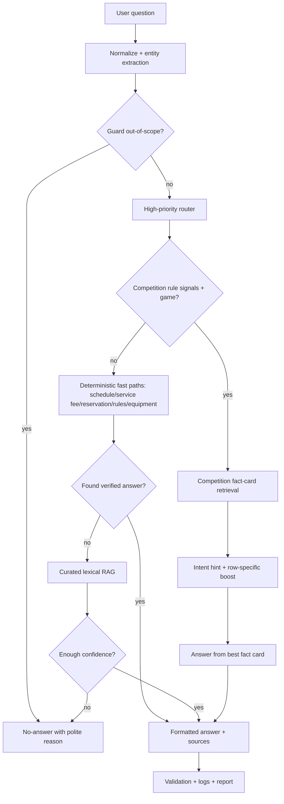

# PSU Esports Chatbot - Competition Rules Quality Pipeline Update

วันที่: 2026-07-03

## เป้าหมายรอบนี้

- ปรับให้คำถามกติกาการแข่งขันตอบตรงประเด็นก่อน ไม่หลุดไปหมวดเกม/ราคา/ตารางเวลา
- รักษาตัวตรวจให้เข้มเหมือนเดิม ไม่ผ่อน keyword/source/route
- รัน Ground Truth การแข่งขัน 228 ข้อ แล้วให้ Codex อ่านผลเรียงข้อ
- เช็ก regression กับ Ground Truth หลัก 360 ข้อ

## ปัญหาที่เจอก่อนแก้

- Route หลุด: คำถามกติกาบางข้อถูกส่งไป `games`, `service_fee`, `schedule`, `penalty`, `knowledge`
- Fact-card ผิดใบ: ถาม Emergency Pause แต่ไปตอบ Tactical Timeout, ถาม Tekken format แต่ไปตอบ equipment
- Scoring boost มีฟังก์ชันอยู่แล้วแต่ยังไม่ได้ถูกนำไปบวกใน retrieval score
- PowerShell stdin ทำให้ Thai literal ใน fact-card/report กลายเป็น `question marks` ระหว่างอัปเดตข้อมูล
- Evaluator/strict audit เช็กคำขึ้นต้นโดยไม่ตัด prefix `คำตอบ:` ทำให้คำตอบที่เริ่ม `คำตอบ: ต่างกันคือ...` ถูกมองว่าผิดรูปแบบ

## สิ่งที่แก้

1. Router
- เพิ่ม competition rule signals เช่น `1v1`, `PS5`, `PlayStation 5`, `late start`, `15 นาที`, `เกมหลุด`, `กี่ต่อกี่`
- ย้าย competition rule routing ให้อยู่ก่อน broad route เพื่อกันคำว่าเกม/ราคา/อุปกรณ์พาออกนอกหมวด

2. Retrieval
- เปิดใช้ `_competition_row_specific_boost()` จริงใน `retrieve_competition_fact_cards()`
- เพิ่ม intent hint สำหรับ `team_size`, `offline`, `pause`, `late_start`, `equipment`, `format`
- เพิ่ม negative score เมื่อคำเดียวกันทำให้สับสน เช่น Tekken `round` ในคำถาม pause ไม่ควรดึง format

3. Fact Cards
- เพิ่ม pattern ของคำถามที่เคย fail จริงให้ CS2, VALORANT, RoV, Tekken 8
- ปรับคำตอบ CS2 pause ให้ขึ้นต้นว่า `ต่างกันคือ...` เมื่อตอบความต่างของ Technical Pause/Tactical Timeout
- ปรับ priority ให้การ์ดที่เป็นคำตอบหลักชนะ retrieval
- กู้ไฟล์ `data/competition_rules/competition_rule_fact_cards.jsonl` ให้เป็น UTF-8 ถูกต้อง ไม่มีอักขระเสียจาก encoding

4. Evaluator/Strict Audit
- เพิ่มการตัด prefix แสดงผล `คำตอบ:`/`Answer:` ก่อนเช็ก must-start-with
- ยังตรวจ route, mode, source keyword, expected keyword และ direct answer เหมือนเดิม

## ผลลัพธ์สุดท้าย

- Competition GT 228: evaluator PASS 228/228
- Competition strict audit: PASS 228/228
- GT360: evaluator PASS 360/360
- GT360 strict audit: PASS 334/360, minor 26, major 0

## Minor ที่ยังเหลือใน GT360

สรุปตามหมวด:
- `reservation`: 22
- `service_fee`: 4

สาเหตุที่พบบ่อย:
- expected keyword อยู่ในคำตอบรวม แต่ไม่อยู่ในคำตอบหลัก/บรรทัดแรก: ['Monday', 'Friday']: 21
- คำถามราคา แต่บรรทัดแรกยังไม่ขึ้นราคาหรือบอกไม่พบราคา: 4
- expected keyword อยู่ในคำตอบรวม แต่ไม่อยู่ในคำตอบหลัก/บรรทัดแรก: ['Weekly hardware inspection', 'cleaning']: 1

## Pipeline หลังปรับ

## ไฟล์ผลลัพธ์สำคัญ

- `C:\Users\Chokhun\Downloads\Learn-LLM\18_PSU_Esports_Update_Route_Data\reports\pipeline_ground_truth_results_competition_rules_v1_228_final_20260703.jsonl`
- `C:\Users\Chokhun\Downloads\Learn-LLM\18_PSU_Esports_Update_Route_Data\reports\strict_ground_truth_audit_competition_rules_v1_228_final_20260703.jsonl`
- `C:\Users\Chokhun\Downloads\Learn-LLM\18_PSU_Esports_Update_Route_Data\reports\codex_manual_audit_competition_rules_v1_228_final_20260703.md`
- `C:\Users\Chokhun\Downloads\Learn-LLM\18_PSU_Esports_Update_Route_Data\reports\pipeline_ground_truth_results_gt360_final_20260703.jsonl`
- `C:\Users\Chokhun\Downloads\Learn-LLM\18_PSU_Esports_Update_Route_Data\reports\strict_ground_truth_audit_gt360_final_20260703.jsonl`

## สิ่งที่ควรทำต่อ

- ลด minor 26 ข้อใน GT360 โดยปรับคำตอบหลักให้ขึ้นราคา/ส่วนต่าง/คำตอบตรงประเด็นในบรรทัดแรกมากขึ้น
- เพิ่มชุด Ground Truth ที่เป็นคำถามผสม เช่น กติกาการแข่ง + ตารางเวลา + ราคา เพื่อทดสอบ route conflict
- เพิ่ม versioned fact-card schema เช่น `answer_short`, `answer_detail`, `evidence`, `policy_level` เพื่อควบคุมสำนวนให้เสถียรกว่าเดิม
- เพิ่ม regression test สำหรับ encoding เพื่อกัน Thai literal กลายเป็น question marks อีก
