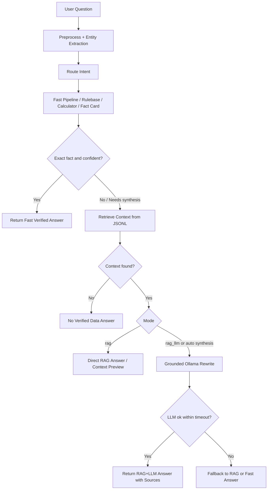

# Mixed RAG/LLM Manual Test - 2026-07-03

เอกสารนี้สรุปการเพิ่มโหมดทดสอบสำหรับถาม chatbot แบบเลือกวิธีตอบเองใน `notebooks/02_test_final_pipeline.ipynb`

## เป้าหมาย

เป้าหมายไม่ใช่ทำให้ทุกคำถามเร็วต่ำกว่า 1 วินาที แต่ให้ระบบเลือกวิธีตอบที่เหมาะสม:

- คำถาม fact ชัดเจน เช่น ราคา เวลาเปิด-ปิด กฎที่มี fact card ให้ตอบด้วย deterministic/rule/fact card ก่อน
- คำถามที่ต้องสรุปหลายส่วน เช่น "สรุปกฎ RoV เรื่อง pause และมาสาย" ให้ใช้ RAG ดึงข้อมูล แล้วค่อยให้ LLM เรียบเรียง
- คำถามที่ไม่มีข้อมูลจริง ให้ตอบว่าไม่พบข้อมูลที่ยืนยันได้ ไม่ให้ LLM เดาเอง
- คุมเวลา LLM ให้พยายามอยู่ในช่วงไม่เกินประมาณ 10 วินาที โดย default ตั้ง timeout 8 วินาที

## ไฟล์ที่เพิ่ม/แก้

- `C:\Users\Chokhun\Downloads\Learn-LLM\18_PSU_Esports_Update_Route_Data\app\runtime\mixed_mode_tester.py`
- `C:\Users\Chokhun\Downloads\Learn-LLM\18_PSU_Esports_Update_Route_Data\notebooks\02_test_final_pipeline.ipynb`
- `C:\Users\Chokhun\Downloads\Learn-LLM\18_PSU_Esports_Update_Route_Data\tools\update_02_test_mixed_modes_notebook.py`
- `C:\Users\Chokhun\Downloads\Learn-LLM\18_PSU_Esports_Update_Route_Data\app\pipeline\router.py`
- `C:\Users\Chokhun\Downloads\Learn-LLM\18_PSU_Esports_Update_Route_Data\app\pipeline\retrieval.py`

## โหมดที่ใช้ใน Notebook

`mode="rulebase"`

ใช้ pipeline หลักเดิม เช่น deterministic calculator, schedule fast path, category rule, competition fact card และ curated RAG direct ที่อยู่ใน pipeline ปัจจุบัน เหมาะกับคำถามที่คำตอบแน่นอนและไม่ควรให้ LLM แต่งคำตอบ

`mode="rag"`

ใช้ retrieval จาก JSONL/curated/competition fact cards แล้วตอบแบบไม่เรียก LLM เหมาะสำหรับเช็คว่า retriever หา context เจอไหม ถ้าตอบไม่ได้จะช่วยบอกว่าเจอ context ใกล้เคียงอะไร

`mode="rag_llm"`

ใช้ RAG ก่อน แล้วส่ง context ให้ Ollama เรียบเรียง โดย prompt บังคับให้ใช้เฉพาะ context และห้ามเดา เหมาะกับคำถามสรุปหลายเรื่อง หรือคำถามที่ต้องเรียงภาษาให้เป็นธรรมชาติ

`mode="auto"`

ให้ระบบเลือกเอง:

- exact fact/calculation/schedule/price ใช้ fast verified ก่อน
- ถ้าคำถามมีคำแนวสรุป อธิบาย ขั้นตอน เปรียบเทียบ ต่างกัน หรือ fast answer อ่อน จะลอง RAG+LLM
- ถ้า LLM ใช้ไม่ได้หรือ timeout จะ fallback ไป direct RAG หรือ fast answer ที่น่าเชื่อกว่า

## Flow



## วิธีใช้ใน Notebook

เปิดไฟล์:

```text
C:\Users\Chokhun\Downloads\Learn-LLM\18_PSU_Esports_Update_Route_Data\notebooks\02_test_final_pipeline.ipynb
```

เลื่อนไปหัวข้อ:

```text
12. Manual Test แบบเลือกโหมด: Rulebase / RAG / RAG+LLM / Auto
```

Cell หลักที่ใช้บ่อย:

```python
QUESTION = "สมาชิกในทีม ROV ต้องมีกี่คน"
MODE = "auto"

result = ask_mode(
    QUESTION,
    mode=MODE,
    model=MODEL,
    limit=TOP_K,
    llm_timeout_sec=LLM_TIMEOUT_SEC,
)

print_mode_result(result, show_context=True, show_trace=True)
```

ถ้าอยากเทียบทุกโหมด ให้ใช้ cell `12.2` แล้วพิมพ์คำถามเอง ระบบจะรัน:

- rulebase
- rag
- rag_llm
- auto

## ค่า Default

- `MODEL = "qwen2.5:3b"`
- `LLM_TIMEOUT_SEC = 8.0`
- `TOP_K = 5`

เหตุผลที่ใช้ `qwen2.5:3b` เป็น default คือเร็วกว่าและพอสำหรับ rewrite จาก context สั้นๆ ถ้าต้องการลองคุณภาพที่อาจดีขึ้นให้เปลี่ยนเป็น:

```python
MODEL = "qwen3:4b"
```

## Optimization ที่ทำ

- ลด prompt ของ RAG+LLM ให้สั้นลง
- จำกัด context ที่ส่งเข้า LLM เหลือ context สำคัญไม่เกิน 3 ชิ้นแรก
- ลด `num_predict` เหลือ 96 เพื่อไม่ให้โมเดลร่ายยาวจนเกิน 10 วินาที
- ให้โค้ดเป็นคนแปะแหล่งข้อมูลเพิ่มเอง ถ้า LLM ไม่ได้ใส่ source มา
- เพิ่ม English aliases สำหรับคำถามกติกา เช่น `team`, `team size`, `player`, `players`, `member`, `members`

## ผลทดสอบตัวอย่าง

คำถาม:

```text
CS2 team size players
```

ผล:

- `rulebase`: เข้า `pipeline:competition_fact_card`
- `rag`: ตอบจาก competition fact card ได้
- `rag_llm`: ตอบจาก RAG+LLM ได้ในประมาณ 1.26 วินาทีหลังปรับ prompt
- `auto`: เลือก fast verified เพราะเป็น exact fact

คำถาม:

```text
สรุปกฎ RoV เรื่อง pause และมาสายให้หน่อย
```

ผล:

- `auto`: เลือก `auto_rag_llm`
- ใช้เวลาประมาณ 2.26 วินาที
- ตอบรวมทั้งกฎ pause และ late start พร้อม source จาก fact cards

## ข้อควรระวัง

- ถ้าเพิ่งเปิด Ollama หรือโมเดลยังไม่ warm up ครั้งแรกอาจช้ากว่าปกติ
- ถ้าคำถามเป็น fact ตรงๆ ไม่จำเป็นต้องใช้ LLM เพราะ fact card/Rulebase แม่นและเร็วกว่า
- ถ้า forced `mode="rag_llm"` แล้ว context ไม่ตรง คำตอบก็อาจไม่ดี ควรใช้ cell `12.3` เพื่อดู retrieved context ก่อน
- ตอนนี้ยังเป็น lexical/curated retrieval ไม่ใช่ vector DB จริง หากต้องการ semantic RAG ควรเพิ่ม FAISS/Chroma เป็น phase ถัดไป
