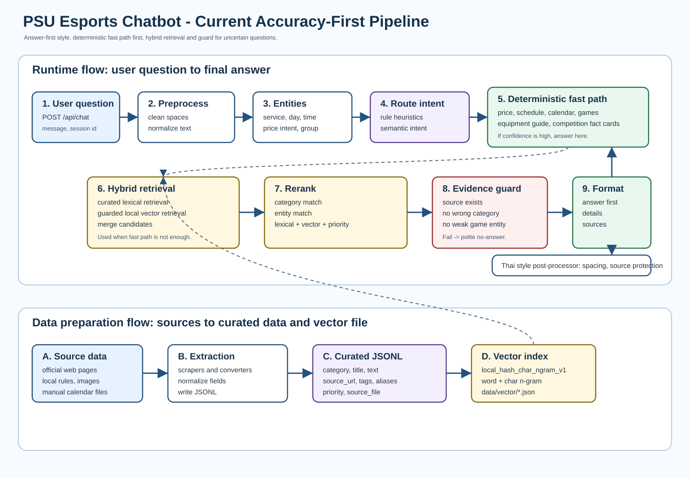

# Current Chatbot Full Pipeline Flow 2026-07-08

เอกสารนี้อธิบาย flow ปัจจุบันของ PSU Esports Chatbot ตั้งแต่ผู้ใช้พิมพ์คำถาม จนได้คำตอบสุดท้าย รวมถึงวิธีเตรียมข้อมูล วิธีแปลงข้อมูล วิธีค้นหา วิธีกันคำตอบมั่ว และลักษณะคำตอบที่ระบบตั้งใจให้เป็น



## สรุปสั้น

ระบบตอนนี้เป็น chatbot แบบ rulebase + curated RAG + local vector + hybrid guard ไม่ใช่ LLM อิสระที่ตอบจากความจำของโมเดล

แนวคิดหลักคือ:

```text
ตอบจากข้อมูลที่ยืนยันได้ก่อน
ถ้า rule/fast path มั่นใจ ให้ตอบทันที
ถ้าไม่มั่นใจ ให้ดึง candidate จาก curated + vector
จากนั้น rerank และ guard ก่อนตอบ
ถ้าไม่มีหลักฐานพอ ให้ no-answer แบบสุภาพ
```

## ไฟล์หลักที่เกี่ยวข้อง

### Runtime pipeline

- `app/web_api/server.py`
  - รับคำถามจาก `/api/chat`
  - เรียก `answer_question_pipeline_debug()`
  - ส่งคำตอบ, mode, route, sources, server date กลับให้หน้าเว็บ
- `app/pipeline/engine.py`
  - แกนหลักของ answer pipeline
  - คุมลำดับ preprocess, route, fast path, retrieval, guard, formatter
- `app/pipeline/preprocess.py`
  - clean query
  - normalize text
  - extract entities เบื้องต้น
- `app/core/normalization.py`
  - normalize ภาษาไทย/อังกฤษ
  - alias, typo, fuzzy, soft Thai matching
- `app/pipeline/router.py`
  - เลือก route/category/intent
- `app/runtime/fast_answer.py`
  - deterministic fast path จำนวนมาก เช่น ราคา, เวลา, เกม, อุปกรณ์, calendar
- `app/pipeline/hybrid_retrieval.py`
  - รวม lexical retrieval + vector retrieval
  - rerank และ evidence guard
- `app/pipeline/retrieval.py`
  - lexical curated retrieval
  - competition fact cards
  - formatter สำหรับ curated hits บางชนิด
- `app/pipeline/vector_retrieval.py`
  - local vector search แบบ hash char n-gram
- `app/pipeline/formatter.py`
  - เติมแหล่งข้อมูล
  - short answer mode
  - no-answer text
- `app/core/thai_style.py`
  - post-process ภาษาไทย เช่น spacing ของ `ๆ`
  - ป้องกัน URL/source/backtick ไม่ให้โดนแก้

### Data preparation

- `tools/scrape_our_games.py`
  - scrape หน้า Our Games
  - สร้าง raw JSONL และ curated JSONL
- `tools/build_vector_index.py`
  - build vector index จาก curated rows
- `tools/convert_competition_rules.py`
  - แปลงไฟล์กติกาแข่งขันเป็น chunks
- `data/curated/*.jsonl`
  - ข้อมูล curated ที่ใช้ retrieval
- `data/vector/psu_hybrid_vector_index.json`
  - vector index ที่ runtime ใช้
- `data/calendar/*.jsonl`
  - วันหยุดไทยและวันปิดพิเศษของศูนย์

## Flow ตอนผู้ใช้ถาม

### 1. ผู้ใช้ส่งคำถาม

จากหน้าเว็บ `web_chat/app.js` จะส่งคำถามไปที่:

```text
POST /api/chat
```

ตัวอย่าง payload โดยแนวคิด:

```json
{
  "message": "อะไรคือเกมพั้บจี",
  "session_id": "..."
}
```

ฝั่ง server ที่ `app/web_api/server.py` จะอ่าน `message` แล้วเรียก:

```python
answer_question_pipeline_debug(question)
```

## 2. Preprocess

ไฟล์หลัก:

```text
app/pipeline/preprocess.py
app/core/normalization.py
```

ระบบจะสร้าง `PreprocessedInput`:

```text
raw_query        = ข้อความเดิมจากผู้ใช้
clean_query      = ตัดช่องว่างซ้ำและ trim
normalized_query = ข้อความที่ normalize แล้ว
language_hint    = th / en / mixed_th_en / unknown
```

ตัวอย่าง:

```text
input:  อะไรคือเกมพั้บจี
clean:  อะไรคือเกมพั้บจี
normalized: อะไรคือเกมพั้บจี
```

คำบางแบบจะ normalize เป็น canonical form เช่น:

- `พับจี` -> `pubg`
- `วาโลแรนท์` -> `valorant`
- `เทกเคน` -> `เทคเคน`
- `วีอาร์` -> `vr`
- `รายกาา` -> `รายการ`
- `วิธฟ` -> `วิธี`
- `ssmu` -> `super smash`

### เทคนิคที่ใช้ใน normalization

1. Direct replacement
   - ใช้ mapping ที่เขียนไว้ใน `normalize_text()`
   - เหมาะกับ typo/alias ที่เจอบ่อย

2. Fuzzy keyword normalization
   - ใช้ `SequenceMatcher`
   - จำกัดเฉพาะ domain context เพื่อไม่แก้คำทั่วไปมั่ว

3. Thai soft alias matching
   - ตัดวรรณยุกต์/การันต์บางส่วนตอนเทียบ
   - ช่วยเคสเช่น `พั้บจี` ให้เทียบกับ `พับจี`
   - ช่วยเคส `เรสิเด้นอีวิล` ให้เข้า family `Resident Evil`

4. Alias dictionary
   - ยังใช้สำหรับชื่อเฉพาะและตัวย่อ
   - เช่น `วาโล`, `พับจี`, `มาริโอ้`, `SSB`, `SSMU`

เหตุผลที่ยังต้องใช้ alias:

- ชื่อเกมและตัวย่อหลายคำไม่ได้มีความหมายตามภาษา
- semantic อย่างเดียวอาจไม่รู้ว่า `SSMU` หมายถึง `Super Smash Bros Ultimate`
- alias เป็นตัวช่วย entity linking แต่ไม่ใช่ระบบหลักทั้งหมด

## 3. Entity Extraction

ไฟล์หลัก:

```text
app/pipeline/preprocess.py
```

ระบบดึง entity เบื้องต้นเป็น `EntityBundle`:

```text
day            เช่น monday, friday
time_slots     เช่น morning, afternoon
service        เช่น vr, ps5, pc, nintendo_switch, cockpit
user_group     เช่น psu, general_student, adult
duration       เช่น 30_minutes, 60_minutes
price_intent   true/false
short_answer   true/false
comparison     true/false
```

ตัวอย่าง:

```text
ถาม: VR 30 นาที นักศึกษา มอ ราคาเท่าไหร่
service      = vr
duration     = 30_minutes
user_group   = psu
price_intent = true
```

entity เหล่านี้ช่วยให้ route และ fast path ตัดสินใจได้แม่นขึ้น

## 4. Scope Guard

ไฟล์หลัก:

```text
app/pipeline/guard.py
```

ก่อน route ระบบจะเช็กว่าเป็นคำถามใน domain PSU Esports หรือไม่

ถ้าคำถามออกนอกเรื่องมาก และไม่มีสัญญาณ domain ระบบจะตอบ no-answer หรือไม่ให้ RAG ดึงมั่ว

ตัวอย่าง domain hints:

- เกม
- VR
- PS5
- Nintendo Switch
- PC
- ราคา
- จอง
- เวลาเปิดปิด
- กติกาแข่งขัน
- PSU Esports

## 5. Route Intent

ไฟล์หลัก:

```text
app/pipeline/router.py
app/pipeline/semantic_intent.py
data/intent/semantic_intents.jsonl
```

ระบบเลือก `PipelineRoute`:

```text
category   หมวดหลัก เช่น games, equipment, schedule, service_fee
intent     เจตนาย่อย เช่น game_detail_lookup, calendar_week_context
confidence คะแนนความมั่นใจ
answer_type fact/list/summary/no_answer/calculation
risk       low/medium/high
reason     เหตุผลที่ route นี้ถูกเลือก
```

หมวดหลักที่พบบ่อย:

- `service_fee`
- `schedule`
- `reservation`
- `rules`
- `penalty`
- `equipment`
- `games`
- `competition_rules`
- `knowledge`
- `events_news`
- `contact`
- `overview`
- `general`
- `no_answer`

### วิธี route ใช้อะไรบ้าง

1. Heuristic rule
   - ตรวจคำสำคัญแบบ explicit
   - เช่น `ราคา`, `ค่าบริการ`, `เปิดไหม`, `วันหยุด`, `กติกา`, `มีเกมอะไร`

2. Semantic intent matching
   - ใช้ตัวอย่าง intent ใน `data/intent/semantic_intents.jsonl`
   - เป็น local semantic แบบเบา ไม่ใช่ LLM

3. Entity จาก preprocess
   - ถ้ามี `price_intent` หรือ `service` จะช่วย route ไป service_fee

4. Risk ordering
   - route ที่เสี่ยงต้องมาก่อน route กว้าง
   - เช่น competition rules ต้องกันไม่ให้คำถามเกมทั่วไปหลุดไปกติกา

ตัวอย่าง:

```text
ถาม: มีเกมอะไรให้เล่นบ้าง
route.category = games
route.intent   = game_catalog_lookup
```

```text
ถาม: ปี 2027 มีวันหยุดอะไรบ้าง
route.category = schedule
route.intent   = schedule_query
```

```text
ถาม: บทความ Overcooked พูดถึงทักษะอะไร
route.category = knowledge
route.intent   = knowledge_lookup
```

## 6. Deterministic Fast Path

ไฟล์หลัก:

```text
app/runtime/fast_answer.py
```

ถ้า route ชัดและมี logic เฉพาะ ระบบตอบจาก fast path ก่อน

กลุ่ม fast path สำคัญ:

### ราคา

- ใช้ service fee table ในโค้ด
- ตอบตามกลุ่มผู้ใช้ เช่น PSU, general student, adult
- รองรับ duration เช่น 30 นาที, 60 นาที

ตัวอย่าง mode:

```text
pipeline:deterministic_calculator_fast
```

### ตารางเวลาและปฏิทิน

- ใช้ `app/calendar/service_calendar.py`
- อ่านข้อมูลจาก:
  - `data/calendar/service_closures.jsonl`
  - `data/calendar/thai_holidays_*.jsonl`
- resolve วันนี้, พรุ่งนี้, อีก 10 วัน, อาทิตย์หน้า, เดือนนี้, ปี 2027

ตัวอย่าง mode:

```text
pipeline:calendar_week_context_fast_path
pipeline:calendar_year_context_fast_path
pipeline:current_service_slot_fast_path
```

### รายชื่อเกมและรายละเอียดเกม

- ใช้ `GAME_DETAILS`
- ใช้ `SUPPORTED_GAME_CATALOG`
- ใช้ game family เช่น Mario, Resident Evil
- ใช้ genre groups เช่น Action, MOBA, FPS, Battle Royale

ตัวอย่าง mode:

```text
pipeline:games_catalog_fast_path
pipeline:game_detail_fast_path
pipeline:games_family_availability_fast_path
pipeline:games_genre_list_fast_path
```

### วิธีใช้อุปกรณ์

- ใช้ข้อมูลที่ถอดจากภาพ/หน้า equipment guide
- รองรับ VR, PS5, Nintendo Switch, Cockpit

ตัวอย่าง mode:

```text
pipeline:equipment_usage_vr_fast_path
pipeline:equipment_usage_nintendo_fast_path
```

### กติกาแข่งขันแบบ fact card

- ใช้ fact cards จาก `data/competition_rules/competition_rule_fact_cards*.jsonl`
- ถ้า match ชัด จะตอบจาก fact card

ตัวอย่าง mode:

```text
pipeline:competition_fact_card
```

เหตุผลที่ fast path มาก่อน:

- คุมคำตอบได้
- source ชัด
- format นิ่ง
- ลด hallucination

## 7. Competition Fact Card Retrieval

ถ้า route เป็น `competition_rules` ระบบใช้ fact card ก่อน curated RAG

ไฟล์หลัก:

```text
app/pipeline/retrieval.py
data/competition_rules/competition_rule_fact_cards*.jsonl
```

การเลือก fact card ใช้:

- game hint เช่น RoV, VALORANT, CS2, TEKKEN 8
- intent hint เช่น pause, penalty, equipment, map_pool
- question patterns
- priority
- exact_only guard

ถ้าคะแนนไม่พอ หรือ intent ไม่ตรง ระบบจะไม่ตอบจาก fact card

## 8. Hybrid Retrieval

ไฟล์หลัก:

```text
app/pipeline/hybrid_retrieval.py
app/pipeline/retrieval.py
app/pipeline/vector_retrieval.py
```

ใช้เมื่อ fast path ไม่ตอบ หรือ route บางหมวดต้องใช้ข้อมูล curated

ตอนนี้ใช้กับหมวด:

- `games`
- `equipment`
- `knowledge`
- `events_news`

### 8.1 Curated Lexical Retrieval

ไฟล์:

```text
app/pipeline/retrieval.py
```

โหลดข้อมูลจาก:

```text
data/curated/*.jsonl
```

ยกเว้น:

```text
rule_patterns.jsonl
```

วิธีทำงาน:

- normalize query
- tokenize
- สร้าง token overlap
- เพิ่มคะแนนจาก priority
- ใช้ boost เฉพาะ competition rules บาง intent
- คืน candidate พร้อม `_score`

ข้อดี:

- เร็ว
- ใช้ source ที่อ่านได้
- เหมาะกับคำที่ตรงกับเอกสาร

ข้อเสีย:

- ถ้าคำถามพิมพ์เพี้ยนหรือคำกว้าง อาจดึงผิด
- จึงต้องผ่าน hybrid guard

### 8.2 Guarded Local Vector Retrieval

ไฟล์:

```text
app/pipeline/vector_retrieval.py
data/vector/psu_hybrid_vector_index.json
```

backend ตอนนี้:

```text
local_hash_char_ngram_v1
```

ยังไม่ใช่ neural embedding model แบบ e5/FAISS

วิธี embed ตอน build index:

- word token hashing
- character n-gram ขนาด 3, 4, 5
- sparse vector ขนาด 2048 bucket
- cosine similarity แบบ sparse

ข้อมูลที่ใช้สร้าง doc text:

```text
title
text
game
item
zone
aliases
tags
```

ค่าที่คืนกลับ:

```text
_score
_vector_score
_lexical_score
_entity_score
_source_file
_vector_backend
```

### 8.3 Hybrid Merge

ไฟล์:

```text
app/pipeline/hybrid_retrieval.py
```

ระบบรวม candidate จาก:

```text
retrieve_curated()
retrieve_vector_guarded()
```

แล้ว dedupe ด้วย:

```text
id + source_file + source_url
```

ถ้า candidate เดียวกันมาจากทั้ง lexical และ vector จะได้ bonus เพราะน่าเชื่อกว่า

### 8.4 Hybrid Rerank

คะแนน hybrid คิดจาก:

```text
base score
vector score
lexical score
entity score
priority
origin bonus
```

แนวคิด:

- candidate ที่ทั้ง lexical และ vector เห็นตรงกันควรดีกว่า
- candidate ที่ entity ตรงควรชนะ
- candidate ที่ source/category ตรงควรชนะ
- candidate ที่ผิดหมวดต้องโดนบล็อก

## 9. Evidence Guard

ไฟล์หลัก:

```text
app/pipeline/hybrid_retrieval.py
app/pipeline/vector_retrieval.py
app/pipeline/retrieval.py
```

guard สำคัญ:

### Category guard

ถ้า route เป็น `games` ไม่ควรดึง `competition_rules`

ตัวอย่าง:

```text
ถาม: เกม Action มีอะไรบ้าง
ห้ามตอบกติกา RoV
```

### Game entity guard

ถ้าถาม game detail ต้อง match ชื่อเกมหรือ family ให้ได้

ตัวอย่าง:

```text
ถาม: เกม abcxyz คืออะไร
ผล: no-answer
เหตุผล: weak_game_entity
```

### Broad list guard

ถ้าถามกว้าง เช่น `มีเกมอะไรให้เล่นบ้าง` ต้องใช้ catalog fast path ไม่ใช่ตอบเกมเดี่ยวจาก retrieval

### Equipment guard

ถ้าถามเกม ต้องไม่ดึงเอกสาร equipment มาตอบ เว้นแต่ถามวิธีใช้เครื่อง/อุปกรณ์จริง

### Competition guard

ข้อมูลกติกาแข่งขันจะถูกใช้เมื่อคำถามมีบริบทแข่งขัน/กติกาเท่านั้น

### Statistic guard

ถ้าถามอันดับ/คนเล่นมากที่สุด/ยอดนิยมที่สุด แต่ไม่มีสถิติจริง ระบบต้อง no-answer

## 10. Answer Generation

ระบบไม่ได้ให้ LLM คิดคำตอบเองจากอากาศ

คำตอบมาจาก:

1. deterministic template ใน `fast_answer.py`
2. fact card answer
3. curated text ที่ผ่าน retrieval/guard
4. vector candidate ที่มี text/source จริง
5. experimental fallback เฉพาะตอนเปิด flag

ถ้าไม่มีหลักฐาน:

```text
ยังไม่พบข้อมูลที่ยืนยันได้...
```

## 11. Formatter

ไฟล์หลัก:

```text
app/pipeline/formatter.py
```

หน้าที่:

- ถ้า answer ว่าง ให้ no-answer
- ถ้ามี `short_answer` ให้ตอบสั้น
- ถ้าคำตอบยังไม่มีแหล่งข้อมูล ให้เติม `แหล่งข้อมูล: ...`

ลักษณะคำตอบมาตรฐาน:

```text
<คำตอบหลักก่อน>
<รายละเอียดถ้ามี>
แหล่งข้อมูล: <source_url>
```

ตัวอย่าง:

```text
เล่น PUBG: BATTLEGROUNDS ได้ครับ
มีให้เล่นที่: PC Zone
แนะนำให้จองโซนที่ต้องการก่อนเข้าใช้บริการ...
แหล่งข้อมูล: https://esports.phuket.psu.ac.th/Services/our-games
```

## 12. Thai Response Style Post-Processor

ไฟล์หลัก:

```text
app/core/thai_style.py
data/style/thai_style_rules.jsonl
```

ทำหลังสุดก่อนส่งคำตอบ

หน้าที่:

- ปรับ spacing ภาษาไทยบางจุด
- เช่น `ข้อ ๆ`, `อื่น ๆ`, `หลาย ๆ`
- ป้องกัน URL, local source, code/backtick ไม่ให้โดนแก้

เหตุผล:

- ให้คำตอบอ่านเป็นธรรมชาติและถูกหลักขึ้น
- ไม่ทำลาย source URL

## 13. Response กลับหน้าเว็บ

`app/web_api/server.py` ส่ง JSON กลับไปหน้าเว็บ

ข้อมูลสำคัญ:

```text
answer
mode
elapsed_sec
route
trace
sources
server_date
```

หน้าเว็บใช้ `answer` แสดงให้ผู้ใช้ และใช้ `server_date` แสดงวันที่/เวลาใน UI

## Flow การเตรียมข้อมูล

## 14. Source Data

แหล่งข้อมูลหลัก:

- หน้า Home
- หน้า Reservation
- หน้า Our Games
- หน้า Knowledge
- หน้า Events/News
- หน้า How to Use Equipment
- รูปภาพวิธีใช้อุปกรณ์
- ไฟล์กติกาการแข่งขัน
- ไฟล์ calendar/holiday

หลักการ:

- ถ้าเป็นข้อมูลจริงของศูนย์ ต้องเก็บ source
- ถ้าไม่มีข้อมูลจริง ห้ามเดา
- ถ้าเป็นข้อมูลที่ถอดจากรูป ต้องบันทึกที่มาและใช้แบบระวัง

## 15. Extraction

ตัวอย่าง tools:

```text
tools/scrape_our_games.py
tools/convert_competition_rules.py
tools/build_vector_index.py
```

### Our Games

input:

```text
https://esports.phuket.psu.ac.th/Services/our-games
```

output:

```text
data/sources/our_games_raw.jsonl
data/curated/our_games_scraped_details.jsonl
```

ข้อมูลที่เก็บ:

```text
title
summary
source_section
listed_under
source_url
category
tags
```

ข้อควรระวัง:

- `source_section` ไม่เท่ากับ service zone เสมอ
- เช่นบางเกมอาจอยู่ใต้ PlayStation section แต่บริการจริงเกี่ยวกับ VR/Cockpit

### Competition Rules

input:

```text
ไฟล์กติกา local
```

output:

```text
data/curated/curated_competition_rules.jsonl
data/competition_rules/competition_rule_fact_cards*.jsonl
```

ข้อมูลที่เก็บ:

```text
game
tournament
section
text chunk
source_url local://competition_rules/...
tags
```

### Calendar

input:

```text
data/calendar/thai_holidays_*.jsonl
data/calendar/service_closures.jsonl
```

runtime ไม่ค้นผ่าน vector โดยตรง แต่ใช้ calendar logic เพราะคำถามวันที่ต้องคำนวณ ไม่ใช่แค่ search text

## 16. Curated JSONL Format

รูปแบบทั่วไป:

```json
{
  "id": "curated_...",
  "category": "games",
  "title": "...",
  "text": "...",
  "source_url": "...",
  "source_ids": ["..."],
  "priority": 10,
  "tags": ["games", "ps5"]
}
```

field สำคัญ:

- `id`
  - ใช้อ้างอิงและ dedupe
- `category`
  - ใช้ route/guard
- `title`
  - ใช้ retrieval และแสดง context
- `text`
  - คำตอบหรือหลักฐาน
- `source_url`
  - แหล่งข้อมูลที่แสดงให้ user
- `tags`
  - ช่วย retrieval/rerank
- `aliases`
  - ช่วย entity matching
- `priority`
  - ช่วยให้ข้อมูล curated ที่สำคัญชนะ

## 17. Vector Index

ไฟล์:

```text
data/vector/psu_hybrid_vector_index.json
```

ตอนนี้มี:

```text
backend: local_hash_char_ngram_v1
doc_count: 278
```

แหล่งข้อมูลที่เข้า vector ตอนนี้:

- `curated_competition_rules.jsonl` 104 docs
- `curated_facts.jsonl` 42 docs
- `curated_facts_data_fix_2026-06-29.jsonl` 45 docs
- `curated_facts_service_fee_2026_aliases.jsonl` 4 docs
- `equipment_item_details.jsonl` 16 docs
- `game_item_details.jsonl` 36 docs
- `our_games_scraped_details.jsonl` 31 docs

ข้อมูลที่ยังไม่ได้เข้า vector โดยตรง:

- `data/calendar/*.jsonl`
- `data/intent/*.jsonl`
- `data/sources/*.jsonl`
- ground truth/test files
- rule patterns
- logic fast path ในโค้ด

เหตุผลที่ calendar ไม่เข้า vector เป็นหลัก:

- คำถาม calendar ต้อง resolve date เช่น วันนี้, อาทิตย์หน้า, อีก 10 วัน
- search อย่างเดียวไม่พอ
- ใช้ deterministic date logic แม่นกว่า

## 18. Mode สำคัญที่เห็นในผลลัพธ์

### Fast path modes

- `pipeline:games_catalog_fast_path`
- `pipeline:game_detail_fast_path`
- `pipeline:games_family_availability_fast_path`
- `pipeline:games_genre_list_fast_path`
- `pipeline:pc_availability_fast_path`
- `pipeline:equipment_usage_vr_fast_path`
- `pipeline:calendar_week_context_fast_path`
- `pipeline:calendar_year_context_fast_path`
- `pipeline:deterministic_calculator_fast`

### Retrieval modes

- `pipeline:competition_fact_card`
- `pipeline:hybrid_guarded_rerank`
- `pipeline:guarded_vector_direct`
- `pipeline:rag_direct_curated`

หมายเหตุ:

- หลังเพิ่ม hybrid guard หมวด `games` และ `equipment` จะระวังมากขึ้น
- ถ้า hybrid ไม่ผ่าน จะ no-answer แทน legacy curated direct ในหมวดเสี่ยง

### No-answer modes

- `pipeline:no_answer`
- `pipeline:guard_no_answer`
- `pipeline:games_detail_unknown_no_answer_fast_path`
- `pipeline:games_popularity_no_answer_fast_path`

## 19. ตัวอย่าง Flow จริง

### ตัวอย่าง 1: `มีเกมอะไรให้เล่นบ้าง`

```text
preprocess
-> route: games / game_catalog_lookup
-> deterministic fast path: answer_games()
-> games_catalog_fast_path
-> formatter adds source
-> Thai style post-process
```

ผลลัพธ์:

```text
เกมที่มีข้อมูลยืนยันตอนนี้:
- PC Zone: ...
- PlayStation 5 Zone: ...
แหล่งข้อมูล: https://esports.phuket.psu.ac.th/Services/our-games
```

### ตัวอย่าง 2: `อะไรคือเกมพั้บจี`

```text
preprocess
-> Thai soft alias matching: พั้บจี ใกล้ พับจี
-> route: games
-> deterministic fast path: game_detail_fast_path
```

ผลลัพธ์:

```text
PUBG: BATTLEGROUNDS คือ...
แนวเกม: Battle Royale
วิธีเล่นโดยสรุป: ...
เล่นได้ที่: PC Zone
แหล่งข้อมูล: ...
```

### ตัวอย่าง 3: `เกม abcxyz คืออะไร`

```text
preprocess
-> route: games / game_detail_lookup
-> deterministic fast path ไม่เจอเกม
-> hybrid retrieval ได้ candidate บางตัวจาก lexical
-> evidence guard ตรวจ entity ไม่ผ่าน
-> no-answer
```

เหตุผล:

```text
weak_game_entity
```

ผลลัพธ์:

```text
ยังไม่พบข้อมูลที่ยืนยันได้...
```

### ตัวอย่าง 4: `บทความ Overcooked พูดถึงทักษะอะไร`

```text
preprocess
-> route: knowledge / knowledge_lookup
-> deterministic fast path ไม่เจอ
-> hybrid retrieval
-> curated candidate: curated_knowledge_overcooked2_skills
-> vector/lexical support
-> hybrid_guarded_rerank
-> formatter
```

ผลลัพธ์:

```text
บทความ Overcooked! 2 ... ช่วยพัฒนาทักษะชีวิตหลายด้าน เช่น การสื่อสาร การทำงานเป็นทีม...
แหล่งข้อมูล: https://esports.phuket.psu.ac.th/Knowledge
```

### ตัวอย่าง 5: `อาทิตย์หน้าเล่นได้ไหม`

```text
preprocess
-> route: schedule
-> calendar fast path
-> resolve อาทิตย์หน้าเป็นวันจันทร์ถึงวันอาทิตย์ของสัปดาห์ถัดไป
-> ตรวจ holidays และ service closures
-> สรุปตารางประจำรายวัน
```

ผลลัพธ์:

```text
อาทิตย์หน้าในระบบนี้คือ 13/07/2026 ถึง 19/07/2026
ยังไม่พบวันหยุดไทย/เทศกาล...
ถ้าไม่มีวันปิดพิเศษ ให้ดูตามตารางประจำ:
- ...
```

## 20. ลักษณะคำตอบที่ตั้งใจ

คำตอบควรเป็น:

- ตอบประเด็นก่อน
- สุภาพ
- ไม่ยาวเกินจำเป็น
- มีแหล่งข้อมูลเมื่อเป็นข้อมูลยืนยัน
- ไม่บอกว่าใช้ LLM ถ้าคำตอบมาจาก rulebase/fast path/RAG deterministic
- ถ้าไม่มีข้อมูลจริง ให้ no-answer
- ถ้าเป็นข้อมูลปฏิทิน ให้บอกว่าเป็นข้อมูลประกอบ ไม่ได้แปลว่าศูนย์ปิดโดยอัตโนมัติ
- ถ้าเป็นข้อมูลเกม ให้แยกชัดว่าเล่นได้ที่โซนไหน

## 21. สิ่งที่ระบบตั้งใจไม่ทำ

- ไม่เดาคำตอบจากความรู้ทั่วไปถ้าไม่มี source
- ไม่ใช้ competition rules ตอบคำถามเกมทั่วไป
- ไม่ใช้ข่าวตอบคำถาม catalog
- ไม่ใช้ข้อมูลปฏิทินไทยเป็นหลักฐานว่าศูนย์ปิดทันที
- ไม่ใช้ LLM ตอบเองถ้า context ไม่ผ่าน guard
- ไม่ผ่อน test/guard เพื่อให้ผ่านง่าย

## 22. สิ่งที่ยังพัฒนาเพิ่มได้

### Offline neural embedding

ระยะถัดไปที่เหมาะ:

```text
build embedding offline
-> save vector file
-> Vercel runtime loads vector file only
-> use same hybrid rerank/guard
```

ข้อดี:

- ความหมายแม่นกว่า hash vector
- ไม่ต้องโหลด model บน Vercel runtime
- กระทบระบบเดิมน้อย

### Better entity linker

เพิ่ม entity catalog สำหรับ:

- games
- equipment
- zones
- tournaments
- holidays

แล้วให้ route/retrieval ใช้ entity id เดียวกัน

### More structured answers

ข้อมูลบางแบบควรเป็น structured card มากกว่า free text เช่น:

- game detail
- equipment usage
- calendar interval
- competition rule facts

## 23. วิธีทดสอบหลังแก้ logic

ทดสอบแบบประหยัด:

```text
python -m py_compile <files>
python tools/validate_update.py
```

Smoke ที่ควรถาม:

- `มีเกมอะไรให้เล่นบ้าง`
- `อะไรคือเกมพั้บจี`
- `อะไรคือเกม เรสิเด้นอีวิล`
- `เกม abcxyz คืออะไร`
- `เกม Action มีอะไรบ้าง`
- `บทความ Overcooked พูดถึงทักษะอะไร`
- `ข่าว Tekken 8 มีอะไร`
- `อาทิตย์หน้าเล่นได้ไหม`
- `ปี 2027 มีวันหยุดอะไรบ้าง`

Ground Truth ชุดใหญ่ควร run เฉพาะ:

- ก่อน deploy สำคัญ
- หลังแก้ route/retrieval ใหญ่
- เมื่อผู้ใช้ขอให้ทดสอบเต็ม

## 24. สรุปภาพรวม

ระบบตอนนี้ใช้หลายเทคนิคประกอบกัน:

- rulebase
- deterministic fast path
- alias dictionary
- fuzzy matching
- Thai soft matching
- semantic intent matching แบบ local
- lexical curated retrieval
- local hash vector retrieval
- hybrid rerank
- evidence guard
- answer formatter
- Thai style post-processor

เป้าหมายไม่ใช่ให้ระบบตอบทุกอย่าง แต่ให้ตอบเฉพาะสิ่งที่มีข้อมูลรองรับ และตอบให้ตรงคำถามที่สุด ถ้าข้อมูลไม่พอ ระบบควรยอม no-answer มากกว่าดึงข้อมูลใกล้เคียงแบบมั่ว
