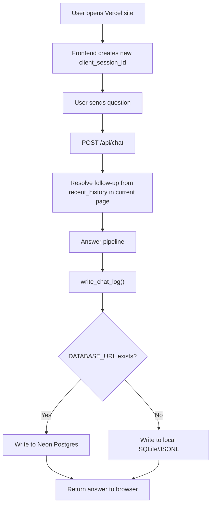

# Neon / Vercel Chat Session Storage Flow

## Goal

ใช้ Neon Postgres เป็น production storage สำหรับ chat logs/session records บน Vercel
โดยยังให้ local development ใช้ SQLite ได้เหมือนเดิม

> สถานะปัจจุบัน: refresh หน้าเว็บแล้วยังเริ่ม session ใหม่ตาม requirement ล่าสุด
> แต่ทุก question/answer จะถูกบันทึกลง storage ฝั่ง backend เพื่อดูย้อนหลังและต่อยอดเป็น persistent history ได้

## Recommended Storage Split

- Local dev: SQLite
  - `data/logs/chat_history.sqlite3`
- Vercel production: Neon Postgres
  - ใช้ env `DATABASE_URL`
- Browser:
  - ตอนนี้ไม่เก็บ history ถาวร
  - สร้าง `client_session_id` ใหม่เมื่อ refresh

## Vercel + Neon Setup Flow

1. เปิด Vercel Dashboard
2. เข้า Project ของ PSU Esports Chatbot
3. ไปที่ Storage / Marketplace
4. เลือก Neon Postgres
5. สร้าง Neon project และเชื่อมกับ Vercel project
6. ตรวจ Environment Variables ใน Vercel
   - ต้องมี `DATABASE_URL` หรือ `POSTGRES_URL`
7. ตั้งค่าเพิ่มใน Vercel Environment Variables
   - `PSU_CHAT_LOG_POSTGRES=1`
   - `PSU_CHAT_LOG_SQLITE=0`
   - `PSU_CHAT_LOG_LOCAL_JSONL=0`
8. Redeploy production
9. ทดสอบถามผ่านเว็บ
10. เข้า Neon Console แล้วดูตาราง:
    - `chat_sessions`
    - `chat_messages`

## Runtime Flow



## Tables

`chat_sessions`

- `session_id`
- `channel`
- `created_at`
- `updated_at`
- `last_route_category`
- `last_route_intent`
- `last_mode`
- `message_count`

`chat_messages`

- `id`
- `session_id`
- `role`
- `content`
- `resolved_question`
- `route_category`
- `route_intent`
- `mode`
- `confidence`
- `latency_sec`
- `sources_json`
- `metadata_json`
- `created_at`

## Important Env Vars

Production on Vercel:

```text
DATABASE_URL=postgresql://...
PSU_CHAT_LOG_POSTGRES=1
PSU_CHAT_LOG_SQLITE=0
PSU_CHAT_LOG_LOCAL_JSONL=0
```

Local dev default:

```text
PSU_CHAT_LOG_SQLITE=1
PSU_CHAT_LOG_LOCAL_JSONL=1
```

## Current Behavior

- Refresh แล้ว frontend จะสร้าง session ใหม่
- หน้าเว็บไม่โหลดประวัติเก่ากลับมา
- Neon/Postgres ใช้เป็น backend log storage ก่อน
- ถ้าต้องการ persistent chat UI ในอนาคต ให้เพิ่ม endpoint:
  - `GET /api/sessions/{session_id}/messages`
  - `POST /api/sessions/new`
  - `POST /api/sessions/{session_id}/clear`

## Next Step For True Persistent Chat UI

ถ้าต้องการ refresh แล้วข้อความกลับมา:

1. เปลี่ยน frontend ให้เก็บ `client_session_id` ใน `localStorage`
2. เพิ่ม endpoint โหลด messages จาก Neon
3. ตอนเปิดหน้าให้ frontend เรียกโหลด history
4. ใช้ `chat_messages` ล่าสุดเป็น `recent_history`
5. เพิ่มปุ่ม New Chat เพื่อสร้าง session ใหม่

ตอนนี้ยังไม่ทำขั้นนี้ เพราะ requirement ล่าสุดคือ refresh แล้วเป็น session ใหม่
