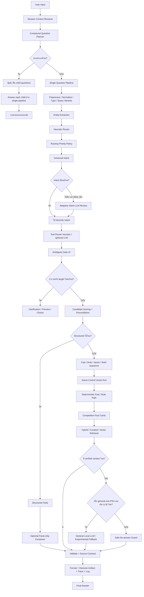

# PSU Esports Chatbot Full Architecture Flow - 2026-07-27

เอกสารนี้คือภาพรวม architecture และ flow ปัจจุบันของ PSU Esports Chatbot ณ วันที่ 2026-07-27 หลังเพิ่มชั้นป้องกัน route ผิด, ambiguity gate v2, compound question planner, source contract, answer validator v2, LLM health manager และ clarification follow-up context

Source หลักที่อ้างอิง:

```text
C:\Users\Chokhun\Downloads\Learn-LLM\18_PSU_Esports_Update_Route_Data
```

โฟกัสปัจจุบัน:

- Local chatbot / local LLM เป็นหลัก
- ไม่ใช้ git/deploy เป็นส่วนของ flow นี้
- ถ้าเป็นข้อมูล PSU Esports Studio - Phuket ต้องตอบจากข้อมูลจริงเท่านั้น
- ถ้าไม่มีข้อมูลจริง ต้อง no-answer หรือถามกลับ
- ถ้าคำตอบมาจาก rule/fast/structured/RAG ห้ามบอกว่าเป็น LLM
- LLM เป็นตัวช่วยเฉพาะบางจุด ไม่ใช่ตัวตอบหลักของทุกคำถาม

## สรุปสั้นที่สุด

Flow ปัจจุบันไม่ใช่แค่:

```text
input -> router -> structured/fast/RAG/LLM -> output
```

แต่เป็น:

```text
User Input
-> Session Context Resolver
-> Compound Question Planner
-> Preprocess / Normalize / Typo / Query Variants
-> Entity Extraction
-> Heuristic Router + Routing Priority Policy
-> Universal Intent Heuristic + optional Intent LLM Review
-> optional LLM Tool Router
-> Ambiguity Gate v2 + Margin Threshold + Clarification Preview
-> Candidate Scoring + Capability Preconditions
-> Structured Tools
-> optional Facts-only Composer
-> Game Control Vector-first Guard
-> Deterministic Fast/Rule Path
-> Competition Fact Cards
-> Hybrid / Curated / Vector Retrieval
-> optional Experimental RAG/General Local LLM fallback
-> No-answer Guard
-> Validate Answer v2 + Source Contract
-> Format + Decision Artifact + Trace + Log
-> Final Answer
```

## Mermaid ภาพรวม



## Backbone 0: Entry Point / Interface Layer

ไฟล์หลัก:

```text
tools\local_ai_chat.py
notebooks\04_local_hybrid_chat_debug.ipynb
app\web_api\server.py
app\runtime\pipeline_answer.py
app\pipeline\engine.py
```

หน้าที่:

- รับคำถามจาก terminal chat, notebook หรือ web API
- เก็บ recent history ของ session
- เรียก `resolve_question_with_context()` ก่อนเข้า pipeline หลัก
- เรียก `answer_question_pipeline_debug()` เพื่อให้ได้ answer, hits, route, mode, trace, validation, decision artifact
- เขียน chat log ผ่าน `write_chat_log()`

สถานะ LLM flags:

- `experimental_allow_llm`
  - เปิด/ปิดการเรียก LLM ใน intent review, tool router, facts composer และ fallback ที่เกี่ยวข้อง
- `experimental_rag_fallback`
  - เปิด/ปิด experimental fallback ที่อาจใช้ retrieval + LLM
- ใน notebook ปัจจุบันมักเรียกด้วย:

```python
answer_question_pipeline_debug(
    resolved.resolved_question,
    experimental_rag_fallback=True,
    experimental_allow_llm=True,
)
```

- ใน smoke tests หลายชุดตั้งเป็น `False` เพื่อยืนยันว่า deterministic path ยังทำงานได้โดยไม่พึ่ง LLM

## Backbone 1: Session Context Resolver

ไฟล์หลัก:

```text
app\session\context_resolver.py
```

หน้าที่:

- แก้คำถามต่อเนื่องให้เป็นคำถามเต็มก่อนเข้า pipeline
- ใช้ recent history ล่าสุด ไม่ใช้ memory ยาวแบบถาวร
- กัน context มั่วด้วย topic-shift guard และ explicit target override

ตัวอย่างที่ resolver ทำ:

```text
ก่อนหน้า bot ถามกลับ: PC หมายถึงเรื่องไหนของ PC?
user: เกม
resolved: PC มีเกมอะไรบ้าง
```

```text
ก่อนหน้า bot ตอบเรื่องการจอง
user: สรุปคือทำยังไง
resolved: สรุปขั้นตอนจองทำยังไง
```

```text
ก่อนหน้า bot ตอบเรื่อง TEKKEN 8
user: ปุ่มอะไรบ้าง
resolved: TEKKEN 8 ปุ่มอะไรบ้าง
```

เงื่อนไขสำคัญ:

- ถ้าคำถามใหม่มีชื่อเกมชัดเจน จะไม่ยืม context เดิม
- ถ้าคำถามใหม่มี service/zone ชัดเจน จะไม่ยืม context เดิม
- pending clarification ใช้ได้เฉพาะ assistant turn ล่าสุดเท่านั้น
- allowed choices ของ clarification preview ตอนนี้คือ:

```text
เกม / อุปกรณ์ / ราคา / จอง
```

- คำอย่าง `เครื่อง`, `ปุ่ม` ไม่ resolve แบบสุ่ม เพราะเสี่ยงเอา context ผิด

ผลลัพธ์ของ resolver:

```text
ResolvedQuestion(
  original_question,
  resolved_question,
  used_context,
  context_game,
  context_domain,
  context_operation,
  context_topic,
  reason
)
```

## Backbone 2: Compound Question Planner

ไฟล์หลัก:

```text
app\pipeline\engine.py
tests\smoke_test_compound_question_planner.py
```

หน้าที่:

- แยกคำถามหลายส่วนในประโยคเดียวให้ตอบครบทุกส่วน
- แก้ปัญหาเดิมที่ถาม 2 เกมแต่ตอบแค่เกมแรก หรือถาม 2 หมวดแต่ตอบแค่หมวดเดียว

ฟังก์ชันสำคัญ:

```text
_split_multi_question()
_split_shared_subject_multi_operation_question()
_carry_subject_to_short_followup_parts()
_split_shared_tail_multi_entity_question()
```

ตัวอย่าง:

```text
input: ถ้าเล่น Tekken 8 กับ Mario มีปุ่มอะไรบ้าง
split:
1. Tekken 8 มีปุ่มอะไรบ้าง
2. Mario มีปุ่มอะไรบ้าง
```

```text
input: PS5 กับ Nintendo มีเกมอะไรบ้าง
split:
1. PS5 มีเกมอะไรบ้าง
2. Nintendo มีเกมอะไรบ้าง
```

```text
input: VR ราคาเท่าไหร่ แล้วจองยังไง
split:
1. VR ราคาเท่าไหร่
2. VR จองยังไง
```

flow:

```text
answer()
-> _split_multi_question(question)
-> if parts > 1:
     _answer_multi()
     -> เรียก _answer_single() ทีละ part
     -> รวมคำตอบเป็น "คำถามนี้มีหลายเรื่อง ขอแยกตอบเป็นข้อ ๆ:"
   else:
     _answer_single()
```

สิ่งที่ต้องระวัง:

- ถ้า split มากเกินไปจะทำให้ latency เพิ่ม เพราะต้อง run pipeline หลายรอบ
- ถ้า split ผิดจะทำให้ความหมายเพี้ยน ต้องเก็บ real usage เพิ่มและ tune pattern
- ยังเป็น rule-based planner ไม่ใช่ LLM planner เพื่อให้เร็วและ deterministic

## Backbone 3: Preprocess / Normalize / Typo / Query Variants

ไฟล์หลัก:

```text
app\pipeline\preprocess.py
app\core\normalization.py
app\pipeline\game_title_correction.py
```

หน้าที่:

- normalize ภาษาไทย/อังกฤษ
- clean query
- ตรวจ alias ชื่อเกม
- แก้ typo ชื่อเกม
- สร้าง query variants เพื่อให้ router เลือก variant ที่ route ได้ดีกว่า

ตัวอย่างที่ระบบรองรับ:

```text
Tekken 8 -> TEKKEN 8
Over cook -> Overcooked 2 / Overcooked family
คอลออฟดูตี้ -> Call of Duty family
Part OI / Part ll / Part 2 -> Part II
```

flow:

```text
original question
-> preprocess_input()
-> normalized_query
-> clean_query
-> query_variants
-> _select_active_preprocessed_query()
-> เลือก variant ที่ route ดีกว่า ถ้าชนะ route เดิมตาม threshold
```

เหตุผลที่มี variant selection:

- ถ้าคำถามมี typo แล้ว original route ไปผิดหมวด ระบบจะลอง route variant ที่แก้แล้ว
- แต่ variant ต้องชนะ route เดิมตามเงื่อนไข ไม่ใช่แทนที่ทุกครั้ง

สิ่งที่ต้องระวัง:

- fuzzy typo ไม่มีวันครบ 100%
- typo correction ที่ aggressive เกินไปจะทำ false positive
- ต้องใช้ eval ชื่อเกมจริงเสมอเมื่อเพิ่ม alias ใหม่

## Backbone 4: Entity Extraction

ไฟล์หลัก:

```text
app\pipeline\preprocess.py
app\pipeline\schemas.py
```

Entity สำคัญ:

```text
day
time_slots
service
user_group
duration
price_intent
```

ใช้เพื่อ:

- ตีความราคา เช่น service, user group, duration
- ตีความตารางเวลา เช่น วันจันทร์, เช้า, บ่าย
- ช่วย ambiguity gate ว่าคำถามมี target พอไหม
- ช่วย validator ตรวจว่าคำตอบตอบตรง entity หรือไม่

ตัวอย่าง:

```text
VR 30 นาที บุคคลทั่วไปกี่บาท
service=VR
duration=30 minutes
user_group=general
price_intent=True
```

## Backbone 5: Heuristic Router + Routing Priority Policy

ไฟล์หลัก:

```text
app\pipeline\router.py
app\pipeline\routing_policy.py
data\routing\routing_priority_matrix.json
```

หน้าที่:

- route คำถามเบื้องต้นเป็น category/intent/risk/answer_type
- ใช้ rule/keyword/entity
- apply priority policy เพื่อกันคำที่ชนกัน เช่น ราคา vs เกม, booking vs equipment, rules vs controls

route object:

```text
PipelineRoute(
  category,
  intent,
  confidence,
  answer_type,
  risk,
  reason
)
```

ตัวอย่าง category:

```text
games
equipment
reservation
service_fee
schedule
competition_rules
rules
penalty
contact
overview
knowledge
general
unknown
no_answer
clarification
multi_question
```

แนวคิด:

- route ที่ชัดและเสี่ยงสูงต้องไม่ถูก LLM เปลี่ยนง่าย
- route ที่กว้าง/ไม่ชัดค่อยเปิดให้ universal intent หรือ tool router ช่วย review

## Backbone 6: Scope Guard / Safety Guard ก่อนตอบ

ไฟล์หลัก:

```text
app\pipeline\guard.py
app\pipeline\formatter.py
```

หน้าที่:

- กันคำถามที่อยู่นอกขอบเขตหรือเสี่ยงให้เดาข้อมูล PSU
- ถ้า guard confidence สูง จะตอบ no-answer ทันที
- ถ้าเปิด experimental RAG fallback อาจ bypass guard แบบทดลอง แต่ต้องมี trace

flow:

```text
guard_scope(pre, entities)
-> if guard_answer and confidence >= 0.90:
     route = no_answer / guard_no_answer
     return pipeline:guard_no_answer
```

นโยบาย:

- ข้อมูล PSU ที่ไม่มี source ห้ามให้ LLM เดา
- no-answer ต้องสุภาพและชี้ว่าไม่มีข้อมูลยืนยัน

## Backbone 7: Universal Intent

ไฟล์หลัก:

```text
app\pipeline\universal_intent.py
tests\smoke_test_universal_intent.py
tools\run_adaptive_intent_eval.py
```

หน้าที่:

- ตีความ domain + operation ที่เป็นกลางกว่าคำว่า route
- ใช้ heuristic เป็นหลัก
- optional LLM review เฉพาะเคสที่ควร review

Universal intent object:

```text
UniversalIntent(
  domain,
  operation,
  target,
  answer_style,
  confidence,
  method,
  reason
)
```

domain สำคัญ:

```text
games
game_controls
equipment
reservation
service_fee
schedule
competition_rules
members
rules
penalty
knowledge
general
```

operation สำคัญ:

```text
list
detail
availability
control
how_to
price_calculate
schedule_lookup
rule_lookup
group_count
group_list
role_lookup
unknown
```

heuristic rules:

- คำถามราคา บังคับ domain เป็น `service_fee`
- คำถามปุ่ม บังคับ domain เป็น `game_controls`
- route reservation ที่ operation unknown จะถือเป็น `how_to`
- route schedule ที่ operation unknown จะถือเป็น `schedule_lookup`
- known game title แบบ bare เช่น `Tekken 8` จะถือเป็น games/detail

optional Intent LLM review:

- ใช้เมื่อ `allow_llm=True`
- ไม่เรียกถ้า heuristic/route ชัดพอ
- เรียกเมื่อมี risk flags เช่น:

```text
competing_domain_signals
people_or_role_signal_conflicts_with_domain
competition_signal_conflicts_with_domain
broad operation
unknown operation
low confidence
```

LLM prompt แบบ candidate-based:

- LLM ไม่ได้แต่ง route เองอิสระ
- ระบบสร้าง candidate เช่น `c1`, `c2`, `c3`
- LLM เลือก candidate id พร้อม confidence
- ถ้า JSON invalid, timeout, confidence ต่ำ หรือขัดกับ heuristic แข็ง จะ reject แล้วใช้ heuristic

LLM health:

- ก่อนเรียก universal intent LLM จะเช็ก `llm_call_allowed("universal_intent", model)`
- ถ้า circuit breaker อยู่ cooldown จะ skip LLM แล้วใช้ heuristic

## Backbone 8: Route Refinement จาก Universal Intent

ไฟล์หลัก:

```text
app\pipeline\universal_intent.py
```

หลังได้ universal intent:

```text
refine_route_with_universal_intent(route, intent)
```

หน้าที่:

- map intent domain กลับมา route category/intention ที่เหมาะกับ pipeline
- เช่น `game_controls/control` -> route games/game_control_lookup
- เช่น `service_fee/price_calculate` -> route service_fee/service_fee_query

guard สำคัญ:

- ถ้า route เดิม confidence >= 0.94 และ risk medium/high
- universal intent ต้อง confidence >= 0.90 ถึงจะเปลี่ยน route เดิมได้

เหตุผล:

- กัน LLM หรือ heuristic intent ไป override route deterministic ที่มั่นใจสูง

## Backbone 9: Tool Router

ไฟล์หลัก:

```text
app\pipeline\llm_tool_router.py
tests\smoke_test_llm_tool_router.py
```

หน้าที่:

- เลือก strategy ถัดไปว่าใช้ structured, fast_path, retrieval, vector, general_llm, rag_llm, clarification หรือ no_answer
- default เป็น heuristic
- LLM tool router เป็น optional และปิดโดย default ผ่าน env

route actions:

```text
structured
fast_path
rulebase
retrieval
vector
general_llm
rag_llm
clarification
no_answer
```

heuristic decision:

- high-trust domain + intent ชัด -> `structured`
- general route -> `general_llm`
- competition_rules / knowledge / contact -> `retrieval`
- อื่น ๆ -> `fast_path`

LLM tool router เรียกเมื่อ:

- `allow_llm=True`
- `PSU_LLM_TOOL_ROUTER=1`
- heuristic ยังไม่มั่นใจพอ
- route ไม่ใช่ high-risk confidence สูง

sanitizer สำคัญ:

- ถ้า LLM เลือก `general_llm` ให้ PSU-specific question จะถูก block
- ถ้า route risk medium/high และ confidence สูง จะบังคับกลับไป deterministic/retrieval
- ถ้า LLM invalid/timeout/no JSON จะกลับไป heuristic

## Backbone 10: Ambiguity Gate v2 / Margin Threshold

ไฟล์หลัก:

```text
app\pipeline\ambiguity_gate.py
tests\smoke_test_ambiguity_gate.py
```

ตำแหน่งใน flow:

```text
หลัง route + universal intent + tool router
ก่อน candidate scoring / structured / fast / RAG
```

หน้าที่:

- ดักคำถามที่ router อาจมั่นใจผิด
- ดัก target ไม่พอ
- ดักคำถามกว้างเกินไป
- ดักคำถามปุ่มที่ไม่มีชื่อเกม
- ดักคำถามราคาแต่ไม่มี service/zone/game
- ดักคำถาม `เล่นยังไง` ที่อาจหมายถึงจองหรือปุ่ม
- ใช้ candidate scoring + margin threshold เพื่อถามกลับเมื่อคะแนนสูสี

case ที่ต้องถามกลับ:

```text
ราคาเท่าไหร่
-> ขอรู้บริการหรือโซนก่อน
```

```text
มีอะไรบ้าง
-> คำถามกว้างเกินไป ถามให้เจาะจง
```

```text
ปุ่มอะไรบ้าง
-> ขอชื่อเกมก่อน
```

```text
เล่นยังไง
-> หมายถึงวิธีเข้าใช้บริการ/จอง หรือวิธีเล่นเกมไหน
```

```text
PC มีอะไรบ้าง
-> ถามกลับพร้อม preview จากข้อมูลจริง
```

Hybrid Clarification Preview:

```text
PC มีอะไรบ้าง
-> ยังไม่แน่ใจว่าหมายถึงเรื่องไหนของ PC
-> ข้อมูลย่อที่ยืนยันได้:
   เกม: ...
   อุปกรณ์: ...
   ราคา: ...
   จอง: ...
-> พิมพ์ต่อสั้น ๆ ได้ เช่น เกม / อุปกรณ์ / ราคา / จอง
```

Margin threshold:

```text
top score - second score < 0.14
และ top/second score ผ่านขั้นต่ำ
และไม่ใช่ exception ที่ปลอดภัย
-> ask clarification
```

exception ที่ไม่ถามกลับ:

- price query ที่มี known game หรือ service/zone ชัด
- competition_rules ที่มี signal ชัด
- booking query ที่ไม่ได้ถามราคา
- known game + control query

ผลลัพธ์:

```text
AmbiguityGateResult(
  action="allow" หรือ "clarify",
  confidence,
  reason,
  flags,
  answer,
  metadata,
  hits
)
```

## Backbone 11: Candidate Scoring + Capability Registry

ไฟล์หลัก:

```text
app\pipeline\capability_registry.py
app\pipeline\tool_preconditions.py
app\pipeline\decision_artifact.py
```

หน้าที่:

- ไม่เลือก route เดียวแล้วตอบทันที
- สร้าง capability candidates หลายตัว
- ให้คะแนนจาก route, universal intent, tool router, operation, risk, evidence requirement
- reject candidate ที่ผิด policy หรือ precondition ไม่ผ่าน
- เก็บ selected/rejected candidates ใน trace

Capabilities ปัจจุบัน:

```text
structured.members
structured.games
structured.game_controls
structured.equipment
structured.reservation
structured.schedule
structured.service_fee
fast.price_calculator
fast.domain_handlers
rulebase.category_rules
retrieval.competition_fact_cards
retrieval.hybrid_guarded
retrieval.vector_guarded
llm.facts_composer
llm.general_answer
clarification.ask_user
fallback.no_answer
```

policy veto สำคัญ:

- `llm.general_answer` ถูก reject ถ้าเป็น PSU-specific route
- route risk high ห้ามใช้ model-only
- general route ที่ไม่มี verified PSU evidence target ห้ามใช้ structured แบบสุ่ม
- precondition ไม่ผ่านจะ reject candidate แม้คะแนนตั้งต้นดี

ตัวอย่าง precondition:

- price calculator ต้องเป็น price query
- structured game controls ต้องมีชื่อเกมหรือ control target พอ
- reservation ต้องเป็น booking/reservation query
- competition fact card ต้องเป็น competition rule query
- specific game detail ต้องมี game target

## Backbone 12: Structured Tools

ไฟล์หลัก:

```text
app\pipeline\structured_tools.py
app\calculator\service_fee.py
data\curated\*.jsonl
```

ตำแหน่ง:

```text
หลัง candidate scoring + tool precondition
ก่อน fast/RAG
```

เงื่อนไข:

```text
structured_precondition.ok == True
และ structured result confidence >= 0.82
```

Structured modes สำคัญ:

```text
structured_members_group_count
structured_members_group_list
structured_members_role_lookup
structured_members_person_lookup
structured_members_game_relation_no_data

structured_games_catalog
structured_game_zone_ranking
structured_games_family
structured_game_detail

structured_game_controls
structured_game_controls_family_summary
structured_game_controls_no_data

structured_equipment_catalog
structured_equipment_item

structured_service_fee
structured_service_fee_by_game

structured_schedule

structured_reservation_fact
structured_booking_selection
```

ตัวอย่างงานที่ structured ตอบ:

- สมาชิก PSU Esports มีกี่หมวด
- แต่ละหมวดมีใครบ้าง
- Nintendo มีเกมอะไรบ้าง
- อุปกรณ์ไหนเกมเยอะสุด
- TEKKEN 8 คือเกมอะไร
- TEKKEN 8 มีปุ่มอะไรบ้าง
- PS5/Nintendo/VR/PC ราคาเท่าไหร่
- ถ้าจอง PS5 ตั้งแต่ 9 โมงถึง 11 โมงเสียกี่บาท
- วิธีจองทำยังไง
- วันจันทร์เปิดกี่โมง

หลัง structured:

```text
structured answer
-> optional facts composer
-> format_answer()
-> validate_answer()
-> ถ้า validation.ok return
-> ถ้า validation fail ไป path ถัดไปหรือ no-answer ตาม flow
```

## Backbone 13: Service Fee / Price Calculator

ไฟล์หลัก:

```text
app\calculator\service_fee.py
app\runtime\fast_answer.py
app\pipeline\structured_tools.py
app\core\source_registry.py
```

ข้อมูล PC ล่าสุดจาก user confirmed:

```text
PC:
- PSU Student & Staff: 0 บาท / 1 ชั่วโมง
- PSU Alumni / General Student: 25 บาท / 1 ชั่วโมง
- General Adult: 70 บาท / 1 ชั่วโมง
```

Source contract:

```text
pc_service_fee_local_update_20260727
```

ราคา official image:

```text
service_fee_image_2026
```

กฎ validator:

- ถ้าคำตอบราคาเกี่ยวกับ PC ต้องมี source id `pc_service_fee_local_update_20260727`
- ถ้าคำตอบราคาเกี่ยวกับ service fee ต้องมี source official image หรือ service fee source
- ถามราคาแล้วตอบ catalog เกมถือว่าผิด
- ถามราคาเกม เช่น `Tekken 8 ราคาเท่าไหร่` ต้อง map เกมไป zone ก่อน แล้วคิดราคาตาม zone/service

## Backbone 14: Optional Facts-only Composer

ไฟล์หลัก:

```text
app\pipeline\facts_composer.py
```

หน้าที่:

- ใช้ Local LLM rewrite เฉพาะคำตอบ structured ที่มี facts/evidence แล้ว
- ไม่ให้ LLM แต่ง facts เพิ่มเอง
- ปิด default ถ้าไม่เปิด env

เปิดได้เมื่อ:

```text
experimental_allow_llm=True
PSU_FACTS_LLM_COMPOSER=1
mode อยู่ใน allowlist
LLM health allowed
```

allowlist modes ตัวอย่าง:

```text
structured_members_group_count
structured_members_group_list
structured_games_catalog
structured_game_detail
structured_equipment_catalog
structured_equipment_item
structured_schedule
structured_reservation_fact
structured_service_fee
```

safety:

- ถ้า LLM response ว่าง/timeout/invalid จะ fallback เป็น draft structured answer
- ถ้าคำตอบ unsafe หรือหลุด evidence จะ reject
- trace จะบอก `facts_composer_used`

## Backbone 15: Game Control Vector-first Guard

ไฟล์หลัก:

```text
app\pipeline\engine.py
app\pipeline\vector_retrieval.py
data\curated\game_control_facts.jsonl
```

เหตุผล:

- คำถามปุ่มควรตอบจาก control facts โดยตรง
- ไม่ควรตอบด้วย game detail หรือ catalog
- ไม่ควรเดาปุ่มถ้าไม่มีข้อมูล

flow:

```text
if looks_like_game_control_query and domain ไม่ใช่ rules/penalty:
   if ไม่มี explicit game:
      clarify หรือ no-data ตาม context
   else:
      retrieve_vector_guarded(limit=8)
      filter category=game_controls
      answer_from_vector_hits()
      if confidence >= 0.68 and validation.ok:
          return pipeline:game_control_vector_first
```

ตัวอย่าง:

```text
TEKKEN 8 ปุ่มเตะขวากดอะไร
-> ดึง game_controls ของ TEKKEN 8
```

```text
Overcooked 2 มีปุ่มอะไรบ้าง
-> ถ้ามี facts ตอบปุ่ม
-> ถ้าไม่มี facts ตอบว่ายังไม่มีข้อมูลปุ่ม
```

## Backbone 16: Deterministic Fast / Rule Path

ไฟล์หลัก:

```text
app\runtime\fast_answer.py
app\pipeline\engine.py
data\rules\*.json
```

หน้าที่:

- ตอบคำถามที่มี pattern ชัดและ deterministic
- เร็วกว่าการใช้ LLM/RAG
- ใช้สำหรับ policy, booking, payment, check-in, rules, overview, contact, knowledge บางส่วน, game catalog บางส่วน

handler ที่ engine ใช้ตาม route:

```text
answer_games
answer_equipment
answer_service_fee
answer_schedule
answer_static_domain
RuleMatcher
```

กฎสำคัญ:

- ถ้า route category เป็น general จะ skip rule matcher เพื่อไม่ยืม PSU rule มาตอบ general
- ถ้า deterministic no-answer confidence ต่ำ และเปิด experimental fallback อาจปล่อยไป fallback ทดลอง
- ถ้า deterministic confidence สูงและ validator ok จะ return

ตัวอย่าง fast answer:

- วิธีจอง
- ชำระเงินยังไง
- ยกเลิกการจอง
- เช็คอินกี่นาทีก่อนเวลา
- contact/email/phone
- overview studio
- rules ทั่วไปที่มี pattern ชัด

## Backbone 17: Competition Fact Cards

ไฟล์หลัก:

```text
app\pipeline\retrieval.py
data\competition_rules\competition_rule_fact_cards.jsonl
```

ใช้เมื่อ:

```text
route.category == "competition_rules"
```

flow:

```text
retrieve_competition_fact_cards(query)
-> answer_from_competition_fact_hits()
-> confidence >= 0.72
-> format + validate
-> return pipeline:competition_fact_card
```

จุดแข็ง:

- กติกาการแข่งขันมี fact card เฉพาะ
- มี intent hint เช่น format, map_pool, roster_change, side_selection, equipment, pause, penalty
- ไม่ต้องใช้ LLM rewrite ถ้าตอบจาก fact card ได้

## Backbone 18: Hybrid Retrieval / Curated RAG / Vector Guarded

ไฟล์หลัก:

```text
app\pipeline\retrieval.py
app\pipeline\vector_retrieval.py
app\pipeline\hybrid_retrieval.py
data\curated\curated_facts.jsonl
data\vector\psu_hybrid_vector_index.json
```

ลำดับ retrieval:

1. บาง route ใช้ hybrid guarded ก่อน legacy curated
2. ถ้า route เป็น competition_rules ใช้ fact cards ก่อน
3. ถ้ายังไม่พอ ใช้ curated lexical retrieval
4. ถ้ายังไม่พอ ใช้ vector guarded retrieval
5. ถ้ายังไม่มี verified context ตอบ no-answer หรือ experimental fallback ตาม config

Hybrid guarded:

```text
retrieve_hybrid_guarded()
-> รวม curated + vector
-> score ด้วย vector_score, lexical_score, entity_score, priority, origin_count
-> guard candidate ตาม route/category
```

Curated direct:

```text
retrieve_curated(query, route.category)
-> answer_from_curated_hits()
-> confidence >= 0.65
-> format + validate
```

Vector guarded:

```text
retrieve_vector_guarded(query, route)
-> answer_from_vector_hits()
-> confidence >= 0.68
-> format + validate
```

นโยบาย:

- ถ้า high-risk route ใช้ hybrid แล้วไม่ผ่าน guard อาจ skip legacy curated เพื่อกัน weak-context guessing
- ทุก retrieval answer ที่ผ่านจะมี trace ว่า `llm_rewrite` ถูก skip เพราะไม่ต้องใช้ LLM

ข้อจำกัดปัจจุบัน:

- vector index ยังไม่ใช่ semantic embedding จริงเต็มรูปแบบ
- ต้องพัฒนา rerank/embedding เพิ่มในอนาคต

## Backbone 19: Experimental RAG / General Local LLM Fallback

ไฟล์หลัก:

```text
app\pipeline\experimental_fallback.py
app\pipeline\llm_health.py
```

สถานะสำคัญ:

- Backbone นี้มีอยู่ แต่ถูก gate ด้วย config
- ถ้า `experimental_rag_fallback=False` route general จะ no-answer เพื่อไม่เดา
- ถ้าเปิด `experimental_rag_fallback=True` และ `experimental_allow_llm=True` จึงมีโอกาสเรียก Local LLM

ใช้เมื่อ:

- route เป็น general
- หรือ no verified context แล้ว experimental fallback เปิด
- หรือ soft related question ที่มีข้อมูลข้างเคียงแต่ไม่มีข้อมูลตรง

ตัวอย่าง soft related:

```text
เช่าจอได้ไหม
-> ยืนยันได้ว่าศูนย์มี Gaming Monitor ใน PC Zone
-> ยังไม่มีข้อมูลยืนยันเรื่องเช่าจอออกนอกสถานที่
```

Local LLM model:

```text
qwen2.5:3b
```

timeout / token ค่า default ที่เกี่ยวข้อง:

```text
PSU_EXPERIMENTAL_LLM_TIMEOUT_SEC default 1.5
PSU_GENERAL_LLM_NUM_PREDICT default 128
PSU_RAG_LLM_NUM_PREDICT default 180
```

safety:

- ถ้าเป็น PSU-specific แล้วไม่มี verified context ห้ามให้ LLM เดา
- ถ้า LLM ว่าง/timeout/parse ไม่ได้ ให้ no-answer หรือ fallback deterministic
- ใช้ `think=False` เพื่อลดปัญหา thinking model ตอบว่าง

## Backbone 20: LLM Health Manager / Circuit Breaker

ไฟล์หลัก:

```text
app\pipeline\llm_health.py
tests\smoke_test_llm_health_circuit_breaker.py
```

ใช้กับ LLM kinds:

```text
universal_intent
tool_router
facts_composer
experimental_rag_fallback
preflight
```

หน้าที่:

- จำ failure/success ต่อ model และต่อ kind
- ถ้า failure ถึง threshold จะเปิด cooldown
- ระหว่าง cooldown จะไม่เรียก LLM ซ้ำ
- trace จะบอกว่า LLM ถูก skip เพราะ health

default:

```text
PSU_LLM_HEALTH_MANAGER=True
PSU_LLM_PREFLIGHT=True
PSU_LLM_HEALTH_FAILURE_THRESHOLD=2
PSU_LLM_HEALTH_COOLDOWN_SEC=90
```

metadata ที่เก็บ:

```text
llm_health_status
llm_health_allowed
llm_health_failures
llm_health_cooldown_remaining_sec
llm_health_last_error_type
llm_health_last_error
```

เหตุผล:

- ปัญหา Local LLM timeout/response ว่างไม่ควรทำให้ทุกคำถามช้า
- ถ้า LLM เสีย ระบบต้องกลับไป deterministic / no-answer ได้

## Backbone 21: Source Registry / Source Contract

ไฟล์หลัก:

```text
app\core\source_registry.py
app\pipeline\validator.py
tests\smoke_test_source_contract.py
```

source id ปัจจุบันที่สำคัญ:

```text
service_fee_image_2026
pc_service_fee_local_update_20260727
```

`service_fee_image_2026`:

- official image ของ Service Fee 2026
- ใช้กับ PS5, Nintendo Switch, Cockpit, VR

`pc_service_fee_local_update_20260727`:

- local fact update จาก user confirmed
- ใช้กับ PC price
- trust_level = user_confirmed

source contract ใน validator:

- ถ้าคำตอบราคา PC ไม่มี `pc_service_fee_local_update_20260727` -> error
- ถ้าคำตอบราคา service fee ไม่มี source fee -> warning
- ถ้ามี PC source แต่คำถาม/คำตอบไม่เกี่ยว PC -> warning

เหตุผล:

- กันคำตอบราคาเก่าหรือมั่ว
- ทำให้ trace/source audit ได้

## Backbone 22: Answer Validator v2

ไฟล์หลัก:

```text
app\pipeline\validator.py
```

ตำแหน่ง:

```text
ทุก path ก่อน return คำตอบหลัก
```

ตรวจอะไร:

- ถามราคาแต่ตอบ catalog เกม
- ถามราคาแต่ตอบรายละเอียดเกมโดยไม่มีราคา
- ถาม booking แต่ตอบ equipment/game catalog
- ถาม booking how-to แต่ตอบ cancellation policy
- ถามปุ่มแต่ตอบ catalog เกม
- ถามปุ่มแต่ตอบ game detail ไม่ใช่ control facts
- ถามเกมเฉพาะแต่ตอบเกมทั้งหมด
- ถาม competition rules แต่ตอบ catalog เกม
- ถามคน/ตำแหน่งแต่ตอบ catalog เกม
- คำถาม broad เช่น `มีอะไรบ้าง` ต้อง clarify ก่อน ไม่ควรตอบเอง
- schedule ถ้าไม่ได้ถาม 24 ชั่วโมง ห้ามตอบ 24 ชั่วโมง
- PC price ต้องมี source contract

ผลลัพธ์:

```text
ValidationResult(
  ok,
  errors,
  warnings
)
```

ถ้า structured result fail:

```text
trace: candidate_execution / structured_rejected_by_validator
-> ไป path ถัดไป
```

ถ้า deterministic confidence สูงมาก:

- บางกรณีอาจ return แม้มี warning
- แต่ error หลักควรแก้ที่ logic/data ไม่ใช่แก้ validator ให้ผ่านง่าย

## Backbone 23: Format / No-answer / Sources

ไฟล์หลัก:

```text
app\pipeline\formatter.py
app\core\thai_style.py
```

หน้าที่:

- จัดรูปแบบ answer-first
- แนบ source เมื่อเหมาะสม
- format no-answer ตาม category
- กันคำตอบยาวเกิน/ไม่เป็นระเบียบ

รูปแบบที่ควรเป็น:

```text
คำตอบหลักก่อน

รายละเอียด:
• ...
• ...

แหล่งข้อมูล: ...
```

สำหรับ no-answer:

- ไม่เดา
- บอกว่ายังไม่มีข้อมูลยืนยัน
- ถามต่อได้หรือเสนอคำถามที่มีข้อมูลจริง

## Backbone 24: Decision Artifact / Trace / Timing

ไฟล์หลัก:

```text
app\pipeline\decision_artifact.py
app\pipeline\engine.py
app\session\chat_logger.py
```

ทุกคำตอบ debug มี:

```text
answer
hits
elapsed
mode
route
entities
validation
trace
decision_artifact
```

trace stage สำคัญ:

```text
split_multi_question
preprocess
active_route_selection
entities
guard_scope
universal_intent
tool_router
ambiguity_gate
decision_candidates
tool_precondition
structured_tool_execution
facts_composer
format_answer
validation
vector_retrieval
deterministic
competition_fact_retrieval
hybrid_retrieval
curated_retrieval
experimental_fallback
fallback
build_result
```

timing trace:

- ทุก stage หลักมี elapsed_ms / elapsed_sec
- ใช้หาว่าส่วนไหนทำให้ตอบช้า
- ช่วยแยก LLM latency กับ non-LLM latency

Decision artifact สรุป:

- route
- universal intent
- selected capability
- execution step
- evidence/source ids
- validation
- trace stage
- LLM call metadata

## Backbone 25: Chat Logging

ไฟล์หลัก:

```text
app\session\chat_logger.py
tools\local_ai_chat.py
app\web_api\server.py
```

หน้าที่:

- เก็บ input/output ต่อ session
- เก็บ resolved question
- เก็บ mode, route, trace, llm_calls, validation
- รองรับ local JSONL และ sink อื่นตาม config

ใช้เพื่อ:

- debug คำตอบผิด
- หา real usage
- สร้าง golden eval เพิ่ม
- tune ambiguity threshold / typo / router

## Backbone 26: Eval / Regression Backbone

ไฟล์สำคัญ:

```text
data\eval\real_usage_golden_v1.jsonl
tools\run_real_usage_golden_eval.py
tests\smoke_test_real_usage_golden.py
tests\smoke_test_ambiguity_gate.py
tests\smoke_test_session_context.py
tests\smoke_test_compound_question_planner.py
tests\smoke_test_structured_tools.py
tests\smoke_test_source_contract.py
tests\smoke_test_pc_service_fee.py
tests\smoke_test_llm_health_circuit_breaker.py
tests\smoke_test_pipeline_timing.py
```

หน้าที่:

- กัน regression จากคำถามจริง
- แยกทดสอบแต่ละ backbone
- ตรวจว่าแก้ logic จริง ไม่ใช่แก้ test ให้ผ่านง่าย

เคสสำคัญที่ต้องกัน:

- `Tekken 8` ต้องตอบเกม ไม่ใช่เกมทั้งหมด
- `Over cook` ต้องเข้าเกมได้ ไม่หลุด general LLM timeout
- `แล้วจองไง` หลัง context booking ต้องตอบวิธีจอง ไม่ตอบ cancellation อย่างเดียว
- `อุปกรณ์ไหนเกมเยอะสุด` ต้องคำนวณ ranking
- `ถ้าเล่น Tekken 8 กับ Mario มีปุ่มอะไรบ้าง` ต้องตอบหลายเกม
- `PC มีอะไรบ้าง` ต้องถามกลับพร้อม preview
- `ราคา Nintendo` หลังถาม PC ต้องไม่ยืม PC context
- PC price ต้องมี source id local update

## Flow แบบละเอียดตาม if-else จริง

### 1. ก่อนเข้า engine

```text
รับ question + recent_history
-> resolve_question_with_context(question, recent_history)
-> if used_context:
      ใช้ resolved_question
   else:
      ใช้ question เดิม
-> answer_question_pipeline_debug(resolved_question, flags)
```

### 2. engine.answer()

```text
started = now
experimental_rag_fallback = env/default หรือ argument
experimental_allow_llm = env/default หรือ argument
parts = _split_multi_question(question)

if len(parts) > 1:
    return _answer_multi(question, parts)
else:
    return _answer_single(question)
```

### 3. _answer_multi()

```text
for each part:
    result = _answer_single(part)

answer_blocks = [
  "คำถามนี้มีหลายเรื่อง ขอแยกตอบเป็นข้อ ๆ:",
  "1. part1\nanswer1",
  "2. part2\nanswer2"
]

validation = all child validations
hits = dedupe child hits
mode = pipeline:multi_question_splitter
return _build_result()
```

### 4. _answer_single() ช่วงเตรียม route

```text
original_pre = preprocess_input(question)
pre, entities, route, route_trace, variant_candidates = _select_active_preprocessed_query(original_pre)

trace preprocess
trace active_route_selection
trace entities
```

### 5. guard scope

```text
guard_answer, guard_confidence, guard_trace = guard_scope(pre, entities)

if guard_answer and guard_confidence >= 0.90:
    route = no_answer / guard_no_answer
    if experimental_rag_fallback:
        try experimental fallback
    else:
        return guard_answer
```

### 6. universal intent

```text
universal_intent = heuristic_intent(query, route)

if allow_llm and needs_llm_intent_review:
    if llm_health allows:
        call qwen2.5:3b via Ollama
        parse candidate JSON
        accept only if confidence/safety pass
    else:
        keep heuristic

route = refine_route_with_universal_intent(route, universal_intent)
```

### 7. tool router

```text
tool_decision = heuristic_decision(route, universal_intent)

if allow_llm and PSU_LLM_TOOL_ROUTER=1 and should_call_llm:
    if llm_health allows:
        call LLM for strategy JSON
        sanitize decision
    else:
        keep heuristic

if tool_decision requests clarification with enough confidence:
    return pipeline:tool_router_clarification

if route was general/unknown and tool router maps to retrieval domain:
    refine route
```

### 8. ambiguity gate v2

```text
ambiguity = evaluate_ambiguity_gate(query, route, intent, entities, tool_decision)

if ambiguity.action == "clarify":
    route = clarification / ambiguity_gate_clarification
    return ambiguity.answer

else:
    continue
```

### 9. candidate scoring + precondition

```text
accepted, rejected = build_candidate_decisions(route, intent, tool_decision, query)
structured_precondition = evaluate_structured_tool_precondition(query, route, intent)

if structured_precondition.ok:
    structured = answer_with_structured_tool(query, route, intent)
else:
    structured = None
```

### 10. structured answer

```text
if structured and structured.confidence >= 0.82:
    structured_route = _route_for_structured_result(route, intent, structured.mode)
    composed = compose_structured_answer(... allow_llm=experimental_allow_llm)
    formatted = format_answer(composed.answer, structured.hits, structured_route, entities)
    validation = validate_answer(question, formatted, structured_route, entities)

    if validation.ok:
        return pipeline:<structured.mode>
    else:
        trace structured_rejected_by_validator
        continue
```

### 11. game meta / control clarification

```text
if broad game meta and no explicit game:
    return pipeline:game_meta_clarification

if control/how-to-play query and no explicit game:
    if known named game without control data:
        return pipeline:game_control_named_no_data
    else:
        return pipeline:game_control_missing_game_context
```

### 12. game control vector-first

```text
if looks_like_game_control_query:
    vector_hits = retrieve_vector_guarded(query, route, limit=8)
    control_hits = filter category=game_controls
    vector_answer = answer_from_vector_hits(control_hits)
    if confidence >= 0.68 and validation.ok:
        return pipeline:game_control_vector_first
```

### 13. deterministic fast path

```text
deterministic = _try_deterministic(query, route)

if deterministic and confidence >= 0.75:
    if deterministic is unknown game:
        try vector override
    if no_answer-ish and experimental_rag_fallback enabled and confidence < 0.90:
        skip returning and continue to fallback
    else:
        formatted = format_answer()
        validation = validate_answer()
        if validation.ok or deterministic.confidence >= 0.90:
            return pipeline:<deterministic.mode>
```

### 14. competition fact cards

```text
if route.category == competition_rules:
    fact_hits = retrieve_competition_fact_cards()
    fact_answer = answer_from_competition_fact_hits()
    if confidence >= 0.72 and validation.ok:
        return pipeline:competition_fact_card
```

### 15. hybrid retrieval

```text
if should_use_hybrid_retrieval(route):
    hybrid_hits = retrieve_hybrid_guarded()
    hybrid_answer = answer_from_hybrid_hits()
    if confidence >= 0.68 and validation.ok:
        return pipeline:hybrid_guarded_rerank

    if should_skip_legacy_curated_after_hybrid(route):
        return pipeline:no_answer
```

### 16. general route

```text
if route.category == general:
    if experimental_rag_fallback:
        return build_experimental_fallback(... allow_llm=experimental_allow_llm)
    else:
        return pipeline:no_answer
```

### 17. curated / vector fallback

```text
rag_hits = retrieve_curated(query, route.category)
rag_answer = answer_from_curated_hits()
if confidence >= 0.65 and validation.ok:
    return pipeline:rag_direct_curated

vector_hits = retrieve_vector_guarded(query, route)
vector_answer = answer_from_vector_hits()
if confidence >= 0.68 and validation.ok:
    return pipeline:guarded_vector_direct
```

### 18. final fallback

```text
if experimental_rag_fallback:
    return experimental fallback
else:
    return pipeline:no_answer
```

### 19. build result

```text
source_validation = validate_answer("", answer, route, entities, hits=hits)
decision_artifact = build_decision_artifact(...)
return PipelineAnswer(
  answer,
  hits,
  elapsed,
  mode,
  confidence,
  route,
  entities,
  validation,
  trace,
  decision_artifact
)
```

## ตำแหน่งที่ใช้ LLM จริง ณ ตอนนี้

LLM ไม่ได้อยู่ทุกจุด และไม่ได้เป็นตัวตอบ PSU facts หลัก

### 1. Universal Intent LLM Review

```text
ไฟล์: app\pipeline\universal_intent.py
kind: universal_intent
model default: qwen2.5:3b
```

ใช้เมื่อ:

- `experimental_allow_llm=True`
- heuristic route/intent ไม่ชัดพอ
- มี risk flags หรือ confidence ต่ำ
- LLM health อนุญาต

ไม่ใช้เมื่อ:

- exact route/operation ชัด
- route confidence สูง
- strong heuristic ผ่าน threshold
- circuit breaker cooldown

### 2. LLM Tool Router

```text
ไฟล์: app\pipeline\llm_tool_router.py
kind: tool_router
env: PSU_LLM_TOOL_ROUTER=1
```

ใช้เพื่อเลือก strategy ไม่ใช่ตอบคำถามสุดท้าย

ไม่ให้ทำ:

- เลือก general_llm สำหรับ PSU-specific question
- override high-risk deterministic route แบบมั่ว

### 3. Facts-only Composer

```text
ไฟล์: app\pipeline\facts_composer.py
kind: facts_composer
env: PSU_FACTS_LLM_COMPOSER=1
```

ใช้ rewrite คำตอบจาก facts ที่ structured tool สร้างแล้ว

ไม่ให้ทำ:

- แต่ง facts ใหม่
- ตอบเมื่อไม่มี evidence
- ใช้นอก allowlist mode

### 4. Experimental RAG / General Local LLM fallback

```text
ไฟล์: app\pipeline\experimental_fallback.py
kind: experimental_rag_fallback / general
```

ใช้เมื่อ:

- เปิด `experimental_rag_fallback`
- เปิด `experimental_allow_llm` สำหรับ LLM answer
- เป็น general non-PSU หรือมี retrieved context ที่พอ

ไม่ใช้เมื่อ:

- เป็น PSU-specific แต่ไม่มี verified context
- LLM health cooldown
- fallback ปิด

## จุดที่ห้ามใช้ LLM เดา

- ราคา PSU/PC/PS5/Nintendo/VR/Cockpit
- วิธีจอง/ยกเลิก/ชำระเงิน/check-in ถ้าไม่มี source
- ตารางเวลา
- อุปกรณ์และจำนวน
- รายชื่อเกม/เกมอยู่โซนไหน
- ปุ่มควบคุมเกม
- สมาชิกทีมและตำแหน่ง
- กติกาการแข่งขัน
- ข้อมูล contact/overview ของศูนย์

ถ้าไม่มีข้อมูลจริง:

```text
ถามกลับ หรือ no-answer
```

## Data Backbone

ไฟล์ข้อมูลสำคัญ:

```text
data\curated\curated_facts.jsonl
data\curated\equipment_item_details.jsonl
data\curated\game_item_details.jsonl
data\curated\our_games_scraped_details.jsonl
data\curated\game_title_aliases.jsonl
data\curated\game_control_facts.jsonl
data\curated\member_profiles.jsonl
data\competition_rules\competition_rule_fact_cards.jsonl
data\vector\psu_hybrid_vector_index.json
data\routing\routing_priority_matrix.json
data\eval\real_usage_golden_v1.jsonl
```

แหล่งข้อมูลหลักตามโดเมน:

- Games: `our_games_scraped_details.jsonl`, `game_item_details.jsonl`, aliases
- Game controls: `game_control_facts.jsonl`
- Equipment: `equipment_item_details.jsonl`
- Members: `member_profiles.jsonl`
- Competition rules: `competition_rule_fact_cards.jsonl`
- Prices: service fee image source + PC local update source
- Retrieval: curated facts + vector index

## Modes ที่ควรเห็นใน output/trace

ตัวอย่าง mode:

```text
pipeline:multi_question_splitter
pipeline:ambiguity_clarification
pipeline:tool_router_clarification
pipeline:structured_games_catalog
pipeline:structured_game_detail
pipeline:structured_game_controls
pipeline:structured_service_fee
pipeline:structured_service_fee_by_game
pipeline:structured_equipment_catalog
pipeline:structured_schedule
pipeline:structured_reservation_fact
pipeline:game_control_vector_first
pipeline:competition_fact_card
pipeline:hybrid_guarded_rerank
pipeline:rag_direct_curated
pipeline:guarded_vector_direct
pipeline:no_answer
pipeline:guard_no_answer
```

## Production Risks ที่ยังต้องระวัง

### 1. Rule-based split อาจ split ผิด

ผลเสีย:

- ตอบหลายข้อทั้งที่ควรตอบข้อเดียว
- หรือแยก subject ผิด

กันด้วย:

- เพิ่ม real usage golden cases
- log split parts ใน trace
- เพิ่ม allowlist/denylist pattern

### 2. Ambiguity gate อาจถามกลับมากเกินไป

ผลเสีย:

- user รู้สึกช้าเพราะต้องตอบ 2 รอบ

กันด้วย:

- ใช้ preview เฉพาะข้อมูลจริง
- ยกเว้น exact intent ที่ปลอดภัย
- tune margin threshold จาก log จริง

### 3. Ambiguity gate อาจปล่อยบางคำถามที่ควรถามกลับ

ผลเสีย:

- route มั่นใจผิดแล้วตอบคนละหมวด

กันด้วย:

- เพิ่ม candidate scoring signal
- เพิ่ม validator rule
- เพิ่ม golden cases จากคำถามที่หลุดจริง

### 4. Local LLM timeout/empty response

ผลเสีย:

- latency สูง
- user เห็น fallback แปลก ๆ

กันด้วย:

- LLM health circuit breaker
- timeout สั้นสำหรับ intent/tool router
- `think=False`
- fallback deterministic/no-answer

### 5. Source contract ยังครอบคลุมเฉพาะบาง facts

ผลเสีย:

- source audit ไม่ครอบคลุมทุกโดเมน

กันด้วย:

- เพิ่ม source registry สำหรับ booking/schedule/equipment/games/members
- validator ตรวจ source id ต่อ domain เพิ่ม

### 6. Vector ยังไม่ semantic จริงเต็มรูปแบบ

ผลเสีย:

- RAG อาจ miss หรือ score เพี้ยน

กันด้วย:

- ทำ semantic embedding จริง
- เพิ่ม reranker
- ใช้ structured tools สำหรับ facts หลักก่อนเสมอ

### 7. Facts composer ถ้าเปิดกว้างเกินไปอาจ rewrite เพี้ยน

ผลเสีย:

- ตอบสวยขึ้นแต่ factual drift

กันด้วย:

- เปิดเฉพาะ allowlist
- compare draft vs composed
- validate หลัง compose
- source contract

## สรุป architecture ปัจจุบันแบบ backbone

```text
1. Interface + Session
2. Context Resolver
3. Compound Question Planner
4. Preprocess / Normalize / Typo / Variants
5. Entity Extraction
6. Heuristic Router + Priority Policy
7. Guard Scope
8. Universal Intent heuristic + optional LLM review
9. Route Refinement
10. Tool Router heuristic + optional LLM
11. Ambiguity Gate v2 + Margin Threshold + Preview
12. Candidate Scoring + Capability Preconditions
13. Structured Tools
14. Optional Facts-only Composer
15. Game Control Vector-first
16. Deterministic Fast/Rule Path
17. Competition Fact Cards
18. Hybrid / Curated / Vector Retrieval
19. Experimental RAG / General Local LLM fallback
20. Safe No-answer
21. Answer Validator v2
22. Source Registry / Source Contract
23. Format
24. Decision Artifact / Trace / Timing
25. Chat Log
26. Eval / Regression
```

## สถานะของเอกสารนี้

เอกสารนี้ตั้งใจให้เป็น reference ของ flow ปัจจุบัน ณ 2026-07-27 หลังงานปรับ architecture วันนี้ ถ้าหลังจากนี้มีการแก้ logic สำคัญ เช่น source registry เพิ่ม, semantic embedding จริง, production web flow, หรือ LLM fallback policy เปลี่ยน ควรสร้างเอกสาร revision ใหม่หรือเพิ่ม section update ต่อท้ายไฟล์นี้
