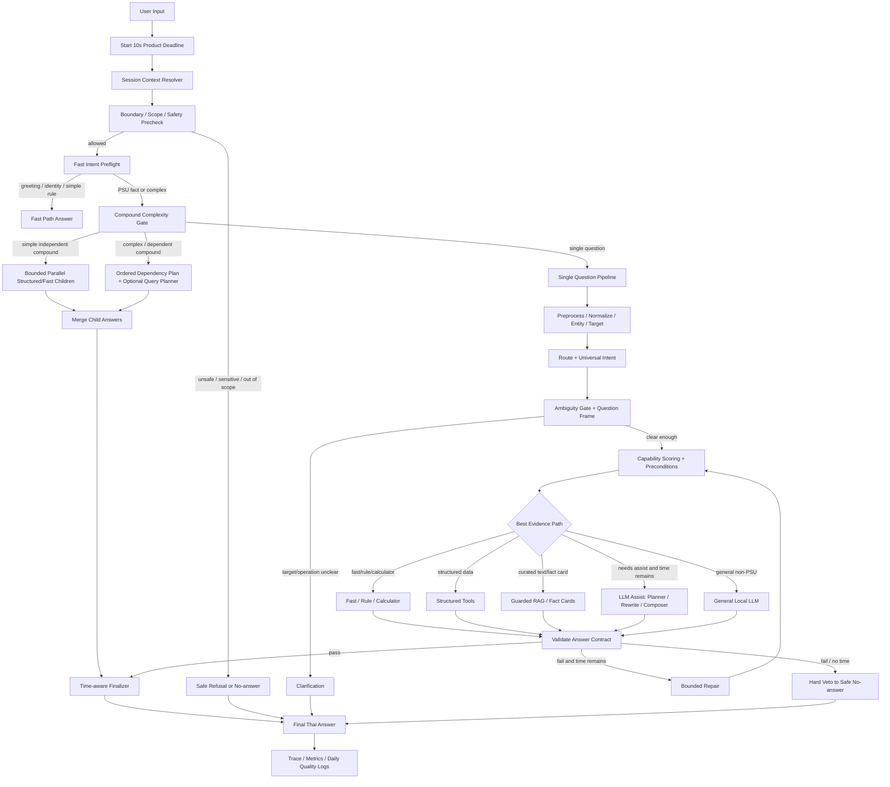

# PSU Esports Chatbot - Product 10s Response Flow

## สถานะเอกสาร

เอกสารนี้เป็น flow เชิง product design สำหรับทำให้ PSU Esports Chatbot ใช้งานจริงโดยตั้งเป้าให้ผู้ใช้ไม่ต้องรอคำตอบเกิน 10 วินาที และยังรักษาหลัก correctness/evidence-first ของระบบเดิม

วันที่จัดทำ: 2026-08-06

เอกสารนี้ไม่ได้บอกว่าทุกข้อ implement แล้ว แต่เป็น flow เป้าหมายสำหรับงานถัดไป โดยต่อยอดจาก architecture ล่าสุดใน:

```text
docs\38_current_chatbot_full_process_flow_20260803.md
```

ข้อสำคัญที่สุด:

- 10 วินาทีคือ product UX cap ต่อ 1 user input
- คำตอบถูกต้องสำคัญกว่าคำตอบยาว
- ถ้าไม่มี evidence ของ PSU Esports Studio - Phuket ต้องถามกลับหรือ no-answer
- LLM ใช้ช่วยวางแผน/เรียบเรียง/ตอบ general เท่านั้น ไม่ใช้เดาข้อมูล PSU
- RAG ใช้เพิ่ม coverage เมื่อมี corpus/source จริง ไม่ใช่ใช้แทน source

---

## 1. Product Goal

เป้าหมายเชิง product คือ:

```text
ผู้ใช้ถาม 1 ครั้ง
-> ได้คำตอบหลักเร็ว
-> ถ้าคำถามง่ายควรต่ำกว่า 1-2 วินาที
-> ถ้าคำถามยากควรไม่เกิน 10 วินาที
-> ถ้าเกิน budget ต้องหยุดอย่างสุภาพ ไม่ปล่อยให้รอค้าง
```

Target latency ที่แนะนำ:

| Metric | เป้าหมาย |
|---|---:|
| P50 | น้อยกว่า 1 วินาที |
| P95 | น้อยกว่า 3-5 วินาที |
| P99 | น้อยกว่า 8-10 วินาที |
| User-visible cap | 10 วินาที |
| Max outlier | ต้องถูก track และลดด้วย hard-cancel/queue |

เป้าหมายด้านคุณภาพ:

| ประเภทคำถาม | เป้าหมาย |
|---|---|
| PSU facts ชัดเจน | ตอบจาก structured/fast/RAG ที่มี source |
| คำถามกำกวม | ถามกลับพร้อมตัวเลือกที่มีหลักฐาน |
| คำถามไม่มีข้อมูล PSU | no-answer แบบสุภาพ |
| คำถาม general | ใช้ Local LLM ได้ถ้า policy อนุญาตและมีเวลา |
| Compound question | ตอบเท่าที่ตอบได้จาก evidence ภายใน budget |

---

## 2. Product Flow แบบย่อ

```text
User Input
-> Start 10s Product Deadline
-> Session Context Resolver
-> Boundary / Safety / Scope Precheck
-> Fast Intent Preflight
-> Compound Complexity Gate
   -> simple: deterministic split + bounded parallel
   -> complex: cheap dependency analysis + optional planner
-> Preprocess / Entity / Target Resolve
-> Route + Intent
-> Confidence / Ambiguity Gate
-> Evidence-first Answer Selection
   -> Fast / Rule / Calculator
   -> Structured Tools
   -> Guarded RAG / Fact Cards
   -> Optional LLM Assist
   -> Optional General LLM
-> Validate Source + Answer Contract
-> Time-aware Finalizer
   -> full answer
   -> partial grounded answer
   -> clarification
   -> safe no-answer
-> Log Metrics + Trace
```

---

## 3. Flow แบบ Mermaid



---

## 4. Time Budget ต่อ 1 Prompt

Recommended product budget:

| ช่วงเวลา | สิ่งที่ควรทำ | สิ่งที่ไม่ควรทำ |
|---:|---|---|
| 0-0.2s | รับ input, สร้าง request id, เริ่ม deadline, โหลด session context | เรียก LLM |
| 0.2-0.8s | boundary/scope, fast intent, preprocess, entity/target เบื้องต้น | retrieval หนัก |
| 0.8-2.0s | structured tools, fast/rule/calculator, answer contract | general LLM |
| 2.0-4.0s | guarded RAG, fact cards, vector retrieval, cheap rerank | composer ยาว |
| 4.0-6.5s | optional LLM assist เฉพาะ planner/rewrite/intent/composer ที่มี evidence | LLM หลาย call ต่อเนื่อง |
| 6.5-8.5s | สรุป partial grounded answer หรือถามกลับ | เริ่มงานใหม่ที่หนัก |
| 8.5-10s | final validation, fallback/no-answer, logging | เรียก LLM/RAG เพิ่ม |
| >10s | ไม่ควรปล่อย user รอ | ต้องมี hard-cancel/worker timeout ในอนาคต |

ค่าที่ควรตั้งเมื่อทำ production 10s:

```text
PSU_PIPELINE_GLOBAL_TIMEOUT_SEC=10
PSU_QUERY_PLANNER_TIMEOUT_SEC=2.0-3.0
PSU_GENERAL_LLM_TIMEOUT_SEC=5.0-6.0
PSU_LLM_MAX_CALLS=1 by default
PSU_LLM_MAX_CALLS=2 only for high-value complex cases
PSU_LLM_MAX_CONCURRENCY=1 หรือ shared queue กลาง
PSU_COMPOUND_MAX_WORKERS=2
```

หมายเหตุ: ระบบปัจจุบันมี Global Request Deadline แล้ว แต่ Ollama/network call ที่เริ่มไปแล้วอาจยัง hard-cancel ไม่ได้ทุกกรณี ดังนั้น product flow นี้ควรมี worker/process-level cancellation เพิ่มในอนาคต

---

## 5. Answer Source Policy

ระบบควรเลือกแหล่งคำตอบตามลำดับนี้:

```text
1. Fast / rule / calculator ถ้าคำถามชัดและ logic deterministic
2. Structured tools ถ้ามี target/operation ชัดและข้อมูลเป็น record/table
3. Guarded RAG / fact cards ถ้าคำตอบต้องอ่าน curated text หรือหลาย source
4. LLM assist ถ้าต้องช่วยวางแผน/เรียบเรียง แต่ facts ต้องมาจาก evidence
5. General LLM เฉพาะคำถาม non-PSU ที่ policy อนุญาต
6. Clarification/no-answer ถ้า evidence ไม่พอ
```

Target สัดส่วนสำหรับ product หลังเพิ่ม RAG/LLM assist:

| Answer path | Target share | เหตุผล |
|---|---:|---|
| Structured tools | 45-60% | แกนหลักของ PSU facts |
| Fast/rule/calculator | 15-25% | คำถามง่ายต้องเร็วมาก |
| RAG/fact cards/hybrid retrieval | 10-20% | เพิ่ม coverage จากเอกสารจริง |
| LLM assist | 10-20% | planner/rewrite/composer/critic ไม่ใช่เดา facts |
| LLM final answer | 3-8% | เฉพาะ general non-PSU หรือคำตอบที่ policy อนุญาต |
| Clarify/no-answer | ตาม evidence | ต้องไม่ลดลงด้วยการเดา |

ข้อควรระวัง:

- ไม่ควรตั้งเป้าเพิ่ม LLM final answer สูงเกินไป เพราะเสี่ยง hallucination ของข้อมูล Studio
- ควรเพิ่ม RAG และ LLM assist มากกว่าเพิ่ม LLM final answer
- ถ้า RAG corpus ไม่มีข้อมูลจริง การเพิ่ม RAG จะเพิ่ม no-context/no-answer ไม่ได้เพิ่มคุณภาพ

---

## 6. Detailed Step-by-Step Flow

### 6.1 Request Intake

Input:

```text
question
client_session_id
recent_history
runtime flags
```

สิ่งที่ต้องทำ:

- สร้าง request id
- เริ่ม 10s deadline
- กำหนด budget สำหรับ LLM/RAG/compound
- โหลด session history ที่จำเป็นเท่านั้น
- ไม่ให้ logging หรือ analytics block คำตอบผู้ใช้

Output:

```text
RequestContext(
  request_id,
  deadline,
  session_id,
  user_question,
  remaining_budget
)
```

### 6.2 Session Context Resolver

หน้าที่:

- resolve follow-up เช่น `ปุ่ม`, `เกมนั้น`, `เครื่องนั้น`, `อันเดิม`
- ใช้ latest evidence จากคำตอบก่อนหน้า
- ถ้า context มีหลาย target หรือไม่ชัด ให้ถามกลับ

ตัวอย่าง:

```text
Turn 1: TEKKEN 8 มีในเครื่องไหน
Turn 2: แล้วปุ่มล่ะ
-> resolved = TEKKEN 8 ปุ่มอะไร
```

แต่ถ้า:

```text
Turn 1: PC มีเกมอะไรบ้าง
Turn 2: เกมนั้นปุ่มอะไร
```

มีหลายเกม จึงต้องถามกลับ ไม่เลือกเอง

### 6.3 Boundary / Scope / Safety Precheck

ดักตั้งแต่ต้นเพื่อประหยัดเวลาและลดความเสี่ยง:

- sensitive data เช่น password, WiFi, personal info
- unsafe เช่น โกง/แฮกเกม
- emergency ที่ต้อง redirect อย่างปลอดภัย
- นอกขอบเขตชัดเจน เช่น การเมือง/ดูดวง/อากาศ ถ้า policy ไม่ให้ general LLM
- PSU facility detail ที่ไม่มี source

ผลลัพธ์:

```text
allowed
safe_refusal
safe_no_answer
clarification
```

### 6.4 Fast Intent Preflight

เป้าหมายคือจับคำถามที่ตอบได้เร็วมากก่อนเข้า pipeline หนัก:

- greeting
- identity/capability
- booking how-to ที่ชัดมาก
- penalty/rules ที่มี rule ชัด
- calculator ที่ entity ครบ

ตัวอย่าง:

```text
สวัสดี
-> chatbot_greeting_fast_path

ทำไรได้บ้าง
-> chatbot_identity_fast_path

ทำจอยพังโดนปรับเท่าไหร่
-> penalty_fast_path
```

### 6.5 Compound Complexity Gate

แยกคำถามหลายส่วนเป็น 3 ระดับ:

#### Simple independent compound

ตัวอย่าง:

```text
PC ราคาเท่าไหร่ แล้วจองยังไง
```

แนวทาง:

- split เป็น child
- preflight แต่ละ child
- ถ้าเป็น structured/fast ทั้งหมด ใช้ bounded parallel
- ห้าม child parallel เรียก LLM พร้อมกัน

#### Complex/dependent compound

ตัวอย่าง:

```text
อุปกรณ์ไหนเกมเยอะสุด แล้วราคาเครื่องนั้นเท่าไหร่
```

แนวทาง:

- ต้องทำ child แรกก่อนเพื่อรู้ target
- ถ้าผลเสมอหรือหลาย target ต้องถามกลับ
- Query Planner ใช้ได้แต่ต้อง cap 2-3 วินาทีใน product flow

#### Broad/ambiguous compound

ตัวอย่าง:

```text
แนะนำเกมสนุก ๆ แล้วบอกปุ่มกับราคาให้ด้วย
```

แนวทาง:

- ถ้าไม่มี preference/evidence พอ ให้ถามกลับ
- ไม่เลือกเกมแทนผู้ใช้โดยไม่มี criteria

### 6.6 Preprocess / Normalize / Entity / Target

สิ่งที่ทำ:

- normalize ภาษาไทย/อังกฤษ
- map alias เช่น PS5, PlayStation 5, Nintendo, Switch
- typo correction เฉพาะ domain ที่เหมาะ
- resolve canonical game title
- detect service, user group, duration, day, operation

Safety:

- exact canonical title ต้องชนะ fuzzy/family
- title family เช่น `Call of Duty` ต้องถามเลือกภาค
- `VR2` ห้ามแตกเป็นปุ่ม `R2`
- ถ้าเกมไม่อยู่ current catalog ต้อง no-current-game

### 6.7 Route + Universal Intent

ระบบใช้ heuristic route ก่อน:

```text
service_fee
games
game_controls
equipment
reservation
schedule
members
competition_rules
rules
penalty
general
```

ถ้า route ชัด:

```text
skip Intent LLM
```

ถ้า route อ่อน/กำกวมและยังมีเวลา:

```text
optional Intent LLM review
```

ใน product 10s flow ควรเรียก Intent LLM เฉพาะเมื่อ:

- route confidence ต่ำหรือชนกันจริง
- คำถามมีผลกระทบต่อ answer path
- ยังเหลืองบเวลาอย่างน้อย 4-5 วินาที

### 6.8 Ambiguity Gate + Question Frame

Question Frame ต้องสรุป:

```text
operation
domain
answer_type
target
target_margin
needs_clarification
```

ถ้า target/operation ไม่ชัด:

```text
ถามกลับ
```

ตัวอย่าง:

```text
PC มีอะไรบ้าง
```

กำกวมเพราะอาจหมายถึง:

- เกมใน PC
- อุปกรณ์ PC
- ราคา PC
- วิธีจอง PC

จึงควรถามกลับพร้อมตัวเลือก ไม่ตอบสุ่ม

### 6.9 Capability Scoring + Preconditions

ระบบสร้าง candidate หลายตัว ไม่เลือก route เดียวทันที:

```text
fast.price_calculator
structured.games
structured.game_controls
structured.equipment
structured.members
rag.competition_fact_cards
rag.curated
general.llm
safe.no_answer
```

ก่อน execute ต้องตรวจ preconditions:

- มี target เกมไหม
- เกมอยู่ current catalog ไหม
- มี source category ตรง operation ไหม
- price มี service/duration/group พอไหม
- control lookup มี version/platform-matched controls ไหม
- member lookup มี role/person/group ที่ resolve ได้ไหม

ถ้า candidate margin ต่ำและ operation ไม่ชัด ให้ถามกลับ

### 6.10 Evidence Execution Paths

#### Fast / Rule / Calculator

ใช้เมื่อคำถามชัดมากและมี deterministic answer:

- greeting
- identity/capability
- penalty
- booking how-to ง่าย
- price calculator ที่ entity ครบ

เป้าหมาย latency: น้อยกว่า 1 วินาที

#### Structured Tools

ใช้กับข้อมูล record/table:

- service fee
- game availability
- game catalog
- game detail
- game controls
- equipment
- reservation facts
- schedule
- members
- service capacity

เป้าหมาย latency: น้อยกว่า 1-2 วินาที

#### Guarded RAG / Fact Cards

ใช้กับข้อมูล curated text:

- competition rules
- studio rules แบบยาว
- FAQ/how-to ที่เพิ่มภายหลัง
- news/activity ถ้ามี source ล่าสุด

เป้าหมาย latency: น้อยกว่า 2-4 วินาที

RAG ต้องมี:

```text
retrieved context
source id/url
category match
target match
answer contract pass
```

#### LLM Assist

ใช้เพื่อช่วย ไม่ใช่เดา:

- Query Planner
- intent review
- query rewrite for RAG
- facts composer จาก verified facts
- shadow critic

ข้อจำกัด:

```text
LLM max calls = 1 default
LLM max calls = 2 only when needed
ห้าม LLM เพิ่ม PSU facts
ถ้าเหลือเวลาน้อยกว่า minimum budget ต้อง skip
```

#### General LLM

ใช้เฉพาะ:

- non-PSU general question
- boundary policy อนุญาต
- เหลือเวลาเพียงพอ
- circuit breaker healthy

ถ้า LLM unavailable:

```text
ตอบว่าไม่สามารถตอบคำถามทั่วไปนี้ได้ตอนนี้แบบสุภาพ
ไม่เปิดเผยชื่อโมเดล/timeout/flag ภายใน
```

### 6.11 Validation / Contract / Repair

ทุกคำตอบต้องผ่าน:

- answer type contract
- source contract
- target consistency
- route/operation consistency
- no unsupported claim
- no LLM disclosure for non-LLM answer

ถ้าไม่ผ่าน:

```text
1. ทำ bounded repair ได้จำกัด
2. ลอง deterministic candidate ถัดไปถ้ามีเวลา
3. ถ้ายังไม่ผ่าน hard veto เป็น safe no-answer
```

ใน product 10s flow ต้องห้าม repair ถ้าเหลือเวลาน้อยเกินไป เพราะอาจทำให้เกิน cap

### 6.12 Time-aware Finalizer

Finalizer ต้องดูทั้ง evidence และเวลาที่เหลือ:

```text
IF full answer ready and valid:
  return answer
ELSE IF partial grounded answer exists:
  return partial answer + note that other part lacks confirmed data
ELSE IF ambiguity exists:
  return clarification
ELSE:
  return safe no-answer
```

ตัวอย่าง partial answer:

```text
ตอบราคา PC ได้ แต่ยังตอบข่าวล่าสุดไม่ได้ เพราะยังไม่มีข้อมูลกิจกรรมล่าสุดใน source
```

ห้ามตอบแบบ:

```text
ขอเดาว่าน่าจะ...
จากโมเดลคิดว่า...
```

---

## 7. Fallback Design

### Timeout-safe answer

ใช้เมื่อหมดเวลา:

```text
ขออภัยครับ คำถามนี้ใช้เวลาตรวจสอบนานกว่าปกติ ผมยังไม่อยากเดาข้อมูลของ Studio
รบกวนถามใหม่แบบเจาะจงขึ้น เช่น ระบุเกม เครื่อง หรือบริการที่ต้องการครับ
```

### No evidence answer

ใช้เมื่อไม่มีข้อมูลจริง:

```text
ตอนนี้ยังไม่มีข้อมูลยืนยันเรื่องนี้ในฐานข้อมูลของ PSU Esports Studio - Phuket ครับ
```

### Clarification answer

ใช้เมื่อกำกวม:

```text
ขอถามเพิ่มนิดหนึ่งครับ หมายถึงข้อมูลส่วนไหนของ PC:
1. รายชื่อเกม
2. ราคา
3. วิธีจอง
4. อุปกรณ์/สเปก
```

### Partial grounded answer

ใช้เมื่อ compound ตอบได้บางส่วน:

```text
ส่วนราคา PC มีข้อมูลยืนยันว่า...
แต่ส่วนข่าว/กิจกรรมล่าสุด ตอนนี้ยังไม่มี source ล่าสุดในระบบครับ
```

---

## 8. Queue และ Multi-user Product Flow

ปัจจุบัน LLM concurrency guard เป็น in-process semaphore จึงพอช่วยใน process เดียว แต่ถ้าเป็น product จริงควรมี shared queue

Recommended flow:

```text
Web/API Request
-> Request Router
-> Fast/Structured Worker Pool
-> Shared LLM Queue
-> Ollama/Model Worker
-> Response Finalizer
```

หลักการ:

- fast/structured ไม่ควรรอ LLM queue ถ้าไม่จำเป็น
- LLM queue ต้องมี max wait เช่น 200-500ms
- ถ้า LLM busy และคำถาม PSU มี deterministic path ให้ตอบ deterministic ทันที
- ถ้า general LLM แต่ queue เต็ม ให้ตอบ unavailable แบบสุภาพ
- ต้องแยก session context ด้วย `client_session_id`

Metric ที่ต้องวัด:

```text
queue_wait_ms
llm_wait_ms
llm_generation_ms
structured_ms
rag_ms
validation_ms
total_wall_ms
session_id
request_id
timeout_stage
```

---

## 8.1 Product Guard ที่เพิ่มใน Runtime วันที่ 06/08/2026

หลังทบทวน flow แล้ว เพิ่ม guard ที่มีผลกับ web/API path จริงดังนี้:

- API เริ่ม outer request deadline ก่อน context resolver และ pipeline เพื่อให้เวลารอจากมุม request ถูกนับรวม ไม่ใช่เริ่มนับเฉพาะตอนเข้า pipeline
- Product backend ใช้ `PSU_PRODUCT_BACKEND_TIMEOUT_SEC` ค่าเริ่มต้น 9 วินาที เพื่อเหลือเวลาสำหรับ network/UI ภายใต้ user-visible cap 10 วินาที
- `request_deadline()` ที่ถูกเรียกซ้อนโดย pipeline จะ reuse outer deadline และ LLM budget เดิม ไม่สร้างนาฬิกาใหม่
- `timeout_for_call()` หัก `PSU_PIPELINE_FINALIZER_RESERVE_SEC` ค่าเริ่มต้น 1 วินาที เพื่อกันเวลาไว้สำหรับ validation, fallback และ response finalization
- Web/API มี bounded active-request admission ด้วย `PSU_MAX_ACTIVE_REQUESTS` ค่าเริ่มต้น 16; ถ้าเต็มจะตอบ `503 server_busy` ทันที
- คำถามที่มี `client_session_id` เดียวกันจะผ่าน per-session lock; ถ้ามี request เดิมกำลังทำงานจะตอบ `409 session_busy` แทนการให้ context แข่งกันเขียนทับ
- จำกัดความยาวคำถามที่ `4,000` ตัวอักษรเพื่อป้องกัน input ที่ทำให้ preprocessing/retrieval ใช้เวลาผิดปกติ
- ย้าย `write_chat_log()` ออกจาก critical response path เป็น daemon background task เพื่อไม่ให้ database/webhook logging บล็อกคำตอบหลัก
- response เพิ่ม `request_id`, `wall_sec` และ deadline metadata เพื่อวัด user-visible latency กับ backend budget ได้จริง

ส่วนที่ยังไม่ถือว่า implement ครบ:

- admission และ session lock ยังเป็น in-process จึงยังไม่ใช่ distributed queue
- Ollama ที่เริ่ม request ไปแล้วอาจยังทำงานต่อในบางกรณี จึงยังไม่มี process-level hard cancellation ที่รับประกันได้ทุก outlier
- การคืน `503/409` เป็น overload/session policy ระดับ API แต่ยังต้องทำ load test เพื่อปรับค่าให้เหมาะกับเครื่องจริง

---

## 9. Observability ที่ต้องมี

ทุกคำถามควร log:

```text
request_id
client_session_id
original_question
resolved_question
route
intent
operation
target
mode
answer_source_type
selected_capability
candidate_margin
source_ids
source_urls
llm_call_count
rag_hit_count
deadline_sec
elapsed_sec
timeout_stage
validation_status
quality_gate_status
fallback_reason
```

Dashboard product ควรมี:

- P50/P95/P99/max latency
- timeout rate
- no-answer rate
- clarification rate
- LLM call rate
- RAG hit rate
- structured/fast/RAG/LLM answer share
- failure by route
- failure by target resolver
- unsupported claim count
- source mismatch count
- session context mismatch count
- request rejection count (`server_busy`, `session_busy`)
- cache hit/miss และ warm/cold state
- source version, verified date และ stale/conflict count
- cancellation requested/completed และ orphan worker count
- user-visible wall time แยกจาก pipeline elapsed time

---

## 10. Evaluation Plan สำหรับ 10s Flow

ก่อนเปลี่ยน default เป็น 10s ควรรัน evaluation แยก:

```text
Run A: No-LLM, GlobalTimeout=20
Run B: No-LLM, GlobalTimeout=10
Run C: Typhoon, GlobalTimeout=20
Run D: Typhoon, GlobalTimeout=10
```

ต้องวัด:

- pass rate
- average / median / P95 / P99 / max
- timeout count
- LLM call count
- RAG hit count
- answer source share
- failure categories
- compound failure
- general LLM unavailable
- unnecessary LLM call
- user-visible wall time รวม API/context/logging
- warm/cold model และ cache state
- concurrency 1/5/10/20 sessions
- session lock conflict และ admission rejection
- LLM/RAG unavailable, stale source และ conflicting source
- client disconnect/cancellation behavior

ถ้า 10s ทำให้ pass rate ตก ต้องแยกว่าตกจาก:

```text
wrong_route
wrong_target
timeout
query_planner_skip
general_llm_unavailable
missing_subanswer
source_mismatch
candidate_execution_mismatch
```

ห้ามแก้ expected result ให้ผ่านง่าย ต้องแก้ root cause

---

## 11. Recommended Implementation Order

### Phase 1 - Measurement

1. รัน full 1,600-case evaluation ที่ 20s เป็น baseline หลัง latest changes
2. รัน full 1,600-case evaluation ที่ 10s
3. เปรียบเทียบ latency, pass rate, timeout, LLM calls และ mode share

### Phase 2 - Product Timeout Policy

1. ตั้ง GlobalTimeout 10s ใน product profile
2. ลด Query Planner cap เหลือ 2-3s
3. ลด General LLM cap เหลือ 5-6s
4. บังคับ no new heavy work หลัง 8.5s
5. เพิ่ม timeout-safe answer ที่ไม่เปิดเผย internal details

### Phase 3 - RAG Coverage

1. เพิ่ม corpus ที่มี source จริง เช่น FAQ, booking guide, rules, news/activity
2. เพิ่ม semantic/hybrid retrieval เมื่อ structured correctness นิ่ง
3. เพิ่ม RAG query rewrite แบบ gated
4. เพิ่ม RAG answer contract แยกตาม source category

### Phase 4 - LLM Assist

1. เปิด Facts Composer เฉพาะ verified multi-fact answer
2. เปิด Query Planner เฉพาะ complex compound
3. เปิด Intent LLM เฉพาะ route ที่ medium/low confidence
4. ใช้ Shadow Critic กับ low-margin/RAG/compound answer

### Phase 5 - Multi-user Readiness

1. ทำ 5-session load test
2. ตรวจ session isolation
3. วัด queue wait และ LLM busy fallback
4. ออกแบบ shared LLM queue/worker ถ้ารันหลาย process
5. พิจารณา hard-cancel ด้วย worker process timeout

---

## 12. Product Decision Summary

ถ้าต้องทำเป็น product จริง ควรยึด policy นี้:

```text
ตอบเร็วเมื่อข้อมูลชัด
ถามกลับเมื่อกำกวม
no-answer เมื่อไม่มี source
ใช้ RAG เมื่อมีเอกสารจริง
ใช้ LLM เพื่อช่วย ไม่ใช่เพื่อเดา
หยุดที่ 10 วินาทีด้วย fallback ที่ดี
```

สัดส่วนที่อยากเห็นใน product ไม่ใช่ LLM final สูงที่สุด แต่คือ:

```text
Structured/Fast ยังเป็นแกนหลัก
RAG เพิ่ม coverage จาก source จริง
LLM assist เพิ่มความเข้าใจคำถามและเรียบเรียง
LLM final ใช้เฉพาะคำถาม general หรือเคสที่ policy อนุญาต
```

เหตุผลคือ PSU Esports Chatbot เป็นระบบข้อมูลสถานที่จริง ความถูกต้องและหลักฐานจึงสำคัญกว่าการให้ LLM ตอบได้ทุกอย่าง

---

## 13. Implemented Model-first RAG Flow

ส่วน model-centric ที่เพิ่มใน source ประกอบด้วย:

```text
Model Gateway
-> adaptive retrieval budget
-> curated + vector hybrid retrieval
-> optional BGE document reranker
-> source quality/conflict guard
-> compact evidence packer
-> grounded Local LLM composer
-> numeric claim grounding validator
-> existing answer contract / final hard veto
```

### จุดที่แก้ใน source

- `app\pipeline\model_gateway.py`: วางแผน path ระหว่าง deterministic RAG กับ grounded composer, ขยาย candidate limit สำหรับ query กว้าง และตัด LLM preflight เมื่อ route deterministic ชัดเจน
- `app\pipeline\hybrid_retrieval.py`: รวม curated/vector candidates, ใช้ adaptive budget และต่อ document reranker แบบ gated
- `app\pipeline\document_reranker.py`: รองรับ local `sentence-transformers` CrossEncoder เช่น `BAAI/bge-reranker-v2-m3`; ถ้าโหลดไม่ได้ให้ fallback เป็น hybrid score
- `app\pipeline\evidence_packer.py`: deduplicate และ pack evidence พร้อม source id, URL, trust level, updated time และ score
- `app\pipeline\source_guard.py`: ตรวจ source authority และ numeric conflict; ถ้าพบ conflict จะไม่ส่งต่อให้ composer
- `app\pipeline\claim_validator.py`: ปฏิเสธตัวเลขในคำตอบ LLM ที่ไม่พบใน evidence
- `app\pipeline\facts_composer.py`: เพิ่ม RAG grounded composer แยกจาก structured facts composer และเปิดใช้ได้เฉพาะ mode ที่กำหนด
- `app\pipeline\engine.py`: เชื่อม Model Gateway, evidence packer, composer และ trace เข้ากับ hybrid path

### Runtime flags

```text
PSU_MODEL_FIRST_FLOW=1
PSU_RAG_LLM_COMPOSER=1
PSU_DOCUMENT_RERANKER=1
PSU_DOCUMENT_RERANKER_MODEL=BAAI/bge-reranker-v2-m3
PSU_DOCUMENT_RERANKER_MIN_REMAINING_SEC=3.0
PSU_MODEL_FIRST_MIN_REMAINING_SEC=8.0
PSU_MODEL_FIRST_PREFLIGHT_CONFIDENCE=0.90
PSU_RAG_EVIDENCE_MAX_ITEMS=4
PSU_RAG_EVIDENCE_MAX_CHARS=4200
PSU_DOCUMENT_RERANKER_COLD_START_MIN_REMAINING_SEC=30.0
PSU_FACTS_LLM_TIMEOUT_SEC=8.0
PSU_FACTS_LLM_NUM_PREDICT=64
PSU_FACTS_LLM_NUM_CTX=3072
PSU_OLLAMA_KEEP_ALIVE=10m
PSU_PIPELINE_WARMUP_RERANKER=1
```

ค่า default ของ model-first, RAG composer และ document reranker ยังปิดไว้เพื่อไม่เปลี่ยน behavior เดิมก่อนผ่าน full evaluation; เมื่อเปิด `PSU_MODEL_FIRST_FLOW=1` จะเปิด RAG composer และ reranker เป็นค่าเริ่มต้น เว้นแต่ตั้งค่า override เป็น `0`

### Policy สำคัญ

- route ที่มั่นใจสูง เช่น structured game list จะข้าม universal-intent LLM review เพื่อรักษา latency
- route knowledge/events ที่มี confidence เพียงพอจะสงวนเวลาให้ RAG/rerank/composer แทนการใช้ LLM review ก่อน retrieval
- composer ได้เฉพาะ evidence pack ไม่ได้ค้นข้อมูลเอง
- unsupported numeric claim, source-line mutation, prompt leak หรือ source conflict ต้อง fallback/reject
- ใน RAG path ให้ LLM assist ได้สูงสุดหนึ่งทางต่อ request; ถ้า composer timeout/fail จะไม่เรียก experimental `rag_llm` ซ้ำใน request เดียวกัน
- source conflict จะนับเฉพาะตัวเลขต่างกันใน claim เดียวกันที่มี `claim_key`/`fact_key` เดียวกัน; ตัวเลขจากข่าวคนละ source ไม่ถูกเหมารวมเป็น conflict
- BGE reranker เป็น optional enhancement; ถ้า model/cache/dependency ไม่พร้อม ระบบยังตอบด้วย hybrid score หรือ safe fallback
- BGE cold start ต้องเกิดใน startup/warmup ไม่ใช่ระหว่าง user request; ถ้า model ยังไม่ warm และ remaining budget ต่ำกว่า `PSU_DOCUMENT_RERANKER_COLD_START_MIN_REMAINING_SEC` (default 30s) ระบบจะ skip reranker แล้วใช้ hybrid score

### ผลทดสอบรอบนี้

- model-first RAG smoke: ผ่าน
- facts composer, answer validator และ answer pipeline regression: ผ่าน
- mock BGE reranker contract: ผ่าน โดยตรวจลำดับเอกสารเปลี่ยนตาม rerank score
- high-confidence structured query หลังตัด unnecessary LLM review: ประมาณ `1.36s` จากเดิมประมาณ `9.41s` ใน environment เดียวกัน
- RAG query ที่เปิด composerจริง: pipeline จบประมาณ `9.38s`; local Typhoon composer timeout ประมาณ `2.54s` แล้ว fallback ตาม policy ไม่ปล่อยคำตอบที่ grounding ไม่ผ่าน
- BGE model จริง `BAAI/bge-reranker-v2-m3` rerank ได้ถูกต้อง แต่ cold load ใช้ประมาณ `93.46s`; หลังเพิ่ม cold-start guard request 10s จะไม่รอโหลด model และ trace เป็น `skipped_cold_start`
- full pipeline probe หลังแก้ composer: เมื่อ composer timeout พบ LLM call เดียว (`facts_composer`) และ fallback มี `allow_llm=false`
- general LLM probe 10 เคส: ผ่าน `9/10`, avg `2.5263s`, median `1.9432s`, P95/max `8.2017s`; failure เดียวเป็น heuristic keyword miss เรื่องคำว่า latency ไม่ใช่ timeout

### สิ่งที่ยังไม่ยืนยัน

- ยังไม่ได้รัน full 1,500+/1,600 evaluation หลังเพิ่ม model-first path
- ยังไม่ได้ยืนยัน latency/คุณภาพจาก BGE model จริงใน cold start และ warm cache
- source freshness ยังเป็น metadata/trace ระดับต้นแบบ ไม่ใช่ canonical freshness resolver ครบทุก domain
- ยังไม่มี semantic embedding backend เต็มรูปแบบ, distributed queue หรือ process-level hard cancellation

## Latest Latency Hardening Update

### สิ่งที่เพิ่ม

- เพิ่ม timing trace แยก `hybrid_curated_retrieval`, `hybrid_vector_retrieval`, `hybrid_merge_and_score`, `hybrid_document_reranker` และ `evidence_packer`
- เพิ่ม knowledge/news probe ใน startup warmup เพื่อตัด cold vector scan ออกจาก user request
- reuse ผล hybrid retrieval ใน vector fallback เพื่อไม่สแกน vector index ซ้ำใน request เดียว
- เปลี่ยน RAG/experimental Ollama generation เป็น streaming และปิด response เมื่อหมด timeout; เพิ่ม `keep_alive` เพื่อรักษา model ใน memory
- เพิ่ม optional `PSU_PIPELINE_WARMUP_RERANKER=1` สำหรับโหลด BGE ก่อนรับ user request
- ตั้ง default grounded composer budget เป็น `8s` และ `64 tokens`; Model Gateway จะเรียก composerเมื่อเหลือเวลาอย่างน้อย `8s` เท่านั้น

### ผลวัดหลังแก้

- Startup deterministic/retrieval warmup: ประมาณ `9.54s` ใน probe process
- Product-like request budget `9s`: warm RAG + LLM ใช้ `7.75s`, composer `7.27s`, `validation_ok=true`, เหลือประมาณ `1.25s` สำหรับ finalizer
- หลัง warmup hybrid/vector อยู่ประมาณ `140ms`; cold vector scan ที่เคยสูงประมาณ `4s` ไม่เกิดกับ warm user request
- Final latency profile report: `reports/latency_profile/pipeline_latency_profile_20260806_184904.json`

### ข้อจำกัด

- Typhoon latency ยังขึ้นกับ hardware และอาจใช้ 6-8 วินาทีแม้ model warm; จึงต้องมี deterministic fallback เมื่อ remaining budget ต่ำกว่า 8 วินาที
- Streaming close เป็น best-effort cancellation ผ่าน HTTP socket ยังไม่ใช่ process-level hard cancellation
- BGE warmup ใช้เวลาหลายนาที/หลายสิบวินาทีตามเครื่อง จึงควรทำก่อนเปิด readiness และยังไม่ได้รวมใน profile ล่าสุด
