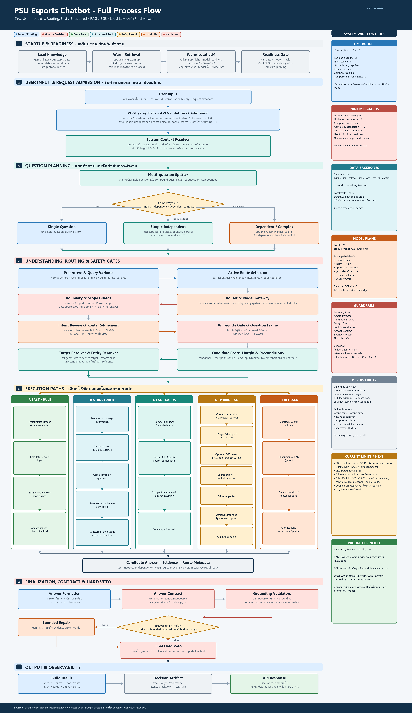

# PSU Esports Chatbot: Full Process Flow

สถานะเอกสาร: 2026-08-07  
ขอบเขต: Local-first chatbot สำหรับ PSU Esports Studio - Phuket  
Source หลัก: `18_PSU_Esports_Update_Route_Data`



## 1. เป้าหมายของระบบ

ระบบต้องตอบภาษาไทยแบบ answer-first โดยใช้ข้อมูลจริงของ PSU Esports Studio - Phuket เท่านั้นเมื่อคำถามเกี่ยวข้องกับศูนย์ หลักการตัดสินใจคือ:

1. ใช้ Fast, Rule, Calculator หรือ Structured Tool ก่อน เมื่อข้อมูลและ target ชัดเจน
2. ใช้ RAG เมื่อจำเป็นต้องค้นหลักฐานจากเอกสารหรือ fact cards
3. ใช้ Local LLM แบบ gated เพื่อช่วยวางแผน ตีความ หรือเรียบเรียงจาก evidence เท่านั้น
4. ถ้าคำถามกำกวมให้ถามกลับ
5. ถ้าไม่มี evidence ที่ยืนยันได้ให้ตอบ no-answer ห้ามเดา
6. ทุกคำตอบต้องผ่าน validation, answer contract และ final hard veto
7. Product ตั้งเป้าเวลาที่ผู้ใช้เห็นไม่เกินประมาณ 10 วินาที

## 2. Flow รวมตั้งแต่ Input ถึง Output

```text
Startup / Warmup
  -> โหลด aliases, structured data, routing catalog, curated/vector index
  -> รัน probe queries สำหรับ cache
  -> optional BGE reranker warmup
  -> Ollama LLM preflight + keep_alive

User Input
  -> Web/API Request Intake
  -> Body/Question Validation
  -> Admission Control + Session Lock
  -> Global Request Deadline
  -> Session Context Resolver
  -> Split Multi-question
  -> Complexity Gate
  -> Optional Query Planner
  -> Single Question หรือ Compound Execution
  -> Preprocess / Normalize / Query Variants
  -> Active Query Selection
  -> Entity + Reference + Target Resolution
  -> Boundary Guard + Scope Guard
  -> Route + Universal Intent + Optional Tool Router
  -> Ambiguity Gate
  -> Question Frame + Answer-Type Plan
  -> Capability Candidate Scoring + Margin Threshold
  -> Tool Preconditions
  -> Execution Path
       Fast / Rule / Calculator
       Structured Tools
       Competition Fact Cards
       Curated / Vector / Hybrid RAG
       Optional BGE Reranker
       Evidence Packer + Source Guard
       Optional Grounded Local LLM Composer
       General Local LLM เฉพาะ policy อนุญาต
  -> Formatter
  -> Base Validator
  -> Answer Contract
  -> Grounding / Source / Numeric Claim Validation
  -> Bounded Repair
  -> Final Hard Veto
  -> Timeout / Clarification / No-answer Fallback เมื่อจำเป็น
  -> Build Result + Decision Artifact + Trace
  -> API Response
  -> Web Chat Output + Sources
  -> Async Chat Log / Metrics
```

## 3. Startup และ Runtime Readiness

ก่อนรับคำถาม ระบบเตรียมทรัพยากรที่มี cold-start cost:

| Process | หน้าที่ | พฤติกรรมปัจจุบัน |
|---|---|---|
| Game alias warmup | โหลดชื่อเกม alias, compact index และ typo helpers | ทำใน startup warmup |
| Structured data warmup | โหลดข้อมูลสมาชิก เกม อุปกรณ์ ปุ่ม โซน ตาราง และราคา | ทำใน startup warmup |
| Routing warmup | โหลด routing matrix และ semantic intent catalog | ทำใน startup warmup |
| Retrieval warmup | โหลด curated rows, competition fact cards, vector index และ game alias index | ทำใน startup warmup |
| Probe queries | กระตุ้น cache ของ Fast, Structured, Knowledge และ News path | ทำใน startup warmup |
| BGE warmup | โหลด `BAAI/bge-reranker-v2-m3` เข้า RAM/VRAM | optional ผ่าน `PSU_PIPELINE_WARMUP_RERANKER=1` |
| LLM preflight | เรียก Typhoon แบบสั้นเพื่อตรวจสุขภาพและ warm model | เปิดโดย default ผ่าน LLM health manager |
| Ollama keep-alive | รักษา model ใน memory หลังใช้งาน | ค่าเริ่มต้น `10m` |

หมายเหตุ: BGE cold load ที่เคยวัดได้ประมาณ 93.46 วินาทีต้องเกิดก่อน readiness ไม่ควรเกิดใน user request ถ้า model ยังไม่ warm และเวลาไม่พอ ระบบจะ skip reranker แล้วใช้ hybrid score

## 4. Request Intake และ Multi-user Guard

### 4.1 Web/API Intake

Entry point หลักคือ `POST /api/chat` ใน `app/web_api/server.py`

1. ตรวจ `Content-Length` และ JSON body
2. อ่าน `question`, `client_session_id`, `recent_history` และ experimental flags
3. ปฏิเสธ question ว่างหรือยาวเกิน limit
4. สร้าง `request_id` และเริ่มจับ wall time

### 4.2 Admission Control

| Guard | ค่าเริ่มต้น | ผลเมื่อไม่ผ่าน |
|---|---:|---|
| Active request semaphore | 16 requests | HTTP 503 `server_busy` |
| Per-session lock | รอ 0.10 วินาที | HTTP 409 `session_busy` |
| LLM concurrency | 1 call พร้อมกัน | รอสั้น ๆ แล้ว fallback/skip หาก slot ไม่ว่าง |
| Per-request LLM budget | สูงสุด 2 calls | ไม่อนุญาต LLM call เพิ่ม |
| Compound workers | สูงสุด 2 | จำกัด bounded parallel |

ระบบปัจจุบันเป็น in-process guard ยังไม่ใช่ distributed queue หากเปิดหลาย process แต่ละ process จะมี semaphore, cache และ BGE model ของตัวเอง

### 4.3 Global Deadline

- Product backend budget เริ่มต้นประมาณ 9 วินาที
- เป้าหมาย user-visible cap ประมาณ 10 วินาที
- กัน finalizer reserve ประมาณ 1 วินาทีสำหรับ validation, formatting และ response I/O
- ทุก LLM/tool ที่รองรับ deadline จะลด timeout ตามเวลาที่เหลือ
- ถ้าหมดเวลา ระบบสร้าง timeout-safe no-answer โดยไม่เปิดเผย internal error

## 5. Session Context Resolver

`app/session/context_resolver.py` ใช้ recent history เพื่อ resolve คำอ้างอิง เช่น:

- เกมนั้น
- เครื่องนั้น
- อันเดิม
- แล้วราคาเท่าไหร่
- ปุ่มอะไร

ผลลัพธ์อาจเป็น:

1. `resolved`: มี evidence ในประวัติชัดเจน จึงเติม target ให้คำถาม
2. `unchanged`: คำถามสมบูรณ์อยู่แล้ว
3. `ambiguous`: มีหลาย candidate หรือไม่มีหลักฐานพอ ต้องถามกลับ

ระบบห้ามเดา reference จากชื่อที่ใกล้เคียงเพียงอย่างเดียว

## 6. Compound Question Flow

### 6.1 Split Multi-question

แยกคำถามหลายส่วนโดยรักษาประโยคที่เป็นข้อมูลเดียวกัน และแยก supported question ออกจาก boundary tail เมื่อจำเป็น

### 6.2 Complexity Gate

จำแนกเป็น:

| ระดับ | ตัวอย่าง | วิธีทำงาน |
|---|---|---|
| Single | `PC ราคาเท่าไหร่` | เข้า single pipeline |
| Simple independent | `PS5 มีเกมอะไร และ PC ราคาเท่าไหร่` | bounded parallel เมื่อ child เป็น deterministic |
| Ordered dependent | `เกมนั้นมีปุ่มอะไร แล้วราคาเท่าไหร่` | ทำตาม dependency order และ resolve reference จาก child ก่อนหน้า |
| Complex/broad | มีหลายเงื่อนไข เปรียบเทียบ หรือสรุปกว้าง | optional Query Planner |

### 6.3 Query Planner

- ใช้ Local LLM เฉพาะ complex compound ที่ gate อนุญาต
- timeout cap สูงสุด 4 วินาที
- output ต้องเป็น bounded task/dependency plan
- ถ้า planner fail/timeout ระบบกลับ deterministic split/ordered execution
- child paths ใช้ LLM budget ร่วมกับ parent request

## 7. Single-question Understanding Pipeline

| Step | Process | ผลลัพธ์ |
|---:|---|---|
| 1 | Preprocess | clean query, normalized query, language hint, query variants |
| 2 | Active Query Selection | เลือก original/variant ที่ route ชัดกว่า |
| 3 | Entity Extraction | วัน เวลา service user group duration price intent และ flags |
| 4 | Reference/Target Resolution | game, equipment, zone หรือ target ที่ยืนยันได้ |
| 5 | Boundary Guard | allow, refuse, privacy/safety response หรือ no-answer |
| 6 | Scope Guard | ตรวจว่าอยู่ในขอบเขต PSU/general ที่ policy รองรับ |
| 7 | Heuristic Router | category, intent, confidence, answer type, risk |
| 8 | Model Gateway Preflight | ตัดสินว่าจะอนุญาต optional intent/tool LLM หรือสงวน budget ให้ RAG |
| 9 | Universal Intent | domain, operation, target, filters, needs, answer style |
| 10 | Route Refinement | ปรับ route จาก intent ที่มี confidence เพียงพอ |
| 11 | Optional Tool Router | เสนอ fast/structured/retrieval/clarification จาก candidate JSON |
| 12 | Ambiguity Gate | ตรวจ missing target, mixed intent, low margin และ reference ambiguity |
| 13 | Question Frame | operation-first frame, expected answer types และ target status |
| 14 | Candidate Scoring | ให้คะแนน capability ทั้งหมดและคำนวณ margin |
| 15 | Tool Preconditions | ยืนยันว่า tool มี input/evidence ที่จำเป็นก่อน execute |

## 8. Boundary, Ambiguity และ Candidate Decision

### 8.1 Boundary Guard

ตรวจคำถามที่อยู่นอกขอบเขต ความเป็นส่วนตัว คำขอที่ไม่มีข้อมูลจริง หรือคำถามที่ห้ามคาดเดา หาก match ชัดจะหยุด flow ก่อนใช้ LLM/RAG

### 8.2 Ambiguity Gate

ตรวจอย่างน้อย:

- target หายไปแต่ operation ต้องใช้ target
- มีหลายเกม/หลายอุปกรณ์ที่คะแนนใกล้กัน
- route และ universal intent ขัดกัน
- คำอ้างอิงไม่มี context
- คำถามวิธีเล่น/ปุ่มไม่มีชื่อเกม
- candidate margin ต่ำเกิน threshold

ผลคือ `allow`, `clarification` หรือ `no-answer`

### 8.3 Capability Registry

Candidate หลักประกอบด้วย:

- `fast.price_calculator`
- `fast.domain_handlers`
- `structured.members`
- `structured.games`
- `structured.game_controls`
- `structured.equipment`
- `structured.reservation`
- `structured.schedule`
- `structured.service_fee`
- `rulebase.category_rules`
- `retrieval.hybrid_guarded`
- `retrieval.vector_guarded`
- `llm.facts_composer`
- `clarification.ask_user`
- `fallback.no_answer`

Candidate ที่ precondition ไม่ผ่านจะถูก reject ก่อน execution ส่วน candidate ที่คะแนนใกล้กันเกินไปอาจถูก abstain และถามกลับ

## 9. Execution Paths

### 9.1 Fast / Rule / Calculator

ใช้เมื่อ intent และ entities ชัดเจน:

- คำนวณค่าบริการตามโซน กลุ่มผู้ใช้ และระยะเวลา
- schedule/calendar fast path
- check-in, penalty และ reservation facts ที่เป็น rule ชัดเจน
- domain-specific deterministic handlers

ข้อดีคือเร็ว ไม่ใช้ LLM และผลลัพธ์อ้างจากข้อมูลที่กำหนดไว้

### 9.2 Structured Tools

อ่านข้อมูลแบบ schema โดยตรง:

| Tool domain | ตัวอย่างคำตอบ |
|---|---|
| Members | รายชื่อ จำนวน และกลุ่มสมาชิก |
| Games | catalog 42 เกม, availability, platform/zone, game detail |
| Game controls | ปุ่มและวิธีควบคุมของเกมที่ resolve target ได้ |
| Equipment | รายการและสเปกเครื่อง/อุปกรณ์ |
| Reservation | วิธีจอง เงื่อนไข การชำระเงิน และข้อมูลที่ยืนยันแล้ว |
| Schedule | วัน เวลาเปิด และวันหยุดจาก calendar context |
| Service fee | ราคาและการคำนวณตาม service/user group/duration |

Structured path อาจส่ง draft ที่ยืนยันแล้วให้ optional facts-only LLM composer เรียบเรียง แต่ถ้า LLM ถูกปิด ไม่พร้อม หรือไม่ผ่าน validator จะใช้ structured draft เดิม

### 9.3 Competition Fact Cards

ใช้ fact cards ที่แปลงจากกติกาการแข่งขัน เช่น team size, map pool, pause, timeout, device และ penalty โดยต้อง match เกม/ทัวร์นาเมนต์/หัวข้อให้ถูก

### 9.4 Game-control Vector-first

คำถามปุ่มหรือ controls ที่มี target ชัดอาจใช้ guarded vector retrieval เพื่อหา control document เฉพาะเกม จากนั้นยังต้องผ่าน entity match, category guard และ answer contract

### 9.5 Guarded Hybrid RAG

```text
Retrieval Budget
  -> Curated Retrieval
  -> Local Vector Retrieval
  -> Category / Entity / Competition Guards
  -> Deduplicate + Hybrid Score
  -> Optional BGE Document Reranker
  -> Source Authority / Staleness / Conflict Guard
  -> Draft Answer from verified hits
  -> Model Gateway
       deterministic RAG
       หรือ grounded composer เมื่อ budget/evidence พอ
```

รายละเอียด:

1. Query ปกติใช้ candidate ประมาณ 8 และ final ประมาณ 4
2. Query broad/complex ขยาย candidate ประมาณ 12 และ final ประมาณ 5
3. Curated และ vector hits ถูก merge/deduplicate
4. BGE reranker ใช้เมื่อเปิด feature, มีอย่างน้อย 2 candidates, model warm และ deadline พอ
5. ถ้า BGE ไม่พร้อม ใช้ hybrid score โดยไม่ทำให้ request fail
6. ผล hybrid ถูก reuse ใน vector fallback ไม่ scan vector index ซ้ำ

### 9.6 Evidence Packer และ Source Guard

Evidence packer:

- deduplicate source
- จำกัดจำนวนรายการและความยาว prompt
- ใส่ `source_id`, title, text, URL, trust, updated time และ score
- ค่าเริ่มต้นไม่เกิน 4 items / 4,200 characters

Source guard:

- ตรวจ authority และ source IDs
- ตรวจ stale metadata
- ตรวจ numeric conflict ภายใน claim เดียวกันด้วย `claim_key`/`fact_key`
- ห้ามรวมตัวเลขจากข่าวคนละ source เป็น conflict เดียวกัน
- ถ้ามี conflict ที่แก้ไม่ได้ จะไม่ส่งต่อให้ LLM composer

### 9.7 Grounded Local LLM Composer

Model ปัจจุบัน: `scb10x/typhoon2.5-qwen3-4b`

Composer จะถูกเรียกเมื่อ:

- request อนุญาต LLM
- model-first/RAG composer เปิด
- มี evidence ที่ผ่าน guard
- ไม่มี source conflict
- เหลือเวลาอย่างน้อย 8 วินาที
- LLM health circuit เปิดใช้งานได้
- ยังไม่เกิน per-request LLM call budget
- ได้ concurrency slot

Runtime policy ปัจจุบัน:

- timeout สูงสุด 8 วินาที แต่ถูกบีบตาม global deadline
- `num_predict=64`
- `num_ctx=3072`
- streaming response และ close socket เมื่อ timeout
- `keep_alive=10m`
- LLM assist ทาง RAG สูงสุดหนึ่งทางต่อ request เพื่อไม่เรียก composer และ experimental RAG LLM ซ้ำ

หลัง LLM ตอบ ระบบตรวจ:

- prompt leak
- source line เปลี่ยนหรือหาย
- unsupported numeric claim
- low evidence overlap
- claim grounding

ถ้าไม่ผ่านจะทิ้งคำตอบ LLM และกลับ structured/RAG draft หรือ no-answer

### 9.8 General Local LLM

ใช้เฉพาะคำถามความรู้ทั่วไปที่ policy ระบุว่าไม่ใช่ข้อมูลเฉพาะของ PSU หากคำถามมี PSU signal แต่ไม่มี evidence ระบบห้ามใช้ general model เดาและต้องตอบ no-answer

### 9.9 Experimental Fallback

เป็น feature-gated path สำหรับทดลอง RAG/general LLM ไม่ใช่แกนหลัก หาก main RAG composer ถูกลองแล้วหรือพบ source conflict จะส่ง `allow_llm=false` เพื่อป้องกัน LLM call ซ้ำ

## 10. Validation, Repair และ Final Hard Veto

ทุก execution path ต้องมารวมที่ขั้นตอนนี้:

1. `format_answer()` ทำรูปแบบภาษาไทย answer-first และ source line
2. Base Validator ตรวจคำตอบว่าง ความสอดคล้องกับ route/target และ unsupported content
3. Answer Contract ตรวจ expected answer type, required slots, evidence และ target coverage
4. Grounding Validator ตรวจตัวเลขและ claims ของ LLM เทียบ evidence
5. Bounded Repair อนุญาตเฉพาะการแก้ที่มีขอบเขต เช่นเติม source lineจาก evidence หรือกลับ draft ที่ยืนยันแล้ว
6. Final Validation ใน `_build_result()` ตรวจอีกครั้งก่อนส่งออก
7. Final Hard Veto เปลี่ยนเป็น clarification/no-answer เมื่อคำตอบยังเสี่ยงหรือไม่รองรับ

ระบบไม่แก้ด้วยการลดมาตรฐาน expected result เพื่อให้ test ผ่าน

## 11. Fallback Matrix

| เหตุการณ์ | Output |
|---|---|
| Reference/target กำกวม | Clarification question |
| ไม่มี evidence ของ PSU | Safe no-answer |
| LLM timeout/unavailable | Structured/RAG draft ถ้าผ่าน validation ไม่เช่นนั้น no-answer |
| BGE cold/not ready | Skip reranker และใช้ hybrid score |
| Source conflict | หยุด grounded composer และใช้ deterministic review/no-answer |
| Candidate margin ต่ำ | Abstain/clarification |
| Global deadline หมด | Timeout-safe no-answer |
| Compound บาง child ตอบได้ | Partial grounded answer เฉพาะส่วนที่ยืนยันได้ |
| Final validation fail | Bounded repair แล้ว final veto |

## 12. Output และ Logging

### 12.1 Pipeline Result

ผลลัพธ์ภายในประกอบด้วย:

- `answer`
- `mode`
- `route.category` / `route.intent`
- `universal_intent`
- `confidence`
- `entities`
- `hits` / sources
- `validation`
- `trace`
- `decision_artifact`
- `elapsed`

### 12.2 API Response

API ส่ง:

- answer และ mode
- route/intent/confidence
- latency และ wall time
- deadline metadata
- source IDs/URLs
- validation status
- calendar context
- debug trace/decision artifact เมื่อเปิด debug

### 12.3 Logging และ Observability

- chat log เขียนแบบ asynchronous หลังส่ง response
- timing trace แยก stage รวมถึง hybrid curated/vector, merge, reranker, evidence packer และ composer
- LLM metadata มี model, timeout, num_predict, prompt chars, elapsed, response chars, health และ deadline
- metrics ที่ควรติดตามต่อคือ queue wait, mode share, P95/P99, timeout rate, LLM calls, source conflicts, session lock และ cancellation

## 13. Time Budget ปัจจุบัน

| Budget | ค่า |
|---|---:|
| User-visible target | ประมาณ 10 วินาที |
| Product backend | 9 วินาที |
| Finalizer reserve | 1 วินาที |
| Query Planner cap | 4 วินาที |
| Grounded composer cap | 8 วินาที |
| Composer minimum remaining | 8 วินาที |
| LLM calls/request | สูงสุด 2 |
| LLM concurrency | 1 |
| Compound workers | สูงสุด 2 |

ค่าที่วัดได้ล่าสุด:

- Fast price warm ประมาณ 0.16-0.18 วินาที
- Structured warm ประมาณ 0.3-0.7 วินาทีใน probe หลัก
- Hybrid/vector หลัง warmupประมาณ 0.14 วินาทีเฉพาะ retrieval
- Product-like warm RAG + LLM ประมาณ 7.75 วินาที โดย composer ประมาณ 7.27 วินาที
- BGE cold load เคยประมาณ 93.46 วินาที จึงต้องย้ายออกจาก user request

## 14. Data และ Model Backbones

| Backbone | ใช้กับ |
|---|---|
| Structured JSON/CSV | สมาชิก เกม อุปกรณ์ ราคา ตาราง การจอง และ controls |
| Curated rows | knowledge, news, FAQ และข้อมูลอธิบาย |
| Competition fact cards | กติกาการแข่งขันที่แปลงเป็น fact schema |
| Local hash vector index | retrieval ปัจจุบัน ยังไม่ใช่ semantic embedding เต็มรูปแบบ |
| BGE CrossEncoder | optional document reranking |
| Typhoon 4B ผ่าน Ollama | planner, intent review, tool router, composer, general fallback และ critic แบบ gated |
| Source registry/contract | source IDs, URL, category, authority และ provenance |

## 15. File-to-Process Map

| Process | Source หลัก |
|---|---|
| Web/API, admission, session lock | `app/web_api/server.py` |
| Session context | `app/session/context_resolver.py` |
| Global deadline/LLM budget | `app/pipeline/request_deadline.py` |
| Startup warmup | `app/pipeline/warmup.py` |
| Main orchestration | `app/pipeline/engine.py` |
| Preprocess/entities | `app/pipeline/preprocess.py` |
| Boundary/ambiguity | `boundary_guard.py`, `ambiguity_gate.py` |
| Intent/tool routing | `universal_intent.py`, `llm_tool_router.py`, `routing.py` |
| Compound planner | `complexity_gate.py`, `query_planner.py` |
| Question frame/candidates | `question_frame.py`, `capability_registry.py` |
| Target/entity resolution | `entity_resolver.py`, `game_title_correction.py` |
| Structured execution | `structured_tools.py`, `tool_preconditions.py` |
| Fast/rules | `fast_paths.py`, `deterministic.py`, `rules.py` |
| Curated/vector/hybrid retrieval | `retrieval.py`, `vector_retrieval.py`, `hybrid_retrieval.py` |
| BGE reranker | `document_reranker.py` |
| Model policy/evidence | `model_gateway.py`, `evidence_packer.py`, `source_guard.py` |
| Grounded composer | `facts_composer.py` |
| Claim validation | `claim_validator.py` |
| General/experimental LLM | `experimental_fallback.py` |
| LLM health/concurrency | `llm_health.py` |
| Formatting/validation | `formatter.py`, `validator.py`, `answer_contracts.py` |
| Decision artifact | `decision_artifact.py` |
| Logging | `app/session/chat_logger.py` |

## 16. Safety Invariants

1. ไม่มีข้อมูล PSU จริง ห้ามเดา
2. Structured/Fast/RAG answer ห้ามอ้างว่าเป็นคำตอบจาก LLM
3. Reference ต้อง resolve จาก evidence หรือถามกลับ
4. LLM ต้องไม่เพิ่มตัวเลข ชื่อ ราคา เวลา หรือกฎที่ไม่มีใน evidence
5. Source conflict ต้องไม่ถูกปกปิดด้วยการเรียบเรียงของ LLM
6. Timeout ต้องจบด้วย safe fallback ไม่ใช่ partial model output ที่ยังไม่ validate
7. Booking path ให้คำแนะนำเท่านั้น ยังไม่ทำ transaction จริง
8. Test failure ต้องแก้ route/intent/target/source/logic ที่ root cause

## 17. ข้อจำกัดที่ยังเหลือ

- ยังไม่ได้รัน full 1,500+/1,600 evaluation หลัง latency/model-first changes ล่าสุด
- ยังไม่ได้ทำ multi-user load test อย่างน้อย 5 sessions พร้อมกัน
- LLM queue และ concurrency guard ยังเป็น in-process ไม่ใช่ shared/distributed queue
- Ollama streaming close เป็น best-effort ยังไม่ใช่ process-level hard cancellation
- BGE ต้องโหลดหนึ่งครั้งต่อ process และกิน RAM/VRAM ขณะ resident
- Vector backend ยังเป็น local hash char n-gram ไม่ใช่ semantic embedding เต็มรูปแบบ
- Controls บาง source ยังต้อง manual verification
- ข่าวและกิจกรรมล่าสุดยังต้องเพิ่มข้อมูลต่อเนื่อง
- ระบบให้วิธีจอง แต่ยังไม่ทำ booking transaction

## 18. Flow Summary

ระบบปัจจุบันเป็น evidence-first orchestration: รับคำถามและ context ก่อน แยกความซับซ้อน ตรวจ scope/ambiguity/target แล้วเลือก capability ที่มีหลักฐานเหมาะสม Fast และ Structured เป็นเส้นหลัก RAG เพิ่ม coverage จากข้อมูลจริง ส่วน Local LLM ช่วยเฉพาะจุดที่ gate, budget, source และ validator อนุญาต ทุกเส้นทางรวมกลับมาที่ answer contract และ final hard veto ก่อนส่งผลลัพธ์พร้อม source, trace และ metrics ให้ผู้ใช้
