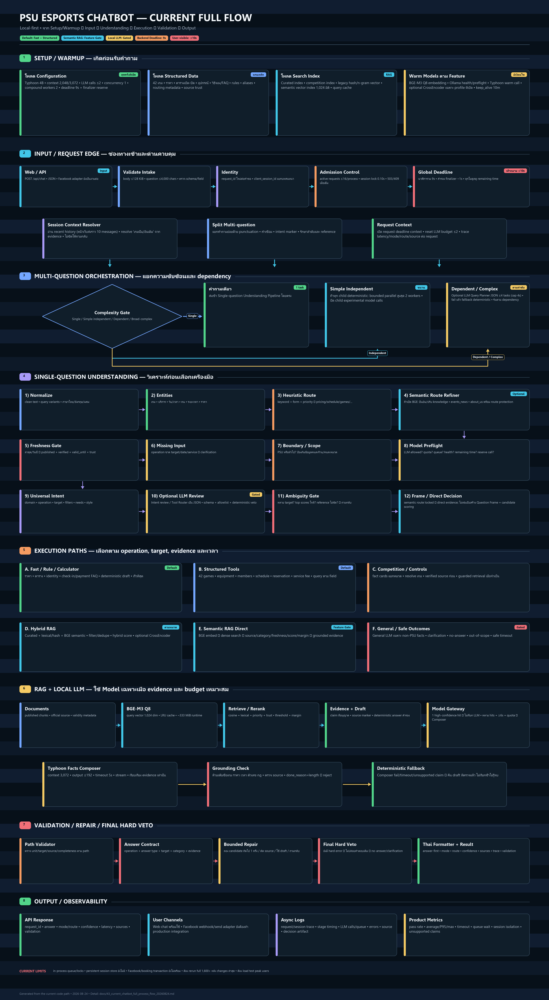
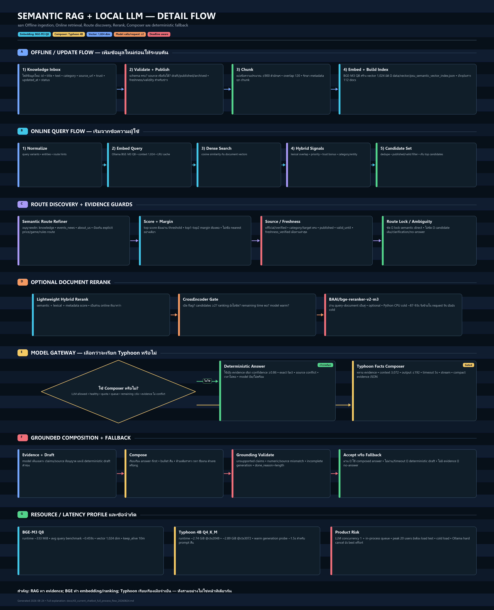

# PSU Esports Chatbot: Current Full Process Flow (2026-08-24)

เอกสารนี้อธิบาย Flow ปัจจุบันของ PSU Esports Chatbot จากโค้ดที่ใช้งานจริง ตั้งแต่การเปิดระบบ รับข้อความ วิเคราะห์คำถาม เลือกเส้นทางค้นข้อมูล ใช้ Structured/Fast/RAG/Local LLM ตรวจคำตอบ ไปจนถึงส่งผลกลับเว็บหรือช่องทางภายนอก

> ขอบเขตของเอกสาร: เป็นสถานะปัจจุบัน ณ วันที่ 2026-08-24 ไม่ใช่สถาปัตยกรรมในอุดมคติ และจะแยกสิ่งที่ทำงานเป็นค่าเริ่มต้นออกจากสิ่งที่ต้องเปิด feature flag ให้ชัดเจน

## แผนภาพ

### ภาพรวมทุก Process



### ขยายเฉพาะ Semantic RAG และ Local LLM



## 1. สรุป Flow แบบสั้นที่สุด

```text
เปิดระบบ
  -> โหลดข้อมูล/ดัชนี/แคช และ Warm model ตาม feature ที่เปิด
  -> รับข้อความจาก Web/API พร้อม session และ history
  -> สร้าง request_id + Admission Control + Global Deadline
  -> Resolve บริบทจาก session/history
  -> แยกว่ามีหนึ่งคำถามหรือหลายคำถาม
  -> ถ้าหลายคำถาม: วัดความซับซ้อน + วาง dependency plan เมื่อจำเป็น
  -> วิเคราะห์คำถามย่อยแต่ละข้อ
  -> ตรวจขอบเขต PSU + ความกำกวม + target + freshness
  -> เลือก Execution Path
       Fast/Rule | Structured Tool | Competition/Controls
       Hybrid RAG | Semantic RAG | General Local LLM | Safe No-answer
  -> สร้าง Draft/Evidence
  -> ใช้ Local LLM Composer เฉพาะกรณีที่เปิดและคุ้มเวลา
  -> Validate + Answer Contract + Grounding
  -> Bounded Repair ได้อย่างจำกัด
  -> Final Hard Veto
  -> จัดรูปแบบคำตอบ + ส่ง API Response + เขียน Log แบบ async
```

หลักสำคัญคือ ระบบไม่ได้บังคับให้ทุกคำถามผ่าน LLM หรือ RAG ทุกครั้ง เส้นทางที่มีข้อมูลชัดใน Rule/Structured จะตอบตรงจากข้อมูลเหล่านั้น ส่วน RAG และ LLM จะถูกใช้เมื่อประเภทคำถามและหลักฐานเหมาะสม รวมถึงมีเวลาเหลือใน Deadline เพียงพอ

## 2. ส่วนที่เกิดก่อนมี User Input: Setup และ Warmup

เมื่อเปิด backend ระบบเตรียมทรัพยากรที่ต้องใช้ซ้ำไว้ก่อน เพื่อลด cold-start ของคำขอแรก

### 2.1 โหลด Configuration

ค่าหลักของ production-oriented local profile ปัจจุบัน:

| รายการ | ค่าปัจจุบัน/ค่าเป้าหมาย |
|---|---:|
| Product backend deadline | 9 วินาที |
| User-visible cap | ไม่เกินประมาณ 10 วินาที |
| เวลาสำรอง Finalizer | 1 วินาที |
| Local LLM | `scb10x/typhoon2.5-qwen3-4b` |
| General LLM context | 2,048 tokens |
| Facts Composer context | 3,072 tokens |
| Facts Composer timeout | 5 วินาที |
| Facts Composer output cap | 192 tokens |
| LLM calls ต่อ request | สูงสุด 2 ครั้ง |
| LLM concurrency | 1 งานใน process |
| รอคิว LLM | ประมาณ 0.20 วินาที |
| Compound workers | สูงสุด 2 |
| Complex Query Planner cap | 4 วินาที |
| Semantic embedding model | `psu-bge-m3:q8_0` |
| Embedding context | 1,024 tokens |
| Ollama keep-alive | 10 นาที |

ค่า context สูงสุดที่ประกาศใน metadata ของ Typhoon/Qwen ไม่ได้แปลว่าระบบจอง context 262,144 tokens ทุกครั้ง การเรียกจริงของโปรเจกต์จำกัดไว้ประมาณ 2,048-3,072 tokens ตามหน้าที่ เพื่อลด VRAM/RAM และเวลา

### 2.2 โหลดข้อมูล Structured และ Routing Data

ข้อมูลที่โหลดเข้า memory/cache ได้แก่:

- รายชื่อและ alias ของเกม เพื่อจับคำสะกดต่างรูป เช่นชื่อไทย ชื่ออังกฤษ ชื่อย่อ
- Game catalog ปัจจุบัน 42 เกมแบบไม่ซ้ำ
- ราคา เวลาเปิด-ปิด ตารางบริการ อุปกรณ์ กติกาการใช้บริการ วิธีจองและข้อมูล FAQ
- Fact cards ของการแข่งขันและข้อมูลเฉพาะหมวด
- Keyword/routing configuration สำหรับหา intent, operation, target และ category
- Source metadata เช่น trust level, category, published status, updated date และ validity

Structured data เหมาะกับข้อเท็จจริงที่ต้องแม่นและมี schema ชัด เช่น ราคา เวลา รายชื่อเกม หรือเงื่อนไขการใช้บริการ เพราะค้นตาม field ได้โดยตรงและตรวจความครบถ้วนง่าย

### 2.3 สร้าง/โหลดดัชนีค้นข้อมูล

ระบบมีดัชนีหลายชนิดซึ่งทำหน้าที่ไม่เหมือนกัน:

1. Curated index: รายการข้อความหรือ fact card ที่จัดหมวดและตรวจแหล่งที่มาไว้แล้ว
2. Competition index: ข้อมูลการแข่งขันแยกเฉพาะเพื่อไม่ให้ปนกับข้อมูลร้านหรือเกมทั่วไป
3. Legacy hash/character n-gram vector index: เปรียบเทียบรูปแบบตัวอักษร เหมาะกับการหาเอกสารที่มีคำใกล้กัน แต่ไม่เข้าใจความหมายลึกเท่า semantic embedding
4. Semantic vector index: vector จาก BGE-M3 ใช้วัดความใกล้กันทางความหมาย
5. Optional CrossEncoder reranker: อ่าน query กับ candidate เป็นคู่แล้วจัดอันดับใหม่ ใช้เฉพาะเมื่อเปิดและมีเวลาเพียงพอ

Semantic index ปัจจุบันอยู่ที่ `data/vector/psu_semantic_vector_index.json` และใช้ vector ขนาด 1,024 มิติจาก `psu-bge-m3:q8_0`

### 2.4 Warm Cache

Warm cache คือการเรียกฟังก์ชันสำคัญด้วย probe query เล็กๆ ตั้งแต่เปิดระบบ เพื่อให้เกิดสิ่งต่อไปนี้ก่อน user จริง:

- Python modules และ tokenizer ถูก import แล้ว
- ไฟล์ข้อมูลและดัชนีถูกอ่านเข้า RAM แล้ว
- alias/routing cache พร้อมใช้
- query cache และ internal object ต่างๆ ถูกสร้างแล้ว
- ลดเวลาที่คำถามแรกต้องจ่ายแทนการเริ่มระบบ

Cache ไม่ได้หมายถึงเก็บทุกคำตอบของผู้ใช้ไว้ใน RAM ทั้งหมด แต่เป็นข้อมูลหรือผลคำนวณที่ใช้ซ้ำได้ โดย cache บางชนิดมีขนาดจำกัด เช่น LRU query embedding cache

### 2.5 Warm BGE และ Warm Local LLM

ถ้าเปิด Semantic RAG ระบบสามารถส่ง probe ไปที่ Ollama เพื่อโหลด BGE-M3 เข้า RAM/VRAM และทดสอบว่าสร้าง embedding ได้จริง

ถ้าเปิด Local LLM ระบบทำ preflight/warm call เพื่อ:

- ตรวจว่า Ollama พร้อม
- ตรวจว่า model ที่กำหนดมีอยู่
- โหลด model เข้า memory ล่วงหน้า
- ลด cold load ในคำถามจริง
- เปิด circuit breaker/health state ให้รู้ว่าควรเรียก model หรือ fallback

`keep_alive=10m` หมายถึง Ollama พยายามเก็บ model ที่เพิ่งใช้ไว้ประมาณ 10 นาที หลังไม่มีงาน model อาจถูก unload เพื่อคืนทรัพยากร และคำขอถัดไปจะมี cold-load cost อีกครั้ง

### 2.6 Cold-start Cost คืออะไร

Cold start คือเวลาที่เกิดตอนทรัพยากรยังไม่เคยถูกโหลดหรือถูก unload ไปแล้ว เช่น:

- Import PyTorch/Transformers
- อ่านไฟล์ model หลายร้อย MB หรือหลาย GB จาก disk
- ย้าย weights เข้า RAM/VRAM
- สร้าง CUDA context
- Compile/initialize kernels
- อ่านและ parse vector index

เหตุที่ CrossEncoder BGE แบบ Python เคยใช้ประมาณ 87-93 วินาที ไม่ใช่เวลาต่อ query ปกติทั้งหมด แต่เป็นการ import และโหลด model ขนาดใหญ่บน CPU ครั้งแรก ในขณะที่ BGE-M3 embedding ผ่าน Ollama แบบ warm ใช้เวลาสั้นกว่ามาก

## 3. ช่องทาง Input: Web, API และ Facebook ในอนาคต

### 3.1 Web Chat

หน้าเว็บเก็บ `client_session_id` ที่ browser สร้าง และส่งข้อความล่าสุดพร้อม recent history ไป backend

พฤติกรรมปัจจุบัน:

- history จากหน้าเว็บส่งล่าสุดไม่เกินประมาณ 10 messages
- เมื่อปิดหรือ refresh หน้าที่ไม่ได้ persist history ไว้ บริบทบนหน้าอาจหาย
- session ID ใช้แยกการสนทนาและช่วย resolve reference ไม่ใช่ request ID
- หน้าเว็บ local อนุญาต experimental LLM; remote hostname ปัจจุบันปิด LLM จากฝั่ง frontend ตาม policy

### 3.2 HTTP API

Endpoint หลักคือ `POST /api/chat`

ตัวอย่าง payload:

```json
{
  "question": "เกมนั้นเล่นได้กี่คน แล้วชั่วโมงละเท่าไร",
  "client_session_id": "browser-session-123",
  "recent_history": [
    {"role": "user", "content": "มี Overcooked 2 ไหม"},
    {"role": "assistant", "content": "มี Overcooked 2 ..."}
  ],
  "debug": false,
  "experimental_rag_fallback": true,
  "experimental_allow_llm": true
}
```

JSON เป็นรูปแบบส่งข้อมูลระหว่างหน้าเว็บ/ช่องทางภายนอกกับ backend ไม่ใช่ฐานข้อมูลและไม่ใช่คำตอบของ chatbot โดยตรง

ข้อจำกัด intake ปัจจุบัน:

- Request body สูงสุดประมาณ 128 KiB
- คำถามยาวสูงสุด 4,000 ตัวอักษร
- ตรวจชนิดข้อมูลและ field ก่อนเข้าตัว pipeline

### 3.3 Facebook Adapter

เป้าหมาย product คือรับ webhook จาก Facebook แล้วแปลง event ให้เป็น schema เดียวกับ `/api/chat` จากนั้นส่งคำตอบกลับ Messenger API แต่ adapter สำหรับ Facebook ยังไม่ใช่ส่วน production ที่เสร็จสมบูรณ์ใน flow ปัจจุบัน

## 4. Request Identity, Session และ Admission Control

### 4.1 Request ID

ทุกคำขอจะได้ UUID ใหม่หนึ่งค่า เช่น `4f16...` ใช้สำหรับ:

- ผูก trace ของ process ทั้งหมดในคำขอนั้น
- ผูก latency, mode, route, validation และ error ใน log
- ตามปัญหาว่า request ใด timeout หรือตอบผิด

Request ID ไม่ใช่ session ID และไม่ได้ใช้เป็นความจำของบทสนทนา

### 4.2 Client Session ID

Session ID ใช้บอกว่าหลาย request มาจากการสนทนาเดียวกัน ทำให้ระบบสามารถ:

- อ่าน recent history ที่ client ส่งมา
- resolve คำอ้างอิง เช่น “เกมนั้น”, “เครื่องเดิม”, “อันเมื่อกี้”
- กันคำขอซ้อนกันใน session เดียวกันช่วงสั้นๆ

ปัจจุบัน backend ยังไม่มี persistent long-term conversation memory เต็มรูปแบบ บริบทหลักมาจาก history ที่ client แนบมาและ state ใน process

### 4.3 Admission Control

Admission Control คือด่านหน้าที่ตัดสินว่า server รับงานเพิ่มได้หรือไม่ เพื่อไม่ให้ทุก request วิ่งเข้าหา CPU/GPU พร้อมกันจนทุกคนช้าและ timeout

ปัจจุบันมีสองระดับ:

1. Global active-request semaphore: รับงานพร้อมกันใน process สูงสุด 16 requests ถ้าเต็มตอบ `503 server_busy`
2. Per-session lock: session เดียวกันรอ lock ประมาณ 0.10 วินาที ถ้ามี request ก่อนหน้ายังทำอยู่ตอบ `409 session_busy`

ข้อจำกัดคือ guard นี้เป็น in-process หากเปิด backend หลาย process แต่ละ process จะมี semaphore และ lock ของตัวเอง จึงยังไม่ใช่ shared/distributed queue

### 4.4 Global Deadline

เมื่อรับ request แล้ว ระบบกำหนด deadline รวมค่าเริ่มต้นประมาณ 9 วินาที และเก็บประมาณ 1 วินาทีไว้ finalizer/API เพื่อพยายามให้ผู้ใช้เห็นคำตอบไม่เกิน 10 วินาที

Deadline ไม่ได้แบ่งเวลาให้ทุกขั้นแบบตายตัว แต่ทุกขั้นที่มีราคาแพงจะถามว่าเหลือเวลาเท่าไร เช่น:

- Query Planner ไม่ควรเกิน cap 4 วินาที
- LLM Composer ต้องมีเวลาเหลืออย่างน้อยประมาณ 6 วินาทีจึงคุ้มที่จะเริ่ม
- CrossEncoder cold load จะถูกข้ามเมื่อเวลาไม่พอ
- เมื่อใกล้ deadline ระบบควรใช้ deterministic draft, clarification หรือ safe no-answer แทน

ดังนั้น Deadline คือ “นาฬิการวม” และแต่ละโมดูลมี local timeout/remaining-time guard ของตัวเอง

## 5. Session Context Resolver

หลังผ่าน intake ระบบอ่าน `recent_history` และข้อมูล session เพื่อหา reference ที่คำถามปัจจุบันไม่ได้ระบุเต็ม

ตัวอย่าง:

```text
User ก่อนหน้า: มี Overcooked 2 ไหม
Bot ก่อนหน้า: มี Overcooked 2 ...
User ปัจจุบัน: เกมนั้นเล่นได้กี่คน
```

Resolver จะพยายามดึง target `Overcooked 2` จาก evidence ที่มีอยู่จริงใน history แล้วเติมให้คำถามปัจจุบัน

หลักป้องกันการเดา:

- ถ้ามี candidate เดียวและเชื่อมโยงได้ชัด สามารถ resolve ได้
- ถ้ามีหลายเกม/หลายเครื่องใน history และไม่รู้ว่าหมายถึงอันใด ให้ถามกลับ
- ห้ามใช้เพียงคำใกล้เคียงแล้วเลือก target เองโดยไม่มี evidence
- resolution metadata ถูกบันทึกใน debug/trace เพื่อย้อนดูได้

## 6. Split Multi-question, Complexity Gate และ Query Planner

สามส่วนนี้ทำคนละหน้าที่

### 6.1 Split Multi-question

หน้าที่คือหา “จำนวนคำถาม/คำขอย่อย” ใน input หนึ่งข้อความ และแบ่งเป็นชิ้นที่ยังรักษาความหมาย

ตัวอย่าง:

```text
Input: วันนี้เปิดกี่โมง มี Valorant ไหม แล้วราคาเท่าไร

Sub-question 1: วันนี้เปิดกี่โมง
Sub-question 2: มี Valorant ไหม
Sub-question 3: ราคาเท่าไร
```

เทคนิคหลักเป็น deterministic parsing จากเครื่องหมายวรรคตอน คำเชื่อม รูปแบบประโยค และ intent markers ไม่ได้เรียก LLM ทุกครั้ง

### 6.2 Complexity Gate

หลังรู้ว่ามีกี่คำถาม Gate จะจำแนก “วิธีประมวลผล” ไม่ได้แยกประโยคซ้ำ

กลุ่มหลัก:

- Single: มีคำถามเดียว
- Simple independent compound: หลายคำถามที่ไม่ต้องพึ่งคำตอบกัน เช่น “เปิดกี่โมง และมี PS5 กี่เครื่อง”
- Dependent compound: ข้อย่อยหลังอ้างอิงผลข้อก่อน เช่น “มีเกมทำอาหารอะไร แล้วเกมนั้นเล่นได้กี่คน”
- Broad/complex: ขอเปรียบเทียบ สรุปหลายเงื่อนไข หรือมี dependency หลายชั้น

### 6.3 Query Planner

Query Planner ไม่ใช่ Intent Classifier หน้าที่คือสร้างแผนงานเมื่อคำถามซับซ้อนเกินกว่าการ split ธรรมดา

ตัวอย่าง:

```text
Input: แนะนำเกม 4 คนที่มีในร้าน แล้วบอกราคาและวิธีจอง

Plan:
Task 1: หาเกมที่รองรับ 4 คนและมีใน catalog
Task 2: อ่านราคาบริการ (ไม่ขึ้นกับ Task 1)
Task 3: อ่านวิธีจอง (ไม่ขึ้นกับ Task 1)
Task 4: รวมคำตอบโดยรักษา target ของ Task 1
```

Planner แบบ LLM ถูก gated และต้องตอบ JSON ที่มี schema จำกัด สูงสุดประมาณ 4 tasks ถ้า model ล้มเหลว หมดเวลา หรือ JSON ไม่ผ่าน validation ระบบ fallback ไปใช้ deterministic split/plan ที่มีอยู่

### 6.4 การรันคำถามหลายข้อ

- Simple independent และทุก child เป็น deterministic: รันขนานแบบ bounded parallel ได้สูงสุด 2 workers
- Dependent/complex: รันตามลำดับเพื่อให้ evidence ของข้อก่อนช่วย resolve ข้อหลัง
- ใน parallel child ปิด experimental LLM/RAG ที่อาจทำให้การใช้ model ทับกันโดยไม่จำเป็น
- รวมคำตอบตามลำดับเดิม ตรวจว่าตอบครบทุก sub-question และรวม source/validation

## 7. Single-question Understanding Pipeline

ทุก sub-question จะผ่านชุดทำความเข้าใจต่อไปนี้

### 7.1 Preprocess และ Normalize

ระบบทำความสะอาดข้อความโดยไม่เปลี่ยนสาระ เช่น:

- trim ช่องว่างและอักขระรบกวน
- normalize รูปแบบภาษาไทย/อังกฤษ
- จัดคำสะกดหรือ alias ที่รู้จัก
- สร้าง query variants สำหรับค้นแบบ lexical และ semantic
- ตรวจภาษาไทย อังกฤษ หรือผสม

ผลลัพธ์ยังคงเก็บ original query เพื่อใช้ตอบและ trace

### 7.2 Entity Extraction

ดึงข้อมูลที่เป็นตัวระบุหรือเงื่อนไข เช่น:

- game: Valorant, Overcooked 2
- service/equipment: PC, PS5, simulator
- day/date/time: วันนี้, เสาร์นี้, 18:00
- duration: 2 ชั่วโมง
- user group: นักศึกษา, บุคคลทั่วไป
- count: 4 คน, 2 เครื่อง
- price request, availability, booking action

Entity ช่วยให้ tool รู้ว่าจะ query field ไหน และช่วยตรวจว่าคำตอบตอบถูก target หรือไม่

### 7.3 Heuristic Route และ Routing Priority

ระบบให้คะแนน route จากคำสำคัญ รูปประโยค entity และ priority rule เช่น:

- “ราคา/ชั่วโมงละ/กี่บาท” -> pricing
- “เปิด/ปิด/วันนี้” -> schedule
- “มีเกม...ไหม” -> games availability
- “ปุ่ม/บังคับ/กดอะไร” -> game controls
- “ข่าวล่าสุด/กิจกรรมล่าสุด” -> events/news พร้อม freshness requirement

เส้นทาง deterministic นี้เร็วและอธิบายย้อนหลังได้ แต่มีข้อจำกัดเมื่อใช้ถ้อยคำใหม่หรือความหมายไม่ตรง keyword

### 7.4 Semantic Route Refiner

ถ้าเปิด Semantic Retrieval ระบบสามารถ embed query แล้วค้น semantic evidence เพื่อช่วยยืนยันหรือปรับ route สำหรับหมวดที่อนุญาต เช่น:

- `knowledge`
- `events_news`
- `about_us`

มี route protection ไม่ให้ semantic result ทับ explicit operation ที่สำคัญ เช่นคำถามราคา เกมที่ระบุชัด หรือกฎเฉพาะ

การ lock route ต้องดูหลายเงื่อนไขร่วมกัน:

- Top score ผ่าน threshold
- Margin ระหว่างอันดับ 1 และอันดับ 2 มากพอ
- Category ของ candidate สอดคล้อง
- Source trust เพียงพอ
- เอกสาร published และยัง valid
- Target/entity ไม่ขัดกับคำถาม

ข้อสังเกตของ flow ปัจจุบัน: semantic route refiner เกิดค่อนข้างต้นก่อน Boundary Guard จึงอาจเสีย embedding call กับบางคำถามที่ภายหลังถูกตัดว่า out-of-scope จุดนี้ควรติดตามจาก latency trace

### 7.5 Freshness Gate

คำที่สื่อว่าต้องการข้อมูลปัจจุบัน เช่น “ล่าสุด”, “วันนี้”, “ตอนนี้”, “กิจกรรมที่จะถึง” จะตั้ง `require_current=True`

เอกสารที่จะตอบได้ต้องมีองค์ประกอบที่เหมาะสม เช่น:

- `status=published`
- `freshness_verified=true`
- มี `retrieved_at`/`updated_at`
- `valid_until` ยังไม่หมดอายุเมื่อเป็น time-sensitive
- source trust ไม่ใช่ secondary ที่ยังไม่ได้ยืนยัน

ถ้าหลักฐานไม่สดพอ ระบบต้อง no-answer หรือบอกให้ตรวจแหล่งทางการ ไม่เอาข่าวเก่ามาตอบเป็นข่าวล่าสุด

### 7.6 Missing-input Clarification

ถ้า operation ต้องการข้อมูลจำเป็นแต่ไม่มี ระบบถามกลับก่อนเรียก tool

ตัวอย่าง:

- “ราคาเท่าไร” แต่ไม่รู้ว่าบริการอะไร
- “เกมนั้นเล่นได้ไหม” แต่ history มีหลายเกม
- “เปิดไหม” แต่ถามถึงวันหยุดพิเศษโดยไม่มีวันที่

### 7.7 Boundary Guard และ Scope Guard

Boundary Guard ตรวจว่าคำถามอยู่ในขอบเขต PSU Esports Studio - Phuket หรือเป็นคำถามทั่วไปที่ระบบอนุญาตหรือไม่

ใช้สัญญาณร่วมกัน เช่น:

- explicit PSU/studio/location mention
- entity ใน catalog ของร้าน
- operation ที่ระบบรองรับ
- route/category confidence
- semantic source ที่เชื่อถือได้
- conflict ระหว่างคำว่า “PSU” กับแหล่งข้อมูลอื่น

เป้าหมายคือไม่เอาข้อมูลเกมทั่วไปมาตอบเป็นข้อเท็จจริงของร้าน และไม่เอาข้อมูลร้านไปตอบคำถามคนละสถานที่

### 7.8 Model Gateway Preflight

ก่อนเรียก LLM ระบบตรวจ:

- request นี้อนุญาต LLM หรือไม่
- ใช้ quota ต่อ request ไปแล้วกี่ครั้ง
- LLM queue/concurrency ว่างหรือไม่
- circuit breaker และ Ollama health ปกติหรือไม่
- เหลือเวลามากพอหรือไม่
- คำถามนี้มี deterministic route ความมั่นใจสูงอยู่แล้วหรือไม่
- ควรสำรอง LLM call ไว้ให้ RAG Composer หรือไม่

จึงไม่เกิดการเรียก LLM Intent โดยอัตโนมัติทุกคำถาม

### 7.9 Universal Intent

Universal Intent เป็นโครงสร้างกลางที่สรุปความต้องการ ไม่ใช่คำตอบสุดท้าย โดยประกอบด้วย:

```text
domain     = psu_esports
operation  = check_availability
target     = Overcooked 2
filters    = player_count: 4
needs      = game availability + capacity
style      = concise_thai
```

ขั้นแรกสร้างจาก heuristic/entity แล้ว optional LLM Intent Review จะถูกเรียกเฉพาะกรณีที่กำกวมและยังคุ้ม budget ผลจาก LLM ต้องผ่าน schema/allowed values และไม่สามารถสร้าง target ที่ไม่มี evidence ได้

### 7.10 Optional LLM Tool Router

Tool Router เสนอ candidate tool/route ในรูป JSON เช่น `games_tool` หรือ `schedule_tool` แต่เป็นคำแนะนำ ไม่ใช่อำนาจสุดท้าย

ระบบจะตรวจ:

- tool อยู่ใน allowlist
- preconditions ครบ
- category/target สอดคล้อง
- ไม่ขัดกับ high-confidence deterministic route
- JSON parse และ schema ผ่าน

ถ้าไม่ผ่านจะใช้ heuristic router เดิม

### 7.11 Ambiguity Gate

Gate นี้ตรวจว่ามีคำตอบมากกว่าหนึ่งความหมายที่เป็นไปได้และ margin ไม่พอหรือไม่ ตัวอย่าง:

- “ราคาเครื่องนั้น” แต่กล่าวถึงทั้ง PC และ PS5 ก่อนหน้า
- ชื่อเกมสะกดใกล้สองเกม
- “เปิดไหม” อาจหมายถึงร้านเปิดหรือเปิดรับสมัครแข่ง
- semantic top-1 กับ top-2 คะแนนใกล้กันแต่คนละ target

ถ้าความเสี่ยงตอบผิด target สูง ระบบเลือก clarification แทนการเดา

## 8. Question Frame, Candidate Scoring และ Tool Preconditions

ถ้าไม่ได้จบที่ semantic direct route ระบบสร้าง Question Frame เพื่อบอกว่า “คำถามนี้ต้องการคำตอบชนิดใด”

ตัวอย่าง:

```text
operation: get_price
target: pc_service
expected_answer_type: currency_per_duration
required_fields: service, user_group, duration
source_category: pricing
```

จากนั้นสร้าง candidate capabilities และให้คะแนน เช่น Fast Price Calculator, Structured Pricing Tool หรือ RAG Pricing FAQ

เกณฑ์คะแนนอาจรวม:

- operation match
- target match
- entity coverage
- category compatibility
- source availability
- route priority
- confidence และ margin
- expected latency

Tool Preconditions ตรวจว่าข้อมูลที่ tool ต้องใช้ครบก่อนเรียก เช่น price calculator ต้องรู้ service และ rate table; game controls ต้องรู้เกม; current event ต้องมีเอกสารสด

## 9. Execution Paths ทั้งหมด

### Path A: Fast / Rule / Calculator

ใช้เมื่อรูปแบบคำถามและข้อมูลชัด เช่น:

- คำนวณราคาจาก rate table และระยะเวลา
- เวลาเปิด-ปิดจาก schedule data
- ขั้นตอน check-in/payment/reservation FAQ
- greeting/identity
- static domain facts ที่มี rule แน่นอน

Flow:

```text
Question Frame
  -> เลือก rule/calculator
  -> อ่าน structured source ที่เกี่ยวข้อง
  -> คำนวณ/format deterministic draft
  -> ตรวจ unit, target, required fields และ source
```

ข้อดีคือเร็ว แม่น และไม่ hallucinate เมื่อ source ถูกต้อง ข้อจำกัดคือรองรับเฉพาะ operation/schema ที่ออกแบบไว้

### Path B: Structured Tools

Structured Tool query ข้อมูลตาม field ไม่ใช่ค้นข้อความกว้างๆ ตัวอย่าง tool/domain:

- Games catalog/list/detail/availability
- Game count และข้อมูล 42 เกม
- Members/user groups
- Equipment และจำนวนเครื่อง
- Schedule/calendar
- Reservation/check-in/payment FAQ
- Service fee/pricing
- Controls เมื่อมี verified structured source

Flow:

```text
Intent + Entities
  -> Tool Preconditions
  -> Query JSON/list/dictionary ตาม field
  -> ได้ records/facts
  -> สร้าง deterministic draft
  -> ตรวจ target/category/source
```

Structured เหมาะกับข้อมูลที่เปลี่ยนเป็นช่องข้อมูลได้ชัดและต้องตอบแบบ exact เช่นตัวเลข ราคา วัน เวลา และรายการทั้งหมด

### Path C: Competition Fact Cards และ Game Controls

ข้อมูลการแข่งขันแยก source/category เพื่อป้องกันชื่อทีม เกม กฎ หรือผลการแข่งขันปนกับข้อมูลบริการ

Game controls ใช้ guard เพิ่ม เพราะคำตอบผิดปุ่มสร้างความเสียหายต่อความน่าเชื่อถือ:

- ต้อง resolve เกมให้ชัด
- ใช้ verified structured control source ก่อน
- ถ้าไม่มี ใช้ guarded vector retrieval
- source/category/target ต้องตรง
- secondary/manual source ต้องไม่ถูกยกเป็นข้อมูลยืนยันเกินจริง

### Path D: Hybrid RAG

Hybrid RAG รวม candidate จากหลายวิธี:

1. Curated/fact-card retrieval
2. Lexical หรือ character n-gram hash-vector retrieval
3. Semantic BGE-M3 retrieval เมื่อเปิด
4. Filter ตาม category/entity/competition/source
5. Dedupe เอกสารซ้ำ
6. รวมคะแนนเป็น hybrid score
7. Optional CrossEncoder rerank เมื่อเปิดและมีเวลา
8. เลือก evidence ที่ผ่าน threshold/margin

เหมาะกับคำถามที่คำตอบอยู่ในเอกสารแต่ไม่ได้แปลงเป็น field ครบ เช่นคำอธิบายเกม ความรู้ esports รายละเอียดกิจกรรม หรือ FAQ แบบยาว

### Path E: Semantic RAG Direct

เมื่อ Semantic Route Refiner พบเอกสารที่เชื่อถือได้และ route ถูก lock ระบบสามารถตอบจาก semantic evidence โดยตรงก่อนตกไป legacy question-frame path

Flow:

```text
Query
  -> BGE-M3 embedding
  -> Dense cosine search ใน semantic index
  -> Lexical overlap + priority + trust bonus
  -> Category/target/freshness/source guards
  -> Top score + margin
  -> Evidence
  -> Deterministic answer หรือ LLM Composer
```

เส้นทาง direct นี้ถูกเพิ่มเพื่อลดกรณีที่ semantic result ที่ถูกต้องถูก route รุ่นเก่าทับไปยัง competition/game path

### Path F: General Local LLM

ใช้กับคำถามทั่วไปที่ไม่ได้อ้างว่าเป็นข้อเท็จจริงของ PSU และผ่าน boundary policy เท่านั้น

ข้อจำกัดสำคัญ:

- ถ้าคำถามเกี่ยวกับ PSU แต่ไม่มี evidence ห้ามให้ LLM เดา
- ต้องมี remaining time และ LLM quota
- output ต้องผ่าน validation
- เมื่อ model unavailable/timeout ให้ fallback ที่ปลอดภัย

### Path G: Clarification / No-answer / Safe Timeout

นี่เป็น execution result ที่ตั้งใจออกแบบไว้ ไม่ใช่ error เสมอไป

- Clarification: หลักฐานมีหลายความหมาย ต้องถาม user เพิ่ม
- No-answer: ไม่มีข้อมูล PSU ที่ยืนยันได้หรือ source ไม่ผ่าน
- Safe timeout: เวลาเหลือน้อยเกินไป ใช้ deterministic draft ที่มีอยู่ หรือคำตอบปลอดภัย
- Out-of-scope: แจ้งขอบเขตโดยไม่สร้างข้อเท็จจริงใหม่

## 10. Semantic RAG แบบละเอียด

### 10.1 การนำข้อมูลใหม่เข้า RAG

เครื่องมือ ingestion คือ `tools/ingest_rag_documents.py` โดย source inbox อยู่ที่ `data/knowledge_inbox`

เอกสารใหม่ควรมีอย่างน้อย:

```text
id
title
text
category
source_url
trust
updated_at
status = draft | published | archived
valid_from / valid_until เมื่อเกี่ยวกับเวลา
freshness_verified เมื่ออ้างว่าเป็นข้อมูลล่าสุด
```

Ingestion ทำงานดังนี้:

```text
รับไฟล์ใหม่
  -> Validate schema และ source metadata
  -> Reject/flag เอกสารไม่ครบ
  -> แบ่ง chunk สูงสุดประมาณ 900 ตัวอักษร overlap 120
  -> เขียน dynamic_knowledge.jsonl
  -> สร้าง embedding ต่อ chunk
  -> Build semantic vector index
  -> ใช้ได้เมื่อเอกสาร published และผ่าน validity guard
```

ปัจจุบันยังเป็น workflow ผ่านไฟล์/คำสั่ง ยังไม่มี Admin UI สำหรับเพิ่ม อนุมัติ และ rebuild index อัตโนมัติ

### 10.2 BGE-M3 ทำอะไร

BGE-M3 เป็น embedding model ไม่ใช่ chatbot มันเปลี่ยนข้อความเป็น vector ตัวเลขที่แทนความหมาย

ตัวอย่างเชิงแนวคิด:

```text
Query: “มีข่าวแข่งเกมล่าสุดไหม”
Document: “ประกาศการแข่งขันอีสปอร์ตประจำเดือน...”
```

แม้ใช้คำไม่เหมือนกันทุกคำ vector อาจอยู่ใกล้กันเพราะความหมายเกี่ยวข้อง

รุ่นปัจจุบัน `psu-bge-m3:q8_0`:

- vector dimension 1,024
- embedding context 1,024 tokens
- quantization Q8 ลดขนาด memory เมื่อเทียบ F16 และรักษาคุณภาพใกล้มากจาก benchmark ปัจจุบัน
- query embedding มี LRU cache เพื่อลดงานซ้ำ

### 10.3 Candidate Score

คะแนนสุดท้ายไม่ได้เชื่อ cosine เพียงค่าเดียว แต่รวมและตรวจหลายส่วน:

- dense semantic cosine similarity
- lexical/token overlap
- document priority
- trust bonus/penalty
- category match
- target/entity match
- published/valid/freshness state
- margin จากอันดับถัดไป

การมี threshold ป้องกันการตอบจากเอกสารที่ “ใกล้ที่สุดแต่จริงๆ ไม่เกี่ยว” ส่วน margin ป้องกันกรณีอันดับ 1 กับ 2 สูสีกันจนเลือก target ไม่ได้

### 10.4 Rerank สองความหมายที่ต้องแยก

1. Lightweight hybrid rerank: ปรับคะแนนจาก semantic + lexical + metadata ทำงานใน retrieval ปัจจุบัน
2. CrossEncoder reranker `BAAI/bge-reranker-v2-m3`: model แยกที่อ่านข้อความ query-document เป็นคู่ มีโอกาสจัดอันดับแม่นขึ้น แต่ cold load และ RAM สูงกว่ามาก

CrossEncoder ปัจจุบันเป็น optional และควรถูกเรียกเมื่อ:

- มี candidates อย่างน้อย 2 รายการ
- ranking เดิมยังไม่ชัด
- model warm แล้วหรือมี deadline เหลือมากพอ
- feature flag เปิด

ใน request 9 วินาที ไม่ควร cold-load CrossEncoder ที่ใช้เวลาหลายสิบวินาที

### 10.5 Evidence ที่ส่งต่อ

Evidence คือ record ที่ผ่าน guard แล้ว เช่น:

```json
{
  "title": "ประกาศกิจกรรม ...",
  "text": "ข้อความที่รองรับคำตอบ ...",
  "category": "events_news",
  "source_url": "https://...",
  "trust": "official",
  "updated_at": "2026-08-...",
  "score": 0.91
}
```

Evidence ไม่ใช่คำตอบที่ model คิดเอง แต่เป็นขอบเขตข้อมูลที่อนุญาตให้ใช้ตอบ

## 11. Local LLM ใช้ตรงไหนบ้าง

Local LLM ถูกใช้แบบ gated ในหลายบทบาท แต่ต่อ request จำกัดรวมสูงสุด 2 calls

| บทบาท | ใช้เมื่อ | สิ่งที่ห้าม |
|---|---|---|
| Query Planner | compound ซับซ้อน/dependent | สร้าง task เกิน schema หรือสร้าง fact |
| Intent Review | heuristic กำกวมและมีเวลา | สร้าง target ที่ไม่มี evidence |
| Tool Router | ต้องช่วยเลือกระหว่าง candidate tools | เรียก tool นอก allowlist |
| RAG/Facts Composer | มีหลาย evidence และต้องเรียบเรียง | เพิ่มราคา เวลา ชื่อเกม กฎ หรือตัวเลขใหม่ |
| General Answer | คำถามทั่วไปนอก PSU facts | อ้างเป็นข้อมูลร้านโดยไม่มี source |
| Shadow Critic | evaluation/optional review | เปลี่ยนคำตอบ production โดยไม่มี guard |

ระบบต้องเลือกว่า call ใดคุ้มที่สุด ตัวอย่างเช่นอาจไม่ใช้ LLM Intent เพื่อเก็บ quota ไว้ให้ Composer ที่ช่วยรวม RAG หลายเอกสาร

## 12. Model-first Gateway และ Composer

### 12.1 เมื่อใดไม่ควรใช้ Composer

ระบบใช้ deterministic answer โดยตรงเมื่อ:

- model-first feature ปิด
- frontend/request ไม่อนุญาต LLM
- remaining time ต่ำกว่าประมาณ 6 วินาที
- source conflict
- เป็น high-risk exact fact เช่นราคา เวลา หรือกฎที่ควรคัดจาก source ตรงๆ
- มี evidence เดียวและ confidence สูงประมาณ 0.86 ขึ้นไป การ rewrite ไม่เพิ่มประโยชน์

### 12.2 เมื่อใดควรใช้ Composer

เหมาะเมื่อมี evidence หลายชิ้นและ user ต้องการสรุป/รวมคำตอบ เช่น:

```text
ถาม: สรุปกิจกรรมล่าสุดและบอกว่างานไหนเหมาะกับมือใหม่

Evidence 1: รายละเอียดกิจกรรม A
Evidence 2: เงื่อนไขผู้เข้าร่วม A
Evidence 3: รายละเอียดกิจกรรม B
```

Composer ได้รับ compact evidence JSON และ deterministic draft แล้วเรียบเรียงเป็นภาษาไทยแบบ answer-first ภายในข้อเท็จจริงที่ให้เท่านั้น

### 12.3 Draft คืออะไร

Draft คือคำตอบตั้งต้นที่ระบบสร้างจาก tool/retrieval แบบ deterministic เช่น:

```text
- กิจกรรม A เปิดรับผู้เริ่มต้น
- วันที่ ...
- แหล่งข้อมูล: ...
```

ถ้า LLM timeout, output ไม่ครบ หรือเพิ่ม claim ที่ไม่มี evidence ระบบยังสามารถคืน draft เดิมได้

### 12.4 การตรวจ output ของ Composer

Facts Composer ปัจจุบัน:

- context 3,072 tokens
- output สูงสุด 192 tokens
- timeout 5 วินาที
- streaming ผ่าน Ollama
- prompt สั่งให้ bullet สั้นและอิง evidence เท่านั้น
- อ่าน `done_reason`; ถ้าจบเพราะ length และเนื้อหาไม่ครบให้ reject
- ตรวจ unsupported claims และตัวเลข
- ตรวจ source marker; ถ้า model ลืม source สามารถเติม source เดิมแบบ deterministic แต่ถ้าเปลี่ยน source ผิดให้ reject

## 13. Validation, Answer Contract และ Repair

### 13.1 Validation ต่อ Path

แต่ละ path มี validator เฉพาะ เช่น:

- pricing ตรวจราคา หน่วย ระยะเวลา กลุ่มผู้ใช้
- schedule ตรวจวัน/เวลาและ special date
- games ตรวจชื่อเกม target และ availability
- RAG ตรวจ source/category/evidence coverage
- compound ตรวจว่าตอบครบทุก sub-question

### 13.2 Answer Contract

Contract เปรียบเทียบคำตอบกับกรอบคำถาม:
 
```text
operation ที่ถาม == operation ที่ตอบหรือไม่
target ที่ถาม == target ในคำตอบหรือไม่
expected answer type ครบหรือไม่
source category ถูกหมวดหรือไม่
ทุก claim สำคัญมี evidence หรือไม่
ตัวเลข ชื่อเกม ราคา เวลา และกฎตรง source หรือไม่
```

นี่คือด่านสำคัญในการป้องกัน “ถาม A แต่ตอบ B” แม้ข้อความฟังดูเป็นธรรมชาติ

### 13.3 Bounded Repair

ถ้า validation ไม่ผ่าน ระบบซ่อมได้อย่างจำกัด ไม่วนค้นหรือเรียก LLM ไม่รู้จบ

ตัวอย่าง policy:

- candidate tool แรกผิด target -> ลอง deterministic candidate ถัดไปที่ผ่าน preconditions 1 ครั้ง
- LLM Composer ไม่ grounded -> ใช้ deterministic draft
- source conflict -> ตัด source ที่ไม่ผ่านและตอบจาก evidence ที่เหลือ ถ้ายังพอ
- missing target -> เปลี่ยนเป็น clarification
- ไม่มี evidence -> no-answer

คำว่า bounded หมายถึงมีจำนวนครั้งและเส้นทางที่กำหนดไว้ล่วงหน้า เพื่อควบคุมเวลาและป้องกัน retry storm

### 13.4 Final Hard Veto

ก่อนส่งออก `_build_result` ตรวจ validation อีกครั้ง ถ้ายังมี hard error จะไม่ปล่อยคำตอบเดิม

ผลที่เป็นไปได้:

- ส่งคำตอบที่ผ่าน
- Clarification: ถามเพิ่มเมื่อ target/ความหมายไม่ชัด
- No-answer: ยอมรับว่าไม่มีข้อมูลยืนยัน
- Safe timeout answer: ตอบจาก draft ที่ตรวจแล้วหรือแจ้งข้อจำกัด

Clarification ต่างจาก no-answer ตรงที่ระบบเชื่อว่าตอบได้ถ้า user ให้ข้อมูลเพิ่ม ส่วน no-answer คือยังไม่มี evidence ที่พอแม้รู้คำถามแล้ว

## 14. Final Answer และ API Output

### 14.1 การจัดภาษา

คำตอบจาก Fast/Structured ใช้ template และ formatter ภาษาไทย ส่วน RAG multi-evidence อาจใช้ Composer เมื่อผ่าน gate

หลักรูปแบบ:

- answer-first
- สั้นและตรงคำถาม
- รักษาชื่อเฉพาะ ตัวเลข หน่วย ราคา วัน เวลา
- แยก bullet เมื่อมีหลายข้อ
- ใส่ source เมื่อมาจากเอกสารที่ควรอ้างอิง
- ไม่บอกว่าเป็น LLM เมื่อคำตอบจริงมาจาก rule/fast/structured/RAG

### 14.2 Pipeline Result

ภายในระบบเก็บข้อมูลประมาณนี้:

```text
answer
hits/evidence
elapsed
mode
confidence
route
entities
validation
trace
universal_intent
decision_artifact
```

### 14.3 API Response

API ส่งข้อมูลหลักกลับ client เช่น:

- request ID
- answer
- mode และ route
- intent/universal intent
- confidence
- latency/wall time/deadline
- sources
- validation
- calendar metadata เมื่อเกี่ยวข้อง

เมื่อ `debug=true` จึงเพิ่มข้อมูลละเอียด เช่น context resolution, query debug, entities, decision artifact และ trace

### 14.4 Logging

หลังสร้าง response แล้ว backend เขียน chat/trace log แบบ async เพื่อลดเวลาที่ผู้ใช้ต้องรอ Log ใช้สำหรับวิเคราะห์:

- route/intent/target ที่เลือก
- mode ที่ตอบจริง
- source/evidence
- เวลารวมและเวลารายขั้น
- LLM calls/queue wait/model duration
- timeout/fallback/validation failure
- session isolation และ concurrency behavior

## 15. Flow เมื่อเกิด Error หรือเวลาไม่พอ

```text
Input ไม่ถูกต้อง
  -> 4xx พร้อมเหตุผล

Active request เต็ม
  -> 503 server_busy

Session เดียวมีงานซ้อน
  -> 409 session_busy

Ollama ไม่พร้อม / circuit open
  -> ข้าม LLM -> deterministic/RAG draft/no-answer

BGE semantic ไม่พร้อม
  -> curated/lexical/structured fallback ถ้ามี

CrossEncoder cold หรือเวลาไม่พอ
  -> ข้าม reranker -> ใช้ hybrid ranking เดิม

Planner fail/JSON ผิด/timeout
  -> deterministic split/plan

Composer timeout/ไม่ grounded/จบไม่ครบ
  -> deterministic draft

Source ไม่สดหรือ conflict
  -> ตัด evidence -> clarification/no-answer

Deadline ใกล้หมด
  -> หยุดงานแพง -> final validation -> safe answer
```

## 16. ตัวอย่าง End-to-End

### ตัวอย่าง A: คำถาม Structured ง่าย

```text
Input: มี Valorant ไหม
-> Intake/Deadline/Session
-> Single
-> Normalize + entity game=Valorant
-> Route games availability
-> Boundary ผ่าน
-> Ambiguity ผ่าน
-> Structured Games Tool
-> Query catalog
-> Draft คำตอบ
-> Validate target + availability + source
-> Final answer
```

ไม่จำเป็นต้องใช้ RAG หรือ LLM เพราะ catalog ให้คำตอบ exact และเร็วกว่า

### ตัวอย่าง B: หลายคำถามอิสระ

```text
Input: วันนี้เปิดกี่โมง และมี PS5 กี่เครื่อง
-> Split เป็น 2 ข้อ
-> Complexity = simple independent
-> Worker 1: Schedule Structured Tool
-> Worker 2: Equipment Structured Tool
-> รวมผลตามลำดับ
-> Compound completeness validation
-> Final answer 2 bullet
```

### ตัวอย่าง C: คำถามมี dependency

```text
Input: มีเกมทำอาหารอะไร แล้วเกมนั้นเล่นได้กี่คน
-> Split 2 ข้อ
-> Complexity = dependent เพราะ “เกมนั้น”
-> Task 1 หาเกมทำอาหารจาก catalog/RAG ตามเงื่อนไข
-> ถ้าได้เกมเดียว Resolve target ให้ Task 2
-> ถ้าได้หลายเกม ถามกลับว่าหมายถึงเกมใด
-> Task 2 query game detail
-> รวมและ validate
```

### ตัวอย่าง D: ข่าวล่าสุดผ่าน Semantic RAG

```text
Input: มีกิจกรรมล่าสุดของ PSU Esports อะไรบ้าง
-> Route candidate events_news
-> require_current=True
-> BGE embed query
-> semantic search
-> filter published + official + freshness_verified + valid_until
-> score/margin ผ่าน
-> มี 1 evidence confidence สูง: deterministic answer
   หรือหลาย evidence: gated LLM Composer
-> Grounding/source validation
-> Final answerพร้อมแหล่งข้อมูล
```

### ตัวอย่าง E: ไม่มีข้อมูลยืนยัน

```text
Input: พรุ่งนี้ร้านปิดเพราะงานมหาวิทยาลัยใช่ไหม
-> schedule + special-date intent
-> ค้น calendar/official event evidence
-> ไม่มีข้อมูลยืนยันวันดังกล่าว
-> ห้ามเดา
-> No-answer/แนะนำตรวจประกาศทางการ
```

## 17. เวลาที่ใช้และทรัพยากรจากผลวัดล่าสุด

### 17.1 Typhoon Context Benchmark

จาก prompt ทดสอบที่ input ไม่เกินประมาณ 878 tokens:

| Context | Average | P95/Max โดยประมาณ | Ollama runtime size |
|---:|---:|---:|---:|
| 1,024 | 1.4507s | 1.8385s | 2,595.9 MiB |
| 2,048 | 1.4974s | 1.9385s | 2,740.9 MiB |
| 3,072 | 1.4857s | 1.8503s | 2,885.9 MiB |
| 4,096 | 1.4551s | 1.8348s | 3,030.9 MiB |

การเพิ่ม context 1,024 tokens เพิ่ม runtime memory ราว 145 MiB แต่ไม่ได้ทำให้ latency ต่างชัดใน prompt สั้น จึงใช้ 2,048 สำหรับงานทั่วไป และ 3,072 สำหรับ facts composer แทนการเปิด context สูงสุดของ model

### 17.2 BGE Quantization Benchmark

| Variant | Disk | Runtime | ผล 11 cases | Avg query |
|---|---:|---:|---:|---:|
| F16 | ~1.2 GB | 603.2 MiB | Top-1/Top-3 100% | 2.822s |
| Q8 | 634 MB | 333.2 MiB | Top-1/Top-3 100% | 0.4594s |
| Q4 | 437 MB | 204.7 MiB | Top-1/Top-3 100% | 0.5625s |

Q8 มี cosine similarity เทียบ F16 เฉลี่ยประมาณ 0.999327 ส่วน Q4 ประมาณ 0.970213 ดังนั้น Q8 เป็นค่าเริ่มต้นเชิงทดลองที่สมดุลกว่าสำหรับเครื่องเป้าหมาย

### 17.3 RAG/Composer Probe

- Single high-confidence semantic evidence ไม่เรียก LLM: ประมาณ 0.64-1.87 วินาทีใน probe ที่วัด
- Multi-document Composer แบบ warm: ประมาณ 4.07 วินาที
- First multi-document run: ประมาณ 7.06 วินาที
- ทั้ง Typhoon และ BGE warm พร้อมกันต้องเผื่อ VRAM/RAM รวมกับเว็บและงานอื่น

ตัวเลขเป็นผลจากสภาพแวดล้อมทดสอบ ไม่ใช่ SLA ที่รับประกันบน RTX 5060 ทุกภาระงาน ต้องทำ multi-user load test บนเครื่อง production จริง

## 18. สิ่งที่เป็นค่าเริ่มต้นกับสิ่งที่ต้องเปิด

| ความสามารถ | สถานะปัจจุบัน |
|---|---|
| Fast/Rule/Structured | แกนหลัก เปิดใช้งาน |
| Compound split/complexity/dependency | เปิดใช้งาน |
| Boundary/Ambiguity/Answer Contract/Hard Veto | เปิดใช้งาน |
| Local LLM health, budget, concurrency | มีและถูก gate |
| Semantic BGE retrieval | ต้องเปิด `PSU_SEMANTIC_RETRIEVAL=1` หรือ launch ด้วย Semantic RAG profile |
| RAG model-first Composer | เปิดเมื่อ Semantic RAG + LLM allowed + มีเวลา/evidence เหมาะสม |
| Facts Composer บน structured path ทั่วไป | ต้องเปิด Composer profile |
| CrossEncoder reranker | Optional; ไม่ควร cold-load ใน deadline 9 วินาที |
| General LLM | Experimental/gated |
| Facebook production adapter | ยังไม่เสร็จ |
| Booking transaction | ยังไม่มี ตอบได้เฉพาะข้อมูล/ขั้นตอน |

## 19. ข้อจำกัดและจุดที่ต้องทำต่อ

1. ต้อง rerun full 1,600+ cases หลัง semantic route/direct-answer และ Composer changes ล่าสุด โดยใช้ model-enabled configuration ตามนโยบายใหม่
2. ต้องเก็บ per-stage latency ให้ครบ โดยเฉพาะ semantic route refiner, embedding queue, LLM queue, generation และ finalization
3. ต้องทำ load test อย่างน้อย 5 sessions และจำลอง peak ใกล้ 20 users เพื่อวัด queue wait, P95, timeout และ session isolation
4. Admission/LLM concurrency guard ยังเป็น in-process ไม่ใช่ shared queue สำหรับหลาย backend processes
5. Session history ยังพึ่ง client และ page lifetime ยังไม่มี persistent conversation store
6. Ollama cancellation เป็น best effort ผ่าน stream/socket close ยัง hard-cancel งาน GPU ไม่ได้ทุกกรณี
7. CrossEncoder Python cold load หนักเกิน request budget ปัจจุบัน ต้อง warm worker แยกหรือไม่ใช้ใน online path
8. การเพิ่มเอกสารใหม่และ rebuild index ยังไม่มี Admin UI/approval workflow
9. ข่าว กิจกรรมพิเศษ และวันเปิด-ปิดพิเศษต้องมี source freshness lifecycle ที่ดูแลจริง
10. Game controls บาง source ยังต้อง manual verify
11. Facebook/web multi-channel identity, rate limit, abuse protection และ privacy retention policy ยังต้องออกแบบ
12. ยังทำ booking transaction หรือเช็ก slot จริงไม่ได้

## 20. ไฟล์สำคัญที่สัมพันธ์กับ Flow

| ส่วน | ไฟล์/ตำแหน่ง |
|---|---|
| Web/API intake, deadline, admission, response | `app/web_api/server.py` |
| Browser chat/session/history | `web_chat/app.js` |
| Main orchestration | `app/pipeline/engine.py` |
| Model/RAG gateway | `app/pipeline/model_gateway.py` |
| Grounded facts composer | `app/pipeline/facts_composer.py` |
| Semantic retrieval/index | โมดูล semantic retrieval ภายใต้ `app/` และ `data/vector/` |
| RAG ingestion | `tools/ingest_rag_documents.py` |
| Knowledge inbox | `data/knowledge_inbox/` |
| Semantic vector index | `data/vector/psu_semantic_vector_index.json` |
| Local launch profile | `start_local_ai_chat.ps1` |
| Context benchmark | `reports/model_runtime/20260823_typhoon_context_1024_4096/` |
| BGE benchmark | `reports/semantic_rag/20260823_bge_f16_q8_q4/` |

## 21. สรุปเชิง Product

Flow ปัจจุบันมี safety/correctness pipeline ค่อนข้างครบสำหรับ FAQ local-first: รับงานแบบมี deadline, แยก session, เข้าใจคำถาม, route, ใช้ structured facts, เสริม semantic RAG/LLM แบบ gated, ตรวจ evidence และ veto ก่อนส่ง

สิ่งที่ยังทำให้ไม่ควรประกาศว่า production-ready เต็ม 100% ไม่ใช่การขาด LLM เพียงอย่างเดียว แต่คือการพิสูจน์ผลภายใต้โหลดจริง การจัดคิวข้าม process การเก็บ session ระยะยาว lifecycle ของข่าว/ข้อมูลใหม่ ช่องทาง Facebook และผล full evaluation หลังการแก้ล่าสุด

แนวทางที่เหมาะสมคือรักษา Fast/Structured สำหรับ exact facts และใช้ Semantic RAG + grounded Composer สำหรับข้อมูลเอกสารใหม่หรือคำถามภาษาธรรมชาติที่ rule ครอบคลุมไม่ถึง โดยให้ deadline, source guard และ deterministic fallback คุมความเสี่ยงต่อไป
