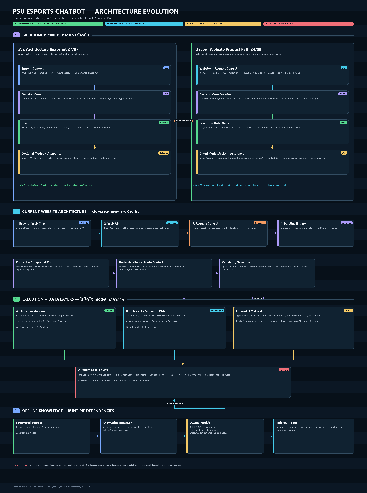

# PSU Esports Chatbot Architecture: Original vs Current (2026-08-24)

เอกสารนี้อธิบาย Architecture ของ PSU Esports Chatbot ในมุม “ชั้นของระบบ” และเปรียบเทียบ backbone เดิมกับ backbone ปัจจุบัน

คำว่า “เดิม” ในเอกสารนี้หมายถึง architecture snapshot วันที่ 2026-07-27 ใน `docs/33_current_chatbot_full_architecture_flow_20260727.md` ก่อนการเพิ่ม semantic BGE retrieval, model-first gateway, grounded composer hardening, product deadline/admission controls และ tuning ล่าสุด

## แผนภาพ Architecture



## ข้อสรุปตรงๆ

Backbone หลัก **ไม่ได้ถูกเปลี่ยนหรือเขียนใหม่ทั้งระบบ**

แกนเดิมยังคงเป็น deterministic pipeline:

```text
Web/API -> Session/Context -> Pipeline Engine -> Route/Intent/Gates
-> Fast/Structured/Retrieval -> Validation -> Answer/Log
```

สิ่งที่เปลี่ยนคือเพิ่มชั้นประกอบรอบแกนนี้ เพื่อให้ใช้ RAG และ Local LLM ได้มากขึ้นอย่างควบคุมได้:

```text
Request control layer
+ Semantic retrieval layer (BGE-M3 + vector index)
+ Model gateway (ตัดสินใจว่าจะเรียก Typhoon หรือไม่)
+ Grounded Composer (เรียบเรียงได้เฉพาะจาก evidence)
+ Source/freshness/claim guards ที่เข้มขึ้น
```

ดังนั้นคำที่เหมาะที่สุดคือ **evolutionary architecture upgrade**: ระบบเดิมยังเป็นแกนควบคุมความถูกต้อง ส่วน model ถูกเพิ่มเป็นความสามารถเสริม ไม่ได้กลายเป็น chatbot ที่ปล่อยให้ LLM ตัดสินใจทุกอย่างเอง

## 1. Architecture เดิม: Deterministic-first กับ LLM แบบท้ายทาง

### ภาพรวมเดิม

```text
Web / Terminal / Notebook / API
  -> Session Context Resolver
  -> Compound Question Planner
  -> Normalize / Entity Extraction
  -> Heuristic Router + Routing Priority
  -> Universal Intent heuristic
  -> Optional Intent LLM / Tool Router
  -> Ambiguity Gate + Candidate Scoring + Preconditions
  -> Fast / Rule / Structured / Competition / legacy Hybrid Retrieval
  -> Optional Facts Composer หรือ General/RAG LLM fallback
  -> Validator + Source Contract + Log
```

### จุดแข็งของเดิม

- คำถามราคา ตารางเวลา รายชื่อเกม อุปกรณ์ และขั้นตอนที่มี schema ชัด ตอบเร็วและตรวจได้
- Route ที่มั่นใจสูงไม่ถูก LLM override ง่าย
- มี Boundary Guard, Ambiguity Gate, Candidate Margin, Tool Preconditions และ Final Validation อยู่แล้ว
- มี Session Context Resolver สำหรับคำอ้างอิง เช่น “เกมนั้น” แต่พึ่ง recent history ไม่ใช่ memory ถาวร
- มี legacy hybrid retrieval สำหรับเอกสาร/FAQ ที่ไม่เป็น structured data

### ข้อจำกัดของเดิม

- Retrieval หลักใช้ curated/lexical/hash-vector เป็นส่วนใหญ่ จึงเข้าใจคำใหม่หรือความหมายใกล้เคียงได้จำกัด
- LLM มักอยู่ปลายทางในรูป optional fallback/composer จึงไม่ได้เพิ่ม coverage ของข้อมูลใหม่มากพอ
- timeout หลายจุดยังไม่ถูกรวมเป็น product-wide request budget ในช่วงแรก
- ไม่มี semantic vector index และ workflow ingestion ที่ชัดพอสำหรับข้อมูลข่าว/กิจกรรม/เอกสารใหม่
- ไม่มี model gateway ที่ตัดสินว่า call ไหนควรสงวนไว้ให้ RAG Composer
- deployment/product web ยังไม่ได้ถูกจัดเป็น request-control architecture เต็มรูปแบบ

## 2. Architecture ปัจจุบัน: Deterministic Core + Semantic/Data Plane + Gated Model Assist

### 2.1 ชั้น Presentation และ Channel

ปัจจุบัน focus คือ Website:

```text
Browser Web Chat
  -> web_chat/app.js
  -> POST /api/chat เป็น JSON
  -> app/web_api/server.py
  -> JSON response
  -> แสดงคำตอบในหน้าเว็บ
```

หน้าเว็บสร้าง `client_session_id` ใน browser และส่ง recent history มาให้ backend เพื่อ resolve context การปิดหรือ refresh หน้าอาจทำให้ history หาย เพราะยังไม่มี persistent conversation store

Facebook ไม่ใช่ส่วนของ Architecture ปัจจุบันที่ใช้งานจริง จึงไม่ควรนับเป็น backbone ของตอนนี้

### 2.2 ชั้น Request Control

ชั้นนี้ถูกเสริมขึ้นเพื่อให้ระบบมีพฤติกรรมแบบ product backend มากขึ้นก่อนเข้า reasoning pipeline

| ส่วน | หน้าที่ | ค่าปัจจุบัน |
|---|---|---:|
| Intake validation | จำกัด body, question length และตรวจ JSON schema | body 128 KiB, question 4,000 chars |
| Request ID | ผูก trace/latency/error ของ request เดียว | UUID ใหม่ต่อ request |
| Client session ID | แยกบทสนทนาและช่วย resolve context | browser generated |
| Admission control | กัน request ล้น process | active requests 16 |
| Per-session lock | กันคำถาม session เดียวแข่ง context กัน | wait ~0.10s |
| Global deadline | งบเวลารวมทั้ง request | 9s |
| Finalizer reserve | กันเวลาสำหรับ validation/response | ~1s |
| Async logging | ไม่ให้ log อยู่ใน critical response path | หลังสร้าง response |

สิ่งนี้ไม่ได้เปลี่ยน “สมองตอบคำถาม” โดยตรง แต่ทำให้ระบบควบคุม latency, overload และ trace ได้ดีขึ้น

### 2.3 ชั้น Reasoning Control Plane

ไฟล์หลักยังเป็น `app/pipeline/engine.py` ซึ่งเป็น orchestrator ของระบบ

```text
Resolved question
  -> Split multi-question
  -> Complexity Gate
  -> Query Planner เฉพาะ complex/dependent และถูก gate
  -> Single-question Understanding
  -> Route/Intent/Target decision
  -> Select execution capability
  -> Validate/repair/veto
```

ส่วนที่ยังเป็นแกนเดิม:

- Preprocess/normalize/query variants
- Alias และ typo handling
- Entity extraction
- Heuristic router และ routing priority
- Universal Intent heuristic
- Tool Preconditions/Candidate scoring
- Boundary Guard/Scope Guard
- Ambiguity Gate/Margin threshold
- Answer Contract, Bounded Repair และ Final Hard Veto

จุดสำคัญ: Architecture ปัจจุบันยัง **ไม่ใช่ autonomous agent** ไม่มี model วางแผนและเรียกเครื่องมือได้อย่างอิสระทุกคำถาม ทุกการเรียก tool/model อยู่ใต้ allowlist, schema, gate, budget และ validator

### 2.4 ชั้น Deterministic Data Plane

นี่คือเส้นทาง default ของระบบ และยังเป็นตัวตอบหลักสำหรับข้อมูล PSU ที่ต้อง exact

```text
Question Frame + Entities
  -> Fast/Rule/Calculator
  -> Structured Tool
  -> Competition Fact Card
  -> Deterministic Draft
  -> Validator
```

ข้อมูลที่อยู่ชั้นนี้:

- 42 เกมใน catalog
- ราคาและการคำนวณตาม rate table
- เวลาเปิด-ปิดและ calendar
- อุปกรณ์/บริการ
- วิธีจอง, check-in, payment FAQ
- กติกาและ competition fact cards ที่มี schema/source ชัด

เหตุผลที่ยังต้องรักษาเป็น backbone คือข้อมูลประเภทนี้ต้องแม่นกว่า “ภาษาสวย” และไม่ควรเสียเวลาเรียก model หาก tool ตอบได้ตรงอยู่แล้ว

### 2.5 ชั้น Semantic Retrieval และ RAG Data Plane

นี่คือการเปลี่ยน architecture ที่สำคัญที่สุดเมื่อเทียบกับเดิม

```text
Knowledge Inbox
  -> Validate document metadata
  -> Chunk text
  -> BGE-M3 Q8 embedding
  -> Semantic vector index

User query
  -> BGE-M3 Q8 query embedding
  -> Dense cosine retrieval
  -> Lexical + priority + trust hybrid score
  -> Category/entity/source/freshness guards
  -> Evidence หรือ no-answer
```

องค์ประกอบใหม่/ชัดขึ้น:

- `psu-bge-m3:q8_0` ทำ embedding ข้อความเป็น vector 1,024 มิติ
- Semantic vector index ใน `data/vector/psu_semantic_vector_index.json`
- Knowledge ingestion ผ่าน `tools/ingest_rag_documents.py` และ `data/knowledge_inbox/`
- เอกสารต้องมี source metadata, trust, status, update/validity/freshness fields ตามประเภทข้อมูล
- Semantic Route Refiner ช่วยยืนยันหรือปรับ route สำหรับ `knowledge`, `events_news`, `about_us` โดยมี route protection
- Semantic RAG Direct path ช่วยไม่ให้ evidence semantic ที่ชัดถูก legacy route ทับ

Hybrid retrieval เดิมไม่ได้ถูกทิ้ง แต่ถูกยกระดับเป็น:

```text
Curated retrieval
+ Legacy lexical/hash-vector retrieval
+ Semantic BGE retrieval เมื่อเปิด feature
+ Hybrid scoring
+ Optional CrossEncoder rerank
```

### 2.6 ชั้น Model Assist: Typhoon ไม่ใช่แหล่งความจริง

Typhoon `scb10x/typhoon2.5-qwen3-4b` อยู่ในชั้น Model Assist ไม่ใช่ data store

บทบาทที่เป็นไปได้:

- Query Planner สำหรับ complex compound
- Intent review เมื่อ heuristic กำกวม
- Tool Router เพื่อเสนอ candidate tool ตาม schema
- Facts/RAG Composer เพื่อรวม evidence หลายชิ้นเป็นคำตอบไทยอ่านง่าย
- General LLM สำหรับคำถามทั่วไปที่ไม่อ้างว่าเป็น PSU fact
- Shadow Critic สำหรับ evaluation/optional review

Model Gateway ตัดสินก่อนเรียก Typhoon โดยดู:

- request อนุญาต LLM หรือไม่
- LLM calls ต่อ request เหลือหรือไม่: สูงสุด 2
- queue/concurrency ว่างหรือไม่: concurrency 1 ต่อ process
- model health/circuit breaker
- remaining time เพียงพอหรือไม่
- route deterministic ชัดเจนหรือไม่
- evidence มี conflict หรือไม่
- evidence เดียว confidence สูงพอหรือไม่

Facts Composer จะเห็น compact evidence JSON และ deterministic draft เท่านั้น จึงมีหน้าที่ “เรียบเรียง” ไม่ใช่ “ค้นหาหรือสร้างข้อมูลใหม่”

### 2.7 Optional CrossEncoder Reranker

`BAAI/bge-reranker-v2-m3` ทำงานคนละอย่างกับ BGE-M3:

- BGE-M3: สร้าง vector ของ query/document เพื่อค้น candidates ได้เร็ว
- CrossEncoder: อ่าน query และ candidate document เป็นคู่ เพื่อจัดอันดับที่ละเอียดกว่า

CrossEncoder ยังไม่ใช่ default online backbone เพราะ cold load บน Python/CPU เคยสูงประมาณ 87-93 วินาที ซึ่งเกิน request budget 9 วินาทีมาก จึงต้อง warm แยกหรือ skip เมื่อยัง cold/เวลาไม่พอ

### 2.8 ชั้น Output Assurance และ Observability

ทุก path รวมกลับมาที่ชั้นเดียวกัน:

```text
Path validator
  -> Answer Contract
  -> Claim/numeric/source grounding
  -> Bounded Repair
  -> Final Hard Veto
  -> Thai formatter
  -> API response + async log
```

Output ภายในเก็บ answer, route, mode, confidence, entities, evidence/hits, validation, decision artifact และ trace เพื่อให้ตรวจ “ถาม A แต่ตอบ B” ย้อนกลับได้ว่าเสียที่ route, intent, target, source หรือ final answer

## 3. เปรียบเทียบ Backbone เดิมและปัจจุบัน

| หัวข้อ | เดิม (27/07) | ปัจจุบัน (24/08) | สรุปผล |
|---|---|---|---|
| แกนตอบข้อมูล PSU | Fast/Rule/Structured/legacy retrieval | เหมือนเดิม | ไม่ได้เปลี่ยนแกนหลัก |
| Router/Gates | heuristic + intent/tool review แบบ optional | เหมือนเดิม แต่เพิ่ม semantic route refiner และ model preflight | ควบคุม route และ model call ดีขึ้น |
| Retrieval | curated + lexical/hash vector | hybrid เดิม + BGE semantic dense retrieval | เข้าใจคำใหม่/ภาษาธรรมชาติได้เพิ่ม |
| Data update | source/fact cards เป็นหลัก | มี knowledge inbox, chunking, semantic index | รองรับเอกสาร/ข่าวใหม่ดีขึ้น แต่ยังไม่มี Admin UI |
| LLM | optional intent/tool/fallback/composer | model gateway + grounded composer + request budget | ใช้ LLM เป็นระบบมากขึ้น แต่ยัง gated |
| Evidence protection | source contract/validator | เพิ่ม source/freshness/conflict/claim-level grounding | ลด hallucination และข่าวเก่า |
| Time control | timeout หลายโมดูล | outer 9s deadline + reserve + guards | คุม user-visible latency ดีขึ้น |
| Multi-user | in-process LLM health/guard | admission + session lock + trace | ดีขึ้น แต่ยังไม่ distributed queue |
| Channel | terminal/notebook/web/API ใน snapshot เดิม | focus Website: Browser -> `/api/chat` | ตัดความซับซ้อนช่องทางออก |
| Persistent memory | ไม่มี | ยังไม่มี | ยังเป็นงานต่อ |

## 4. สิ่งที่ “ไม่เปลี่ยน” ซึ่งสำคัญมาก

1. **Structured/Fast ยังเป็น default** สำหรับข้อเท็จจริงที่มี schema ชัด
2. **LLM ยังไม่ใช่ authority** ของราคา เวลา รายชื่อเกม กฎ หรือข้อมูล PSU ที่ไม่มี evidence
3. **ถ้ากำกวมต้องถามกลับ** ไม่ resolve target แบบเดา
4. **ถ้าไม่มี source ต้อง no-answer** ไม่ให้ RAG/LLM เติมข้อมูล
5. **Final validation ยังบังคับทุก path** แม้คำตอบมาจาก Composer
6. **Engine เดิมยังเป็นผู้ orchestrate** ไม่ได้ย้ายเป็น framework agent ใหม่

## 5. สิ่งที่ “เปลี่ยนจริง”

1. มี product request boundary ก่อนเข้า pipeline: validation, admission, session lock, deadline และ async logging
2. มี semantic embedding backend ผ่าน BGE-M3 Q8 และ semantic vector index
3. มี ingestion path สำหรับเอกสารใหม่เพื่อทำ RAG อย่างเป็นระบบมากขึ้น
4. มี semantic route refiner/direct path เพื่อใช้ evidence semantic ก่อน legacy routing ที่อาจไม่เข้าใจความหมาย
5. มี Model Gateway ทำ cost-aware selection และ LLM call budget ระดับ request
6. Composer ถูกเปลี่ยนจากการ generate ปลายทางแบบหลวม เป็น grounded composition จาก evidence pack พร้อม fallback draft
7. เพิ่ม source conflict, freshness และ grounding checks รอบ LLM/RAG
8. ปรับ context/model budget เพื่อให้ Typhoon และ BGE อยู่ใน local product budget ได้จริงมากขึ้น

## 6. Data และ Model อยู่ตรงไหนใน Architecture

```text
Structured JSON / routing data
  -> Fast/Structured tools
  -> exact factual answers

Curated facts / legacy lexical index
  -> hybrid retrieval
  -> retrieval evidence

Knowledge inbox + source metadata
  -> BGE-M3 embedding
  -> semantic vector index
  -> semantic evidence

Typhoon Local LLM
  -> planner/review/composer/general answer ตาม gate
  -> ไม่เก็บ facts เป็น canonical source

Logs / traces
  -> evaluation, latency analysis, route/source debugging
```

## 7. Current Runtime Topology สำหรับ Website Only

```text
User Browser
  -> Web Chat JavaScript
  -> Web API Server
  -> In-process Admission + Session Lock + Deadline
  -> Pipeline Engine
       -> Structured data/tools
       -> Retrieval indexes
       -> Ollama BGE-M3 (เมื่อเปิด Semantic RAG)
       -> Ollama Typhoon (เมื่อ Model Gateway อนุญาต)
  -> Validation / Formatter
  -> JSON response
  -> Browser renders answer

  -> Async logs/traces
```

จุดที่ยังอยู่ process เดียว:

- active request semaphore
- per-session lock
- LLM concurrency semaphore
- in-memory caches และ warm model state

หากอนาคตรันหลาย backend processes จะต้องย้าย queue/lock ที่สำคัญไป shared service เช่น Redis/queue/worker layer ไม่เช่นนั้นแต่ละ process จะมองโหลดของตัวเองเท่านั้น

## 8. สถานะ Feature ปัจจุบัน

| ส่วน | สถานะ |
|---|---|
| Web/API + deterministic pipeline | ใช้งานเป็นแกนหลัก |
| Boundary/Ambiguity/Contract/Veto | ใช้งาน |
| Semantic BGE retrieval | เปิดผ่าน `PSU_SEMANTIC_RETRIEVAL=1` หรือ Semantic RAG profile |
| Model-first RAG Composer | gated: Semantic RAG + LLM allowed + evidence/time/budget ผ่าน |
| Facts Composer ใน structured path | ต้องเปิด Composer profile |
| CrossEncoder reranker | optional, ไม่ควร cold-load online |
| General LLM | experimental/gated |
| Persistent session memory | ยังไม่มี |
| Shared/distributed queue | ยังไม่มี |
| RAG Admin UI | ยังไม่มี |
| Booking transaction | ยังไม่มี |

## 9. ผลต่อการทำ Product

Architecture ปัจจุบันถูกต้องในทิศทาง “ข้อมูลจริงมาก่อน model”:

- ข้อมูลที่ตายตัวและเสี่ยงสูง: Structured/Fast
- ข้อมูลเอกสารใหม่หรือข่าว: Semantic RAG ที่มี source/freshness metadata
- หลาย evidence ที่ต้องสรุป: Grounded Typhoon Composer
- คำถามกำกวม: clarification
- ไม่มีหลักฐาน: no-answer

สิ่งที่ยังต้องพิสูจน์ก่อนเรียกว่า production-ready คือ full 1,600+ model-enabled evaluation, per-stage latency, multi-user load/session isolation และ shared queue design ไม่ใช่การเปลี่ยน backbone ไปเป็น LLM-first

## 10. ไฟล์อ้างอิงหลัก

| Architecture layer | ไฟล์/ข้อมูล |
|---|---|
| Web/API + request control | `app/web_api/server.py` |
| Website session/history | `web_chat/app.js` |
| Pipeline orchestration | `app/pipeline/engine.py` |
| Model decision | `app/pipeline/model_gateway.py` |
| Grounded composition | `app/pipeline/facts_composer.py` |
| Knowledge ingestion | `tools/ingest_rag_documents.py` |
| Semantic index | `data/vector/psu_semantic_vector_index.json` |
| Local profile | `start_local_ai_chat.ps1` |
| Old architecture snapshot | `docs/33_current_chatbot_full_architecture_flow_20260727.md` |
| Current full process flow | `docs/43_current_chatbot_full_process_flow_20260824.md` |

