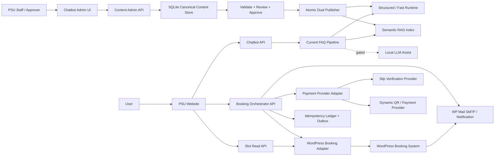

# PSU Esports Core Functions Architecture Overview (2026-08-25)

เอกสารนี้ออกแบบภาพรวม Core Functions 4 ส่วนของ PSU Esports Studio - Phuket ได้แก่ FAQ Chatbot, Check Slot, Input Data/Admin และ Booking ผ่าน Chatbot พร้อมการตรวจสอบการชำระเงิน

> สถานะ: เป็น Target Architecture และ Implementation Contract สำหรับงานถัดไป ไม่ได้หมายความว่า Slot API, Admin UI, Booking transaction หรือ Payment verification ถูกพัฒนาแล้ว

## 1. คำตอบสั้นที่สุด

ระบบควรใช้สถาปัตยกรรมแบบแยกหน้าที่ แต่แชร์ข้อมูลและรหัสอ้างอิงร่วมกัน:

1. FAQ Chatbot ใช้ pipeline ปัจจุบันต่อไป โดยให้ Structured/Fast ตอบข้อเท็จจริงที่มี schema และใช้ Semantic RAG กับ Local LLM แบบ gated สำหรับข้อมูลเอกสารหรือการสรุป
2. Check Slot อ่านสถานะจริงจาก WordPress Booking API ผ่าน Adapter แล้วคำนวณช่วงว่างเพื่อแสดงบนเว็บ โดยไม่เปิดเผยข้อมูลผู้จอง
3. Input Data ใช้ Admin UI และ SQLite เป็น Canonical Content Store จากนั้น Publish ออกสองทางพร้อมกัน คือ Structured Projection และ RAG Projection
4. Booking ใช้ deterministic workflow และ state machine โดย WordPress เดิมเป็น Source of Truth ส่วน Chatbot ทำหน้าที่เก็บความต้องการและพาไป Secure Form
5. LLM ไม่มีสิทธิ์ Publish ข้อมูล คำนวณราคา ยึด Slot ตรวจว่าเงินเข้า หรือยืนยัน Booking

## 2. สถานะปัจจุบันเทียบกับเป้าหมาย

| Core Function | สถานะปัจจุบัน | เป้าหมายของเอกสารชุดนี้ |
|---|---|---|
| FAQ Chatbot | ใช้งานได้แล้วผ่าน `/api/chat` มี Fast/Structured/RAG/LLM แบบ gated | รักษา backbone เดิมและกำหนดวิธีรับข้อมูลใหม่ |
| Check Slot | ยังไม่มี API สถานะจองจริง | สร้าง read-only page และ Adapter contract ระหว่างรอ API |
| Input Data/Admin | เพิ่ม JSON/JSONL และรัน CLI ด้วยมือ | มี Admin UI, Draft/Approve/Publish/Rollback และ Dual Projection |
| Booking transaction | ตอบได้เฉพาะวิธีจอง | จองผ่าน deterministic workflow เชื่อม WordPress |
| Payment verification | เจ้าหน้าที่ตรวจสลิปด้วยมือ | ระยะ 1 ตรวจสลิปผ่าน Provider API; ระยะ 2 Dynamic QR + webhook |

## 3. Architecture หลัก

เส้นประไป Local LLM หมายถึงเรียกเฉพาะเมื่อ policy, evidence, deadline และ model capacity อนุญาต ไม่ใช่ขั้นบังคับของทุกคำถาม

## 4. Source of Truth

| ข้อมูล | Source of Truth | Read model/Projection | ห้ามใช้เป็น Source of Truth |
|---|---|---|---|
| FAQ, เกม, วิธีเล่น, กฎอธิบาย, อุปกรณ์ | SQLite Canonical Content Store หลังเริ่ม Admin รุ่นใหม่ | Structured JSONL และ RAG chunks/index | LLM output หรือ chat log |
| ข้อมูลเดิมระหว่าง migration | Curated/Rules JSONL ที่มีอยู่ | Runtime cache/index ปัจจุบัน | เอกสาร draft |
| Slot, hold, booking status | WordPress Booking System | Slot API cache/read model | RAG, LLM หรือข้อมูลตารางที่ scrape จากหน้าเว็บ |
| ราคาและเงื่อนไขที่ใช้คิดเงิน | Authoritative booking/pricing configuration | Deterministic pricing result | LLM หรือข้อความ RAG |
| ผลตรวจการชำระเงิน | Payment Provider response + local idempotency ledger | Payment status ที่ sync ไป WordPress | QR text, OCR หรือภาพสลิปเพียงอย่างเดียว |
| Notification delivery | Mail provider/WP Mail SMTP log | สถานะส่งอีเมล | สถานะจองหรือสถานะชำระเงิน |
| ประวัติสนทนา | Session store ตาม policy | recent context สำหรับ Chatbot | Booking database |

### 4.1 กฎเมื่อข้อมูลชนกัน

1. Slot และ Booking ให้ WordPress ชนะเสมอ
2. Payment ให้ผลจาก Provider ที่ตรวจลายเซ็น/credential แล้วชนะข้อมูลในสลิป
3. ราคา เวลาเปิดปิด และกฎปัจจุบันต้องมี effective date, source และ approval
4. ข้อมูลหมดอายุหรือมี official source ขัดกันต้องหยุดตอบ exact claim และส่งเข้า review
5. LLM ไม่มีสิทธิ์ตัดสิน source precedence

## 5. ขอบเขตของแต่ละระบบ

### 5.1 Website

- แสดง Web Chat, Slot status, Secure Booking Form และสถานะรายการจอง
- สร้าง browser session ID สำหรับบทสนทนา แต่ใช้ booking reference แยกจาก session
- ไม่เก็บ secret, provider credential หรือ logic ตรวจเงินใน JavaScript
- ไม่แสดง PII ใน Slot page หรือ URL/query string

### 5.2 Chatbot API

- รับคำถามและส่งเข้า FAQ pipeline ปัจจุบัน
- เรียก Slot Tool หรือ Booking Tool เมื่อ intent ต้องการข้อมูลสด
- ห้ามเอาผล Slot/Booking ไปฝังเป็น RAG document
- ต้องคืน `request_id`, answer, source/mode และ safe error ตาม contract เดิม

### 5.3 Content Admin API

- รับ draft จาก structured form, text หรือเอกสาร
- ให้ LLM ช่วย extract เป็น draft ได้ แต่ต้องแสดง source span และ confidence
- ตรวจ JSON Schema, business rule, source, freshness และ conflict แบบ deterministic
- แยกสิทธิ์ `editor` กับ `approver`
- Publish แบบ atomic พร้อม version, audit และ rollback

### 5.4 Slot Read API

- อ่าน WordPress ผ่าน Adapter เท่านั้น
- Normalize resource, timezone และ booking status
- คำนวณ `free_intervals` จาก operating windows ลบ closure, maintenance และ busy intervals
- แสดง freshness และ stale state ให้ผู้ใช้เห็น
- เป็น read-only และไม่มี endpoint ยืนยัน/ยกเลิกการจอง

### 5.5 Booking Orchestrator

- คุม state transition, idempotency, hold TTL, deterministic pricing และ payment workflow
- เขียน Booking จริงผ่าน WordPress Adapter
- เก็บเฉพาะ transaction metadata ที่จำเป็นใน local ledger/outbox
- เปิด Manual Review เมื่อ provider/API ไม่แน่ชัด
- ไม่ให้ LLM เรียก write operation โดยตรง

## 6. Shared Identity และรหัสอ้างอิง

| ID | อายุและหน้าที่ |
|---|---|
| `request_id` | UUID ใหม่ต่อ HTTP request ใช้ trace latency/error |
| `client_session_id` | ระบุบทสนทนาเดียวกัน ใช้ resolve context ไม่ใช่รหัสจอง |
| `content_id` | รหัสคงที่ของเนื้อหา เช่น `game_minecraft` |
| `content_version_id` | รหัส immutable ของแต่ละ revision |
| `resource_id` | รหัสกลางของโซน/เครื่อง และมี mapping ไป WordPress resource ID |
| `booking_id` | รหัสภายในของรายการจองที่ WordPress ถือสถานะจริง |
| `public_booking_ref` | รหัสปลอดภัยสำหรับให้ผู้ใช้เช็กสถานะ ห้ามใช้เลขลำดับเดาง่าย |
| `idempotency_key` | กันการกดซ้ำหรือ webhook ซ้ำไม่ให้สร้างธุรกรรมซ้ำ |
| `payment_transaction_ref` | รหัสธุรกรรมจาก Payment Provider ต้อง unique ภายใต้ provider |

## 7. API Surface ที่เสนอ

> Endpoint ต่อไปนี้เป็น proposed contract; ปัจจุบัน server มี `/api/chat` และ `/api/calendar` เป็นหลัก

| Method | Endpoint | หน้าที่ |
|---|---|---|
| `POST` | `/api/chat` | FAQ และการสนทนาปัจจุบัน |
| `GET` | `/api/slots` | อ่าน resource status และช่วงว่าง |
| `POST` | `/api/booking/sessions` | เริ่ม workflow จองและคืน secure form token |
| `POST` | `/api/booking/holds` | ขอ hold จาก WordPress โดยมี TTL |
| `POST` | `/api/bookings` | สร้าง pending booking แบบ idempotent |
| `GET` | `/api/bookings/{public_ref}` | อ่านสถานะแบบไม่เปิด PII |
| `POST` | `/api/payments/slips` | อัปโหลดและส่งตรวจสลิป |
| `POST` | `/api/payments/webhooks/{provider}` | รับ signed webhook ของ Dynamic QR |
| `POST` | `/api/admin/content/drafts` | สร้าง content draft |
| `POST` | `/api/admin/content/{id}/validate` | ตรวจ draft |
| `POST` | `/api/admin/content/{id}/approve` | อนุมัติ version |
| `POST` | `/api/admin/content/{id}/publish` | สร้าง projection และเปิดใช้ |
| `POST` | `/api/admin/content/{id}/rollback` | กลับไป published version ก่อนหน้า |

## 8. Data Classification และ Privacy Boundary

| ระดับ | ตัวอย่าง | การจัดการ |
|---|---|---|
| Public | รายชื่อเกม โซน กฎทั่วไป ช่วงว่าง | แสดงได้หลังผ่าน source/approval |
| Internal | Draft, diff, review note, publish report | จำกัด staff role และมี audit log |
| Personal | ชื่อ อีเมล เบอร์โทร รหัสนักศึกษา | เก็บใน booking store เท่าที่จำเป็น ไม่เขียน chat/trace log |
| Financial-sensitive | ภาพสลิป transaction ref ผลตรวจ | จำกัดสิทธิ์ เข้ารหัส/ปกปิด และกำหนด retention |
| Secret | API key, webhook secret, WordPress credential | เก็บใน environment/secret store เท่านั้น |

ระยะเวลาเก็บ Personal และ Financial-sensitive data ต้องได้รับการอนุมัติจาก PSU ก่อน Production เอกสารนี้ไม่กำหนดจำนวนวันแทนนโยบายขององค์กร

## 9. Cross-cutting Controls

### 9.1 Correctness

- API Adapter แยก schema ภายนอกออกจาก domain model ภายใน
- ทุก write operation ใช้ precondition, idempotency และ state transition allowlist
- ข้อมูล exact ใช้ deterministic code และ authoritative source
- UI ต้องแยก `available`, `unavailable`, `stale` และ `unknown`

### 9.2 Reliability

- Timeout และ retry ต้องแยกตาม dependency
- Retry ได้เฉพาะ operation ที่ idempotent
- ใช้ outbox/reconciliation เมื่อ Payment สำเร็จแต่ WordPress sync ไม่สำเร็จ
- Health check แยก Chatbot, WordPress Adapter, Payment Provider และ index readiness

### 9.3 Security

- HTTPS, authentication, role-based authorization และ CSRF protection สำหรับ Admin
- ตรวจ webhook signature และป้องกัน replay
- Upload ใช้ allowlist extension/MIME/signature, size limit, generated filename และเก็บนอก webroot
- Log แบบ structured แต่ redact token, PII และ payload สลิป

### 9.4 Observability

- ใช้ `request_id` และ correlation IDs เชื่อม API, adapter และ provider log
- วัด latency, cache age, adapter error, payment outcome, duplicate event และ publish duration
- Audit log ต้องตอบได้ว่าใครแก้ ใครอนุมัติ version ใด และ rollback เมื่อไร

## 10. วิธีที่ควรใช้และไม่ควรใช้

### ควรใช้

- Canonical Record หนึ่งชุดแล้วสร้าง Structured/RAG Projection
- WordPress Adapter เพื่อกัน coupling กับ plugin ที่ยังไม่ทราบ
- Mock Adapter และ contract test ระหว่างรอ API
- Human approval สำหรับข้อมูลทางการ
- Booking state machine, hold, unique constraint, idempotency และ manual review
- Provider Adapter เพื่อเปลี่ยน EasySlip/SlipOK/Payment Gateway ได้

### ไม่ควรใช้

- RAG หรือ LLM ตอบ Slot, ราคา หรือสถานะชำระเงินแบบเดา
- สร้าง hard-coded route ใหม่ทุกครั้งที่เพิ่มเกม
- ให้ LLM แก้ JSONL production หรือ Publish โดยไม่มี review
- Scrape ตารางหน้าเว็บแล้วถือเป็น real-time booking state
- ยืนยันเงินจาก OCR หรือ QR payload เพียงอย่างเดียว
- เก็บ PII/สลิปใน chat history, URL, analytics event หรือ application log
- ถือว่าอีเมลส่งสำเร็จเท่ากับ Booking สำเร็จ

## 11. ลำดับพัฒนาที่แนะนำ

1. ล็อก WordPress Adapter contract และสร้าง Mock Slot data
2. ทำ Check Slot read-only page เพราะไม่มี write/payment risk
3. ทำ Content Admin + Canonical Store + Dual Projection และ migration compatibility
4. ขอ WordPress read/write/hold API และทำ contract/integration test
5. ทำ Booking state machine และ Secure Form โดยยังชำระเงินแบบ manual
6. เพิ่ม Slip Verification Provider Adapter และ manual-review dashboard
7. เพิ่ม Dynamic QR + signed webhook + reconciliation
8. ทำ load, security, recovery และ privacy acceptance ก่อน Production

## 12. Blocker ที่ต้องได้ข้อมูลจริง

- ชื่อและ version ของ WordPress booking plugin
- REST endpoints, authentication, resource IDs และ status mapping
- WordPress รองรับ atomic hold/TTL หรือไม่
- ตารางราคา authoritative และกฎคิดราคา
- บัญชีผู้รับเงินที่ Provider ใช้ match โดยเก็บเป็น secret/config
- Provider account, quota, SLA, retry และ duplicate semantics
- Public HTTPS endpoint สำหรับ webhook
- Retention policy และผู้มีสิทธิ์ดู PII/สลิป

ถ้ายังไม่มีข้อมูลเหล่านี้ ให้หยุดที่ Mock/Contract ห้ามเดา endpoint, status หรือกฎการจอง

## 13. Acceptance Criteria ของ Architecture

- ผู้อ่านแยกได้ชัดว่าอะไรมีแล้ว อะไรเป็น proposed design
- ทุกข้อมูลมี Source of Truth เพียงหนึ่งแห่งในแต่ละ domain
- FAQ ตอบข้อมูลใหม่ได้โดยไม่สร้าง route ต่อรายการ
- Slot page ไม่เปิดเผยข้อมูลผู้จองและไม่อ้าง stale data ว่า real-time
- LLM ไม่สามารถ publish, hold, charge หรือ confirm booking
- Payment event ซ้ำไม่สร้าง booking/payment ซ้ำ
- ระบบมี safe outcome เมื่อ WordPress, model หรือ provider ล่ม
- ทุก privileged change และ transaction ตามย้อนหลังได้โดยไม่ log PII เกินจำเป็น

## 14. เอกสารที่เกี่ยวข้อง

- Current chatbot flow: `docs/43_current_chatbot_full_process_flow_20260824.md`
- Current architecture comparison: `docs/44_current_chatbot_architecture_comparison_20260824.md`
- Current manual update flow: `docs/04_admin_update_flow.md`
- FAQ integration: `docs/46_faq_chatbot_current_integration_20260825.md`
- Check Slot: `docs/47_check_slot_read_only_status_flow_20260825.md`
- Content Admin: `docs/48_admin_content_input_dual_publish_flow_20260825.md`
- Booking/Payment: `docs/49_chatbot_booking_payment_verification_flow_20260825.md`

## 15. External References

- WordPress REST API Handbook: https://developer.wordpress.org/rest-api/
- WordPress REST API Authentication: https://developer.wordpress.org/rest-api/using-the-rest-api/authentication/
- OWASP File Upload Cheat Sheet: https://cheatsheetseries.owasp.org/cheatsheets/File_Upload_Cheat_Sheet.html
- OWASP REST Security Cheat Sheet: https://cheatsheetseries.owasp.org/cheatsheets/REST_Security_Cheat_Sheet.html
- EasySlip documentation: https://document.easyslip.com/en/
- SlipOK API documentation: https://slipok.com/api-documentation/

