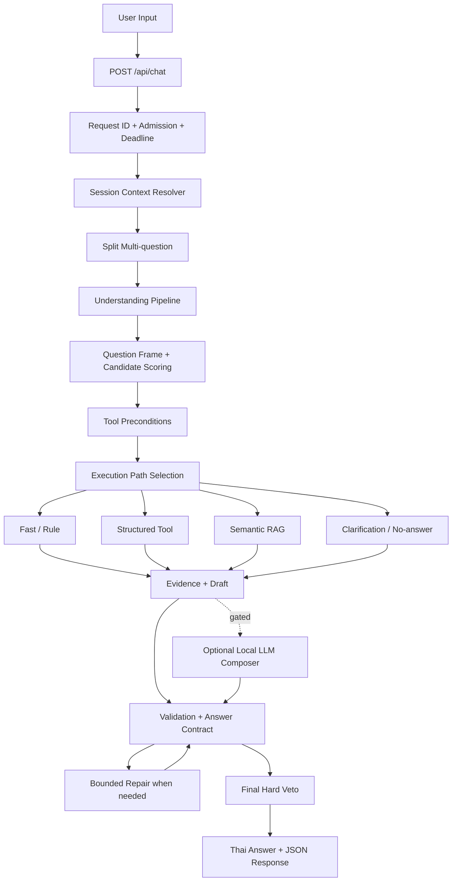
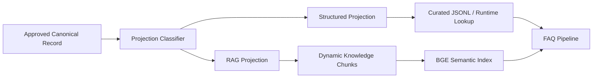

# FAQ Chatbot Current Integration (2026-08-25)

เอกสารนี้สรุป Core Function ที่ 1 คือ FAQ Chatbot ซึ่งเป็นส่วนที่ทำงานแล้ว และกำหนดวิธีเชื่อมข้อมูลใหม่จาก Content Admin โดยไม่เปลี่ยน backbone, ไม่สร้าง route ต่อเกม และไม่ลด guardrail ปัจจุบัน

> Current flow ฉบับเต็มอยู่ที่ `docs/43_current_chatbot_full_process_flow_20260824.md` เอกสารนี้เน้นเฉพาะ integration contract กับ Core Functions ใหม่

## 1. เป้าหมาย

- รักษา FAQ pipeline ที่เน้น answer-first, source-grounded และไม่เดา
- ให้ข้อมูลใหม่เริ่มถูกตอบได้หลัง Publish โดยไม่แก้ source code ต่อ record
- ใช้ Structured/Fast กับข้อเท็จจริง exact และใช้ Semantic RAG กับข้อความยาว
- ใช้ Local LLM เท่าที่เพิ่มคุณภาพ โดยต้องไม่เพิ่ม claim นอก evidence
- แยกคำถาม FAQ ออกจาก live Slot และ transaction Booking

## 2. Flow ปัจจุบัน



## 3. หน้าที่ของแต่ละ Execution Path

| Path | ใช้เมื่อ | ตัวอย่าง | Source |
|---|---|---|---|
| Fast/Rule | รูปแบบชัด คำตอบคงที่ และมี rule ที่แคบพอ | วิธีจอง, FAQ เฉพาะข้อ | `data/rules/*.jsonl` |
| Structured Tool | ต้อง lookup/filter/calculate จาก field | มี Minecraft ไหม, อยู่โซนไหน, อุปกรณ์มีกี่ชิ้น | curated structured projection |
| Semantic RAG | คำถามอธิบายยาวหรือภาษาหลากหลาย | Minecraft เล่นอย่างไร, สรุปข่าวล่าสุด | chunks + semantic index |
| Local LLM | ต้อง review intent, plan หรือเรียบเรียงหลาย evidence | สรุปข้อมูล 2 เอกสารให้สั้น | evidence/draft ที่ระบบให้ |
| Clarification | target หรือเงื่อนไขยังไม่พอ | “เกมนั้นเล่นได้กี่คน” แต่ history มีหลายเกม | evidence ที่ resolve ได้ |
| No-answer | เข้าใจคำถามแต่ไม่มีหลักฐานจริง | ถามวันปิดพิเศษที่ยังไม่มีประกาศ | ไม่มี evidence เพียงพอ |

ข้อมูล live เช่น Slot, hold, payment และ booking status ต้องเรียก Live Tool/Adapter ไม่เข้าสู่ RAG เพราะข้อมูลหมดอายุเร็วและมีผลต่อธุรกรรม

## 4. Data Integration ใหม่: One Record, Two Projections



Canonical record เป็นข้อมูลต้นฉบับที่อนุมัติแล้ว ส่วน projection เป็นรูปแบบสำหรับ runtime จึงสามารถ rebuild ได้และไม่ควรถูกแก้ด้วยมือหลังเริ่มใช้ Admin รุ่นใหม่

### 4.1 Structured Projection

ใช้กับ field ที่ต้องตอบตรงและตรวจได้ เช่น:

- ชื่อและ aliases ของเกม
- โซนหรือเครื่องที่รองรับ
- จำนวนอุปกรณ์
- กลุ่มบริการ
- ราคา หน่วย และช่วง effective date
- วัน/เวลาเปิดปิดที่ผ่านการยืนยัน
- rule identifiers และ source IDs

Projection ต้องเข้ากับไฟล์เดิม เช่น `game_item_details.jsonl`, `equipment_item_details.jsonl` และ `service_game_availability.jsonl` ในช่วง migration

### 4.2 RAG Projection

ใช้กับข้อความที่ค้นตามความหมายและอธิบายได้หลายแบบ เช่น:

- สรุปเกมและวิธีเล่น
- รายละเอียดกฎพร้อมบริบท
- ข่าวและกิจกรรม
- คู่มือใช้อุปกรณ์
- เนื้อหาจากเอกสารหลายย่อหน้า

RAG projection ต้องมี `id`, `title`, `text`, `category`, `source_url`, `trust_level`, `updated_at`, `status` และ freshness fields เมื่อข้อมูลเปลี่ยนตามเวลา

## 5. ตัวอย่างเพิ่ม Minecraft

### 5.1 Canonical Record ที่ Admin อนุมัติ

```json
{
  "id": "game_minecraft",
  "type": "game",
  "title": "Minecraft",
  "aliases": ["minecraft", "มายคราฟ"],
  "structured_fields": {
    "zones": ["PC Zone"],
    "availability": "available",
    "genre": "Sandbox"
  },
  "body": {
    "summary_th": "ข้อความที่เจ้าหน้าที่ตรวจแล้ว",
    "how_to_play_th": "ข้อความที่เจ้าหน้าที่ตรวจแล้ว"
  },
  "source": {
    "url": "https://example.official/source",
    "trust_level": "official"
  },
  "status": "approved"
}
```

URL และข้อความข้างต้นเป็นตัวอย่าง schema เท่านั้น ไม่ใช่ข้อมูลยืนยันว่า PSU มี Minecraft

### 5.2 คำถามที่จบด้วย Structured

```text
User: มี Minecraft ไหม
Entity: game=Minecraft
Operation: availability
Tool: game availability lookup
Answer source: structured_fields.availability + zones
```

### 5.3 คำถามที่เหมาะกับ RAG

```text
User: Minecraft เล่นยังไงสำหรับมือใหม่
Route: games/how_to_play
Retrieval: semantic chunks ของ game_minecraft
Composer: เรียกเมื่อมีหลาย evidence และเหลือเวลา
Validation: ชื่อเกม, source และ claim coverage
```

การเพิ่ม Minecraft จึงไม่ต้องเพิ่ม `if query contains Minecraft` ในโค้ด และไม่ต้องสร้าง answer template เฉพาะเกม เว้นแต่มี behavior ใหม่ที่ generic tool รองรับไม่ได้จริง

## 6. Routing หลังมีข้อมูลใหม่

### 6.1 Candidate Generation

Candidate Scoring ต้องเห็น record ที่ Publish แล้วผ่าน catalog/alias/index reload จากนั้นสร้าง candidate ตาม operation:

- `availability`, `location`, `quantity`, `price` ไป Structured ก่อน
- `description`, `how_to_play`, `summary`, `latest_news` ไป Semantic RAG เมื่อไม่มี structured answer ที่ครบ
- `live_availability`, `booking_status`, `payment_status` ไป Live Tool เท่านั้น

### 6.2 Preconditions

ก่อนเลือก tool ต้องผ่านอย่างน้อย:

- record เป็น `published`
- target resolve ได้และไม่ชนหลายรายการ
- category ตรงกับคำถาม
- source/trust ผ่าน policy
- time-sensitive fact ยังไม่หมดอายุ
- exact operation มี required fields ครบ

ถ้า precondition ไม่ผ่านต้องลอง candidate ถัดไปแบบ bounded, clarification หรือ no-answer ห้ามให้ LLM เติม field ที่ขาด

## 7. บทบาทของ Local LLM

| งาน | ใช้ LLM ได้หรือไม่ | เงื่อนไข |
|---|---|---|
| Intent review | ได้แบบ gated | deterministic confidence ต่ำแต่มีเวลาเหลือ |
| Query planner | ได้แบบ gated | compound dependent และ deterministic plan ไม่พอ |
| Tool router review | ได้แบบ optional | output เป็นข้อเสนอและต้องผ่าน precondition |
| Evidence composer | ได้ | เรียบเรียงจาก evidence/draft เท่านั้น |
| สร้างราคา/เวลา/จำนวน | ไม่ได้ | ต้องมาจาก structured authoritative data |
| ตัดสินว่า Slot ว่าง | ไม่ได้ | ต้องมาจาก WordPress Slot Tool |
| Publish ข้อมูล | ไม่ได้ | ต้อง human approve + deterministic publisher |
| ยืนยัน Booking/Payment | ไม่ได้ | ต้อง state machine + provider/WordPress |

ถ้า Composer timeout, output ไม่ครบ หรือเพิ่ม unsupported claim ให้คืน deterministic draft ที่ผ่าน validation แทน

## 8. Cache และ Reload Contract

runtime ปัจจุบันใช้ `lru_cache` หลายจุดกับ catalog, alias, structured rows และ vector index การ Publish จึงต้องมี explicit reload contract:

1. Build projection และ index ใน staging path
2. Validate count, IDs, schema, source และ index metadata
3. สลับ active manifest/version แบบ atomic
4. ส่ง reload signal หรือ restart worker แบบ graceful
5. clear cache เฉพาะ registry ที่เกี่ยวข้อง
6. รัน smoke query หลัง reload
7. ถ้า health check ไม่ผ่าน ให้ rollback manifest และ reload version ก่อนหน้า

ห้ามเขียนทับ JSONL active ทีละบรรทัดขณะมี request เพราะ worker อาจเห็นข้อมูลครึ่งชุด

## 9. Answer Contract สำหรับข้อมูลใหม่

คำตอบต้องผ่านการตรวจอย่างน้อย:

```text
operation_requested == operation_answered
target_requested == target_answered
source_category matches question category
record.status == published
effective_from <= now < valid_until เมื่อเป็นข้อมูลชั่วคราว
exact claims are present in structured evidence
RAG claims are covered by retrieved chunks
no live status came from static content
```

ตัวอย่าง fail ที่ต้อง veto:

- ถาม Minecraft แต่คำตอบอธิบาย Terraria
- บอกว่ามีเกมเพราะ RAG เจอบทความวิธีเล่น แต่ structured availability ไม่มีข้อมูล
- บอกราคาเก่าที่ `valid_until` ผ่านแล้ว
- บอกว่าเครื่องว่างจากข้อมูล catalog แทน Slot API

## 10. Proposed Tool Boundary

เพื่อไม่ผูก pipeline กับรูปแบบไฟล์ ควรให้ tool อ่านผ่าน repository interface ในรุ่นถัดไป:

```text
ContentRepository
  get_game(game_id)
  find_game_by_alias(alias)
  list_games(filters)
  get_equipment(item_id)
  get_rule(rule_id, at_time)
  get_operating_fact(at_date)

LiveOperationsRepository
  get_slots(filters)
  get_booking_status(public_ref)
```

ช่วง migration implementation ภายในยังอ่าน JSONL ได้ แต่ public behavior ของ tool ไม่ควรรู้ชื่อไฟล์

## 11. Error และ Safe Outcomes

| เหตุการณ์ | ผลที่ควรเกิด |
|---|---|
| Publish version ใหม่แต่ reload fail | ใช้ version เก่าและแจ้ง Admin |
| BGE/semantic index ไม่พร้อม | Structured/Fast หรือ lexical fallback; ไม่อ้าง semantic result ปลอม |
| LLM ไม่พร้อม | deterministic draft/clarification/no-answer |
| ข้อมูลใหม่มี source conflict | ไม่เปิดใช้ exact claim และส่ง review |
| record หมดอายุ | ตัดออกจาก current answer หรือแจ้งว่าไม่มีข้อมูลล่าสุด |
| WordPress Slot API ล่ม | แจ้งตรวจสถานะไม่ได้ ห้ามใช้ RAG เดา |
| Deadline ใกล้หมด | ข้าม model งานแพงและ finalise จาก draft ที่ตรวจแล้ว |

## 12. Logging

เพิ่ม metadata ต่อ request โดยไม่เก็บ PII:

- `content_version`
- `structured_projection_version`
- `rag_index_version`
- `record_ids_used`
- `live_tool_used`
- `route`, `mode`, `confidence`, `validation`
- `llm_calls`, `retrieval_ms`, `tool_ms`, `wall_ms`
- `fallback_reason`, `stale_rejected`, `source_conflict`

ข้อมูลนี้ทำให้วิเคราะห์ได้ว่าคำตอบผิดเพราะ route, target, source, version หรือ model โดยไม่ต้องเดา

## 13. Acceptance Tests

### Structured integration

- เพิ่มเกม draft แล้ว Chatbot ยังตอบว่าไม่มีข้อมูลยืนยัน
- Approve แต่ยังไม่ Publish แล้ว runtime ยังไม่เห็น record
- Publish แล้ว exact alias และชื่อไทย/อังกฤษ resolve เป็น record เดียวกัน
- quantity, zone และ availability ตอบจาก field ถูกต้อง

### RAG integration

- Published long-form content ถูก chunk และค้นเจอด้วยคำถามที่ไม่ใช้คำตรงกัน
- draft/archived/expired document ไม่ถูก retrieve เป็น current evidence
- Composer สรุปได้โดยไม่เพิ่มชื่อ ราคา เวลา หรือกฎ
- เมื่อ Composer fail ระบบคืน draft ที่ตรวจแล้ว

### Cross-path safety

- คำถาม Slot ไม่จบที่ static RAG
- คำถาม Payment ไม่จบที่ General LLM
- ข้อมูลชนกันเข้าสู่ clarification/no-answer
- compound answer ตอบครบทุก sub-question และรักษา target

### Regression

- รัน smoke และชุด 1,600+ model-enabled หลัง implementation จริง
- แยก failure เป็น wrong route, wrong target, missing subanswer, unsupported claim, source mismatch, timeout และ unnecessary LLM call
- เก็บ pass rate, average, P95, max และ LLM calls ตาม policy ปัจจุบัน

## 14. สิ่งที่เอกสารนี้ไม่ได้เปลี่ยน

- ไม่เพิ่ม LLM call ให้ทุกคำถาม
- ไม่ลด Boundary Guard, Ambiguity Gate, Answer Contract หรือ Final Hard Veto
- ไม่เปลี่ยน default model หรือ deadline
- ไม่ทำ Booking transaction ใน FAQ path
- ไม่ถือว่า record ตัวอย่างเป็นข้อมูลจริงของ PSU

