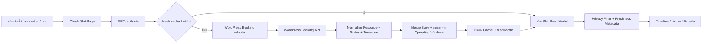
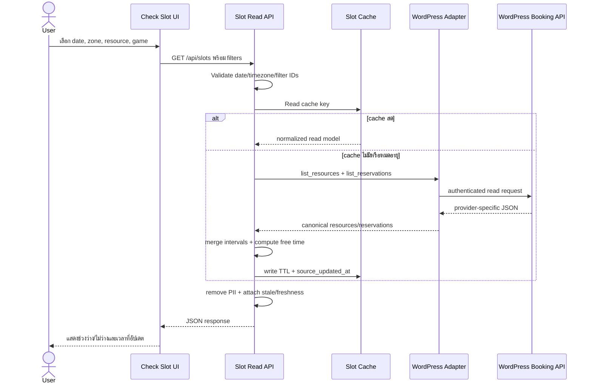

# Check Slot Read-only Status Flow (2026-08-25)

เอกสารนี้ออกแบบ Core Function ที่ 2 คือหน้าเว็บสำหรับดูว่าโซนหรือเครื่องใดถูกจองช่วงไหน และยังว่างช่วงใด โดยเป็น read-only เท่านั้น

> สถานะ: ปัจจุบันยังไม่มี WordPress Booking API ที่ยืนยัน contract แล้ว จึงต้องเริ่มจาก Provider-neutral Adapter, Mock Data และ Contract Test ห้ามเดาชื่อ endpoint หรือ schema ของ plugin

## 1. ขอบเขต

### ทำ

- เลือกวันที่ โซน เครื่อง หรือเกมเพื่อดูสถานะ
- แสดงช่วงเปิดให้บริการ ช่วงไม่ว่าง และช่วงว่าง
- แสดงเวลาที่ข้อมูลถูกอัปเดตและ stale state
- รองรับ hold, pending payment, confirmed, closure และ maintenance ในการคำนวณ busy time
- ปิดบังข้อมูลของผู้จองทั้งหมด

### ไม่ทำ

- ไม่สร้าง แก้ ยกเลิก หรือยืนยัน Booking
- ไม่แสดงชื่อ รหัสนักศึกษา อีเมล เบอร์โทร หมายเหตุ หรือยอดเงิน
- ไม่ใช้ RAG/LLM ตัดสินว่า Slot ว่าง
- ไม่ scrape HTML แล้วเรียกว่า real-time API
- ไม่รับประกันว่ายังว่างจนกว่าจะมี hold ใน Booking Flow

## 2. ความหมายของ Resource และ Game Filter

- `resource` คือสิ่งที่จองจริง เช่น PC #01, PS5 #1, Nintendo Switch หรือ Cockpit ตาม mapping จาก WordPress
- `zone` คือกลุ่มของ resource เช่น PC Zone
- `game` เป็นตัวกรองหา resource ที่รองรับเกมนั้น ไม่ถือว่าเกมถูกจองแยก
- ถ้า WordPress API จริงมี game เป็น reservable resource ให้เพิ่ม capability ผ่าน Adapter โดยไม่เปลี่ยน API ฝั่งหน้าเว็บทันที

ข้อความใน UI ต้องใช้คำว่า “สถานะล่าสุดที่ตรวจได้” ไม่ใช้คำว่า “รับประกันว่าว่าง” เพราะอาจมีคนอื่นจองก่อนผู้ใช้กดดำเนินการ

## 3. High-level Flow



## 4. Detailed Request Flow



## 5. Source of Truth และ Adapter

WordPress Booking System เป็น Source of Truth ของ resource, reservation และ status ส่วน Slot API เป็น read model ที่ normalize เพื่อให้หน้าเว็บไม่ผูกกับ plugin

### 5.1 Adapter Interface

```text
WordPressBookingAdapter
  health() -> AdapterHealth
  list_resources() -> list[Resource]
  list_operating_windows(date) -> list[OperatingWindow]
  list_blocks(date, resource_ids) -> list[ResourceBlock]
  list_reservations(start_at, end_at, resource_ids) -> list[Reservation]
  source_updated_at() -> datetime | null
```

Adapter ต้องทำหน้าที่:

- authentication กับ WordPress
- map plugin-specific IDs เป็น canonical `resource_id`
- map provider status เป็น status กลาง
- parse timezone แล้วคืน ISO 8601 ที่มี offset
- reject record ที่เวลาไม่สมเหตุผลหรือไม่รู้ status
- ไม่ส่ง PII ออกจาก Adapter

### 5.2 Canonical Status Mapping

| Canonical status | นับเป็น Busy | แสดงต่อสาธารณะ | หมายเหตุ |
|---|---:|---|---|
| `held` | ใช่ | `ไม่ว่างชั่วคราว` | hold ยังไม่หมดอายุ |
| `pending_payment` | ใช่ | `ไม่ว่างชั่วคราว` | รอการชำระเงิน |
| `confirmed` | ใช่ | `ถูกจอง` | ยืนยันแล้ว |
| `blocked` | ใช่ | `ไม่เปิดให้จอง` | เจ้าหน้าที่ block |
| `maintenance` | ใช่ | `ปิดปรับปรุง` | ไม่ใช่ booking |
| `cancelled` | ไม่ | ไม่แสดง | ใช้ audit เท่านั้น |
| `expired` | ไม่ | ไม่แสดง | hold/payment หมดเวลา |
| `unknown` | ปลอดภัยไว้ก่อน | `ตรวจสอบไม่ได้` | ต้อง log และแจ้ง Admin |

Status ที่ plugin ส่งมาแต่ยังไม่มี mapping ต้องไม่ถูกตีความเป็นว่าง

## 6. Domain Model

### 6.1 Resource

```json
{
  "resource_id": "pc-01",
  "provider_resource_id": "redacted-in-public-response",
  "label": "PC #01",
  "zone_id": "pc-zone",
  "zone_label": "PC Zone",
  "equipment_type": "gaming_pc",
  "compatible_game_ids": ["game_valorant", "game_cs2"],
  "active": true
}
```

### 6.2 Reservation Interval

```json
{
  "reservation_id": "internal-only",
  "resource_id": "pc-01",
  "start_at": "2026-08-25T10:00:00+07:00",
  "end_at": "2026-08-25T11:00:00+07:00",
  "status": "confirmed",
  "updated_at": "2026-08-25T09:55:12+07:00"
}
```

Public response ไม่ต้องมี `reservation_id` และห้ามมีข้อมูลผู้จอง

## 7. วิธีคำนวณ Free Intervals

ใช้ interval arithmetic แบบ deterministic ต่อ resource:

1. โหลด operating windows ของวันที่เลือก
2. ตัดช่วง closure และ maintenance ออกจาก operating windows
3. เลือก reservation ที่ status นับเป็น busy และ hold ยังไม่หมดอายุ
4. clamp interval ให้อยู่ใน operating window
5. sort ตาม `start_at`, `end_at`
6. merge interval ที่ทับกันหรือติดกัน
7. ลบ merged busy intervals ออกจาก operating windows
8. ตัด free interval ที่สั้นกว่าระยะขั้นต่ำของบริการ
9. คืนทั้ง busy และ free intervals พร้อม timezone

ตัวอย่าง:

```text
Operating: 09:00-12:00
Busy A:    09:30-10:30
Busy B:    10:00-11:00
Merged:    09:30-11:00
Free:      09:00-09:30, 11:00-12:00
```

ต้องใช้กฎช่วงเวลาแบบ half-open `[start_at, end_at)` เพื่อให้รายการ 10:00-11:00 และ 11:00-12:00 ไม่ถูกมองว่าทับกัน

## 8. Proposed API Contract

### 8.1 Request

```http
GET /api/slots?date=2026-08-25&zone_id=pc-zone&game_id=game_valorant
Accept: application/json
```

Filters:

| Field | Required | Rule |
|---|---:|---|
| `date` | ใช่ | `YYYY-MM-DD`, จำกัดช่วงวันที่ที่ policy อนุญาตให้ดู |
| `zone_id` | ไม่ | canonical ID จาก resource catalog |
| `resource_id` | ไม่ | ถ้าระบุ ต้องอยู่ใน zone ที่ระบุ |
| `game_id` | ไม่ | filter เฉพาะ compatible resources |
| `include_busy_detail` | ไม่ | public default เป็น `false`; ไม่เปิด PII ไม่ว่าค่าใด |

### 8.2 Success Response

```json
{
  "request_id": "6e3af0f7-8f2b-4ff7-9cda-6e092e31f554",
  "date": "2026-08-25",
  "timezone": "Asia/Bangkok",
  "generated_at": "2026-08-25T10:00:05+07:00",
  "source_updated_at": "2026-08-25T10:00:01+07:00",
  "stale": false,
  "cache_age_seconds": 4,
  "resources": [
    {
      "resource_id": "pc-01",
      "label": "PC #01",
      "zone": {"id": "pc-zone", "label": "PC Zone"},
      "equipment": "Gaming PC",
      "compatible_games": ["VALORANT", "Counter-Strike 2"],
      "operating_intervals": [
        {"start_at": "2026-08-25T09:00:00+07:00", "end_at": "2026-08-25T12:00:00+07:00"}
      ],
      "booked_intervals": [
        {"start_at": "2026-08-25T10:00:00+07:00", "end_at": "2026-08-25T11:00:00+07:00", "status": "confirmed"}
      ],
      "free_intervals": [
        {"start_at": "2026-08-25T09:00:00+07:00", "end_at": "2026-08-25T10:00:00+07:00"},
        {"start_at": "2026-08-25T11:00:00+07:00", "end_at": "2026-08-25T12:00:00+07:00"}
      ]
    }
  ]
}
```

ข้อมูลและเวลาในตัวอย่างมีไว้แสดง contract เท่านั้น ไม่ใช่สถานะจริงของ PSU

### 8.3 Error Contract

```json
{
  "request_id": "6e3af0f7-8f2b-4ff7-9cda-6e092e31f554",
  "error": "slot_source_unavailable",
  "message_th": "ขณะนี้ยังตรวจสอบสถานะการจองล่าสุดไม่ได้ กรุณาลองใหม่อีกครั้ง",
  "retryable": true,
  "stale_data_available": true,
  "stale_as_of": "2026-08-25T09:58:00+07:00"
}
```

| HTTP | Error | เมื่อใด |
|---:|---|---|
| 400 | `invalid_filter` | date/ID/filter ไม่ถูกต้อง |
| 404 | `resource_not_found` | ไม่มี canonical resource |
| 409 | `resource_mapping_conflict` | mapping ขัดกัน ไม่ควรเกิดกับ public ปกติ |
| 429 | `rate_limited` | request มากเกิน policy |
| 503 | `slot_source_unavailable` | WordPress/API ใช้ไม่ได้ |
| 504 | `slot_source_timeout` | dependency เกิน timeout |

## 9. Cache และ Freshness Policy

ค่าเริ่มต้นที่เสนอสำหรับ read-only page:

- fresh cache TTL: 10 วินาที
- background refresh: เริ่มเมื่อ cache อายุเกิน 5 วินาทีถ้าระบบรองรับ
- stale-if-error: แสดงข้อมูลเก่าได้ไม่เกิน 60 วินาที พร้อมป้ายเวลาและ `stale=true`
- เก่ากว่า 60 วินาที: ไม่แสดงเป็นสถานะปัจจุบัน ให้แสดง `ตรวจสอบไม่ได้`
- cache key: date + zone + resource + game + provider version
- ห้าม cache response ที่มี PII เพราะ public model ไม่ควรมี PII ตั้งแต่แรก

ค่าจริงต้องปรับหลังทราบ rate limit และความถี่ update ของ WordPress API

## 10. Mock Adapter ระหว่างรอ API

Mock ต้องใช้ canonical schema เดียวกับ Adapter จริงและรองรับ scenario ต่อไปนี้:

- วันเปิดปกติและไม่มี booking
- booking 1 รายการ
- interval ซ้อนกันหลายรายการ
- hold หมดอายุ
- pending payment
- maintenance/closure
- unknown provider status
- API timeout, malformed JSON และ stale cache
- resource mapping หายหรือซ้ำ

Mock มีไว้พัฒนา UI, interval engine และ contract test ห้ามนำข้อมูล mock ไปแสดงบน Production โดยไม่ติด `environment=mock`

## 11. UI Behavior

### 11.1 Desktop

- filter bar: วันที่, โซน, เครื่อง, เกม
- timeline แยก resource เป็นแถว
- legend: ว่าง, ไม่ว่างชั่วคราว, ถูกจอง, ปิดปรับปรุง, ตรวจสอบไม่ได้
- แสดง `อัปเดตล่าสุด HH:mm:ss`
- ปุ่ม refresh เป็น icon พร้อม tooltip และมี cooldown

### 11.2 Mobile

- ใช้ resource list และ interval chips/rows แทน timeline ที่บีบอ่านยาก
- filter อยู่ใน compact panel หรือ bottom sheet
- ไม่ใช้สีอย่างเดียว ต้องมีข้อความ/icon และรองรับผู้มีภาวะตาบอดสี

### 11.3 State ที่ต้องมี

- loading skeleton
- empty filter result
- closed all day
- source unavailable
- stale data warning
- partial resource failure
- timezone/date mismatch

## 12. Security และ Privacy

- Public endpoint คืนเฉพาะ occupancy ไม่มี customer object
- ใช้ allowlist fields ก่อน serialize response
- validate canonical IDs ป้องกัน injection และ object enumeration ที่ไม่จำเป็น
- rate limit ตาม IP/session และใช้ short server timeout
- WordPress credential อยู่ server-side secret เท่านั้น
- log เฉพาะ filter, resource IDs, latency, status count และ error class
- ห้าม log WordPress raw response เพราะอาจมี PII

## 13. Observability

ต่อ request ควรเก็บ:

- `request_id`
- `adapter_name` และ `adapter_version`
- `cache_hit`, `cache_age_seconds`
- `wordpress_latency_ms`, `normalize_ms`, `interval_compute_ms`, `total_ms`
- `resource_count`, `busy_interval_count`
- `source_updated_at`, `stale`
- `provider_status_unmapped_count`
- `error_code`

## 14. Acceptance Tests

### Interval correctness

- interval ทับกันถูก merge
- interval ติดกันใช้กฎ half-open ถูกต้อง
- booking ข้าม operating window ถูก clamp
- cancelled/expired ไม่บังช่วงว่าง
- active hold/pending/confirmed บังช่วงว่าง
- closure และ maintenance ชนะ booking display
- free interval สั้นกว่าระยะขั้นต่ำถูกตัด

### Filtering

- zone filter ไม่คืน resource นอก zone
- game filter คืนเฉพาะ compatible resource
- resource + zone ขัดกันตอบ 400
- game alias ถูก resolve เป็น canonical ID ก่อนเรียก Slot API

### Freshness/failure

- fresh cache ไม่เรียก WordPress ซ้ำ
- timeout ใช้ stale cache พร้อมป้ายเตือนภายใน limit
- stale เกิน limit ไม่ถูกแสดงว่า available
- unknown status ไม่ถูกตีความเป็น free
- partial failure ระบุ resource ที่ตรวจไม่ได้

### Privacy

- snapshot/API schema ไม่มี name, email, phone, student ID, note หรือ payment data
- raw provider payload ไม่ปรากฏใน public error หรือ application log
- malformed provider payload ถูก reject โดยไม่ echo กลับ

### Performance target

- cache hit P95 เป้าหมายต่ำกว่า 300 ms
- cache miss P95 เป้าหมายต่ำกว่า 2 วินาทีเมื่อ WordPress API ปกติ
- ทุก response ต้องอยู่ต่ำกว่า user-visible cap 10 วินาที และไม่รอ LLM

## 15. ลำดับ Implementation

1. ขอ resource list และ booking status documentation จากผู้ดูแล WordPress
2. สร้าง canonical model และ Mock Adapter
3. เขียน interval engine กับ unit tests
4. เพิ่ม proposed `/api/slots` หลังแยก route/service จาก `server.py`
5. ทำ UI desktop/mobile และ stale/error states
6. เขียน WordPress Adapter จริงพร้อม contract tests
7. ทำ privacy/security review และ load test
8. เปิด read-only production แล้ววัด cache/latency/error ก่อนเริ่ม Booking write flow

## 16. Blocker

- ยังไม่ทราบ booking plugin และ endpoint จริง
- ยังไม่ทราบ provider status ทั้งหมด
- ยังไม่ทราบว่า operating hours/closures อยู่ใน plugin หรือแหล่งอื่น
- ยังไม่มี canonical mapping ระหว่างเกม โซน เครื่อง และ WordPress resource ID
- rate limit และ freshness behavior ของ API ยังไม่ทราบ

เมื่อข้อมูลข้างต้นยังขาด สามารถทำ Mock/UI/algorithm ได้ แต่ห้ามประกาศว่าเช็กสถานะจริงได้

