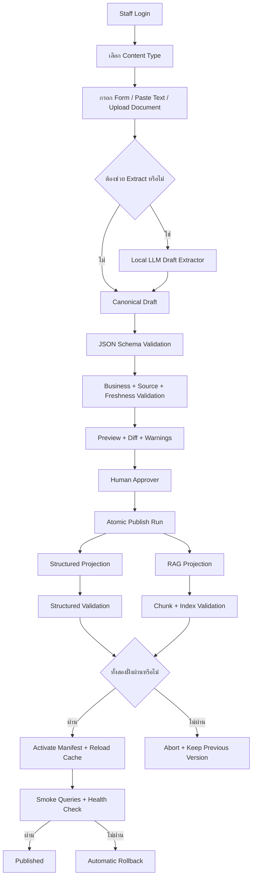
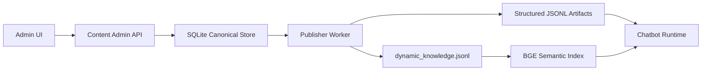

# Admin Content Input and Dual Publish Flow (2026-08-25)

เอกสารนี้ออกแบบ Core Function ที่ 3 คือระบบให้เจ้าหน้าที่ PSU เพิ่มหรือแก้ข้อมูลผ่านหน้า Admin แล้วทำให้ FAQ Chatbot ใช้ข้อมูลใหม่ได้อย่างถูกต้อง ทั้งใน Structured/Fast และ Semantic RAG

> สถานะปัจจุบัน: โปรเจกต์มี Knowledge Inbox, JSON Schema และ `tools/ingest_rag_documents.py` แล้ว แต่ยังเป็น file/CLI workflow ไม่มี Admin UI, canonical database, approval workflow หรือ atomic dual publish

## 1. คำตอบสั้นที่สุด

ไม่ควรเลือกเพียง RAG หรือสร้าง Fast/Structured code ใหม่ทุกครั้งที่เพิ่มข้อมูล แต่ควรใช้แนวทางนี้:

```text
ข้อมูลต้นฉบับ 1 Record
  -> Structured Projection สำหรับข้อเท็จจริง exact
  -> RAG Projection สำหรับคำอธิบายยาวและการค้นเชิงความหมาย
```

LLM ช่วยอ่านข้อความแล้วสร้าง Draft ได้ แต่ Draft ยังไม่ถูก Chatbot ใช้ จนกว่าจะผ่าน deterministic validation, preview/diff และ human approval

## 2. เป้าหมาย

- เจ้าหน้าที่เพิ่มเกม วิธีเล่น กฎ นโยบายจอง อุปกรณ์ โซน FAQ ข่าว และวันเปิดปิดผ่าน form
- ลดการแก้ JSONL และ source code ด้วยมือ
- ข้อมูลใหม่ exact ถูก lookup ด้วย generic Structured Tool
- ข้อมูลยาวถูกค้นด้วย Semantic RAG
- เก็บ source, freshness, version และผู้อนุมัติครบ
- Publish ทั้ง Structured/RAG แบบ all-or-nothing
- Rollback ไป version ก่อนหน้าได้

## 3. Flow หลัก



## 4. แยก Content Data ออกจาก Operational Data

| Data class | ตัวอย่าง | Admin นี้แก้ได้หรือไม่ | Source of Truth |
|---|---|---:|---|
| Content | คำอธิบายเกม วิธีเล่น FAQ ข่าว | ได้ | Canonical Content Store |
| Reference master | alias, zone label, equipment description | ได้โดยมี approval | Canonical Store + mapping |
| Policy content | กฎ วิธีจอง คำอธิบายราคา | ได้โดยมี effective date | Approved official content |
| Operational price | ราคาที่ใช้คิดเงินจริง | ไม่ควรแก้เฉพาะข้อความ | Booking/Pricing configuration |
| Operating calendar | วันเปิดปิดที่กระทบ Slot | ต้อง sync กับระบบจอง | WordPress/authoritative calendar |
| Live slot/booking/payment | สถานะ ณ เวลานั้น | ไม่ได้ | WordPress/Payment Provider |

หากเจ้าหน้าที่แก้คำอธิบายวันปิดใน Content Admin แต่ยังไม่ได้อัปเดต authoritative booking calendar ระบบต้องเตือน conflict และห้ามถือว่าหน้า Slot ปิดตามข้อความเพียงอย่างเดียว

## 5. Storage Architecture

SQLite เหมาะกับระบบ local-first ที่มี admin write น้อยและรัน backend หลักหนึ่งชุด ส่วน runtime JSONL/index ยังคงอยู่เป็น generated projection เพื่อเข้ากับ pipeline ปัจจุบัน



ถ้าภายหลังมีหลาย backend process ที่เขียนพร้อมกันหรือทำ high availability ให้ย้าย canonical store ไป PostgreSQL โดยรักษา repository/API contract เดิม

## 6. Proposed SQLite Schema

### 6.1 `content_items`

เก็บ identity ปัจจุบันของเนื้อหา:

| Column | Type | Rule |
|---|---|---|
| `id` | TEXT PK | stable canonical ID เช่น `game_minecraft` |
| `type` | TEXT | allowlist content type |
| `current_version_id` | TEXT nullable | published version ที่ active |
| `status` | TEXT | `draft`, `in_review`, `published`, `archived` |
| `created_at` | TEXT | ISO 8601 UTC |
| `updated_at` | TEXT | ISO 8601 UTC |

### 6.2 `content_versions`

เก็บ revision แบบ immutable:

| Column | Type | Rule |
|---|---|---|
| `version_id` | TEXT PK | UUID |
| `content_id` | TEXT FK | อ้าง `content_items.id` |
| `version_no` | INTEGER | unique ต่อ content |
| `title` | TEXT | ห้ามว่าง |
| `aliases_json` | TEXT | JSON array |
| `structured_fields_json` | TEXT | JSON object ตาม type schema |
| `body_json` | TEXT | เนื้อหาอธิบาย |
| `source_json` | TEXT | URL/document/trust/retrieved date |
| `effective_from` | TEXT nullable | วันเริ่มใช้ |
| `valid_until` | TEXT nullable | วันหมดอายุ |
| `created_by` | TEXT | staff ID |
| `created_at` | TEXT | immutable |
| `content_hash` | TEXT | ตรวจ duplicate/change |

### 6.3 `approval_events`

| Column | หน้าที่ |
|---|---|
| `event_id` | UUID |
| `version_id` | revision ที่ตรวจ |
| `action` | `submit`, `approve`, `reject`, `request_change` |
| `actor_id` | ผู้ทำรายการ |
| `reason` | เหตุผล/หมายเหตุ |
| `created_at` | เวลา audit |

### 6.4 `publish_runs`

เก็บ publish state, artifact hashes, index version, error, start/end time และ rollback target เพื่อ audit และ recovery

### 6.5 `resource_mappings`

ใช้ map canonical zone/equipment/game IDs กับ WordPress provider IDs โดยไม่ปน provider ID ลง public content

## 7. Canonical Content Contract

```json
{
  "id": "game_minecraft",
  "type": "game",
  "title": "Minecraft",
  "aliases": ["minecraft", "มายคราฟ"],
  "structured_fields": {
    "genre": "Sandbox",
    "zones": ["pc-zone"],
    "availability": "unknown"
  },
  "body": {
    "summary_th": "ข้อความที่ผู้อนุมัติตรวจแล้ว",
    "how_to_play_th": "ข้อความที่ผู้อนุมัติตรวจแล้ว"
  },
  "source": {
    "url": "https://example.official/source",
    "trust_level": "official",
    "retrieved_at": "2026-08-25"
  },
  "effective_from": "2026-08-25",
  "valid_until": null,
  "status": "draft"
}
```

ตัวอย่างนี้อธิบาย format เท่านั้น ค่า `availability=unknown` ตั้งใจแสดงว่าห้ามสรุปว่า PSU มีเกมจากบทความวิธีเล่นโดยไม่มี inventory source

## 8. Content Types และ Required Fields

| Type | Required structured fields | RAG body ที่รองรับ |
|---|---|---|
| `game` | canonical name, aliases, availability source | summary, genre explanation, how-to-play |
| `game_control` | game ID, platform, control mapping, source | notes, advanced instructions |
| `equipment` | item ID, zone ID, quantity/source | what, how to use, use cases |
| `zone` | zone ID, label, active flag | description, access guidance |
| `rule` | rule ID, topic, effective dates, source | explanation and examples |
| `booking_policy` | policy ID, operation, effective dates | booking instructions |
| `faq` | intent key, answer facts, source IDs | expanded explanation |
| `news_event` | event date/status/source/validity | article body |
| `operating_notice` | dates, status, authoritative source | public notice text |
| `source_document` | category, trust, publication metadata | full cleaned text |

Price records และ operating calendar ที่ใช้ transaction ต้องมี separate operational sync/precondition ไม่ใช่ publish เป็นข้อความอย่างเดียว

## 9. LLM Draft Extractor

### 9.1 ใช้ทำอะไร

- แยก title, aliases, dates, source references และข้อความแต่ละส่วนจาก input
- เสนอ content type และ field mapping
- สรุปข้อความยาวให้เป็น draft ที่ staff แก้ได้
- ชี้ field ที่ไม่พบหรือไม่แน่ใจ

### 9.2 Output Contract

```json
{
  "draft": {
    "type": "game",
    "title": "Minecraft",
    "aliases": ["มายคราฟ"],
    "structured_fields": {},
    "body": {"summary_th": "..."}
  },
  "extraction_evidence": [
    {"field": "title", "source_span": "Minecraft", "confidence": 0.99}
  ],
  "missing_required_fields": ["availability_source"],
  "warnings": ["ยังยืนยันไม่ได้ว่าเกมนี้มีให้บริการ"]
}
```

### 9.3 ข้อจำกัดบังคับ

- model output เป็น untrusted draft
- ห้ามสร้าง source URL, ราคา, วันที่,จำนวน, availability หรือกฎที่ไม่มีใน input
- field ที่ไม่มี evidence ต้องเป็น `null`/missing ไม่ใช่เดา
- structured parser ต้อง reject JSON/schema ที่ผิด
- Admin ต้องเห็น original input เทียบกับ extracted field
- การกด Approve ต้องเป็น explicit human action

## 10. Validation Pipeline

### 10.1 Syntax/Schema

- JSON type, required fields, enum, ID format, length limit
- aliases เป็น array และ normalize แล้วไม่ซ้ำ
- date/time เป็น ISO 8601
- source URL/document reference มีรูปแบบถูกต้อง

### 10.2 Business Rules

- `valid_until` ต้องมากกว่า `effective_from`
- time-sensitive record ต้องมี `valid_until`
- `freshness_verified=true` ต้องมี retrieved/validity และ source ที่ policy อนุญาต
- zone/game/equipment IDs ต้องอ้าง record ที่มีอยู่
- exact availability ต้องมี inventory/official source
- operational price/calendar ต้องผ่าน sync precondition

### 10.3 Conflict Detection

- ID ซ้ำแต่คนละ entity
- alias ชนหลายเกม/อุปกรณ์
- official sources ให้ค่า exact ต่างกัน
- record ใหม่มีช่วง effective date ซ้อนกับ published record
- source ที่ trust ต่ำพยายามแทน official source

### 10.4 Quality Checks

- Thai text ไม่ว่าง/ไม่เป็นข้อความ placeholder
- title และ target ปรากฏใน body อย่างสมเหตุผล
- source coverage ครบ claim สำคัญ
- RAG chunk ไม่รวมหลาย topic มากเกินไป
- ไม่มี secret, PII หรือ prompt instruction แฝงในเนื้อหา

## 11. Review และ Approval

| Role | ทำได้ |
|---|---|
| `editor` | สร้าง/แก้ draft, upload, validate, submit review |
| `approver` | ดู source/diff/warnings, approve/reject, rollback request |
| `admin` | จัด role, source policy, schema, publish/recovery |

ค่าเริ่มต้นใช้ two-person flow: ผู้สร้าง version เดียวกันไม่ควร approve เองสำหรับราคา กฎ วันเปิดปิด และ booking policy ส่วนข้อมูลเสี่ยงต่ำอาจผ่อน policy ภายหลังเมื่อ PSU อนุมัติ

หน้า Review ต้องแสดง:

- diff กับ published version
- field ที่ LLM extract และ source span
- missing fields/warnings/conflicts
- Structured preview และ RAG preview
- คำถามตัวอย่างกับคำตอบที่คาด
- effective date/expiry และผลกระทบต่อ records อื่น

## 12. Dual Projection

### 12.1 Projection Matrix

| Canonical field | Structured | RAG |
|---|---:|---:|
| ID/title/aliases | ใช่ | ใช่ใน metadata/title |
| availability/zone/quantity | ใช่ | อ้างได้เมื่อมี source แต่ไม่ใช้ตัดสิน exact |
| price/effective date | ใช่ | ใช้อธิบายได้ แต่ exact answer ดึง Structured |
| summary/how-to-play | field ย่อได้ | ใช่เต็มข้อความ |
| source/trust/freshness | ใช่ | ใช่ |
| status/version | ใช่ | ใช่สำหรับ filter |

### 12.2 Compatibility Outputs

ระหว่าง migration publisher สร้างไฟล์ที่ runtime ปัจจุบันอ่านได้ เช่น:

- `data/curated/game_item_details.jsonl`
- `data/curated/equipment_item_details.jsonl`
- `data/curated/service_game_availability.jsonl`
- `data/curated/dynamic_knowledge.jsonl`
- `data/vector/psu_semantic_vector_index.json`

ไฟล์เดิมต้องถูก import เป็น version เริ่มต้นก่อนเปลี่ยน ownership ห้ามให้ Admin overwrite user changes ที่ยังไม่ได้ migrate

## 13. Atomic Publish Protocol

1. lock การ publish ให้มีได้หนึ่ง run ต่อ environment
2. อ่าน approved canonical snapshot ภายใต้ transaction
3. สร้าง Structured และ RAG outputs ใน staging directory ที่มี `publish_run_id`
4. validate schema, unique IDs, counts, hashes, source และ freshness
5. build semantic index จาก staged RAG data
6. ตรวจ index model/dimension/document count และ retrieval probes
7. สร้าง immutable manifest ระบุ artifact paths/hashes/version
8. สลับ `active_manifest` แบบ atomic เมื่อทุกอย่างผ่าน
9. ส่ง graceful reload/clear-cache ให้ runtime workers
10. รัน health/smoke queries ด้วย active version
11. ถ้า reload/smoke fail ให้ชี้ manifest กลับ version ก่อนหน้าและ reload ซ้ำ
12. บันทึก publish result/audit โดยไม่แก้ canonical approved version

ไม่ควรเปิดไฟล์ active แล้วเขียนทับทีละบรรทัด เพราะ request ระหว่างนั้นอาจเห็นข้อมูลไม่ครบหรือ index ไม่ตรงกับ JSONL

## 14. Proposed Admin API

| Method | Endpoint | Preconditions |
|---|---|---|
| `POST` | `/api/admin/content/drafts` | editor auth + CSRF |
| `PATCH` | `/api/admin/content/{id}/drafts/{version}` | owner/editor และยังไม่ immutable |
| `POST` | `/api/admin/content/{id}/extract` | input limit + model capacity; draft only |
| `POST` | `/api/admin/content/{id}/validate` | version exists |
| `POST` | `/api/admin/content/{id}/submit` | validation ไม่มี hard error |
| `POST` | `/api/admin/content/{id}/approve` | approver role + version hash match |
| `POST` | `/api/admin/publish-runs` | approved versions + admin policy |
| `GET` | `/api/admin/publish-runs/{id}` | authorized staff |
| `POST` | `/api/admin/publish-runs/{id}/rollback` | active run + rollback permission |

ทุก write request ต้องมี `request_id`, CSRF protection, optimistic version/hash และ audit event

## 15. Failure Handling

| Failure | Outcome |
|---|---|
| LLM timeout/invalid JSON | เก็บ input เดิม ให้กรอก manual; ไม่เสีย draft ก่อนหน้า |
| schema fail | แสดง field-level error; ห้าม submit |
| source conflict | ส่ง review พร้อม block exact projection |
| BGE/index build fail | abort publish ทั้งชุด |
| disk เต็ม | abort ก่อน swap และ alert |
| cache reload fail | rollback active manifest |
| smoke query fail | rollback และเก็บ report |
| Admin กดซ้ำ | idempotency/version hash ป้องกัน publish ซ้ำ |
| worker บางตัว version เก่า | health version mismatch; ไม่ประกาศ publish success |

## 16. Security และ Privacy

- Admin ใช้ authenticated session, RBAC, CSRF protection และ session timeout
- Upload ใช้ allowlist, MIME/signature check, size limit, generated filename และเก็บนอก webroot
- เอกสารที่ส่ง LLM/RAG ต้อง scan prompt injection เช่นคำสั่งให้ละเลย policy และเก็บเป็น data เท่านั้น
- secret/PII detector block ก่อน publish public content
- database backup เข้ารหัสและจำกัดสิทธิ์
- audit event append-only สำหรับ action สำคัญ
- log ไม่เก็บ password, session cookie, API key หรือเอกสารต้นฉบับเต็มโดยไม่จำเป็น

## 17. Observability

วัดอย่างน้อย:

- draft/submit/approve/publish counts
- validation failures แยกตาม rule
- LLM extraction latency, timeout และ field acceptance rate
- projection duration, index build duration และ artifact size
- publish success/rollback rate
- active content/index version ต่อ worker
- stale/expired records และ source conflicts
- smoke query pass rate หลัง publish

## 18. Acceptance Tests

### Workflow/RBAC

- unauthenticated user เข้า Admin ไม่ได้
- editor approve/publish เองไม่ได้ตาม high-risk policy
- approver เห็น diff/source/warning ก่อนอนุมัติ
- optimistic lock กันการทับ draft ที่ถูกแก้พร้อมกัน

### LLM draft safety

- model ใส่ราคา/availability ที่ไม่มี source แล้ว validator block
- invalid JSON ไม่ทำให้ draft เดิมหาย
- source span ไม่ตรง field ถูก warning
- ปิด LLM แล้วยังกรอก form และ publish ได้

### Projection

- game record สร้าง exact lookup และ RAG chunk จาก version เดียวกัน
- draft/archived/expired record ไม่อยู่ใน active projection
- aliases ซ้ำถูก reject
- structured fail หรือ RAG fail ทำให้ publish ไม่เกิดทั้งชุด

### Atomicity/rollback

- process ล้มก่อน manifest swap แล้ว runtime ใช้ version เก่า
- process ล้มหลัง swap แต่ smoke fail แล้ว rollback ได้
- worker ทุกตัวรายงาน active version เดียวกัน
- artifact hash mismatch ถูก reject

### Chatbot regression

- เพิ่มข้อมูลใหม่แล้วถาม availability/location/description ได้ตรง path
- ข้อมูลที่ไม่มี exact availability ไม่ถูกตอบว่ามี
- source conflict และ expired data ไม่หลุดผ่าน Answer Contract
- rerun smoke และ full 1,600+ model-enabled หลัง implementation

## 19. Migration Plan

1. inventory JSONL/rules/knowledge inbox ปัจจุบันและกำหนด owner ของแต่ละไฟล์
2. import เป็น canonical records/version 1 โดยรักษา IDs/source/dates
3. สร้าง projection จาก DB ใน staging แล้วเปรียบเทียบกับ current outputs
4. รัน regression โดยยังไม่สลับ runtime
5. เปิด Admin แบบ draft-only ให้ staff ทดลอง
6. เปิด approve/publish ใน environment ทดสอบ
7. เปิด production publish พร้อม backup/rollback
8. หลังนิ่งแล้วประกาศ generated files เป็น read-only artifacts

## 20. สิ่งที่ควรและไม่ควรทำ

### ควร

- ใช้ generic schema/tool ต่อ content type
- เก็บ canonical version แบบ immutable
- แยก editor/approver
- เก็บ exact field และ long-form body ใน record เดียวกัน
- publish แบบ atomic และ rollback ได้
- เพิ่ม regression cases ตามข้อมูลใหม่

### ไม่ควร

- RAG-only สำหรับราคา เวลา availability หรือ quantity
- สร้าง `if/else` หรือ route ใหม่ต่อเกม
- ให้ LLM publish หรือแก้ active JSONL โดยตรง
- นำ draft เข้า retrieval index
- เปลี่ยนวันเปิดปิดในข้อความโดยไม่ sync ระบบ Slot
- แก้ expected tests ให้รับคำตอบผิดแทนการแก้ source/route

## 21. Blocker ก่อน Implementation เต็มรูปแบบ

- ต้องสรุป content type schemas ราย field กับเจ้าของข้อมูล PSU
- ต้องกำหนด retention/backup ของ canonical DB และ uploaded sources
- ต้องกำหนดว่าใครเป็น editor/approver/admin
- ต้องออกแบบ reload mechanism สำหรับ worker/process จริง
- operational price/calendar ต้องมี authoritative write/sync API
- ต้องตัดสิน rollback SLA และพื้นที่ disk สำหรับ staged indexes

