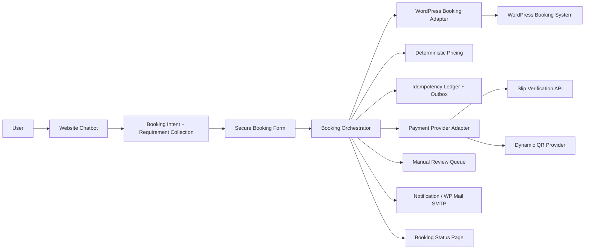
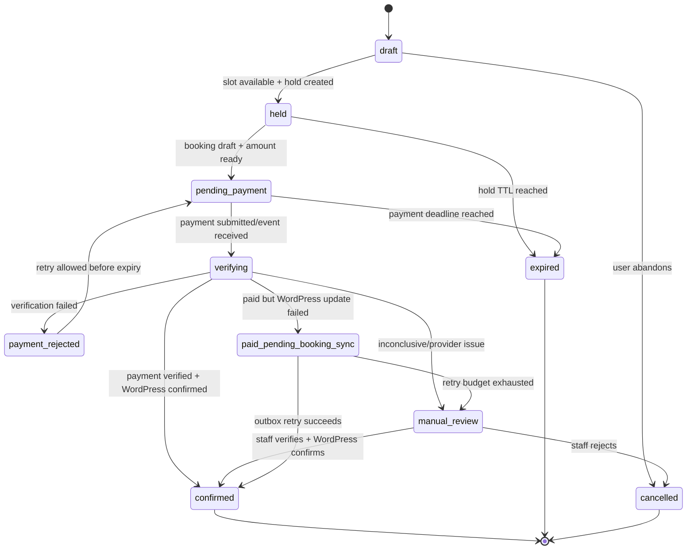
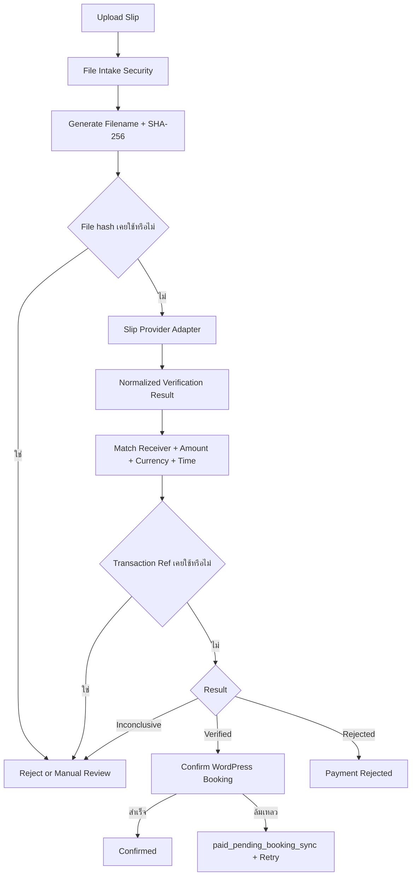
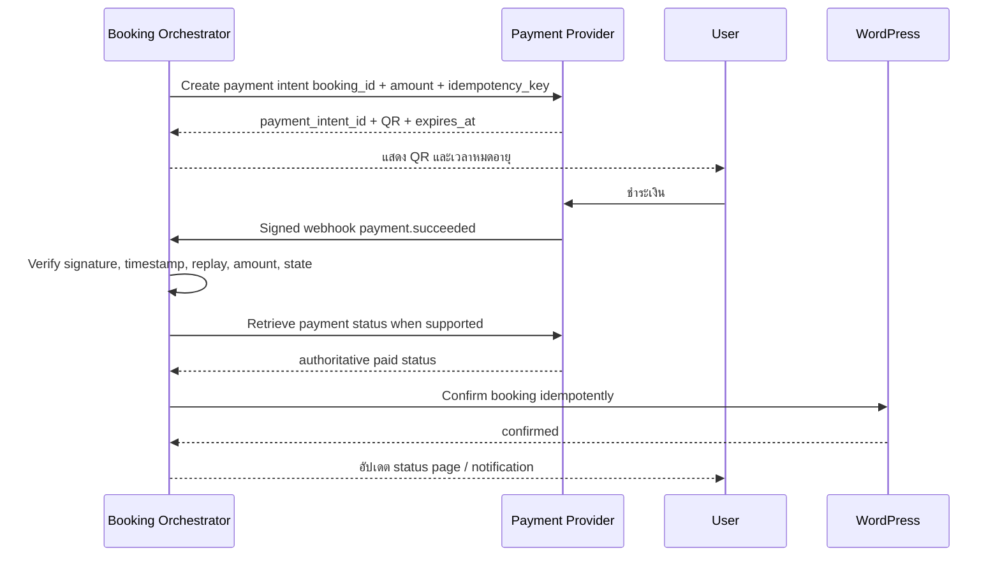

# Chatbot Booking and Payment Verification Flow (2026-08-25)

เอกสารนี้ออกแบบ Core Function ที่ 4 คือการเริ่มจองผ่าน Chatbot, กรอกข้อมูลใน Secure Form, ยึด Slot, ตรวจการชำระเงิน และยืนยันรายการใน WordPress

> สถานะ: เป็น Target Flow ยังไม่ใช่ความสามารถปัจจุบัน ปัจจุบัน Chatbot อธิบายวิธีจองได้แต่ยังไม่สร้าง Booking, hold Slot หรือตรวจสลิปจริง

## 1. หลักการสำคัญ

1. WordPress Booking System เป็น Source of Truth ของ Slot และ Booking
2. Chatbot เก็บ intent และเงื่อนไขเบื้องต้น ไม่เก็บ PII/สลิปในข้อความสนทนา
3. ข้อมูลส่วนบุคคลกรอกผ่าน Secure Form
4. ราคา, availability, hold และ state transition ใช้ deterministic code/API
5. LLM ช่วยเข้าใจภาษาหรืออธิบายเท่านั้น ไม่มีสิทธิ์เขียน transaction
6. QR ที่อ่านจากภาพสลิปไม่ใช่หลักฐานเพียงพอว่าเงินเข้าจริง
7. ทุก operation ที่อาจถูกส่งซ้ำต้องมี idempotency
8. กรณีไม่แน่ชัดต้องเข้า Manual Review ไม่ยืนยันอัตโนมัติ

## 2. สถาปัตยกรรม



WP Mail SMTP เป็นช่องทางส่งอีเมล ไม่ใช่ฐานข้อมูล Booking และไม่ใช่ระบบตรวจว่าเงินเข้าจริง

## 3. End-to-End Flow

```mermaid
sequenceDiagram
    actor User
    participant Chat as Chatbot
    participant Form as Secure Form
    participant Orchestrator as Booking Orchestrator
    participant WP as WordPress Adapter
    participant Pay as Payment Provider
    participant Mail as Notification

    User->>Chat: ต้องการจอง PC พรุ่งนี้ 10:00
    Chat->>Chat: Resolve date/time/resource intent
    Chat-->>User: สรุปความต้องการและเปิด Secure Form
    User->>Form: กรอกกลุ่มผู้ใช้ ชื่อ รหัส เบอร์ อีเมล
    Form->>Orchestrator: Submit with one-time form token
    Orchestrator->>WP: Recheck availability
    WP-->>Orchestrator: Available / unavailable
    Orchestrator->>Orchestrator: Calculate authoritative price
    Orchestrator->>WP: Create hold with TTL
    WP-->>Orchestrator: hold_id + expires_at
    Orchestrator-->>Form: pending_payment + amount + expiry
    User->>Form: Upload slip หรือจ่าย Dynamic QR
    Form->>Orchestrator: payment evidence / provider event
    Orchestrator->>Pay: Verify transaction
    Pay-->>Orchestrator: verified / rejected / inconclusive
    alt verified
        Orchestrator->>WP: Confirm booking idempotently
        WP-->>Orchestrator: confirmed booking
        Orchestrator->>Mail: Send confirmation
        Orchestrator-->>User: Confirmed + public reference
    else rejected
        Orchestrator-->>User: แจ้งเหตุผลที่เปิดเผยได้และให้ส่งใหม่
    else inconclusive
        Orchestrator->>Orchestrator: Manual review; do not confirm
        Orchestrator-->>User: กำลังตรวจสอบ ยังไม่ยืนยันการจอง
    end
```

## 4. Chatbot กับ Secure Form ทำหน้าที่ต่างกัน

### Chatbot เก็บได้

- วันที่/เวลาโดยประมาณ
- ประเภทบริการ โซน เครื่อง หรือเกมที่ต้องการ
- จำนวนผู้ใช้หรือระยะเวลาที่จำเป็นต่อการค้น Slot
- คำถามเกี่ยวกับขั้นตอนและราคา

### Secure Form เก็บ

- กลุ่มผู้ใช้ตามรายการที่ PSU กำหนด
- ชื่อ รหัสนักศึกษา/บุคลากรหรือข้อมูลยืนยันที่จำเป็น
- เบอร์โทรและอีเมล
- consent/acknowledgement ตาม policy
- payment upload หรือ payment redirect

Form ใช้ one-time token ที่ผูกกับ `booking_session_id`, session, expiry และ allowed fields ห้ามส่ง PII กลับเข้า chat history หรือ URL

## 5. Booking State Machine



ทุก transition ต้องตรวจ current state และ version เพื่อกัน event ลำดับผิด เช่น webhook เก่ามาเปลี่ยน Booking ที่ยกเลิกแล้ว

## 6. State Transition Preconditions

| Transition | Preconditions |
|---|---|
| `draft -> held` | resource/date/time valid, WordPress ยืนยัน available, hold API สำเร็จ |
| `held -> pending_payment` | price calculation complete, hold ยังไม่หมดอายุ |
| `pending_payment -> verifying` | upload/event ผ่าน intake validation และ idempotency |
| `verifying -> confirmed` | provider verified, receiver/amount/ref/time match, WordPress confirm สำเร็จ |
| `verifying -> payment_rejected` | provider ยืนยันว่า invalid, wrong receiver/amount หรือ duplicate ที่ใช้กับ booking อื่น |
| `verifying -> manual_review` | provider timeout/inconclusive, field match ไม่ครบ หรือ policy ต้องให้คนตรวจ |
| `verifying -> paid_pending_booking_sync` | payment verified แต่ WordPress confirm ยังไม่สำเร็จ |

ห้ามแสดง “จองสำเร็จ” จน WordPress ตอบยืนยัน state ที่อ่านกลับได้

## 7. WordPress Booking Adapter Contract

```text
WordPressBookingAdapter
  list_resources()
  check_availability(resource_id, start_at, end_at)
  create_hold(resource_id, start_at, end_at, ttl, idempotency_key)
  get_hold(hold_id)
  release_hold(hold_id, reason, idempotency_key)
  create_pending_booking(hold_id, customer_ref, amount, idempotency_key)
  confirm_booking(booking_id, payment_ref, idempotency_key)
  get_booking(booking_id)
  cancel_booking(booking_id, reason, idempotency_key)
```

ถ้า plugin ไม่มี atomic hold/TTL จะยังไม่ปลอดภัยพอสำหรับ auto-booking เมื่อมีหลายคนจองเครื่องเดียวกัน ต้องเพิ่ม capability ใน WordPress หรือใช้ authoritative reservation lock ก่อน

Adapter ต้องอ่านสถานะกลับหลัง write เพื่อยืนยันผล ไม่ถือว่า HTTP 200 เพียงอย่างเดียวแปลว่า business state ถูกต้อง

## 8. Deterministic Pricing

Pricing input ต้องมาจาก canonical IDs และ authoritative rate table:

```text
resource/service
user_group
start_at/end_at หรือ session_count
effective pricing date
discount/promotion code ที่ตรวจได้
```

Pricing result:

```json
{
  "currency": "THB",
  "amount": 0,
  "rate_id": "authoritative-rate-id",
  "rate_version": 1,
  "calculation_lines": [],
  "calculated_at": "2026-08-25T10:00:00+07:00"
}
```

ค่า `0` เป็น placeholder ของ schema ไม่ใช่ราคา PSU ระบบจริงต้อง reject placeholder/unknown rate และห้ามเปิด payment จนคำนวณราคาได้จาก source ที่ยืนยันแล้ว

## 9. Phase 1: Slip Verification

### 9.1 Flow



### 9.2 File Intake Security

- อนุญาตเฉพาะ image types ที่ business ต้องใช้ เช่น JPEG/PNG ตาม policy จริง
- ตรวจ extension, MIME และ file signature ร่วมกัน
- จำกัด file size, dimensions และ decode budget
- เปลี่ยนชื่อไฟล์เป็น UUID ห้ามใช้ชื่อจากผู้ใช้
- เก็บนอก webroot และจำกัด permission
- strip metadata/re-encode image หากเหมาะสม
- scan malware/sandbox เมื่อ infrastructure รองรับ
- ไม่ echo file path หรือ provider raw error กลับผู้ใช้

### 9.3 Verification Checks

ตรวจตามลำดับ:

1. Provider API authentication/TLS ผ่าน
2. Provider อ่าน transaction ได้และคืนสถานะที่รู้จัก
3. `transaction_ref` มีรูปแบบและไม่ว่าง
4. receiver ตรงกับ account allowlist ที่ตั้งใน secret/config
5. amount และ currency ตรงกับ authoritative pricing result
6. transfer time อยู่ใน policy ที่ยอมรับและสัมพันธ์กับ booking/hold
7. transaction ref ยังไม่ถูกใช้กับ booking อื่น
8. provider duplicate result ไม่ขัดกับ local ledger
9. booking ยังอยู่ใน state ที่รับ payment ได้

File hash ใช้จับการอัปโหลดภาพเดิมแบบตรงๆ แต่กันภาพ crop/recompress ไม่ได้ ตัวกันซ้ำหลักต้องเป็น transaction reference จาก provider และ unique constraint ใน local ledger

### 9.4 Normalized Provider Result

```json
{
  "provider": "provider-name",
  "provider_request_id": "opaque-id",
  "outcome": "verified",
  "transaction_ref": "masked-in-log",
  "transferred_at": "2026-08-25T10:05:00+07:00",
  "amount": {"currency": "THB", "value": 0},
  "receiver_match": true,
  "duplicate": false,
  "raw_response_hash": "sha256-only",
  "verified_at": "2026-08-25T10:05:03+07:00"
}
```

ตัวเลขเป็น schema placeholder ไม่ใช่ยอดเงินจริง

### 9.5 Outcome Policy

| Outcome | Booking behavior |
|---|---|
| `verified` | พยายาม confirm WordPress แบบ idempotent |
| `rejected` | ไม่ confirm; แจ้งเหตุผลเฉพาะที่ปลอดภัยและให้ส่งใหม่หาก hold ยังอยู่ |
| `inconclusive` | เข้า manual review; ไม่ยืนยันอัตโนมัติ |
| `provider_unavailable` | ไม่ยืนยัน; hold เดินตาม expiry จริงและแจ้งผู้ใช้ว่ายังไม่สำเร็จ |
| `duplicate_same_booking` | คืนผลเดิมแบบ idempotent ไม่ทำรายการซ้ำ |
| `duplicate_other_booking` | block + security/manual review |

## 10. Slip Provider Adapter

```text
SlipVerificationProvider
  health()
  verify_image(file_ref, request_id)
  verify_url(signed_file_url, request_id)
  normalize_response(raw_response)
```

Provider selection ต้องเปรียบเทียบอย่างน้อย:

- รองรับธนาคาร/QR ที่ PSU ใช้จริง
- match receiver และ amount ได้
- duplicate semantics และ transaction reference reliability
- quota, latency, SLA, retry และ data retention
- มี test/sandbox และ webhook หรือไม่
- PDPA/data processing terms และพื้นที่จัดเก็บข้อมูล
- ราคาและ support

EasySlip และ SlipOK เป็น candidate ที่ต้องทดสอบด้วยสลิปทดสอบที่ได้รับอนุญาตก่อนเลือก ห้ามผูก domain logic กับ error code ของ provider โดยตรง

## 11. Phase 2: Dynamic QR + Webhook

ระยะยาว Dynamic QR เหมาะกว่า upload slip เพราะ payment intent ผูกกับ booking และ amount ตั้งแต่ต้น



Webhook endpoint ต้อง:

- ใช้ public HTTPS
- ตรวจ signature ด้วย raw body ตามคู่มือ provider
- ตรวจ timestamp/replay window
- เก็บ event ID แบบ unique
- ตอบเร็วแล้วประมวลผลผ่าน durable queue/outbox
- รองรับ event ซ้ำและลำดับสลับ
- retrieve payment จาก provider ซ้ำเมื่อ payload ไม่พอ

## 12. Idempotency และ Concurrency

### 12.1 Unique Constraints

- `(provider, provider_event_id)` unique
- `(provider, transaction_ref)` unique
- `idempotency_key` unique ต่อ operation type
- active hold conflict ต้องบังคับที่ authoritative booking system
- booking confirmation ต่อ booking ทำได้ครั้งเดียว

### 12.2 Idempotency Behavior

request เดิมและ payload เดิมต้องคืนผลเดิม ส่วน key เดิมแต่ payload ต่างต้องตอบ conflict และไม่ทำงาน

### 12.3 Concurrent Booking

เมื่อผู้ใช้หลายคนเลือกเครื่องเดียวกัน:

1. การดู Slot อาจเห็นว่างพร้อมกันได้
2. ผู้ชนะคือ request ที่ WordPress สร้าง atomic hold ให้ก่อน
3. request อื่นต้องได้รับ unavailable พร้อมตัวเลือกใหม่
4. ห้ามใช้ in-process Python lock เป็นตัวกันซ้ำหลัก เพราะใช้ไม่ได้เมื่อมีหลาย process/server

## 13. Ledger และ Outbox

Local ledger เก็บเฉพาะ metadata ที่ต้องกันซ้ำและ reconcile:

| Field | หน้าที่ |
|---|---|
| `payment_attempt_id` | UUID |
| `booking_id` | อ้าง WordPress booking |
| `provider` | adapter key |
| `provider_event_id` | webhook dedupe |
| `transaction_ref_hash/encrypted_value` | dedupe/audit ตาม security design |
| `amount/currency` | match result |
| `outcome` | normalized state |
| `created_at/verified_at` | audit |

Outbox เก็บคำสั่ง confirm/cancel/notify ที่ยังส่งไม่สำเร็จ พร้อม retry count, next attempt และ last error

ถ้าเงินผ่านแต่ WordPress ล่ม:

- state เป็น `paid_pending_booking_sync`
- ไม่บอกผู้ใช้ว่า confirmed
- retry แบบ idempotent
- alert เจ้าหน้าที่ก่อน hold หมดอายุ
- หากยัง sync ไม่ได้ ต้องเข้า manual reconciliation/refund policy ที่ PSU อนุมัติ

## 14. Proposed Public API

### 14.1 เริ่ม Booking Session

```http
POST /api/booking/sessions
Idempotency-Key: <uuid>
Content-Type: application/json
```

```json
{
  "resource_id": "pc-01",
  "start_at": "2026-08-26T10:00:00+07:00",
  "end_at": "2026-08-26T11:00:00+07:00",
  "client_session_id": "browser-session-id"
}
```

Response คืน `booking_session_id`, one-time `secure_form_url`, `expires_at` และ summary ที่ไม่มี PII

### 14.2 สร้าง Hold/Pending Booking

```http
POST /api/booking/holds
Idempotency-Key: <uuid>
```

ต้องรับ secure form token และ customer payload ผ่าน HTTPS body ไม่รับผ่าน query string

### 14.3 Upload Slip

```http
POST /api/payments/slips
Idempotency-Key: <uuid>
Content-Type: multipart/form-data
```

Response ควรเป็น `202 Accepted` เมื่อตรวจแบบ async:

```json
{
  "request_id": "uuid",
  "public_booking_ref": "unguessable-reference",
  "payment_status": "verifying",
  "booking_status": "pending_payment",
  "status_url": "/booking/status/unguessable-reference"
}
```

### 14.4 Public Status

`GET /api/bookings/{public_ref}` คืนเฉพาะสถานะ, resource label, date/time, amount summary, expiry และ next action ไม่คืน PII หรือ provider raw data

## 15. Error Contract

| Error | User-facing outcome | Retry |
|---|---|---:|
| `slot_no_longer_available` | ให้เลือก Slot ใหม่ | ได้ |
| `hold_expired` | เริ่มจองใหม่ | ได้ |
| `price_unavailable` | ยังเปิดชำระเงินไม่ได้ | ภายหลัง |
| `invalid_upload` | ให้ใช้ไฟล์ชนิด/ขนาดที่รองรับ | ได้ |
| `payment_wrong_amount` | แจ้งยอดไม่ตรงและส่ง manual review ตาม policy | ตาม policy |
| `payment_wrong_receiver` | ไม่ยืนยันและส่ง review/security | ไม่อัตโนมัติ |
| `payment_duplicate` | ไม่ใช้ซ้ำ; แสดงข้อความปลอดภัย | ไม่ |
| `payment_verification_pending` | แจ้งว่ายังไม่ยืนยัน | ระบบ retry/review |
| `booking_sync_pending` | รับเงินแล้วแต่ยังยืนยัน Booking ไม่ได้ | ระบบ retry + staff |
| `provider_unavailable` | ยังไม่ยืนยันและแสดงเวลาหมดอายุจริง | ภายหลัง |

ห้ามส่ง stack trace, account number เต็ม, transaction ref เต็ม หรือเหตุผลภายในที่ช่วยโจมตีระบบกลับผู้ใช้

## 16. Notifications

ส่งอีเมล/ข้อความเมื่อ:

- hold/pending booking พร้อมเวลาหมดอายุ
- payment กำลังตรวจ
- confirmed
- rejected/manual review พร้อม next action ที่เหมาะสม
- expired/cancelled

Notification ใช้ outbox และ idempotency แยกจาก Booking state ส่งซ้ำได้โดยไม่เปลี่ยนสถานะ Booking และอีเมลล้มเหลวไม่ควรย้อน confirmed booking

## 17. Privacy และ Retention

- แยก booking/customer/payment store จาก chat/trace log
- ใช้ customer reference ใน orchestration log แทนชื่อ/รหัสจริง
- จำกัด staff role ที่ดู PII และสลิป
- mask ข้อมูลใน Admin list และเปิดดูเต็มเฉพาะเมื่อจำเป็น
- encrypt data at rest/backup ตาม infrastructure ที่เลือก
- delete raw slip และ PII ตาม retention policy ที่ PSU อนุมัติ
- เก็บ audit/transaction metadata เท่าที่กฎหมายและการ reconcile ต้องใช้
- มี privacy notice, purpose และ access procedure ก่อน Production

เอกสารนี้ไม่กำหนดระยะเวลาเก็บแทน PSU เพราะต้องพิจารณาฐานกฎหมายและนโยบายองค์กร

## 18. Security Controls

- HTTPS ทุกช่องทางและ secret อยู่ server-side
- CSRF protection สำหรับ form/admin และ rate limit สำหรับ upload/status
- upload protections ตาม OWASP File Upload guidance
- webhook signature/replay protection
- SSRF protection ถ้า Provider รับ image URL; ใช้ signed internal URL/allowlist เท่านั้น
- SQL parameterization และ state transition allowlist
- audit privileged/manual actions
- dependency timeout/circuit breaker แยก WordPress และ Payment Provider
- ห้ามให้ prompt/LLM เรียก transaction tool โดยไม่มี deterministic authorization layer

## 19. Observability

เก็บ metrics/log ต่อ stage โดย redact PII:

- booking state transition count/failure
- availability recheck/hold latency
- hold conflict/expiry rate
- pricing version และ calculation failure
- upload reject reason count
- provider latency/outcome/timeout
- duplicate transaction/event count
- WordPress confirmation latency/retry
- `paid_pending_booking_sync` age
- manual review queue size/age
- notification delivery status

Correlation IDs: `request_id`, `booking_id`, `payment_attempt_id`, `provider_request_id`, `outbox_event_id`

## 20. Acceptance Tests

### Booking state/concurrency

- user สองคนจอง resource/time เดียวกัน มีผู้ได้ hold เพียงหนึ่งคน
- request/webhook ซ้ำไม่สร้าง Booking หรือ Payment ซ้ำ
- event ลำดับผิดไม่ย้อน state ที่จบแล้ว
- hold หมดอายุแล้วไม่รับ payment เป็น confirmed อัตโนมัติ
- WordPress write แล้วต้องอ่านกลับได้ก่อนแสดง confirmed

### Pricing

- user group/เวลา/rate version ถูกต้อง
- unknown/expired rate block payment
- LLM output ไม่สามารถเปลี่ยน amount

### Slip verification

- valid slip ที่ receiver/amount/time/ref ตรงเข้าสู่ confirm
- ภาพเดิมและ transaction เดิมถูก dedupe
- crop/recompress ที่ hash ต่างแต่ transaction ref เดิมยังถูกกันซ้ำ
- wrong amount/receiver ถูก reject/review
- malformed/oversized/spoofed file ถูก block
- provider timeout ไม่ยืนยัน Booking

### Dynamic QR/webhook

- signature ผิด, timestamp เก่า และ event replay ถูก reject
- webhook ซ้ำคืน success แบบ idempotent
- webhook สำเร็จแต่ WordPress ล่มเข้าสู่ outbox
- retry สำเร็จเปลี่ยนเป็น confirmed ครั้งเดียว

### Privacy/security

- PII และภาพสลิปไม่อยู่ใน chat/trace/application log
- public status reference เดายากและไม่เปิด customer data
- staff ที่ไม่มีสิทธิ์ดูสลิปไม่ได้
- raw provider response ไม่หลุดใน error response

### Recovery/load

- restart ระหว่าง verification แล้ว resume จาก durable state ได้
- queue รองรับ peak ที่กำหนดโดยไม่ทำ event หาย
- วัด average/P95/max, queue wait, provider latency และ session isolation

## 21. Implementation Phases

### Phase 0: Contract และ Mock

- ขอ WordPress/plugin/API/status/resource documentation
- สร้าง canonical models, Mock Adapter และ state-machine tests
- ยังไม่รับเงินจริง

### Phase 1: Booking without auto payment

- Secure Form, recheck, hold, pending booking และ status page
- เจ้าหน้าที่ยืนยันเงินแบบเดิม
- วัด concurrency และ failure ก่อน automation

### Phase 2: Slip Verification

- Provider Adapter, secure upload, local idempotency ledger
- manual review dashboard และ reconciliation
- rollout แบบ shadow verify ก่อน auto-confirm

### Phase 3: Dynamic QR

- payment intent, QR expiry, signed webhook และ provider status retrieval
- ลด/เลิก upload slip เมื่อผล production นิ่ง

## 22. วิธี Rollout Slip Verification ที่ปลอดภัย

1. `observe`: ตรวจสลิปอัตโนมัติแต่เจ้าหน้าที่ยังเป็นผู้ตัดสิน เปรียบเทียบ false accept/false reject
2. `assist`: auto-pass แสดงคำแนะนำ แต่ staff กดยืนยัน
3. `limited-auto`: auto-confirm เฉพาะผลที่ match ครบและกลุ่มทดสอบจำกัด
4. `production-auto`: ขยายเมื่อ audit, duplicate, outage และ reconciliation ผ่านเกณฑ์

ห้ามเริ่มจาก auto-confirm เต็มรูปแบบโดยไม่มีข้อมูลผลจริง

## 23. สิ่งที่ควรและไม่ควรทำ

### ควร

- ใช้ authoritative hold และ WordPress state
- ใช้ state machine + unique constraints + idempotency
- แยก Secure Form จาก Chatbot
- ใช้ Slip Provider เป็นระยะเปลี่ยนผ่านและ Dynamic QR เป็นเป้าหมายระยะยาว
- มี manual review, outbox, reconciliation และ audit

### ไม่ควร

- ให้ LLM สร้าง/ยืนยัน booking หรือ payment
- ถือว่า scan QR ได้เท่ากับเงินเข้า
- ยืนยันจาก file hash อย่างเดียว
- ส่ง raw slip ไปบริการภายนอกโดยไม่ตรวจ privacy/terms
- เก็บสลิปหรือ PII ถาวรโดยไม่มี policy
- ใช้ WP Mail SMTP เป็น state database
- บอกผู้ใช้ว่า confirmed ก่อน WordPress ยืนยัน

## 24. Blocker ก่อนเริ่ม Transaction จริง

- WordPress booking plugin, API, authentication และ write permissions
- atomic hold/TTL และ status mapping
- authoritative price table และ user-group rules
- receiving account matching format
- Slip Provider account/quota/test data/contract
- public HTTPS webhook endpoint และ secret rotation
- refund/manual reconciliation policy
- PII/slip retention และ staff access policy
- load/recovery environment ที่ใกล้ Production

หากยังไม่มี blocker เหล่านี้ ให้พัฒนาได้เฉพาะ Mock, UI, state machine และ contract test ห้ามเปิดรับเงินจริง

## 25. External References

- PSU reservation page: https://esports.computing.psu.ac.th/
- WordPress REST API: https://developer.wordpress.org/rest-api/
- WordPress REST authentication: https://developer.wordpress.org/rest-api/using-the-rest-api/authentication/
- WP Mail SMTP documentation: https://wpmailsmtp.com/docs/
- OWASP File Upload Cheat Sheet: https://cheatsheetseries.owasp.org/cheatsheets/File_Upload_Cheat_Sheet.html
- OWASP REST Security Cheat Sheet: https://cheatsheetseries.owasp.org/cheatsheets/REST_Security_Cheat_Sheet.html
- EasySlip documentation: https://document.easyslip.com/en/
- SlipOK API documentation: https://slipok.com/api-documentation/

