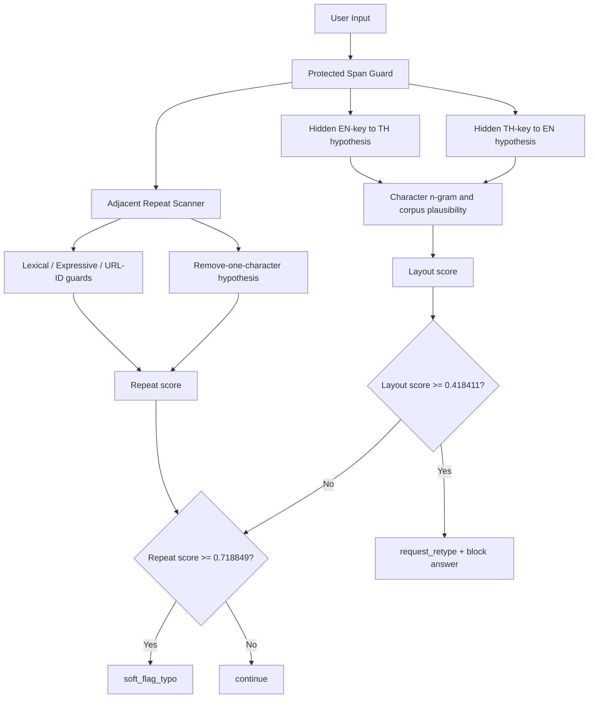

# Keyboard Input Anomaly Detector: Implementation and Evaluation

วันที่: 2026-08-30  
สถานะ: Prototype แยกจาก Runtime, ใช้เป็น Regression Baseline, ยังไม่เปิดใช้กับผู้ใช้จริง

## 1. สรุปผล

ได้สร้างและรันตัวตรวจจับ Input สองประเภทกับ Ground Truth 500 ข้อแล้ว:

1. `keyboard_layout_mismatch` ตรวจกรณีตั้งใจพิมพ์ไทยแต่คีย์บอร์ดเป็นอังกฤษ หรือกลับกัน
2. `repeated_character_typo` ตรวจตัวอักษร สระ หรือวรรณยุกต์ซ้ำโดยไม่ตั้งใจ

ผลรอบสุดท้าย:

| รายการ | Calibration 100 | Test/Regression 400 |
|---|---:|---:|
| Layout Precision | 100.00% | 100.00% |
| Layout Recall | 100.00% | 100.00% |
| Layout F1 | 100.00% | 100.00% |
| Repeat Precision | 100.00% | 100.00% |
| Repeat Recall | 100.00% | 100.00% |
| Repeat F1 | 100.00% | 100.00% |
| Exact Flag Accuracy | 100.00% | 100.00% |
| Action Accuracy | 100.00% | 100.00% |
| False Positive บนข้อความปกติ | 0/24 | 0/96 |

เวลาเฉลี่ยของ Detector เท่ากับ `0.804 ms/ข้อความ`, median `0.712 ms`, P95 `1.642 ms` และสูงสุด `3.530 ms` บนการรันครั้งสุดท้าย จึงแทบไม่กระทบเป้าหมายตอบกลับภายใน 10 วินาที

อย่างไรก็ตาม คะแนน 100% นี้ **ไม่ใช่ Production Accuracy** เพราะ:

- ข้อมูลส่วนใหญ่เป็น Synthetic Error ที่สร้างจาก Thai Kedmanee mapping และการเพิ่มตัวซ้ำแบบกำหนดได้
- Detector เรียน character n-gram จาก Clean Benchmark ใน Domain เดียวกัน
- ระหว่างพัฒนาได้เปิดดูข้อผิดพลาดใน Test Split แล้วปรับ feature rules สองรอบ Test 400 ข้อจึงกลายเป็น Regression Benchmark ไม่ใช่ Untouched Holdout

ต้องสร้าง Holdout ใหม่ที่ไม่ถูกเปิดดูระหว่างพัฒนา และควรมีข้อความผิดจริงจากผู้ใช้ก่อนสรุปความแม่นสำหรับ Production

## 2. สิ่งที่สร้าง

| ไฟล์ | หน้าที่ |
|---|---|
| `app/core/keyboard_input_anomaly.py` | Character n-gram profiles, hidden layout hypotheses, protected-span guard, repeat detector และ decision contract |
| `tools/run_keyboard_input_anomaly_eval.py` | Fit detector, เลือก threshold จาก Calibration, รัน 500 ข้อ และสร้างรายงาน |
| `tests/smoke_test_keyboard_input_anomaly.py` | ตรวจ mapping, URL guard, expressive/lexical repeat และ score ordering |
| `reports/keyboard_input_anomaly_eval/20260830_ngram_baseline_v1/results.jsonl` | ผลเต็ม 500 ข้อ รวมคะแนน เหตุผล span และเวลารายข้อ |
| `reports/keyboard_input_anomaly_eval/20260830_ngram_baseline_v1/results.csv` | ผล 500 ข้อสำหรับเปิดใน Excel |
| `reports/keyboard_input_anomaly_eval/20260830_ngram_baseline_v1/summary.json` | Threshold, metrics, score distribution, family metrics และ limitations |
| `reports/keyboard_input_anomaly_eval/20260830_ngram_baseline_v1/errors.jsonl` | ข้อผิดพลาดทุก Split; รอบสุดท้ายเป็นไฟล์ว่าง |
| `reports/keyboard_input_anomaly_eval/20260830_ngram_baseline_v1/calibration_errors.jsonl` | ข้อผิดพลาด Calibration; รอบสุดท้ายเป็นไฟล์ว่าง |
| `reports/keyboard_input_anomaly_eval/20260830_ngram_baseline_v1/test_errors.jsonl` | ข้อผิดพลาด Test/Regression; รอบสุดท้ายเป็นไฟล์ว่าง |
| `reports/keyboard_input_anomaly_eval/20260830_ngram_baseline_v1/report.md` | รายงานสั้นที่สร้างอัตโนมัติ |

## 3. Flow ของ Detector



ข้อความที่แปลง Layout และข้อความที่ตัดตัวซ้ำออกเป็นเพียง Diagnostic Hypothesis ภายใน ห้ามใช้แทนข้อความผู้ใช้และห้ามส่งเข้า Fast/Structured, RAG หรือ LLM โดยอัตโนมัติ

## 4. วิธีตรวจ Keyboard Layout

### 4.1 Character n-gram profile

Detector โหลดคำถามสะอาด 1,600 ข้อจาก `model_benchmark_1500.jsonl` แล้วสร้างสถิติอักขระต่อเนื่องขนาด 1-4 ตัวแยกภาษาไทยและอังกฤษ

ตัวอย่างแนวคิด:

```text
Observed: g]jo
Hidden mapping: เล่น

English-key source plausibility: ต่ำ
Mapped Thai plausibility: สูง
Mapped Thai span exists in clean corpus: ใช่
Layout score: 0.975002
```

ระบบไม่ได้ตรวจจาก Alias ว่า `g]jo = เล่น` แต่ประเมินว่าผลจากตำแหน่งคีย์บอร์ดมีโครงสร้างภาษาที่น่าเชื่อขึ้นหรือไม่ จึงรองรับประโยคใหม่ที่ไม่ได้อยู่ในรายการ Alias ได้

### 4.2 ตรวจสองทิศทาง

- `thai_intended_english_active`: ผู้ใช้ตั้งใจพิมพ์ไทย แต่ตัวที่รับมาเป็น English keys
- `english_intended_thai_active`: ผู้ใช้ตั้งใจพิมพ์อังกฤษ แต่ตัวที่รับมาเป็น Thai keys

ใน Test/Regression ตรวจทิศทางถูก 192/192 ข้อ แบ่งเป็น Thai intended 172 ข้อและ English intended 20 ข้อ

### 4.3 Protected Span Guard

ก่อนให้คะแนน ระบบลดหรือยกเลิกสัญญาณจากข้อมูลที่มีโอกาสเป็นข้อความถูกต้อง เช่น:

- URL, Email และ IP/localhost
- `booking_id`, `transaction_ref`, Request ID และ JSON
- วันที่ เวลา และเบอร์โทร
- ชื่อเกม คำอังกฤษ และ acronym ที่พบใน Clean Corpus
- ตัวเลขหรือรหัสที่มีรูปแบบชัดเจน

Guard นี้ทำให้ข้อความ เช่น `VR ราคาเท่าไหร่`, `TEKKEN 8`, URL, `13:30` และ `BK-2026-000123` ไม่ถูกบังคับให้พิมพ์ใหม่

## 5. วิธีตรวจตัวอักษรซ้ำ

Detector ค้นหา run ของอักขระที่ติดกัน เช่น `คค`, `้้`, `zz`, `]]` แล้วทดลองลบออกหนึ่งตัวเฉพาะเพื่อให้คะแนน ไม่ได้แก้ Input จริง

สัญญาณที่ใช้:

- Candidate หลังลบหนึ่งตัวมี character n-gram quality สูงขึ้นหรือไม่
- Candidate พบใน clean corpus/lexicon แต่รูปเดิมไม่พบหรือไม่
- ตัวซ้ำอยู่กลางคำหรือไม่
- เป็นสระหรือวรรณยุกต์ไทยซ้ำหรือไม่
- รูปเดิมเป็นคำจริง เช่น `TEKKEN`, `Football`, `กรรมการ` หรือไม่
- เป็นการลากเสียงท้ายคำตั้งแต่สามตัว เช่น `ไหมมม` หรือไม่
- อยู่ใน URL, ID, วันที่, เวลา หรือเบอร์โทรหรือไม่

กรณี Layout mismatch ต้องพิจารณาเครื่องหมายตามตำแหน่งแป้นด้วย เช่น:

```text
Raw repeat:       g]]jo
Mapped hypothesis: เลล่น
Remove one ]:     g]jo
Mapped candidate: เล่น
```

ดังนั้น `]]`, `''`, `::`, `--` หรือ `00` อาจเป็นตัวอักษรไทยซ้ำหลังสลับ Layout แต่ `???`, `!!!`, เวลา `09:00` และรหัสที่ถูกป้องกันจะไม่ถูกตีความเหมือนกัน

## 6. การเลือก Threshold

ใช้ Calibration 100 ข้อเลือกค่าโดยให้ความสำคัญกับ Precision ก่อน Recall:

| Detector | Precision floor | Threshold ที่ล็อก |
|---|---:|---:|
| Keyboard Layout | 0.97 | `0.418411` |
| Repeated Character | 0.95 | `0.718849` |

หลังล็อกค่าแล้วจึงคำนวณผลของ Test/Regression 400 ข้อ

Score separation ที่สังเกตใน 400 ข้อ:

| Detector | Positive ต่ำสุด | Negative สูงสุด | Separation margin |
|---|---:|---:|---:|
| Layout | 0.490904 | 0.339942 | 0.150962 |
| Repeat | 0.873747 | 0.512860 | 0.360887 |

Margin เป็นบวกใน Dataset นี้ แต่ยังรับประกันไม่ได้ว่าข้อความจริงจะไม่ตกอยู่ในช่วงว่างดังกล่าว

## 7. ผลแยกตาม Family

| Family ใน Test/Regression | จำนวน | Label ที่ต้องตรวจ | ผล Exact | เวลาเฉลี่ยโดยประมาณ |
|---|---:|---|---:|---:|
| `layout_th_to_en_full` | 72 | Layout | 100% | 0.45 ms |
| `layout_th_to_en_token` | 36 | Layout | 100% | 0.54 ms |
| `layout_th_to_en_suffix` | 16 | Layout | 100% | 0.89 ms |
| `layout_en_to_th_full` | 20 | Layout | 100% | 0.61 ms |
| `repeat_thai_internal` | 48 | Repeat | 100% | 0.99 ms |
| `repeat_thai_mark_or_vowel` | 32 | Repeat | 100% | 1.00 ms |
| `repeat_latin_internal` | 20 | Repeat | 100% | 0.91 ms |
| `repeat_short_token` | 12 | Repeat | 100% | 0.39 ms |
| `combined_layout_and_repeat` | 48 | Layout + Repeat | 100% | 1.01 ms |
| `valid_normal` | 40 | ไม่ควร Flag | 100% | 0.70 ms |
| `valid_protected_or_mixed` | 24 | ไม่ควร Flag | 100% | 0.61 ms |
| `valid_expressive_repetition` | 16 | ไม่ควร Flag | 100% | 0.43 ms |
| `valid_lexical_double` | 16 | ไม่ควร Flag | 100% | 0.94 ms |

## 8. ปัญหาที่พบระหว่างรันและสาเหตุ

### รอบแรก: ผิด 18 ข้อ

- Layout false negative 4 ข้อ
- Repeat false negative 14 ข้อ

สาเหตุหลัก:

1. `0v'` ซึ่งหมายถึง `จอง` ถูกมองเป็น Entity/ASCII ที่ควรป้องกัน เพราะระบบยอมรับเศษ Latin หนึ่งตัวกว้างเกินไป
2. ตัวซ้ำหลังผิด Layout แสดงออกเป็น punctuation เช่น `]]`, `''`, `::`, `--` จึงถูกกฎเดิมตัดทิ้งก่อนลอง mapping

วิธีแก้:

- จำกัดการป้องกัน English lexicon ให้ token ต้องมีโครงสร้างคำจริง
- ให้ repeat detector ตรวจว่าตัว punctuation นั้น map เป็นอักษรไทยหรือไม่
- ขยาย token รอบตัวซ้ำให้ครอบคลุม ASCII keyboard run ทั้งช่วง
- เพิ่ม guard สำหรับ URL, ID, วันที่, เวลา และเบอร์โทรก่อนตรวจ repeat

### รอบสอง: ผิด 7 ข้อ

- Layout false positive 6 ข้อ
- Layout false negative 1 ข้อ

สาเหตุหลักคือ Thai span สั้น เช่น `มี` หรือ `ไหม` เมื่อ map กลับจะเกิดเศษตัวอักษรอังกฤษหนึ่งตัว เช่น `u` หรือ `s` ซึ่งเคยพบใน corpus ทำให้ระบบเข้าใจว่าเป็น English word

วิธีแก้คือไม่ให้ single-letter fragment เป็น lexical evidence ยกเว้นคำอังกฤษจริง `a` และ `I` หลังแก้แล้ว Calibration และ Test/Regression ไม่มีข้อผิดพลาดใน Dataset นี้

## 9. เหตุผลที่ยังห้าม Auto-correct

แม้ Detector ตรวจ Label ครบ แต่ hidden preview ไม่ได้คืน Canonical ครบทุกข้อ:

| กลุ่ม | Preview ตรง Canonical |
|---|---:|
| Layout-positive ทั้งหมด | 115/192 = 59.90% |
| Layout อย่างเดียว | 115/144 = 79.86% |
| Layout + Repeat | 0/48 = 0% |
| Repeat-positive ทั้งหมด | 112/160 = 70.00% |
| Repeat อย่างเดียว | 112/112 = 100% |
| Layout + Repeat | 0/48 = 0% |

ตัวอย่าง Layout Detector อาจตรวจได้ถูก แต่ preview ยังเหลือบางช่วงที่ไม่ถูกแปลง:

```text
Observed:  ,u VR ws,
Canonical: มี VR ไหม
Preview:   ,u VR ไหม
```

ดังนั้นความสามารถ “ตรวจว่าผิด” ไม่เท่ากับความสามารถ “แก้แล้วได้เจตนาเดิมแน่นอน” Product v1 ควรขอให้ผู้ใช้พิมพ์ใหม่เท่านั้น

## 10. รูปแบบ Output รายข้อ

แต่ละแถวใน `results.jsonl` มีข้อมูลสำหรับ Audit ได้แก่:

- Input จริงและ Canonical Ground Truth
- Expected/Predicted flags และ action
- Layout/Repeat score และ threshold decision
- Expected/Predicted layout direction
- Span ต้นทาง, hidden mapped span, source/target quality และเหตุผล
- Protected-span decision
- เวลาที่ใช้รายข้อ
- `layout_correct`, `repeat_correct`, `block_correct`, `action_correct`
- `error_tags` เช่น false positive, false negative หรือ action mismatch

ข้อมูล candidate ใน log มีไว้ Debug เท่านั้น และควรใช้นโยบายเก็บข้อมูลเดียวกับข้อความผู้ใช้ เพราะอาจมีข้อมูลส่วนบุคคลอยู่ด้วย

## 11. ข้อเสนอสำหรับ Runtime

ยังไม่ควรต่อเข้าระบบตอบจริงทันที ควรทำตามลำดับ:

1. เปิด `shadow mode` ให้ Detector ให้คะแนนและเก็บ metric แต่ไม่เปลี่ยนคำตอบผู้ใช้
2. เก็บเฉพาะ Log ที่ผ่านการลบหรือ mask ข้อมูลส่วนบุคคล
3. สุ่มข้อความใกล้ threshold ให้คนตรวจ Label
4. สร้าง Independent Holdout ใหม่โดยห้ามเปิดดูระหว่างปรับ Detector
5. เมื่อ Precision ของ Layout บนข้อมูลจริงถึงเกณฑ์ จึงเปิด `request_retype` แบบค่อยเป็นค่อยไป
6. Repeat detector ควรเริ่มจาก soft warning และไม่แก้คำเอง
7. มี feature flag และ rollback เพื่อปิด Detector ได้ทันทีหาก False Positive สูง

Policy ที่แนะนำ:

```text
Layout high confidence -> ขอให้พิมพ์ใหม่ -> ห้ามเข้า Answer Pipeline
Repeat only            -> แจ้งว่าพบตัวอักษรซ้ำ -> ยังไม่แก้ข้อความเอง
Low confidence         -> ไม่ขวางคำตอบ แต่เก็บ shadow metric
Protected span         -> ใช้ข้อความเดิมต่อ
```

## 12. สิ่งที่ยังไม่ครอบคลุม

- Thai Pattachote และ Keyboard Layout อื่น
- การพิมพ์มือถือ, swipe, autocorrect และ predictive keyboard
- Romanized Thai เช่น `len game dai mai`
- ตัวอักษรหาย, สลับตำแหน่ง, กดปุ่มข้างเคียง และเว้นวรรคผิด
- ภาษาที่สามและ Unicode confusable characters
- Spam/adversarial input และข้อความยาวมาก
- สัดส่วนความผิดจริงใน Production
- ผลกระทบต่อ Session Context และคำถามต่อเนื่อง

## 13. คำสั่งรันซ้ำ

```powershell
py -X utf8 tests\smoke_test_keyboard_input_anomaly.py
py -X utf8 tools\run_keyboard_input_anomaly_eval.py
```

Runner จะอ่าน Ground Truth 500 ข้อ, fit จาก clean corpus, เลือก threshold ด้วย Calibration และเขียน output ชุดใหม่ลง `reports/keyboard_input_anomaly_eval/20260830_ngram_baseline_v1/`
