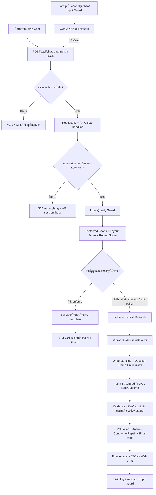
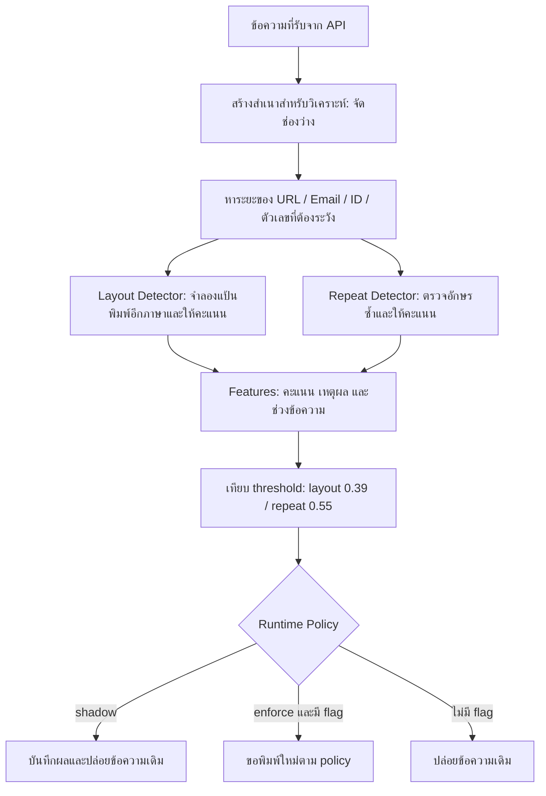

# Flow ตรวจข้อความพิมพ์ผิดภาษาและตัวอักษรซ้ำ ก่อนเข้า PSU Esports Chatbot

วันที่ตรวจข้อมูล: 31 สิงหาคม 2026  
ขอบเขต: อธิบาย Input Quality Guard ที่มีอยู่จริง และออกแบบขั้นตอนปรับปรุงสำหรับใช้งานร่วมกับ Chatbot  
การเปลี่ยนแปลงในงานนี้: จัดทำเอกสารเท่านั้น ไม่ได้เปลี่ยนค่า production หรือแก้ source code

> **ใจความสำคัญ:** รับข้อความจากผู้ใช้ แล้วประเมินว่ามีหลักฐานของการใช้แป้นพิมพ์ผิดภาษาหรือกดตัวอักษรซ้ำโดยไม่ตั้งใจหรือไม่ หากหลักฐานผ่านเกณฑ์และเปิดโหมดบังคับใช้ ให้ขอให้ผู้ใช้พิมพ์ใหม่ก่อนเข้า Flow ตอบคำถาม ตัวตรวจจะไม่ส่งคำที่เดาว่าถูกไปให้ Chatbot ตอบแทนผู้ใช้
>
> **สถานะจริงตอนนี้:** ตัวตรวจถูกเชื่อมใน Web API แล้ว แต่ค่าเริ่มต้นเป็น `shadow` ซึ่งตรวจและบันทึกผลโดยยังปล่อยข้อความเดิมผ่านไป การขอให้พิมพ์ใหม่จริงต้องใช้ `enforce` และสำหรับตัวอักษรซ้ำต้องใช้ policy `ask_retype` ด้วย

## สารบัญ

1. [ปัญหาและเป้าหมาย](#1-ปัญหาและเป้าหมาย)
2. [สิ่งที่ทำแล้วและสิ่งที่ยังขาด](#2-สิ่งที่ทำแล้วและสิ่งที่ยังขาด)
3. [Flow รวมตั้งแต่ Input ถึง Output](#3-flow-รวมตั้งแต่-input-ถึง-output)
4. [Setup และข้อมูลที่ใช้สร้างตัวตรวจ](#4-setup-และข้อมูลที่ใช้สร้างตัวตรวจ)
5. [รับ Request และควบคุมงานพร้อมกัน](#5-รับ-request-และควบคุมงานพร้อมกัน)
6. [เตรียมข้อความและป้องกันการตรวจผิด](#6-เตรียมข้อความและป้องกันการตรวจผิด)
7. [ตรวจการใช้แป้นพิมพ์ผิดภาษา](#7-ตรวจการใช้แป้นพิมพ์ผิดภาษา)
8. [ตรวจตัวอักษรซ้ำ](#8-ตรวจตัวอักษรซ้ำ)
9. [ตัดสินใจว่าจะให้ผ่านหรือพิมพ์ใหม่](#9-ตัดสินใจว่าจะให้ผ่านหรือพิมพ์ใหม่)
10. [สิ่งที่เกิดใน Chatbot หลังผ่าน Guard](#10-สิ่งที่เกิดใน-chatbot-หลังผ่าน-guard)
11. [API และประสบการณ์บนหน้าเว็บ](#11-api-และประสบการณ์บนหน้าเว็บ)
12. [History และความหมายของ detect-only](#12-history-และความหมายของ-detect-only)
13. [ตัวอย่างเดินผ่าน Flow](#13-ตัวอย่างเดินผ่าน-flow)
14. [ผลทดสอบและการแปลผล](#14-ผลทดสอบและการแปลผล)
15. [เวลา ทรัพยากร และกรณีระบบผิดพลาด](#15-เวลา-ทรัพยากร-และกรณีระบบผิดพลาด)
16. [Logging ที่มีอยู่และที่ควรเพิ่ม](#16-logging-ที่มีอยู่และที่ควรเพิ่ม)
17. [แผนปรับปรุงตามลำดับ](#17-แผนปรับปรุงตามลำดับ)
18. [แผนทดสอบและเกณฑ์เปิดใช้งาน](#18-แผนทดสอบและเกณฑ์เปิดใช้งาน)
19. [ตั้งค่าและนำไปใช้งาน](#19-ตั้งค่าและนำไปใช้งาน)
20. [ศัพท์เทคนิคและไฟล์อ้างอิง](#20-ศัพท์เทคนิคและไฟล์อ้างอิง)

## 1. ปัญหาและเป้าหมาย

### 1.1 ปัญหาที่กำลังแก้

ผู้ใช้อาจพิมพ์ผิดจนข้อความที่ระบบเห็นเปลี่ยนไปจากสิ่งที่ต้องการถาม เช่น:

| ผู้ใช้ตั้งใจ | ระบบได้รับ | ปัญหาที่อาจตามมา |
|---|---|---|
| `เล่น` | `g]jo` | ระบบมองไม่ออกว่ากำลังพูดถึงการเล่น แล้วเลือกหมวดผิด |
| `จองแล้วแก้ไขได้ไหม` | `จอองแล้วแก้ไขได้ไหม` | คำสำคัญเกี่ยวกับการจองไม่ตรงรูปที่ระบบรู้จัก |
| คำถามภาษาไทยที่มีชื่อเกมภาษาอังกฤษ | ข้อความไทยและอังกฤษผสมกันตามปกติ | ถ้าตรวจหยาบเกินไป อาจคิดว่าชื่อเกมคือการพิมพ์ผิดภาษา |
| `เล่นได้ไหมมม` | การลากเสียงโดยตั้งใจ | ถ้าลบหรือดักทุกตัวอักษรซ้ำ จะรบกวนผู้ใช้ที่พิมพ์ปกติ |
| `กรรมการ` หรือ `coffee` | คำที่มีตัวอักษรซ้ำถูกต้อง | การพบตัวซ้ำเพียงอย่างเดียวไม่ใช่หลักฐานว่าเป็น typo |

ความเสียหายไม่ได้จบที่อ่านคำไม่ออก: ระบบอาจเลือก intent ผิด ดึงข้อมูลผิดเรื่อง แล้วได้คำตอบที่อ่านลื่นแต่ไม่ตรงคำถาม

### 1.2 เป้าหมายของ Guard

1. ตรวจข้อความน่าสงสัยก่อนระบบนำไปตีความและดึงข้อมูล
2. ขอให้ผู้ใช้พิมพ์ใหม่เมื่อหลักฐานมากพอ
3. ลดการเรียก RAG/LLM กับข้อความที่ยังไม่ควรตอบ
4. ปล่อยภาษาไทย ภาษาอังกฤษ ชื่อเกม รหัส และภาษาสนทนาที่ใช้ได้ตามปกติ
5. เก็บเหตุผลของการตัดสินใจไว้ตรวจย้อนหลัง

Guard นี้ไม่ได้มีหน้าที่ตอบ FAQ ไม่ได้แยก intent และไม่ได้รับรองว่าข้อความที่ผ่านแล้วสะกดถูกทุกคำ

### 1.3 สิ่งที่ไม่ทำในรอบนี้

- ไม่แปลภาษาหรือแทนข้อความผู้ใช้ด้วยข้อความที่คาดเดา
- ไม่ทำรายการ alias ของคำผิดทุกคำ เช่น บันทึกทุกวิธีที่สามารถพิมพ์ `จอง` ผิด
- ไม่ใช้ LLM ตัดสินทุกข้อความ เพราะจะเพิ่มเวลารอและการใช้โมเดล
- ไม่อ้างว่ารองรับ typo ทุกชนิด เช่น ตัวหาย ตัวสลับ Romanized Thai หรือเสียงพูดที่ถอดผิด

## 2. สิ่งที่ทำแล้วและสิ่งที่ยังขาด

คำว่า **มีแล้ว** หมายถึงพบใน source code ที่ตรวจครั้งนี้ ไม่ได้แปลว่าตั้งค่าเปิดบน server ที่กำลังให้บริการแล้ว

| ส่วน | สถานะ | ความหมาย |
|---|---|---|
| ตรวจแป้นพิมพ์ไทยเกษมณี/อังกฤษทั้งสองทิศทาง | มีแล้ว | ใช้ตารางตำแหน่งแป้นพิมพ์และคะแนนรูปแบบภาษา |
| ตรวจตัวอักษรซ้ำติดกัน | มีแล้ว | ตรวจ run ของตัวอักษรเดียวกัน แล้วประเมินบริบท |
| สร้างตัวตรวจจากไฟล์ความรู้ในโปรเจกต์ | มีแล้ว | ไม่โหลดชุดประเมิน 500 ข้อเพื่อ fit ตอน server เริ่ม |
| แทรก Guard ก่อน Session Context Resolver ใน Web API | มีแล้ว | เรียกใน `POST /api/chat` หลัง Admission Control |
| โหมด shadow/enforce | มีแล้ว | ค่าเริ่มต้นเป็น shadow |
| หยุดก่อนเรียก Pipeline เมื่อ enforce ตรวจพบ | มีแล้ว | ส่งข้อความขอพิมพ์ใหม่และจบ request |
| เก็บคะแนนและเหตุผลใน log | มีแล้ว | รวมอยู่ในข้อมูล `input_quality` |
| คำเตือนบนหน้าเว็บสำหรับ warn-and-continue | มีแล้ว | แสดงข้อความ notice เมื่อ enforce ใช้ policy `warn_and_continue` |
| กันข้อความที่ถูก Guard ดักออกจาก history รอบถัดไป | มีแล้วฝั่ง Web Chat | turn ยังแสดงบนหน้าจอ แต่ไม่ถูกส่งใน `recent_history` รอบต่อไป |
| เวลา Guard และรุ่น profile ใน API/log | มีแล้ว | บันทึก `guard_elapsed_ms` และ `profile_version`; `latency_sec` ของ Guard ใช้เวลา Guard เป็นวินาที |
| ครอบคลุม CLI/benchmark ที่เรียก Pipeline โดยตรง | ไม่อัตโนมัติ | ต้องเรียก Guard เอง หรือใช้จุดรับ request ร่วมกันในอนาคต |
| ตรวจ status/วันหมดอายุของทุก record ก่อน fit | ยังไม่มีใน loader นี้ | ปัจจุบันเชื่อว่าไฟล์ curated ที่ระบุเป็นชุดที่พร้อมใช้ |
| Reload ตัวตรวจเมื่อ Publish ข้อมูลใหม่ | ยังไม่มีวงจรอัตโนมัติในโมดูลนี้ | สร้างตัวตรวจตอน startup ต้องเพิ่มการสลับ snapshot หากต้องการ reload สด |
| การประเมินกับข้อมูลผู้ใช้จริงที่ไม่เคยใช้ปรับระบบ | ยังต้องทำ | ผล synthetic ปัจจุบันไม่ใช่ความแม่นยำ production |

ข้อควรแยกอีกเรื่อง: Guard ใหม่ไม่แก้ข้อความ แต่ `normalization.py` ของ Flow เดิมยังมี alias, fuzzy normalization และ spelling normalization อยู่ จึงยังไม่ควรเรียกทั้งระบบว่า detect-only แบบเคร่งครัด

## 3. Flow รวมตั้งแต่ Input ถึง Output

### 3.1 Flow ปัจจุบันใน Web API



Flow ด้านหลัง Guard สรุปจาก Flow 43 เพื่อแสดงตำแหน่งการเชื่อมต่อ ไม่ได้หมายความว่าทุก request ต้องผ่านทุก path หรือเรียก LLM ทุกขั้น

### 3.2 Flow ข้างใน Guard



สองแขนงในภาพคือการแยกหน้าที่ทางตรรกะ โค้ด `analyze()` ปัจจุบันคำนวณ layout แล้ว repeat ตามลำดับ ไม่ได้สร้างงาน GPU หรือรันสองโมเดลพร้อมกัน

### 3.3 Flow เป้าหมายที่ควรพัฒนาต่อ

```text
ข้อความต้นฉบับ
  -> ตรวจ request และจำกัดภาระงาน
  -> Input Guard ด้วย profile/version ที่แน่นอน
  -> ตรวจพบและ policy ให้หยุด
       -> ขอพิมพ์ใหม่
       -> บันทึกเป็น input-quality event
       -> ไม่ใช้ข้อความนี้เป็นบริบทข้อเท็จจริงรอบถัดไป
  -> ไม่พบหรือยังเป็น shadow
       -> ส่งข้อความเดิมเข้า Flow ตอบคำถาม
       -> แยกการ normalize รูปแบบออกจากการเดาแก้คำ
       -> ตรวจ intent/evidence/answer ตามเดิม
  -> เก็บผลและเวลาที่ใช้
  -> ตรวจกรณีพลาด -> ปรับข้อมูล/เกณฑ์ -> ทดสอบ regression -> เปิดใช้งานเป็นรอบ
```

## 4. Setup และข้อมูลที่ใช้สร้างตัวตรวจ

### 4.1 โหลด configuration

`RuntimeInputQualityGuard.from_environment()` อ่านค่าที่ใช้ควบคุมพฤติกรรม:

| ค่า | ค่าเริ่มต้น | ใช้ทำอะไร |
|---|---|---|
| `PSU_INPUT_QUALITY_GUARD_ENABLED` | `true` | เปิดการสร้างและเรียกตัวตรวจ |
| `PSU_INPUT_QUALITY_GUARD_MODE` | `shadow` | เลือกตรวจอย่างเดียวหรือหยุด request ที่เข้าเกณฑ์ |
| `PSU_INPUT_QUALITY_LAYOUT_THRESHOLD` | `0.39` | เกณฑ์คะแนนการใช้แป้นพิมพ์ผิดภาษา |
| `PSU_INPUT_QUALITY_REPEAT_THRESHOLD` | `0.55` | เกณฑ์คะแนนตัวอักษรซ้ำ |
| `PSU_INPUT_QUALITY_REPEAT_POLICY` | `ask_retype` | หยุดเพื่อขอพิมพ์ใหม่ หรือให้ข้อความผ่านต่อ |

หาก mode ไม่ตรงค่าที่รองรับ โค้ดเลือกกลับไป `shadow` จึงควรอ่าน `/health` หลังเปิดระบบทุกครั้ง ไม่ควรดูเพียงว่า environment ถูกเขียนไว้แล้ว

### 4.2 สร้าง clean corpus

**Corpus** หมายถึงชุดข้อความตัวอย่างที่ตัวตรวจใช้เรียนรู้รูปแบบตัวอักษร ไม่ใช่ประวัติความจำของผู้ใช้

แหล่งปัจจุบันอยู่ใน `RUNTIME_CORPUS_PATHS` ประกอบด้วยข้อมูลชื่อเกมและ alias, รายละเอียดเกม, ปุ่มควบคุม, เกมที่มีในแต่ละบริการ, สมาชิกและบทบาท, กฎ และ fact cards

Loader ทำตามลำดับ:

1. เปิดไฟล์ JSONL ที่กำหนดไว้
2. อ่านทีละ record แล้วเลือกฟิลด์ข้อความ เช่น `title`, `text`, `answer`, `aliases`, `patterns`, `name`, `zone`, `games`, `notes`
3. รองรับ string และ list/tuple ของข้อความในฟิลด์เหล่านี้ ไม่ได้ไล่อ่าน nested dictionary ทุกระดับโดยอัตโนมัติ
4. ตัดข้อความว่าง และตัดรายการซ้ำด้วย key แบบไม่แยกตัวพิมพ์เล็ก/ใหญ่
5. ส่งข้อความที่ได้ให้ `KeyboardInputAnomalyDetector.fit()`

รายงานล่าสุดสร้าง corpus ได้ **3,946 รายการข้อความ** จำนวนนี้เปลี่ยนได้เมื่อข้อมูลต้นทางเปลี่ยน

ข้อจำกัด: ไฟล์ที่ไม่มีและบรรทัด JSON ที่อ่านไม่ได้จะถูกข้าม ปัจจุบันยังไม่มี manifest ที่รับรองว่าทุกไฟล์ครบหรือทุก record ผ่านอนุมัติแล้ว ดังนั้นการเรียกว่า published corpus เป็นข้อตกลงของขั้นตอนเตรียมข้อมูล ไม่ใช่ approval check ภายใน loader นี้

### 4.3 สร้าง Character N-gram Profile

**Character n-gram** คือกลุ่มตัวอักษรที่อยู่ติดกันจำนวน n ตัว เช่น `play`:

```text
1-gram: p, l, a, y
2-gram: pl, la, ay
3-gram: pla, lay
4-gram: play
```

ตัวตรวจสร้าง profile แยกไทยและอังกฤษ โดยนับ 1-gram ถึง 4-gram และเพิ่มเครื่องหมายต้น/ท้ายลำดับ `^` กับ `$`

ใช้ `collections.Counter` เก็บจำนวนครั้งที่แต่ละกลุ่มปรากฏ และใช้ `math.log1p` ลดความต่างระหว่างกลุ่มที่พบบ่อยมากกับกลุ่มที่พบน้อย

**จุดที่ต้องเข้าใจ:** ไม่ได้ train Qwen, BGE หรือ neural network ใหม่ และไม่ได้ใช้ embedding ขั้นตอนนี้เป็นการสร้างตารางสถิติลักษณะข้อความบน CPU

### 4.4 สร้างข้อมูลประกอบสำหรับคำที่รู้จัก

- คำไทย: เก็บลำดับภาษาไทยจาก corpus รวมไว้สำหรับตรวจว่ารูปนั้นเคยปรากฏหรือไม่
- คำอังกฤษ: นับคำที่พบใน corpus และเสริม `GENERIC_ENGLISH_WORDS` ซึ่งเป็นคำอังกฤษ/ชื่อเฉพาะที่ถูกต้อง
- ตรวจรหัสและรูปแบบพิเศษเพิ่มเติมด้วย regular expression

การมีรายการคำที่ถูกต้องช่วยกัน false positive แต่ต่างจากการเขียน alias ของคำผิดทีละรูป ระบบยังสามารถให้คะแนนคำผิดที่ไม่เคยกำหนดไว้โดยใช้ n-gram และตำแหน่งแป้นพิมพ์

### 4.5 เก็บ profile ไว้ใน RAM

Server สร้างตัวตรวจหนึ่งชุดตอน startup แล้วใช้ซ้ำระหว่าง request โดยไม่ fit ใหม่ทุกคำถาม

ข้อมูลใน RAM เป็น Counter, string และข้อมูลคำที่รู้จัก ใช้ CPU ในการตรวจ ไม่มีการจอง VRAM เพื่อ Guard นี้โดยตรง ส่วน Qwen/BGE มีวงจร warmup ของตนเอง

ยังไม่มีผลวัด RAM และ startup time แยกของ Guard จึงไม่ควรระบุว่ากินกี่ MB หรือใช้เวลาไม่กี่ ms โดยไม่มีการวัดจริง หากเปิดหลาย process แต่ละ process จะมี profile ของตนเอง

## 5. รับ Request และควบคุมงานพร้อมกัน

### 5.1 รับข้อมูลจาก Web Chat

ตัวอย่าง request:

```json
{
  "question": "g]jo",
  "client_session_id": "browser-session-example",
  "recent_history": [],
  "debug": false
}
```

`question` คือข้อความรอบนี้ ส่วน `recent_history` คือบริบทที่ client ส่งมา Guard ปัจจุบันตรวจเฉพาะ `question` ก่อนเรียกตัวอ่าน history

### 5.2 ตรวจ request เบื้องต้น

โค้ด API ปัจจุบันตรวจขนาด body ไม่เกิน 128 KiB, อ่าน JSON, ตรวจคำถามไม่ว่าง และจำกัดคำถามไม่เกิน 4,000 ตัวอักษร

การตรวจนี้ป้องกัน request ผิดรูปแบบบางชนิด แต่ยังไม่ใช่ schema validation ครบทุกฟิลด์ เพราะมีการแปลง `question` ด้วย `str(...)` ควรเพิ่มการตรวจชนิด payload และจำกัด history อย่างชัดเจนก่อน production

### 5.3 Request ID และ Global Deadline

- `uuid.uuid4().hex` สร้าง Request ID ใหม่สำหรับคำถามแต่ละครั้ง เพื่อเชื่อม log
- Session ID ใช้บอกว่าคำถามมาจากบทสนทนาใด จึงเป็นคนละหน้าที่กับ Request ID
- Deadline รวมเริ่มก่อน Admission Control ค่าเริ่มต้น backend 9 วินาที

ตัวตรวจ Guard อยู่ภายใน request budget นี้ แต่การมี deadline ไม่ได้แปลว่า synchronous code ทุกส่วนจะถูกตัดทิ้งทันทีเมื่อหมดเวลา ดูข้อจำกัดในหัวข้อ 15

### 5.4 Admission Control

ใช้ `threading.BoundedSemaphore` จำกัด active requests เริ่มต้นที่ 16 ต่อ process ไม่ใช่การอ่าน CPU/GPU utilization แล้วตัดสินใจทุกครั้ง

เมื่อเต็มจะตอบ `503 server_busy` โดยไม่เริ่ม Guard ส่วน session เดียวกันใช้ lock รอได้เริ่มต้น 0.10 วินาที หากยังไม่ได้ lock จะตอบ `409 session_busy`

ดังนั้นข้อความที่ไม่ใช้ LLM ก็ยังต้องผ่านขีดจำกัดของ Web API เพียงแต่คำถามที่ Guard หยุดไว้จะไม่ไปต่อคิว LLM/RAG ในขั้นถัดไป

เมื่อ request จบหรือเกิด error ระบบปล่อย semaphore และ session lock ใน `finally`

## 6. เตรียมข้อความและป้องกันการตรวจผิด

### 6.1 วิเคราะห์บนสำเนาข้อความ

`analyze()` ใช้ `_clean_space()` จัดช่องว่างซ้ำและตัดหัวท้ายบนสำเนาที่ใช้ให้คะแนน ส่วน Guard ไม่เขียน candidate กลับไปแทน `question` ของ API

ตำแหน่ง start/end ของ span ในตัวตรวจจึงอ้างถึงข้อความสำเนาที่จัดช่องว่างแล้ว หากอนาคตจะ highlight บนข้อความต้นฉบับ ต้องเพิ่มการเทียบตำแหน่ง ไม่ควรใช้ offset ตรง ๆ ในกรณีช่องว่างเปลี่ยน

### 6.2 Protected Spans

**Span** คือช่วงหนึ่งของข้อความ เช่น ช่วงที่เป็น URL หรือรหัสจอง

ใช้ regular expression จับรูปแบบที่ไม่ควรตัดสินว่าเป็นคำผิดง่าย ๆ:

| รูปแบบ | ตัวอย่าง | เหตุผล |
|---|---|---|
| URL | `https://example.org/help` | มีเครื่องหมายและอักษรผสมตามปกติ |
| Email | `student@example.org` | จุดและ @ ไม่ใช่การพิมพ์ผิดภาษา |
| รหัสพร้อมชื่อฟิลด์ | `booking_id=BK-123456` | เป็น identifier ไม่ใช่ประโยค |
| รหัส BK/TXN ที่ตรง pattern | `TXN-123456` | อาจมีตัวเลขและอักษรซ้ำตามปกติ |
| IP, วันที่, เวลา | `127.0.0.1`, `2026-08-31`, `14:30` | ไม่ควรนำไปเดาเป็นภาษาไทย |
| เบอร์โทรแบบที่ pattern รองรับ | `000-000-0000` | ตัวอย่างรูปแบบ ไม่ใช่ข้อมูลติดต่อจริง |
| ข้อความในวงเล็บปีกกาช่วงสั้น | `{"mode":"test"}` | ลดการตีความตัวอย่างข้อมูลเป็น typo |
| คำอังกฤษที่รู้จัก/รหัสตัวใหญ่ | `coffee`, `PS5`, `API` | ป้องกันชื่อเฉพาะและคำที่มีอักษรซ้ำถูกต้อง |

**พฤติกรรมจริงต่างกันตาม detector:** repeat ใน protected span ได้คะแนน 0 ส่วน layout ส่วนที่ protected จะถูกลดคะแนนอย่างมาก เช่น คูณ 0.08 ไม่ใช่ลบทิ้งทุกกรณี

ข้อจำกัด: pattern นี้ไม่รู้จักรหัสทุกรูปแบบ และการปกป้องตัวพิมพ์ใหญ่หรือข้อความใน `{...}` อาจทำให้พลาดข้อความผิดบางแบบ จึงต้องมี test ทั้งด้านป้องกัน false positive และด้านการหลุดรอด

Protected span เป็นเพียงข้อยกเว้นของการตรวจ typo ไม่ใช่การรับรองว่า URL ปลอดภัย หรือคำสั่งใน JSON เป็นสิ่งที่ระบบควรทำตาม

## 7. ตรวจการใช้แป้นพิมพ์ผิดภาษา

### 7.1 เทคนิคที่ใช้

ใช้ **Keyboard-layout mapping + Character n-gram scoring + คำที่รู้จัก + กฎลด false positive**

ไม่มี LLM หรือ BGE อยู่ในขั้นตอนนี้

### 7.2 จำลองตำแหน่งแป้นพิมพ์

ตาราง `KEYBOARD_EN_TO_THAI` จับคู่ว่าปุ่มเดียวกันให้ตัวอักษรใดเมื่อสลับภาษา เช่น:

```text
ปุ่ม g -> เ
ปุ่ม ] -> ล
ปุ่ม j -> ่
ปุ่ม o -> น

g]jo -> เล่น
```

นี่คือการทดลองสมมติฐานว่า "ถ้าผู้ใช้ตั้งใจใช้ภาษาไทย ปุ่มที่กดจะได้อะไร" ไม่ใช่การแปลความหมายแบบ English-to-Thai

ตัวตรวจลองทั้งอังกฤษเป็นไทยและไทยเป็นอังกฤษ แล้วเลือกทิศทางที่มีหลักฐานมากกว่า Candidate ที่ได้มีไว้ให้คะแนนเท่านั้น ไม่ถูกส่งเป็นคำถามให้ Chatbot

### 7.3 เลือกช่วงข้อความที่จะลอง

- ช่วงอักษร/ตัวเลข/สัญลักษณ์แป้นอังกฤษ: ใช้ `ASCII_KEY_RUN_RE`
- ช่วงอักษรไทย: ใช้ `THAI_RE`
- ข้อความผสม เช่น `PS5 g]jo ยังไง` จะถูกพิจารณาเป็นหลายช่วง พร้อมลดคะแนนของคำที่ปกป้องไว้

วิธีนี้ช่วยให้ตรวจการลืมเปลี่ยนภาษาเฉพาะกลางประโยคได้ ไม่จำเป็นต้องผิดทั้งข้อความ

### 7.4 คะแนนรูปแบบภาษา Q

สำหรับแต่ละ n-gram คำนวณสองส่วน:

1. **Coverage:** กลุ่มตัวอักษรที่พบในข้อความนี้ เคยปรากฏใน corpus มากน้อยแค่ไหน
2. **Frequency:** กลุ่มเหล่านั้นปรากฏบ่อยเพียงใด โดยใช้ log ลดผลของคำที่พบบ่อยมาก

สูตรปัจจุบัน:

```text
score_n = 0.82 * coverage_n + 0.18 * normalized_log_frequency_n

น้ำหนัก n-gram:
1 ตัว = 0.10
2 ตัว = 0.22
3 ตัว = 0.30
4 ตัว = 0.38

Q = ค่าเฉลี่ยถ่วงน้ำหนักของ score_n ที่คำนวณได้
```

อธิบายง่าย ๆ: รูปอักษรที่คล้ายภาษาในชุดข้อมูลจะได้คะแนนสูงกว่าอักษรที่ไม่ค่อยเกิดร่วมกัน

**Q ไม่ใช่ความน่าจะเป็นที่ประโยคถูกต้อง** และไม่สามารถรับรองความหมายได้ เช่น ประโยคที่มีคำคุ้นเคยแต่ถามผิดบริบทก็อาจได้คะแนนภาษาเป็นปกติ

### 7.5 คะแนนแต่ละ span

กำหนด:

```text
Q_source = คะแนนข้อความก่อนจำลองแป้นพิมพ์
Q_target = คะแนนหลังจำลองแป้นพิมพ์
gain = max(0, Q_target - Q_source)
```

กรณีอังกฤษที่อาจตั้งใจพิมพ์ไทย:

```text
score = 0.57 * Q_target
      + 0.22 * gain
      + 0.08 * สัดส่วนตัวที่ไม่ใช่อักษรใน span

ถ้ารูปภาษาไทยหลังจำลองพบใน corpus: บวก 0.16
```

กรณีไทยที่อาจตั้งใจพิมพ์อังกฤษ ใช้ส่วน `0.57 * Q_target + 0.22 * gain` และบวก 0.20 เมื่อคำอังกฤษหลังจำลองเป็นคำที่รู้จัก

จากนั้นใช้ตัวลดคะแนน:

- span ยาวไม่เกิน 2 ตัว: ลดคะแนน เพราะมีโอกาสบังเอิญสูง
- protected span หรือคำอังกฤษ/รหัสที่ปกป้องไว้: ลดคะแนน
- `Q_target < 0.24`: ลดคะแนน เพราะ candidate ยังไม่ดูเป็นภาษาที่น่าเชื่อถือ
- จำกัดคะแนนสุดท้ายให้อยู่ในช่วง 0 ถึง 1

ตัวเลขน้ำหนักเหล่านี้เป็น heuristic ในโค้ด ไม่ใช่ค่าที่ LLM เรียนรู้หรือ confidence ที่ calibrate เป็นเปอร์เซ็นต์แล้ว

### 7.6 รวมเป็นคะแนนข้อความ

นำ span ที่คะแนนสูงสุดมาเป็นฐาน แล้วเพิ่มคะแนนเล็กน้อยเมื่อมีหลายช่วงสนับสนุน หรือช่วงที่น่าสงสัยครอบคลุมข้อความมาก

```text
supporting spans: score >= max(0.42, top_span_score - 0.16)
support_bonus: เพิ่ม 0.025 ต่อ supporting span ที่เพิ่มมา สูงสุด 0.10
coverage_bonus: 0.07 * สัดส่วนข้อความที่ supporting spans ครอบคลุม

layout_score = clamp(top_span_score + support_bonus + coverage_bonus, 0, 1)
```

เลข 0.42 ในสูตรรวม span เป็นคนละค่ากับ threshold ตัดสินสุดท้าย 0.39 การเปลี่ยน environment threshold ไม่ได้เปลี่ยนทุกค่าภายในสูตร

### 7.7 ตัดสิน flag

```text
layout_score >= 0.39 -> keyboard_layout_mismatch
layout_score < 0.39  -> ไม่ตั้ง flag นี้
```

`0.39` ไม่ได้หมายถึงมั่นใจ 39% เป็นเส้นแบ่งบนสเกลคะแนนของ detector เวอร์ชันนี้ ต้องตรวจใหม่เมื่อ corpus หรือสูตรเปลี่ยน

## 8. ตรวจตัวอักษรซ้ำ

### 8.1 เทคนิคที่ใช้

ใช้ **Regular expression + การลบตัวซ้ำหนึ่งตัวเพื่อทดลอง + คะแนนรูปแบบภาษา + คำที่รู้จัก + กฎแยกการลากเสียง**

`REPEATED_RE = (.)\1+` จับตัวอักษรเดียวกันที่อยู่ติดกันตั้งแต่สองตัว เช่น `ออ`, `รร`, `ee`, `มมม`

วิธีนี้ไม่ได้ตรวจตัวอักษรหาย สลับตำแหน่ง หรืออักษรที่ผิดแต่ไม่มีการซ้ำ

### 8.2 หา token รอบตำแหน่งที่ซ้ำ

ตัวตรวจหาช่วงภาษาไทยหรือช่วงอักษรอังกฤษที่ครอบตัวซ้ำ แล้วนำช่วงนั้นมาประเมิน

ตัวอย่าง:

```text
ข้อความ: จอองแล้วแก้ไขได้ไหม
run ที่ซ้ำ: ออ
token ที่ใช้พิจารณา: จอองแล้วแก้ไขได้ไหม
candidate ทดลอง: จองแล้วแก้ไขได้ไหม
```

**ข้อจำกัดภาษาไทย:** token ในโค้ดนี้อาจเป็นประโยคติดกันยาว ๆ ไม่ใช่คำที่ผ่านการตัดคำภาษาไทยแล้ว การมีชื่อเทคนิคว่า token จึงไม่ได้แปลว่าแบ่งเป็น `จอง / แล้ว / แก้ไข / ได้ / ไหม` ถูกต้องเสมอ

### 8.3 สร้าง candidate ทดลอง

ลบตัวซ้ำออกเพียงหนึ่งตัวใน run แล้วเปรียบเทียบกับรูปเดิม หากมี `อออ` candidate อาจยังมี `ออ` อยู่ ไม่ได้ลดทุก run เหลือตัวเดียว

Candidate นี้อยู่ภายในตัวตรวจเพื่อสร้างหลักฐานเท่านั้น ไม่ใช่ draft ของคำตอบและไม่ควรนำไปแทน input จริง

### 8.4 กฎก่อนคำนวณคะแนนทั่วไป

โค้ดตรวจตามลำดับ เงื่อนไขที่เข้าได้ก่อนมีผลก่อน:

| เงื่อนไข | คะแนน repeat ของ span | เหตุผล |
|---|---:|---|
| ซ้ำอยู่ใน protected span | 0.00 | อาจเป็นรหัสหรือรูปแบบข้อมูล |
| ซ้ำอย่างน้อย 3 ตัวที่ท้าย token และไม่ใช่เครื่องหมายไทยกลุ่มที่กำหนด | 0.06 | มองเป็นการลากเสียงโดยตั้งใจ |
| ตัวเลข/เครื่องหมายที่ไม่เข้าเงื่อนไขเกี่ยวกับตัวอักษรไทย | 0.00 | ไม่ถือเป็น spelling typo จากการซ้ำแบบนี้ |
| รูปเดิมเป็นคำที่รู้จักและมีหลักฐานเพียงพอ | 0.04 | คำซ้ำอักษรถูกต้อง เช่น `coffee` |
| อักษรซ้ำเป็นเครื่องหมายไทยใน `THAI_NON_BASE` และไม่ถูกยกเว้นก่อนหน้า | 0.98 | วรรณยุกต์หรือสระประกอบซ้ำติดกันน่าสงสัยมาก |
| อื่น ๆ | คำนวณจากคุณภาพรูปเดิม/candidate | ต้องใช้หลักฐานหลายด้าน |

การลากเสียงใช้ตำแหน่งท้าย token เป็นหลัก หากมีอักษรลากเสียงอยู่กลางประโยคหรือมีเครื่องหมายต่อท้าย โค้ดอาจไม่ตีความเหมือนตัวอย่างง่าย ๆ จึงต้องทดสอบเพิ่ม

### 8.5 คะแนนทั่วไปเมื่อยังตัดสินไม่ได้

`_form_evidence()` ประเมินรูปเดิมและ candidate ทั้งภาษาที่เห็น และรูปที่ได้จากสมมติฐานสลับแป้นพิมพ์ เพื่อให้รองรับกรณีผิดภาษาและตัวซ้ำพร้อมกัน

```text
gain = max(0, Q_candidate - Q_original)

score = 0.24 + 0.28 * Q_candidate + 0.34 * gain

candidate พบใน corpus แต่ original ไม่พบ: บวก 0.34
candidate พบใน corpus และ original ก็พบ: บวก 0.13
ซ้ำอยู่กลาง token และ (gain >= 0.01 หรือ candidate พบใน corpus): บวก 0.08
run มีอย่างน้อย 3 ตัวและไม่ได้เข้ากฎลากเสียงก่อนหน้า: บวก 0.05
```

จากนั้นจำกัดคะแนนอยู่ในช่วง 0 ถึง 1 และเลือกคะแนนสูงสุดของ repeat span เป็น `repeat_score` ของข้อความ

### 8.6 สาเหตุที่ต้องแก้โบนัสกลาง token

ก่อนปรับ ตัวซ้ำที่อยู่กลางช่วงภาษาไทยสามารถได้โบนัส แม้การลบทำให้รูปภาษาดูแย่ลง ส่งผลให้คำปกติบางคำถูกสงสัยโดยไม่มีหลักฐานพอ

ปัจจุบันให้โบนัสส่วนนี้เมื่อการลบทำให้คะแนนดีขึ้นอย่างน้อย 0.01 หรือ candidate มีหลักฐานใน corpus เท่านั้น

อย่างไรก็ตาม baseline และองค์ประกอบอื่นยังมีผลอยู่ ไม่ใช่กฎรับรองว่าลบแล้วไม่ดีขึ้นจะไม่มีวันถูก flag

### 8.7 เกณฑ์ที่เลือก

```text
repeat_score >= 0.55 -> repeated_character_typo
repeat_score < 0.55  -> ไม่ตั้ง flag นี้
```

การลด threshold ช่วยจับ typo เพิ่ม แต่มีโอกาสดักคำปกติที่ตัวอักษรซ้ำตรงรอยต่อคำ เช่น `ใช้จอยยังไง` ซึ่งมี `ย` ท้าย `จอย` ติดกับ `ย` ต้น `ยัง`

จึงไม่ควรลด threshold เพียงเพื่อให้คะแนนชุดทดสอบเดิมสูงขึ้น ต้องวัดผลกระทบต่อข้อความปกติร่วมด้วย

## 9. ตัดสินใจว่าจะให้ผ่านหรือพิมพ์ใหม่

### 9.1 แยก detection ออกจาก policy

**Detection** บอกว่าคะแนนเข้าเกณฑ์อะไร ส่วน **Policy** บอกว่าจะทำอย่างไรกับผลนั้น

ตัว detector ชั้นล่างยังมี field แบบเดิม เช่น `predicted_should_block` ที่อิง layout แต่ Runtime Guard ตัดสินการหยุดจริงด้วย `should_short_circuit` ของตัวเอง จึงควรใช้ field ของ Runtime Guard เป็นหลักเมื่อทดสอบพฤติกรรม API

### 9.2 ตารางตัดสินใจจริง

| Mode | ผลตรวจ | Repeat policy | Detected action | Applied action | หยุด Pipeline? |
|---|---|---|---|---|---|
| shadow | พบ layout mismatch | ใด ๆ | `request_retype` | `continue` | ไม่หยุด |
| shadow | พบ repeat อย่างเดียว | ใด ๆ | `request_retype` | `continue` | ไม่หยุด |
| shadow | ไม่พบ | ใด ๆ | `continue` | `continue` | ไม่หยุด |
| enforce | พบ layout mismatch | ใด ๆ | `request_retype` | `request_retype` | หยุด |
| enforce | พบ repeat อย่างเดียว | ask_retype | `request_retype` | `request_retype` | หยุด |
| enforce | พบ repeat อย่างเดียว | `warn_and_continue` | `request_retype` | `warn_and_continue` | ไม่หยุด |
| enforce | ไม่พบ | ใด ๆ | `continue` | `continue` | ไม่หยุด |

ถ้าพบทั้ง layout และ repeat ให้ layout เป็นเหตุผลหลักของข้อความที่ตอบกลับ แต่ยังเก็บ flags ทั้งคู่ได้

API ปัจจุบันเก็บ `action` ไว้เพื่อความเข้ากันได้ย้อนหลัง และมี `detected_action` กับ `applied_action` เพิ่มเข้ามา ผู้ดูแลควรใช้ `applied_action` และ `should_retype` เมื่อวัดผลที่เกิดกับผู้ใช้จริง

### 9.3 สิ่งที่แนะนำให้ปรับใน contract ภายหลัง

`detected_action`, `applied_action` และ `guard_mode` ถูกเพิ่มแล้ว เพื่อไม่ให้ dashboard หรือ evaluator นับ shadow ว่าได้ขอให้ผู้ใช้พิมพ์ใหม่แล้ว

### 9.4 Low-confidence ไม่ใช่การตรวจผ่านแบบรับประกัน

เมื่อคะแนนต่ำกว่า threshold โค้ดปัจจุบันปล่อยข้อความผ่าน ไม่มีแขนงให้ LLM มาชี้ขาด typo เพิ่มโดยเฉพาะ

แนวทางที่แนะนำคือเก็บตัวอย่างใกล้ threshold ไปวิเคราะห์ออฟไลน์ก่อน หาก Flow หลังจากนั้นหา intent/target/evidence ไม่ได้ ก็ใช้ clarification ของ Flow เดิม ห้ามนำ candidate ที่คาดเดาจาก Guard ไปตอบเอง

## 10. สิ่งที่เกิดใน Chatbot หลังผ่าน Guard

ส่วนนี้อธิบายการต่อกับ Backbone เดิมตาม Flow 43 ไม่ใช่การเปลี่ยนทั้ง Chatbot ให้เป็นระบบตรวจ typo

### 10.1 Session Context Resolver

อ่านประวัติเพื่อช่วยตีความคำอ้างอิง เช่น `เกมนั้น` หรือ `เครื่องเดิม`

```text
รอบก่อน: มี Minecraft ไหม
รอบนี้: เกมนั้นเล่นยังไง

Resolver พยายามระบุว่า "เกมนั้น" อ้างถึง Minecraft
```

ตัวอย่างนี้อธิบายการอ้างอิงชื่อ ไม่ได้ยืนยันว่า Minecraft มีอยู่ในร้านจริง การตอบเรื่อง availability ต้องตรวจข้อมูลร้านอีกครั้ง

เหตุผลที่ Guard มาก่อน Resolver: ไม่ควรนำข้อความผิดภาษาไปเดาว่าอ้างถึงหัวข้อใดจาก history แล้วตอบต่ออย่างมั่นใจ

### 10.2 Split Multi-question

แยก input ที่มีหลายคำถาม เช่น `เปิดกี่โมง แล้วราคา PS5 เท่าไหร่` เป็นคำถามเรื่องเวลาเปิดและราคา

ใช้กฎแยกข้อความ/คำเชื่อม/สัญญาณ intent ตาม Flow เดิม ไม่ใช่ขั้นตรวจสะกดคำ

### 10.3 Complexity Gate และ Query Planner

- Complexity Gate ตรวจว่าคำถามย่อยเป็นอิสระหรือพึ่งผลของกันและกัน
- คำถามอิสระสามารถประมวลผลแบบจำกัดจำนวนงานพร้อมกันได้
- คำถามที่ต้องใช้ผลข้อแรกต่อข้อถัดไปอาจใช้ Query Planner สร้าง task/dependency plan
- LLM Planner ทำงานเมื่อเงื่อนไขอนุญาต มีขอบเขตจำนวน task, schema และเวลา

ตัวอย่าง `หาเกมที่เล่นพร้อมกันได้ 4 คน แล้วอธิบายวิธีเล่นเกมที่เลือก` ต้องเลือกเกมจากข้อมูลก่อนจึงอธิบายเกมนั้นได้

Input Guard ควรตรวจข้อความรอบนี้หนึ่งครั้งก่อนแตก task ไม่ควรเรียกซ้ำทุก child แล้วทำให้ประโยคที่ระบบเขียนเองถูกเข้าใจว่าเป็น typo ของผู้ใช้

### 10.4 Single-question Understanding

ทำความเข้าใจเป้าหมายของคำถาม ได้แก่ normalize, หา entity เช่นชื่อเกม/โซน/กลุ่มลูกค้า, ตรวจขอบเขต และประเมิน intent

หากกฎไม่แน่ใจ อาจใช้ Local LLM ช่วย Intent Review ตามเงื่อนไขใน Flow เดิม

การผ่าน Input Guard แปลเพียงว่าไม่พบสัญญาณ typo ที่แรงพอ ยังอาจไม่ทราบว่าผู้ใช้ถามเรื่องราคา วิธีเล่น หรือการจอง

### 10.5 Question Frame, Candidate Scoring และ Tool Preconditions

| ส่วน | หน้าที่ | ตัวอย่าง |
|---|---|---|
| Question Frame | จัดสิ่งที่คำถามต้องการเป็นข้อมูล เช่น intent, target, filters, สิ่งที่คำตอบต้องมี | ราคา PS5, กลุ่มลูกค้านักศึกษา, ระยะเวลา 2 ชั่วโมง |
| Candidate Scoring | ให้คะแนนตัวเลือกวิธีตอบจากความตรงของคำถามและข้อมูล | calculator กับ policy FAQ ใครตอบคำถามนี้ได้ตรงกว่า |
| Tool Preconditions | ตรวจว่ามีข้อมูลและสิทธิ/เงื่อนไขพอจะใช้ tool นั้นหรือไม่ | ยังไม่รู้กลุ่มลูกค้าก็ยังคำนวณราคาจริงไม่ได้ |

คะแนนในส่วนนี้เป็นคะแนนการเลือกวิธีตอบ ไม่ใช่ `layout_score` หรือ `repeat_score` ทั้งสองกลุ่มใช้ตอบคำถามคนละเรื่อง

### 10.6 Execution Paths

| Path | ใช้กับข้อมูลแบบใด | เทคนิค/ระบบ |
|---|---|---|
| Fast / Rule / Calculator | FAQ คงรูป กฎชัดเจน หรือคำนวณตามตารางราคา | เงื่อนไข deterministic, template, ฟังก์ชันคำนวณ |
| Structured | เจาะชื่อเกม อุปกรณ์ บทบาท หรือข้อมูลที่มีฟิลด์แน่นอน | lookup/filter จาก record ที่ตรวจสอบได้ |
| Semantic RAG / Hybrid Retrieval | คำอธิบายยาว เอกสาร หรือข้อมูลที่ไม่มีคำตอบ exact พร้อมใช้ | ค้นข้อความ/embedding, BGE-M3 เมื่อเปิด, rerank ตาม policy |
| Safe Outcome | ข้อมูลไม่พอ กำกวม หรืออยู่นอกขอบเขตที่ตอบได้ | clarification, no-answer, safe fallback |
| General Local LLM | คำถามทั่วไปที่นโยบายระบบอนุญาต | โมเดล local โดยไม่อ้างเป็นข้อเท็จจริงของ PSU เมื่อไม่มีหลักฐาน |

**แนวทางที่ควรปรับต่อจากผล 1,600 ข้อ:** เมื่อมี Structured/Calculator ที่ตรงคำถามและผ่าน precondition/evidence checks ควรให้คำตอบนี้มีลำดับก่อน Semantic RAG เพราะรายงานเดิมพบ RAG เข้าแทนคำตอบ exact แล้วตอบไม่ครบ เรื่องนี้ยังเป็นงานคนละส่วนกับ Input Guard และเอกสารนี้ไม่ได้แก้ routing code

### 10.7 Evidence และ Draft

- **Evidence:** ข้อมูลต้นทางที่สนับสนุนคำตอบ เช่น record เกม ตารางราคาที่ใช้คำนวณ หรือข้อความกฎพร้อม source
- **Draft:** คำตอบร่างที่ประกอบจาก evidence อาจสร้างจาก template หรือผล tool
- **Detector candidate:** คำที่ Guard ทดลองสลับแป้นพิมพ์หรือลบอักษร เพื่อคำนวณคะแนน ไม่ใช่ evidence ของร้านและไม่ใช่ draft คำตอบ

ห้ามนำ `g]jo -> เล่น` ที่ Guard จำลองได้ไปใช้เป็นหลักฐานว่าผู้ใช้ยืนยันว่าถามคำว่าเล่นแล้ว

### 10.8 Local LLM

โมเดลในผลทดสอบ Flow ล่าสุดคือ `scb10x/typhoon2.5-qwen3-4b` ผ่าน Ollama ส่วน embedding ในรายงานใช้ `psu-bge-m3:q8_0`

Local LLM ช่วยได้หลายหน้าที่ตาม policy เช่น Intent Review, Query Planner, Tool Router, เรียบเรียงจาก evidence หรือคำตอบทั่วไป แต่ไม่ใช่โมเดลที่ใช้ตรวจ typo ใน Guard ใหม่นี้

Composer อาจทำให้ draft อ่านเป็นธรรมชาติขึ้น แต่ต้องไม่สร้างราคา เวลา ชื่อเกม หรือกฎใหม่ หากหมดเวลา/โมเดลไม่พร้อม ให้ใช้ draft ที่ผ่านการตรวจหรือ safe outcome ตามสถานการณ์

คำว่า model-enabled Flow หมายถึงอนุญาตให้ระบบใช้โมเดลเมื่อเหมาะสม ไม่ได้หมายความว่าทุก request ต้องเรียกโมเดล

### 10.9 Validation ถึง Final Answer

1. ตรวจคำตอบกับ evidence และสิ่งที่คำถามต้องการ
2. ตรวจ Answer Contract เช่นต้องตอบ target ใด ต้องมีข้อมูลอะไร และอะไรห้ามอ้างโดยไม่มี source
3. หากไม่ผ่าน อาจ repair ภายในจำนวนรอบและเวลาที่จำกัด
4. Final Hard Veto กันคำตอบที่ยังไม่ปลอดภัยหรือไม่มีข้อมูลรองรับ แม้เคย repair แล้ว
5. จัดรูปแบบภาษาไทย/JSON ให้หน้าเว็บแสดง

Validation ตรวจคำตอบ ส่วน Input Guard ตรวจข้อความเข้าระบบ ทั้งสองต้องอยู่ร่วมกัน เพราะการผ่านด่านหนึ่งไม่ได้รับรองอีกด่านหนึ่ง

## 11. API และประสบการณ์บนหน้าเว็บ

### 11.1 เมื่อ Guard ขอพิมพ์ใหม่

ใช้ข้อความคงรูปที่มีในโค้ด ไม่เรียก LLM มาสร้างประโยคเตือน และไม่ต้องดึง FAQ หรือ RAG

ตัวอย่างโครงสร้าง response ที่ตัด field อื่นออกเพื่อให้อ่านง่าย:

```json
{
  "ok": true,
  "request_id": "example-request-id",
  "answer": "เหมือนข้อความอาจพิมพ์โดยใช้ภาษาแป้นพิมพ์ไม่ตรงกัน กรุณาตรวจสอบภาษาแป้นพิมพ์แล้วพิมพ์คำถามใหม่อีกครั้งครับ",
  "mode": "input_guard_layout_retype",
  "route_category": "input_guard",
  "route_intent": "keyboard_layout_mismatch",
  "sources": [],
  "validation_ok": true,
  "input_quality": {
    "action": "request_retype",
    "should_retype": true,
    "flags": ["keyboard_layout_mismatch"],
    "layout_score": 0.957743,
    "repeat_score": 0.0
  }
}
```

คะแนนในตัวอย่างนี้อ้างถึงตัวอย่าง smoke ที่บันทึกไว้ก่อนหน้า ค่าอาจเปลี่ยนเมื่อข้อมูลหรือสูตรเปลี่ยน Request ID ในตัวอย่างเป็น placeholder

`ok=true` หมายถึง API จัดการ request ได้สำเร็จ แม้ผลลัพธ์จะเป็นคำขอให้ผู้ใช้พิมพ์ใหม่ ส่วน `validation_ok=true` ใน branch นี้ถูกกำหนดให้กับข้อความ template ไม่ใช่ผลการรัน Answer Contract เต็มของคำตอบ FAQ

Response ไม่ส่ง candidate ที่เดาว่าถูกกลับให้ client แต่ส่งคะแนน, mode, profile version และเวลา Guard เพื่อวิเคราะห์ได้ หน้าเว็บแสดงเฉพาะข้อความที่ผู้ใช้ต้องทำ

### 11.2 ข้อความที่เหมาะสมกับผู้ใช้

ข้อความสำหรับ layout ปัจจุบันสื่อว่าระบบ "สงสัย" และให้ตรวจภาษาแป้นพิมพ์ ถือว่าเหมาะกับความไม่แน่นอนของ detector

ข้อความ repeat ปัจจุบันคือ:

> ข้อความนี้อาจมีตัวอักษรซ้ำโดยไม่ตั้งใจ กรุณาตรวจสอบและพิมพ์คำถามใหม่อีกครั้งครับ

ข้อความนี้ถูกปรับใช้ใน source code แล้ว เพื่อไม่ให้ผู้ใช้เข้าใจผิดว่า Chatbot ลองตอบคำถามให้แล้ว

### 11.3 เมื่อ warn-and-continue

เมื่อเปิด `enforce` ร่วมกับ `PSU_INPUT_QUALITY_REPEAT_POLICY=warn_and_continue` หน้าเว็บอ่าน `input_quality.applied_action` และแสดงข้อความ notice แยกจากคำตอบ โดยไม่เติม candidate ที่ระบบเดาเองลงช่องพิมพ์

ใน `shadow` applied action ยังคงเป็น `continue` จึงไม่รบกวนผู้ใช้ด้วย warning; ผลตรวจอยู่ใน metadata และ log สำหรับการประเมินก่อนเปิดใช้งานจริง

### 11.4 วิธีหลีกเลี่ยงการถามซ้ำไม่จบ

ข้อเสนอสำหรับรอบถัดไป:

1. เก็บจำนวนรอบที่ขอพิมพ์ใหม่ต่อ session แบบมีอายุ ไม่เก็บไม่จำกัด
2. หากผู้ใช้พิมพ์เดิมซ้ำ ให้แจ้งวิธีตรวจภาษาแป้นพิมพ์ หรือเสนอช่องทางช่วยเหลือ แทนการยิงข้อความเดิมวนไปเรื่อย ๆ
3. หากอนาคตมีปุ่มยืนยัน "ข้อความนี้ถูกต้องแล้ว" ต้องทำให้เป็นการยืนยันข้อความต้นฉบับ ไม่ใช่ยืนยัน candidate ที่บอทเดา
4. การยืนยันดังกล่าวห้ามข้าม boundary/source/answer validation และต้องจำกัดจำนวนครั้งเพื่อป้องกันการใช้งานผิดวัตถุประสงค์

ตอนนี้ยังไม่มีวงจรยืนยันหรือจำกัด retype loop นี้

## 12. History และความหมายของ detect-only

### 12.1 การหยุดรอบนี้ยังไม่เท่ากับกันออกจาก history

ตอนนี้ถ้า Guard หยุด request จะไม่เรียก Session Context Resolver ในรอบนั้น แต่หน้าเว็บยังเก็บข้อความ user และ assistant ไว้ใน `messages`

หน้าเว็บสร้าง `outgoingHistory` ก่อนเพิ่มข้อความรอบปัจจุบันลงหน้าจอ จึงไม่ส่งคำถามรอบนี้กลับไปเป็น history ของตัวเอง เมื่อ Guard หยุด request หรือใช้ `warn_and_continue` หน้าเว็บทำเครื่องหมายทั้งข้อความ user รอบนั้นและ assistant response ว่า `contextEligible=false` แล้ว `recentHistory()` จะไม่ส่ง turn เหล่านี้ไปในคำถามถัดไป

ข้อจำกัดที่ยังเหลือ: การกันนี้ทำใน Web Chat ปัจจุบันเท่านั้น Client/adapter อื่นต้องใช้ contract เดียวกันเอง และ backend ยังเชื่อ history ที่ client ส่งมาจึงควรเพิ่มการตรวจ metadata ฝั่ง server เมื่อมีหลายช่องทาง

### 12.2 Flow history ที่แนะนำ

```text
User ส่งข้อความ
  -> Guard หยุด
  -> เก็บข้อความไว้ในหน้าจอให้ผู้ใช้เห็นตามเดิม
  -> ทำเครื่องหมาย turn ว่า input_rejected_for_quality
  -> เก็บ audit event ตาม policy
  -> ไม่ส่ง turn นี้เป็น factual context ไปยัง Resolver รอบถัดไป

User พิมพ์ใหม่
  -> Request ID ใหม่, Session ID เดิม
  -> ตรวจใหม่จากข้อความที่ผู้ใช้ส่งจริง
  -> ผ่านแล้วจึงมีสิทธิเป็นบริบทของบทสนทนา
```

ควรแยก **ประวัติที่แสดงบนหน้าจอ**, **log สำหรับวิเคราะห์** และ **บริบทที่ใช้หาข้อเท็จจริง** ไม่จำเป็นต้องลบข้อความออกจากหน้าจอเพื่อกันไม่ให้เป็นบริบท

Backend ควรตรวจ metadata/context ที่รับจาก client ด้วย เพราะ client สามารถส่งข้อมูลที่ไม่ตรงกับการทำงานจริงได้

### 12.3 ขอบเขตคำว่าไม่แก้ข้อความ

ปัจจุบันมีการจัดข้อความสามชนิดที่ควรแยก:

| ชนิด | ตัวอย่าง | สถานะ/แนวทาง |
|---|---|---|
| Normalize รูปแบบ | trim ช่องว่าง, ปรับเลขไทยเป็นเลขอารบิก | Flow เดิมมีอยู่ ควรเก็บต้นฉบับแยกเสมอ |
| Canonical alias ของชื่อเดียวกัน | `PS 5` กับ `PS5` | มีประโยชน์ต่อ lookup เมื่อเป็น alias ที่อนุมัติแล้ว |
| เดาแก้ข้อความหรือขยายความหมาย | เปลี่ยนคำที่สะกดผิดจาก fuzzy similarity หรือเพิ่ม query alias | ต้องตรวจขอบเขตกับความต้องการ detect-only |

`normalization.py` ปัจจุบันยังมี `QUERY_VARIANT_ALIASES`, replacements, fuzzy keyword normalization และ `safe_thai_spell_normalize`

ดังนั้นคำอธิบายที่ถูกต้องตอนนี้คือ **Guard ใหม่ไม่ใช้ candidate ไปตอบแทนผู้ใช้** ไม่ใช่ **ทุกส่วนของ Chatbot ไม่มีการแก้หรือขยายข้อความเลย**

รอบแก้ถัดไปควรทำ policy ของ normalization ให้ชัด แล้วทดสอบ 1,600 ข้อก่อนเปลี่ยน เพื่อไม่ให้ lookup ชื่อเกม/บริการเดิมเสียไปโดยไม่ตั้งใจ

## 13. ตัวอย่างเดินผ่าน Flow

ตารางนี้แยกตัวอย่างที่มีบันทึกการทดสอบเดิมออกจากสถานการณ์ที่ควรใช้เป็น acceptance test ไม่อ้างว่าทุกประโยคในตารางถูกยิงเข้า API ใหม่ในงานเอกสารนี้

| Input | สิ่งที่ตรวจ | พฤติกรรมที่มีหลักฐาน/ที่ต้องการ |
|---|---|---|
| `g]jo` | รูปหลังจำลองแป้นพิมพ์ไทยสอดคล้องกับ `เล่น` | smoke เดิม: enforce คืน `input_guard_layout_retype` |
| `จอองแล้วแก้ไขได้ไหม` | ลบ อ ทดลองแล้วรูปดีขึ้น | smoke เดิม: enforce คืน `input_guard_repeat_retype` |
| `PS5 ราคาเท่าไหร่` | ชื่ออุปกรณ์กับภาษาไทยปกติ | smoke เดิม: ผ่าน Guard แล้วให้ Flow ตรวจกลุ่มลูกค้า/ราคา |
| `เล่นได้ไหมมม` | ซ้ำท้าย token อย่างน้อย 3 ตัว | smoke เดิม: ไม่หยุดเพียงเพราะลากเสียง |
| `ใช้จอยยังไง` | ตัว ย ติดกันตรงรอยต่อคำ | ต้องไม่ดักคำถูกเพียงเพราะพบ ยย เป็นกรณี regression สำคัญ |
| `PS5 g]jo ยังไง` | มีชื่ออุปกรณ์ปกติและช่วงผิดภาษา | ต้องทดสอบให้ช่วง PS5 ไม่ถูกแก้ และขอพิมพ์ใหม่เมื่อ layout ผ่านเกณฑ์ |
| `coffee` | คำอังกฤษที่ซ้ำอักษรถูกต้อง | ต้องไม่ดักเพียงเพราะมี ff/ee |
| `booking_id=BK-123456` | protected identifier | ไม่ใช้การแปลงแป้นพิมพ์ไปแก้รหัส; การอนุญาตดูข้อมูลจองเป็นอีกด่าน |
| `เฟรมเรตกับความละเอียดดต่างกันยังไง ขอแบบเข้าใจง่าย` | repeat score ต่ำกว่าเกณฑ์ | หลุดในผลล่าสุด: 0.466603 < 0.55 |
| `Gaming Monitor อยู่โซซนไหน` | repeat score ใกล้เกณฑ์ | หลุดในผลล่าสุด: 0.528776 < 0.55 |

### ตัวอย่าง A: ผิดภาษาและ enforce เปิดอยู่

```text
1. User ส่ง g]jo
2. API ตรวจรูปแบบและรับงาน
3. Guard จำลองแป้นพิมพ์อีกภาษาเพื่อให้คะแนน
4. layout_score ผ่าน threshold
5. policy enforce ให้ should_short_circuit = true
6. คืนข้อความขอให้ตรวจภาษาแป้นพิมพ์
7. ไม่เรียก Session Resolver, Router, BGE หรือ Qwen ใน request นี้
8. เก็บคะแนน เหตุผล และผลการหยุดใน log
9. ผู้ใช้พิมพ์ใหม่: เล่นเกม PS5 ยังไง
10. เริ่ม request ใหม่ ตรวจอีกครั้ง แล้วให้ Flow ตอบคำถามทำงานเมื่อผ่าน
```

### ตัวอย่าง B: ข้อความเดียวกันใน shadow

```text
1. User ส่ง g]jo
2. Guard ตรวจพบ layout flag เหมือนเดิม
3. shadow ทำให้ should_short_circuit = false
4. ข้อความ g]jo เดิมถูกส่งต่อให้ Resolver และ Pipeline
5. API ตอบผลจาก Pipeline พร้อม metadata ของ Guard
6. ผู้ดูแลใช้ log ประเมินว่าถ้า enforce จะดักถูกหรือผิด
```

Shadow จึงเหมาะกับการสังเกตผลก่อนเปิดใช้ แต่ยังไม่ป้องกันการตอบผิดจากข้อความนั้น

### ตัวอย่าง C: ตัวซ้ำมีสองความหมาย

```text
จอองแล้วแก้ไขได้ไหม
  -> มีหลักฐานว่าตัว อ ซ้ำโดยไม่ตั้งใจ
  -> คะแนนผ่าน -> ask_retype

ใช้จอยยังไง
  -> ตัว ย ซ้ำเกิดจากคำว่า จอย + ยัง
  -> ไม่ควรลบ ย ออกเอง
  -> ต้องใช้ corpus/context และ negative tests กันการดักผิด
```

ตัวอย่างนี้อธิบายว่าทำไมใช้กฎ `เจออักษรซ้ำ = ผิด` ไม่ได้

## 14. ผลทดสอบและการแปลผล

### 14.1 แหล่งผลล่าสุด

ใช้ไฟล์ `reports/keyboard_input_anomaly_eval/20260831_runtime_guard_final/summary.json` และ `results.jsonl`

- ประเมินข้อมูลรวม 500 ข้อ
- สรุป detector metrics บนส่วนที่ระบุ `split=test` จำนวน 400 ข้อ
- corpus runtime 3,946 ข้อความ
- layout threshold 0.39, repeat threshold 0.55
- evaluator ตั้ง mode เป็น enforce ภายใน script ผลนี้ไม่ยืนยันว่า Web Server ที่เปิดอยู่ใช้ enforce แล้ว

### 14.2 คะแนนแยก detector

| ตัวชี้วัด | Keyboard layout | Repeated character |
|---|---:|---:|
| จับถูก TP | 192 | 140 |
| จับผิด FP | 0 | 1 |
| พลาด FN | 0 | 20 |
| Precision | 100.00% | 99.29% |
| Recall | 100.00% | 87.50% |
| F1 | 100.00% | 93.02% |

**Precision:** ในกลุ่มที่ detector บอกว่ามีปัญหา มีปัญหาจริงตาม label กี่ส่วน  
**Recall:** จากข้อความที่ label บอกว่ามีปัญหาทั้งหมด จับได้กี่ส่วน

คะแนนเหล่านี้ไม่ได้บอกว่าคำตอบ FAQ ถูกต้องกี่เปอร์เซ็นต์ และไม่ใช่คะแนนความเข้าใจเจตนาผู้ใช้

### 14.3 ผลด้านการหยุด request รวมสองสัญญาณ

วิเคราะห์เพิ่มจาก `results.jsonl` โดยกำหนด policy ว่า **หาก label มี layout หรือ repeat อย่างใดอย่างหนึ่ง ให้ถือว่าควรขอพิมพ์ใหม่**:

| รายการใน 400 ข้อ | จำนวน |
|---|---:|
| มี label layout หรือ repeat | 304 |
| Runtime Guard จะหยุด | 294 |
| ไม่มี anomaly ทั้งสองชนิด | 96 |
| ข้อปกติที่ถูกหยุดผิด | 0 |
| ข้อที่ควรหยุดตาม policy นี้แต่หลุด | 10 |

ภายใต้นิยามนี้ action recall เท่ากับ 294/304 หรือประมาณ 96.71% และการตัดสินหยุด/ผ่านตรง label รวม 390/400 หรือ 97.50%

นี่เป็นการคำนวณตาม policy ที่ระบุข้างต้น ไม่ใช่การใช้ label `should_block` เดิมอย่างไม่เปลี่ยนความหมาย เพราะชุดต้นแบบเคยแยก policy ของ repeat ออกจาก layout

เหตุที่ repeat มี FN 20 แต่หลุดจาก Guard รวมเพียง 10: อีก 10 ข้อมี layout flag จึงยังถูกหยุดด้วย layout ส่วน repeat FP 1 ข้ออยู่ในข้อความที่มี layout จริงอยู่แล้ว จึงไม่เพิ่ม false block ของข้อความปกติในชุดนี้

### 14.4 ทำไมยังจับไม่ครบ

1. รูปก่อนและหลังลบตัวซ้ำอาจดูเป็นภาษาใกล้เคียงกัน เช่นตัวซ้ำกลางข้อความยาว
2. Corpus เป็นข้อมูลความรู้ ไม่ใช่ประโยคสนทนาทุกรูปแบบ
3. ภาษาไทยไม่มีช่องว่างระหว่างทุกคำ การใช้ช่วงอักษรยาวแทน word boundary ทำให้คะแนนเฉลี่ยกลบสัญญาณเฉพาะจุด
4. คำใหม่ ชื่อรุ่น หรือข้อความทั่วไปนอก corpus อาจไม่มีหลักฐานการพบคำ
5. เกณฑ์ปัจจุบันเลือกให้ระวังการดักผิด จึงยอมให้สัญญาณอ่อนบางส่วนผ่าน

### 14.5 ข้อจำกัดของหลักฐาน

ชุด 500 ข้อเป็นข้อมูลสังเคราะห์และเคยถูกดูระหว่างพัฒนา/เลือก threshold จึงเป็น regression evidence ไม่ใช่ independent holdout ที่พิสูจน์ผลกับผู้ใช้จริง

การใช้ corpus runtime แทนคำถามประเมินช่วยลดการพึ่ง test corpus ในขั้น fit แต่ไม่ได้ย้อนทำให้ test ที่เคยใช้ปรับระบบกลายเป็นข้อมูลอิสระ

รายงาน 1,600 + 500 แบบ model-enabled ก่อนเชื่อม Runtime Guard เป็นคนละรอบกับผล detector นี้ ไม่ควรนำคะแนนสองรอบมารวมแล้วสรุปว่า Web API หลังแก้ได้คะแนนเดียวกันแล้ว

งานเอกสารรอบนี้ตรวจโค้ดและอ่าน/คำนวณจากผลที่มีอยู่ ไม่ได้รัน LLM benchmark 1,600 + 500 ใหม่

## 15. เวลา ทรัพยากร และกรณีระบบผิดพลาด

### 15.1 ใช้ทรัพยากรอะไร

| ขั้น | CPU | RAM | GPU/LLM |
|---|---|---|---|
| โหลด corpus ตอน startup | อ่าน JSON และนับข้อความ | เก็บ profile และคำที่รู้จัก | ไม่ใช้โดย Guard |
| Layout detection | regex, map อักษร, lookup n-gram | ใช้ profile เดิมและ object ชั่วคราว | ไม่ใช้ |
| Repeat detection | หา run, ทดลองลบหนึ่งตัว, ให้คะแนน | ใช้ profile เดิมและ candidate ชั่วคราว | ไม่ใช้ |
| ตอบให้พิมพ์ใหม่ | สร้าง JSON/template | เล็กตามขนาด response | ไม่ใช้ |
| คำถามที่ผ่านไป RAG/Composer | ขึ้นกับ path | ขึ้นกับ index/model | อาจใช้ BGE/Qwen ตาม policy |

คำว่าใช้ CPU ไม่ได้แปลว่ามีต้นทุนเป็นศูนย์ การค้น substring ใน corpus และการประเมินหลาย span ซ้ำอาจแพงขึ้นตามขนาดข้อมูลและข้อความ

### 15.2 ห้ามอ่าน latency ของ Guard ผิด

Branch ของ Guard ส่ง `latency_sec` จากเวลา Guard และมี `wall_sec` ที่รวมเวลาจริงฝั่ง API ตั้งแต่เริ่มวัด

เครื่องมือ `run_runtime_input_quality_guard_eval.py` ปัจจุบันยังไม่ได้สรุปเวลารายข้อเป็น p50/p95 หรือวัด RAM จึงยังไม่มีตัวเลขประสิทธิภาพที่ใช้รับรองได้

ควรเพิ่มการวัด:

```text
startup_fit_ms
guard_total_ms
layout_ms
repeat_ms
request_wall_ms
peak_memory_after_fit
corpus_size และ profile_version
```

เป้าหมายออกแบบเริ่มต้นที่เสนอคือ guard p95 ไม่เกิน 50 ms บนเครื่องใช้งานจริงสำหรับข้อความทั่วไป **ตัวเลขนี้เป็นเป้าทดลอง ไม่ใช่ผลที่วัดได้แล้ว** ต้องทดสอบข้อความใกล้เพดาน 4,000 ตัวอักษรและผู้ใช้พร้อมกันด้วย

### 15.3 Deadline ยังต้องแก้อีกส่วน

รายงาน model-enabled 1,600 ข้อก่อนหน้านี้พบ stage บางตัวทำงานเกิน deadline มาก เพราะเช็กเวลาเมื่อ synchronous work จบ ไม่ได้ตัดงานระหว่างทำ

Input Guard ไม่ได้แก้ปัญหานี้ให้ Flow หลัก และตัวตรวจเองก็ยังไม่มี local timeout/cancellation check ภายในแต่ละ loop

แนวทางที่ควรทำ:

- จำกัด input/body/history และจำนวน span ที่จะวิเคราะห์อย่างมีเกณฑ์
- ถ้าเกินงบ Guard ให้คืนสถานะว่า "ตรวจไม่สำเร็จ" ไม่ใช่สรุปว่า input ถูกต้อง
- ปรับงานหนักของ Pipeline ให้มี timeout ที่บังคับกับงานนั้นได้จริง รวมถึง HTTP call ไป model และการสร้าง/โหลด index
- งาน CPU ที่ต้องหยุดได้จริงอาจต้องแยก worker/process พร้อมขอบเขตงาน การ timeout Future ของ thread อย่างเดียวอาจยังปล่อยงานเบื้องหลังทำต่อ
- หากเวลาเหลือน้อย ใช้คำตอบที่มีหลักฐานครบแล้วหรือ safe clarification/no-answer ไม่เริ่มงานใหม่เพียงเพื่อให้ครบขั้น

### 15.4 ถ้ามีผู้ใช้พร้อมกัน 30 คน

ขีดจำกัด API เริ่มต้น 16 active requests ต่อ process ดังนั้นคำขอที่เกินขีดจำกัดอาจได้ busy response แม้บางคำถามไม่ใช้ LLM

Guard ช่วยลดจำนวนคำขอผิดรูปที่เดินทางไปถึงโมเดล แต่ไม่ได้เพิ่มความสามารถ GPU และไม่ใช่ระบบ distributed queue

ควรทดสอบ 30 requests ด้วยสัดส่วนข้อความปกติ/layout/repeat ที่หลากหลาย วัดเวลาตอบ คำขอที่ปฏิเสธ และเวลาที่ใช้ใน Guard พร้อมตั้ง retry แบบจำกัด ไม่ให้ client retry พร้อมกันไม่สิ้นสุด

### 15.5 Error handling ปัจจุบันกับสิ่งที่แนะนำ

| เหตุการณ์ | ปัจจุบัน | แนวทางที่ควรเพิ่ม |
|---|---|---|
| startup สร้าง Guard ไม่สำเร็จ | ปิด Guard แล้ว server ทำงานต่อ พร้อมข้อมูล error ใน health | แจ้งเตือนผู้ดูแล; หากประกาศ enforce เป็นข้อกำหนด ต้องตัดสิน degraded policy ให้ชัด |
| inspect เกิด exception | เข้า exception handler ของ API และตอบ 500 | แยก error ของ Guard และใช้ข้อความ retry ที่ไม่เปิดเผยรายละเอียดภายใน |
| log เขียนไม่สำเร็จ | async worker แจ้ง warning; ไม่เปลี่ยนคำตอบ | มีตัวนับ log failure และคิวที่จำกัดขนาด |
| เปิด guard disabled | ส่งเข้า Flow เดิม | health/dashboard ต้องแสดงว่าไม่ได้ป้องกันอยู่ |
| corpus เปลี่ยนขณะ process ยังเปิด | profile เดิมยังใช้ต่อ | เพิ่ม build/validate/swap snapshot และ rollback |

ไม่ควรตีความ `guard_unavailable` ว่าผู้ใช้พิมพ์ผิด หากจำเป็นต้องหยุดควรแจ้งว่าระบบตรวจข้อความขัดข้องและให้ลองอีกครั้ง

## 16. Logging ที่มีอยู่และที่ควรเพิ่ม

### 16.1 มีอยู่แล้ว

Log หลักมี Request ID, Session ID, คำถามต้นฉบับ, คำตอบ, mode, route, เวลา request และผลตรวจ Guard

`input_quality` มี:

```text
action
should_retype
flags
layout_score
repeat_score
layout_direction
layout_reason
repeat_reason
```

Public metadata ไม่มี candidate preview ส่วน log ของ Guard ก็ไม่ได้ serialize `AnomalyFeatures` ทั้งก้อน จึงไม่ส่ง candidate/spans ออกทั้งหมดโดยอัตโนมัติ

อย่างไรก็ตาม **chat log ปัจจุบันยังมีข้อความคำถามต้นฉบับและ session ID** จึงห้ามอธิบายว่าระบบนี้เก็บเฉพาะคะแนนหรือไม่มีข้อมูลส่วนบุคคล

### 16.2 สิ่งที่ควรเพิ่ม

| Field ที่เสนอ | เหตุผล |
|---|---|
| `corpus_hash` หรือรายชื่อแหล่งข้อมูลที่ใช้ | `profile_version` มีแล้ว แต่ยังไม่บอกว่าไฟล์ใดเปลี่ยน |
| `layout_ms`, `repeat_ms` | มี `guard_elapsed_ms` รวมแล้ว แต่ยังแยกสาเหตุของเวลาช้าไม่ได้ |
| `guard_status` | แยก passed, flagged, unavailable, budget_exceeded |
| `annotation`, `reviewer_reason` | เก็บคำตัดสินมนุษย์สำหรับกรณี false positive/false negative |
| `retype_result` แบบไม่เก็บเกินจำเป็น | ตรวจว่าผู้ใช้พิมพ์ใหม่แล้วไปต่อได้หรือถูกเตือนวน |

### 16.3 ใช้ log เพื่อปรับระบบอย่างไร

```text
รวบรวมตัวอย่างที่อนุญาตให้ใช้
  -> ปกปิดข้อมูลส่วนบุคคล
  -> สุ่มทั้งข้อความถูกดักและข้อความที่ผ่าน
  -> คนอ่านให้ label และเหตุผล
  -> แยกกลุ่มผิดภาษา / ตัวซ้ำ / ปกติ / ยังตัดสินไม่ได้
  -> ปรับบน calibration set
  -> ทดสอบบน holdout ที่ไม่เคยใช้ปรับ
  -> เทียบผลทั้ง Guard และคำตอบ FAQ
```

ห้ามเติมทุกข้อความที่ผ่าน Guard ลง clean corpus อัตโนมัติ เพราะข้อความที่ Guard พลาดจะกลายเป็นตัวอย่าง "คำถูก" ในรอบถัดไป

### 16.4 การดูแลข้อมูล

ควรกำหนดอายุ log, ผู้ที่เข้าถึงได้, การปกปิด email/เบอร์โทร/รหัสนักศึกษา และแยกข้อมูลจองหรือชำระเงินออกจากชุดวิเคราะห์ typo

ยังไม่ได้กำหนดระยะเวลาเก็บข้อมูลที่องค์กรอนุมัติในเอกสารนี้ และไม่ควรใช้เหตุผลว่าเป็นข้อมูลสำหรับพัฒนาระบบเพื่อเก็บทุกอย่างตลอดไป

## 17. แผนปรับปรุงตามลำดับ

### ระยะ 1: ทำให้เส้นทางใช้งานและผลวัดตรงกัน

**งาน:** ให้ Web API, ชุดทดสอบ integration และช่องทางเข้าอื่นเรียก orchestration ที่มี Guard และ policy เดียวกัน

**วิธี:** แยกส่วนรับข้อความ/ตัดสิน Guard เป็น entry function ร่วมเมื่อจำเป็น เก็บ `request_id`, deadline และ policy ไว้ใน request context แล้วให้ endpoint หรือ evaluator เรียกผ่าน entry นี้

**ข้อควรระวัง:** ไม่แทรก Guard ทุกจุดจน child task หรือข้อความที่ระบบสร้างเองถูกตรวจซ้ำ ควรตรวจ raw user message ที่ขอบระบบหนึ่งครั้ง

**ผลที่ต้องได้:** ข้อความ/config/corpus เดียวกันต้องได้ applied action เดียวกันทั้งการทดสอบและ Web API

### ระยะ 2: ทำ UI และ history ให้สอดคล้องกับ Guard

**งาน:** แสดงคำขอพิมพ์ใหม่ชัดเจน, แสดง soft warning หากเลือกใช้, กัน rejected turn ออกจาก factual history, ป้องกัน retype loop

**วิธี:** เพิ่มสถานะระดับ turn และเก็บ message ID สำหรับจับคู่คำถามกับคำตอบของ Guard; ให้ตัวส่ง history เลือกเฉพาะ turn ที่เหมาะกับ context

**ผลที่ต้องได้:** ผู้ใช้รู้ว่าต้องทำอะไร และคำถามผิดรอบก่อนหน้าไม่ทำให้คำอ้างอิงรอบใหม่ถูก resolve ผิด

### ระยะ 3: ปรับข้อมูลและเกณฑ์อย่างไม่พึ่ง alias ของคำผิด

**งาน:** เพิ่มตัวอย่างข้อความถูกที่ยังขาด เช่น ภาษาอังกฤษที่หลากหลาย ชื่อเกมใหม่ คำไทยที่มีอักษรซ้ำ และประโยคผสม

**วิธี:** เพิ่มเฉพาะ clean text ที่ตรวจแล้วใน corpus/profile; เก็บคำถามสำหรับ tuning และ holdout แยกจากกันด้วยกลุ่มคำถามต้นฉบับ

**ผลที่ต้องได้:** ลดการใช้ threshold เพื่อชดเชยข้อมูลที่ขาด และลด false positive โดยไม่ต้องเขียน mapping คำผิดทุกคำ

### ระยะ 4: ปรับ Repeat Detector เฉพาะบริเวณที่ผิด

ปัญหาหลักคือคะแนนจากช่วงภาษาไทยยาวอาจกลบการเปลี่ยนตัวอักษรเพียงหนึ่งตัว

**เทคนิคที่ควรทดลอง:** เปรียบเทียบ n-gram ก่อน/หลังลบเฉพาะบริเวณรอบตัวซ้ำ เช่นหน้าต่างอักษรที่มีขนาดคงที่ แทนการใช้คะแนนทั้ง token ยาวเพียงอย่างเดียว

ทดลองเพิ่ม word segmentation เป็น feature เสริมได้ แต่ไม่ควรเชื่อผลตัดคำเพียงอย่างเดียว เพราะ typo ทำให้ตัวตัดคำแบ่งผิดได้เช่นกัน

**เกณฑ์เลือก:** ต้องจับกลุ่ม FN ที่มีอยู่เพิ่มได้ โดยไม่ทำให้ `ใช้จอยยังไง`, คำอังกฤษซ้ำ และคำไทยที่ถูกต้องถูกบล็อกเพิ่มเกินเกณฑ์ที่ตกลง

ทั้งหมดนี้เป็นข้อเสนอทดลอง ยังไม่ได้เพิ่มในสูตร production ของงานรอบนี้

### ระยะ 5: จัดการ normalization เดิม

**งาน:** แยก format normalization, canonical aliases และ speculative spelling correction

**วิธี:** เพิ่ม policy ที่ตรวจสอบได้ว่ากรณีใดอนุญาตให้เปลี่ยน representation เพื่อ lookup และกรณีใดต้องถามผู้ใช้ โดยเก็บ raw/normalized text และเหตุผลการเปลี่ยนใน trace

**ผลที่ต้องได้:** สามารถอธิบาย detect-only ได้ตรงกับทั้งระบบ ไม่ใช่เฉพาะ Guard และไม่ทำให้คำถามเดิมที่ตอบได้เสียไป

### ระยะ 6: Reload, time budget และการเปิด enforce

**งาน:** มี detector snapshot แบบ versioned, เวลาแยกแต่ละขั้น, health ที่เชื่อถือได้ และ rollback policy

**วิธี:** สร้าง profile ใหม่ด้านนอก request path ตรวจด้วย regression suite แล้วสลับ reference แบบ atomic; เก็บ profile เก่าไว้ย้อนกลับ ไม่ fit บน object ที่ request กำลังอ่าน

**ผลที่ต้องได้:** เพิ่มข้อมูลแล้วไม่เกิดครึ่งชุดหรือคะแนนเปลี่ยนโดยอธิบายไม่ได้ และเมื่อพบ false positive สูงสามารถกลับ shadow/profile เดิมได้

งานแก้ Structured priority และ hard deadline ของ Chatbot ควรติดตามแยกกัน เพราะ Guard ที่ดีไม่สามารถชดเชย route ที่เลือกผิดหลังจากรับข้อความถูกต้องแล้วได้

## 18. แผนทดสอบและเกณฑ์เปิดใช้งาน

### 18.1 แยกสิ่งที่วัดเป็นสามชั้น

1. **Detector:** ตรวจ label layout/repeat ถูกไหม
2. **Policy/API:** ขอพิมพ์ใหม่หรือปล่อยผ่านตรง config ไหม และมีการเรียก Pipeline/LLM โดยไม่ควรหรือไม่
3. **End-to-end:** หลังผู้ใช้พิมพ์ใหม่แล้วตอบ FAQ ได้ถูกไหม ข้อความปกติเสียคะแนนหรือช้าลงหรือไม่

อย่านับ `request_retype` เป็นคำตอบ FAQ ที่ถูกต้อง และอย่านับว่าตอบไม่ตรง FAQ เมื่อกรณีนั้นตั้งใจให้ขอพิมพ์ใหม่ตั้งแต่แรก ต้องใช้ rubric ที่ตรงกับ policy

### 18.2 ชุดข้อมูลที่ควรใช้

| ชุด | บทบาท | ข้อจำกัด |
|---|---|---|
| 500 keyboard/typo เดิม | Regression ของ detector และ policy | เคยใช้พัฒนาแล้ว ไม่ใช่ blind holdout |
| 1,600 FAQ เดิม | ตรวจความสามารถตอบคำถามปกติหลังเพิ่ม Guard | คะแนนไม่สะท้อนสัดส่วนผู้ใช้จริงทั้งหมด |
| Clean negative เพิ่ม | ตรวจ false block ของภาษาไทย/อังกฤษ/ชื่อใหม่/รหัส/ลากเสียง | ต้องมีตัวอย่างที่ไม่ได้คัดเพื่อให้ระบบผ่านง่าย |
| Holdout ใหม่จากคำถามคนละกลุ่ม | ประเมินความสามารถกับสิ่งที่ไม่เคยใช้ tuning | ห้ามปรับ threshold หลังดูผลแล้วเรียกว่า holdout เดิมยังอิสระ |
| ข้อมูลจริงที่ผ่านการปกปิดและอนุญาต | ตรวจลักษณะการพิมพ์บนเว็บจริง | ต้องมีกติกาการเก็บและเข้าถึงข้อมูล |

หากสร้างหลาย typo จากประโยคเดียวกัน ต้องให้ประโยคต้นฉบับและทุก variant อยู่ split เดียวกัน เพื่อไม่ให้ calibration เห็นโครงสร้างเกือบเหมือน holdout

### 18.3 Acceptance scenarios

| Scenario | สิ่งที่ต้องตรวจ |
|---|---|
| ผิดภาษาทั้งข้อความ | enforce ขอพิมพ์ใหม่ ไม่มี calls ไป downstream pipeline |
| ผิดภาษาเฉพาะกลางประโยค | ตรวจช่วงที่ผิดได้ โดยไม่ถือชื่อเกมปกติเป็น typo |
| ภาษาอังกฤษถูกต้อง | ไม่บล็อกเพราะเป็นอังกฤษ |
| ชื่อใหม่/ตัวย่อ/ตัวพิมพ์ใหญ่ | ไม่เดาแก้เป็นภาษาไทย และรายงาน blind spots ได้ |
| repeat กลางคำไทย | จับตัวอย่างเสี่ยง routing ที่เคยพลาดได้ตามเกณฑ์ |
| repeat ถูกต้อง/ข้ามรอยต่อคำ | ไม่หยุดเพียงเพราะมีตัวซ้ำ |
| expressive ending | ไม่บล็อกการลากเสียงทุกกรณีโดยไม่ดูบริบท |
| combining marks ซ้ำ | คะแนน/เหตุผลตรงลำดับกฎ และไม่แสดงอักขระผิดรูปจน UI พัง |
| shadow | ยังคงส่งข้อความเดิมและคำตอบเดิม พร้อม applied action ที่ไม่ใช่ block |
| warn-and-continue | warning ปรากฏจริงเมื่อ UI รองรับ ไม่อ้างว่ามีเพียง metadata ก็เสร็จแล้ว |
| history หลัง retype | rejected turn ไม่ถูกใช้ตั้ง target ของคำถามถัดไป |
| Guard unavailable | ไม่แสดงว่า input ถูกต้องหรือผู้ใช้พิมพ์ผิดโดยไม่มีผลตรวจ |
| 4,000 ตัวอักษร/หลาย run | วัดเวลาราย stage และจำกัดงานอย่างปลอดภัย |
| 30 requests พร้อมกัน | ไม่เกินขีดจำกัด process, ไม่มี session ปน, busy/retry มีขอบเขต |
| เปลี่ยน corpus | profile ใหม่มี version ผ่าน test และย้อนกลับได้ |

### 18.4 เกณฑ์เริ่มต้นที่เสนอ

ตัวเลขด้านล่างเป็นเกณฑ์ออกแบบเพื่อให้ทีมตกลงก่อนทดสอบ ไม่ใช่ผลรับรองปัจจุบัน:

- Clean regression 1,600 ข้อ: ไม่ควรมี false retype ใหม่ที่อธิบายไม่ได้ ต้องตรวจทุกข้อที่ action เปลี่ยน
- Holdout ใหม่: precision ของการขอพิมพ์ใหม่อย่างน้อย 99% พร้อมรายงานตัวหารและช่วงความไม่แน่นอน
- รายงาน false positive rate แยกจาก precision เพราะสัดส่วน typo ในผู้ใช้จริงอาจต่ำกว่าชุด synthetic มาก
- Guard-only p95 เป้าทดลองไม่เกิน 50 ms บนเครื่องเป้าหมาย และรายงานผลของข้อความยาว/โหลดพร้อมกันแยก
- End-to-end user-visible target ยังคงไม่เกิน 10 วินาที แต่ต้องทดสอบ deadline ที่บังคับได้จริงก่อนประกาศรับประกัน
- ข้อมูล history และข้อมูลส่วนบุคคลต้องไม่รั่วหรือถูกใช้ผิดหน้าที่

การพบ false positive 0 ข้อจากตัวอย่างจำนวนจำกัดไม่ได้พิสูจน์ว่าอัตราจริงเท่ากับศูนย์ โดยเฉพาะเมื่อชุดปกติใน test split นี้มีเพียง 96 ข้อ

### 18.5 รันแบบ model-enabled ตามความต้องการของโปรเจกต์

การเปรียบเทียบ Flow หลักให้ใช้ configuration ที่เปิดโมเดลตาม policy เดิม ไม่ต้องสร้างชุด No-LLM baseline เพิ่มในรอบนี้

แต่ request ที่ Guard หยุดไว้ต้องไม่มี LLM call ตามการออกแบบ และการวัด detector เพียงอย่างเดียวไม่ต้องใช้ LLM เพราะไม่ได้มีโมเดลในขั้นนั้น

ควรตรึง model tag/quantization, context, corpus/profile, threshold, routing flags และสภาพ warm/cold ก่อนเปรียบเทียบ เพื่อไม่ให้ผลต่างมาจากหลายสาเหตุพร้อมกัน

## 19. ตั้งค่าและนำไปใช้งาน

### 19.1 ขั้นเปิดใช้งานที่แนะนำ

```text
ตรวจ corpus และ config
  -> เปิด shadow
  -> ตรวจ health ว่าตัวตรวจโหลดจริง
  -> เก็บตัวอย่างและอ่าน false positive/false negative
  -> ปรับเฉพาะ calibration set
  -> ล็อก config/profile
  -> รัน regression + holdout + API integration
  -> เปิด enforce ในสภาพแวดล้อมควบคุม
  -> ตรวจ log, history และ retype loop
  -> ขยายใช้งาน พร้อมทางกลับ shadow
```

ค่า shadow สำหรับเริ่มสังเกต:

```text
PSU_INPUT_QUALITY_GUARD_ENABLED=true
PSU_INPUT_QUALITY_GUARD_MODE=shadow
PSU_INPUT_QUALITY_LAYOUT_THRESHOLD=0.39
PSU_INPUT_QUALITY_REPEAT_THRESHOLD=0.55
PSU_INPUT_QUALITY_REPEAT_POLICY=ask_retype
```

เมื่อตรวจผลพร้อมแล้ว เปลี่ยนเฉพาะ mode เป็น:

```text
PSU_INPUT_QUALITY_GUARD_MODE=enforce
```

ค่าถูกอ่านตอนสร้าง Guard ที่ startup จึงต้อง restart process หรือมีระบบ reload ที่รองรับจริง การแก้ environment ใน shell อีกหน้าต่างไม่เปลี่ยน process ที่เปิดอยู่แล้ว

### 19.2 ตรวจสุขภาพ

ดู `/health` ภายใต้ `input_quality_guard` ว่ามี `enabled`, `mode`, `repeat_policy`, thresholds และ `corpus_size` ตรงที่ตั้งใจ

อย่าใช้ `summary.json` จาก evaluator ยืนยันสถานะ server เพราะ script สามารถตั้ง enforce เฉพาะการทดสอบได้

### 19.3 คำสั่งทดสอบที่สัมพันธ์กับเอกสาร

ใช้ Python interpreter ของ environment ที่ติดตั้ง dependency ของโปรเจกต์ไว้แล้ว ตัวอย่างต่อไปใช้ `python` เป็นชื่อแทน หากเครื่องไม่มีชื่อคำสั่งนี้ต้องใช้ path interpreter จริง ไม่ควรลง environment ใหม่โดยไม่จำเป็น

```text
python tests/smoke_test_keyboard_input_anomaly.py
python tests/smoke_test_runtime_input_quality_guard.py
python tools/run_runtime_input_quality_guard_eval.py --output-dir reports/keyboard_input_anomaly_eval/new_run_name
python -m app.web_api.server --host 127.0.0.1 --port 8027
```

เลือก output directory ใหม่เพื่อรักษาผลเดิม และใช้ port ที่ยังไม่ถูกใช้งาน สำหรับการรัน 1,600 ข้อควรเช็กว่า runner เรียก Web API/entry point ที่มี Runtime Guard จริง ไม่ใช่ข้ามไป `answer_question_pipeline_debug()` โดยตรง

### 19.4 Rollback

หากเปิด enforce แล้วดักคำปกติมาก ให้กลับ shadow ด้วย profile/config ที่บันทึกไว้และ restart ตามขั้นตอนระบบ เก็บหลักฐานกรณีผิดไว้ตรวจ ไม่ลบผลทดสอบเดิม

หาก detector หรือ corpus เสีย ควรแสดงสถานะ degraded ให้ผู้ดูแลเห็น การปิด Guard โดยไม่แจ้งทำให้เข้าใจผิดว่าระบบยังป้องกันข้อความผิดภาษาอยู่

## 20. ศัพท์เทคนิคและไฟล์อ้างอิง

### 20.1 ศัพท์ที่ใช้ใน Flow นี้

| คำ | ความหมายในโปรเจกต์นี้ |
|---|---|
| Input Quality Guard | ด่านตรวจลักษณะข้อความเข้าระบบก่อนเริ่มตีความคำถาม |
| Keyboard-layout mismatch | ใช้ภาษาแป้นพิมพ์ไม่ตรงกับภาษาที่ตั้งใจพิมพ์ |
| Mapping | ตารางจับคู่ปุ่มแป้นพิมพ์ ไม่ใช่การแปลความหมาย |
| Corpus | ชุดข้อความตัวอย่างที่ใช้สร้างสถิติภาษา |
| Character n-gram | กลุ่มตัวอักษรติดกันจำนวน n ตัว |
| Lexicon / known words | คำที่มีหลักฐานว่าใช้ถูกต้อง ช่วยลดการดักผิด |
| Span | ช่วงข้อความที่กำลังพิจารณา |
| Protected span | ช่วงที่มีรูปแบบพิเศษและต้องลด/ยกเว้นการสงสัย typo ตามกฎ |
| Heuristic | กฎหรือสูตรที่ออกแบบจากหลักฐาน ไม่ใช่ข้อพิสูจน์ว่าถูกทุกกรณี |
| Threshold | เส้นแบ่งคะแนนสำหรับตั้ง flag ไม่ใช่เปอร์เซ็นต์ความมั่นใจ |
| Candidate | สมมติฐานข้อความสำหรับเปรียบเทียบภายในตัวตรวจ |
| Shadow | ตรวจและเก็บผล แต่ไม่หยุด Flow ตอบคำถาม |
| Enforce | นำ policy ไปใช้จริง อาจหยุดแล้วให้ผู้ใช้พิมพ์ใหม่ |
| Short-circuit | จบ request ในด่านนี้โดยไม่ไปทำขั้นหลัง |
| False positive | ดักว่าเป็นปัญหาทั้งที่ตาม label ไม่ใช่ |
| False negative | มีปัญหาตาม label แต่ตรวจไม่พบ |
| Calibration set | ชุดที่ใช้เลือกสูตร/เกณฑ์ |
| Holdout | ชุดที่กันไว้ประเมินโดยไม่ใช้เลือกสูตร/เกณฑ์ |
| Regression test | ตรวจว่าการเปลี่ยนระบบทำให้กรณีเดิมเสียไปหรือไม่ |
| Snapshot/version | ชุดข้อมูลและ profile รุ่นหนึ่งที่ใช้ร่วมกันอย่างแน่นอน |
| Canonical alias | ชื่อเรียกหลายแบบที่ยืนยันว่าเป็นสิ่งเดียวกัน ต่างจากการเดาว่าคำผิดควรเป็นอะไร |

### 20.2 ไฟล์ที่ใช้ตรวจความถูกต้องของเอกสาร

| ไฟล์ | ใช้ตรวจเรื่องใด |
|---|---|
| [keyboard_input_anomaly.py](../app/core/keyboard_input_anomaly.py) | mapping hypotheses, protected spans, n-gram, layout/repeat scoring |
| [runtime_input_quality_guard.py](../app/core/runtime_input_quality_guard.py) | corpus loader, threshold, shadow/enforce, policy |
| [server.py](../app/web_api/server.py) | จุดเชื่อม API, admission, response, health และ logging |
| [normalization.py](../app/core/normalization.py) | mapping และการ normalize/alias ที่ Flow เดิมยังใช้อยู่ |
| [app.js](../web_chat/app.js) | การแสดงผลและการส่ง recent history |
| [context_resolver.py](../app/session/context_resolver.py) | การอ่านบริบทจากประวัติ |
| [Flow 43](43_current_chatbot_full_process_flow_20260824.md) | Backbone ตอบคำถามตั้งแต่ intake ถึง final answer |
| [เอกสาร 61](61_runtime_input_quality_guard_20260831.md) | สรุป implementation และการทดสอบ smoke ที่บันทึกก่อนหน้า |
| [รายงาน model-enabled 1,600 + 500](../reports/20260831_current_flow_llm_keyboard_analysis.md) | ปัญหา routing, deadline และผลของ typo ที่เข้าสู่ Flow เดิม |
| [Runtime summary](../reports/keyboard_input_anomaly_eval/20260831_runtime_guard_final/summary.json) | ผล layout/repeat บน test split |
| [Runtime results รายข้อ](../reports/keyboard_input_anomaly_eval/20260831_runtime_guard_final/results.jsonl) | การคำนวณผลหยุด/ผ่านและตัวอย่างที่หลุด |
| [Runtime evaluator](../tools/run_runtime_input_quality_guard_eval.py) | วิธี fit, เลือก split, สร้าง metrics และข้อจำกัดเรื่องเวลา |

**อัปเดต implementation หลังเอกสารฉบับแรก:** เพิ่ม `detected_action`/`applied_action`, `guard_elapsed_ms`, `profile_version`, UI notice สำหรับ soft warning และการกัน rejected turn จาก Web Chat history แล้ว ผลทดสอบ API แบบ enforce ยืนยันว่า layout/repeat จบก่อน Pipeline ส่วนคำถามปกติไป Fast Calculator ได้

**ขอบเขตการยืนยันของเอกสาร:** รายละเอียด Guard และการเชื่อม Web API ตรวจจาก source code ปัจจุบัน รายละเอียด Backbone อ้าง Flow 43 และรายงานที่ระบุ ส่วนที่เขียนว่าแนะนำ/เป้าหมาย/รอบถัดไปเป็นงานออกแบบที่ยังไม่ถูกนำไปใช้โดยการสร้างเอกสารนี้
