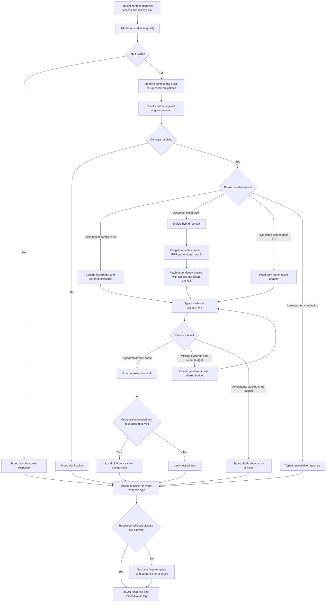
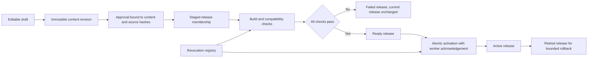

# Review Flow 63: จุดที่ยังตอบผิดได้ สิ่งที่ต้องเสริม และวิธีพิสูจน์ก่อนใช้งาน

วันที่ตรวจ: 2026-08-31

เอกสารที่ตรวจ: [63: RAG-First จากข้อมูลรูปแบบเดียว](63_rag_first_single_format_knowledge_flow_20260831.md)

ขอบเขต: ตรวจแบบออกแบบและความสอดคล้องกับโค้ดบางส่วน รวมถึงรายงานเก่า ไม่ได้แก้ Runtime, ไม่ได้ Publish ข้อมูล และไม่ได้รัน Benchmark 1,600/500 ข้อใหม่

เลขบรรทัดที่อ้างด้านล่างเป็นของไฟล์ 63 ณ วันตรวจ หากไฟล์นั้นเปลี่ยน ให้ยึดเลขหัวข้อและชื่อขั้นตอนประกอบ

## 1. ผล Review ที่สำคัญที่สุด

**แนวทางกรอกข้อมูลครั้งเดียวแล้วสร้าง Exact facts กับ RAG อัตโนมัติยังเหมาะกับเป้าหมาย แต่ Flow 63 ยังเป็น Architecture proposal ไม่ใช่ข้อกำหนดที่พร้อมนำทุกกล่องไปเขียนโค้ดได้ทันที**

ปัญหาหลักไม่ใช่การขาดชื่อเทคนิค แต่คือหลายขั้นเขียนว่า “ตรวจแล้วต้องถูก” โดยยังไม่ได้กำหนดให้ครบว่าตรวจด้วยข้อมูลใด ใครตัดสินเมื่อไม่แน่ใจ และผลแบบใดต้องหยุดตอบ

มี 20 ประเด็นที่ควรติดตามในรายงานนี้ แบ่งเป็น P1 จำนวน 12 ข้อ และ P2 จำนวน 8 ข้อ ระดับนี้ใช้จัดลำดับงานออกแบบ ไม่ใช่จำนวนช่องโหว่ที่พิสูจน์แล้วใน Production

- **P1:** ต้องปิดข้อกำหนดก่อนเปิดความสามารถที่เกี่ยวข้องให้ผู้ใช้จริง เพราะอาจตอบผิดข้อเท็จจริง หลุดสิทธิ์ หรือรอไม่สิ้นสุด
- **P2:** ต้องเสริมเพื่อให้ผลสม่ำเสมอ อัปเดตได้จริง และดูแลต่อได้ แต่บางข้อทำหลัง MVP ที่จำกัดขอบเขตได้
- **ข้อบกพร่องของแบบ:** ลำดับหรือความหมายที่ยังขัด/กำกวมในเอกสาร
- **ข้อกำหนดไม่ครบ:** มีแนวคิดแล้ว แต่ยังไม่มี Contract/Policy/กลไกที่พอให้ Implement ตรงกัน
- **ความเสี่ยงตามเงื่อนไข:** จะเกิดเมื่อเปิดความสามารถนั้น เช่นเอกสารหลายระดับสิทธิ์หรือ Transaction

### 1.1 รายการเรียงตามผลกระทบ

| ID | ระดับ | ประเด็น | ลักษณะ |
|---|---|---|---|
| R01 | P1 | งบเวลาและคิวโมเดลยังไม่มี Resource scheduler ที่บังคับได้ | ข้อกำหนดไม่ครบ; มีปัญหา Deadline ในรายงานเดิม |
| R02 | P1 | Contract ที่เข้าใจผิดอาจทำให้ทุกด่านตรวจผ่านแต่ตอบผิดเรื่อง | ข้อกำหนดไม่ครบ |
| R03 | P1 | Contract ตัวอย่างยังแบนเกินไปสำหรับหลาย Entity/เงื่อนไข | ข้อบกพร่องของแบบเมื่อขยายใช้ |
| R04 | P1 | ตรวจเลข/ชื่อ/Citation ID ไม่เท่ากับตรวจความหมายของคำตอบ | ข้อกำหนดการตรวจยังไม่ครบ |
| R05 | P1 | Flow ภาพมี Partial/Fallback ข้ามขั้น Validation ร่วม | ความกำกวมของลำดับ |
| R06 | P1 | Scope และช่วงเวลาระดับ Record ไม่พอสำหรับทุก Fact | ข้อกำหนดข้อมูลไม่ครบ |
| R07 | P1 | Catalog ไม่มีสัญญารับรองความครบที่เครื่องตรวจได้ | ข้อกำหนดข้อมูลไม่ครบ |
| R08 | P1 | Approval, Published และ Immutable version ยังปนกัน | ความกำกวมของ State machine |
| R09 | P1 | Source reference ยังไม่ผูกกับ Snapshot/ข้อความที่ตรวจจริง | ข้อกำหนด Provenance ไม่ครบ |
| R10 | P1 | Parent expansion ต้องตรวจสิทธิ์และ Dependency ซ้ำ | ความเสี่ยงตามเงื่อนไข |
| R11 | P1 | Legacy/Cache/Draft fallback อาจนำค่าที่ถอนแล้วกลับมาตอบ | ข้อกำหนด Fallback ไม่ครบ |
| R12 | P1 | Read-only FAQ กับ Transaction ยังอยู่แขนงเดียวในภาพ | ความเสี่ยงหากเปิด Action ตามภาพ |
| R13 | P2 | Conflict key ยังไม่กำหนด Cardinality/Scope overlap | ข้อกำหนดความหมายของ Fact ไม่ครบ |
| R14 | P2 | การแก้พร้อมกันและ Publish ซ้ำยังไม่มี Concurrency contract | ข้อกำหนด Admin ไม่ครบ |
| R15 | P2 | Cache identity และ Error caching ยังไม่ครบทุกชนิด | ข้อกำหนด Runtime ไม่ครบ |
| R16 | P2 | Candidate budget, RRF และ Rerank อาจตัดหลักฐานจำเป็น | ต้องสอบเทียบและเพิ่มกติกาเลือก Candidate |
| R17 | P2 | Rebuild/Reload อาจแย่งทรัพยากรหรือเก็บ Snapshot ค้าง | ข้อกำหนด Resource lifecycle ไม่ครบ |
| R18 | P2 | Parse/OCR ผิดแต่ Schema ผ่าน และ Source เปลี่ยนภายหลัง | ข้อกำหนด Ingestion/Review ไม่ครบ |
| R19 | P2 | Format เดียวไม่ได้ทำให้ Registry/Reader/Validator เข้าใจ Field ใหม่เอง | ข้อกำหนด Compatibility ไม่ครบ |
| R20 | P2 | Acceptance metrics ยังต้องแยกคำตอบผิด การไม่ตอบ และผลสด/เก่า | ข้อกำหนด Evaluation ไม่ครบ |

## 2. R01: เวลา 9 วินาทีต้องมีทั้ง Deadline และการจัดคิวทรัพยากร

**อ้างอิง:** Flow 63 ข้อ 9.2 บรรทัด 504-505; ข้อ 14.2 บรรทัด 785-806; ข้อ 15.1

**สิ่งที่มีแล้ว:** มีงบเวลา, Reserve, การข้าม Composer และคำเตือนว่า Timeout ไม่ได้หยุดงานจริง เป็นทิศทางที่ถูกต้อง

**ส่วนที่ยังไม่ครบ:** ขั้น Contract อาจเรียก Local LLM แต่ตารางให้ Contract+Resolve 0.5 วินาที ขณะเดียวกันยังมี Query embedding, Reranker, Composer และ Queue อยู่บนทรัพยากรที่อาจแชร์ GPU เดียวกัน ยังไม่มีตารางว่าแต่ละ Mode ใช้กี่ Call รวมทั้ง Model ที่ไม่ใช่ Generative LLM

**ตัวอย่าง:** สมมติมีคำถามอิสระ 30 ข้อ แต่ละข้อใช้โมเดล 2 วินาที และประมวลผลได้ทีละข้อ โดยไม่มี Batch/Cache/งานร่วม ข้อสุดท้ายจบที่ 60 วินาที ภายใน 10 วินาทีจบได้เพียง 5 ข้อ ตัวเลขนี้เป็นการคำนวณคิวสมมติ ไม่ใช่ผล Benchmark เครื่องผู้ใช้

ดังนั้น “แต่ละ Stage ไม่เกินเวลาที่ตั้ง” ยังไม่รับรองว่า “ทุก User ได้คำตอบครบภายใน 10 วินาที”

**ควรเสริม:**

1. กำหนด Execution modes ชัด เช่น Exact, RAG-extractive, RAG-compose และ Clarify ไม่ให้เปิดทุกโมเดลทุกคำถาม
2. มี Resource scheduler กลางสำหรับทรัพยากรที่แชร์จริง จองสิทธิ์ใช้ Embedding/Reranker/LLM และคุม Queue ก่อน Submit
3. กำหนดงบรวมต่อ Request: จำนวน Query embeddings, คู่ Rerank, จำนวน Generative calls, Output tokens, จำนวน Subtask และ Repair
4. ยืนยันงบด้วย Atomic reservation เพื่อไม่ให้หลาย Subtask ใช้งบก้อนเดียวเกินเพดาน
5. แยก `queue_timeout`, `execution_timeout`, `cancel_requested`, `cancel_confirmed` และ `worker_unhealthy`
6. งานที่ยกเลิกไม่ได้ต้องมีจำนวนค้างสูงสุดและกลไก Recovery ไม่สร้าง Worker ทดแทนไม่จำกัด
7. Deadline ใช้กับงานที่ต้องทำ แต่การยกเลิก Worker ที่กำลังทำหลาย Request ต้องไม่ทำให้ผู้ใช้อื่นเสียงานโดยไม่มี Policy

ใน [request_deadline.py](../app/pipeline/request_deadline.py) มี ContextVar, งบจำนวน LLM calls และการคำนวณเวลาคงเหลือแล้ว แต่ตัวนี้ไม่ใช่กลไกหยุดการคำนวณ ส่วน [engine.py](../app/pipeline/engine.py) มีการใช้ ThreadPool และ `shutdown(wait=False, cancel_futures=True)` ซึ่งไม่ยกเลิกงานที่เริ่มทำแล้วตาม [Python concurrent.futures](https://docs.python.org/3/library/concurrent.futures.html#concurrent.futures.Executor.shutdown)

**Acceptance:** จงใจให้ Model/Embedding ช้า ทดสอบ 30 Request ตรวจทั้งเวลาตอบกลับและจำนวนงานที่ยังรันหลัง Timeout ต้องไม่มีงานค้างสะสมอย่างไร้ขอบเขต และห้ามรายงาน Busy response เป็น FAQ ที่ตอบสำเร็จ

## 3. R02: Question Contract ต้องมีหลักฐานว่าตรงคำถามต้นฉบับ

**อ้างอิง:** ข้อ 9.2 บรรทัด 479-509; ข้อ 10.1; ข้อ 12.4

**สิ่งที่มีแล้ว:** Entity catalog, Intent signals, LLM ช่วยเสนอ Contract และการตรวจ JSON/ID

**ช่องโหว่ของตรรกะ:** ถ้า Contract หลงตั้งแต่ต้น ขั้น Retrieval และ Validator อาจเห็นตรงกันหมดเพราะใช้ Contract ผิดอันเดียวกัน

**ตัวอย่าง:** User ถาม “Minecraft มีให้เล่นที่ PSU ไหม” แต่ Contract กลายเป็น `how_to_play` ค้นเจอคู่มือจริง อ้างอิงจริง แล้วตอบวิธีเล่น การตรวจว่า Entity=Minecraft และ Source รองรับวิธีเล่นผ่านทั้งหมด แต่ User ไม่ได้ถามวิธีเล่น

**ควรเสริม:** ให้แต่ละ Obligation เก็บตำแหน่งข้อความต้นฉบับและเหตุผลที่แปลงเป็น Operation พร้อมความไม่แน่นอน แยก Contract validation ออกจาก Answer validation

```json
{
  "question": "Minecraft มีให้เล่นที่ PSU ไหม",
  "obligations": [
    {
      "obligation_id": "o1",
      "question_span": "มีให้เล่นที่ PSU ไหม",
      "entity_id": "game:minecraft",
      "operation": "lookup",
      "predicate": "service_availability",
      "resolution_status": "resolved",
      "origin": "explicit_question"
    }
  ]
}
```

ตัวอย่างเป็นข้อเสนอ ไม่ใช่ Schema ที่ทำงานอยู่แล้ว การมี `question_span` ช่วย Audit แต่ไม่พิสูจน์ความหมายเอง ต้องมีตัวอย่างทดสอบคำถามใกล้กัน เช่นมีเกมไหม/เล่นยังไง/อยู่โซนไหน และรักษาตัวเลข เวลา คำปฏิเสธกับเงื่อนไขของต้นฉบับ

ประวัติใช้ช่วย Resolve ได้ แต่ต้องระบุว่า Target ใดมาจาก Turn ไหน ห้ามเปลี่ยน Target ที่ User ระบุชัดรอบล่าสุด และต้องไม่เชื่อ History จาก Browser เป็นข้อเท็จจริงขององค์กร

**Acceptance:** คู่คำถามที่ Entity เหมือนกันแต่ Operation ต่างกันต้องได้ Contract ต่างกันตามที่ควร; ถ้าตีความไม่ได้จริงให้ Clarify โดยไม่เดาเป็นคำถามอีกเรื่อง

## 4. R03: หลายคำถามต้องผูก Entity, เงื่อนไข และ Dependency เป็นรายข้อ

**อ้างอิง:** ข้อ 9.2 ตัวอย่าง Contract บรรทัด 487-494; ข้อ 14.1 บรรทัด 783

**ปัญหา:** `entity_candidates` และ `required_facets` เป็นรายการระดับบนที่ยังไม่ระบุชัดว่า Facet ใดเป็นของ Entity ไหน ส่วน Operation `explain_and_lookup` เป็นชื่อรวมที่ยังไม่มี Execution semantics

**ตัวอย่าง:** “เกม A บน PS5 เล่นยังไง แล้วเกม B บน PC อยู่โซนไหน” หากแยกเป็น Entities=[A,B], Facets=[how_to_play,zone] แล้วให้ระบบจับคู่เอง มีโอกาสนำวิธีเล่น B มาตอบ A หรือถาม Zone ของ A เพิ่มทั้งที่ไม่จำเป็น

อีกตัวอย่าง: “ระหว่างโซนที่เล่นเกม A ได้ โซนไหนถูกที่สุดสำหรับนักศึกษา 2 ชั่วโมง” ต้องใช้ผลรายการโซนที่รองรับเกมก่อนคำนวณราคา แล้วจึงเปรียบเทียบ ไม่ใช่ค้นสองคำถามอิสระแล้วรวมข้อความ

**ควรเสริม:**

- `obligations[]` แต่ละข้อมี Entity, Predicate/Operation, Qualifiers, Required/Optional และ Output slot
- `depends_on[]` อ้าง Obligation ที่ต้องเสร็จก่อน
- Bound จำนวน Node, ความลึก และตรวจ Cycle ก่อน Execute
- เก็บสถานะต่อข้อ เช่น `supported`, `not_found`, `ambiguous`, `blocked`, `timed_out`
- Combine คำตอบตาม Obligation ID ไม่อาศัยลำดับที่งานเสร็จ
- Budget ของทุกข้อรวมกัน ไม่คูณเพิ่มตามจำนวนคำถามย่อย

**Acceptance:** สลับลำดับที่ Subtask เสร็จแล้วคำตอบยังผูก Entity ถูก; ถ้า Comparison ขาดหนึ่งตัว ห้ามประกาศผู้ชนะของการเปรียบเทียบทั้งหมด

## 5. R04: หลักฐานจริงก็ยังนำไปสร้างข้อสรุปผิดได้

**อ้างอิง:** ข้อ 10.1 บรรทัด 588-601; ข้อ 12.4 บรรทัด 730-742

**สิ่งที่มีแล้ว:** ไฟล์ 63 เตือนแล้วว่าเลข/ชื่อ/Citation ไม่รับรองความหมาย และเสนอ Quote/ข้อความที่คนตรวจสำหรับกฎเสี่ยง

**สิ่งที่ต้องทำให้บังคับใช้ได้:** คำว่า `supported_claims_only` ยังต้องมีวิธีสร้างรายการ Claim และตัดสินกรณีที่เครื่องตรวจไม่แน่ใจ ไม่ใช่ให้ Composer ตั้งค่า `true` เอง

**ตัวอย่าง:** หลักฐานบอก “ห้ามนำอาหารเข้า ยกเว้นพื้นที่ที่กำหนด” คำตอบ “นำอาหารเข้าได้ทุกพื้นที่” ใช้ Source ถูกและไม่มีตัวเลขใหม่ แต่กลับความหมาย

อีกกรณี หลักฐานบอกว่าเครื่อง A รองรับเกมหนึ่ง และโซน B มีราคาหนึ่ง การนำมาสรุปว่าเล่นเกมนั้นบนเครื่อง A ได้ในราคาของ B ยังต้องมี Relation ที่ยืนยันว่าเครื่อง A อยู่โซน B

**ควรเสริม:**

1. Exact output ใช้ Typed claims ที่อ่านจากฐานข้อมูลโดยตรง ไม่ให้ LLM เป็นผู้เลือกค่าตัดสินสุดท้าย
2. กฎ/ข้อยกเว้นที่เสี่ยงใช้ Approved answer units หรือ Extractive text ที่รักษาเงื่อนไขครบ
3. คำตอบอธิบายทั่วไปให้มี Claim -> Evidence mapping แล้วตรวจเป็น `supported`, `unsupported`, `uncertain`
4. `uncertain` ต้องไม่ถูกแปลงเป็นผ่านอัตโนมัติ ใช้คำตอบที่มีขอบเขตแคบลงหรือ Extractive fallback
5. ข้อสรุปจากหลายแหล่งต้องมี Join/Derivation ที่อนุญาต เช่น Relation ID หรือ Calculation trace

ไม่ควรเพิ่ม NLI/LLM judge ทุก Request ทันทีโดยไม่วัดประโยชน์ เพราะเพิ่มต้นทุนและยังผิดได้ โค้ด [claim_validator.py](../app/pipeline/claim_validator.py) เป็นจุดที่ต้องตรวจความสามารถจริงเมื่อ Implement ไม่ถือว่าชื่อ Validator หมายถึงตรวจความหมายครบแล้ว

**Acceptance:** ชุด Minimal pairs ต้องครอบคลุม “ได้/ไม่ได้”, “อย่างน้อย/ไม่เกิน”, “บางโซน/ทุกโซน”, “เฉพาะนักศึกษา/ทุกคน”, “มีข้อยกเว้น/ไม่มีข้อยกเว้น” และการ Join ข้ามแหล่งโดยไม่มี Relation

## 6. R05: Partial และ Fallback ต้องผ่าน Finalization ร่วมอย่างชัดเจน

**อ้างอิง:** ภาพข้อ 4.2 บรรทัด 175-189; ข้อ 12.2 และ 12.4

**จุดกำกวมในภาพ:** เส้น `Clarification, partial answer or no-answer -> Final veto` ข้าม `Claim validation and answer contract` ส่วน `Checked draft or safe response` ก็ไป Final veto โดยตรง ผู้อ่านอาจ Implement ว่า Partial/Fallback ไม่ต้องตรวจเต็ม

ข้อความในไฟล์บอกว่า Draft ต้องตรวจ แต่ยังไม่ได้กำหนดว่า Draft ที่ตรวจแล้วใช้ Evidence/Policy รุ่นไหน และเมื่อมีการแก้ข้อความต้องตรวจใหม่ตรงใด

**ตัวอย่าง:** Composer ถูกปฏิเสธเรื่องราคาหมดอายุ แล้วระบบหยิบ Draft เก่าที่เคยตรวจผ่านมาตอบโดยไม่ตรวจวันหมดอายุอีกครั้ง

**ควรเสริม:** ให้ Output ทุกชนิดเข้าฟังก์ชัน Finalize ร่วม โดยแยกชนิดผลลัพธ์:

| ชนิด | สิ่งที่ต้องตรวจ |
|---|---|
| `answer` / `partial` | Claims, Scope, Citation, Coverage, current authorization/revocation และรูปแบบ |
| `clarification` | ไม่สร้างข้อเท็จจริงใหม่ ไม่เปิดเผยข้อมูลต้องห้าม และถามตรงส่วนที่ขาด |
| `no_answer` | สาเหตุเหมาะสม ไม่อ้างว่าไม่มีบริการจากการค้นไม่พบ |
| `busy` / `timeout` | Template, Schema และไม่มี Debug/รายละเอียดระบบหลุด |
| `input_retype` | Template และไม่ทำข้อความที่ปฏิเสธให้กลายเป็น Context |

ทำ `validation_receipt` ฝั่ง Server ผูกกับ Hash ของ Answer/Evidence/Contract/Policy ไม่เชื่อ Flag ที่ LLM ส่งมา และตรวจสิทธิ์/การถอนล่าสุดก่อนส่ง แม้มี Receipt เดิม

**Acceptance:** บังคับ Composer fail, Retrieval timeout และ Partial แล้วตรวจว่า Finalizer ถูกเรียกทุกเส้น ไม่มีคำตอบสาระที่ออกโดยไม่มี Receipt ที่ตรงกัน

## 7. R06: Scope และเวลาต้องอธิบายได้ในระดับที่ Fact มีผลจริง

**อ้างอิง:** ข้อ 5.1 บรรทัด 210-218; ข้อ 5.2 บรรทัด 225-231; ตัวอย่าง `scope.branch` บรรทัด 266

**ปัญหา:** Scope ของ Record รวมทั้งสาขาและผู้ชม แต่ Fact มี Qualifiers อีกชั้น ส่วนเวลามีผลอยู่ระดับ Record เป็นหลัก ยังไม่ระบุการสืบทอด การ Override และกรณีที่ Record มีหลาย Fact ซึ่งมีผลคนละช่วง

**ตัวอย่าง:** คู่มือเกมใช้ได้ทั่วไป แต่ข้อมูลบริการใช้เฉพาะ PSU Phuket หาก Hard filter สาขาครอบ Record ทั้งก้อน อาจตัดคู่มือที่ตอบได้ หรือถ้ามองว่า Scope ทั้งก้อนคือบริการ อาจตีความว่าคู่มือยืนยันว่ามีเกมในสาขา

ราคาแต่ละกลุ่มลูกค้าอาจเปลี่ยนคนละวัน และประกาศวันหยุดอาจมีผลเฉพาะวันที่หนึ่ง การใช้ Record date เดียวกับทุก Fact ต้องกำหนดกติกาให้ชัด

**ควรเสริม:** แยกอย่างน้อย `access_scope` ว่าใครอ่านได้ ออกจาก `applicability` ว่าข้อเท็จจริงใช้กับใคร/ที่ไหน/เวลาไหน

```json
{
  "assertion_id": "demo-rate-student",
  "access_scope": "public",
  "applicability": {
    "branch_id": "psu_phuket",
    "customer_group": "psu_student",
    "platform": null
  },
  "validity": {
    "from": "2026-09-01T00:00:00+07:00",
    "until": "2026-10-01T00:00:00+07:00"
  },
  "time_precision": "instant"
}
```

ตัวอย่างนี้เป็นเฉพาะขอบเขตของ Assertion สมมติ ไม่ใช่ Fact ราคาจริง กติกา MVP อาจเลือก “Fact ภายใน Record ต้องใช้เวลาเดียวกัน ถ้าต่างให้แยก Record” แทนการเพิ่ม Field-level time ทุกจุดได้ แต่ต้องบังคับด้วย Validator

ค่าที่ไม่ระบุห้ามถือว่าใช้ได้ทุก Scope อัตโนมัติ เช่นไม่ทราบ Customer group ไม่เท่ากับราคาสำหรับทุกกลุ่ม ต้องแยก `unknown`, `all`, `not_applicable`

**Acceptance:** ทดสอบสาขาต่างกัน, เวลาเริ่ม/สิ้นสุดตรงขอบ, ราคาเปลี่ยนคนละกลุ่ม, กฎย้อนหลัง และคู่มือทั่วไปที่ยังใช้ได้แม้ไม่มีข้อมูลบริการสาขานั้น

## 8. R07: ต้องพิสูจน์ว่าชุดข้อมูลครบก่อนตอบ “ทั้งหมด”, “ไม่มี” หรือ “ถูกที่สุด”

**อ้างอิง:** ข้อ 11 บรรทัด 650-651; ข้อ 13.1 บรรทัด 763-767

**สิ่งที่ถูกต้องแล้ว:** ไม่ใช้จำนวน Top-K เป็นจำนวนทั้งหมด และไม่สรุปว่าบริการไม่มีจากการไม่พบเอกสาร

**ช่องว่าง:** ยังไม่มี Metadata ที่ให้ระบบตัดสินว่า Catalog ที่อ่านอยู่ครบจริง SQL `COUNT(*)` ให้จำนวนแถวที่มี ไม่รับรองว่าดึงจากระบบต้นทางครบทุกหน้า/ทุกโซนแล้ว

**ตัวอย่าง:** Sync ทรัพยากรมาได้เพียงหน้าแรก ระบบนับแถวครบใน SQLite แล้วตอบว่า “มีทั้งหมด 10 เครื่อง” ทั้งที่ระบบต้นทางมีมากกว่านั้น

**ควรเสริม:** เก็บ Completeness certificate เป็นผลจาก Ingestor/Adapter ไม่ใช่ช่องที่ LLM เดา:

```json
{
  "collection_id": "demo-service-catalog",
  "snapshot_id": "demo-snapshot-001",
  "scope": {"branch_id": "psu_phuket", "resource_type": "pc"},
  "sync_status": "complete",
  "pagination_complete": true,
  "expected_total": 12,
  "observed_unique_total": 12,
  "as_of": "2026-08-31T12:00:00+07:00",
  "absence_policy": "not_listed_is_not_offered"
}
```

ค่าทั้งหมดในตัวอย่างเป็นข้อมูลสมมติ หากต้นทางไม่รับรอง Total/ความครบ ให้ `sync_status=partial/unknown` และห้ามสร้าง Certificate complete เองจากการไม่มี Error

ต้องกำหนดหน่วยนับด้วย เช่นนับเกมตาม Title, Edition, Platform installation หรือ License seat คนละอย่างกัน ส่วน “ถูกที่สุด” ต้องรู้ครบทั้ง Candidate universe, Eligibility และราคาที่เปรียบเทียบได้ในช่วงเวลาเดียวกัน

**Acceptance:** จำลองหน้า API หาย, ID ซ้ำ, เกมเดียวหลายแพลตฟอร์ม และราคาขาดหนึ่งโซน ระบบต้องระบุขอบเขตว่า “จากข้อมูลที่ยืนยันได้” หรือไม่สรุปคำว่า “ทั้งหมด/ถูกที่สุด”

## 9. R08: แยกสถานะเนื้อหาออกจากสถานะการปล่อยใช้งาน

**อ้างอิง:** ข้อ 5.1 บรรทัด 216; ข้อ 7; ข้อ 9.3; ข้อ 16.1-16.2 บรรทัด 883 และ 896

**จุดกำกวม:** `status` มีทั้ง `approved` และ `published` แต่ Version ที่ Approved ถูกกำหนดให้ Immutable ขณะ Retrieval ใช้เงื่อนไข Published ถ้าเก็บสถานะทั้งหมดไว้ใน Payload เดียว การเปลี่ยนเป็น Published อาจเปลี่ยน Hash ที่อนุมัติแล้ว หรือถ้าไม่เปลี่ยน Staged rows อาจถูก Filter ทิ้งเพราะยัง Approved

นี่ไม่ใช่ข้อพิสูจน์ว่า Runtime ใหม่มี Bug แล้ว แต่เป็นจุดที่ผู้ Implement สองคนสามารถทำออกมาต่างกันได้

**ควรเสริม:**

- Content revision เป็น Immutable payload ที่มี `revision_id` และ `content_hash`
- Approval เป็น Event ที่อนุมัติ Hash/Schema/Source snapshot/Policy version ชุดนั้น
- Release membership ระบุว่า Revision ใดอยู่ใน Release
- Release state แยกเป็น `building`, `validated`, `ready`, `active`, `retired`, `failed`
- Runtime ตรวจว่า Revision ผ่าน Approval และเป็นสมาชิก Active snapshot โดยไม่แก้ Canonical payload เพื่อเปลี่ยนคำว่า Published
- การถอนสิทธิ์มี Revocation record ที่เข้มกว่าการกลับไป Release เก่า

**Acceptance:** Approval hash เดิมต้องตรวจได้เหมือนเดิมก่อนและหลัง Activate; Build ไม่เปิดเผย Draft; Rollback ไม่ฟื้นเอกสารที่ถูกถอน; Crash ระหว่างแต่ละขั้นกู้กลับสู่สถานะที่อธิบายได้

## 10. R09: Source ID กับ Locator อย่างเดียวยังไม่พอสำหรับการย้อนตรวจ

**อ้างอิง:** ข้อ 5.2 บรรทัด 231; ตัวอย่าง Source บรรทัด 307-315; ข้อ 16.1 บรรทัด 884

**สิ่งที่มีแล้ว:** มีแนวคิด Source snapshot และ Checksum ใน Storage architecture

**สิ่งที่ยังไม่ผูกกัน:** `source_refs` ใน Fact อ้างเพียง `source_id` กับ `locator` จึงยังไม่บังคับว่าค่าที่อนุมัติมาจาก Snapshot รุ่นใด Parser รุ่นใด และข้อความตรงส่วนใด

**ตัวอย่าง:** URL เดิมเปลี่ยนราคา หรือ PDF ถูกแทนไฟล์ใหม่ที่หน้า 2 เป็นคนละตาราง Citation ยังเปิดได้ แต่ข้อความที่เคยอนุมัติไม่ได้อยู่ตรงนั้นอีกแล้ว

**ควรเสริม:** Source reference ผูกกับ `source_snapshot_id`, Content hash, Locator ที่ตรวจได้ เช่นหน้า/ตาราง/Paragraph/Character span และ `extraction_version` พร้อมข้อความต้นทางที่มีสิทธิ์เก็บ ค่า Offset ต้องอ้างกับ Text snapshot ที่ระบุ ไม่ใช่หน้าเว็บสดที่เปลี่ยนแล้ว

ข้อมูลที่เป็น Approved paraphrase ควรแยก Original source span ออกจากข้อความที่คนเรียบเรียง และบันทึกผู้อนุมัติการแปลง การมี Source จริงไม่แปลว่า Extractor อ่านค่าถูก

**Acceptance:** เปลี่ยนไฟล์ที่ URL เดิมแล้วคำตอบเก่ายัง Audit กับ Snapshot เดิมได้; Source หาย/เปลี่ยนต้องเกิด Review event ไม่อ้างข้อมูลสดผิดรุ่นเงียบ ๆ; ผู้ใช้ไม่มีสิทธิ์ต้องเปิด Source snapshot ภายในไม่ได้

## 11. R10: หลังขยาย Parent ต้องตรวจสิทธิ์และความครบของ Dependency อีกครั้ง

**อ้างอิง:** ภาพ Runtime บรรทัด 172; ข้อ 5.3 บรรทัด 247; ข้อ 8.3 บรรทัด 465-469

**ความเสี่ยงตามเงื่อนไข:** ถ้าระบบมีเอกสารหลายระดับสิทธิ์ Candidate ที่เป็น Public อาจตาม Parent หรือ Exception ที่เป็น Internal การกรองตอนค้นอย่างเดียวไม่พอ

**ตัวอย่าง:** FAQ Public อ้างคู่มือภายในที่มีข้อมูลบุคคล แล้ว Parent expansion ส่งทั้ง Section เข้า Composer หรือกฎหนึ่งตาม Dependency อีกหลายสิบ Section จน Context และเวลาล้น

**ควรเสริม:**

1. ตรวจสิทธิ์/เวลา/Approval/Revocation กับทุกชิ้นที่ Fetch เพิ่ม ก่อนเข้า Prompt และ Citation
2. กำหนดชนิด Dependency เช่น `required_exception`, `definition`, `optional_background`
3. Dependency สำคัญขาดหรือไม่มีสิทธิ์ ห้ามสรุปกฎโดยตัดเงื่อนไขนั้นออก
4. จำกัด Depth, จำนวนชิ้น, Token และ visited set เพื่อไม่ Fetch ซ้ำ
5. Cycle ของบริบททั่วไปอาจจัดการด้วย Dedup; Cycle ของกฎที่ต้องอนุมานตามกันให้ Reject หรือส่งตรวจ ห้ามปล่อยให้ตีความวนเอง
6. กำหนด Reference เป็น Record/version/section ที่ชัด หากข้าม Record ไม่ใช้ Section ID สั้น ๆ ที่ชนกันได้

แนวคิดตรวจสิทธิ์ตลอด Retrieval pipeline สอดคล้องกับ [OWASP RAG Security](https://cheatsheetseries.owasp.org/cheatsheets/RAG_Security_Cheat_Sheet.html) แต่ต้องทำใน Server ไม่อาศัย Prompt ให้โมเดลรักษาสิทธิ์เอง

**Acceptance:** Seed เอกสาร Public ที่อ้าง Internal แล้ว User Public ต้องไม่ได้ข้อความหรือ Citation ที่เปิดเผยส่วน Internal; Dependency ข้อยกเว้นหายต้องไม่ตอบกฎแบบตัดทอน

## 12. R11: Fallback เดิมต้องไม่เอาข้อเท็จจริงเก่ากลับมาใช้หลังถอดออก

**อ้างอิง:** ข้อ 11 บรรทัด 658; ข้อ 14.1; ข้อ 16.2 บรรทัด 912

**สิ่งที่มีแล้ว:** แผนระบุว่า Source/Scope/Version ต้องเป็นผู้ตัดสิน และ Rollback ต้องไม่กู้สิ่งที่ถอนสิทธิ์กลับมา

**ส่วนที่ยังไม่ครบ:** ต้องบังคับกับ Legacy handlers, Answer cache และ Draft ทุกตัวด้วย ไม่ใช่เฉพาะ Release ใหม่

**ตัวอย่าง:** ราคาเดิม 50 ถูกแก้เป็น 70 ใน Canonical รุ่นใหม่ RAG timeout แล้วไปตอบ Handler เก่าที่ฝังค่า 50 แม้ Release ปัจจุบันถูกต้องทั้งหมด

**ควรเสริม:** ให้ทุก Fallback คืน Evidence IDs/Version และต้องผ่าน Active authority resolver เดียวกัน Legacy ที่ยังระบุไม่ได้ว่าค่ามาจาก Revision ใดให้จำกัดใช้เฉพาะข้อความ Safe template หรือปิดเฉพาะ Fact ที่เปลี่ยนแล้ว

ทำ Migration ownership map ว่า Predicate ใดถูกย้ายมาข้อมูลกลางแล้ว ห้ามมีสองแหล่งที่แก้เองได้โดยอิสระ แหล่ง Legacy อาจเป็นทางอ่านสำรอง แต่ไม่ใช่ Source of Truth สำรองที่ข้าม Policy ปัจจุบัน

**Acceptance:** เปลี่ยนราคา/ถอนกฎแล้วบังคับ RAG และ Composer ให้ Fail ทุกแบบ คำตอบเก่าต้องไม่กลับมาผ่าน Cache, Draft, Legacy หรือ Rollback

## 13. R12: ห้ามให้คำถามเชิงนโยบายกลายเป็น Transaction โดยผล Intent

**อ้างอิง:** ภาพข้อ 4.2 บรรทัด 169; ข้อ 1.2; ข้อ 11

**ขอบเขตที่กำหนดแล้วในงานก่อน:** FAQ เป็นหลัก ส่วน Booking เป็น State machine แยกใน [Flow 49](49_chatbot_booking_payment_verification_flow_20260825.md)

**จุดเสี่ยงใน Flow 63:** ภาพรวมใส่ `Live status or transaction` ไป Authoritative API ในแขนงเดียว ทำให้ผู้นำไปใช้ต่ออาจเข้าใจว่า Intent เลือก Transaction แล้วเรียก API ได้ทันที

**ตัวอย่าง:** “ยกเลิกการจองได้ไหม” เป็นคำถามนโยบาย ไม่ใช่คำสั่งให้ยกเลิกรายการจริง

**ควรเสริม:** MVP นี้เปิดเฉพาะ `read` operations ที่อยู่ใน Allowlist และปิด Mutation ไว้ทั้งหมด สำหรับงานจองในอนาคตต้องผ่าน Authentication, ownership, preconditions, explicit confirmation, idempotency และ State machine ตาม Flow 49 ก่อน

LLM/เอกสารที่ค้นเจอไม่มีสิทธิ์เพิ่ม Tool permission และ Source/Field metadata ต้องไม่กลายเป็นชื่อฟังก์ชันหรือ SQL ที่ Execute โดยตรง

**Acceptance:** คำถาม “จองยังไง/ยกเลิกได้ไหม/จ่ายอย่างไร” ต้องไม่มี Write API ถูกเรียก; ต่อให้เอกสารสั่งเรียก Tool ก็ต้องไม่เพิ่มสิทธิ์

## 14. R13: Conflict ต้องรู้ชนิดความสัมพันธ์ ไม่ใช่แค่เปรียบเทียบค่าต่างกัน

**อ้างอิง:** ข้อ 6.1 บรรทัด 382; ข้อ 10.4 บรรทัด 629-639

**สิ่งที่มีแล้ว:** Fact key, Qualifiers, ช่วงเวลาซ้อน และ Source authority

**ส่วนที่ยังต้องกำหนด:** Predicate ใดมีได้ค่าเดียวหรือหลายค่า ค่าใดใช้แทนกันได้ และ Scope กว้าง/แคบซ้อนกันอย่างไร

**ตัวอย่าง:** เกมมีทั้งแนว Action และ Adventure ไม่จำเป็นต้องเป็นข้อมูลขัดกัน ส่วนราคา 50 ต่อชั่วโมงกับ 100 ต่อสองชั่วโมงอาจเทียบเท่าหรืออาจต่างเพราะวิธีปัดเวลา หากมีข้อมูล “ทุกวัน” กับ “ยกเว้นวันหยุด” การเทียบ Qualifiers แบบ String equality จะไม่เห็นการทับซ้อน

**ควรเสริม:** Registry กำหนด `cardinality`, `value_comparison`, `unit`, `scope_relation`, `override_policy` และ `null_semantics` แยกจากการมี Field ชื่อเดียวกัน

กฎ Specificity ไม่ควรตัดสินอัตโนมัติว่า “แคบกว่าชนะ” ทุกกรณี ต้องมี Authority ที่อนุญาตให้ Override และบันทึกเหตุผลของการเลือก

กฎข้อความที่เครื่องยังเปรียบเทียบความหมายไม่ได้ให้ส่ง Review ไม่ใช้ความคล้ายของ Embedding เป็นตัวพิสูจน์ว่าไม่มี Conflict

**Acceptance:** ทดสอบ Set-valued fact, ค่าหน่วยต่างกัน, Duplicate source, กฎทั่วไปกับข้อยกเว้น, Fact Unknown กับ Fact ที่ยืนยันแล้ว และ Source ที่ใหม่กว่าแต่ไม่มีอำนาจเปลี่ยนกฎ

## 15. R14: Admin สองคนแก้พร้อมกันอาจทับงานกันแม้มี Version history

**อ้างอิง:** ข้อ 7 บรรทัด 411-415; ข้อ 16.1-16.2 บรรทัด 892-908

**สิ่งที่มีแล้ว:** เก็บ Version และจัดคิว Publish ไม่ให้ชน

**ช่องว่าง:** Version history ช่วยดูย้อนหลัง แต่ไม่ได้กัน Lost update ด้วยตัวมันเอง ยังไม่มี `expected_revision`, idempotency key และ Compare-and-swap สำหรับเปลี่ยน Active release

**ตัวอย่าง:** Editor A และ B เปิด Revision 3; A แก้ราคาและ Save Revision 4; B แก้ข้อความจากหน้าเดิมแล้ว Save ทับข้อมูลราคากลับไปค่าใน Revision 3

**ควรเสริม:**

- Save ส่ง `expected_revision`; ถ้าเปลี่ยนไปแล้วให้ Conflict 409 และแสดง Diff
- Approval ผูกกับ Hash ของ Revision ที่ผู้ตรวจเห็นจริง
- Publish request มี Idempotency key และห้ามใช้ Key เดิมกับ Payload คนละชุด
- เปิด Release ด้วย Compare-and-swap ว่า Active ยังเป็นรุ่นที่ Build คาดไว้
- งาน Retry ต้องตรวจว่าขั้นก่อนหน้าทำสำเร็จแล้วหรือยัง ไม่สร้าง Release/Approval ซ้ำ

SQLite รองรับหลาย Read transactions แต่มี Write transaction พร้อมกันได้หนึ่งชุด จึงควรทำ Transaction เขียนให้สั้น ไม่ถือ Write lock ระหว่างรอ LLM/Embedding อ้างอิง [SQLite Transactions](https://www.sqlite.org/lang_transaction.html#read_transactions_versus_write_transactions)

**Acceptance:** ส่ง Save/Approve/Publish ซ้ำและพร้อมกัน ผลต้องไม่ทับสิ่งที่คนอนุมัติ ไม่สร้างข้อมูลซ้ำ และ Recover หลัง Process crash ได้

## 16. R15: Cache ต้องแยก “ไม่มีข้อมูล” ออกจาก “ระบบค้นหามีปัญหา”

**อ้างอิง:** ข้อ 16.3 บรรทัด 917-934

**สิ่งที่มีแล้ว:** Release ID, Model/Config บางส่วน, Query, Context, Scope และเวลาหมดอายุ

**ช่องว่าง:** ตัวอย่าง Answer cache key ยังไม่ระบุว่าครอบ Model digest, Retrieval config, Formatter, Source policy และผล Resolve วัน/เวลาครบอย่างไร อีกทั้งยังไม่มีนโยบาย Negative cache

**ตัวอย่าง:** ครั้งแรก Embedding timeout จึงตอบว่าตรวจข้อมูลไม่ได้ ถ้านำไป Cache เหมือนคำตอบว่าไม่พบความรู้ หลังโมเดลกลับมาปกติผู้ใช้ยังได้ No-answer จาก Cache ต่อ

**ควรเสริม:**

1. ใช้ `pipeline_config_hash` ที่ครอบ Configuration ซึ่งมีผลต่อคำตอบ และเก็บรายละเอียด Hash constituents เพื่อ Audit
2. แยก `not_found`, `insufficient_evidence`, `access_denied`, `dependency_unavailable`, `timeout` ในผลภายใน
3. ไม่ Cache Timeout/Dependency failure เป็น No-data response ระยะยาว
4. Cache hit ต้องตรวจสิทธิ์และการถอนล่าสุดอีกครั้ง; Policy epoch สำหรับการถอนเร่งด่วนต้องมีผลแม้ Release ยังไม่เปลี่ยน
5. User/session-specific answers ต้องแยก Namespace และไม่ใช้ Cache ร่วมเพียงเพราะเป็น `audience=public` เหมือนกัน
6. ข้อมูลลับใน Query/History ต้องไม่แสดงเป็น Plaintext cache key ใน Log และการ Hash ไม่ใช่การทำให้ข้อมูลไม่เป็นส่วนบุคคลโดยอัตโนมัติ

**Acceptance:** Cache คำถามเดียวกันต่าง User/Scope/วัน/Model config ต้องไม่ข้ามเงื่อนไข; หลังโมเดลกลับมาหรือข้อมูลถูกถอนต้องไม่ใช้ผลผิดชนิดต่อ

## 17. R16: RRF และ Reranker ยังช่วยไม่ได้ถ้าหลักฐานถูกตัดก่อนถึงมัน

**อ้างอิง:** ข้อ 9.4-9.7 บรรทัด 544-578

**สิ่งที่มีแล้ว:** หลายช่องทางค้น, RRF, Dedup, สงวน Candidate ตาม Facet และ Optional rerank

**ช่องว่าง:** ยังต้องนิยาม Candidate allocation ที่ลงมือได้จริง เพราะเสนอ 12-20 Candidates แต่ Rerank รวมไม่เกิน 8 คู่ และเมื่อมีหลาย Obligation จำนวนหลักฐานที่ต้องรักษาอาจเกินงบ

**ตัวอย่าง:** เอกสารวิธีเล่น 15 Chunk ของเกม A ติดอันดับสูงหมด ส่วนกฎที่ถามอีกข้ออยู่ลำดับ 16 ถ้าตัด 8 ชิ้นแรกก่อนแบ่งตาม Obligation โมเดล Reranker ที่แม่นแค่ไหนก็ไม่เห็นกฎนั้น

**ควรเสริม:** Candidate pool เก็บ `obligation_id`, `parent_id`, `evidence_role` แยก แล้วจัด Quota ของประเด็นบังคับก่อนเติม Background จำกัดจำนวนชิ้นซ้ำจาก Parent เดียวเท่าที่ไม่ทำให้ข้อยกเว้นหาย

อย่าใช้ Rerank threshold ชุดเดียวกับโหมดที่ข้าม Rerank คะแนนสองแบบไม่ได้มีความหมายเท่ากัน ควรสอบเทียบ Acceptance แยกตาม Mode และยังใช้ Hard evidence conditions ร่วมกัน

ถ้าทรัพยากรทำได้เพียงสองโมเดลตามแผนเดิม ให้พิสูจน์ Hybrid + Metadata + Extractive ก่อนเพิ่มโมเดลที่สาม ไม่เรียก BGE Dense retrieval ว่า Cross-encoder rerank

**Acceptance:** ฝังหลักฐานจำเป็นให้มีคะแนนต่ำกว่า Background แต่ยังอยู่ใน Candidate pool แล้วตรวจว่ากติกาเลือก Evidence รักษามันได้; บันทึก Recall ก่อน/หลังการตัด Pool และก่อน/หลัง Rerank แยกกัน

## 18. R17: ระหว่าง Publish อาจใช้ RAM/VRAM มากกว่าตอนตอบปกติ

**อ้างอิง:** ข้อ 15.4; ข้อ 16.2 บรรทัด 896-908

**สิ่งที่มีแล้ว:** เตือนเรื่อง RAM/VRAM, Index JSON overhead, Incremental embedding และ Worker snapshot

**ช่องว่าง:** ยังไม่มีเพดานจำนวน Staged/Active/Retired releases ที่อยู่ในหน่วยความจำพร้อมกัน รวมทั้งอายุงาน Ingestion และการเก็บ Model หลายตัว

**ตัวอย่าง:** Worker ถือ Index เก่าสำหรับ Request ค้าง ขณะโหลด Index ใหม่และสร้าง Staging release อีกรุ่น พร้อม LLM/Reranker/Embedding ที่ Warm ทั้งหมด RAM อาจขึ้นหลายเท่าจากขนาด Index เดียว

**ควรเสริม:**

- Build queue แยกและจำกัดความสำคัญต่ำกว่างานตอบ User ตาม Load
- ใช้ Batch limit, งานนำเข้า Resume ได้ และหยุด/พักเมื่อทรัพยากรไม่พอ
- Memory budget ครอบทั้งสอง Index ตอนสลับ รุ่นเก่าที่ Pin อยู่ และ Model/KV/Buffer
- Reference counting/retention ของ Release; เก็บ Rollback บน Disk ไม่จำเป็นต้องโหลดทั้งหมดใน RAM
- Disk quota และนโยบายล้าง Staging ที่ล้มเหลว พร้อมตรวจว่ารุ่นที่จะลบไม่มี Request ใช้อยู่
- ถ้ารุ่นใหม่ใหญ่จนสลับไม่ได้ ให้ Publish fail โดยรุ่นเดิมยังตอบได้ ไม่พยายามโหลดซ้ำไม่สิ้นสุด

**Acceptance:** ทำ Publish พร้อม Load test, เกิด Crash ระหว่าง Build, Rollback หลายครั้ง และมี Request ค้าง แล้ววัด Peak memory, Disk growth และความสามารถตอบของรุ่นเดิม

## 19. R18: Format ถูกไม่ได้แปลว่าอ่านต้นฉบับถูก

**อ้างอิง:** ข้อ 7 บรรทัด 407-410; ข้อ 8.2; ข้อ 16.4

**ตัวอย่างปัญหา:** OCR อ่าน 80 เป็น 30, ตารางสลับราคานักศึกษากับบุคคลภายนอก, หัวคอลัมน์หาย, คำว่า “ไม่” ถูกตัด หรือวันที่ไทยถูกแปลงปีผิด ทุกกรณีอาจผ่าน Schema เพราะยังเป็นตัวเลข/ข้อความที่ถูกชนิด

**ควรเสริม:** แยก Quality checks ของการสกัดข้อมูลออกจาก Schema validation เช่นจำนวนหน้า/ตารางครบ, หัวตารางติดกับแถว, Quoted span มีจริง, Parser/OCR version และค่าที่ต้องให้คนยืนยัน

ช่องสำคัญ เช่นราคา กฎ วันหยุด ต้องมี Preview ต้นฉบับเทียบ Field ไม่ใช้ Extractor confidence เพียงตัวเดียว ส่วน LLM ไม่มีสิทธิ์เติมช่องว่างจากความรู้ทั่วไป

Source ที่เคยอนุมัติอาจเปลี่ยนภายหลัง จึงต้องมีเจ้าของข้อมูล, Review due policy และคิวจัดการเมื่อพบ Source drift การเปลี่ยนต้นทางไม่ควร Auto-publish ค่าที่สกัดใหม่โดยข้าม Approval

ในการใช้ JSON Schema ต้องเลือก Validator และเปิด Format checking ตามที่ต้องการจริง บาง Library ไม่ตรวจ `format` ให้โดยค่าเริ่มต้น และต้องตรวจ Date/time semantics เพิ่ม เช่นวันสิ้นสุดหลังวันเริ่ม ดู [python-jsonschema: Format validation](https://python-jsonschema.readthedocs.io/en/stable/validate/#validating-formats) และ [JSON Schema 2020-12](https://json-schema.org/draft/2020-12/json-schema-validation)

**Acceptance:** PDF ภาพสแกน, PDF หลายคอลัมน์, ตารางข้ามหน้า, วันที่ พ.ศ., ข้อความอังกฤษ/ไทยผสม และ Source เปลี่ยนแต่ URL เดิม ต้องมี Warning/Review ที่ตรงเรื่อง ไม่ Publish แค่เพราะ Parse JSON ได้

## 20. R19: Format เดียวต้องมี Capability compatibility ที่ตรวจได้

**อ้างอิง:** ข้อ 1.2; ข้อ 6; ข้อ 17.1-17.2

**สิ่งที่ถูกต้องแล้ว:** แผนไม่ได้รับรองว่า Operation ใหม่ทั้งหมดทำงานได้โดยไม่แก้โค้ด และแยกการเพิ่มรายการออกจากสูตร/API ใหม่

**ช่องว่าง:** ยังไม่มี Contract ว่า Registry รุ่นใหม่ต้องเข้ากับ Reader, Index, Composer และ Validator รุ่นใด Unknown field จะถูก Reject, Ignore หรืออ่านได้เฉพาะคำอธิบาย

**ตัวอย่าง:** Admin เพิ่ม `minimum_age` ใน Registry สำเร็จ แต่ Validator ไม่รู้หน่วยหรือเงื่อนไขอายุ จึงปฏิเสธทุกคำตอบ หรือแย่กว่านั้นคือข้ามการตรวจเพราะไม่รู้จัก Field

**ควรเสริม:** Manifest ระบุ `schema_version`, `registry_version`, `reader_version`, `validator_version` และ Capability matrix โดย Release ต้องผ่าน Compatibility check ก่อน Activate

อนุญาตให้ข้อมูลประเภทเดิมเพิ่ม Record ได้ทันทีหลัง Approval ส่วน Predicate/Operation ใหม่ต้องผ่าน Registry change review และ Test pack ประจำ Field ไม่ได้หมายถึงต้องทำ Route รายเกมใหม่

กำหนด Field fallback เช่นอ่านเป็นข้อความที่อ้างอิงได้แต่ห้าม Calculate/Filter จนมี Definition ครบ ต้องไม่มี Silent ignore สำหรับ Field ที่ใช้กำหนดความหมายสำคัญ

**Acceptance:** เพิ่มเกมใหม่ด้วย Field เดิมโดยไม่แก้โค้ดต้องตอบได้; เพิ่ม Field ใหม่ที่ยังไม่มี Validator ต้องถูกบล็อกก่อน Publish หรือถูกจำกัดความสามารถตาม Policy ที่ชัด ไม่ Fail เงียบตอน User ถาม

## 21. R20: ต้องวัดว่าตอบได้มากขึ้นพร้อมถูกขึ้น ไม่ใช่ผ่านมากขึ้นเพราะปฏิเสธทุกข้อ

**อ้างอิง:** ข้อ 18 บรรทัด 1005-1076

**สิ่งที่มีแล้ว:** แยก Input/Retrieval/Answer/Product metrics, New-content holdout, การป้องกัน Gold leakage และระบุว่าชุด 500 เดิมไม่ใช่ Blind holdout

**สิ่งที่ต้องปิดรายละเอียด:** นิยามคะแนน Partial, No-answer, Timeout และ Route change ให้เป็นสูตรเดียวกันก่อนรัน พร้อม Freeze คลังข้อมูลและรุ่นระบบให้เทียบกันได้

ตัวอย่างการสับสน: เพิ่มเกมใหม่แล้วคำตอบจำนวนเกมต้องเปลี่ยน แต่ Gold เดิมยึดจำนวนเดิม หากใช้คนละ Corpus snapshot จะตัดว่าผิดทั้งที่คำตอบใหม่ถูก หรือแก้ Gold ตามคำตอบโมเดลจนคะแนนดูดีขึ้น

**ควรเสริม:**

| Metric | นิยามที่ควรล็อก |
|---|---|
| End-to-end success | ตอบสิ่งที่ถามถูกตามสถานะที่ Gold อนุญาตและจบในงบ |
| Factual error rate | จำนวนข้อที่กล่าวข้อเท็จจริงผิด / ข้อที่มีคำตอบสาระ |
| Answerable coverage | คำถามที่มีหลักฐานพอตอบแล้วระบบตอบได้ / คำถามที่มีหลักฐานพอตอบ |
| Appropriate abstention | คำถามที่ควรงดตอบแล้วงดจริง / คำถามที่ควรงดตอบ |
| Partial correctness | ส่วนที่ตอบต้องถูก และระบุส่วนขาดตรงกับ Obligation |
| Availability | Request ที่ได้ Response ตาม Protocol แยกจากตอบ FAQ สำเร็จ |
| Deadline compliance | เวลาตั้งแต่รับ/ส่งข้อความจนคำตอบครบ โดยแยก Server กับ User-visible |
| Citation support | Evidence สนับสนุน Claim จริง ไม่ใช่เพียงมี Link |

Report ต้องมี `code/config version`, `release_id`, Ground truth version, Model digest, Model actual-use, Warm/Cold และ Load condition พร้อมแยก Intent/Facet/Entity ที่ผิด

เพิ่ม Metamorphic tests: ถามคำถามเดิมหลายสำนวน, สลับลำดับคำถามย่อย, เพิ่มเอกสารที่ไม่เกี่ยวข้อง, เพิ่มเอกสารซ้ำ, ย้ายหลักฐานสำคัญไปต้น/กลาง/ท้าย และเปลี่ยนข้อมูลหนึ่ง Field แล้วตรวจว่าเฉพาะคำตอบที่เกี่ยวข้องเปลี่ยน

การทดสอบตำแหน่งหลักฐานมีเหตุผลจากงาน [Lost in the Middle](https://arxiv.org/abs/2307.03172) แต่ผลของงานนั้นไม่ใช่ค่าความแม่นยำของ Typhoon ในโปรเจกต์นี้ ต้องวัดเอง

แม้ชุดทดสอบผ่านหมดก็ยังไม่พิสูจน์ว่าไม่ผิดจริง เช่นถ้าสมมติว่าเป็นตัวอย่างอิสระและเป็นตัวแทนของงานจริง การไม่พบข้อผิดใน 300 ตัวอย่างให้ขอบบนด้านเดียว 95% ของ Error rate ประมาณ 0.994% จาก `1 - 0.05^(1/300)`; ถ้าเพียง 50 ตัวอย่างจะประมาณ 5.816% ตัวเลขนี้เป็นตัวอย่างทางสถิติ ไม่ใช่ผลวัดระบบ และสมมติฐานอิสระมักไม่จริงทั้งหมดเมื่อหลายคำถามมาจากเอกสารเดียวกัน

**Acceptance:** รันโดยล็อก Snapshot, แสดงข้อผิดทุกข้อ, แยก Partial/Timeout, และไม่เปิดดู Holdout เพื่อจูนซ้ำแล้วนำคะแนนเดิมมารับรองว่าเป็นผลใหม่ที่เป็นอิสระ

## 22. Flow ที่ควรแก้ในภาพให้ตรงกับข้อกำหนด

ภาพนี้เป็นข้อเสนอหลัง Review ไม่ใช่ภาพยืนยัน Runtime ปัจจุบัน



ข้อกำหนดประกอบภาพ:

- `Evidence result` ต้องมี Enum และ Reason code ไม่ใช้ Boolean อย่างเดียว
- Repair สูงสุดหนึ่งครั้งตามแผนเดิม และ Share งบกับทุก Subtask; ถ้า Repair ได้ข้อมูลเพิ่ม ต้องผ่าน Eligibility/Provenance/Dependency checks เดิมก่อนประเมินอีกครั้ง
- Partial อนุญาตเมื่อคำตอบส่วนที่ยืนยันได้มีความหมายในตัว ไม่ใช้ Partial เพื่อประกาศผล Comparison ที่ยังขาดตัวเปรียบเทียบ
- Shared finalizer ตรวจแตกต่างตาม Response type แต่ไม่มีเส้นทางข้ามทั้งหมด
- No-claim fixed template มีจำนวนจำกัดและไม่ใส่ข้อเท็จจริงจาก LLM/Source ที่ยังไม่ผ่าน จึงจบได้โดยไม่เรียกโมเดลตรวจซ้ำ
- API mutation ปิดใน MVP นี้ การจองให้ใช้ Flow 49 แยก

### 22.1 State ที่ควรแยกในฝั่งเพิ่มข้อมูล



Revocation ต้องถูกตรวจระหว่าง Request และก่อนส่งคำตอบด้วย ไม่ใช่ตรวจเฉพาะตอน Build/Activate ในภาพ และการ Retire release ไม่ลบประวัติ Approval ของ Content revision

## 23. Format ควรเสริมตรงไหน โดยไม่ทำให้เจ้าของกรอกเยอะขึ้น

ไม่ควรให้เจ้าของกรอก Field ทางเทคนิคทั้งหมดที่ Review เสนอ ให้ UI รับข้อมูลธุรกิจ ส่วน Server สร้าง ID/Hash/Version/Locator/Status ให้

| เจ้าของกรอกหรือยืนยัน | ระบบสร้าง/ตรวจอัตโนมัติ |
|---|---|
| ชื่อเกม/ชื่อกฎ/หัวข้อ | Record ID, Revision ID |
| คำอธิบายและค่าที่มีจริง | Typed assertions และการตรวจชนิด |
| สาขา กลุ่มลูกค้า แพลตฟอร์มที่ใช้ | Scope normalization และการเชื่อม Entity |
| วันที่เริ่มมีผลและวันสิ้นสุดถ้ามี | ช่วงเวลาแบบมี Timezone และ Effective selector |
| URL/PDF/ต้นทางที่เชื่อถือ | Source snapshot/hash/extraction version |
| ยืนยันว่าช่องที่สกัดมาตรงต้นฉบับ | Approval event ที่ผูก Hash |
| ตรวจ Preview คำตอบและสิ่งที่ยังตอบไม่ได้ | Retrieval probes, Evidence coverage และ Release manifest |

เสริมหน้า Admin เป็นสามมุมมอง: “ข้อมูลที่กรอก”, “หลักฐานจากต้นฉบับ”, “คำถามที่ระบบตอบได้/ยังตอบไม่ได้” จะทำให้เจ้าของเห็นว่าการเพิ่มวิธีเล่นไม่ได้เติมข้อมูลโซนหรือราคาให้เอง

### 23.1 Output status ที่ควรมีใน API

```json
{
  "request_id": "demo-request-001",
  "response_type": "partial",
  "answer": "ตามคู่มือตัวอย่าง ให้เริ่มจากเลือกโหมด สร้างโลก และเรียนรู้การใช้ทรัพยากรพื้นฐาน [S1] ส่วนการมีเกมให้เล่นที่ PSU ยังไม่มีข้อมูลยืนยันครับ",
  "obligation_results": [
    {"obligation_id": "o1", "status": "supported", "evidence_ids": ["demo-evidence-001"]},
    {"obligation_id": "o2", "status": "not_found", "evidence_ids": []}
  ],
  "release_id": "demo-release-001",
  "sources": [{"source_id": "demo-source-001", "citation_label": "S1", "title": "คู่มือตัวอย่างสมมติ", "url": null}]
}
```

ตัวอย่างสมมติให้คู่มือรองรับส่วนวิธีเล่น แต่ไม่มีหลักฐานส่วนการให้บริการ จึงตอบเฉพาะส่วนแรกและบอกส่วนที่ยังยืนยันไม่ได้ ไม่ใช่คำตอบจริงของบริการ `obligation_results` ที่ละเอียดและการเชื่อม Evidence กับ Source อาจเก็บเฉพาะ Server และส่ง Public subset ที่ไม่เผยรายละเอียดระบบ ส่วน Public API ต้องไม่ส่งข้อความ Debug หรือเหตุผลเรื่อง ACL ที่เปิดเผยว่ามีเอกสารลับใดอยู่

## 24. สิ่งที่ดีอยู่แล้วและไม่ควรเปลี่ยนทิศ

| แนวทางเดิม | เหตุผลที่ควรเก็บ |
|---|---|
| Canonical Record หนึ่งชุด | ลดการแก้ข้อมูลซ้ำระหว่าง Struct กับ RAG |
| Generic Reader ตาม Field | เพิ่มรายการใหม่ได้โดยไม่เพิ่ม Handler รายเกม |
| Hybrid retrieval | ใช้ทั้งชื่อเฉพาะและความหมายของคำถาม |
| Field/Section provenance | รู้ว่าคำตอบมาจากไหน |
| Human approval | เจ้าของข้อมูลคุมสิ่งที่ Publish |
| Unknown แยกจาก False | ลดการสรุปผิดว่าไม่มีบริการ |
| ไม่ใช้ RAG ตัดสิน Slot สดหรือคิดเงินเอง | รักษาความถูกต้องของสถานะและการคำนวณ |
| Optional composer | ลดการรอโมเดลในคำถามที่ตอบจาก Fact ได้ |
| Bounded repair | คุมเวลาและไม่ปล่อย Agent วนไปเรื่อย ๆ |
| Pin release และ Rollback | ย้อนตรวจและกู้คืนได้ |
| Model-enabled regression + New-content holdout | ทดสอบทั้งคำตอบเดิมและเป้าหมายเพิ่มข้อมูลใหม่ |

ไม่จำเป็นต้องเพิ่ม Graph system, หลาย Agent หรือโมเดล Judge ขนาดใหญ่เพื่อปิดทุกข้อใน Review ส่วนใหญ่ต้องแก้ที่ Contract, Data semantics, Runtime policy และการทดสอบ

## 25. ลำดับแก้ที่แนะนำหลัง Review

### ระยะ A: ปิดข้อกำหนดก่อนเขียน Pipeline ใหม่

1. เลือก Scope MVP เป็น FAQ/read-only; ตัด Mutation ออกจากภาพหลัก: R12
2. กำหนด Per-obligation Contract และหลักฐานจากคำถามต้นฉบับ: R02-R03
3. กำหนด Assertion semantics, Scope/เวลา, Provenance และ Complete-set certificate: R06-R07, R09, R13
4. แยก Content revision, Approval และ Release state: R08, R14
5. กำหนด Response types, Finalizer และ Fallback policy: R04-R05, R11

ระยะนี้ไม่จำเป็นต้องเลือก Vector database ใหม่ ต้องได้ Contract และตัวอย่างที่ทดสอบได้ก่อน

### ระยะ B: ทำ Vertical slice หนึ่งเส้นให้ครบ

เพิ่มเกมหนึ่งเกมและกฎหนึ่งข้อผ่าน Form -> Approve -> Build -> Activate -> ถามหลายสำนวน -> Finalize -> Update/Withdraw -> ถามซ้ำ

ใช้โมเดลที่มีเป็นฐาน จำกัดการเรียก รักษา Deadline และทดสอบว่าราคา/กฎเก่าไม่กลับมาจาก Fallback: R01, R10-R11, R15-R18

Vertical slice ต้องใช้ Production entry point เดียวกับเว็บและ Guard ไม่ใช่ทดสอบเฉพาะฟังก์ชัน Retriever แล้วถือว่าจบ

### ระยะ C: เทียบคุณภาพและเปิดใช้ทีละกลุ่ม

รัน 1,600 + 500 ตาม Constraint เดิมคือ Flow ที่เปิดใช้ Local model พร้อม New-content holdout และ Load test โดยไม่ทำ No-LLM baseline เพิ่ม

เปิดบาง Content types/Entities ก่อนด้วย Feature flag มีเกณฑ์ Rollback จาก Factual error, Unsupported claims, Timeout และทรัพยากร ไม่ใช้เปอร์เซ็นต์ Route RAG สูงเป็น KPI หลัก: R19-R20

**หลักฐานว่าเป้าหมายผู้ใช้สำเร็จ:** เพิ่มข้อมูลตาม Format เดิมแล้วตอบสิ่งใหม่ได้โดยไม่เขียน Handler รายเกม และคำตอบเดิมยังถูกต้องภายใต้ Snapshot/วันที่ที่เปรียบเทียบกันได้

## 26. Acceptance Checklist รวมสำหรับการทำงานรอบถัดไป

| Test ID | สถานการณ์ | คาดหวัง | ผูกกับ Review |
|---|---|---|---|
| AT01 | เอกสารเกี่ยวข้องแต่ผิด Facet | ไม่ตอบผิดเรื่อง | R02, R04 |
| AT02 | คำถามสองเกมสองแพลตฟอร์ม | Fact อยู่กับ Entity/Qualifier ถูก | R03, R06 |
| AT03 | Comparison ขาดราคาหนึ่งโซน | ไม่ประกาศว่าราคาที่พบคือถูกที่สุดทั้งหมด | R03, R07 |
| AT04 | กลับคำว่าได้เป็นไม่ได้ | Validator/Policy บล็อกข้อสรุปผิด | R04 |
| AT05 | Partial/Fallback ทุกชนิด | ผ่าน Finalizer ร่วม | R05 |
| AT06 | ราคาเปลี่ยนตรงเวลาเริ่ม/สิ้นสุด | เลือกรุ่นถูกตามเวลาคำถาม | R06 |
| AT07 | Catalog sync หายหนึ่งหน้า | ไม่ตอบจำนวนทั้งหมด | R07 |
| AT08 | เปลี่ยน Approved เป็น Active | Approval hash ยังถูกต้อง | R08 |
| AT09 | Source URL เดิมแต่ไฟล์เปลี่ยน | Audit Snapshot เดิมได้และมี Review | R09, R18 |
| AT10 | Public chunk อ้าง Internal parent | ไม่รั่วเนื้อหาหรือ Link | R10 |
| AT11 | Dependency มี Cycle/เกินงบ | จบแบบจำกัด ไม่หายไปพร้อมข้อยกเว้น | R10 |
| AT12 | ถอน Fact แล้วบังคับทุก Fallback | ค่าที่ถอนไม่กลับมา | R11, R15 |
| AT13 | ถาม “ยกเลิกได้ไหม” | ไม่มี Write API call | R12 |
| AT14 | สอง Genre หรือหน่วยเวลาต่างกัน | เปรียบเทียบตาม Predicate semantics | R13 |
| AT15 | Editor สองคน Save รุ่นเก่า | Conflict ชัด ไม่ Lost update | R14 |
| AT16 | Submit Publish ซ้ำ | ไม่สร้างงาน/ผลซ้ำ | R14 |
| AT17 | Timeout ถูก Cache | ไม่กลายเป็น No-data ระยะยาว | R15 |
| AT18 | หลักฐานสำคัญอยู่นอก 8 อันดับแรก | Obligation quota รักษา Candidate ที่จำเป็น | R16 |
| AT19 | Publish ระหว่างมีผู้ใช้และมี Request ค้าง | ไม่ OOM และรุ่นเก่ายังให้บริการตาม Policy | R17 |
| AT20 | OCR ราคา/ปี/หัวตารางผิด | ต้อง Review แม้ Schema ผ่าน | R18 |
| AT21 | Registry เพิ่ม Field ใหม่ที่ Runtime ไม่รองรับ | ปฏิเสธ/จำกัดก่อน Activate ไม่ข้าม Validator | R19 |
| AT22 | เพิ่มเกมใหม่โดย Freeze Source code | ตอบได้จากข้อมูลโดยไม่เพิ่ม Handler | R19-R20 |
| AT23 | คำถามถูกแต่ Guard เข้าใจว่า Typo | รายงาน False reject; ไม่แก้คำอัตโนมัติ | R02, R20 |
| AT24 | 30 User พร้อมกันและโมเดลช้า | Response/Queue/Cancellation อยู่ใน Policy และวัดงานค้าง | R01, R17, R20 |

Checklist นี้ยังไม่ได้รันในงาน Review ปัจจุบัน จึงไม่ควรใส่เครื่องหมายผ่านจนมีผลจริง

## 27. ข้อจำกัดของการวิเคราะห์นี้

- เป็น Static design review พร้อม Counterexamples ไม่ใช่ Security audit เต็มระบบหรือ Benchmark ใหม่
- อ่านโค้ดปัจจุบันบางส่วนเพื่อยืนยันจุดเชื่อม แต่ไม่ได้พิสูจน์ Runtime ใหม่ที่ยังไม่ Implement
- ไม่ได้นับ R01-R20 เป็นข้อผิดใหม่ 20 ข้อจากชุด 1,600; จำนวนไม่เกี่ยวกัน
- ไม่ได้ยืนยันว่า RAG รุ่นใหม่จะได้คะแนนเกิน Baseline เพียงเพราะเพิ่มเทคนิคครบ
- ค่าจำนวน Candidate, งบเวลา, จำนวนงานพร้อมกัน และ Threshold ยังต้องวัดบนเครื่องที่แชร์ RAM/VRAM จริง
- Policy เรื่อง Source authority, สิทธิ์อ่านข้อมูล, ความครบ Catalog และผู้มีสิทธิ์อนุมัติต้องให้เจ้าของระบบตรวจรับ แต่สามารถเตรียมโค้ดและ Mock tests ของส่วนที่ไม่ขึ้นกับ Policy เหล่านั้นก่อนได้

## 28. แหล่งอ้างอิง

1. [Flow 63 ที่ตรวจ](63_rag_first_single_format_knowledge_flow_20260831.md)
2. [Flow 48: Admin และ Dual Publish](48_admin_content_input_dual_publish_flow_20260825.md)
3. [Flow 49: Booking State Machine](49_chatbot_booking_payment_verification_flow_20260825.md)
4. [Flow 62: Input Quality Guard](62_input_quality_guard_detailed_flow_20260831.md)
5. [ผลทดสอบเดิม Model-enabled](../reports/20260831_current_flow_llm_keyboard_analysis.md)
6. [Python concurrent.futures](https://docs.python.org/3/library/concurrent.futures.html): ข้อจำกัดการ Cancel งานที่เริ่มแล้ว ต้องตรวจ API ที่มีใน Python เวอร์ชันติดตั้งจริงก่อนใช้
7. [SQLite Transactions](https://www.sqlite.org/lang_transaction.html): Snapshot/read-write transaction และข้อจำกัด Write concurrency
8. [OWASP RAG Security](https://cheatsheetseries.owasp.org/cheatsheets/RAG_Security_Cheat_Sheet.html): การควบคุมความปลอดภัยตลอดกระบวนการ RAG
9. [JSON Schema 2020-12 Validation](https://json-schema.org/draft/2020-12/json-schema-validation): Structural validation และ Format vocabularies
10. [python-jsonschema Format validation](https://python-jsonschema.readthedocs.io/en/stable/validate/#validating-formats): การเปิด Format checking
11. [Lost in the Middle](https://arxiv.org/abs/2307.03172): การใช้บริบทยาวและผลของตำแหน่งหลักฐาน

การเลือก Contract, Schema, Response states และ Acceptance tests ในรายงานเป็นข้อเสนอทางวิศวกรรมที่ประยุกต์กับโปรเจกต์นี้ ไม่ใช่ข้อกำหนดจากงานวิจัยทั้งหมด
