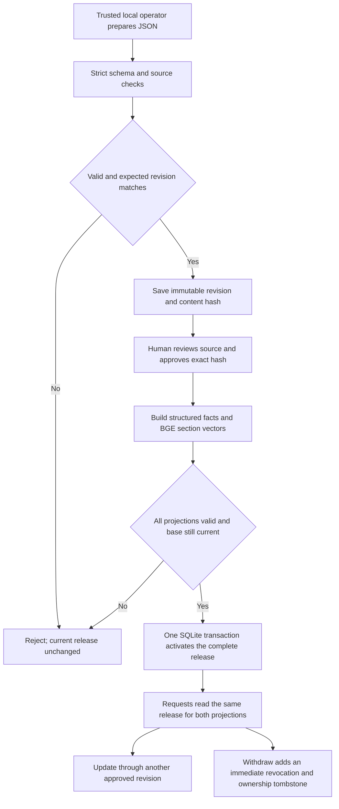
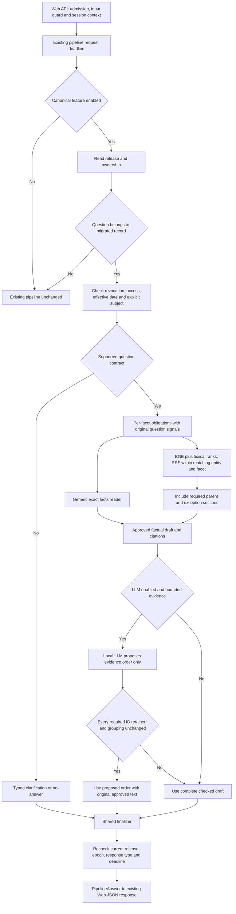

# Flow 65: Canonical Knowledge Pilot ที่เริ่มทำงานจริง

> ผลทดสอบวงกว้างล่าสุด 2026-09-01: ดู [รายงาน 66: FAQ 1,600 + Keyboard 500 + Pilot 16](66_current_flow_full_model_regression_20260901.md) เมื่อเปิด Guard แบบ enforce ร่วมกับ Pilot พบ regression และยังไม่ควร rollout ทันที ผล acceptance tests ในเอกสารนี้เป็นคนละขอบเขตกับการทดสอบวงกว้างดังกล่าว

วันที่เริ่มทำ: 2026-08-31

ตรวจผลรอบสุดท้าย: 2026-09-01 หลังเที่ยงคืน โดยคงชื่อไฟล์และชื่อ Run ตามวันที่เริ่มงาน

อ้างอิง: [แบบเดิม Flow 63](63_rag_first_single_format_knowledge_flow_20260831.md) และ [Review 64](64_rag_first_flow_design_review_20260831.md)

## 1. สถานะและเป้าหมายรอบนี้

เริ่ม Implement เส้นทางทดลองให้ครบตั้งแต่ JSON -> Save -> Approve -> Publish -> ถามผ่าน Pipeline -> แก้ไข -> Rollback -> Withdraw โดยไม่เปิดใช้กับฐานความรู้จริงอัตโนมัติ

**นี่เป็น Vertical slice ของ Flow 63 ไม่ใช่การประกาศว่า Flow 63/64 ทุกข้อทำครบแล้ว**

เป้าหมายที่ทดสอบ: เพิ่มเกมสมมติและกฎสมมติผ่าน Format เดียวกัน แล้วตอบจากข้อมูลนั้นโดยไม่เพิ่ม Handler หรือ Route เฉพาะชื่อเกม เมื่อแก้ข้อมูลต้องเห็นรุ่นใหม่ และเมื่อถอนข้อมูลต้องไม่กลับไปใช้คำตอบเก่า

| ทำแล้วในรอบนี้ | ยังไม่ทำ/ไม่เปิดใช้ |
|---|---|
| Canonical JSON รุ่น `2.1-pilot` สำหรับเกมและกฎ | ทุก Content type ของ Schema 2.0 เดิม |
| SQLite: Revision, Approval, Release, Ownership, Audit | หน้า Admin Login/Form/Preview/Diff และ RBAC |
| Structured และ RAG projection ใน Release เดียว | Import PDF/OCR/Website แบบอัตโนมัติ |
| ตรวจชนิดข้อมูล, Source quote/hash, Authority และ Scope | พิสูจน์ความจริงของเอกสารด้วยระบบอัตโนมัติ |
| Publish แบบ atomic และเช็ค Concurrent edit | Background job queue, Cleanup/Retention อัตโนมัติ |
| Generic reader ตาม Predicate | Calculator ใหม่, Complete catalog reader และ Live slot API |
| Dense BGE + Lexical char-ngram เดิม + RRF | BM25 tokenizer ใหม่ และ Cross-encoder reranker ในเส้นทางนี้ |
| LLM จัดลำดับ Evidence ID; Server สร้างคำตอบจากข้อความที่อนุมัติ | LLM เขียนคำตอบแบบ Paraphrase อิสระ |
| Finalizer ร่วม, ตรวจรุ่นก่อนส่ง, ปิด Legacy fallback สำหรับรายการที่ย้ายมาแล้ว | Semantic entailment validator สำหรับข้อความอิสระ |
| Unit/HTTP integration และโมเดลจริงบนข้อมูลสมมติ | Benchmark เต็ม 1,600 + 500 และ Production load test |

ใช้โครงเดิมของ Website, Input Quality Guard, Session resolver, Deadline และ Pipeline entry point ต่อ ไม่เปลี่ยน Backbone ของคำถามทั้งหมด

## 2. Flow ฝั่งเพิ่มข้อมูล



### 2.1 Save

- ผู้ดูแลเตรียม JSON หนึ่ง Record ไม่ต้องเขียนโค้ดรายเกม
- Server ตรวจ Field ที่รองรับเท่านั้น ไม่ข้าม Field แปลกหรือ Version ที่ยังอ่านไม่ได้
- Scope ใน Pilot จำกัด `public` และ `psu_phuket`; ข้อมูลหลายกลุ่มลูกค้า/หลายแพลตฟอร์มยังไม่รับ
- ตรวจวันที่แบบมี Timezone และช่วง `effective_from <= now < valid_until`
- `unknown` ต้องเป็น `value: null` ไม่ใช้ `false` แทนการไม่รู้
- ตรวจ Source snapshot hash, ข้อความ Quote ที่อยู่ใน Snapshot จริง และ Authority ของ Source ต่อ Predicate/Facet
- คำอธิบายต้องเป็นข้อความที่ดึงจาก Source จริงในรุ่นนี้ ไม่อนุญาตให้ LLM แต่งเนื้อหามาแทรก
- Save ใช้ `expected_version` ป้องกันการเขียนทับการแก้ไขของอีกคน

### 2.2 Approve

ผู้ตรวจต้องตรวจความจริงและความเหมาะสมของข้อมูลจากต้นฉบับก่อนอนุมัติ Hash ของ Revision นั้น การมี Quote ตรงกับเอกสารพิสูจน์ได้แค่ว่าเก็บข้อความตรงกัน ไม่ได้พิสูจน์ว่าเอกสารพูดจริงหรือมีอำนาจกำหนดกฎนั้น

โดยเฉพาะ Boolean เช่น “มีให้บริการ” ระบบตรวจชนิดข้อมูลและ Source scope ได้ แต่ผู้อนุมัติยังต้องยืนยันว่าค่า Boolean สอดคล้องกับต้นฉบับจริง

Revision payload ไม่ถูกแก้จาก `approved` เป็น `published`; Approval และ Release เป็นข้อมูลคนละส่วน จึงไม่เปลี่ยน Hash ของเนื้อหาที่อนุมัติ

**ข้อจำกัดสิทธิ์:** CLI นี้ใช้โดยผู้ดูแลที่เชื่อถือและมีสิทธิ์เข้าถึงไฟล์บนเครื่องเท่านั้น `--actor` เป็นชื่อสำหรับ Audit ไม่ใช่ระบบ Login หรือหลักฐานยืนยันตัวตน ห้ามนำ CLI ไปครอบเป็น Public API โดยไม่มี Authentication/Authorization

### 2.3 Publish

1. อ่าน Head revisions, Approval, Active release และ Revocation epoch
2. ปฏิเสธหาก Head ปัจจุบันมีรายการที่ยังไม่อนุมัติ
3. สร้าง Structured projection จาก Facts
4. สร้าง RAG units จาก Sections ที่มี Facet และ Dependency ชัด
5. เรียก BGE ทีละ Batch สูงสุด 8 ข้อความ; ไม่ถือ SQLite write transaction ระหว่างรอโมเดล
6. ตรวจจำนวน Vector, Dimension, ค่าที่ไม่เป็น NaN/Infinity และ Norm
7. เปิด Write transaction สั้น ๆ ตรวจว่า Head, Active release และ Epoch ไม่เปลี่ยนระหว่าง Build
8. บันทึก Release ที่รวม Facts, Sections/Vectors และ Manifest พร้อมเปลี่ยน Active pointer ใน Transaction เดียว
9. หากขั้นใดล้มเหลว Release เดิมยังใช้อยู่ ไม่มี Structured ใหม่คู่กับ Vector เก่า

ทั้งสอง Projection เก็บอยู่ใน SQLite Release payload เดียวกัน ไม่ใช่เขียน JSON สองไฟล์แยกแล้วหวังว่าจะสลับทันกัน

`request_key` ป้องกัน Publish ซ้ำ และผูกกับ `expected_active`; การใช้ Key เดิมกับ Base release คนละชุดถูกปฏิเสธ

### 2.4 Update, Withdraw และ Rollback

- Update: Save รุ่นใหม่ -> Approve -> Publish ข้อมูลเก่ายังใช้งานจนกว่ารุ่นใหม่เปิดใช้สำเร็จ หากต้องหยุดข้อเท็จจริงที่ผิดทันที ให้ Withdraw
- Withdraw: บันทึกสถานะถอนและเพิ่ม Epoch ทันที ไม่ต้องรอ Rebuild Vector
- Ownership เก็บชื่อเดิมไว้ด้วย เพื่อให้คำถามถึงรายการที่ถอนแล้วไม่หลุดไปตอบจาก Legacy
- Pilot ไม่อนุญาต Restore identity ที่ถอนแล้วผ่าน Save ตรง ๆ ต้องออกแบบขั้นตอน Restore ที่ตรวจรับก่อน
- Rollback: ต้องระบุ Active release ที่คาดไว้และ Target release ที่มีอยู่จริง
- Rollback ที่มี Record ถูกถอนจะถูกปฏิเสธ ไม่ให้กู้คืนข้อเท็จจริงที่ถูกถอนโดยไม่ตั้งใจ
- ไม่มี Response cache ใหม่ใน Pilot จึงไม่มีคำตอบเก่าค้างจาก Cache ของโมดูลนี้ การตรวจรุ่นก่อนส่งใช้ Active ID และ Epoch

## 3. Flow ฝั่งตอบคำถาม



เพิ่มเติมจากภาพ:

- หากเปิด Feature แต่เปิด Database ไม่ได้ ให้ข้อความระบบไม่พร้อม ไม่ย้อน Legacy โดยไม่รู้ว่าคำถามเกี่ยวกับข้อมูลที่ย้ายมาหรือไม่
- ถ้าถามจำนวนเกมทั้งหมดหลังเพิ่มรายการใหม่ แต่ยังไม่มี Complete catalog reader ให้ Clarification แทนการนับฐานเก่าที่อาจไม่ครบ
- ไม่มี Mutation/Booking write call ในเส้นทางนี้
- ทุกคำตอบจาก Pilot รวม Exact, Partial, No-answer, Busy และ Timeout ผ่าน `_finish` จุดเดียว
- ถ้ารุ่นข้อมูลหรือ Revocation epoch เปลี่ยนระหว่างตอบ ให้ทิ้งคำตอบและ Source ที่เตรียมไว้ แล้วใช้ข้อความไม่มีข้อเท็จจริง การตรวจนี้ไม่ใช่ Distributed transaction ครอบคลุมถึงวินาทีที่ Browser วาดข้อความ
- `_finish` ตรวจคำตอบที่ Server ประกอบจาก Approved units ไม่ใช่โมเดลตัดสินความหมายของคำตอบอิสระ จึงยังไม่เหมาะกับการเปิด Free-form composer

## 4. Question Contract ในรุ่นนี้

รองรับหนึ่ง Entity ที่ระบุชื่อชัด และไม่เกินสาม Facets ในข้อความเดียว เช่น “Nebula Fields เล่นยังไง และมีให้เล่นไหม”

| สิ่งที่ถาม | วิธีตอบ |
|---|---|
| แนวเกม | Generic reader ของ `genre` |
| มีให้บริการไหม | Generic reader ของ `service_availability` |
| อยู่โซนไหน | Generic reader ของ `available_at` |
| คืออะไร/รายละเอียด | Section facet `overview` |
| เล่นอย่างไร | Section facet `how_to_play` |
| ปุ่ม/การควบคุม | Section facet `controls` |
| สรุปกฎ | Section facet `policy` พร้อม Dependencies |

จับชื่อจาก Title/Aliases ที่อยู่ในข้อมูล ไม่เพิ่มชื่อเกมใหม่ลง Source code ตัวตรวจ Facet เป็นชุดสัญญาณร่วมของประเภทคำถาม ยังไม่ใช่ LLM understanding แบบเปิดกว้าง

คำถามเกี่ยวกับราคา การจอง เปรียบเทียบ ทั้งหมด วันที่อื่น กลุ่มลูกค้า แพลตฟอร์มเฉพาะ หรือหลาย Entity ที่ยังรองรับไม่ครบ จะถูก Clarify ใน Pilot นี้ ไม่ปล่อยให้เงื่อนไขถูกมองข้ามแล้วตอบเหมือนคำถามง่าย

คำถามที่มีชื่อใหม่แต่สำนวนยังไม่ตรงสัญญาณอาจถูกถามเพิ่มมากเกินไป ต้องวัด Answerable coverage และ False clarification ก่อนขยาย จึงยังไม่ควรนำ 20 ตัวอย่างนี้ไปกล่าวว่าเข้าใจภาษาไทยทั่วไปได้ครบแล้ว

ประวัติสนทนายังมาจาก Session resolver เดิม Pilot ไม่ได้เพิ่ม Memory storage และยังต้องทดสอบเรื่องความน่าเชื่อถือของ History และคำถามอ้างอิงในชุดใหญ่ต่อ

## 5. RAG และ LLM ทำอะไรจริง

### 5.1 Retrieval

- Build: `psu-bge-m3:q8_0` สร้าง Dense vector ให้ Section units
- Query: ใช้โมเดลและ Context config ที่ตรงกับ Release manifest
- Filter ก่อน Ranking: Record, Entity, Public scope, Effective time และ Facet ต้องตรง
- Lexical: ใช้ Char-ngram similarity ที่มีในโปรเจกต์ ไม่เรียกว่า BM25
- Fusion: รวมอันดับ Dense/Lexical ด้วย RRF `1 / (60 + rank)` ไม่บวกคะแนนคนละสเกล และไม่ตีความคะแนน RRF เป็น Probability
- Sections ภายใน Facet ใน Pilot เป็นส่วนที่ต้องรักษาไว้ทั้งหมด ไม่ใช้คะแนนสูงสุดเพื่อทิ้งข้อยกเว้น
- สูงสุด 4 Candidates ต่อ Facet, รวม Dependencies ไม่เกิน 6 Sections และ 4,000 ตัวอักษรต่อ Obligation ถ้าเกินต้องตอบว่าไม่พร้อม/ยังยืนยันส่วนนี้ไม่ได้ ไม่ตัดเนื้อหาทิ้งเงียบ ๆ

**นี่คือ Facet-filtered extractive RAG รุ่นจำกัด ไม่ใช่ Open-ended semantic QA ที่รับคำถามทุกสำนวนหรือเดา Facet ใหม่เอง** การเสริม Semantic contract understanding, Candidate selection สำหรับเอกสารใหญ่ และ Reranker ต้องทำพร้อมชุดทดสอบเพิ่มเติม

### 5.2 Local LLM

ใช้ `scb10x/typhoon2.5-qwen3-4b` เพื่อเสนอ `ordered_ids` ของหลักฐานที่ผ่านการตรวจแล้ว

Server ตรวจว่าเป็นรายการ ID เดิมครบทุกตัว ไม่มีตัวใหม่ ไม่มีตัวซ้ำ และไม่ย้ายข้อความข้ามกลุ่มคำถาม ถ้าไม่ผ่านจะกลับไปใช้ Draft เดิมเพียงครั้งเดียว ไม่วนเรียก LLM ซ้ำ

ข้อความคำตอบจริงถูกสร้างจาก Approved texts ที่ Server ถืออยู่ ไม่ได้นำคำอธิบายที่โมเดลแต่งกลับมาใช้ จึงลดความเสี่ยงการเปลี่ยนตัวเลข คำปฏิเสธ หรือข้อยกเว้น แต่แลกกับภาษาที่ไม่ลื่นเท่า Free-form composer

โมเดลยังอาจเสนอรายการไม่ครบได้ ดังนั้นต้องรายงานทั้ง `LLM attempted`, `order accepted` และ `checked_draft_fallback` แยกกัน คำตอบผ่านไม่เท่ากับ LLM ผ่าน

## 6. เวลา คิว และการเตรียมโมเดล

- Request ใช้ Deadline จาก API/Pipeline เดิม
- Query embedding มี Stage timeout 2.5 วินาที และใช้ Finalizer reserve เดิม
- LLM order มี Stage timeout 3 วินาที, Context 3,072 และ Output สูงสุด 160 tokens
- LLM ใช้ Call budget, Semaphore และ Circuit breaker เดิม
- Pilot มี Semaphore อีกตัวเพื่อไม่ให้ Build/query embedding กับ Order ของ Pilot เริ่มพร้อมกันใน Process เดียว
- เมื่อโมเดลไม่พร้อม Exact facts ยังตอบได้; Document path จะตอบ Busy หรือ Partial ตามหลักฐานที่มี
- `warmup` เป็นคำสั่ง Startup ชัดเจน ไม่เรียกระหว่างคำถามผู้ใช้ และบันทึกเวลาแยกจาก User latency

ข้อจำกัดที่ยังต้องทำต่อ: ไม่ใช่ Scheduler กลางของทุก Process/ทุกโมดูลในระบบเดิม, ยังไม่มีหลักฐานว่า Socket timeout หยุด GPU job แล้วจริง, Network read อาจเกิน Stage budgetได้เล็กน้อยก่อน Client ปิด Connection จึงไม่รับรอง Hard SLA 10 วินาทีทุกกรณี

Warmup สำเร็จไม่ได้รับรองว่าโมเดลจะอยู่ใน VRAM ตลอด ถ้า Keep-alive หมด เครื่องมีงานอื่น หรือ Ollama ย้ายโมเดลออก ต้องมี Metric และ Fallback รองรับต่อ

## 7. ไฟล์ที่เกี่ยวข้อง

| ไฟล์ | หน้าที่ |
|---|---|
| [records.py](../app/knowledge/records.py) | Schema และข้อกำหนด Source/Scope/Dependency |
| [store.py](../app/knowledge/store.py) | Revision, Approval, Atomic publish, Withdraw, Rollback |
| [answer.py](../app/knowledge/answer.py) | Ownership, Contract, Exact/RAG, Typed outcome, Finalizer |
| [local_models.py](../app/knowledge/local_models.py) | ใช้ BGE/Local LLM เดิม พร้อมงบและ Gate |
| [engine.py](../app/pipeline/engine.py) | จุดเชื่อม Feature flag ก่อน Legacy dispatch |
| [manage_canonical_knowledge.py](../tools/manage_canonical_knowledge.py) | CLI ของผู้ดูแลที่เชื่อถือ |
| [run_canonical_knowledge_pilot.py](../tools/run_canonical_knowledge_pilot.py) | รันตัวอย่าง Lifecycle และบันทึก QA/Trace |
| [test_canonical_knowledge.py](../tests/test_canonical_knowledge.py) | Unit tests, Concurrency และ HTTP integration |

ไฟล์ `server.py` และ Web UI มีการแก้ไขค้างจากงานก่อนหน้า งานนี้ไม่ได้แก้ทับส่วนเหล่านั้น จุดเชื่อมใน Source code เดิมเพิ่มที่ `engine.py` เท่านั้น

## 8. วิธีทดลองโดยไม่กระทบข้อมูลจริง

รันจาก Project root โดยใช้ Python environment ที่ใช้งานโปรเจกต์ได้อยู่แล้ว:

```powershell
python tools/run_canonical_knowledge_pilot.py --output-dir reports/canonical_knowledge_pilot/my_fresh_run --warmup --integration-smokes
```

ต้องใช้ Output directory ใหม่ Script ไม่เขียนทับ Database ของรอบก่อน และใช้ Demo DB แยก ไม่แก้ Curated JSONL, Index เดิม หรือ Live knowledge store

Script นี้เปิดใช้โมเดลใน Flow ทุก Case แต่คำถาม Exact/Clarification ที่ไม่จำเป็นต้องใช้ LLM ยังข้ามโมเดลตาม Flow ไม่ได้บังคับเรียก LLM เพื่อให้มีจำนวน Call สูงขึ้น

`--integration-smokes` เป็นการตรวจโค้ดเดิมแบบเจาะจง ไม่ใช่การทำ No-LLM benchmark เปรียบเทียบอีกชุด

### 8.1 Workflow ของผู้ดูแล

```powershell
python tools/manage_canonical_knowledge.py --db data/knowledge/approved.sqlite init
python tools/manage_canonical_knowledge.py --db data/knowledge/approved.sqlite save new_record.json --expected-version 0 --actor local_editor
python tools/manage_canonical_knowledge.py --db data/knowledge/approved.sqlite approve RECORD_ID --version 1 --hash HASH_FROM_SAVE --actor local_reviewer
python tools/manage_canonical_knowledge.py --db data/knowledge/approved.sqlite status
python tools/manage_canonical_knowledge.py --db data/knowledge/approved.sqlite warmup
```

หลังตรวจเนื้อหาและอนุมัติครบ ใช้ `publish --request-key UNIQUE_KEY --expected-active ACTIVE_ID_FROM_STATUS --actor local_reviewer`; ครั้งแรก Base active เป็นสตริงว่าง อย่า Copy placeholder ไปเปิดระบบจริงโดยไม่ตรวจค่า

คำสั่ง `withdraw RECORD_ID --actor local_reviewer` ถอนข้อมูลทันที และ `rollback RELEASE_ID --expected-active CURRENT_ID --actor local_reviewer` ย้อนรุ่นตามเงื่อนไข

ยังไม่ได้รันคำสั่งด้านบนกับ `data/knowledge/approved.sqlite` ในงานนี้ คำสั่งเป็นคู่มือ ไม่ใช่หลักฐานว่าฐานจริงถูกสร้างแล้ว

### 8.2 Feature flag

```text
PSU_CANONICAL_KNOWLEDGE=0       ค่าเริ่มต้น; ระบบเดิมทำงานตามเดิม
PSU_CANONICAL_KNOWLEDGE=1       เปิดเส้นทางทดลอง
PSU_KNOWLEDGE_DB=absolute_path ระบุ Database ที่จะใช้
PSU_KNOWLEDGE_ALLOW_DEMO=1      อนุญาต Demo DB เฉพาะการทดลองแยก
```

**ห้ามเปิด Demo flag ในเว็บสาธารณะ** โมเดลของ Pilot จำกัด URL ไว้ที่ Loopback เท่านั้น ไม่มี Cloud LLM ในเส้นทางใหม่

## 9. ผลทดสอบและวิธีอ่านผล

ไฟล์ผลโมเดลจริงและ QA:

- [รอบแรก: ไม่ทำ Explicit LLM warmup](../reports/canonical_knowledge_pilot/20260831_v1/summary.json)
- [รอบ Warmup: Summary](../reports/canonical_knowledge_pilot/20260831_v2_warm/summary.json)
- [รอบตรวจล่าสุด: Summary](../reports/canonical_knowledge_pilot/20260831_v3_verified/summary.json)
- [คำถามและคำตอบรายข้อของรอบล่าสุด](../reports/canonical_knowledge_pilot/20260831_v3_verified/questions_answers.md)
- [Trace/Output JSONL ของรอบล่าสุด](../reports/canonical_knowledge_pilot/20260831_v3_verified/cases.jsonl)
- [ผล Unit/HTTP tests รอบล่าสุด](../reports/canonical_knowledge_pilot/20260831_v3_verified/unit_tests.txt)

รอบแรกผ่าน Output checks 20/20 แต่ LLM ลองสองครั้งแล้ว Timeout และที่เหลือถูก Circuit breaker ข้าม ต้องไม่สรุปจากเลข 20/20 ว่า LLM ไม่มีปัญหา

รอบ Warmup ก่อนแก้การรวม Citation: เตรียมโมเดลประมาณ 5.68 วินาที, Output checks 20/20, LLM ลอง 5 ครั้ง ผ่านข้อกำหนด Order 3 ครั้ง อีก 2 ครั้งส่ง ID ไม่ครบจึงใช้ Draft สำรอง เวลาคำถามเฉลี่ยประมาณ 0.286 วินาทีและสูงสุด 1.229 วินาทีในชุดจำลองนี้

ผลล่าสุดหลังรวม Citation ของ Source เดียวกันและเพิ่ม HTTP tests ให้ยึด Summary/Trace ของ `v3_verified` ไม่รวมตัวเลขแต่ละ Run เป็นผลเดียวกัน

| ผลรอบ `v3_verified` | ค่าที่วัดได้ |
|---|---|
| Unit/HTTP integration tests | ผ่าน 48/48 |
| Existing smoke scripts | ผ่านทั้ง Input Quality Guard, Request Deadline และ Answer Pipeline |
| Model-enabled development cases | ผ่าน Output checks 20/20 |
| ชนิดผลลัพธ์ | Answer 9, Partial 1, Clarification 6, No-answer 4 |
| เฉลี่ยทุกคำถาม | 0.179 วินาที |
| เฉลี่ยเฉพาะ 5 คำถามที่เข้า Embedding + LLM order | 0.576 วินาที |
| P95 แบบ Nearest rank / สูงสุด | 0.595 / 0.656 วินาที |
| LLM attempts / Order accepted | 5 / 3 |
| Order ที่ไม่ผ่านและใช้ Draft | 2: P04 และ P05 ส่ง `how` กลับมาแต่ขาด `overview` ที่เป็น Dependency |

เวลารอบล่าสุดเป็น Warm run บนข้อมูลขนาดเล็กและโมเดลที่พร้อมอยู่แล้ว จึงไม่ใช้ค่านี้รับรองเวลาของผู้ใช้ใหม่หลังโมเดลถูก Unload หรือของฐานข้อมูลใหญ่

ผลที่ยืนยันได้ในขอบเขตนี้คือ Generic reader เห็นค่าใหม่หลัง Publish, Rollback กลับค่ารุ่นเดิมได้โดยตั้งใจ, Withdraw ปิดการตอบข้อมูลนั้น และ Invalid LLM output ไม่ทำให้หลักฐานที่ต้องเก็บหายไป ยังไม่พิสูจน์ว่าการเพิ่ม LLM order ทำให้คุณภาพคำตอบดีกว่าเดิม

**เครื่องที่ตรวจพบระหว่างทดสอบคือ NVIDIA GeForce RTX 4050 Laptop GPU 6,141 MiB** จึงนำเวลาไปยืนยันเครื่อง Server RTX 5060 8 GB ไม่ได้ และเวลาเฉลี่ยรวม Exact/Clarification ที่ไม่เรียกโมเดลด้วย ไม่ใช่ความเร็วเฉลี่ยการ Generate ของ LLM

Output checks ประกอบด้วย Mode ที่คาดไว้, Required/Forbidden text, Finalizer, Validation status และเวลาน้อยกว่า 10 วินาที เป็น Development acceptance cases ที่รู้ข้อมูลต้นทาง ไม่ใช่ Independent factual accuracy หรือผล 1,600 ข้อ

มีการทดสอบ 30 Exact requests พร้อมกันด้วย Test double ที่ห้ามเรียกโมเดล เพื่อยืนยันการแยกเส้นทาง ไม่ใช่ผล Load test ที่ผู้ใช้ 30 คนเรียก LLM จริง

## 10. การติดตามประเด็นจาก Review 64

| Review | สิ่งที่ทำใน Pilot | สิ่งที่ยังต้องขยาย |
|---|---|---|
| R01 | Deadline, Stage budget, Circuit breaker, Process-local gate | Scheduler รวมและยืนยันการ Cancel งานจริง |
| R02-R03 | Explicit entity/facet spans, Per-obligation outcomes, Clarify กรณีเกินขอบเขต | สำนวนกว้าง, Multi-entity และ Dependency planning |
| R04-R05 | Approved extracts, ห้าม LLM เปลี่ยน Fact, Finalizer ร่วม | Validator แบบ Entailment สำหรับ Paraphrase |
| R06 | จำกัด Record ให้มี Scope/เวลาเดียว | Assertion-level qualifiers หลายกลุ่ม/แพลตฟอร์ม |
| R07 | ไม่ตอบ Complete catalog จากฐานที่ยังไม่ครบ | Completeness certificate และ Generic catalog reader |
| R08-R09 | Approval แยก Release, Hash/Quote/Snapshot binding | Source fetch, Extraction version และ Source-drift review |
| R10 | Public-only, Dependency validation, จำกัดจำนวน/ความลึก | ACL หลายระดับและ Cross-record dependencies |
| R11 | Ownership tombstone, No legacy fallback สำหรับรายการย้ายแล้ว | Migration mapping ครบทุกช่องทาง/Cache เดิม |
| R12 | ไม่มี Mutation ใน Pilot | Booking state machine/API แยกตาม Flow 49 |
| R13 | Predicate เดียวต่อ Record, Value type เคร่งครัด | Set-valued facts และ Scope conflict policy |
| R14 | Expected version, Approval hash, Compare-and-swap activation, Idempotency | UI conflict resolution, Durable jobs |
| R15 | ไม่มี Answer cache ใหม่, ตรวจ Active/Epoch ก่อนส่ง | Versioned cache หากเพิ่มเพื่อ Performance |
| R16 | Facet filter, RRF, รักษา Dependency, Explicit budget failure | Retrieval holdout และ Rerank allocation |
| R17 | Record/unit/batch caps และ Gate ระหว่าง Build | Retention, Cleanup, Peak RAM monitoring และหลาย Process |
| R18 | Exact quote/hash และ Human approval | PDF/OCR quality gates |
| R19 | ปฏิเสธ Unknown schema/field, Fixed registry version | Schema migration และ Compatibility matrix หลายรุ่น |
| R20 | QA logs, Model success แยก Final-answer checks | 1,600 + 500, New-content holdout, Real concurrent load |

## 11. งานถัดไปก่อนเปิดใช้กับข้อมูลจริง

1. ให้เจ้าของตรวจ Schema และตัวอย่าง Source authority กับข้อมูลจริงหนึ่งเกมและหนึ่งกฎ
2. เพิ่มชุดคำถามใหม่ที่ไม่ได้ใช้ปรับสัญญาณ รวมชื่อใหม่ สำนวนย่อ คำผิด และ Follow-up ผ่าน Web Guard
3. วัด False clarification และคำถามผิด Facet ก่อนเพิ่ม LLM understanding หรือเปิด Paraphrase
4. ทำ Admin Login/Form/Preview/Diff เชื่อม Store API โดยตรวจสิทธิ์บน Server ไม่รับ `approved_by` จาก Browser
5. ขยาย Generic readers ตามชนิดคำถามที่ต้องใช้จริง พร้อม Completeness/Scope contract
6. รันชุด 1,600 + 500 แบบ Model-enabled และ New-content holdout บน Snapshot ที่ Freeze แล้ว
7. วัดเครื่อง Production และผู้ใช้พร้อมกันจริงก่อนเปิด Feature flag ทีละกลุ่มข้อมูล

หลักสำคัญ: เพิ่มข้อมูลครั้งเดียวแล้วใช้งานได้หลายเส้นทาง โดยไม่เพิ่มโค้ดตามชื่อรายการ แต่ความสามารถหรือความหมายชนิดใหม่ยังต้องมี Contract และการทดสอบรองรับ
