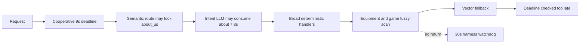
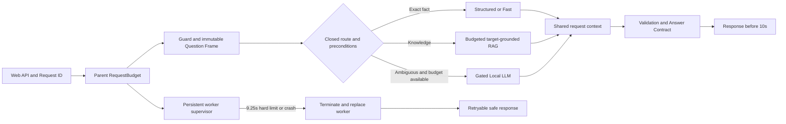
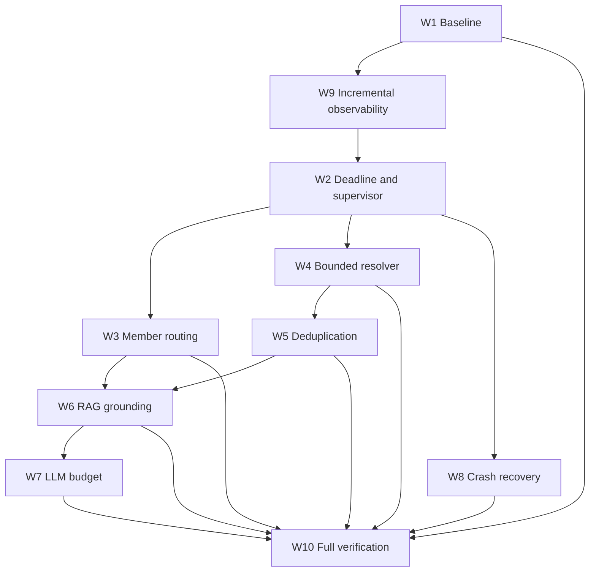

# Master Plan: แก้ Timeout, Routing, Retrieval และ Worker Reliability

วันที่จัดทำ: 1 กันยายน 2026, Asia/Bangkok

สถานะเอกสาร: `implementing`

ขอบเขตรอบนี้: เริ่ม Implement P0/P1 ที่ไม่ต้องเปลี่ยนฐานข้อมูลหรือ Cloud service แล้ว ผล full regression และ load test ยังไม่ถูกรัน จึงยังไม่ถือว่า Production ready

เอกสารตั้งต้น: [ผลทดสอบ Current Flow 2,116 ข้อ](66_current_flow_full_model_regression_20260901.md)

สถานะช่องว่างล่าสุดหลัง Focused Regression: [78: Remaining Failures, Timeout and Error Gap Analysis](78_remaining_failures_timeout_and_error_gap_analysis_20260902.md)

## 1. เป้าหมายและสถานะปัจจุบัน

เป้าหมายสูงสุดคือให้ Website Chatbot ส่ง response ให้ผู้ใช้ภายใน 10 วินาทีทุกครั้ง แม้ Local LLM, Retrieval หรือ CPU matching จะช้า พร้อมรักษาความถูกต้องของคำตอบและไม่ปล่อยให้ Worker Crash ทำให้ Web API ล้มตามไปด้วย

Baseline ล่าสุดมีผลดังนี้:

| ชุดทดสอบ | จำนวน | เกิน 10 วินาที | Harness timeout | Worker crash ที่ผลลัพธ์ระบุ |
|---|---:|---:|---:|---:|
| FAQ | 1,600 | 10 | 7 | 1 |
| Keyboard | 500 | 3 | 0 | 1 |
| Canonical Pilot | 16 | 0 | 0 | 0 |
| รวม | 2,116 | 13 | 7 | 2 |

คะแนน FAQ ปัจจุบันคือ 1,456/1,600 หรือ 91.00% ขณะที่รอบก่อนหน้าคือ 94.31% ดังนั้นการแก้ latency ห้ามทำให้คะแนนลดลงอีก และต้องแยกงานกู้คุณภาพกลับไปอย่างน้อย 94.31% ออกจากการพิสูจน์ SLA ให้ชัด

### สถานะงาน

| ID | Workstream | Priority | สถานะเริ่มต้น | เอกสาร |
|---|---|---|---|---|
| W1 | Baseline และ regression corpus | P0 | `unit_verified` | [68](68_slow_case_baseline_and_regression_corpus_plan_20260901.md) |
| W2 | Hard deadline และ worker supervisor | P0 | `unit_verified` | [69](69_hard_deadline_and_pipeline_worker_supervision_plan_20260901.md) |
| W3 | Member/about_us routing | P0 | `unit_verified` | [70](70_member_about_us_routing_correction_plan_20260901.md) |
| W4 | Bounded game resolver | P0 | `unit_verified` | [71](71_bounded_game_entity_resolver_plan_20260901.md) |
| W5 | Structured/Fast deduplication | P0 | `unit_verified` | [72](72_structured_fast_resolution_deduplication_plan_20260901.md) |
| W6 | Target-grounded RAG | P1 | `implementing` | [73](73_budgeted_target_grounded_rag_retrieval_plan_20260901.md) |
| W7 | Local LLM budget/health/fallback | P1 | `unit_verified` | [74](74_local_llm_budget_health_and_fallback_plan_20260901.md) |
| W8 | Windows crash diagnosis/recovery | P1 | `not_started` | [75](75_windows_worker_crash_diagnosis_and_recovery_plan_20260901.md) |
| W9 | Crash-resilient observability | P0 | `unit_verified` | [76](76_crash_resilient_stage_observability_plan_20260901.md) |
| W10 | End-to-end SLA/load/rollout | P2 | `implementing` | [77](77_end_to_end_sla_load_test_and_rollout_plan_20260901.md) |

### Latest implementation update: 2 September 2026

#### Focused regression after implementation: 2 September 2026, 13:13 ICT

**สิ่งที่ยืนยันจาก Log รอบใหม่**

- รัน `tools/run_slow_regression.py --allow-llm` ผ่าน `PipelineWorkerSupervisor` แบบ persistent worker ใน [run 20260902T061341Z](../reports/slow_regression/20260902T061341Z/summary.json)
- Slow corpus ที่ preserve จาก raw result รอบ 2,116 ข้อมี 13 cases: member/role 10, multi-question 1, keyboard/game 2
- `13/13` completed, `13/13` ส่งกลับภายใน 10 วินาที, `13/13` route ตรง contract และไม่มี worker timeout/crash
- latency สูงสุดที่ผู้ใช้รอในชุดนี้ `1.0752s`; member/role case สูงสุด `1.017s`; `KIA-0460` `1.0752s`; `KIA-0486` `0.178s`
- Parent-owned performance log เขียน event ได้ 456 events และ dropped 0 events: [JSONL](../data/logs/performance/pipeline_20260902T061343Z.jsonl)

**การแก้ที่เพิ่มจากรอบแรก**

- `tools/run_slow_regression.py` freeze baseline hash/manifest และสร้าง output directory ใหม่ทุก run
- Game target ที่ `unknown` หรือ `ambiguous` และจำเป็นต่อคำถามจบด้วย clarification/no-answer ก่อน Structured, Vector RAG หรือ Local LLM
- Equipment catalogue เป็น deterministic preflight route แม้ router confidence อยู่ช่วงกลาง จึงไม่ใช้ intent LLM โดยไม่จำเป็น
- Worker มี readiness handshake และ warm local Game/Vector index ก่อนรับงาน; worker replacement ระหว่าง runtime ยังตอบ `503 retryable` จน ready แทนการรอค้าง
- `performance_trace.py` ใช้ allow-list สำหรับ string metadata และบล็อก question/answer/prompt/evidence/session/PII โดย default

**ผลที่ยังไม่ใช่ข้อสรุป Production**

- focused run นี้วัด route, status และ latency เท่านั้น ยังไม่ได้ให้ gold answer contract ครบทุก 13 ข้อ
- ยังไม่ได้รัน full model-enabled 2,116 cases หลังแก้ หรือ HTTP concurrency 5/10/20/30 users
- Windows access violation ยังถูก containment และ classification ได้ แต่ยังไม่มี reproduction matrix ที่ชี้ root cause

สิ่งที่ Implement และผ่าน focused smoke tests แล้ว:

- `RequestBudget`, `StageDeadlineExceeded`, finalizer reserve และ stage gate ใน Pipeline
- `RequestExecutionContext` สำหรับ cache Game Resolution ใน request เดียว และข้าม deterministic capability ที่ซ้ำ
- Member/role Question Frame แบบ closed route (`overview` runtime route, `about_us` evidence category) ก่อน Semantic Route Lock
- `GameResolver` แบบ exact map + compact map + character-trigram shortlist; fuzzy comparison ถูกจำกัดสูงสุด 64 ครั้งต่อ lookup
- Fast availability path เรียก GameResolver กลางแทนการสแกน aliases หลาย catalog ซ้ำ
- Semantic retrieval ไม่เริ่มเมื่อเวลาเหลือไม่ถึง 1.75 วินาที และหยุด scoring อย่างปลอดภัยเมื่อ budget ใกล้หมด
- optional `PipelineWorkerSupervisor` แบบ persistent process workers; timeout/crash จะ replace worker โดยไม่ปิด Web API
- API เพิ่ม field แบบ backward-compatible: `timing_status`, `timed_out`, `timeout_stage`, `retryable`, `worker_id`

การเปิด Supervisor ใน staging/production ต้องตั้ง `PSU_PIPELINE_WORKER_SUPERVISOR=1` และกำหนด `PSU_PIPELINE_WORKERS=4` ก่อน โดยค่า default ยังปิดไว้เพื่อไม่เปลี่ยนพฤติกรรม deployment เดิมโดยอัตโนมัติ

หลักฐานที่ผ่าน: `smoke_test_timeout_routing_resolver_remediation.py`, `smoke_test_pipeline_worker_supervisor.py`, `smoke_test_semantic_rag.py`, `smoke_test_request_deadline.py`, `smoke_test_product_sla_guards.py`, และ focused Fast/Member/Resolver/Tool Preconditions tests

สิ่งที่ยังไม่ยืนยัน: full model-enabled 2,116 cases, Windows crash reproduction matrix, HTTP concurrency 5/10/20/30 และ 10-second SLA บน target server. ห้ามเปลี่ยนสถานะเป็น `regression_verified` ก่อน artifacts เหล่านี้ครบ

นิยามลำดับความสำคัญ P0–P3:

| Priority | ความหมาย | ขอบเขต |
|---|---|---|
| P0 | ต้องแก้ก่อนจึงจะเชื่อถือผลทดสอบและคุม SLA ได้ | Baseline, Observability, Hard Deadline, route correction, bounded resolver และ duplicate-work control |
| P1 | ต้องแก้ก่อน Production เพื่อรักษาความถูกต้องและครอบ failure | Target-grounded RAG, Local LLM budget/health และ crash diagnosis/recovery |
| P2 | Release gate | Full regression, HTTP concurrency, target-hardware verification, rollout และ rollback |
| P3 | Post-production optimization ที่ไม่ใช้ลดเกณฑ์ผ่าน | Capacity มากกว่า 30 users, quality milestone กลับสู่ ≥94.31%, retention tuning และ cost/resource optimization หลังมี Production evidence |

P3 เริ่มได้เมื่อ P0–P2 ผ่านเท่านั้น งาน P3 ห้ามใช้เป็นเหตุผลยอมรับ timeout, crash หรือ accuracy regression ที่ยังไม่ผ่าน Global Acceptance Criteria

สถานะอนุญาตให้เปลี่ยนตามลำดับเดียวเท่านั้น:

`not_started → implementing → unit_verified → regression_verified → production_ready`

ห้ามข้ามจาก `implementing` ไป `production_ready` แม้ focused tests ผ่าน เพราะยังต้องผ่าน full regression และ HTTP load test

## 2. หลักฐานจาก Log/Code พร้อม Case ID

### สิ่งที่ยืนยันจาก Log

- FAQ ที่เกิน 10 วินาทีทั้ง 10 ข้อเป็นคำถามเกี่ยวกับบุคลากร/ตำแหน่ง แต่ stack หลายข้ออยู่ใน game alias matching
- `MB-0501-M-012` ใช้ 20.473 วินาที: Universal Intent 7.777s, Deterministic 7.400s และ Vector Retrieval 4.805s
- `MB-0519-M-030` ใช้ 24.628 วินาที: Universal Intent 7.810s, Deterministic 11.605s และ Vector Retrieval 4.684s
- `KIA-0460` ไม่เรียก LLM แต่ใช้ 19.927 วินาที โดย Deterministic ใช้ 17.348s
- `KIA-0486` ไม่เรียก LLM แต่ใช้ 28.102 วินาที โดย Structured + Deterministic ใช้รวม 27.524s
- Stack ที่วินาที 25 ของหลาย worker อยู่ใน `SequenceMatcher → contains_alias → _match_supported_game`
- Pipeline deadline 9 วินาทีเป็น cooperative checkpoint ไม่ใช่ preemptive cancellation
- `worker_002.log` และ `worker_009.log` มี Windows fatal access violation; ความสัมพันธ์เชิงสาเหตุกับ Python runtime, diagnostics หรือ native dependency ยังไม่พิสูจน์

### แหล่งหลักฐาน

- [Raw results 2,116 ข้อ](../reports/current_flow_regression/20260901_full_model_enabled/results.jsonl)
- [Metrics และ stage timings](../reports/current_flow_regression/20260901_full_model_enabled/analysis/metrics.json)
- [Worker logs](../reports/current_flow_regression/20260901_full_model_enabled/)
- Code ปัจจุบัน: `app/pipeline/request_deadline.py`, `app/pipeline/engine.py`, `app/core/normalization.py`, `app/runtime/fast_answer.py`, `app/web_api/server.py`

## 3. Root Cause และสิ่งที่ยังพิสูจน์ไม่ได้

### Root cause ที่ยืนยันได้

1. Deadline ตรวจเมื่อผ่าน checkpoint แต่ไม่หยุด synchronous CPU loop ที่เริ่มไปแล้ว
2. Semantic route ใช้ `about_us` ขณะที่ runtime handler ไม่ได้มี closed mapping ที่สอดคล้อง จึงเปิด broad fallback ไป equipment/games
3. Fuzzy matcher เปรียบเทียบ compact windows กับ alias จำนวนมากและไม่มี operation ceiling
4. Structured และ Deterministic สามารถ resolve ชื่อเกมซ้ำภายใน request เดียว
5. Retrieval บางเส้นทางกรอง category หลังประมวลผล candidate จำนวนมาก
6. Intent LLM timeout ใช้งบเกือบทั้งหมด แต่ Pipeline ยังเริ่มขั้น CPU/Retrieval ต่อ
7. Stage timing ถูก append เมื่อขั้นจบ จึงไม่มี timing สมบูรณ์เมื่อ process ค้างหรือตาย

### ข้อสันนิษฐานที่ต้องทดสอบ / สิ่งที่ยังพิสูจน์ไม่ได้

- Access violation เกิดจาก `difflib`, diagnostic stack collection, bundled Python หรือ native component อื่น
- ผลบน RTX 5060 8GB จะเร็วกว่า RTX 4050 6GB เท่าใด
- Worker count ที่เหมาะที่สุดสำหรับ peak 30 users ก่อนมี HTTP load test และ RSS measurement
- Accuracy หลังเปลี่ยน resolver/routing จนกว่าจะรัน 2,116 ข้อใหม่โดยใช้ Source fingerprint เดิม

## 4. Target Behavior และ Invariants

ส่วนนี้เป็น **การออกแบบที่เสนอ (Proposed Design)** และจะถือว่าเป็นพฤติกรรมจริงได้เมื่อผ่าน Acceptance Criteria และมี Log จาก implementation run เท่านั้น

Target Flow ต้องรักษา invariants ต่อไปนี้:

- Response ceiling ที่ผู้ใช้เห็นคือ 10.0 วินาที ไม่ใช่เพียงเวลาที่ Pipeline ตรวจ deadline
- Runtime route ของข้อมูลบุคลากรคือ `overview`; `about_us` เป็น evidence category เท่านั้น
- Exact member/price/schedule/game facts ข้าม LLM ได้
- ชื่อเกม resolve ไม่เกินหนึ่งครั้งต่อ request และ fuzzy work มีจำนวนสูงสุดแน่นอน
- Retrieval ห้ามเปลี่ยน target/facet ที่ Question Frame ยืนยัน
- LLM ใช้ verified evidence และห้ามสร้างข้อเท็จจริง PSU
- Controlled timeout ส่ง Safe Outcome; worker failure ไม่ทำให้ Parent Web API ปิด
- Performance Log ต้องอยู่แม้ worker ตาย และต้องไม่เก็บ booking PII/slip
- Structured และ RAG ต้องอ่าน release/version เดียวกัน
- การแก้ latency ห้ามเปลี่ยน Gold/Contract เพื่อให้คะแนนผ่าน

## 5. Mermaid Flow/Sequence Diagram

### Flow ปัจจุบันที่ก่อปัญหา



### Target Flow



### Dependency order



## 6. Interface, Data Structure, Config และ pseudocode

Interfaces ที่ต้องออกแบบร่วมกันและห้ามนิยามซ้ำคนละแบบในแต่ละ workstream:

```text
RequestBudget
  elapsed() -> float
  remaining() -> float
  allow_stage(stage, required_sec) -> bool
  checkpoint(stage, operation_count?) -> None | raises StageDeadlineExceeded
  metadata() -> dict

GameResolution
  status: matched | ambiguous | unknown | deadline_exceeded
  canonical_id: str | null
  score: float
  margin: float
  candidates: bounded list
  method: exact | compact | trigram_fuzzy | none

RequestExecutionContext
  request_id
  budget
  game_resolution_cache
  attempted_capabilities
  retrieval_cache
  trace_sequence
```

API fields ใหม่เป็น optional เพื่อรักษา compatibility:

```json
{
  "timing_status": "completed | degraded | timed_out",
  "timed_out": false,
  "timeout_stage": null,
  "retryable": false
}
```

Config เริ่มต้นที่ทุกเอกสารต้องอ้างค่าเดียวกัน:

| Config | Default |
|---|---:|
| Pipeline soft deadline | 9.0s |
| Parent hard worker limit | 9.25s |
| API response ceiling | 10.0s |
| Finalizer reserve | 1.0s |
| Game resolver stage cap | 0.25s |
| Retrieval cap | 1.5s |
| Intent LLM cap | 1.2s |
| Composer cap | 4.0s |
| LLM queue wait | 0.2s |
| Default LLM concurrency | 1 |

## 7. ขั้นตอน Implement ตามลำดับ

1. Freeze baseline และสร้าง focused corpus ตามเอกสาร 68
2. เพิ่ม parent-owned incremental stage events ขั้นต่ำตามเอกสาร 76
3. เพิ่ม RequestBudget/checkpoint และ hard worker limit ตามเอกสาร 69
4. ปิด member route ไม่ให้เข้า game/equipment ตามเอกสาร 70
5. สร้าง bounded GameResolver และเปลี่ยน caller ตามเอกสาร 71
6. เพิ่ม RequestExecutionContext และหยุด duplicate execution ตามเอกสาร 72
7. กรอง/จัดงบ RAG และบังคับ target/facet ตามเอกสาร 73
8. ลด LLM calls, timeout และ queue wait ตามเอกสาร 74
9. ทำ crash reproduction/recovery matrix ตามเอกสาร 75
10. รัน focused, full regression และ concurrent HTTP ตามเอกสาร 77
11. อัปเดตสถานะในไฟล์นี้ด้วยผลจริงและ artifact link ห้ามแก้ acceptance เพื่อให้ผ่าน

## 8. Failure Modes และ Safe Fallback

| Failure | Behavior ที่ต้องเกิด |
|---|---|
| Stage ไม่มีเวลาพอเริ่ม | Skip stage และใช้ verified fallback |
| CPU checkpoint หมดเวลา | Raise controlled timeout และ finalizer สร้าง no-answer |
| Worker ไม่ตอบ 9.25s | Parent terminate, release locks, ส่ง retryable response และ replace worker |
| Worker crash | Parent ระบุ crash taxonomy; request ถัดไปไม่ใช้ worker เดิม |
| LLM queue เต็ม/timeout | ไม่รอ; ใช้ draft/evidence ที่ตรวจแล้ว |
| RAG target mismatch | Clarification/no-answer ห้ามใช้เอกสารคนละ target |
| Game resolver ambiguous | ถามชื่อเกมเพิ่ม ห้ามเลือก candidate แทนผู้ใช้ |
| Log writer ช้า | Request path ส่งผ่าน bounded queue; logging failure ไม่ทำให้ response ล้ม |

## 9. Logging/Metrics ที่ต้องเพิ่ม

- `stage_started`, `stage_progress`, `stage_finished`, `stage_skipped`, `stage_failed`
- Request/worker/sequence IDs และ parent/child timestamps
- Global remaining time และ stage budget ตอนเริ่ม/จบ
- Resolver candidate/comparison count แบบไม่บันทึก alias ทั้งหมด
- LLM queue/load/prompt/eval/generation/parse time
- Worker exit code, termination reason, replacement readiness
- P50/P95/P99/Max, >10s, controlled timeout, hard timeout, crash และ unobserved
- Accuracy/contract metrics ต้องรายงานคู่ latency เสมอ

## 10. Unit, Integration, Regression และ Load Tests

- Unit: RequestBudget, resolver bounds, route precondition, request cache, target guard, LLM budget, event schema
- Integration: controlled timeout, hard-killed worker, worker replacement, structured/RAG shared release, Safe Outcome
- Focused regression: 13 slow cases + focused 100
- Full regression: FAQ 1,600 + Keyboard 500 + Canonical 16 แบบ model-enabled
- HTTP concurrency: 5/10/20/30 users สำหรับ fast-heavy, mixed และ all-LLM-attempt
- Crash matrix: bundled/system Python, diagnostics on/off, reused/fresh worker
- Artifact integrity: source fingerprint, duplicate IDs, missing outputs, broken links และ run manifest

## 11. Acceptance Criteria แบบวัดค่าได้

Global release gate:

- 0/2,116 request เกิน 10 วินาที
- 0 harness timeout, 0 worker crash และ 0 unobserved result
- Member cases 100% ไม่เรียก GameResolver และ P99 ต่ำกว่า 1.5s
- GameResolver P99 ต่ำกว่า 250ms และ resolve ไม่เกินหนึ่งครั้ง/request
- Retrieval ต่ำกว่า 1.5s และไม่มี evidence ข้าม target/facet
- LLM failure ทุกแบบยังส่ง response ภายใน 10s
- FAQ strict pass ไม่ต่ำกว่า 91.00% และไม่มี new regression ที่เกิดจาก latency changes
- Keyboard และ Canonical metrics ไม่ลดจาก baseline ที่ใช้ denominator เดียวกัน
- Peak 30 users ทุก request ได้ response ภายใน 10s; การ fallback/503 ต้องถูกนับและรายงาน ไม่ซ่อนจาก SLA

## 12. Rollback และ Compatibility

- ทุก behavior ใหม่อยู่หลัง feature flag ตาม workstream
- Rollout: resolver shadow → member routing → internal deadline → worker supervisor → RAG budget → LLM budget
- Rollback เมื่อ accuracy ลด, >10s เพิ่ม, crash เพิ่ม, RSS เกิน gate หรือ response schema ทำ client พัง
- Field API เดิมคงอยู่; field ใหม่ optional
- Raw baseline และ run artifacts immutable
- Guard, Canonical Pilot และข้อมูล Production ไม่ถูกเปลี่ยนโดยเอกสารชุดนี้

## 13. Dependencies และลิงก์ไปเอกสารอื่น

- [68 Baseline และ regression corpus](68_slow_case_baseline_and_regression_corpus_plan_20260901.md)
- [69 Hard deadline และ worker supervisor](69_hard_deadline_and_pipeline_worker_supervision_plan_20260901.md)
- [70 Member/about_us routing](70_member_about_us_routing_correction_plan_20260901.md)
- [71 Bounded game resolver](71_bounded_game_entity_resolver_plan_20260901.md)
- [72 Structured/Fast deduplication](72_structured_fast_resolution_deduplication_plan_20260901.md)
- [73 Target-grounded RAG](73_budgeted_target_grounded_rag_retrieval_plan_20260901.md)
- [74 Local LLM budget/health](74_local_llm_budget_health_and_fallback_plan_20260901.md)
- [75 Windows crash diagnosis/recovery](75_windows_worker_crash_diagnosis_and_recovery_plan_20260901.md)
- [76 Crash-resilient observability](76_crash_resilient_stage_observability_plan_20260901.md)
- [77 SLA/load/rollout](77_end_to_end_sla_load_test_and_rollout_plan_20260901.md)
- [66 ผลทดสอบ Current Flow](66_current_flow_full_model_regression_20260901.md)
