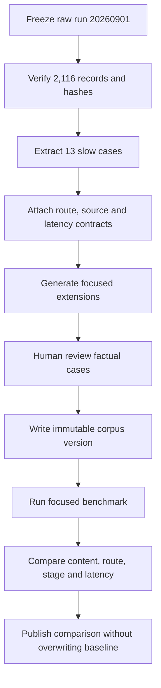

# Implementation Plan: Slow-case Baseline และ Regression Corpus

วันที่จัดทำ: 1 กันยายน 2026

สถานะ: `not_started`

Owner ที่แนะนำ: Evaluation/QA

อ้างอิง: [Master Plan 67](67_timeout_reliability_remediation_master_plan_20260901.md)

## 1. เป้าหมายและสถานะปัจจุบัน

สร้างฐานเปรียบเทียบที่ immutable และ focused regression corpus ที่ตอบได้ชัดว่าการแก้ Deadline/Route/Resolver ทำให้ 13 เคสช้าดีขึ้นหรือทำให้คำตอบอื่นถอยหลังหรือไม่

ปัจจุบันมี Raw results ครบ 2,116 records และ source fingerprint ยืนยันว่าไม่เปลี่ยนระหว่าง run แต่ยังไม่มี corpus เฉพาะ slow path ที่มี expected route, stage constraints และ latency target เป็น contract รายข้อ

Deliverables เมื่อ implement แผนนี้:

- `data/eval/slow_regression_20260901.jsonl`
- `data/eval/slow_regression_extensions_20260901.jsonl`
- `data/eval/slow_regression_schema.json`
- `reports/slow_regression/<run_id>/manifest.json`
- `reports/slow_regression/<run_id>/results.jsonl`
- `reports/slow_regression/<run_id>/comparison.md`
- Runner/analyzer ที่เลือก case ด้วย ID/tag และไม่เขียนทับ run เดิม

## 2. หลักฐานจาก Log/Code พร้อม Case ID

### สิ่งที่ยืนยันจาก Log

13 slow records ตั้งต้น:

| ID | Suite | คำถามย่อ | Wall | สถานะ | กลุ่มสาเหตุ |
|---|---|---|---:|---|---|
| MB-0499-M-010 | FAQ | รองอธิการบดีคือใคร | 30.000s | harness_timeout | member → game fuzzy |
| MB-0500-M-011 | FAQ | บุคคลนี้ตำแหน่งอะไร | 29.842s | worker_crash | fuzzy/access violation |
| MB-0501-M-012 | FAQ | ใครเป็นคณบดี | 20.473s | pipeline timeout response | LLM + broad fast + vector |
| MB-0503-M-014 | FAQ | ผู้ช่วยอธิการบดีคือใคร | 30.000s | harness_timeout | member → game fuzzy |
| MB-0507-M-018 | FAQ | บุคคลนี้ตำแหน่งอะไร | 30.014s | harness_timeout | member → game fuzzy |
| MB-0518-M-029 | FAQ | บุคคลนี้ตำแหน่งอะไร | 30.016s | harness_timeout | fuzzy/worker instability |
| MB-0519-M-030 | FAQ | ใครเป็นประธาน | 24.628s | pipeline timeout response | LLM + broad fast + vector |
| MB-0618-C-007 | FAQ | สมาชิกกี่คนและอธิการบดีคือใคร | 30.001s | harness_timeout | compound member → game fuzzy |
| MB-1229-M-049 | FAQ | รองอธิการบดีคือใคร | 30.007s | harness_timeout | alias rebuild/game scan |
| MB-1232-M-052 | FAQ | นักวิชาการคอมพิวเตอร์คือใคร | 30.006s | harness_timeout | member → game fuzzy |
| KIA-0460 | Keyboard | ขอ JSON | 19.927s | completed | false game route + duplicate scan |
| KIA-0486 | Keyboard | Assassin's Creed มีไหม | 28.102s | completed | unknown title exhaustive scan |
| KIA-0487 | Keyboard | Hollow Knight เล่นเครื่องไหน | 18.064s | worker_crash/unobserved | attribution ยังไม่แน่นอน |

Source files:

- `reports/current_flow_regression/20260901_full_model_enabled/results.jsonl`
- `reports/current_flow_regression/20260901_full_model_enabled/cases_manifest.json`
- `reports/current_flow_regression/20260901_full_model_enabled/fingerprints_before.json`
- `reports/current_flow_regression/20260901_full_model_enabled/fingerprints_after.json`
- `reports/current_flow_regression/20260901_full_model_enabled/worker_*.log`

## 3. Root Cause และสิ่งที่ยังพิสูจน์ไม่ได้

### สิ่งที่ยืนยันแล้ว

Corpus ต้องไม่ encode ข้อสรุปที่ยังไม่พิสูจน์เป็น Gold:

- ยืนยันได้ว่า KIA-0487 ไม่มี guard event และ worker log สุดท้ายยังผูกกับ KIA-0486 จึงห้ามตั้ง Gold ว่า Hollow Knight ทำให้ crash
- ยืนยันได้ว่า slow FAQ เป็น member-related แต่ห้ามสมมติว่าคำตอบบุคลากรในเอกสารเก่ายัง current โดยไม่ใช้ source contract เดิม
- ยืนยันได้ว่า model-enabled run เปิดโมเดล แต่บาง request ข้าม LLM ตาม gate; ห้าม label ว่า `no_llm_run`
- Hardware run ปัจจุบันคือ RTX 4050 Laptop 6GB ไม่ใช่ target server

### ข้อสันนิษฐานที่ต้องทดสอบ

- กลุ่มสาเหตุในตารางเป็น working classification จาก trace เดิม ไม่ใช่ Gold root cause; ต้องยืนยันด้วย stage events ใหม่
- จำนวน extension cases ที่เสนอเพียงพอต่อการจับ regression หรือไม่ต้องตรวจจาก coverage report
- Expected route และ allowed sources ต้องได้รับการตรวจทานกับ canonical data owner ก่อน freeze Gold

## 4. Target Behavior และ Invariants

ส่วนนี้เป็น **การออกแบบที่เสนอ (Proposed Design)** และยังไม่ใช่ผลจากการ Implement

- Baseline artifacts เป็น read-only และมี SHA-256 ใน manifest
- Case ID ไม่ซ้ำทั้ง base และ extension
- ทุก case มี original question, expected behavior และ provenance
- Gold answer ใช้ contract/required phrases/forbidden phrases ไม่บังคับข้อความ exact ถ้า paraphrase ถูกความหมาย
- Latency target แยกจาก content pass
- Case ที่ไม่มี factual gold ใช้ routing/safety contract แทนการแต่งคำตอบ Gold
- ทุก run สร้าง directory ใหม่จาก timestamp + config hash
- Failed/crashed/unobserved ต้องอยู่ใน denominator ห้ามหายจาก summary

## 5. Mermaid Flow/Sequence Diagram



## 6. Interface, Data Structure, Config และ pseudocode

JSONL record contract:

```json
{
  "id": "SLOW-MEMBER-001",
  "origin_id": "MB-0499-M-010",
  "suite": "slow_regression",
  "question": "ใครเป็นรองอธิการบดี",
  "tags": ["member", "role_lookup", "historical_timeout"],
  "expected": {
    "route_category": ["overview"],
    "route_intent": ["members_lookup"],
    "forbidden_stages": ["game_resolution", "games_catalog"],
    "allowed_source_ids": ["members"],
    "required_claims": [],
    "forbidden_claims": [],
    "answer_type": "fact_or_no_answer"
  },
  "latency": {
    "max_wall_sec": 1.5,
    "max_game_resolver_calls": 0
  },
  "provenance": {
    "source_run": "20260901_full_model_enabled",
    "review_status": "reviewed"
  }
}
```

สถานะผลลัพธ์มาตรฐาน:

```text
completed
pipeline_timeout
hard_timeout
worker_crash
worker_error
unobserved
```

Pseudo-runner:

```text
load corpus and validate unique IDs
create output directory using timestamp + config hash
write manifest before first request
for each case:
  execute in supervised worker
  append raw result immediately
  update progress atomically
after run:
  verify denominator and artifact hashes
  compare route/content/stages/latency against contracts
  write summary and per-case review
```

## 7. ขั้นตอน Implement ตามลำดับ

1. คัดลอกเฉพาะ field ที่ต้องใช้จาก raw run โดยเก็บ `origin_id`
2. สร้าง schema validator สำหรับ required fields, enum และ latency bounds
3. Review 13 cases ทีละข้อ โดยอ้าง FAQ/source contract เดิม ห้ามสร้าง factual Gold จากความจำ
4. เพิ่ม member/role 50 ข้อ: role→person, person→role, count/list, ambiguous name, missing role และ compound
5. เพิ่ม known game 25 ข้อจาก canonical catalog พร้อม Thai/English aliases
6. เพิ่ม unknown game 25 ข้อ รวม Assassin's Creed/Hollow Knight แต่ expected เป็น safe unknown/clarification ตาม operation
7. เพิ่ม non-game lookalike อย่างน้อย 25 ข้อ เช่น JSON, code key, zone field, person names และ English phrases
8. เพิ่ม tags สำหรับ route, resolver, deadline, retrieval, LLM และ crash reproduction
9. เพิ่ม runner filters `--ids`, `--tags`, `--limit`, `--run-id`
10. เพิ่ม analyzer เปรียบเทียบ baseline/new result โดยใช้ denominator เดียวกัน
11. สร้าง artifact integrity check: duplicate, missing, mismatch question, broken source link, overwrite attempt

## 8. Failure Modes และ Safe Fallback

| Failure | การจัดการ |
|---|---|
| Gold source ไม่ยืนยัน | ใช้ answer_type/route contract และ mark `content_gold_pending` |
| Case ID ซ้ำ | Fail ก่อน run |
| Output directory มีแล้ว | Fail; ห้าม overwrite |
| Worker ตาย | Append partial result เป็น `worker_crash` และนับ denominator |
| Run ถูกหยุด | Resume จาก manifest/progress โดยไม่รัน ID ที่สำเร็จซ้ำ |
| Config เปลี่ยนระหว่าง run | Fingerprint mismatch และหยุด run |
| Question ถูก normalize แล้วต่างจากต้นฉบับ | เก็บทั้ง original/resolved; ห้ามแก้ corpus เงียบ ๆ |

## 9. Logging/Metrics ที่ต้องเพิ่ม

- corpus version/hash และ source run hash
- case sequence, origin ID, tags และ expected contract version
- worker start/restart count
- content pass, route pass, stage pass, latency pass แยกกัน
- observed wall time และ right-censored flag
- P50/P95/P99/Max ต่อ tag
- slow case change: improved/unchanged/regressed/unobserved
- missing trace/stage counts

## 10. Unit, Integration, Regression และ Load Tests

- Schema rejects missing ID/question/expected/latency
- Duplicate IDs fail across base/extensions
- Existing output directory cannot be reused
- Interrupted run resumes without duplicate result
- Crash remains in denominator
- Contract accepts valid paraphrase and rejects wrong target
- Member case fails if trace contains GameResolver
- Unknown game fails if answer claims availability without evidence
- Full artifact verification returns exact record count

## 11. Acceptance Criteria แบบวัดค่าได้

- Base focused corpus มี 13/13 origin cases
- Extension มี member 50, known game 25, unknown game 25 และ non-game lookalike อย่างน้อย 25
- 100% cases ผ่าน schema และมี provenance
- 0 duplicate IDs, 0 missing question, 0 missing expected behavior
- Factual Gold ทุกข้อมี reviewed source contract หรือถูก mark pending โดยไม่ให้ content score
- Runner ไม่เขียนทับ artifact เดิม
- Comparison report แสดง content/route/stage/latency และ denominator ครบ

## 12. Rollback และ Compatibility

- ไม่แก้ benchmark corpus เดิมหรือ raw results
- Corpus ใหม่มี version และ `origin_id`; analyzer เดิมยังอ่านผลเก่าได้
- หาก schema ต้องเพิ่ม field ให้เพิ่มเป็น optional พร้อม schema version ใหม่
- การเปลี่ยน Gold ต้องทำ revision ใหม่พร้อมเหตุผล/ผู้ review ไม่แก้ย้อนหลัง

## 13. Dependencies และลิงก์ไปเอกสารอื่น

- [67 Master Plan](67_timeout_reliability_remediation_master_plan_20260901.md)
- [69 Deadline/Supervisor](69_hard_deadline_and_pipeline_worker_supervision_plan_20260901.md)
- [76 Observability](76_crash_resilient_stage_observability_plan_20260901.md)
- [77 Verification/Load/Rollout](77_end_to_end_sla_load_test_and_rollout_plan_20260901.md)
- [66 Current Flow Regression](66_current_flow_full_model_regression_20260901.md)
