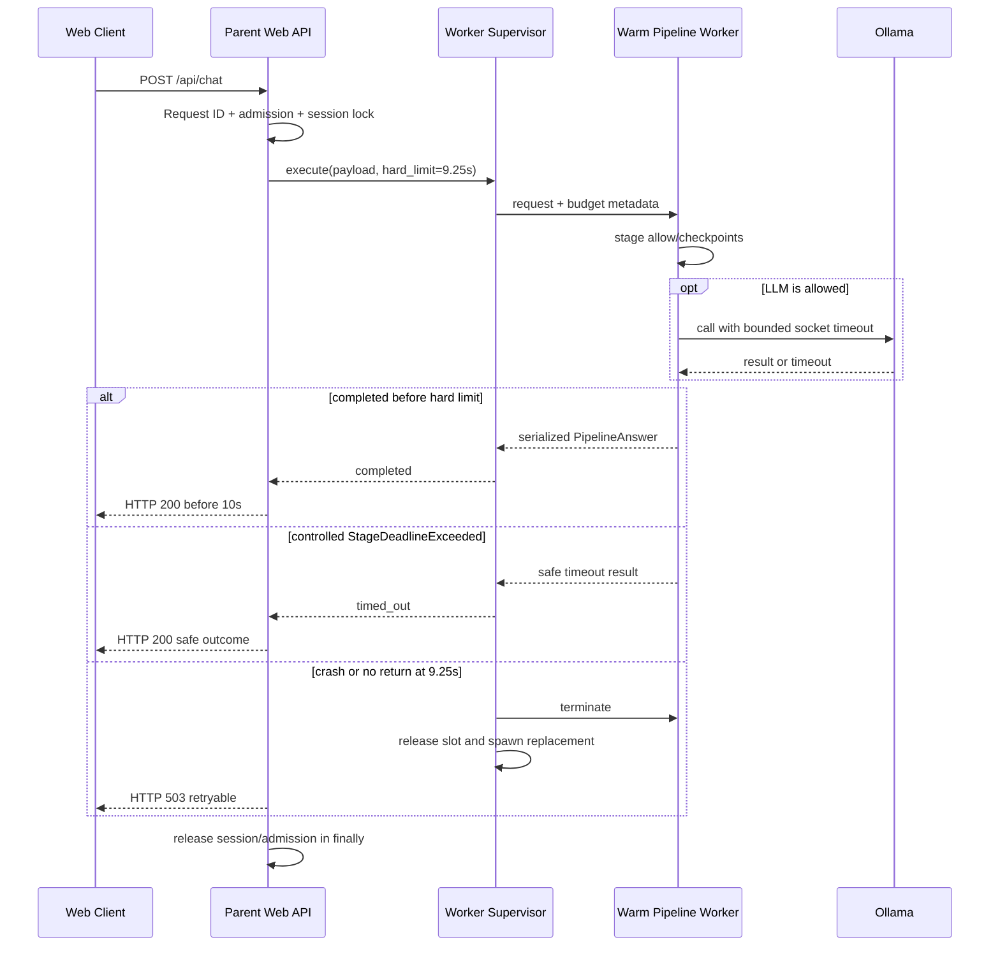

# Implementation Plan: Hard Deadline และ Pipeline Worker Supervision

วันที่จัดทำ: 1 กันยายน 2026

สถานะ: `unit_verified` (2 กันยายน 2026; focused slow regression ผ่านแล้ว แต่ HTTP load test ยังไม่ผ่าน)

Owner ที่แนะนำ: Runtime/API

อ้างอิง: [Master Plan 67](67_timeout_reliability_remediation_master_plan_20260901.md)

## 1. เป้าหมายและสถานะปัจจุบัน

ทำให้ SLA 10 วินาทีเป็นข้อจำกัดที่บังคับได้จริงตั้งแต่ Web API ถึง worker ไม่ใช่ timestamp ที่ตรวจเมื่อขั้นยาวจบแล้ว

ปัจจุบัน `request_deadline()` เก็บ deadline ใน `ContextVar`; `deadline_exceeded()` ถูกเรียกเฉพาะ checkpoint ใน Pipeline ส่วน `answer_with_structured_tool()`, `_try_deterministic()`, `contains_alias()` และ handler loops ไม่มีการยกเลิกภายใน จึงเริ่มขั้นตอนตอนเหลือไม่ถึงหนึ่งวินาทีแล้วทำงานต่อเกิน 20 วินาทีได้

## 2. หลักฐานจาก Log/Code พร้อม Case ID

### สิ่งที่ยืนยันจาก Log/Code

- `MB-0501-M-012`: หลัง Intent LLM ใช้ 7.777s ยังเริ่ม Deterministic 7.400s และ Vector 4.805s; ตรวจ deadline ที่ 20.472s
- `MB-0519-M-030`: ตรวจ deadline ที่ 24.627s
- `KIA-0460` และ `KIA-0486` ไม่มี LLM calls แต่ synchronous CPU work เกิน 10s
- Harness ใช้ watchdog 30s และระบุชัดว่าไม่ใช่ production deadline
- Web API ใช้ `ThreadingHTTPServer`; Pipeline รันใน request thread เดียวกัน จึงไม่มี safe mechanism สำหรับ kill เฉพาะงาน CPU ที่ค้าง

จุด code ปัจจุบัน:

- `app/pipeline/request_deadline.py`: cooperative timestamp/budget
- `app/pipeline/engine.py`: checkpoint ระหว่างบาง stage
- `app/web_api/server.py`: semaphore/session lock และ Pipeline call ใน HTTP thread
- `tools/run_current_flow_regression.py`: external worker watchdog สำหรับ evaluation เท่านั้น

## 3. Root Cause และสิ่งที่ยังพิสูจน์ไม่ได้

### สิ่งที่ยืนยันแล้ว

- Python thread ไม่สามารถถูก terminate อย่างปลอดภัยจาก thread อื่น
- Context deadline ไม่ preempt synchronous function
- Finalizer reserve ถูกใช้คำนวณ LLM timeout แต่ไม่ได้บังคับ CPU stages
- Stage เริ่มได้ตราบใดที่ deadline ยังไม่ติดลบ แม้ remaining ต่ำกว่าค่าใช้เวลาขั้นนั้น

### ข้อสันนิษฐานที่ต้องทดสอบ / สิ่งที่ยังพิสูจน์ไม่ได้

- Parent/worker serialization overhead ของ `PipelineAnswer`
- จำนวน persistent workers ที่เหมาะกับ target RAM
- เวลา warm replacement หลัง worker ถูก kill
- ความเข้ากันได้ของ model/cache initialization เมื่อใช้ Windows `spawn`

## 4. Target Behavior และ Invariants

ส่วนนี้เป็น **การออกแบบที่เสนอ (Proposed Design)** ค่าเวลาและจำนวน worker ต้องผ่านการทดสอบก่อนถือเป็น Production configuration

- Soft Pipeline deadline = 9.0s
- Parent hard worker limit = 9.25s
- Response serialization/send reserve ทำให้ API ceiling = 10.0s
- ทุก expensive stage ต้องผ่าน `allow_stage(required_sec)` ก่อนเริ่ม
- CPU loop checkpoint ต้องหยุดได้โดย controlled exception
- Parent process เป็นเจ้าของ HTTP socket, admission semaphore, session locks และ performance log
- Child worker ไม่มีสิทธิ์เขียน response โดยตรง
- Parent ต้อง release resources เพียงครั้งเดียวแม้ timeout/crash/race
- Request เดิมห้าม retry อัตโนมัติหลัง side-effect; FAQ pipeline ปัจจุบันเป็น read-only จึงไม่เกิด duplicate transaction
- Worker replacement ต้องได้ health/warmup pass ก่อนรับงาน

## 5. Mermaid Flow/Sequence Diagram



## 6. Interface, Data Structure, Config และ pseudocode

```python
class StageDeadlineExceeded(TimeoutError):
    stage: str
    elapsed_sec: float
    remaining_sec: float
    operation_count: int | None

class RequestBudget:
    def elapsed(self) -> float: ...
    def remaining(self) -> float: ...
    def allow_stage(self, stage: str, required_sec: float) -> bool: ...
    def checkpoint(self, stage: str, operation_count: int | None = None) -> None: ...
    def metadata(self) -> dict: ...
```

`allow_stage()` ต้องคำนวณจาก global remaining ลบ finalizer reserveและ stage minimum ไม่สร้าง deadline ใหม่ที่ยาวกว่า outer deadline

```text
if not budget.allow_stage("retrieval", 1.5):
  trace stage_skipped(reason="insufficient_budget")
  return verified fallback

for index, candidate in enumerate(candidates):
  if index % 4 == 0:
    budget.checkpoint("game_resolution", index)
  compare(candidate)
```

Supervisor contract:

```text
submit(request_id, payload, soft_deadline=9.0, hard_limit=9.25)
  -> completed(result)
  -> controlled_timeout(result)
  -> worker_failed(kind, retry_after_ms, crash_id)
```

API additions:

```json
{
  "timing_status": "timed_out",
  "timed_out": true,
  "timeout_stage": "game_resolution",
  "retryable": true
}
```

HTTP behavior:

| Condition | HTTP | `ok` | Mode/error |
|---|---:|---|---|
| Completed | 200 | true | Existing mode |
| Controlled soft timeout | 200 | true | `pipeline:request_timeout_no_answer` |
| Hard worker timeout/crash | 503 | false | `pipeline_worker_restarting` |
| Admission full | 503 | false | Existing `server_busy` |
| Same session locked | 409 | false | Existing `session_busy` |

Config defaults:

```text
PSU_PRODUCT_BACKEND_TIMEOUT_SEC=9.0
PSU_PIPELINE_FINALIZER_RESERVE_SEC=1.0
PSU_PIPELINE_WORKER_HARD_TIMEOUT_SEC=9.25
PSU_PIPELINE_WORKERS=4
PSU_PIPELINE_WORKER_MAX=8
PSU_PIPELINE_WORKER_RECYCLE_REQUESTS=500
```

## 7. ขั้นตอน Implement ตามลำดับ

1. ขยาย `RequestDeadline` หรือเพิ่ม `RequestBudget` โดยรักษา API เดิมของ `request_deadline()`
2. เพิ่ม stage budget registry และ helper `allow_or_skip_stage`
3. ใส่ checkpoint ใน resolver/retrieval loops ก่อน ครอบคลุม path ที่เคยค้าง
4. Catch `StageDeadlineExceeded` ที่ Pipeline boundary และสร้าง Safe Outcome ผ่าน finalizer เดิม
5. เพิ่ม incremental timeout trace ก่อน return
6. แยก Pipeline execution payload/result ให้ serialize ได้โดยไม่ส่ง lock/logger objects
7. เพิ่ม persistent worker process และ warmup handshake `starting → warming → ready → busy → draining/dead`
8. เพิ่ม Parent Supervisor queue, request map และ monotonic hard timer
9. เมื่อ hard timeout: mark request once, terminate child, discard late result, replace worker
10. ย้าย ownership ของ admission/session release ให้อยู่ Parent `finally` เท่านั้น
11. เพิ่ม health endpoint fields: worker counts, ready/busy/restarting, last crash และ warmup status
12. เปิด supervisor หลัง feature flag และรัน shadow timing ก่อนเปลี่ยน Web API path

## 8. Failure Modes และ Safe Fallback

| Failure | Required behavior |
|---|---|
| Stage budget ไม่พอ | Skip และใช้ verified fallback |
| `StageDeadlineExceeded` | Controlled HTTP 200 safe answer |
| Worker late result หลัง parent timeout | Discard ด้วย request generation token |
| Worker crash | 503 + retry_after; spawn replacement |
| Replacement warmup fail | Worker stays unavailable; health degraded; no traffic |
| Parent logger queue full | Drop progress events ก่อน start/failure events; increment counter |
| Client disconnect | Cancel pending result ownership; worker may finish but response discarded |
| Server shutdown | Stop admission, drain until bounded grace, terminate remaining children |
| Semaphore double release risk | Parent-owned lease object idempotent `release_once()` |

## 9. Logging/Metrics ที่ต้องเพิ่ม

- request accepted/queued/dispatched timestamps
- soft/hard deadline valuesและ remaining at every stage
- worker queue wait, execution, serialization and parent response time
- controlled vs hard timeout counters
- worker state transitions, PID, generation, exit code, replacement warmup time
- discarded late result count
- session/admission lease acquisition/release count
- API wall time measured from first byte read to response body ready

## 10. Unit, Integration, Regression และ Load Tests

- Nested budget cannot extend outer deadline
- `allow_stage()` reserves finalizer
- Synthetic loop calls checkpoint and stops inside stage
- Function without checkpoints is terminated by hard worker limit
- Late result after hard timeout is ignored
- Worker crash releases admission/session exactly once
- Replacement reaches ready without server restart
- Controlled timeout response matches old client contract
- Existing server_busy/session_busy behavior remains
- 13 slow cases complete/timeout safely within ceiling
- 30 concurrent requests never leave orphan locks/workers

## 11. Acceptance Criteria แบบวัดค่าได้

- Synthetic cooperative loop returns controlled result <=9.1s
- Synthetic non-cooperative loop yields parent response <=10.0s
- 0 late result reaches client after timeout
- 0 leaked admission/session leases across 10,000 fault-injected requests
- Worker replacement healthy without Parent restart
- All 13 historical slow cases return <=10s
- Existing API fields unchanged; new fields optional
- Health endpoint accurately reports worker states

## 12. Rollback และ Compatibility

- Feature flags แยก `PSU_REQUEST_BUDGET_V2` และ `PSU_PIPELINE_WORKER_SUPERVISOR`
- เปิด budget checkpoints ก่อน supervisor
- หาก serialization/worker pool มีปัญหา rollback ไป in-process path แต่คง checkpoints
- Parent response schema additions optional; Web client ต้องทำงานได้เมื่อ fields ไม่มี
- ห้ามใช้ hard process retry กับ booking/write operation ในอนาคตจนมี idempotency contract

## 13. Dependencies และลิงก์ไปเอกสารอื่น

- [67 Master Plan](67_timeout_reliability_remediation_master_plan_20260901.md)
- [68 Baseline](68_slow_case_baseline_and_regression_corpus_plan_20260901.md)
- [71 Bounded Resolver](71_bounded_game_entity_resolver_plan_20260901.md)
- [74 LLM Budget](74_local_llm_budget_health_and_fallback_plan_20260901.md)
- [75 Crash Recovery](75_windows_worker_crash_diagnosis_and_recovery_plan_20260901.md)
- [76 Observability](76_crash_resilient_stage_observability_plan_20260901.md)
- [77 SLA/Load/Rollout](77_end_to_end_sla_load_test_and_rollout_plan_20260901.md)
