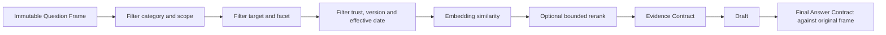

# รายงานสิ่งที่ยังไม่ผ่าน: Timeout, Answer Accuracy, Routing, RAG และ Worker Reliability

วันที่อัปเดต: 2 กันยายน 2026, Asia/Bangkok  
สถานะเอกสาร: `implementation_gap_analysis`  
ขอบเขต: วิเคราะห์จาก Full Regression 2,116 ข้อวันที่ 1 กันยายน 2026, Focused Slow Regression 13 ข้อวันที่ 2 กันยายน 2026, Source Code และ Smoke Tests ปัจจุบัน

เอกสารที่เกี่ยวข้อง:

- [66: ผลทดสอบ Full Model Regression 2,116 ข้อ](66_current_flow_full_model_regression_20260901.md)
- [67: Timeout and Reliability Master Plan](67_timeout_reliability_remediation_master_plan_20260901.md)
- [73: Target-Grounded RAG Plan](73_budgeted_target_grounded_rag_retrieval_plan_20260901.md)
- [75: Windows Worker Crash Diagnosis Plan](75_windows_worker_crash_diagnosis_and_recovery_plan_20260901.md)
- [77: End-to-End SLA and Load Test Plan](77_end_to_end_sla_load_test_and_rollout_plan_20260901.md)
- [Focused run summary: `20260902T061341Z`](../reports/slow_regression/20260902T061341Z/summary.json)

---

## 1. วิธีอ่านสถานะในเอกสารนี้

เอกสารนี้แยกหลักฐานเป็น 3 สถานะเพื่อไม่ให้ผลทดสอบชุดเล็กถูกตีความเกินจริง:

| สถานะ | ความหมาย |
|---|---|
| `ผ่านล่าสุด` | มีผลทดสอบหลังแก้โค้ดที่ตรวจเงื่อนไขนั้นโดยตรงและผ่าน |
| `ยังไม่ผ่าน` | ผลล่าสุดที่ตรวจเงื่อนไขนั้นโดยตรงยังพบ failure หรือ Source Code ยังขัดกับ Invariant ที่กำหนด |
| `ยังไม่ได้พิสูจน์` | มีการแก้หรือมี Unit/Focused Test แล้ว แต่ยังไม่มี Full Regression, Load Test หรือ Production-like evidence เพียงพอ |

ข้อสำคัญ:

- ตัวเลข FAQ `91.00%`, failure `144` ข้อ และ timeout `13` ข้อ มาจาก Full Regression **ก่อนการแก้ล่าสุด**
- Focused run หลังแก้ยืนยันได้เฉพาะ 13 slow cases ว่าจบเร็วขึ้นและไม่ crash ในรอบนั้น
- ยังไม่มี Full Regression 2,116 ข้อหลังแก้ จึงยังระบุไม่ได้ว่า failure ปัจจุบันเหลือกี่ข้อ
- ห้ามนำ `13/13 route_matches` ของ focused runner ไปแปลว่าเนื้อหาคำตอบถูกทุกข้อ เพราะชุดนี้ตรวจ route/status/latency เป็นหลัก และยังไม่มี Gold Answer Contract ครบทุกเคส

---

## 2. Executive Summary

### 2.1 สิ่งที่ผ่านแล้วในขอบเขตที่ทดสอบ

1. Slow cases เดิม 13 ข้อจบครบ `13/13` ภายใน 10 วินาที
2. ไม่มี Worker Timeout หรือ Worker Crash ใน focused run ล่าสุด
3. เวลาสูงสุดของ focused run ลดเหลือ `1.0752s`
4. Member/role cases เดิม 9 ข้อเข้า closed route `overview/members_lookup`
5. Multi-question case `MB-0618-C-007` เข้า `multi_question`
6. Unknown game cases `KIA-0486` และ `KIA-0487` จบด้วย Safe Outcome โดยไม่วน fuzzy lookup ยาว
7. Parent-owned performance log เขียน 456 events และ dropped 0 eventsในรอบ focused test

### 2.2 สิ่งที่ยังไม่ผ่านหรือยังมีข้อผิดพลาดยืนยันได้

1. RAG ยังมี Source Code ที่คำนวณ `second_score=0` เมื่อเหลือ candidate เดียว ทำให้ margin สูงเทียม
2. Semantic route lock ยังเกิดก่อน `QuestionFrame` ตัวเต็มในบาง path จึงยังมีโครงสร้างที่เปิดทางให้ target/facet ถูกเปลี่ยน
3. KIA-0460 ผ่านด้านเวลา แต่ semantic route ยังน่าสงสัย: คำถามเกี่ยวกับตัวอย่างรูปแบบ JSON ถูก route เป็น `equipment`
4. Worker Supervisor ค่าเริ่มต้นยังปิด ถ้า Production ไม่ตั้ง environment flag จะไม่ได้ hard containment ที่ focused runner ใช้
5. Windows `python.exe access violation` เดิมถูกครอบด้วย Supervisor ได้ แต่ยังไม่ทราบ root cause และยังไม่มี reproduction matrix/dump ครบ
6. Input Guard รอบเต็มเดิมยังมี false positive และ false negative; ยังไม่มีผล Full Regression หลังแก้ยืนยันว่าดีขึ้น
7. Local LLM fallback ผ่าน smoke tests แต่ยังไม่มีหลักฐาน accepted LLM ordering ใน Canonical flow และยังไม่ได้ทดสอบ all-LLM concurrency จริง
8. Active request default ใน code คือ 16 แต่ Deployment Plan เสนอ 32; ยังไม่มี load evidence ตัดสินค่าที่เหมาะสม

### 2.3 Release Gates ที่ยังไม่ได้พิสูจน์

| Release Gate | หลักฐานล่าสุด | สถานะ |
|---|---|---|
| Full FAQ accuracy ไม่ต่ำกว่า 91.00% | มีเฉพาะผลก่อนแก้ 91.00% | `ยังไม่ได้พิสูจน์` |
| เป้าหมาย FAQ กลับสู่ 94.31% | ยังไม่มีผลหลังแก้ | `ยังไม่ผ่านเป้าหมาย` |
| 0 request เกิน 10 วินาทีใน 2,116 ข้อ | focused 13 ผ่าน แต่ full ยังไม่รัน | `ยังไม่ได้พิสูจน์` |
| 0 harness timeout | focused 13 ผ่าน แต่ full ยังไม่รัน | `ยังไม่ได้พิสูจน์` |
| 0 worker crash | focused 13 ผ่านหนึ่งรอบ | `ยังไม่ได้พิสูจน์` |
| HTTP concurrency 5/10/20/30 users | ยังไม่รัน | `ยังไม่ได้พิสูจน์` |
| Session isolation ภายใต้ concurrent load | ยังไม่รัน | `ยังไม่ได้พิสูจน์` |
| Target hardware RTX 5060 8GB | ยังไม่รัน | `ยังไม่ได้พิสูจน์` |
| RAG ไม่ตอบผิด target/facet | มี known failures และ code gap | `ยังไม่ผ่าน` |
| Keyboard Guard ไม่ลด precision/recall | ยังไม่มี post-fix full result | `ยังไม่ได้พิสูจน์` |

**ข้อสรุปสถานะรวม:** ระบบอยู่ระดับ `unit_verified + focused_regression_verified` บางส่วน แต่ยังไม่ถึง `full_regression_verified` และยังไม่พร้อมเลื่อนเป็น `production_ready`

---

## 3. Timeout: อะไรหายแล้ว และอะไรยังค้าง

### 3.1 Slow cases เดิมเทียบกับ focused run ล่าสุด

| Case ID | ปัญหาเดิม | เวลาเดิมโดยประมาณ | ผลหลังแก้ | เวลาล่าสุด | สถานะ |
|---|---|---:|---|---:|---|
| MB-0499-M-010 | Harness timeout | 30.000s | structured member role | 1.017s | `ผ่านล่าสุด` |
| MB-0500-M-011 | Worker crash | 29.842s | structured member person | 0.105s | `ผ่านล่าสุด` |
| MB-0501-M-012 | Pipeline timeout ช้า | 20.473s | structured member role | 0.029s | `ผ่านล่าสุด` |
| MB-0503-M-014 | Harness timeout | 30.000s | structured member role | 0.098s | `ผ่านล่าสุด` |
| MB-0507-M-018 | Harness timeout | 30.014s | structured member person | 0.108s | `ผ่านล่าสุด` |
| MB-0518-M-029 | Harness timeout | 30.016s | structured member person | 0.107s | `ผ่านล่าสุด` |
| MB-0519-M-030 | Pipeline timeout ช้า | 24.628s | structured member role | 0.193s | `ผ่านล่าสุด` |
| MB-0618-C-007 | Harness timeout | 30.001s | multi-question splitter | 0.115s | `ผ่านล่าสุด` |
| MB-1229-M-049 | Harness timeout | 30.007s | structured member role | 0.082s | `ผ่านล่าสุด` |
| MB-1232-M-052 | Harness timeout | 30.006s | structured member role | 0.024s | `ผ่านล่าสุด` |
| KIA-0460 | Deterministic ช้า | 19.927s | structured equipment | 1.075s | `ผ่านเวลา / route ต้องทบทวน` |
| KIA-0486 | Structured + deterministic ช้า | 28.102s | game target unknown | 0.178s | `ผ่านล่าสุด` |
| KIA-0487 | Worker crash | 18.064s | game target unknown | 0.148s | `ผ่านล่าสุด` |

### 3.2 เหตุผลที่ยังสรุปว่า “Timeout หายทั้งหมด” ไม่ได้

Focused run ยืนยัน regression เฉพาะ slow cases ที่รู้จักแล้ว แต่ยังไม่ครอบคลุม:

- คำถามอีก 2,103 ข้อที่อาจเปลี่ยน route หลังแก้
- คำถามใหม่ที่มี alias จำนวนมาก, JSON ยาว หรือ game-like unknown title
- Local LLM queue ตอนมีหลาย request พร้อมกัน
- Retrieval embedding ตอน cache miss หลาย request พร้อมกัน
- HTTP overhead, browser/network latency และ serialization
- Session lock contention
- Worker replacement ระหว่างมีหลาย request
- Memory growth หลังรันหลายร้อย request

ดังนั้นสถานะที่ถูกต้องคือ:

```text
Known slow cases fixed in focused regression
!=
Global 10-second SLA proven
```

### 3.3 Supervisor ยังไม่ได้เปิดโดย default

Source Code ปัจจุบัน:

```text
PSU_PIPELINE_WORKER_SUPERVISOR default = false
PSU_PIPELINE_WORKER_RECYCLE_REQUESTS default = 500
PSU_MAX_ACTIVE_REQUESTS default = 16
```

Focused runner ตั้ง `PSU_PIPELINE_WORKER_SUPERVISOR=1` เอง ดังนั้นผล focused run ไม่ได้ยืนยันว่า deployment จริงเปิด Supervisor แล้ว

**ความเสี่ยง:** ถ้า server เริ่มโดยไม่มี flag งาน CPU/native call ที่ค้างอาจยังทำให้ request เกิน 10 วินาที เพราะ cooperative deadline เพียงอย่างเดียวหยุด synchronous operation ที่ไม่คืน control ไม่ได้

**สิ่งที่ต้องทำ:**

1. เพิ่ม deployment validation ตอน startup
2. ใน staging/production ให้ fail readiness เมื่อ policy กำหนด Supervisor แต่ flag ไม่ถูกเปิด
3. Log effective configuration โดยไม่เปิดเผย secret
4. ตรวจด้วย HTTP request ว่า response มี `worker_id`, `timing_status` และ retryable behavior ตามที่ออกแบบ

### 3.4 Stage timeout ยังไม่เท่ากับ hard cancellation ทุกกรณี

`RequestBudget` และ checkpoint ช่วยป้องกันไม่ให้เริ่ม stage เมื่อเวลาไม่พอ และหยุด loop ที่เรียก checkpoint เป็นระยะ แต่ operation ต่อไปนี้ยังต้องพึ่ง timeout ของตัวเองหรือ Supervisor:

- Native library call ที่ค้าง
- HTTP/socket call ที่ไม่เคารพ timeout
- Model runtime ที่ process ไม่คืนผล
- CPU loop ที่ไม่มี checkpoint ภายใน
- File/database lock ที่ค้าง

**Acceptance ที่ยังไม่ผ่าน:** synthetic infinite loop, blocked socket และ forced native-like worker hang ต้องตอบผู้ใช้ภายใน 10 วินาทีผ่าน Web API จริง ไม่ใช่เพียง Unit Test ของ budget object

---

## 4. Answer Accuracy ที่ยังไม่ผ่าน

### 4.1 Full Regression ล่าสุดยังอยู่ที่ 91.00%

ผล Full Regression ก่อนแก้ล่าสุด:

| ตัวชี้วัด | Baseline ก่อนหน้า | Full run 1 Sep | Gap |
|---|---:|---:|---:|
| FAQ strict pass | 1,509/1,600 | 1,456/1,600 | -53 cases |
| FAQ pass rate | 94.31% | 91.00% | -3.31 percentage points |
| Previously passing แล้วตก | - | 56 | ต้องห้ามเพิ่ม |
| Previously failing แล้วดีขึ้น | - | 3 | ยังชดเชย regression ไม่ได้ |

Failure 144 ข้อในรอบนั้นแบ่งเป็น:

| กลุ่ม failure | จำนวน | สถานะหลังแก้ล่าสุด |
|---|---:|---|
| `semantic_rag_dynamic` | 66 | ยังไม่มี full rerun; code gap บางส่วนยังอยู่ |
| Pilot catalog clarification | 28 | ยังไม่มี union catalog/coverage verification |
| Input Guard retype | 26 | ยังไม่มี full rerun |
| Structured game detail contract | 12 | ยังไม่มี semantic/human review ครบ |
| Timeout/worker failure | 10 | 10 FAQ slow casesผ่าน focused run แต่ full ยังไม่รัน |
| อื่น ๆ | 2 | ยังไม่มี full rerun |

**สิ่งที่ห้ามสรุป:** ห้ามลบ failure เดิม 10 timeout ออกจาก 144 แล้วประกาศว่าเหลือ 134 เพราะ route/answer ของข้ออื่นอาจเปลี่ยนจากการแก้ครั้งนี้ ต้องรันครบใหม่เท่านั้น

### 4.2 Known wrong-target และ wrong-facet cases

| Case | คำถาม | ผลผิดเดิม | Contract ที่ควรเป็น |
|---|---|---|---|
| MB-0093-G-005 | Counter-Strike 2 คือเกมอะไร | ตอบทักษะจาก Overcooked! 2 | target ต้องเป็น CS2 และ facet ต้องเป็น game overview |
| MB-0089-G-001 | VALORANT คือเกมอะไร | ตอบข่าวการแข่งขัน VALORANT | target ถูก แต่ facet ผิด; ต้องตอบ game overview |
| MB-0797-AG-136 | มี Overcooked! 2 ไหม | ตอบประโยชน์ของเกม | ต้องตอบ availability หรือ no-answer เมื่อ source ยืนยันไม่ได้ |

Smoke tests ที่ผ่านหลังแก้ช่วยลดความเสี่ยง แต่ยังไม่มี Full Regression ที่ยืนยันว่า known cases และ mutation รอบข้างผ่านทั้งหมด

---

## 5. RAG และ Question Frame ที่ยังมีช่องโหว่

### 5.1 Semantic Route Lock ยังมาก่อน Question Frame ตัวเต็มบางเส้นทาง

ใน `engine.py` ปัจจุบันมี semantic route refinement/lock ช่วงต้น และสร้าง `question_frame` ตัวเต็มภายหลังอีกช่วงหนึ่ง โครงสร้างนี้ทำให้เกิดความเสี่ยงว่า:

1. Semantic Retrieval เลือกเอกสารที่คล้ายในเชิงภาษา
2. Route ถูก lock ตามเอกสาร
3. Question Frame ภายหลังพบ target/facet ที่ต่างออกไป
4. Route lock เดิมถูก restore หรือมีอิทธิพลเหนือข้อบังคับจากคำถามต้นฉบับ

Member path มี early frame/closed route แล้ว แต่ยังไม่ใช่ invariant เดียวกันทุก category

**Target behavior:** ต้องมี `OriginalQuestionFrame` ที่ immutable ก่อน semantic route refinement ทุก path และทุก retrieval/validation ต้องอ้าง object เดียวกัน

### 5.2 Candidate เดียวสร้าง margin สูงเทียม

ใน `semantic_vector_retrieval.py` ยังมี logic ลักษณะนี้สองตำแหน่ง:

```python
second_score = candidate_2_score if len(candidates) > 1 else 0.0
margin = top_score - second_score
```

เมื่อเหลือ candidate เดียว `margin` จะเท่ากับ `top_score` ทั้งที่ไม่มีคู่แข่งให้เปรียบเทียบ นี่เป็นสาเหตุเชิงโครงสร้างที่เคยทำให้เอกสารผิดเกมดูมั่นใจ

**ต้องแก้เป็น:**

```python
second_score = None
margin = None
```

และ candidate เดียวต้องผ่าน:

- absolute similarity threshold
- exact/approved target alignment
- facet compatibility
- category/scope/trust/effective-date filter
- source version compatibility

### 5.3 Target/facet filtering ยังต้องบังคับก่อน similarity scoring

การมี target guard ตอนปลายช่วยป้องกันบางคำตอบ แต่ยังไม่ใช่วิธีที่ประหยัดและปลอดภัยที่สุด หาก candidate ผิด target ถูก embed/score/rerank ก่อนแล้วค่อย veto ระบบยังเสียเวลาและเพิ่มโอกาส route drift

ลำดับที่ต้องเป็น:



### 5.4 Final Answer Contract ยังต้องตรวจ original obligations

Validation ต้องไม่ตรวจเพียงว่า answer มี citation หรือ evidence ที่มีอยู่จริง แต่ต้องตรวจว่า evidence และ answer ตรงกับ:

- original target
- original facet
- requested action เช่น overview/availability/rule/price
- source category
- source version
- effective date
- conflict status

ถ้า route เปลี่ยนระหว่างทาง Final Contract ต้องเทียบกับคำถามต้นฉบับ ไม่ใช่ route ที่ถูก semantic override แล้ว

---

## 6. Routing ที่ยังต้องแก้และพิสูจน์

### 6.1 KIA-0460 ผ่านเวลาแต่ยังไม่ผ่าน semantic review

Focused result ของ `KIA-0460`:

```text
mode: pipeline:structured_equipment_catalog
route: equipment/list
wall: 1.0752s
```

กรณีนี้เกี่ยวกับข้อความตัวอย่าง/รูปแบบ JSON และมีคำว่า `zone` หรือข้อมูลอุปกรณ์อยู่ใน payload จึงถูกจับเป็น equipment แม้เจตนาหลักอาจเป็นการถามรูปแบบ response ไม่ใช่ขอรายการอุปกรณ์

Focused manifest ตั้ง expected route เป็น `equipment` ตามพฤติกรรมที่สังเกต จึงทำให้ `route_match=true` แต่ค่านี้เป็น **operational expectation ไม่ใช่ human-approved semantic gold**

**สิ่งที่ต้องทำ:**

1. แยก code block/JSON payload ออกจากข้อความคำสั่งหลัก
2. สร้าง `meta_or_format_request` signal
3. ห้าม entity terms ภายในตัวอย่าง JSON ชนะ user intent นอก code block โดยอัตโนมัติ
4. ให้ Human Review ตัดสิน expected route/answer ของ KIA-0460
5. ห้ามแก้ expected route ให้ตาม implementation เพื่อทำให้ test ผ่าน

### 6.2 Unknown game Safe Outcome ต้องตรวจ recall

`KIA-0486` และ `KIA-0487` จบเร็วด้วย `game_target_unknown` ซึ่งปลอดภัยกว่าการ fuzzy match ผิดเกม แต่ policy ที่เข้มขึ้นอาจทำให้:

- เกมใหม่ที่เพิ่ง publish แต่ index ยังไม่ reload ถูกมองว่า unknown
- alias จริงที่ไม่มีใน catalog ถูกปฏิเสธ
- ชื่อเกมสั้นหรือ franchise ถูก clarification มากเกินไป

ต้องมี known-game, new-game, alias, typo, short-title และ unknown lookalike corpus แยกกัน ก่อนสรุปว่า safety gain ไม่ทำให้ recall ลดเกินเกณฑ์

### 6.3 Corpus ที่วางแผนเพิ่มยังไม่ครบ

เอกสาร 68 กำหนดให้เพิ่มอย่างน้อย:

- member/role 50 ข้อ
- known games 25 ข้อ
- unknown games 25 ข้อ
- strings ที่คล้ายชื่อเกมแต่ไม่ใช่เกม
- ambiguous short names และ franchise names

Focused run ปัจจุบัน preserve เพียง 13 cases เดิม จึงยังไม่ครอบ routing boundary ใหม่

---

## 7. Input Guard ที่ยังไม่ผ่าน

### 7.1 ผลเดิมของ Keyboard 500

| Detector | Precision | Recall | ปัญหา |
|---|---:|---:|---|
| Keyboard layout mismatch | 100% ใน 499 observed cases | 100% ใน 499 observed cases | ยังไม่ใช่ blind/live-user estimate |
| Repeated character | 98.86% | 86.50% | FN 27, FP 2, unobserved 1 |

Repeat misses 27 ข้อ:

- mixed layout + repeat 13
- Thai internal repeat 7
- Thai vowel/mark repeat 5
- short token 2

Known false positives:

- `KIA-0470`: “วันนี้เปิดไหม???” ถูกมองว่า `นน` ใน “วันนี้” เป็น typo
- Normal FAQ บางข้อ เช่น “จอง PS5 ต้องทำยังไง”, “วันนี้เปิดไหม”, “ช่วยยกตัวอย่าง” ถูกขอให้พิมพ์ใหม่ใน full run

### 7.2 Policy disagreement ยังไม่ถูกตัดสิน

มี 127 cases ที่ label เดิมต้องการ `warn/continue` แต่ runtime policy เลือก `ask_retype` การเปลี่ยน label ให้ตรง runtime จะทำให้ตัวเลขดูดีขึ้นแต่ไม่แก้ product decision

ต้องให้ Product Owner เลือก policy ชัดเจน:

- Layout mismatch ที่ confidence สูง: `ask_retype`
- Repeat anomaly ที่ยังอ่านได้: `warn_and_continue` หรือ `ask_retype`
- ข้อความสั้น/กำกวม: clarification โดยไม่เดาคำ

### 7.3 Output เมื่อ Detector ตัดสินว่าผิดภาษา

ระบบปัจจุบันไม่ auto-correct และไม่แปลข้อความ แต่ตอบให้ผู้ใช้พิมพ์ใหม่:

> เหมือนข้อความอาจพิมพ์โดยใช้ภาษาแป้นพิมพ์ไม่ตรงกัน กรุณาตรวจสอบภาษาแป้นพิมพ์แล้วพิมพ์คำถามใหม่อีกครั้งครับ

สำหรับตัวอักษรซ้ำ:

> ข้อความนี้อาจมีตัวอักษรซ้ำโดยไม่ตั้งใจ กรุณาตรวจสอบและพิมพ์คำถามใหม่อีกครั้งครับ

แนวทางนี้ยังเหมาะกับ requirement ที่ต้องการ detect-only แต่ threshold และ context rules ต้องผ่าน full regression/held-out negative set ก่อน enforce จริง

---

## 8. Local LLM ที่ยังไม่ผ่าน

### 8.1 สิ่งที่ผ่านแล้ว

- Queue wait ถูกจำกัดเริ่มต้น 0.2 วินาที
- Intent LLM และ Composer มี role-specific timeout/budget
- Circuit Breaker เปิดหลัง failure ต่อเนื่องตาม policy
- เมื่อ LLM ช้าหรือไม่พร้อมสามารถใช้ verified draft fallback
- Smoke tests ครอบ delayed model, invalid response, cooldown และ fallback บางส่วน

### 8.2 สิ่งที่ยังไม่มีหลักฐานเพียงพอ

1. Canonical Pilot full run เดิมมี accepted LLM ordering `0` ครั้ง
2. CP-04/CP-05 timeout ประมาณ 3 วินาที
3. CP-08/CP-09/CP-10 ถูกข้ามเพราะ cooldown
4. ยังไม่มี concurrent all-LLM-attempt test 5/10/20/30 users
5. ยังไม่มี breakdown production-like ของ queue/load/prompt-eval/generation ทุก role
6. ยังไม่พิสูจน์ว่าการใช้ model context 2,048/3,072 ทำงานบน target hardwareภายใน SLA ทุก prompt class

**ข้อสรุป:** Verified draft fallback ผ่านในระดับหนึ่ง แต่ยังกล่าวไม่ได้ว่า Local LLM Composer/Ordering มีความเสถียรและช่วยคุณภาพจริงภายใต้ load

---

## 9. Worker Crash และ Recovery ที่ยังไม่ผ่าน

### 9.1 สิ่งที่ทราบ

- Full run เดิมพบ Windows fatal access violation อย่างน้อยใน worker logs 2 เหตุการณ์
- `MB-0500` และ `KIA-0487` ถูกจัดเป็น crash/unobserved ในผลเดิม
- Focused rerun ของสอง case ผ่านโดยไม่ crash
- Supervisor สามารถตรวจ worker exit/timeout และสร้าง replacement ตาม smoke/focused tests

### 9.2 สิ่งที่ยังไม่ทราบ

- crash เกิดจาก bundled Python, system Python, native dependency, diagnostics, memory pressure หรือ interaction ระหว่างองค์ประกอบใด
- case ใดเป็นตัวกระตุ้นจริง เพราะ worker log อาจจบที่ request ก่อนหน้า
- crash เกิดซ้ำได้กี่ครั้งใน 100/500 iterations
- RSS/thread count เพิ่มขึ้นก่อน crash หรือไม่
- Local dump ชี้ native module ใด

### 9.3 Recovery ยังไม่ครบทุกเงื่อนไข

มี request-count recycle ทุก 500 requests แต่แผน RSS-based recycle ที่ `1.5x warm baseline` ยังต้องยืนยัน/ทำให้ครบ พร้อม hysteresis เพื่อไม่ recycle ถี่เกินไป

ต้องทดสอบ forced worker kill ระหว่าง:

- fuzzy resolution
- embedding request
- LLM generation
- validation
- parentกำลังถือ request/session lock

Request ถัดไปต้องทำงานได้ และ semaphore/session lock ต้องถูกคืนทุกครั้ง

---

## 10. Observability ที่ยังไม่ครบ

Focused run ยืนยันว่า Parent Logger เขียน event ได้และไม่เก็บ field ต้องห้ามตาม smoke tests แต่ยังมี gap:

1. ต้องพิสูจน์ว่า kill worker กลาง stage แล้วยังเห็น `stage_started` ล่าสุดก่อนตาย
2. ต้องมี `stage_progress` สำหรับ bounded loops โดยไม่ log alias/question content
3. Analyzer ต้องคำนวณ critical path โดยไม่บวก stages ที่ซ้อนกัน
4. ต้องรายงาน P50/P95/P99/Max แยก queue, worker, retrieval, LLM และ finalization
5. ต้องแยก `pipeline_timeout`, `hard_timeout`, `native_access_violation`, `worker_restarting` และ `unobserved`
6. ต้องมี retention/rotation policy ก่อน Production
7. ต้องยืนยันว่า Chat Log, Performance Log และ Booking PII แยก storage/access policy จริง

หาก worker crash ก่อนส่ง event เริ่ม stage และ Parent มีเพียง request_started ระบบจะบอกได้แค่ว่า worker หาย แต่ยังชี้ critical stage ไม่ได้

---

## 11. Concurrency และ Capacity ที่ยังไม่ได้พิสูจน์

### 11.1 Config ยังเป็นสมมติฐาน

| Config | Code/default ปัจจุบัน | ค่าในแผน | สถานะ |
|---|---:|---:|---|
| Active requests | 16 | 32 | ยังไม่มี load evidence |
| Pipeline workers | เปิดเมื่อกำหนด flag | 4 เริ่มต้น | focused run เท่านั้น |
| CPU worker scale | ยังต้องวัด | สูงสุด 8 | ยังไม่พิสูจน์ RSS gate |
| LLM concurrency | 1 | 1 | ยังไม่ทดสอบ load จริง |
| LLM queue wait | 0.2s | 0.2s | smoke/focused verified |
| Worker recycle | 500 requests | 500 + RSS gate | RSS gate ยังไม่ verified |

การเพิ่ม active requests จาก 16 เป็น 32 โดยไม่มี worker/queue/RSS evidence อาจเพิ่ม response rejection น้อยลงแต่ทำให้ memory pressure และ tail latencyสูงขึ้น

### 11.2 Scenarios ที่ยังต้องรัน

1. 5 users: fast-heavy
2. 10 users: mixed Fast/RAG/LLM
3. 20 users: mixed และ cache-cold
4. 30 users: all-LLM-attempt เพื่อยืนยัน fallback ไม่รอ queue
5. worker crash ระหว่าง load
6. cache rebuild/release switch ระหว่างมี traffic
7. session เดียวหลาย request และหลาย session พร้อมกัน

Metrics ขั้นต่ำ:

- response P50/P95/P99/Max
- request >10s count
- HTTP 200/429/503/500 counts
- queue wait P95
- active worker utilization
- RSS/VRAM peak
- worker replacement count
- LLM accepted/fallback/timeout counts
- answer contract pass rateแยก route

---

## 12. Test Coverage ที่ยังขาด

| Test Tier | สถานะ | สิ่งที่ขาด |
|---|---|---|
| Unit/smoke | ผ่านหลายชุด | mutation/edge cases เพิ่มเติม |
| Slow 13 | ผ่านล่าสุด | Gold Answer Contract และ human semantic review ไม่ครบ |
| Focused 100+ | ยังไม่รัน/Corpus ยังไม่ครบ | member/game/unknown/lookalike/JSON |
| Full 2,116 model-enabled | ยังไม่รันหลังแก้ | ตัวเลข accuracy/timeout ปัจจุบัน |
| New-content holdout | ยังไม่รัน | พิสูจน์ RAG รับข้อมูลใหม่โดยไม่แก้ route |
| HTTP concurrency | ยังไม่รัน | 5/10/20/30 users |
| Crash matrix | ยังไม่รันครบ | Python/runtime/diagnostics/process reuse |
| Target hardware | ยังไม่รัน | i5-14400, RAM 32GB, RTX 5060 8GB |

ต้องสร้าง run directory ใหม่ทุกครั้งและห้ามเขียนทับ raw output เดิม พร้อมเก็บ:

- run ID
- source/data/model/config hashes
- effective feature flags
- hardware/runtime fingerprint
- results JSONL
- parent performance log
- crash/worker diagnostics
- machine-readable metrics
- human-readable analysis

---

## 13. ลำดับงานที่ต้องทำต่อ

### P0: ต้องทำก่อนรัน Full Regression

1. แก้ single-candidate RAG margin ให้เป็น nullable
2. สร้าง immutable Question Frame ก่อน semantic route lock ทุก path
3. บังคับ target/facet/source/version filter ก่อน similarity scoring
4. ตรวจ KIA-0460 ด้วย Human Gold และแยก JSON/code block intent
5. เพิ่ม focused corpus ตามแผน 68 ให้ครบอย่างน้อย 100 ข้อ
6. เพิ่ม deployment assertion สำหรับ Supervisor และ effective config log
7. เพิ่ม forced worker-kill test ที่ยืนยัน lock/semaphore cleanup

### P1: Full Regression และการกู้ Accuracy

1. รัน focused 100+
2. รัน FAQ 1,600 + Keyboard 500 + Canonical 16 แบบ model-enabled
3. เปรียบเทียบทุก ID กับ baseline โดยห้ามแก้ Gold ระหว่าง run
4. แยก failure เป็น target, facet, source, route, mode-label, guard, timeout และ paraphrase
5. Human review เคส paraphrase และ semantic mismatch
6. แก้ regression จน strict passไม่ต่ำกว่า 91.00% และไม่มี previously-passing case ตกจาก latency fix
7. เป้าหมายคุณภาพถัดไปคือกลับสู่ `>=94.31%`

### P2: Reliability และ Load

1. ทำ Windows crash reproduction matrix
2. เปิด Supervisor ใน staging
3. รัน HTTP load 5/10/20/30 users
4. ปรับ active requests/workers จากหลักฐาน queue/RSS ไม่ใช้ค่าคาดเดา
5. ทดสอบ worker crash, model unavailable และ embedding timeout ระหว่าง load
6. รันทวนบน target server

### P3: Rollout

1. เปิด feature flags ตามลำดับ: resolver shadow -> route correction -> hard deadline -> supervisor -> RAG/LLM budgets
2. มี rollback trigger สำหรับ accuracy, timeout, crash และ memory
3. Monitor อย่างน้อยหนึ่ง observation window ที่ครอบ trafficจริง
4. ค่อยเลื่อนสถานะเป็น `production_ready` เมื่อทุก Release Gate ผ่าน

---

## 14. Acceptance Checklist

### Timeout and Reliability

- [ ] Full 2,116 run มี request >10s เท่ากับ 0
- [ ] Harness timeout เท่ากับ 0
- [ ] Worker crash เท่ากับ 0 ใน full run
- [ ] Forced worker hang ตอบภายใน 10s และ worker ถัดไปพร้อมใช้งาน
- [ ] Supervisor เปิดจริงใน staging/production configuration
- [ ] Request/session locks ถูกคืนหลัง timeout/crash ทุกกรณี

### Answer Quality

- [ ] FAQ strict pass ไม่ต่ำกว่า 91.00%
- [ ] ไม่มี previously-passing case ตกจากการแก้ latency
- [ ] เป้าหมาย FAQ >=94.31% ก่อน final rollout หรือมี owner-approved exception ที่บันทึกชัด
- [ ] MB-0093-G-005 ไม่ตอบข้ามเกม
- [ ] MB-0089-G-001 ไม่ตอบผิด facet
- [ ] MB-0797-AG-136 ตอบ availability/no-answer ตาม source ที่ยืนยันได้
- [ ] KIA-0460 มี human-approved route/answer contract

### RAG

- [ ] Question Frame ถูกสร้างก่อน semantic route lock ทุก path
- [ ] Candidate เดียวไม่มี artificial margin
- [ ] Retrieval filter target/facet/version ก่อน similarity scoring
- [ ] Final Contract เทียบกับ original immutable frame
- [ ] New-content holdout ตอบได้โดยไม่เพิ่ม route/alias handler รายเกม

### Guard

- [ ] Layout precision/recall ไม่ลดจาก baseline ที่สังเกตได้
- [ ] Repeat precision/recall ไม่ลด และ false positive ปกติไม่เพิ่ม
- [ ] “วันนี้เปิดไหม???” ไม่ถูก block อย่างผิดพลาด
- [ ] Product Owner อนุมัติ policy warn/continue เทียบกับ ask_retype
- [ ] ไม่มี silent auto-correction

### LLM

- [ ] LLM timeout ไม่ทำให้ request เกิน 10s
- [ ] Queue wait รวมใน Global Deadline
- [ ] all-LLM-attempt load ใช้ fallback แทนการรอคิวเกิน budget
- [ ] มี accepted LLM output ที่ผ่าน Contract ใน test ที่ออกแบบมาวัด LLM โดยตรง
- [ ] LLM ไม่สร้างหรือเปลี่ยนข้อเท็จจริง PSU

### Load and Deployment

- [ ] HTTP concurrency 5/10/20/30 ผ่าน
- [ ] P99 และ Max ไม่เกิน 10s ตาม release policy
- [ ] RSS/VRAM อยู่ใน threshold ที่กำหนดจาก warm baseline
- [ ] ทดสอบบน i5-14400, RAM 32GB, RTX 5060 8GB
- [ ] มี rollback artifact และ config snapshot

---

## 15. คำตัดสินปัจจุบัน

### สิ่งที่กล่าวได้อย่างมั่นใจ

- การแก้ member routing, bounded resolver, request context และ Safe Outcome ทำให้ 13 slow/crash cases เดิมจบภายใน 1.076 วินาทีใน focused run ล่าสุด
- Known slow paths ดีขึ้นอย่างมากในขอบเขตที่ทดสอบ
- Supervisor และ parent performance logging ทำงานใน focused/smoke environment

### สิ่งที่ยังกล่าวไม่ได้

- ยังกล่าวไม่ได้ว่าระบบไม่มี timeout ทั้งหมด
- ยังกล่าวไม่ได้ว่าคะแนน FAQ หลังแก้ยังอยู่ที่ 91.00% หรือกลับสู่ 94.31%
- ยังกล่าวไม่ได้ว่า RAG ไม่ตอบผิด target/facet
- ยังกล่าวไม่ได้ว่า Worker Crash ถูกแก้ที่ต้นเหตุ
- ยังกล่าวไม่ได้ว่ารองรับ 30 users พร้อมกัน
- ยังกล่าวไม่ได้ว่า Production เปิด Supervisor และใช้ config เดียวกับชุดทดสอบ

### Final Status

```text
Latency fix for known 13 cases: PASS
Global 10-second SLA: UNVERIFIED
Full answer accuracy after fix: UNVERIFIED
RAG target/facet safety: NOT YET PASSING
Windows crash root cause: NOT IDENTIFIED
Concurrent production readiness: UNVERIFIED
Overall production readiness: NOT READY
```

งานถัดไปที่มีผลสูงสุดคือแก้ immutable Question Frame และ single-candidate RAG margin จากนั้นสร้าง focused 100+ corpus แล้วรัน Full 2,116 ใหม่ ก่อนเริ่ม HTTP load test การเพิ่ม RAG priorityหรือเพิ่มจำนวน workerก่อนปิดช่องว่างเหล่านี้อาจทำให้ระบบเร็วขึ้นเฉพาะบางกรณี แต่ยังตอบผิดเรื่องหรือเกิด tail latency ภายใต้ load ได้
