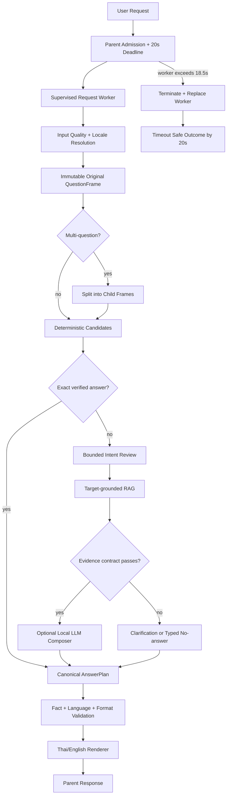
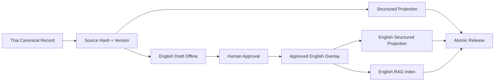

# รายการปัญหาปัจจุบันและ Flow แก้ไข Bilingual Chatbot แบบครบวงจร

วันที่อัปเดต: 11 กันยายน 2026, Asia/Bangkok  
สถานะเอกสาร: `implementation_ready_remediation_plan`  
ขอบเขต: FAQ Chatbot, Fast/Structured/Rule, Semantic RAG, Local LLM, Thai/English rendering, Timeout, Worker, Logging และ Evaluation  
Model ปัจจุบัน: `scb10x/typhoon2.5-qwen3-4b` ผ่าน Local Ollama  
เวลาสูงสุดที่ออกแบบรอบนี้: ผู้ใช้ต้องได้รับผลลัพธ์ภายใน 20 วินาที

เอกสารนี้สรุปจาก:

- Thai regression 1,600 ข้อ และ English Shadow 1,600 ข้อ วันที่ 11 กันยายน 2026
- Raw logs ใน `reports/bilingual_english/supervised_full_th_en_1600_20260911/`
- เอกสาร 67-78 และ Source Code ปัจจุบัน
- ค่าเริ่มเว็บใน `start_local_web_chat.ps1`

---

## สถานะการ Implement รอบล่าสุด (11 กันยายน 2026)

รายการนี้บันทึกเฉพาะสิ่งที่แก้ใน Source Code และผ่าน focused verification แล้ว ไม่ใช่ผลแทน Full Regression/Load Test:

| รายการ | สถานะ | สิ่งที่ทำจริง | หลักฐานยืนยัน |
|---|---|---|---|
| P0 worker containment | `implemented_focused_verified` | เปิด `PipelineWorkerSupervisor` ใน local web profile, จำกัด IPC enqueue, kill fallback และ worker recycle | `smoke_test_pipeline_worker_supervisor.py` และ forced timeout/recovery ผ่าน; Web API จริงบน port 8091 ตอบได้ผ่าน supervised worker |
| Parent response reserve | `implemented_focused_verified` | Parent reserve 1.5 วินาที จึง terminate/restart worker ที่ 18.5 วินาทีภายใต้ product ceiling 20 วินาที | ตรวจ `_supervisor_worker_timeout_sec() == 18.5` |
| P1-10 single-candidate RAG margin | `implemented_focused_verified` | candidate เดียวใช้ `second_score=None`, `margin=None`; ไม่สร้าง confidence จากอันดับสองเทียม | `smoke_test_semantic_target_filter.py` ผ่าน |
| P1-05 English multi-question | `implemented_focused_verified` | แยก English intent สองส่วนแบบ guarded และ carry service เฉพาะเมื่อมี explicit pronoun | `smoke_test_english_compound_split.py` ผ่าน; `price + booking` ตอบครบสอง child |
| P1-07 English Thai-prose leak | `implemented_focused_verified` | ชื่อทางการจาก source ใช้ได้ แต่ role/affiliation ที่ยังไม่ approved ต้องคืน English missing-localization | `smoke_test_bilingual_pipeline.py` และ `smoke_test_english_format_parity_fixes.py` ผ่าน |
| P1-04 wrong competition target | `implemented_focused_verified` | เพิ่ม target `ROV/AOV`, check-in phrase guard และไม่เลือก competition chunk ที่ไม่มี lexical/target support | focused English ROV case คืน missing-localization โดยไม่สลับไป VALORANT/game catalog |

สิ่งที่ยัง **ไม่ถือว่าผ่าน**: Full Thai 1,600 regression, English Gold/Shadow full run, forced infinite-loop timeout, Windows crash reproduction, AnswerPlan กลาง, approved English coverage และ HTTP load 5-30 users.

---

## 1. วิธีอ่านสถานะของปัญหา

| สถานะ | ความหมาย |
|---|---|
| `ยืนยันล่าสุด` | มีหลักฐานจากรอบ 3,200 ข้อล่าสุดหรือ Source Code ปัจจุบัน |
| `ยืนยันจากอดีต/ต้องทดสอบซ้ำ` | เคยเกิดจริง แต่รอบล่าสุดไม่ได้ตรวจเงื่อนไขนั้นโดยตรง |
| `ช่องว่างการพิสูจน์` | ยังไม่มี Test ที่เพียงพอ จึงห้ามสรุปว่าผ่าน |
| `ข้อเสนอ` | สถาปัตยกรรมเป้าหมายที่จะ Implement ตามเอกสารนี้ |

หลักสำคัญคือห้ามตีความ `ไม่มี crash ใน serial run` ว่า `ระบบรองรับหลาย User แล้ว` และห้ามตีความ `no-answer` ว่าเป็นคำตอบผิดเสมอไป หากคำถามนั้นอยู่นอกขอบเขต PSU ที่ระบบตั้งใจไม่ตอบ

---

## 2. ผลล่าสุดที่ยืนยันได้

| Metric | Thai 1,600 | English Shadow 1,600 |
|---|---:|---:|
| Content/contract pass | 1,388 (86.75%) | 1,061 (66.31%) |
| P50 หลังตัด watchdog escape | 0.767s | 0.030s |
| P95 หลังตัด watchdog escape | 10.390s | 2.927s |
| คำขอปกติที่ใช้เวลา >=10s | 89 | 4 |
| Watchdog escape | 1 | 1 |
| Worker crash ที่บันทึกในรอบนี้ | 0 | 0 |
| Harness timeout ที่บันทึกในรอบนี้ | 0 | 0 |

ผลจับคู่ Thai-English ด้วย `source_case_id`:

- จับคู่ได้ครบ 1,600 คู่
- Route category ต่างกัน 595 คู่
- จำนวน bullet ต่างกันตั้งแต่ 3 บรรทัดขึ้นไป 480 คู่
- ภาษาใดภาษาหนึ่งผ่าน แต่อีกภาษาไม่ผ่าน 387 คู่

ข้อจำกัดของผลนี้:

- English Shadow เป็นคำถามที่แปลด้วยเครื่องและยังไม่ใช่ Human-approved English Gold
- รันแบบ serial worker เดียว ไม่มี HTTP, browser, queue หรือ concurrent users
- Strict judge รอบนี้ไม่เหมือน evaluator ของ baseline 94.31% ทุกประการ จึงใช้เปรียบเทียบเชิงแนวโน้มได้ แต่ห้ามใช้เป็น A/B ที่เท่ากันสมบูรณ์
- English draft-preview เปิดอยู่เพื่อทดสอบภายใน ไม่ใช่ Production-approved localization

---

## 3. Problem Inventory ทั้งหมด

### P0-01: Deadline ตรวจพบช้าและหยุดงานจริงไม่ได้

**สถานะ:** `ยืนยันล่าสุด`

หลักฐาน:

- `MB-1099-SF-130` ใช้ 887.269s ก่อนคืน `pipeline:request_timeout_no_answer`
- `EN-SHADOW-0608` ใช้ 7,902.739s ก่อนคืน `pipeline:request_timeout_no_answer`

ผลกระทบ:

- ข้อความสุดท้ายบอกว่า timeout แต่ผู้ใช้รอนานกว่ากำหนดมาก
- ค่าเฉลี่ยและ Max latency ผิดธรรมชาติ
- Request ที่ค้างอาจถือ resource, session lock หรือ LLM slot ไว้

Root cause ที่ยืนยันได้บางส่วน:

- `RequestBudget` เป็น cooperative deadline; มันหยุดได้เฉพาะจุดที่ code คืน control หรือเรียก checkpoint
- Blocking call, native call, model runtime หรือ IPC ที่ไม่คืน control ไม่ถูก interrupt ด้วยการตรวจเวลาอย่างเดียว

สิ่งที่ยังต้องพิสูจน์:

- Stage ที่ค้างจริงในสองเคส เพราะ trace สุดท้ายไม่ละเอียดพอระหว่างช่วงที่ process ไม่คืนผล

### P0-02: Web profile ปิด Pipeline Worker Supervisor

**สถานะ:** `ยืนยันจาก Source Code ปัจจุบัน`

ก่อนเริ่มรอบ Implement นี้ `start_local_web_chat.ps1` เคยตั้งค่า:

```text
PSU_PRODUCT_BACKEND_TIMEOUT_SEC=20
PSU_PIPELINE_GLOBAL_TIMEOUT_SEC=19
PSU_PIPELINE_WORKER_SUPERVISOR=0
```

สถานะปัจจุบันแก้เป็น `PSU_PIPELINE_WORKER_SUPERVISOR=1`, worker 1 ตัวสำหรับ local GPU profile และ recycle ทุก 250 request แล้ว แต่ยังต้องพิสูจน์ด้วย forced timeout และ load test จริง

### P0-03: Evaluator watchdog ยังมี escape

**สถานะ:** `ยืนยันล่าสุด`

Evaluator กำหนด watchdog 25 วินาที แต่สองเคสข้างต้นยังถูกบันทึกเป็น `completed` หลังเวลาหลายนาที/ชั่วโมง แปลว่ากลไกควบคุม worker/IPC ของ evaluator ต้องใช้ process-level termination เช่นเดียวกับ production และต้องไม่พึ่ง thread timeout เพียงอย่างเดียว

### P0-04: Windows native worker crash ยังไม่ทราบต้นเหตุ

**สถานะ:** `ยืนยันจากอดีต/ต้องทดสอบซ้ำ`

เคยพบ `python.exe access violation` และ worker exit ระหว่าง workload เดิม รอบล่าสุดไม่พบ crash แต่ยังไม่มี reproduction matrix, Windows dump และ long-run concurrency ที่พิสูจน์ว่าหายแล้ว

### P1-01: คะแนนไทยลดเพราะ Policy/Evaluator drift ปนกับ Regression จริง

**สถานะ:** `ยืนยันล่าสุด`

Failure ไทย 212 ข้อแบ่งตามกลุ่ม:

| กลุ่ม | จำนวน | ลักษณะ |
|---|---:|---|
| `general_llm` | 156 | คำถามทั่วไปนอก PSU รอ LLM/RAG แล้วจบ no-answer |
| `competition_rules` | 27 | หลุดไป game route หรือคำตอบไม่ตรง facet |
| `game_controls` | 11 | คำตอบ/target ไม่ครบตาม contract |
| `availability_game` | 9 | availability กับ detail/clarification สลับกัน |
| อื่น ๆ | 9 | ราคา เกม อุปกรณ์ และ availability service |

ดังนั้นคะแนน 86.75% ไม่ได้แปลว่า FAQ ภาษาไทยเสียทั้งหมด แต่มีทั้ง:

1. Gold เดิมคาดหวังให้ตอบความรู้ทั่วไป ขณะที่ policy ใหม่ต้องการตอบเฉพาะ PSU
2. Regression จริงของ routing และ answer completeness ใน Core FAQ
3. Judge รอบล่าสุดเข้มและไม่เหมือน baseline เดิมทุก field

### P1-02: General question รอนานก่อนตอบ no-answer

**สถานะ:** `ยืนยันล่าสุด`

คำถามเช่น API, JSON, GPU หรือ latency ใช้เวลาประมาณ 19 วินาที แล้วตอบว่าไม่มีข้อมูล PSU ทั้งที่ Boundary Guard สามารถปฏิเสธได้ก่อนเรียก model เมื่อไม่มี PSU scope/evidence signal

นี่เป็น latency waste แม้ no-answer จะปลอดภัย

### P1-03: English routing ผิด category จำนวนมาก

**สถานะ:** `ยืนยันล่าสุด`

English มี category failure 518 ข้อ รูปแบบหลัก:

- `general/knowledge -> no_answer`: 266
- `competition_rules -> games`: 55
- `multi_question -> service_fee`: 50
- `members/overview -> no_answer`: 34
- reservation/equipment/game บางคำถามจบ no-answer ทั้งที่มีข้อมูล

Root cause:

- English keyword/token route lock เร็วเกินไป
- ชื่อเกมมีน้ำหนักมากกว่า intent เช่น rule, match format หรือ check-in
- Compound question ถูก calculator จับก่อน Multi-question Splitter
- LLM intent review บางครั้งเปลี่ยน domain ตามคำทั่วไป เช่น frame rate -> equipment ทั้งที่คำถามอยู่นอก PSU scope

### P1-04: Competition question ตอบเกมหรือกฎก้อนใหญ่ผิด facet

**สถานะ:** `ยืนยันล่าสุด`

ตัวอย่างพฤติกรรม:

- ถาม check-in ของ ROV แต่ตอบ game catalog หรือ timeout
- ถาม map/format เฉพาะ แต่ตอบกฎการแข่งขันทั้งก้อน
- ถามการมาสาย แต่ดึงกฎ TEKKEN เพราะคำว่า match/game มีน้ำหนักสูง

ปัญหาไม่ใช่แค่ category แต่รวมถึง target และ facet เช่น `check_in`, `maps`, `match_format`, `penalty`, `bracket`

### P1-05: Multi-question ภาษาอังกฤษไม่ถูกแยกก่อนเลือก Tool

**สถานะ:** `implemented_focused_verified`; ต้อง full regression ซ้ำ

อย่างน้อย 50 เคสเดิมที่คาดหวัง `multi_question` ถูกส่งเข้า `service_fee` ก่อน ทำให้ตอบเฉพาะราคาและละคำถามจอง/อุปกรณ์/เกมส่วนอื่น

รอบ Implement เพิ่ม guarded English splitter สำหรับสอง intent ที่ต่างกัน และ carry-over เฉพาะ service ที่ระบุชัด เช่น `How much does a PC cost and how do I book it?` จะเป็น price + booking โดยไม่ split รายชื่อเกมที่เชื่อมด้วย `and`.

### P1-06: English no-answer สูงเกินไป

**สถานะ:** `ยืนยันล่าสุด`

- `pipeline:english_no_answer`: 358 เคส
- `pipeline:missing_english_localization`: 42 เคส

No-answer มีทั้งกรณีที่ถูกต้องเพราะข้อมูลไม่มี และกรณีที่ผิดเพราะ routing/localization ไม่พบข้อมูลที่มีอยู่จริง ต้องแยก taxonomy ก่อนปรับ threshold

### P1-07: Thai prose leak ในคำตอบอังกฤษ

**สถานะ:** `implemented_focused_verified`; ต้อง audit ทั้ง corpus ซ้ำ

พบ 23 เคส โดยเฉพาะ member directory ที่คำเกริ่นเป็นอังกฤษแต่รายชื่อและตำแหน่งเป็นข้อความไทยยาว

นโยบายเป้าหมาย:

- ชื่อบุคคลภาษาไทยใช้ได้เฉพาะชื่อทางการที่อนุมัติ
- Role, หน่วยงาน, คำอธิบาย และประโยคตอบต้องเป็นอังกฤษ
- หาก localization ของ field สำคัญไม่พร้อม ให้ตอบ missing-localization ไม่ใช่ปล่อยข้อความไทยทั้งก้อน

### P1-08: Thai-English ใช้โครงคำตอบคนละชุด

**สถานะ:** `ยืนยันล่าสุด`

480 คู่มี bullet shape ต่างกันมาก และ 595 คู่เข้า route category ต่างกัน ส่งผลให้:

- ไทยตอบรายละเอียดวันที่/บริบท/ตาราง แต่อังกฤษตอบเพียงหนึ่งบรรทัด
- อังกฤษบางครั้งแสดง catalog ทั้งหมดแทน direct answer
- Source label, URL และข้อความ `(original source in Thai)` ไม่สม่ำเสมอ

### P1-09: QuestionFrame ตัวเต็มเกิดหลัง Semantic Route Lock บางเส้นทาง

**สถานะ:** `ยืนยันจาก Source Code ปัจจุบัน`

ใน `engine.py` มี semantic refinement/lock ช่วงต้น และสร้าง QuestionFrame ตัวเต็มพร้อม universal intent ภายหลัง ทำให้ semantic evidence มีโอกาสกำหนด route ก่อน original target/facet ถูก freeze

### P1-10: RAG single-candidate margin สูงเทียม

**สถานะ:** `implemented_focused_verified`; ต้อง RAG mutation/full regression ซ้ำ

ก่อนแก้ `semantic_vector_retrieval.py` ตั้ง:

```python
second_score = 0.0  # เมื่อมี candidate เดียว
margin = top_score - second_score
```

Candidate เดียวจึงดูมี margin สูง ทั้งที่ไม่มีอันดับสองให้เปรียบเทียบ อาจทำให้ evidence ผิด target ดูมั่นใจเกินจริง

สถานะปัจจุบัน candidate เดียวคืน `second_score=None` และ `margin=None`; confidence จะไม่บวก margin ปลอม และ trace แสดง `margin=unavailable`.

### P1-11: RAG filtering และ route lock ยังไม่เป็น Frame-first invariant ทุกเส้นทาง

**สถานะ:** `ยืนยันจาก Code + ต้องทดสอบเพิ่ม`

ปัจจุบันมี target/facet constraints แล้วบางส่วน แต่ยังต้องบังคับให้ทุก retriever ใช้ immutable original frame เดียวกัน และ filter category, target, facet, trust, effective date, release ก่อน similarity/rerank

### P1-12: LLM ถูกใช้ในคำถามที่ไม่คุ้มเวลา

**สถานะ:** `ยืนยันล่าสุด`

Thai P95 อยู่ที่ 10.390s และมี 89 คำขอปกติเกิน 10 วินาที ส่วนใหญ่เกิดจาก broad/general fallback ขณะที่ Structured/Fast หลายเส้นทางจบต่ำกว่า 1 วินาที

การ “ใช้ LLM มากขึ้น” ควรหมายถึงใช้เพื่อ semantic recovery เมื่อ deterministic route อ่อน ไม่ใช่เรียก LLM ทุกคำถามหรือปล่อยให้ LLM แทน facts ที่มีโครงสร้าง

### P1-13: Answer specificity และ completeness ไม่คงที่

**สถานะ:** `ยืนยันล่าสุด`

รูปแบบที่พบ:

- ถามหนึ่งข้อแต่ตอบรายการทั้งหมวด
- ถาม facet เฉพาะแต่ตอบเอกสารกฎทั้งก้อน
- ตอบสั้นเกินจนขาดวันที่อ้างอิง สถานะช่วงเวลา หรือเหตุผล maintenance
- ตอบหลายคำถามเพียงส่วนแรก
- แหล่งข้อมูลมีทั้ง root URL, page URL และ `local://` โดยยังไม่ใช้ canonical source presentation เดียวกัน

### P2-01: English localization ยังไม่ใช่ Production-approved ทั้งหมด

**สถานะ:** `ยืนยันล่าสุด`

รอบทดสอบเปิด machine draft-preview จึงใช้ประเมิน routing ได้ แต่ห้ามถือว่าข้อความอังกฤษทั้งหมดพร้อม publish ต้องผ่าน Human Approval และ source hash/version check ก่อน

### P2-02: Evaluation contract ยังปน Product policy

**สถานะ:** `ยืนยันล่าสุด`

คำถามนอก PSU บางข้อคาดหวัง generic answer แต่ Product policy ใหม่อาจตั้งใจ no-answer ทำให้คะแนนลดทั้งที่ safety behavior ถูกต้อง ต้องแบ่ง corpus เป็น:

- `in_scope_psu_fact`
- `in_scope_explanatory`
- `out_of_scope_should_refuse`
- `missing_evidence_should_no_answer`
- `adversarial_or_sensitive`

### P2-03: ผลล่าสุดยังไม่ใช่ HTTP/Concurrent Load Test

**สถานะ:** `ช่องว่างการพิสูจน์`

ยังไม่พิสูจน์:

- 5/10/20/30 users พร้อมกัน
- LLM queue wait และ fallback เมื่อ slot ไม่ว่าง
- Session/locale/history isolation
- Worker restart ระหว่างมีหลาย request
- RSS/VRAM growth ระยะยาว
- Browser/API serialization overhead

### P2-04: Keyboard/Input Guard ต้อง Regression ซ้ำร่วมกับ Bilingual Flow

**สถานะ:** `ยืนยันจากอดีต/ต้องทดสอบซ้ำ`

เคยพบ false positive/false negative ของ keyboard-layout และภาษาวิบัติ แต่รอบ 3,200 ข้อล่าสุดไม่ได้เป็น corpus 500 ข้อเฉพาะ guard จึงยังสรุปไม่ได้ว่าการเพิ่ม English route ไม่ทำให้ guard แย่ลง

### P2-05: Observability ยังไม่พอสำหรับงานที่ไม่คืน control

**สถานะ:** `ยืนยันล่าสุด`

เมื่อ request ค้างหลายร้อยวินาที Parent เห็นเพียงผลลัพธ์สุดท้าย ไม่เห็น heartbeat/stage progress ที่น่าเชื่อถือระหว่างค้าง จึงระบุ native/model/retrieval stage ที่แท้จริงไม่ได้

---

## 4. Target Architecture และ Invariants

### 4.1 Invariants ที่ห้ามฝ่าฝืน

1. ผู้ใช้ได้รับ response ภายใน 20 วินาที รวม queue และ transport
2. Parent process ต้อง terminate request worker ที่ไม่คืนผลได้จริง
3. Original QuestionFrame ถูกสร้างและ freeze ก่อน semantic retrieval หรือ route lock
4. Exact Structured/Rule fact ชนะ RAG/LLM เสมอเมื่อ target และ facet ตรง
5. LLM ช่วยเข้าใจ intent/compose จาก verified evidence แต่ห้ามสร้างข้อเท็จจริง PSU
6. RAG ห้ามเปลี่ยน target, facet, category หรือ release ของคำถาม
7. Thai และ English render จาก Canonical AnswerPlan เดียวกัน
8. ข้อมูลอังกฤษใช้เฉพาะ approved localization ใน production
9. No-answer ต้องมี reason taxonomy และห้ามใช้ปิดบัง routing failure
10. ทุก request ใช้ context แยกกัน ห้ามมี locale/session/cache ปะปนข้าม User

### 4.2 Target Flow ภาพรวม



---

## 5. Detailed Request Flow

### Step 1: Parent Admission และ Hard Deadline

Parent Web API ทำงานดังนี้:

1. สร้าง `request_id`, รับ `client_session_id`, `locale` และ timestamp
2. กำหนด `response_deadline=20.0s`
3. จำกัด active requests และตรวจ worker availability
4. ส่ง request เข้า persistent supervised worker ด้วย bounded IPC
5. เริ่ม parent-owned timer ทันที รวม queue wait
6. หาก worker ไม่คืนผลภายใน 18.5s ให้ terminate process
7. คืน safe timeout response ภายใน 20s แล้วสร้าง replacement worker
8. คืน semaphore, session lock และ LLM lease ใน `finally`

สถานะตอบกลับ:

| เหตุการณ์ | HTTP | Mode | Retryable |
|---|---:|---|---|
| Pipeline ตรวจ budget และจบเอง | 200 | `pipeline:request_timeout_no_answer` | true |
| Worker ถูก parent kill/restart | 503 | `pipeline_worker_restarting` | true |
| Queue เต็มก่อนรับงาน | 503 | `server_busy` | true |

### Step 2: Input Quality และ Locale

1. Normalize Unicode/whitespace โดยไม่เปลี่ยนชื่อเกม รหัส URL หรือราคา
2. Keyboard-layout detector ตรวจเฉพาะความเป็นไปได้ของการลืมสลับภาษา
3. หาก confidence สูง ให้ขอ User พิมพ์ใหม่ ห้าม auto-translate/auto-correct ใน production
4. สร้าง `LocaleDecision(requested, detected, effective, confidence, reason)`
5. บันทึก locale ลง `RequestExecutionContext` ไม่ใช้ global state

### Step 3: Freeze Original QuestionFrame ก่อน Route Lock

สร้าง Frame ขั้นต้นจากข้อความเดิม:

```python
@dataclass(frozen=True)
class OriginalQuestionFrame:
    locale: str
    scope: str
    primary_intent: str
    secondary_intents: tuple[str, ...]
    targets: tuple[ResolvedTarget, ...]
    target_status: str
    target_required: bool
    facet: str
    filters: Mapping[str, object]
    is_multi_question: bool
    confidence: float
```

ลำดับตรวจ:

1. Scope: PSU Esports / general / sensitive / unknown
2. Operation: lookup, availability, how-to, price, schedule, rule, member, booking
3. Target: game, zone, equipment, member, competition/event
4. Facet: overview, controls, maps, match format, check-in, penalty, opening status
5. Date/time/user-group/duration filters
6. Compound intent

ห้าม semantic result แก้ `targets` หรือ `facet` ของ Frame เดิม มันเสนอได้เฉพาะ candidate สำหรับ arbitration

### Step 4: Multi-question Split ก่อนเลือก Calculator/Tool

หาก `is_multi_question=true`:

1. Split เป็น child frames โดยรักษา shared target/user-group/date
2. จำกัด child ไม่เกิน 3 ข้อ
3. แต่ละ child ใช้ budget ร่วม ไม่เริ่ม child ใหม่เมื่อ remaining ต่ำกว่า final reserve
4. Aggregate เป็น `AnswerPlan.sections[]`
5. หาก child ใดไม่มี evidence ให้แสดง no-answer เฉพาะส่วนนั้น ไม่ทิ้งคำตอบส่วนอื่น

### Step 5: Deterministic Candidate Generation

Rule/Fast/Structured ทำงานเป็น candidate providers ภายใต้ context เดียวกัน:

```text
Rule Candidate       -> policy/FAQ exact pattern
Structured Candidate -> price, game, equipment, member, schedule
Fast Candidate       -> known deterministic handler
```

ทุก candidate ต้องคืน:

```python
CandidateAnswer(
    capability_id,
    category,
    intent,
    target_ids,
    facet,
    facts,
    sources,
    confidence,
    deterministic,
    rejection_reasons,
)
```

ลำดับชนะ:

1. Exact target + exact facet + verified structured record
2. Exact policy/rule record
3. High-confidence fast handler ที่ผ่าน tool preconditions
4. Semantic/RAG candidate
5. Typed clarification/no-answer

LLM ไม่มีสิทธิ์ลดอันดับ exact verified candidate

### Step 6: Route Arbitration และ Bounded LLM Intent Review

ใช้ LLM เมื่อ:

- deterministic candidates ไม่มีผู้ชนะ
- candidates ขัดกัน เช่น game vs competition_rules
- ภาษาเป็นธรรมชาติ/ภาษาวิบัตรแต่ Input Guard ไม่ได้ขอพิมพ์ใหม่
- compound intent ยังแบ่งไม่ได้

ไม่ใช้ LLM เมื่อ:

- exact ราคา ตารางเวลา รายชื่อเกม อุปกรณ์ สมาชิก หรือ game controls พร้อมแล้ว
- คำถาม sensitive/out-of-scope ชัดเจน
- remaining budget ไม่พอ

LLM คืน JSON เท่านั้น:

```json
{
  "scope": "psu_esports",
  "primary_intent": "competition_rules",
  "secondary_intents": [],
  "target_type": "game",
  "target_text": "ROV",
  "facet": "check_in",
  "confidence": 0.91,
  "needs_clarification": false
}
```

Output นี้ต้อง validate กับ Original Frame และ known entities ก่อนใช้ ห้ามนำข้อความ LLM มาเป็น fact

### Step 7: Target-grounded Semantic RAG

สร้าง `RetrievalConstraint` จาก Original Frame:

```python
RetrievalConstraint(
    allowed_categories,
    target_ids,
    required_facets,
    locale,
    minimum_trust,
    effective_at,
    release_version,
)
```

ลำดับ RAG:

1. ปฏิเสธ required target ที่ unknown/ambiguous ก่อน embedding
2. Filter category/scope
3. Filter target/facet
4. Filter trust/effective date/release/language approval
5. สร้าง query embedding
6. Shortlist ไม่เกิน 8 candidates
7. Optional bounded rerank
8. คืน evidence ไม่เกิน 4 chunks
9. ตรวจ target/facet/source contract อีกครั้ง

แก้ single candidate:

```python
if len(candidates) == 1:
    second_score = None
    margin = None
    require_absolute_score_and_exact_alignment = True
```

RAG ห้ามใช้กับราคาและ slot real-time เมื่อมี structured/API source ที่ใหม่กว่า

### Step 8: Optional Local LLM Composer

Composer ใช้เมื่อ evidence ยาวและต้องสรุป ไม่ใช้เมื่อ deterministic template ตอบได้ครบแล้ว

ข้อจำกัด:

- Prompt รับเฉพาะ verified evidence และ Original Frame
- Temperature ต่ำ
- ห้ามเพิ่มชื่อ ราคา เวลา กฎ หรือ source ที่ไม่มีใน evidence
- Output เป็น AnswerPlan draft ไม่ใช่ final text โดยตรง
- หาก model queue เกิน 0.2s หรือ timeout ให้ใช้ verified deterministic/RAG draft
- Retry ได้สูงสุด 0 ครั้งใน request เดียว เพื่อไม่สร้าง timeout loop

### Step 9: Canonical AnswerPlan เพื่อให้สองภาษา Format เดียวกัน

```python
@dataclass(frozen=True)
class AnswerPlan:
    answer_type: str
    direct_answer: FactValue | None
    title_key: str | None
    sections: tuple[AnswerSection, ...]
    calculations: tuple[CalculationRow, ...]
    sources: tuple[SourceRef, ...]
    notices: tuple[str, ...]
    completeness: tuple[str, ...]
```

ตัวอย่าง schedule answer ต้องมี block เดียวกันทั้งไทยและอังกฤษ:

1. Direct answer: เปิด/ปิด ณ เวลาที่ถาม
2. Reference date และ timezone
3. Relevant operating interval
4. Maintenance/holiday override
5. Source

Renderer เปลี่ยนเฉพาะข้อความภาษา ไม่ตัด block สำคัญทิ้ง

### Step 10: Validation และ Safe Outcome

Validator ตรวจ:

- Category/intent ตรง Original Frame
- Target และ facet ไม่เปลี่ยน
- ราคา เวลา วันที่ จำนวนเกม และ zone ตรง facts
- Source ทุก claim มีอยู่จริงและ release ตรงกัน
- English ไม่มี Thai prose ยกเว้น approved proper name
- Multi-question ตอบครบทุก child
- Required response blocks ครบตาม answer type
- No-answer มี reason taxonomy

หาก fail:

1. Repair แบบ deterministic ได้หนึ่งครั้ง เช่นเติม source/format block
2. ห้ามเรียก LLM วนแก้หลายรอบ
3. ถ้า fact contract ยัง fail ให้ clarification/no-answer
4. Log hard-veto reason

### Step 11: Parent-owned Logging

Worker ส่ง event เล็ก ๆ ไป Parent Logger:

```text
request_received
stage_started
stage_progress
stage_finished
stage_skipped
stage_failed
worker_killed
worker_replaced
response_sent
```

Event ต้องมี `request_id`, `worker_id`, `sequence`, `stage`, elapsed, remaining, route, target, facet, model timing, retrieval counts และ status โดยห้ามเก็บ PII/สลิปใน performance log

Parent ต้อง flush `stage_started`, `stage_failed` และ `worker_killed` ทันที เพื่อให้ยังอ่าน timeline ได้แม้ worker ตาย

---

## 6. Time Budget สำหรับเพดาน 20 วินาที

| ส่วน | Cap แนะนำ | เงื่อนไข |
|---|---:|---|
| Admission + guard + locale | 0.30s | deterministic |
| Frame + deterministic routing | 0.75s | รวม resolver |
| Optional Intent LLM | 2.50s | ใช้เฉพาะ weak/conflict route |
| Retrieval รวม | 3.00s | embedding + shortlist + rerank |
| Optional Composer | 6.00s | verified evidence only |
| Validation/render | 0.75s | final reserve protected |
| Parent kill threshold | 18.50s | terminate worker |
| HTTP response ceiling | 20.00s | รวม queue/transport |

Stage cap ไม่ใช่เวลาที่ต้องใช้ครบทุก stage คำถาม Structured ควรจบภายในประมาณ 1 วินาที และไม่เรียก Intent LLM/RAG/Composer

---

## 7. Data และ Localization Flow



กฎ Publish:

1. Thai record เป็น Source of Truth
2. English overlay อ้าง `content_id + field + source_text_sha256`
3. Source hash เปลี่ยนแล้ว localization เป็น stale และห้ามใช้
4. Structured/RAG/renderer ใช้ release version เดียวกัน
5. Atomic publish เท่านั้น ห้ามเปิด structured ใหม่กับ RAG เก่า
6. Draft-preview เปิดได้เฉพาะ internal feature flag

---

## 8. Implementation Phases

### Phase 0: Freeze Evidence และแก้ Evaluation Contract

1. Freeze raw 3,200 ข้อพร้อม hash/manifest
2. สร้าง focused corpus จาก failures 751 records โดย deduplicate ตาม source case
3. Tag scope/policy ของทุก Gold case
4. แยก `content_pass`, `policy_pass`, `language_pass`, `format_pass`, `sla_pass`
5. ทำ comparator ที่ใช้ scorer/version เดียวกันก่อนอ้างว่าคะแนนเพิ่มหรือลด

### Phase 1: Hard Timeout และ Worker Containment

1. เปิด Supervisor ใน local/staging profile
2. ทำ parent-owned 18.5s kill timer
3. ทำ bounded send/receive IPC
4. ปลด locks/semaphore/LLM lease ใน `finally`
5. ทดสอบสอง watchdog escape cases แบบ isolated
6. ทดสอบ infinite loop, blocked socket และ forced worker exit

### Phase 2: Frame-first Routing

1. สร้าง immutable frame ก่อน semantic refinement
2. ย้าย Multi-question Splitter ก่อน calculator/tool selection
3. เพิ่ม competition facet hierarchy
4. ทำ deterministic candidate arbitration
5. ใช้ LLM intent review เฉพาะ weak/conflict route
6. ปิด general LLM สำหรับ clear out-of-scope request

### Phase 3: Grounded RAG

1. แก้ single-candidate margin
2. บังคับ pre-filter ด้วย frame metadata
3. จำกัด candidates/evidence และ stage budget
4. ล็อก target/facet/release ใน Evidence Contract
5. ทดสอบ wrong-target และ stale-source mutation

### Phase 4: Canonical AnswerPlan และ Format Parity

1. สร้าง AnswerPlan/ResponseBlock กลาง
2. ย้าย catalog, rules, schedule, member, booking และ price ไป renderer กลาง
3. เพิ่ม completeness contract ต่อ answer type
4. Canonicalize source URL/label
5. ทดสอบ Thai-English pair ด้วย semantic block equality

### Phase 5: Approved English Knowledge

1. เติม localization ตาม failure frequency
2. Members: อนุมัติ official names และแปล role/unit
3. Competition: แยก chunks ตาม game + facet
4. Booking/rules/equipment/game detail: approve field-level overlay
5. Rebuild English RAG เฉพาะ approved records

### Phase 6: Verification และ Rollout

1. Unit tests
2. Focused failures
3. Thai 1,600 ด้วย official comparator
4. English Gold 400
5. English Shadow 1,600
6. Keyboard Guard 500
7. HTTP load 5/10/20/30 users
8. Long-run worker recycle/RSS/VRAM
9. Internal English flag ก่อน public toggle

---

## 9. Test Matrix

| Test | ต้องตรวจ |
|---|---|
| Unit | Frame immutable, candidate ranking, margin None, renderer parity |
| Routing focused | competition vs game, member vs overview, multi-question vs price |
| RAG mutation | wrong target, wrong facet, stale version, single candidate |
| Timeout | infinite loop, slow model, blocked IPC, worker crash |
| Localization | stale hash, missing field, Thai prose leak, approved proper name |
| Thai regression | 1,600 ข้อด้วย scorer/version เดียวกับ baseline |
| English Gold | Human-reviewed 400 ข้อ |
| English Shadow | Route/target/fact parity 1,600 คู่ |
| Input Guard | Keyboard layout/typo 500 ข้อ |
| HTTP load | 5, 10, 20, 30 users; fast-heavy, mixed, LLM-heavy |
| Session | locale/history/cache ไม่ปะปนข้าม User |

---

## 10. Acceptance Criteria

### Safety และ Reliability

- 0 watchdog escape
- 0 response เกิน 20 วินาที
- Parent kill/replacement ทำงานโดยไม่ restart server
- Request ถัดไปใช้ worker ใหม่ได้
- 0 orphan process และ 0 leaked semaphore/session lock

### Thai

- Official Thai strict pass กลับสู่ >=94.31% ด้วย comparator เดียวกัน
- Core facts: ราคา เวลา กฎ เกม อุปกรณ์ สมาชิก >=98%
- ไม่มี previously-passing Core FAQ ตกจาก routing change
- Clear out-of-scope no-answer จบภายใน 1 วินาที

### English

- English Gold strict pass >=90%; เป้าหมาย 94%
- Critical facts >=98%
- Unsupported factual claim = 0
- Thai prose leak = 0 ยกเว้น approved proper names
- Missing localization ต้องไม่ masquerade เป็น routing success

### RAG/LLM

- Wrong target/facet evidence = 0 ใน focused mutation set
- Exact Structured answer ไม่ถูก RAG/LLM แทน
- Retrieval P95 <=3s
- LLM queue wait <=0.2s ก่อน deterministic fallback
- LLM ใช้เฉพาะ intent recovery/composition และทุก claim ผ่าน Evidence Contract

### Format

- Answer type เดียวกันมี required blocks เท่ากันทั้งสองภาษา 100%
- Schedule ต้องมี direct status, date/timezone, interval/override และ source
- Catalog ต้องมี verified count, zone headings, items และ canonical source
- Multi-question ต้องตอบครบทุก child หรือระบุ no-answer ราย child

### Load

- P95 เป้าหมาย <=5s และ P99 <=10s ภายใต้ mixed load
- Max <=20s ทุก concurrency tier
- 0 session/locale leakage
- ไม่มี worker crash ที่ทำให้ Web API ล่ม

---

## 11. Rollback และ Feature Flags

เปิดตามลำดับ:

```text
1. parent supervisor + hard deadline
2. frame-first routing shadow
3. deterministic arbitration
4. target-grounded RAG
5. canonical answer renderer
6. approved English localization
7. English public toggle
```

Rollback เมื่อ:

- Thai accuracy ลดเกิน 0.5 percentage point
- Wrong-target claim >0
- Timeout/watchdog escape เกิดใหม่
- Thai prose leak เกิดใน English production
- P95/P99 เพิ่มเกิน gate
- Memory/worker crash เพิ่มขึ้น

การ rollback ต้องปิด feature flag ของ stage ใหม่ โดยคง Structured/Fast Thai backbone ให้ใช้งานต่อได้

---

## 12. Definition of Done

งานนี้จะถือว่าเสร็จเมื่อ:

1. P0 timeout และ supervisor ผ่าน HTTP tests จริง
2. Original Frame มาก่อน semantic route ทุก path
3. Thai/English ใช้ AnswerPlan เดียวกัน
4. English Gold ผ่านเกณฑ์ ไม่อ้าง Shadow score เป็น production quality
5. Thai regression กลับถึงเกณฑ์โดย scorer เดียวกัน
6. RAG ไม่ตอบข้าม target/facet/release
7. Load และ session isolation ผ่านถึง 30 users
8. Raw logs, config, model ID, content release และ scorer version reproducible

---

## 13. เอกสารและ Artifact ที่เกี่ยวข้อง

- `67_timeout_reliability_remediation_master_plan_20260901.md`
- `69_hard_deadline_and_pipeline_worker_supervision_plan_20260901.md`
- `73_budgeted_target_grounded_rag_retrieval_plan_20260901.md`
- `74_local_llm_budget_health_and_fallback_plan_20260901.md`
- `75_windows_worker_crash_diagnosis_and_recovery_plan_20260901.md`
- `76_crash_resilient_stage_observability_plan_20260901.md`
- `77_end_to_end_sla_load_test_and_rollout_plan_20260901.md`
- `78_remaining_failures_timeout_and_error_gap_analysis_20260902.md`
- `reports/bilingual_english/supervised_full_th_en_1600_20260911/analysis.json`
- `reports/bilingual_english/supervised_full_th_en_1600_20260911/analysis_th_20260911.md`

เอกสารนี้เป็นลำดับ Implement กลาง หากเอกสาร 67-78 ให้รายละเอียดต่ำกว่าหรือใช้ค่า SLA 10 วินาที ให้ถือข้อกำหนดล่าสุดในเอกสารนี้เป็นเป้าหมายรอบปัจจุบัน: hard ceiling 20 วินาที โดยยังรักษาเป้าหมาย P95 <=5 วินาทีและ P99 <=10 วินาที
