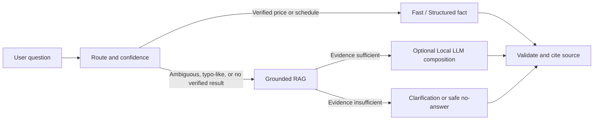

# English, Game Controls, and RAG Latency Follow-up

**Latest update:** 15 September 2026, Asia/Bangkok  
**Status:** Implemented locally and smoke-verified. A complete 1,600-case re-run is still required before a production claim.

## 1. Scope Completed

This follow-up closes five immediate user-facing gaps:

1. Add sourced game-control coverage without inventing button mappings.
2. Make English control/source responses display a usable URL in both the answer and the web source panel.
3. Remove unnecessary Local LLM work before exact price and regular-schedule answers.
4. Align evaluator warmup, English draft preview, and durable progress reporting with the local web profile.
5. Absorb a short burst of deterministic web requests without immediately returning `503` from the single-GPU worker.

## 2. Confirmed Evidence

### 2.1 Game controls

The rebuilt catalog contains mappings for **40 of 42** verified games.

| Status | Games | Runtime behavior |
|---|---:|---|
| Sourced button mapping available | 40 | Return buttons, actions, and source URL. |
| Mapping unavailable; staff capture needed | 2 | State that a verified map is not available and do not guess. |

The two intentionally pending games are **Delta Force** and **Pokemon Champions**. Both have an external reference, but neither reference provides a stable button-by-button default layout for the studio build. This is a data gap, not a reason to copy mappings from a different game.

New or corrected catalog coverage:

- eFootball: KONAMI controller guide; status `official_needs_layout_verify`.
- THE FINALS and Overcooked! 2: published control tables; status `secondary_needs_manual_verify`.
- Resident Evil 4 and The Last of Us Part II (Remastered): canonical-title mappings corrected so the booking catalog and control catalog match.

The release paths are:

- Raw verified/control-review inputs: `data/control_game/nintendo/`.
- Built structured facts: `data/curated/game_control_facts.jsonl`.
- Hybrid index: `data/vector/psu_hybrid_vector_index.json`.
- Semantic index: `data/vector/psu_semantic_vector_index.json`.

## 3. Latency Root Cause and Fix

### Confirmed from trace

The Thai query `PC ราคาเท่าไหร่` selected the deterministic price calculator, but previously spent **10.90 seconds** in `universal_intent` first. The final calculator itself took less than 1 ms. This was caused by a high model-first threshold allowing an unnecessary Local LLM intent call before a verified price route.

### Proposed flow, now implemented



The change applies a deterministic preflight veto only to sufficiently confident routes:

- `service_fee_query`, `price_lookup`, `price_calculate` at confidence >= 0.85.
- `schedule_query`, `schedule_lookup` at confidence >= 0.90.
- Game catalog/list/availability routes at confidence >= 0.85, unless a genuine Thai surface-typo signal is present.

It does **not** remove Local LLM assistance from informal, misspelled, broad, or unverified questions. Those questions still receive the bounded LLM/RAG recovery path after deterministic information cannot answer them.

### Worker readiness

The local web worker now warms both BGE-M3 and Typhoon before it accepts the first user request. The evaluator does the same, so model boot time is not incorrectly recorded as a user-query retrieval regression. Both models use a 30-minute keep-alive for this local profile.

The web supervisor also permits a bounded **3-second admission wait** for the single worker. That wait is subtracted from the same request budget; it is not an unbounded background queue. Quick Fast/Structured requests can therefore pass through a brief burst, while a genuinely saturated model worker still returns a retryable `server_busy` response rather than being mislabeled as a worker restart.

## 4. Measured Checks

### Completed tests

- Bilingual deterministic paths, English format parity, English draft preview, semantic bypass, game-control coverage, calendar schedule, and regression fixes all passed.
- Rebuilt hybrid index: 1,273 documents.
- Rebuilt semantic index: 289 documents, 1,024 dimensions, model `psu-bge-m3:q8_0`.
- English localization draft audit: 615 rows, 0 mechanical findings after repair.

### Benchmark smoke comparison

| Run | Thai cases | Strict pass | P95 | Requests >= 10 s |
|---|---:|---:|---:|---:|
| Before exact-route preflight fix | 8 | 8/8 | 12.58 s | 1 |
| After exact-route preflight fix | 8 | 8/8 | 2.02 s | 0 |

The result is a focused regression smoke test, not a replacement for the full corpus.

### Live API smoke test

The restarted web server on `http://127.0.0.1:8096/` returned valid, non-timeout answers for:

- `who r u` -> chatbot identity, English.
- `What are controls for Delta Force?` -> safe pending-mapping response with PlayStation source URL.
- `PC ราคาเท่าไหร่` -> deterministic price response.
- `อีสปอร์ตเริ่มต้นอย่างไร` -> semantic RAG response with visible source panel links.

The 10-session bilingual API concurrency smoke test also passed after the bounded worker admission change, with no locale leakage.

### Normal wording versus typo recovery

| User input | Path | Measured result |
|---|---|---|
| `มีเกมไรมั่ง` | Verified game catalog, no Local LLM | Correct catalog in 0.20 s. |
| `มีเกมออะไรบ้าง` | Surface-typo signal -> bounded Local LLM intent review -> verified catalog | Correct catalog in 6.14 s. |

This distinction is deliberate: informal but normal Thai should remain fast; a genuine inserted-letter form gets model help without ever allowing the model to fabricate the game list.

## 5. Calendar Baseline Locked

The regular schedule is defined once in `app/calendar/service_calendar.py`:

- Monday: 09:00-12:00 maintenance; 13:00-16:00 open.
- Tuesday-Thursday: 09:00-12:00 and 13:00-16:00 open.
- Friday: 09:00-12:00 open; 13:00-16:00 maintenance.
- Saturday-Sunday: no regular service slot.

Public holidays and registered special closures take precedence over this regular timetable. The answer must show unavailable booking/play status for maintenance or a closure, rather than merely repeating the generic weekday schedule.

## 6. Remaining Work and Safe Boundaries

### Must be completed before production

1. **Staff capture for two games:** Record the installed default mapping for Delta Force and Pokemon Champions, then attach an approved source or staff-capture record before enabling a button map.
2. **Human English approval:** The audited 615-row registry is still a draft preview. Mechanical checks cannot validate a translated rule, policy, or game instruction.
3. **Full regression:** Run Thai 1,600 and English 1,600 with a new run ID. Do not overwrite old raw logs. Compare exact route, answer contract, language leak, timeout, and latency results.
4. **Load test:** Check concurrent users against the supervised single-GPU worker. A serial smoke test cannot prove multi-user behavior.

### Known intentional behavior

- An unrelated question such as `What is a mechanical keyboard?` returns a quick safe no-answer rather than occupying the Local LLM queue.
- A plausible PSU question with informal English, a typo signal, or an unknown target still has an opportunity to use the bounded LLM/RAG recovery path.
- The system does not fabricate instructions, prices, availability, or game controls when evidence is missing.

## 7. Verification Commands

```powershell
py tests\smoke_test_bilingual_pipeline.py
py tests\smoke_test_control_catalog_coverage.py
py tests\smoke_test_semantic_general_bypass.py
py tests\smoke_test_english_date_aware_schedule.py
py tools\audit_english_localization_drafts.py `
  --input data\locales\en\localization_review_drafts_machine_20260915_audited.jsonl `
  --output-dir reports\bilingual_english\localization_draft_audit_manual_check
```

For a new full run, use a fresh directory:

```powershell
py tools\run_supervised_bilingual_full_eval.py `
  --output-dir reports\bilingual_english\full_recheck_YYYYMMDD_HHMMSS `
  --suites th,en `
  --watchdog-sec 25
```

Progress is checkpointed after each raw result row in `th_progress.json` and `en_progress.json`. A stopped run can therefore be resumed without losing completed-case accounting.

## 8. Related Files

- `docs/79_current_bilingual_pipeline_problem_inventory_and_remediation_flow_20260911.md`
- `reports/bilingual_english/fastpath_regression_smoke_25690915_194257/summary.json`
- `reports/bilingual_english/localization_draft_audit_20260915_final/report.md`
- `reports/bilingual_english/warmup_and_fastpath_smoke_25690915_194048/summary.json`
