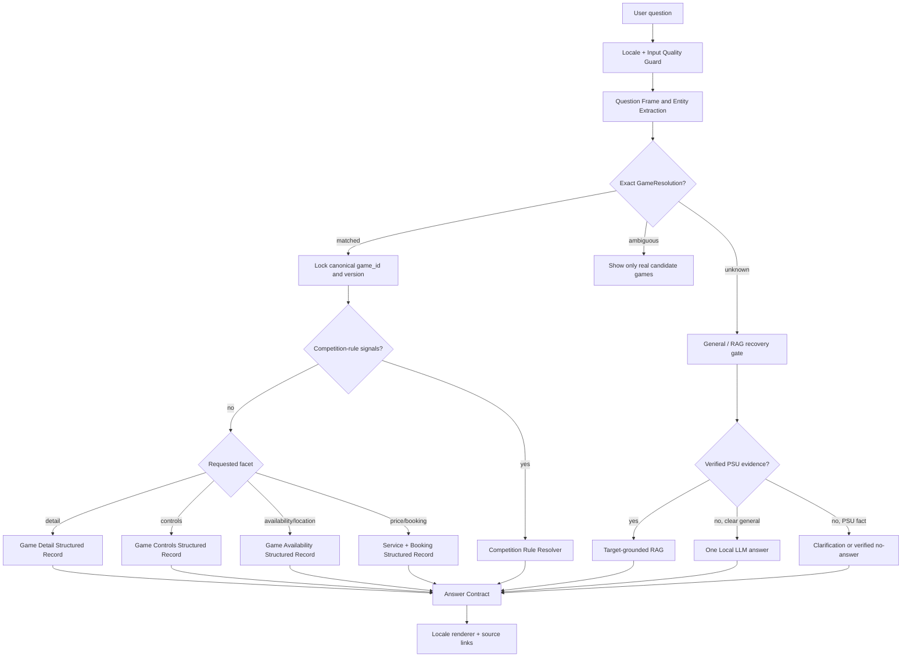

# Flow แก้ Game Detail, Bilingual และ Worker Reliability

> Latest Update: 2026-09-16
>
> สถานะ: ทำ Phase 1-4 บางส่วนแล้วเมื่อ 2026-09-16; ยังไม่ใช่การยืนยันว่าแก้ครบตาม Acceptance Criteria ทั้งหมด

## สถานะการทำจริง 2026-09-16

| ส่วน | สถานะ | สิ่งที่ยืนยันแล้ว |
|---|---|---|
| Exact target และ typo | ทำแล้ว | ชื่อเกมชัดเจนและ typo เช่น `tekkrn8` รักษา intent การจอง/ปุ่ม/availability ได้ |
| Version-aware resolver | ทำแล้ว | `Overcooked! 2` ชนะ alias รวม และ `Overcooked!`/ชื่อรวมยังแยกผลอย่างปลอดภัย |
| Availability capability | ทำแล้ว | Availability Structured Tool ใช้ GameResolver กลางและไม่เลือก equipment catalog แทน target เกม |
| Competition priority | ทำแล้ว | สัญญาณผู้เล่น, มาสาย, เกมหลุด, restart และตัวสำรองเข้า `competition_rules` ก่อน game detail |
| English accent routing | ทำแล้ว | `Pokémon` ไม่แตกเป็น `mon` แล้วถูกเข้า Monday/schedule route |
| Data/localization ครบทุกเกม | ยังไม่ครบ | เกมที่ไม่มี control mapping ยังคงตอบ `mapping_pending`; member overlay และ full audit ยังต้องทำ |
| Worker crash recovery และ full 1,600 x 2 | ยังไม่ผ่าน | ยังต้อง retry crash case ใน evaluator และรัน full regression ใหม่ |

การทดสอบ focused ที่ผ่าน: `smoke_test_versioned_game_resolution.py`,
`smoke_test_game_title_typo_correction.py`, `smoke_test_competition_signal_priority.py`,
`smoke_test_accented_english_game_routing.py`, `smoke_test_bilingual_pipeline.py`.

## 1. เป้าหมาย

ทำให้ผู้ใช้ได้รับคำตอบที่ตรงกับเจตนาเมื่อพิมพ์ชื่อเกมชัดเจน เช่น `VALORANT คือเกมอะไร`, `Overcooked 2 ปุ่มอะไร`, `Counter-Strike 2 เล่นได้ที่เครื่องไหน` โดยไม่ถูกถามกลับโดยไม่จำเป็น ไม่เปลี่ยนไปตอบรายการอุปกรณ์ และไม่ให้ Local LLM สร้างข้อเท็จจริงเกี่ยวกับ PSU เอง

ขอบเขตรอบนี้ครอบคลุม Thai/English, Game Detail, Game Controls, Availability, Competition Rules, Member localization, General LLM และ evaluator worker stability

## 2. หลักฐานที่ยืนยันแล้ว

ผลจาก `reports/bilingual_english/full_th_en_1600_direct_general_llm_25690916_095403`:

| ชุด | Strict pass | ความผิดพลาดเด่น | ความเร็ว |
|---|---:|---|---|
| Thai 1,600 | 92.50% | category 91, missing_any 41, worker crash 2 | P95 2.25s, เกิน 10s 30, เกิน 20s 1 |
| English 1,600 | 88.88% | category 123, Thai prose leak 55 | P95 0.95s, เกิน 10s 5, worker crash 0 |

ข้อเท็จจริงจาก Raw Log:

- `VALORANT คือเกมอะไร` ได้ `pipeline:ambiguity_clarification` ทั้งที่ Game Resolver ระบุชื่อเกมได้แล้ว
- `Counter-Strike 2 เล่นได้ที่เครื่องไหน` ได้ `structured_equipment_catalog` เพราะคำว่า `เครื่อง` ชนะ target เกม
- `VALORANT มาสายจะโดนอะไร` ได้ Game Detail แทน Competition Rule
- `Overcooked 2` ปะทะ `Overcooked!` เพราะ version token ไม่ถูกบังคับใน alias resolver
- English member answer มี header อังกฤษ แต่ role และคำอธิบายไทยจำนวนมาก จึงเป็น `thai_prose_leak`
- Worker ล้มระหว่าง full evaluation 2 ครั้ง แต่รันคำถามเดียวกันแบบ isolated ได้ จึงยังสรุปสาเหตุ native crash ไม่ได้

## 3. Invariants ที่ต้องล็อก

1. Exact canonical game target ห้ามถูก generic ambiguity หรือ equipment path แทนที่
2. Intent ที่เป็น competition rule ต้องชนะ game detail เมื่อมี signal เช่น รอบชิง, ผู้เล่น, มาสาย, restart, ตัวสำรอง, penalty
3. RAG ใช้ค้นหาเฉพาะเมื่อ Structured/Fast ไม่มี fact ที่ตรง target; RAG ห้ามเปลี่ยน target ที่ lock แล้ว
4. Local LLM ใช้ได้เพื่อเข้าใจคำถามทั่วไปหรือ typo แต่ห้ามแต่งราคา เวลา กฎ หรือ control ของ PSU
5. English answer ต้องไม่มี Thai prose นอกจาก approved proper noun ที่ allowlist ไว้ชัดเจน
6. Worker crash ต้องไม่ทำให้ full evaluator หยุด และ crash case ต้องถูก retry บน worker ใหม่หนึ่งครั้ง
7. ห้ามลด Thai baseline ที่ผ่านอยู่เพื่อเพิ่ม English score

## 4. Target Flow



## 5. ลำดับ Implement

### Phase 0: Freeze baseline และสร้าง regression packs

**ทำก่อนแก้ code ทุกครั้ง**

1. เก็บ `summary.json`, `th_results.jsonl`, `en_results.jsonl` ของ run ล่าสุดแบบ read-only
2. สร้าง focused packs แยกตาม defect ไม่ต่ำกว่า 10 ข้อต่อกลุ่ม:
   - `exact_game_detail`: `VALORANT คือเกมอะไร`, `TEKKEN 8 คือเกมอะไร`
   - `game_controls_version`: `Overcooked!`, `Overcooked 2`, `Resident Evil 4 (Remake)`
   - `game_availability`: CS2, Overcooked!, Pokemon Champions
   - `competition_rules`: player count, final, late, restart, substitute, penalty
   - `english_members`: list, count, role lookup, person lookup
   - `english_capacity`: PC #01-#02, PC #03-#10, PS5 #01-#02
   - `general_llm`: explanation, translation, short writing
   - `worker_recovery`: VR2 and Counter-Strike 2 crash IDs
3. ทุก case ต้องมี `expected_category`, `expected_mode`, `must_contain`, `must_not_contain`, `allowed_source_ids`, `latency_target` และ `locale`

**ผ่านเมื่อ:** test case ไม่มี ID ซ้ำ, ไม่ใช้ expected answer ที่แปล/แต่งสด, และ raw baseline ไม่ถูกเขียนทับ

### Phase 1: Exact Game Target ต้องชนะ Ambiguity

**ปัญหา:** Game Resolver พบ canonical game แล้ว แต่ ambiguity gate ยังถามว่าอยากรู้ “รายชื่อเกม/ข้อมูลเกม”

**แก้:**

1. เพิ่ม `QuestionFrame.facet` เป็น `detail | controls | availability | booking | price | competition_rules | unknown`
2. เมื่อ `GameResolution.status == matched` และ facet เป็น `detail` จาก pattern `คือเกมอะไร`, `รายละเอียด`, `เล่นยังไง`:
   - ตั้ง `target_required=True`
   - เลือก `structured.games.detail` ทันที
   - bypass generic ambiguity gate
3. Clarification ใช้ได้เฉพาะเมื่อ canonical ID ยัง `ambiguous` หรือ requested facet เป็น `unknown` จริง
4. Answer Contract ตรวจว่า `result.game_id == frame.game_id`

**Pseudocode:**

```python
if frame.game.status == "matched" and frame.facet == "detail":
    return execute_game_detail(game_id=frame.game.id)
if frame.game.status == "matched" and frame.facet != "unknown":
    ambiguity_gate.skip("exact_target_and_facet")
```

**ผ่านเมื่อ:** 42 เกมใน `exact_game_detail` ตอบผ่าน Game Detail โดยไม่มี `ambiguity_clarification`

### Phase 2: Version-aware Game Resolver

**ปัญหา:** `Overcooked 2` กับ `Overcooked!` และ `Resident Evil 4 (Remake)` ถูก collapse เป็นชื่อเดียว

**แก้:**

1. ใน catalog แยก `base_title`, `edition_tokens`, `franchise_key`, `canonical_id`
2. เก็บ number/roman numeral/edition token ไว้หลัง normalization เช่น `2`, `iii`, `remake`, `remastered`
3. exact phrase ที่มี version token ต้อง filter candidate ที่มี token เดียวกันก่อน fuzzy score
4. alias ไม่มี version เช่น `Overcooked` ให้สถานะ `ambiguous` และถามเฉพาะสอง candidate จริง
5. alias ที่มี version เช่น `Overcooked 2` หรือ `RE4 Remake` ต้อง map canonical เดียว ไม่มี list fallback

**ห้ามทำ:** fuzzy match ทุก alias ทั้ง catalog หรือเพิ่ม route รายเกม

**ผ่านเมื่อ:** 100% ของ focused version pack ได้ canonical ID ที่ถูกต้อง และ false match ข้ามภาคเป็น 0

### Phase 3: Lock Capability ตาม Facet ไม่ให้ Equipment แย่ง Game Availability

**ปัญหา:** `Counter-Strike 2 เล่นได้ที่เครื่องไหน` ลง equipment catalog เพราะ keyword `เครื่อง`

**แก้:**

1. ถ้า `frame.game.status=matched` และ facet `availability/location` ให้ set allowed capability เป็น `games.availability` เท่านั้น
2. Tool precondition ของ `equipment.catalog` ต้อง reject หาก frame มี matched game target และไม่ได้ถาม spec ของอุปกรณ์
3. Availability response ใช้ `service_game_availability` เป็น source of truth; ไม่อนุมานจาก zone/equipment
4. `Pokémon Champions` ที่ยังไม่มี availability จริงต้องตอบ verified no-answer พร้อม source ไม่ใช่ clarification ปลอม

**ผ่านเมื่อ:** CS2, TEKKEN 8, Overcooked!, Pokemon Champions ทุก case อยู่ games/availability หรือ verified no-answer ที่ category ถูกต้อง

### Phase 4: Competition Rules ก่อน Game Detail

**ปัญหา:** ชื่อเกมทำให้ `VALORANT มาสายจะโดนอะไร` ไป Game Detail

**แก้:**

1. สร้าง `CompetitionQuestionFrame` แยกจาก Game Detail:
   - `game_id`, `tournament_id?`, `rule_facet`, `event_date?`
2. Rule signals ที่ priority สูง: `รอบชิง/final`, `ผู้เล่น/player`, `มาสาย/late`, `restart`, `disconnect`, `substitute`, `penalty`, `ข้อห้าม`
3. ถ้ามี signal เหล่านี้ ให้ Competition Rule Resolver ก่อน Game Detail แม้มี exact game name
4. Lookup rule card ตาม priority: tournament-specific active rule → game-family rule → studio generic rule
5. ไม่มี active verified rule card ต้องตอบ `ไม่มีข้อมูลกติกาที่เผยแพร่สำหรับ...` พร้อม link; ห้ามตอบ game description แทน

**ข้อมูลที่ต้องเพิ่ม:** competition rule cards ต้องมี `game_id`, `facet`, `effective_from`, `valid_until`, `source_url`, `trust_level`

**ผ่านเมื่อ:** 34 Thai competition failures ถูกเปลี่ยนเป็น competition answer หรือ verified no-answer เท่านั้น

### Phase 5: Complete Game Detail และ Controls Data

**แก้ data ก่อน LLM:**

1. ทุก `game_detail` ต้องมี summary, genre, play_style, compatible_zones, source URL, version
2. ทุก control map ต้องผูก `canonical_game_id` และ `platform`; ห้าม reuse control ข้าม edition โดยไม่มี evidence
3. control ที่ยังไม่มี source เช่น Delta Force/Pokemon Champions ใช้ `mapping_pending` พร้อม source ไม่เดา
4. เพิ่ม canonical alias records สำหรับ `Resident Evil 4 (Remake)` และ Overcooked editions

**ผ่านเมื่อ:** Game Detail/Controls pack ตอบผ่าน Structured path, มี source และไม่เรียก LLM เพื่อสร้าง control

### Phase 6: English Localization Overlay

**ปัญหา:** member answers มี Thai role descriptions 55 เคส

**แก้:**

1. เพิ่ม approved overlay ต่อ field: `member.name_en`, `member.role_en`, `member.organization_en`, `group_name_en`
2. ชื่อไทยที่เป็น official proper noun allow ได้เฉพาะ field `name_original`; role/description ต้องอังกฤษ
3. English renderer ใช้ template อังกฤษเสมอและเลือก overlay ที่ `source_text_sha256` ตรงกับ Thai source
4. overlay stale/missing ให้ตอบ English no-answer หรือ show original Thai record เฉพาะเมื่อ UI ระบุ `Original Thai record` และ evaluator allowlist รองรับ
5. แก้ English capacity parser ให้ parse `PC #01-#02`, `PC #03-#10`, `PlayStation 5 #01-#02`
6. Multi-question แยก child answers แล้ว combine เฉพาะเมื่อทุก child validated; child ที่ไม่มีข้อมูลต้องแสดงผลแยก ไม่ล้มทั้งชุด

**ผ่านเมื่อ:** `thai_prose_leak=0` สำหรับ non-name prose และ English member/capacity focused pack ผ่าน 100%

### Phase 7: General LLM แบบ One Call

**ปัญหา:** Thai general writing บางแบบตก no-answer หรือ RAG ดึงกฎศูนย์ผิดเรื่อง

**แก้:**

1. เพิ่ม intent patterns: `ช่วยสรุป`, `เขียนประโยค`, `ร่างข้อความ`, `ขอบคุณ`, `caption`, `translate`, `what is`, `explain`
2. ถ้าไม่มี PSU target และเป็น clear general action ให้ bypass PSU RAG และ intent preflight; call `general_llm_direct` เพียงครั้งเดียว
3. ถ้ามี PSU signal เช่น price, booking, controls, opening hours ต้อง reject General LLM และกลับ Structured/RAG
4. Prompt บังคับ length/profile และ append disclosure ว่าเป็น general model knowledge

**ผ่านเมื่อ:** general pack ไม่มี PSU RAG source ที่ไม่เกี่ยวข้อง, ไม่เกิด no-answer สำหรับ intent ที่รองรับ และไม่มี PSU factual claim ที่ไม่ได้ evidence

### Phase 8: Worker Crash Forensics และ Reliable Full Eval

**แก้ runner ก่อนประกาศคะแนน:**

1. คง worker recycle ทุก 100 cases ชั่วคราว
2. เมื่อ worker crash: parent เขียน record, close pipe, start replacement, retry case เดิมหนึ่งครั้งบน worker ใหม่
3. Retry ผ่านให้เก็บ `recovered_after_worker_crash=true`; retry ล้มให้เป็น `unresolved_worker_crash`
4. เก็บ worker id, exit code, Windows Event Log reference, RSS, request ID, last stage และ timestamp
5. เปิด `faulthandler` และ Local Dump เฉพาะ benchmark; ห้าม log user chat หรือ PII
6. วิเคราะห์ VR2/CS2 ภายใต้ matrix: semantic on/off, LLM on/off, fresh worker/reused worker, bundled/system Python

**ผ่านเมื่อ:** full Thai + English มี `unresolved_worker_crash=0`; parent evaluator ไม่หยุดเมื่อ child ตาย

## 6. Verification Order

```mermaid
flowchart LR
    A[Phase 0 Baseline] --> B[Phase 1 Exact Game Detail]
    B --> C[Phase 2 Version Resolver]
    C --> D[Phase 3 Availability Capability Lock]
    D --> E[Phase 4 Competition Rules]
    E --> F[Phase 5 Game Data]
    F --> G[Phase 6 English Overlay]
    G --> H[Phase 7 General LLM]
    H --> I[Phase 8 Worker Reliability]
    I --> J[Focused Packs]
    J --> K[Thai 1600 + English 1600]
```



1. Unit tests ของ phase ที่แก้
2. Focused regression pack ของ phase นั้น
3. Thai regression 1,600
4. English shadow 1,600
5. HTTP concurrency และ session isolation หลัง score ผ่าน

## 7. Acceptance Criteria รอบถัดไป

- Thai: strict pass ไม่ต่ำกว่า 94.31%, `worker_crash=0`, ไม่มี case เกิน 20 วินาที
- English: strict pass อย่างน้อย 92% ในรอบแรก, `thai_prose_leak=0`, ไม่มี English PSU fact ที่สร้างจาก runtime translation
- Exact Game Detail: 42/42 canonical game cases ตอบ detail โดยไม่ clarification
- Competition: ทุก rule query อยู่ `competition_rules` หรือ verified no-answer
- Availability: matched game target ไม่ลง equipment catalog
- General LLM: clear general request เรียก generation ไม่เกินหนึ่งครั้ง
- Full evaluator: parent process อยู่ต่อและ retry crash case ได้

## 8. Rollback และ Compatibility

- ทุก gate เปิดด้วย feature flag: `PSU_EXACT_GAME_FACET_LOCK`, `PSU_VERSION_AWARE_GAME_RESOLVER`, `PSU_COMPETITION_RULE_PRIORITY`, `PSU_ENGLISH_MEMBER_OVERLAY`
- เมื่อ flag ใหม่ผิด ให้ fallback ไป Structured answer เดิม ไม่ fallback ไป LLM เพื่อเดาข้อเท็จจริง
- Thai source record เป็น source of truth; English overlay เป็น approved projection เท่านั้น
- API fields เดิมไม่เปลี่ยน เพิ่มได้เฉพาะ metadata เช่น `resolved_game_id`, `facet`, `recovered_after_worker_crash`

## 9. Links

- [Full evaluation summary](../reports/bilingual_english/full_th_en_1600_direct_general_llm_25690916_095403/summary.json)
- [Thai raw results](../reports/bilingual_english/full_th_en_1600_direct_general_llm_25690916_095403/th_results.jsonl)
- [English raw results](../reports/bilingual_english/full_th_en_1600_direct_general_llm_25690916_095403/en_results.jsonl)
- [Previous bilingual issue inventory](79_current_bilingual_pipeline_problem_inventory_and_remediation_flow_20260911.md)
- [Worker reliability plan](75_windows_worker_crash_diagnosis_and_recovery_plan_20260901.md)
