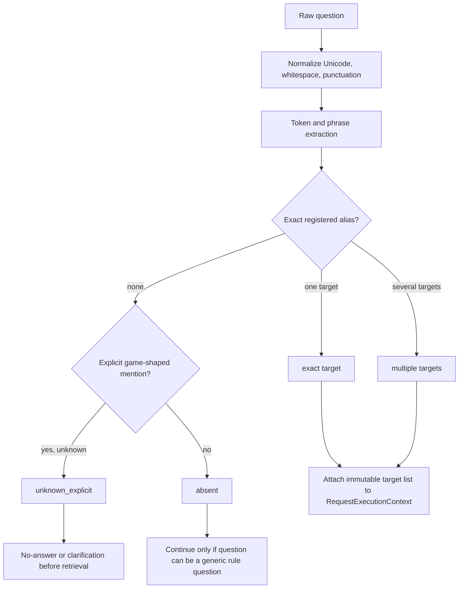
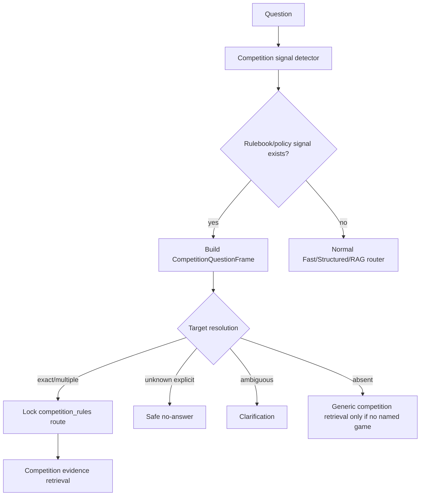
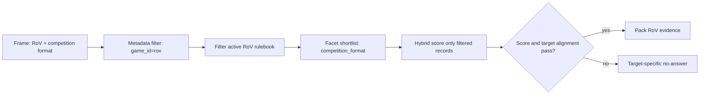
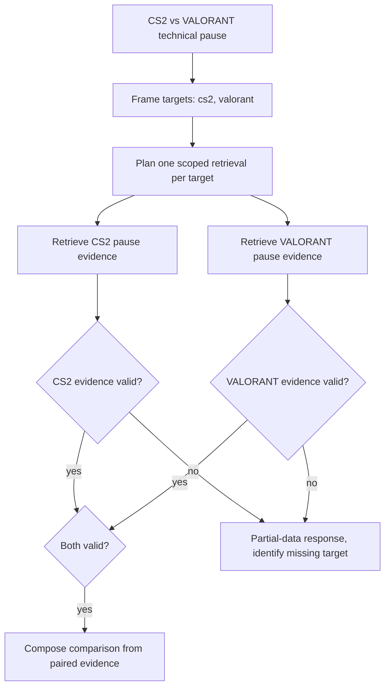
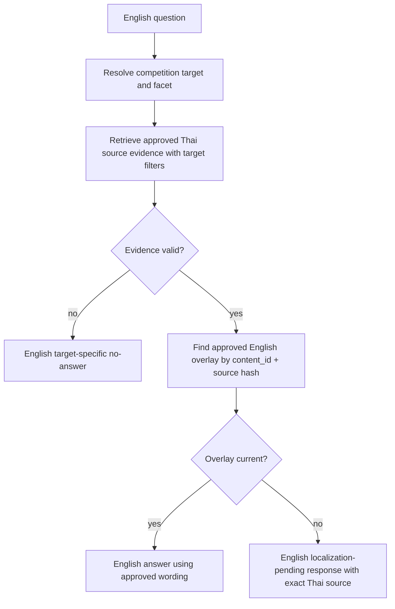
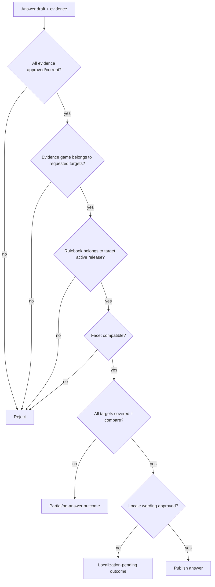
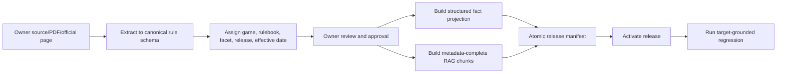

# Flow แก้ Competition Rules RAG แบบ Target-Grounded

**สถานะ:** Implementation plan  
**ขอบเขต:** คำถามกติกาการแข่งขันของ Counter-Strike 2, Arena of Valor (RoV), TEKKEN 8 และ VALORANT ทั้งภาษาไทยและอังกฤษ  
**ฐานอ้างอิง:** ชุดทดสอบ 528 ข้อ และ Trace run `competition_rules_rag_eval_20260920_214832`  
**เป้าหมาย:** ให้ระบบตอบเฉพาะเมื่อพิสูจน์ได้ว่า หลักฐานเป็นของเกม, rulebook, facet และภาษา ที่ตรงกับคำถาม; ถ้าพิสูจน์ไม่ได้ต้องถามเพิ่มหรือ no-answer โดยไม่ยืมกติกาจากเกมอื่น

---

## 1. ปัญหาที่ต้องแก้และหลักการตัดสิน

### 1.1 สิ่งที่ยืนยันจากผลทดสอบ

| หมวดปัญหา | ตัวอย่าง Case | อาการปัจจุบัน | ความเสี่ยง |
|---|---|---|---|
| Rule intent ถูกทับด้วย Game route | `COMP-RAG-TH-011` | CS2 เรื่องมารยาทถูกเปลี่ยนเป็น `games/game_detail` | ตอบไม่ได้ทั้งที่มีข้อมูล |
| Target หลุดระหว่าง Retrieval | `COMP-RAG-TH-116` | จับ RoV ได้ แต่ RAG คืน VALORANT | ให้ข้อมูลเท็จโดยมีแหล่งอ้างอิงดูน่าเชื่อ |
| English ถูกตัดก่อน Retrieval | `COMP-RAG-EN-001` | คืน missing localization ทันที | หา source ที่มีอยู่ไม่เจอ |
| หลายเกมถูกลดเหลือเกมเดียว | `COMP-RAG-TH-263` | เปรียบเทียบ CS2/VALORANT แต่ตอบ CS2 อย่างเดียว | คำตอบไม่ครบและสรุปผิดได้ |
| เกมที่ไม่รองรับยืมกติกาเกมอื่น | `COMP-RAG-TH-262` | Free Fire ได้ CS2 pause policy | false claim ร้ายแรง |
| Rulebook ถูก route ไป Reservation | `COMP-RAG-TH-126` | RoV disconnect ได้ขั้นตอนจอง | คนละ domain และช้า 25.417 วินาที |
| Validator ไม่ตรวจ Target Coverage | หลาย Case | `validation=ok` แม้ source คนละเกม | ปล่อยคำตอบผิดออกหน้าเว็บ |

### 1.2 Invariants ที่ห้ามละเมิด

1. ชื่อเกมที่ผู้ใช้ระบุเป็น constraint ไม่ใช่เพียง keyword สำหรับ ranking
2. RAG ห้ามค้นข้ามเกมเมื่อ `target_status=exact` หรือ `explicit_unknown`
3. คำถามเปรียบเทียบต้องมี evidence ครบทุก target ก่อนตอบเชิงเปรียบเทียบ
4. `rulebook`, `กติกา`, `rules`, `pause`, `roster`, `forfeit`, `disconnect`, `anti-cheat`, `conduct` ต้องมีสิทธิ์ veto route เกมทั่วไปและ route จอง
5. Unknown explicit game ต้อง no-answer/clarification เท่านั้น ห้าม fallback ไป fact card ของเกมอื่น
6. English ใช้ source เดียวกับไทยก่อน แล้วค่อยตัดสินรูปแบบภาษา ห้ามตัดจบก่อนรู้ target และ source
7. Validator ต้องตรวจ game/rulebook/facet/target coverage จาก QuestionFrame ต้นฉบับ ไม่ใช่ตรวจเพียงว่า answer มี source
8. ทุก stage ที่เรียกข้อมูลภายนอกหรือทำงานนานต้องรับ deadline และคืน safe outcome ก่อน response ceiling

---

## 2. Data Contract กลางที่ต้องเพิ่ม

Flow ทั้งหมดต้องใช้ข้อมูลชุดเดียวกัน ไม่ให้แต่ละ stage จับเกมใหม่เองแล้วผลไม่ตรงกัน

### 2.1 `CompetitionTargetResolution`

```python
@dataclass(frozen=True)
class CompetitionTarget:
    game_id: str                         # cs2 | rov | tekken8 | valorant
    display_name_th: str
    display_name_en: str
    rulebook_ids: tuple[str, ...]        # approved active releases only
    alias: str                           # alias ที่ตรงกับ input
    match_method: str                    # exact_alias | normalized_alias | phrase
    score: float


@dataclass(frozen=True)
class CompetitionTargetResolution:
    status: str                          # exact | multiple | ambiguous | unknown_explicit | absent
    targets: tuple[CompetitionTarget, ...]
    explicit_game_mentions: tuple[str, ...]
    reason: str
    confidence: float
```

### 2.2 `CompetitionQuestionFrame`

```python
@dataclass(frozen=True)
class CompetitionQuestionFrame:
    domain: str                          # competition_rules
    operation: str                       # rule_lookup | compare | rulebook_list
    facet: str | None                    # conduct | pause_timeout | disconnect | anti_cheat | ...
    targets: CompetitionTargetResolution
    requires_all_targets: bool           # True for compare / and / ต่างกัน / versus
    output_locale: str                   # th | en
    requested_source_language: str       # source language allowed for evidence
    needs_clarification: bool
    no_answer_reason: str | None
```

### 2.3 `EvidenceItem`

เอกสารทุกชิ้นที่ searchable ต้องมี metadata บังคับ ไม่อนุญาตให้ RAG ใช้ chunk ที่ไม่มีข้อมูลเหล่านี้:

```json
{
  "evidence_id": "competition_rules_cs2_psu_phuket_2026_s01_c01",
  "content_id": "competition_rules_cs2_psu_phuket_2026_s01_c01",
  "game_id": "cs2",
  "rulebook_id": "competition_rules_cs2_psu_phuket_2026",
  "release_id": "...",
  "facet": "competition_format",
  "locale": "th",
  "approval_status": "approved",
  "effective_from": "2026-...",
  "source_url": "local://competition_rules/...",
  "source_text_sha256": "..."
}
```

**Rule:** Legacy fact cards ต้องถูกแปลงให้มี metadata shape เดียวกันก่อนถูกส่งเข้า Evidence Validator. ไม่อนุญาตให้มี `game=""` หรือ `facet=""` สำหรับคำตอบแบบ competition-rule.

---

## 3. Target Resolver: แก้ปัญหา alias โดยไม่ทำ handler รายเกม

### 3.1 Alias registry

เก็บ alias ใน registry กลางต่อเกม/rulebook ไม่กระจายไว้ใน Route rules:

```json
{
  "game_id": "rov",
  "aliases": [
    "Arena of Valor", "AOV", "RoV", "rov",
    "อารีน่าออฟเวเลอร์", "อารีน่า ออฟ เวเลอร์", "rov แข่ง"
  ],
  "rulebook_ids": ["competition_rules_rov_blueket_2025_men"]
}
```

Alias ต้องรองรับการ normalize ช่องว่าง, punctuation, case และ Thai/English spelling ที่ยืนยันแล้วเท่านั้น. ไม่ใช้ fuzzy scan ทุก alias ทุกตำแหน่งของข้อความ.

### 3.2 Flow ของ resolver



### 3.3 ลำดับ match

1. Exact normalized phrase match เช่น `CS2`, `Counter-Strike 2`, `Arena of Valor`
2. Token-aware abbreviation match เช่น `aov`, `rov`, `t8`; ต้องเป็น token ทั้งคำ ไม่ match เป็น substring
3. Phrase extraction จาก game title ที่มีหลายคำ
4. Bounded fuzzy shortlist เฉพาะเมื่อคำคล้ายชื่อเกมและมี competition context; สูงสุด 8 candidates
5. ถ้าคะแนนไม่ถึง threshold หรือ margin ต่ำ ให้ `ambiguous` ไม่เดา

### 3.4 Pseudocode

```python
resolution = competition_target_resolver.resolve(question)
ctx.competition_targets = resolution

if resolution.status == "unknown_explicit":
    return no_answer(
        category="competition_rules",
        reason="unsupported_competition_rulebook",
        locale=frame.output_locale,
    )

if resolution.status == "ambiguous":
    return clarification(list_verified_candidates(resolution.targets))
```

### 3.5 จุดที่แก้ Case เดิม

| Case | ผลใหม่ที่ต้องได้ |
|---|---|
| `TH-116` Arena of Valor | `targets=[rov]`; ไม่อนุญาต VALORANT candidate |
| `TH-126` อารีน่าออฟเวเลอร์ | `targets=[rov]` แม้จะมีคำว่า `ต้องทำยังไง` |
| `TH-262` Free Fire | `status=unknown_explicit`; จบก่อน fact-card retrieval |
| `TH-263` CS2 + VALORANT | `status=multiple`; targets สองรายการตามลำดับในคำถาม |

---

## 4. Intent และ Route Precedence: แก้คำถามกติกาหลุดไป Games หรือ Reservation

### 4.1 สร้าง competition-policy signal ที่แยกจาก game entity

ตัวอย่าง signals:

| Facet | Thai signals | English signals |
|---|---|---|
| รูปแบบแข่ง | รูปแบบการแข่งขัน, รอบ, สายแข่ง, BO3 | format, bracket, round, best of |
| ผู้เล่น/roster | รายชื่อ, ตัวสำรอง, เปลี่ยนตัว | roster, substitute, lineup |
| pause | พักเกม, technical pause, timeout | pause, technical pause, timeout |
| disconnect | หลุด, เน็ตหลุด, การเชื่อมต่อ | disconnect, connection loss |
| conduct | มารยาท, พฤติกรรม, ข้อห้าม | conduct, behavior, sportsmanship |
| anti-cheat | โกง, โปรแกรมช่วยเล่น | cheat, hacking, anti-cheat |

### 4.2 Route precedence ที่ต้องใช้



### 4.3 Veto rules

เมื่อ `competition_rules` ถูก lock:

- `games/game_detail` ห้าม override เพียงเพราะเจอชื่อเกม
- `structured.reservation` ห้าม execute จากคำว่า `ต้องทำยังไง`, `เวลา`, `จอง` หากมี `rulebook`/`กติกา`/competition facet ชัดเจน
- `equipment`, `schedule`, `events_news` เป็น candidate ได้เฉพาะเมื่อ question frame บอกว่าไม่ใช่ policy question
- LLM intent review มีสิทธิ์เสนอ route ใหม่ได้ แต่ไม่มีสิทธิ์ข้าม `target/status` หรือปลด lock โดยไม่มี explicit rationale ที่ validator ยอมรับ

### 4.4 แก้ Case `TH-011`

ปัจจุบัน: initial route ถูกต้องแล้ว แต่ `exact_known_game_target` กลับ lock เป็น `games`.  
ผลใหม่: exact game resolution จะเขียนแค่ `frame.targets=[cs2]`; domain คง `competition_rules` เพราะพบ `ข้อกำหนด`, `มารยาท`, `พฤติกรรม`.

---

## 5. Target-First Retrieval: แก้ RAG คืนหลักฐานคนละเกม

### 5.1 กฎการ query index

ห้ามใช้ global semantic search เป็นจุดเริ่มต้นเมื่อ game target ถูกระบุแล้ว

```text
Allowed evidence filters
approval_status == approved
AND document_type == competition_rule
AND game_id IN frame.targets
AND rulebook_id IN active_rulebooks(frame.targets)
AND locale == th                         # source evidence may be Thai for both outputs
AND effective_date is valid
```

หลัง filter แล้วเท่านั้น จึงทำ lexical/vector scoring และ rerank.

### 5.2 Single target flow



### 5.3 Fact-card flow

Fact cardsเร็วกว่า RAG แต่ต้องใช้ contract เดียวกัน:

```python
fact_cards = find_fact_cards(
    game_ids=frame.targets.game_ids,
    rulebook_ids=frame.targets.active_rulebook_ids,
    facet=frame.facet,
)

if len(fact_cards) == 1 and fact_cards[0].metadata_is_complete:
    return fact_card_answer(fact_cards[0])

return target_filtered_rag(frame)
```

**ห้าม:** `find_fact_cards(game=None, facet=None)` แล้วเลือก top hit สำหรับ question ที่มีชื่อเกมชัดเจน. นี่คือสาเหตุ Free Fire ได้ CS2 fact card.

### 5.4 Facet fallback ที่ปลอดภัย

1. exact facet เช่น `disconnect`
2. compatible facet ที่ registry ระบุ เช่น `technical_pause` อาจสัมพันธ์ `pause_timeout`
3. whole-rulebook scoped search เฉพาะ game/rulebook เดิม
4. no-answer

ห้ามข้ามจากข้อ 3 ไป all-game global search.

### 5.5 แก้ Case `TH-116`

หลัง target filter, VALORANT chunks จะไม่เข้า shortlist ของ RoV เลย. หาก RoV format ไม่พบ source จริง ระบบต้องตอบว่าไม่มีข้อกำหนด RoV ที่ตรวจสอบได้ใน release ปัจจุบัน แทนการยืม VALORANT.

---

## 6. Multi-Target Retrieval: แก้คำถามเปรียบเทียบและหลายคำถาม

### 6.1 ตรวจ multi-target ก่อน retrieval

สัญญาณ: `กับ`, `และ`, `ต่างกันยังไง`, `เทียบ`, `vs`, `versus`, `compare`, `difference between` ร่วมกับ target มากกว่าหนึ่งเกม.

```python
frame.requires_all_targets = (
    len(frame.targets.targets) > 1
    and has_comparison_or_conjunction_signal(question)
)
```

### 6.2 Flow เปรียบเทียบ



### 6.3 Output policy

- Evidence ครบทุก game: เปรียบเทียบได้
- Evidence ขาดบาง game: บอกข้อเท็จจริงเฉพาะฝั่งที่ยืนยันได้ + ระบุว่าอีกฝั่งไม่มีข้อมูลที่ตรวจสอบได้
- Evidence ขาดทั้งหมด: no-answer
- ห้ามใช้ wording `ต่างกันคือ...` ถ้า evidence มีเพียงฝั่งเดียว

### 6.4 แก้ Case `TH-263`

`QuestionFrame.targets` ต้องเก็บ `[cs2, valorant]` ไม่ใช่ scalar. Validator ต้องปฏิเสธ `cs2_pause_policy` ถ้าไม่มี VALORANT evidence.

---

## 7. Unknown, Ambiguous และ Missing Facet: Safe Outcome ที่ไม่เดา

### 7.1 Decision table

| Target status | มี facet ชัดไหม | Action |
|---|---|---|
| `exact` | yes | target-filtered fact-card/RAG |
| `exact` | no | scoped whole-rulebook retrieval หรือถามว่าต้องการหัวข้อใด |
| `multiple` | yes | retrieve ทุก target แล้วตอบ comparison/combined answer |
| `ambiguous` | any | clarification พร้อมรายชื่อเกมที่ match จริง |
| `unknown_explicit` | any | no-answer ว่าไม่มี rulebook ที่ยืนยันสำหรับเกมนั้น |
| `absent` | yes | generic competition search เฉพาะเมื่อ source ระบุว่าเป็นกติกากลางได้จริง |
| `absent` | no | clarification |

### 7.2 English/Thai safe outcome template

```text
TH: ยังไม่พบกติกาการแข่งขันที่ยืนยันได้สำหรับ Free Fire ในชุดข้อมูลปัจจุบัน
จึงไม่สามารถใช้กติกาของเกมอื่นแทนได้

EN: I could not find a verified competition rulebook for Free Fire in the
current knowledge set, so I cannot substitute rules from another game.
```

### 7.3 แก้ Case `TH-262`

Free Fire ต้องถูกจัด `unknown_explicit` ก่อน call LLM, fact-card, vector retrieval และ composer. แม้ LLM ไม่พร้อม ระบบก็ยังต้องจบด้วย safe outcome เดิมได้แบบ deterministic.

---

## 8. English Flow: ค้นหลักฐานก่อนตัดสินเรื่องคำแปล

### 8.1 ปัญหาปัจจุบัน

`pipeline:missing_english_localization` ถูกคืนหลัง route ทันที จึงไม่มี target, evidence ID หรือ exact rulebook source.

### 8.2 Flow ใหม่



### 8.3 Localization overlay contract

```json
{
  "content_id": "competition_rules_cs2_psu_phuket_2026_s01_c01",
  "field": "answer_summary",
  "locale": "en",
  "text": "...",
  "source_text_sha256": "same-as-current-thai-source",
  "status": "approved"
}
```

หาก hash ของภาษาไทยเปลี่ยน, overlay ต้องเป็น `stale` ทันทีและห้ามใช้จนคนอนุมัติใหม่. ไม่อนุญาต Local LLM แปล fact สดเพื่อ publish.

### 8.4 Output เมื่อยังไม่มี English overlay

ต้องยังคง source-bound:

```text
I found the verified CS2 competition-format rule in the PSU Phuket CS2 2026
Tournament source, but an approved English wording is not available yet.
Original source in Thai: [exact rulebook URL]
```

ไม่ใช้ generic homepage source เว้นแต่เป็น source ที่ answer ใช้จริง.

---

## 9. Evidence Validator: ด่านสุดท้ายก่อนส่งคำตอบ

### 9.1 Input ของ validator

```python
validate_competition_answer(
    frame=CompetitionQuestionFrame,
    evidence_items=list[EvidenceItem],
    draft=AnswerDraft,
    locale_decision=LocaleDecision,
)
```

### 9.2 Validation sequence



### 9.3 Result codes

| Code | Action |
|---|---|
| `target_mismatch` | Drop wrong evidence; no cross-game fallback |
| `target_coverage_incomplete` | Partial-data response or no-answer |
| `unsupported_explicit_target` | deterministic no-answer |
| `facet_mismatch` | try only scoped compatible facet, then no-answer |
| `stale_or_unapproved_source` | no-answer/localization-pending |
| `language_overlay_missing` | English pending response with exact Thai source |
| `deadline_exhausted` | controlled timeout, no LLM/retrieval retry |

### 9.4 แก้ issue ที่ validator ปล่อยผ่าน

Case `TH-116`, `TH-262`, `TH-126` ต้องได้รับ `target_mismatch`.  
Case `TH-263` ต้องได้รับ `target_coverage_incomplete`.  
ไม่มีกรณีใดควรจบด้วย `validation=ok` ตามผลเดิม.

---

## 10. Deadline และ Capability Budget: แก้ route ผิดที่ช้าจนเกินเวลา

### 10.1 Budget สำหรับ competition query

ในช่วงเร่งพัฒนาสามารถกำหนด ceiling 20 วินาทีตาม requirement ปัจจุบัน แต่ต้อง reserve เวลาสำหรับ finalizer เสมอ:

| Stage | Soft cap | Hard action เมื่อ budget ไม่พอ |
|---|---:|---|
| Normalize + target resolve | 0.5 s | deterministic safe outcome |
| Route/frame/guard | 0.5 s | no route widening |
| Target-filtered fact card | 0.5 s | move to RAG only if budget เหลือ |
| RAG retrieval/rerank | 3.0 s | use valid partial evidence only |
| Local LLM compose | 8.0 s | deterministic evidence draft |
| Validator/finalizer reserve | 1.0 s | must always remain |

### 10.2 Hard deadline flow

```python
budget.checkpoint("before_structured_reservation")
if frame.domain == "competition_rules":
    veto("structured.reservation")

result = call_with_timeout(
    capability,
    timeout=budget.remaining_after_reserve(),
)
if result.timed_out:
    return controlled_timeout_no_answer(frame)
```

### 10.3 Specific safeguard for `TH-126`

- Rulebook signal locks competition domain before tool selection.
- Reservation capability is vetoed.
- If any plugin/network call begins, it receives a cancellable timeout derived from remaining budget.
- Parent supervisor returns at ceiling even if child worker hangs.

---

## 11. Data Publication Flow: เพิ่ม/แก้กติกาโดยไม่ทำให้ RAG ดึง version ผิด

### 11.1 Source ingestion



### 11.2 Required canonical fields per rule

| Required always | Optional only when applicable |
|---|---|
| game, rulebook, release, section, facet, Thai source text, source URL, approval status, effective date | map, side selection, equipment restriction, prize, roster size, time limits |

### 11.3 When a new topic appears

1. Do not make a new hard-coded route.
2. Add an approved facet to `facet_registry`, such as `coach_policy`.
3. Add canonical source section with `game_id/rulebook_id/facet`.
4. Add an English overlay only after review if English output is required.
5. Add Thai/English regression questions for exact, paraphrase, ambiguous, unknown and multi-target forms.
6. Rebuild the release manifest and index atomically.

---

## 12. Logging ที่ต้องเห็นเพื่อหาสาเหตุได้ในครั้งต่อไป

ทุก request เก็บ performance trace แยกจาก chat content/PII:

```json
{
  "request_id": "...",
  "stage": "target_filtered_retrieval",
  "frame_domain": "competition_rules",
  "target_status": "multiple",
  "requested_game_ids": ["cs2", "valorant"],
  "requested_rulebook_ids": ["..."],
  "facet": "pause_timeout",
  "candidate_count_before_filter": 182,
  "candidate_count_after_filter": 7,
  "returned_evidence_ids": ["..."],
  "target_coverage": {"cs2": true, "valorant": false},
  "elapsed_ms": 425,
  "remaining_ms": 15300,
  "decision": "partial_data"
}
```

สิ่งที่ต้องดูจาก dashboard:

- `competition_route_accuracy`
- `competition_target_match_rate`
- `competition_evidence_alignment_rate`
- `cross_game_evidence_blocked_count`
- `unknown_explicit_no_answer_count`
- `comparison_target_coverage_rate`
- `english_overlay_missing_count`
- `capability_veto_count` แยก reservation/games
- latency P50/P95/P99 แยก capability
- deadline timeout และ worker restart count

---

## 13. Implementation Order แบบทำทีละส่วน

### Phase 1: Correctness guard ก่อนเพิ่ม recall

1. เพิ่ม schema metadata ให้ legacy fact cards และ canonical chunks
2. เพิ่ม `CompetitionTargetResolution` และ registry alias
3. สร้าง `CompetitionQuestionFrame` ก่อน generic route lock
4. บังคับ unknown explicit game -> no-answer
5. เพิ่ม `validate_competition_answer()` ที่ตรวจ target/rulebook/facet
6. ทำ focused tests ของ 6 failure cases และ 1 passing baseline

**ผ่านเมื่อ:** ไม่มี evidence คนละเกมออกจาก final answer ได้ แม้ RAG ranking จะเลือกมา

### Phase 2: Retrieval and multi-target

7. ทำ metadata filter ก่อน fact-card/vector/rerank
8. เปลี่ยน `targets` เป็น list และเพิ่ม comparison planner
9. บังคับ coverage ทุก target ก่อน compose comparison
10. เพิ่ม partial-data response contract

**ผ่านเมื่อ:** `TH-116`, `TH-263`, `TH-262` ได้ผลตาม required result โดยไม่ใช้ LLM

### Phase 3: Bilingual grounding

11. ย้าย English localization gate หลัง retrieval/evidence validation
12. ทำ English overlay registry และ stale hash check
13. เพิ่ม English source-grounded no-answer/localization-pending templates

**ผ่านเมื่อ:** English ไม่คืน generic homepage เมื่อ target source ระบุได้ และไม่มี Thai prose รั่วใน English answer

### Phase 4: Reliability and performance

14. Apply request budget/checkpoint ทุก capability
15. Veto reservation for competition frames
16. เพิ่ม process timeout/supervisor สำหรับ structured/plugin calls
17. Run 528 rule corpus, then broader Thai/English regression

**ผ่านเมื่อ:** ไม่มี request เกิน global ceiling และ no worker crash ระหว่าง full run

---

## 14. Test Matrix ที่ต้องผ่าน

| Test group | สิ่งที่พิสูจน์ | Expected |
|---|---|---|
| Alias exact/paraphrase | CS2, RoV, T8, VALORANT aliases | target เดียวถูกต้อง |
| Rule route precedence | conduct, pause, disconnect, anti-cheat | ไม่หลุด games/reservation |
| Target filtering | RoV question ที่ VALORANT chunks score สูง | VALORANT ถูก block |
| Unknown explicit | Free Fire, Dota 2, unknown game spelling | target-specific no-answer |
| Multi-target | CS2 vs VAL, RoV and TEKKEN 8 | source ครบทุก target หรือ partial clearly labeled |
| English | same source, approved/missing/stale overlay | retrieve ก่อน localization response |
| Deadline | delayed reservation/plugin call | controlled timeout before ceiling |
| Regression baseline | `COMP-RAG-TH-001` | ยังคงตอบ CS2 format ได้ |

### Acceptance criteria รอบแรก

1. `target_mismatch` ต้องถูก block 100% ใน focused cases
2. `unknown_explicit` ห้าม return evidence จาก game อื่น 100%
3. Comparison answer ต้องมี evidence ครบทุก named target 100% หรือกลายเป็น partial/no-answer
4. English target identification and exact source retrieval ต้องเกิดก่อน localization-pending outcome 100%
5. `TH-126` ห้ามเข้าถึง `structured.reservation`
6. ไม่มี case ใน 528 ชุดเกิน response ceiling
7. Strict pass เพิ่มขึ้นโดยไม่ลด passing baseline ที่มีอยู่

---

## 15. Rollback และ Compatibility

- เพิ่ม fields แบบ optional ใน API/trace เท่านั้น: `competition_targets`, `facet`, `target_coverage`, `evidence_validation_status`.
- ไม่ลบ Fast/Structured/RAG เดิมทันที; เปิด target filtering ใน shadow mode ก่อน เพื่อเปรียบเทียบ candidate ที่ถูก block.
- หาก resolver alias ใหม่ทำให้ false positive เพิ่ม ให้ปิดเฉพาะ alias/fuzzy stage และคง exact registry.
- หาก canonical release ยัง `pending_owner_review`, คงเป็น non-active source. ระบบตอบ no-answer เฉพาะ target นั้นได้ แต่ห้าม fallback ข้ามเกม.
- LLM ใช้ได้สำหรับ intent review/composition หลัง evidence ผ่านแล้วเท่านั้น; ไม่มีสิทธิ์สร้าง game, rulebook, facet หรือ fact ใหม่.

## Links

- [Trace root-cause analysis](../reports/competition_rules_rag_eval/competition_rules_rag_eval_20260920_214832_trace_root_cause_analysis.md)
- [Raw 528-case result](../reports/competition_rules_rag_eval/competition_rules_rag_eval_20260920_214832.json)
- [Competition rules ground truth](../data/eval/competition_rules_rag_ground_truth_v1.jsonl)
- [Bilingual problem inventory](79_current_bilingual_pipeline_problem_inventory_and_remediation_flow_20260911.md)
