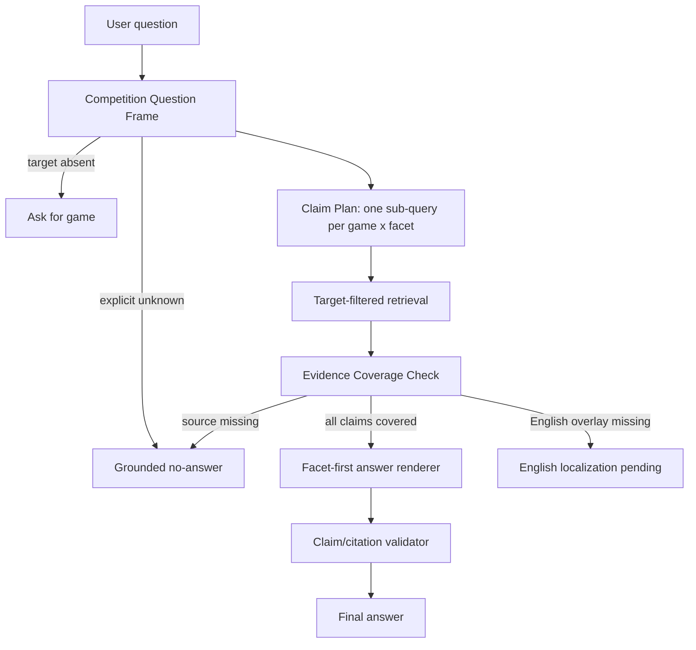

# Paper-Informed Competition Rules RAG Remediation

**สถานะ:** Implementing

**ขอบเขต:** Competition Rules RAG ของ Counter-Strike 2, Arena of Valor (RoV), Tekken 8 และ VALORANT ทั้งไทย/อังกฤษ

**เป้าหมาย:** ทำให้คำตอบกติกาเชื่อมกับหลักฐานที่พิสูจน์ได้ในระดับ `game × rulebook × facet × locale` โดยไม่เพิ่ม alias รายคำหรือให้ Local LLM เดาข้อเท็จจริงที่ไม่มีในเอกสาร

## 1. สิ่งที่ยืนยันจาก Log

ผลประเมินล่าสุด 282 ข้อพบ failure 61 ข้อ:

| กลุ่ม | จำนวน | ความหมาย |
|---|---:|---|
| `source_coverage_gap` | 36 | rulebook ที่ import ไม่มี clause สำหรับสิ่งที่ถาม หรือ chunk ยังไม่ละเอียดพอ |
| `english_localization_gap` | 15 | มี Thai evidence แต่ยังไม่มี approved English overlay |
| `gold_or_section_contract_gap` | 10 | Gold อ้าง heading/section คนละ ID กับ chunk ที่ตอบ factual claim ได้จริง |

ข้อสรุป: ส่วนใหญ่ไม่ใช่ “RAG หาไม่เจอเพราะ semantic model ไม่ฉลาดพอ” แต่เป็นการพิสูจน์ว่า source ครอบคลุม claim หรือไม่ และการจัดการหลายเป้าหมาย/หลายภาษาให้ถูกต้อง

## 2. งานวิจัยที่นำมาใช้

1. [Ammann, Golde, Akbik (ACL 2025): Question Decomposition for RAG](https://aclanthology.org/2025.acl-srw.32/) แยกคำถามซับซ้อนเป็น sub-question แล้ว retrieval และ rerank ต่อข้อย่อย ช่วยให้หลักฐานของแต่ละส่วนไม่ถูกกลืนรวมกัน
2. [Kim et al. (EMNLP Findings 2025): UniRAG](https://aclanthology.org/2025.findings-emnlp.1022/) ใช้ entity-grounded decomposition, ตรวจ sub-fact และ rewrite query เฉพาะเมื่อพบ knowledge gap
3. [Jeong et al. (Adaptive-RAG, 2024)](https://arxiv.org/abs/2403.14403) เลือก retrieval strategy ตามความซับซ้อน แทนการให้ทุกคำถามใช้ขั้นตอนยาวเท่ากัน
4. [Asai and Choi (ACL 2021)](https://aclanthology.org/2021.acl-long.118/) ชี้ว่า paragraph selection และ answerability prediction เป็นปัญหาหลักของ information-seeking QA; เอกสารที่เกี่ยวข้องไม่เท่ากับเอกสารที่ตอบได้
5. [Wallat et al. (2024): Correctness is not Faithfulness in RAG Attributions](https://arxiv.org/abs/2412.18004) อ้างอิง source ที่ดูเหมือนเกี่ยวข้องยังไม่พอ ต้องตรวจว่า claim ในคำตอบมาจาก source นั้นจริง
6. [Hashemi et al. (COLING 2025): Abstain-QA](https://aclanthology.org/2025.coling-main.627/) แนะนำให้วัด answerable กับ unanswerable แยกกัน เพราะ model มักตอบเกินข้อมูลเมื่อไม่มีกลไก abstain ที่ชัด

## 3. การออกแบบที่ใช้กับระบบนี้

ไม่ใช้ agent loop ยาวหรือ Cloud LLM เพราะ source มีขนาดเล็กและ SLA/ความน่าเชื่อถือสำคัญกว่า ให้ใช้ **bounded evidence planner** ดังนี้



### 3.1 `CompetitionQuestionFrame`

ต่อยอด `QuestionFrame` ที่มีอยู่ ไม่ต้องสร้าง route ใหม่:

```python
@dataclass(frozen=True)
class CompetitionQuestionFrame:
    targets: tuple[CompetitionTarget, ...]   # ลำดับตามที่ผู้ใช้ระบุ
    facet: str | None                        # pause | conduct | checkin | roster | ...
    operation: str                           # lookup | compare | overview
    requires_all_targets: bool               # True สำหรับ compare / ต่างกัน / versus
    locale: str                              # th | en
```

Invariant:

- ทุก target ต้องค้น independent จากกัน
- comparison ห้าม render ถ้า target ใด target หนึ่งไม่ผ่าน `EvidenceCoverage`
- evidence จาก game A ไม่มีสิทธิ์ตอบ claim ของ game B
- LLM ไม่มีสิทธิ์สร้าง rule, number, penalty หรือ source ID ใหม่

### 3.2 `EvidenceCoverage`

```python
@dataclass(frozen=True)
class EvidenceCoverage:
    game_id: str
    facet: str
    status: Literal["covered", "missing_source", "missing_localization", "ambiguous"]
    source_chunk_ids: tuple[str, ...]
    evidence_line_ids: tuple[str, ...]
    reason: str
```

กฎตัดสิน:

1. filter `game_id` และ active `rulebook_id` ก่อน semantic score
2. rank chunk ตาม facet-derived-from-source ไม่ใช้ import tag เป็น truth
3. extract บรรทัดที่ตอบ claim โดยตรง
4. ถ้า line ไม่กล่าวถึง proposition ที่ถาม ให้เป็น `missing_source` แม้ chunk จะอยู่ใน rulebook เดียวกัน
5. English ต้องตรวจ Thai source ก่อน; source มีแต่ approved overlay ไม่มี ให้ `missing_localization` ไม่ใช่ answer

### 3.3 Query decomposition แบบ bounded

| คำถาม | Sub-query ที่ต้องสร้าง | เงื่อนไขตอบ |
|---|---|---|
| `CS2 pause ได้กี่ครั้ง` | `(cs2, pause)` | มี clause pause ของ CS2 |
| `CS2 กับ VALORANT pause ต่างกันอย่างไร` | `(cs2, pause)`, `(valorant, pause)` | ทั้งสอง claim covered |
| `VALORANT check-in ยังไง` | `(valorant, pre_match_on_site)` | มี arrival/check-in instruction ตรง |
| `กติกา conduct ของ VALORANT` | `(valorant, conduct)` | มี conduct/fair-play clause ตรง |

การ rewrite ให้ทำเพียงหนึ่งครั้งเมื่อ retrieval รอบแรกไม่ cover และต้องสร้างจาก controlled facet terms เช่น `VALORANT + conduct + fair-play`; ห้าม rewrite เป็นชื่อเกมอื่นหรือ broaden โดยอัตโนมัติ

## 4. สิ่งที่ Implement แล้วในรอบนี้

1. เพิ่ม renderer filter สำหรับคำถาม check-in: เลือกเฉพาะ line ที่เป็น `check-in/รายงานตัว/ต้องมาถึง` จึงไม่พ่วงกฎโน้ต อุปกรณ์ หรือ Match Prep ที่อยู่ข้างกัน
2. English comparison เมื่อไม่มี localization จะ retrieve/verify ครบทุก named game ก่อนบอกว่า translation ยังไม่พร้อม จึงไม่ทำให้ CS2 ถูกนำเสนอเป็นคำตอบแทน VALORANT
3. evaluator แยก `localization_pending` ออกจาก `answer` เพื่อให้คะแนนสะท้อน work ที่ยังต้อง publish จริง

## 5. ลำดับ Implement ต่อไป

1. **P0: Source gap manifest**
   - สร้าง `data/competition_rules/source_coverage_manifest.jsonl`
   - หนึ่ง record ต่อ `game_id, facet, status, official_source_url, owner, last_checked_at`
   - ช่องที่ไม่พบ clause เช่น VALORANT conduct/official-contact/roster และ CS2/RoV on-site check-in ต้องเป็น `unsupported`, ไม่เขียน rule ทดแทน
2. **P0: Evidence line contract**
   - ตอน ingest แยก line/fact unit พร้อม `facet`, `claim_type`, `source_chunk_id`, `effective_date`
   - ห้ามใช้ heading เป็น evidence alias ของ factual row โดยไม่ผ่าน review
3. **P1: Comparison renderer**
   - เมื่อ English overlay ของทุก target approved แล้ว render block ต่อ game ตาม input order
   - แสดง common/difference เฉพาะ fact ที่ evidence ครบทั้งสองฝ่าย
4. **P1: Approved localization release**
   - Review draft 8 records ใน `data/locales/en/localization_review_drafts_competition_remediation_20260921.jsonl`
   - Validate source hash แล้ว publish atomically; draft ห้ามเข้า production answer
5. **P2: Controlled local-LLM rewrite**
   - เรียกเมื่อ deterministic frame มี target ชัด แต่ facet unknown หรือ retrieval รอบแรกไม่ cover
   - JSON schema: `facet`, `rewrite`, `why`; max 1 call, timeout ตาม request budget
   - retrieval ต้องใช้ original target lock; LLM output ใช้เป็น search aid เท่านั้น
6. **P2: Dataset/Gold repair**
   - เพิ่ม versioned evidence-alias manifest สำหรับ source IDs ที่ถูกต้อง
   - ห้ามแก้ Gold ให้ผ่านโดยไม่มี source review

## 6. Acceptance Criteria

- Explicit game: ไม่มี evidence ข้าม target 0 ข้อ
- Comparison: ไม่มี target หายจาก response 0 ข้อ
- Check-in question: detail line ต้องอยู่ facet เดียวกัน 100% ใน regression corpus
- `missing_source` ต้อง safe no-answer/clarification 100% และไม่มี invented claim
- English `localization_pending` แยกในรายงาน ไม่ถูกนับเป็น factual answer
- การใช้ Local LLM rewrite เพิ่มได้หนึ่ง call แต่ไม่มีสิทธิ์ bypass EvidenceCoverage
- ค่า latency ต้องถูกวัดแยก frame/retrieval/verification/renderer/rewrite เพื่อไม่บัง bottleneck

## 7. การทดสอบ

```text
1. Unit: target × facet coverage, adjacent-line renderer, comparison completeness
2. Regression: 282 competition corpus ทั้ง TH/EN
3. Negative set: unsupported game, source gap, stale localization, multi-target missing one side
4. Human review: 15 English localization-pending cases และ Gold/evidence alias 10 cases
```

ผลที่คาดหวัง: คะแนน raw อาจไม่พุ่งทันที เพราะ answer ที่เคยอ้างผิดจะกลายเป็น safe no-answer ก่อน แต่ factual precision, provenance และความสามารถในการระบุ source gap จะสูงขึ้นอย่างตรวจสอบได้ หลังเติม source/approved localization จึงค่อยเพิ่ม answer coverage โดยไม่ลดความปลอดภัย
