# Competition Rules: RAG Claim Format V2

## 1. Goal and Current State

The competition-rule knowledge base must retrieve an answerable fact, not a broad document heading.  The V2 format converts each source clause into a reviewable claim with a locked game target, facet, exact source evidence and bilingual answer fields.

This change improves retrieval quality because the system can filter by `game_id`, `canonical_section` and `facet` before semantic ranking.  It also allows the final answer validator to confirm that the selected evidence is about the requested game and rule.

## 2. Confirmed Evidence

The V2 audit on 2026-09-22 found 104 imported rule records.  All 104 require atomic-claim review, 65 use the same value for heading and clause, and all English translations remain unapproved drafts.  Therefore none of these V2 records may be published to the runtime projection yet.

The existing canonical projection remains owner-gated and inactive.  V2 is a safe review queue, not a bypass for that gate.

> Schema clarification added on 2026-09-22: the generated review queue and the approved runtime projection intentionally use different contracts. Validate queue rows with `competition_rule_claim_v2_review.schema.json`. Convert only owner-approved rows into the stricter `competition_rule_claim_v2_1_runtime.schema.json`. The original `competition_rule_claim_v2.schema.json` is retained as an earlier design reference and must not be treated as the queue validator.

## 3. Target Format

The strict approved-runtime JSON Schema is at:

`data/competition_rules/review/competition_rule_claim_v2_1_runtime.schema.json`

Draft review records are validated separately by:

`data/competition_rules/review/competition_rule_claim_v2_review.schema.json`

Validation and owner-gated conversion commands:

```powershell
py -3 -X utf8 tools/manage_competition_claim_v2.py validate-review
py -3 -X utf8 tools/manage_competition_claim_v2.py build-runtime `
  --release-id competition-v2-owner-approved `
  --output data/competition_rules/releases/competition-v2-owner-approved.jsonl `
  --manifest data/competition_rules/releases/competition-v2-owner-approved.manifest.json
```

The build command writes nothing when no record is owner-approved. Draft English text is never copied into the runtime projection.

One record represents one answerable proposition.  Required blocks are:

| Block | Purpose |
| --- | --- |
| `source` | Immutable source identity, original heading, exact Thai clause and content hash. |
| `claim` | Thai answer plus English overlay status. |
| `retrieval` | Game target, stable section/facet and bilingual query signals. |
| `evidence` | Exact source-clause reference used by the answer contract. |
| `quality` | Atomicity and heading/clause separation review. |
| `approval` | Owner decision required before runtime publication. |

Example:

```json
{
  "schema_version": "competition_rule_claim_v2",
  "claim_id": "rule-cs2-overtime-format-001",
  "status": "approved",
  "source": {
    "doc_id": "cs2_competition_rules",
    "source_chunk_id": "cs2-014",
    "heading_th": "รูปแบบการแข่งขัน",
    "clause_th": "หากเสมอ ให้แข่งขันต่อในช่วง Overtime ตามเงื่อนไขที่ประกาศ",
    "clause_sha256": "..."
  },
  "claim": {
    "statement_th": "กติกา Overtime ของ CS2",
    "answer_th": "หากเสมอ ให้แข่งขันต่อในช่วง Overtime ตามเงื่อนไขที่ประกาศ",
    "answer_en": "If the match is tied, play continues in overtime under the published conditions.",
    "english_status": "approved"
  },
  "retrieval": {
    "game_id": "counter_strike_2",
    "canonical_section": "match_format",
    "facet": "overtime",
    "aliases_th": ["ต่อเวลา", "โอที"],
    "aliases_en": ["overtime", "OT"],
    "question_patterns_th": ["CS2 เสมอทำอย่างไร"],
    "question_patterns_en": ["What happens if a CS2 match is tied?"]
  },
  "evidence": {
    "mode": "exact_source_clause",
    "source_refs": ["cs2-014"]
  },
  "quality": {
    "atomicity": "verified",
    "heading_clause_relation": "separated"
  },
  "approval": {
    "status": "approved",
    "approved_by": "owner-id",
    "approved_at": "2026-09-22T10:00:00+07:00"
  }
}
```

## 4. Ingestion and Publication Flow

```mermaid
flowchart LR
    A[Source document] --> B[Parse heading and exact clauses]
    B --> C[Create V2 review claim]
    C --> D[Assign game, section and facet]
    D --> E[Add Thai and English query signals]
    E --> F[Owner reviews source, answer and translation]
    F -->|Approved| G[Build immutable runtime projection]
    F -->|Needs changes| C
    G --> H[Metadata filter]
    H --> I[Hybrid retrieval and rerank]
    I --> J[Evidence and answer validation]
```



## 5. Rules for Authoring Data

1. Never put a broad heading alone into a runtime-eligible record.  `heading_th` is context; `clause_th` must contain the answerable rule.
2. One claim must answer one proposition.  Split independent restrictions, penalties, schedules or values into separate rows.
3. Use `structured_values` in a future extension only when values are inseparable, such as a complete score table.  Keep its surrounding condition in the same record.
4. `game_id`, `canonical_section`, and `facet` are mandatory.  Do not create a route or handler per game name.
5. Add aliases only for genuine domain vocabulary.  Do not maintain an unbounded typo list; use lexical normalization and bounded semantic retrieval instead.
6. English text is an overlay tied to `clause_sha256`.  A changed Thai clause makes its English localization stale until reviewed again.
7. Runtime projection includes only `status=approved`, `approval.status=approved`, `quality.atomicity=verified`, and English text with `english_status=approved`.
8. Every runtime answer must cite `evidence.source_refs`; document-level citations alone are insufficient for a rule claim.

## 6. Retrieval Design That Uses V2

1. Resolve locale and question frame.
2. Resolve an explicit game target; ask a clarification question if multiple games remain.
3. Filter candidate claims by `game_id`, then section/facet when signals are present.
4. Run hybrid lexical plus vector retrieval on the filtered set.
5. Rerank only the top small candidate set using target/facet alignment.
6. Reject weak, cross-game, stale, or non-approved evidence.
7. Compose from the exact selected clause and validate target, values, language and source reference before replying.

This preserves the useful role of the Local LLM: it may help normalize intent or compose from verified evidence, but it cannot invent rules, replace source evidence or publish knowledge.

## 7. Recommended Improvements Beyond Format

### Parent Context, Child Claims

Index atomic child claims for retrieval, but retain the parent document and heading for answer context.  This avoids a large chunk winning merely because it contains many unrelated terms.

### Hybrid Retrieval

Use lexical retrieval for game names, penalties, round counts and exact terms; combine it with semantic embeddings for paraphrases.  Apply the metadata filter before both methods, then rerank only the top candidates.

### Query Signals from Real Logs

After every review cycle, collect only failed/clarified queries, remove personal data, and add a small number of approved `question_patterns_th/en` to the relevant claim.  This is controlled active learning, not an alias list that grows forever.

### Answer Contract

Require the response to retain the selected `claim_id`, source reference, game target, facet, locale and catalog/release version.  If any field conflicts, return a clarification or no-answer rather than guessing.

### Evaluation Corpus

Maintain gold cases per game and facet, including Thai/English paraphrases, mixed-language queries, ambiguous cross-game questions and unsupported questions.  Score route, target, claim ID, factual value, source and latency separately.

## 8. Immediate Implementation Sequence

1. Review and split the 104 V2 queue records, starting with the 65 heading/clause conflated rows.
2. Fill `answer_th`, proposed aliases and question patterns only where justified by the source or approved test cases.
3. Have the owner approve each Thai claim and its source reference.
4. Approve English overlays independently; do not enable draft translations.
5. Build a new immutable projection from approved V2 records and run Thai/English rule regression.
6. Compare claim-level retrieval accuracy and evidence alignment against the current projection before enabling it with a feature flag.

## 9. Safe Fallback and Compatibility

Until a V2 claim is approved, the system continues using the current safe outcome: clarification or no-answer when evidence is weak.  The queue does not change existing APIs, routes or active release data.  It is compatible with the current local-only LLM and RAG architecture.
