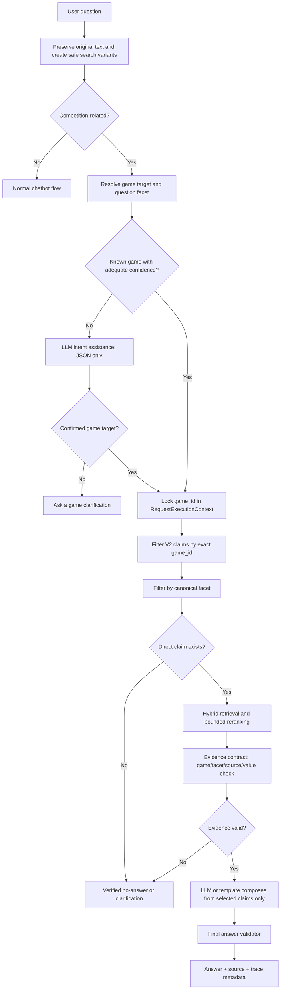

# Flow แก้ความถูกต้องของ Competition RAG

**สถานะ:** Ready for implementation  
**ขอบเขต:** กติกาการแข่งขัน CS2, RoV, TEKKEN 8 และ VALORANT ทั้งภาษาไทย/อังกฤษ  
**เป้าหมาย:** ลดการตอบผิดเกม, เลือกหลักฐานผิด และตอบจากข้อมูลที่ไม่ยืนยัน โดยคง Local LLM และไม่ใช้ Cloud API

## 1. ปัญหาที่ Flow นี้แก้

ผลทดสอบล่าสุดพบปัญหาหลัก 4 กลุ่ม

1. ระบบจับชื่อเกมผิดหรือชื่อเกมถูก normalize จนไม่ตรง alias เช่น `เทคเค่น 8`.
2. Retrieval ดึงหลักฐานข้ามเกมได้ เช่น คำถาม RoV ได้หลักฐาน VALORANT.
3. หนึ่ง source chunk มีหลายกฎ ทำให้เจอคำคล้าย แต่ตอบผิด facet เช่น ถามจำนวนผู้เล่นแล้วได้กฎ pause.
4. บาง Gold case คาดหวังคำตอบ ทั้งที่ source ปัจจุบันไม่มีข้อความยืนยันโดยตรง.

## 2. Target Flow



## 3. Phase 0: Freeze Baseline ก่อนแก้

### งาน

- เก็บ manifest ของ source rules, V2 claims, Gold corpus และ English localization ที่ใช้อยู่ในแต่ละ run.
- ห้ามเขียนทับผลเดิม; ทุก run ใช้ `run_id` ใหม่.
- แยก failure เป็น `target`, `facet`, `evidence`, `source_coverage`, `language`, `format`, `latency`.

### Output ที่ต้องมี

- Baseline ไทยและอังกฤษ 264 cases.
- รายการเคสตัวแทนที่ต้องไม่ regress: RoV/VALORANT cross-target, CS2 penalty, RoV disconnect, Tekken spelling, VALORANT team size.

### Exit criteria

- สามารถบอกได้ทุกข้อที่ไม่ผ่านว่าผิดเพราะ route, data หรือ answer contract.

## 4. Phase 1: Resolve และ Lock เกมเป้าหมาย

### หลักการ

การแข่งขันต้องไม่ใช้ผลจาก generic Game Resolver เป็นตัวตัดสินสุดท้าย เพราะ resolver นั้นรองรับบริบท chatbot อื่นด้วย. Competition path ต้องมี `CompetitionTargetResolution` เป็นแหล่งจริงหนึ่งเดียว.

```python
@dataclass(frozen=True)
class CompetitionTargetResolution:
    game_ids: tuple[str, ...]
    facet: str | None
    confidence: float
    method: str  # exact_alias | safe_variant | llm_assisted | clarification
    original_text: str
    normalized_variants: tuple[str, ...]
```

### ขั้นตอน

1. เก็บข้อความดิบไว้เสมอ; ห้ามเขียนทับด้วย normalization.
2. สร้าง variants แบบปลอดภัย: lower-case, whitespace compact, punctuation-tolerant และ alias ที่อนุมัติ.
3. ตรวจ exact alias และ phrase ก่อน fuzzy matching.
4. หากยังไม่แน่ใจ ให้ Local LLM ตอบ JSON ที่เลือกได้เฉพาะ game IDs ใน catalog หรือ `unknown`.
5. เมื่อได้เกมแล้ว บันทึก `game_ids` ใน `RequestExecutionContext`.
6. Retrieval ทุกจุดต้อง reject candidate ที่ `claim.game_id` ไม่อยู่ใน `game_ids`.

### Invariants

- คำถามเกมเดียว ห้ามมี candidate ต่างเกมเข้าสู่ reranker.
- คำถามเปรียบเทียบหลายเกม resolve แต่ละเกมแยกกัน แล้วตอบแบบ side-by-side.
- ไม่รู้เกม = clarification/no-answer, ไม่เดาชื่อเกมใกล้เคียง.

### Tests

- `เทคเค่น 8`, `เทคเล่น 8`, `Tekken 8`, `t8`.
- คำถาม RoV ต้องไม่มี VALORANT claim ใน trace.
- คำถาม CS2 ต้องไม่มี Call of Duty generic resolver result ส่งผลต่อ competition response.

## 5. Phase 2: ทำ Source เป็น Atomic Claim V2

### รูปแบบข้อมูล

```json
{
  "claim_id": "valorant_team_size_001",
  "game_id": "valorant",
  "facet": "team_size",
  "proposition": "Each team has five active players.",
  "source_chunk_id": "valorant_sXX",
  "source_quote_th": "...",
  "source_url": "...",
  "source_version": "...",
  "answerable": true,
  "status": "approved"
}
```

### ลำดับการแตกข้อมูล

1. CS2: penalty matrix, protest/dispute, language/reporting, pause/timeout, version/settings.
2. RoV: disconnect, technical pause, rejoin, force majeure, venue/check-in เฉพาะสิ่งที่ source ระบุ.
3. TEKKEN 8: game settings, character restrictions, pause, match configuration.
4. VALORANT: team size, roster/substitute, emergency pause, match procedure, conduct.

### กฎคุณภาพ

- หนึ่ง claim ต้องตอบ proposition เดียว.
- Claim ที่เป็นเพียงชื่อหัวข้อ, ตารางไม่ครบ หรือ context ไม่พอ มีได้ใน index แต่ `answerable=false`.
- `penalty_matrix` แยกหนึ่งรายการต่อ violation-to-penalty mapping.
- ความสัมพันธ์ parent section เก็บไว้เพื่ออ้างบริบท แต่ห้ามใช้แทน claim ที่ตอบได้.

### Exit criteria

- ไม่มี claim ที่ตอบ team size และ pause ในข้อความเดียว.
- ทุก claim ที่ `answerable=true` มี source quote และ game/facet ครบ.

## 6. Phase 3: Retrieval และ Evidence Contract

### ลำดับการคัดเลือก

```text
exact game_id (mandatory)
  -> canonical facet (mandatory when known)
  -> explicit keyword / phrase match
  -> vector similarity
  -> bounded rerank top 8
  -> evidence contract
```

### Evidence Contract

ก่อน compose ต้องตรวจ

- `candidate.game_id` ตรงกับทุก game target.
- `candidate.facet` ตรงกับ requested facet หรือเป็น permitted adjacent facet ที่กำหนดไว้ล่วงหน้า.
- source quote รองรับคำตอบทุก claim ที่จะพูด.
- ตัวเลข, โทษ, เวลา, map และชื่อเกมมาจาก selected claims เท่านั้น.
- English answer ใช้ English approved localization ของ claim เดียวกัน หรือคืน English no-answer.

### Safe outcome

- ไม่มี claim ของ facet นั้น: แจ้งว่าไม่พบข้อมูลยืนยันในกติกาชุดปัจจุบัน.
- target ไม่ชัด: ถามชื่อเกม.
- source ขัดกัน: แจ้งข้อขัดกันพร้อม source และไม่เลือกข้าง.

## 7. Phase 4: Local LLM ในบทบาทที่ถูกต้อง

### ให้ LLM ทำ

- เข้าใจคำพิมพ์ผิด ภาษาวิบัติ คำย่อ และคำถามกว้าง.
- เลือก `game_id`, `facet`, `intent` จากรายการที่ระบบส่งให้.
- เขียนคำตอบให้อ่านเป็นธรรมชาติจาก claims ที่ผ่าน evidence contract.

### ห้าม LLM ทำ

- สร้างกติกา ราคา จำนวน หรือบทลงโทษเอง.
- เปลี่ยน game target ที่ถูก lock แล้ว.
- เลือก source นอก candidate set.
- แปลข้อมูลไทยสดเพื่อใช้เป็น factual English answer.

### Prompt contract ที่ต้องเพิ่ม

Intent prompt ต้องคืน JSON:

```json
{
  "game_ids": ["valorant"],
  "facet": "team_size",
  "intent": "competition_rule_lookup",
  "confidence": 0.91,
  "needs_clarification": false
}
```

Composer prompt รับเฉพาะ `selected_claims`; ถ้าไม่มี claim ให้ output safe outcome code เท่านั้น.

## 8. Phase 5: English Parity

1. Thai approved claim เป็น source of truth.
2. English localization อ้าง `claim_id` และ source hash เดียวกัน.
3. หาก hash ไทยเปลี่ยน English localization เป็น stale และห้ามตอบ claim นั้น.
4. Template ไทยและอังกฤษใช้ data model เดียวกัน เช่น list, table, source block และ clarification.
5. ชื่อบุคคลและชื่อเกมเก็บ canonical display value ไม่แปลโดยอัตโนมัติ.

## 9. Phase 6: Test Loop

### รอบละขั้นตอน

1. Unit test target resolver และ normalization.
2. Focused regression ของเคสที่แก้ 10-30 ข้อ.
3. Run ไทย 264 และอังกฤษ 264.
4. วิเคราะห์ด้วย failure dimension ไม่ใช่ดู pass rate อย่างเดียว.
5. แก้หนึ่ง root cause ต่อรอบ แล้ว run ซ้ำ.
6. เมื่อ competition ผ่านเกณฑ์ ค่อย run Thai/English 1,600 general regression.

### เกณฑ์ผ่าน

- Cross-game evidence = 0.
- Unsupported factual claim = 0.
- Target resolution ของ representative cases = 100%.
- Evidence alignment ของชุด competition >= 95% ก่อนขยาย Gold corpus.
- Thai และ English format parity ผ่านทุก canonical case.
- ไม่มี case เกิน SLA ที่ตั้งไว้.

## 10. ลำดับงานที่ควรเริ่มทันที

1. Implement `CompetitionTargetResolution` และ target lock.
2. แก้ normalization ที่ทำให้ `เทคเค่น` หาไม่เจอ พร้อม regression test.
3. สร้าง/ตรวจ Atomic Claim V2 สำหรับ 4 เกมใน facet ที่พลาดสูง.
4. เปลี่ยน retrieval ให้ filter exact `game_id + facet` ก่อน score.
5. เพิ่ม evidence contract และ log เหตุผลที่ reject candidate.
6. ใช้ LLM intent JSON เฉพาะเมื่อ deterministic resolution ไม่มั่นใจ.
7. Publish English overlay ตาม approved claims.
8. รัน test loop จน evidence alignment ถึงเกณฑ์ แล้วจึง full regression.

## 11. Rollback และ Compatibility

- เปิด target lock และ V2 retrieval หลัง feature flag ก่อน.
- เก็บ Fast/Structured path เดิมไว้สำหรับ FAQ นอก competition.
- หาก V2 claim ของ facet ยังไม่มี ให้ fallback เป็น verified no-answer ไม่ fallback ไป chunk เก่าแบบข้ามเกม.
- API fields เดิมต้องไม่เปลี่ยน; เพิ่ม trace metadata แบบ optional เท่านั้น.

## เอกสารที่เกี่ยวข้อง

- `docs/86_competition_rag_claim_format_v2_20260922.md`
- `docs/87_competition_rag_regression_analysis_20260922.md`
- `data/competition_rules/review/competition_rule_claim_v2_review_queue.jsonl`
