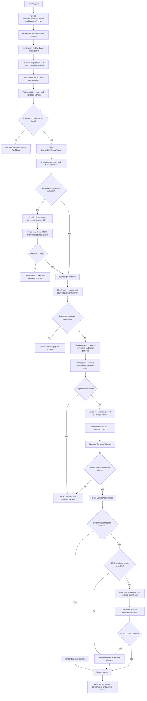

# Competition RAG End-to-End Remediation Flow

**Status:** Implementation specification  
**Scope:** CS2, RoV, TEKKEN 8, VALORANT; Thai, English and mixed-language questions  
**Runtime constraint:** Local models only; no Cloud LLM and no runtime translation  
**Primary goal:** Every factual answer must be traceable to an approved atomic claim for the requested game and facet. If that cannot be proven, the system must clarify or return a verified no-answer.

---

## 1. Outcomes This Flow Must Guarantee

The completed system must handle all of the following without adding a handler for every possible sentence:

1. Exact questions, informal language, minor typos and common distorted language.
2. Thai, English, mixed-language questions and English game names inside Thai sentences.
3. One game, multiple games, one facet, multiple facets and comparison questions.
4. Follow-up questions that omit the game or facet but have usable session context.
5. Unknown games, ambiguous abbreviations and game-like text that is not a game.
6. Source records containing broad sections, tables, nested clauses and multiple rules.
7. Missing source coverage, stale translations, conflicting versions and withdrawn rules.
8. Local LLM timeout, invalid JSON, low confidence, unavailable model and full model queue.
9. New rulebooks and owner updates without adding a new runtime route per game.
10. Full traceability from answer back to `claim_id`, exact source clause and release version.

The following invariants are non-negotiable:

- Cross-game evidence is always zero.
- Unsupported PSU claims are always zero.
- A model cannot change a target that has already been locked.
- A semantic score cannot override a failed metadata or evidence contract.
- Missing information must remain missing; another facet or another game's rule cannot substitute for it.
- Thai and English answers use the same approved claim and the same factual values.

---

## 2. Complete Runtime Flow



---

## 3. Request-Local State: Resolve Once, Reuse Everywhere

The current code calls `resolve_competition_targets()` from several modules. That permits the same request to be interpreted repeatedly. Extend `RequestExecutionContext` so target, facet, retrieval and evidence decisions are computed once and reused.

```python
@dataclass
class RequestExecutionContext:
    request_id: str
    catalog_version: str
    locale_decision: LocaleDecision | None = None
    question_understanding: QuestionUnderstanding | None = None
    competition_frame: CompetitionQueryFrame | None = None
    competition_resolution: CompetitionResolution | None = None
    retrieval_results: dict[tuple[str, str, str], Any] = field(default_factory=dict)
    selected_claim_ids: list[str] = field(default_factory=list)
    rejected_candidates: list[CandidateRejection] = field(default_factory=list)
    attempted_capabilities: set[tuple[str, str, tuple[str, ...]]] = field(default_factory=set)
    counters: dict[str, int] = field(default_factory=dict)
```

Rules:

- Context exists only for one HTTP request and never crosses a session boundary.
- Session history is an input snapshot, not mutable global state.
- `competition_resolution` is immutable after `target_locked=true`.
- Every consumer reads the same resolution. No module re-runs target resolution independently.
- Comparison subqueries inherit only their assigned game target, not the entire parent target list.

Implementation impact:

- `question_frame.py` creates or obtains the resolution.
- `competition_coverage.py`, `retrieval.py`, `bilingual_english.py` and `engine.py` consume it.
- Legacy calls remain temporarily behind a compatibility adapter and emit `duplicate_resolution_attempt`.

---

## 4. Stage A: Input Preservation and Safe Normalization

### 4.1 Preserve three representations

```python
@dataclass(frozen=True)
class QueryText:
    original: str
    display_clean: str
    search_variants: tuple[str, ...]
```

- `original`: exact user text for logs and clarification.
- `display_clean`: whitespace/control-character cleanup only.
- `search_variants`: non-destructive forms used by resolver and retrieval.

Never replace `original` with a corrected or normalized sentence.

### 4.2 Build bounded search variants

Allowed variants:

1. Unicode normalization.
2. Case-folding for Latin characters.
3. Whitespace and punctuation normalization.
4. Compact form for known aliases, such as `tekken8`.
5. Keyboard-layout detection result, but only after the input-quality guard confirms likely wrong layout.
6. Thai diacritic-tolerant form for entity matching only.

Not allowed:

- General autocorrection over the whole question.
- Unbounded fuzzy comparison against every alias.
- Silent replacement of Thai characters that changes a proper name.
- Using an LLM-rewritten query as the displayed user query.

### 4.3 Decision behavior

- High-confidence wrong keyboard layout: ask the user to type again under the current detection-only policy.
- Minor typo with a unique game target: continue and record `resolution_method=safe_variant`.
- Typo maps to multiple games: clarification.
- No game-like span: do not run fuzzy game matching over the whole sentence.

Regression cases must include `เทคเค่น 8`, `เทคเล่น 8`, `Tekken8`, `t8`, `ROV`, `AOV`, `วาโล`, and unrelated words containing short aliases.

---

## 5. Stage B: Session and Follow-up Context

Session context may fill an omitted target only when the current question is a clear follow-up.

```python
@dataclass(frozen=True)
class ConversationReference:
    previous_domain: str | None
    previous_game_ids: tuple[str, ...]
    previous_facets: tuple[str, ...]
    previous_answer_language: str | None
    age_turns: int
```

Resolution order:

1. Explicit current-turn game always wins.
2. Explicit pronoun/reference plus one recent game may inherit that game.
3. A short follow-up such as “แล้วเรื่อง pause ล่ะ” may inherit the last game for a limited number of turns.
4. New explicit domain or multiple recent games cancels inheritance.
5. Session context may suggest a target but cannot supply factual evidence.

Log `target_origin=current_turn|session_followup|llm_assisted|clarification`.

---

## 6. Stage C: Multi-Question and Comparison Decomposition

Before retrieval, represent the request as independent subquestions.

```python
@dataclass(frozen=True)
class CompetitionSubquery:
    subquery_id: str
    game_ids: tuple[str, ...]
    facet: str | None
    operation: str  # lookup | compare | list | verify
    original_span: str
```

Examples:

- “CS2 ทีมละกี่คนและ pause ได้กี่ครั้ง” becomes two subqueries with one target and two facets.
- “CS2 กับ VALORANT เรื่อง technical pause ต่างกันอย่างไร” becomes one `compare` plan with one lookup per game.
- “RoV หลุดเกมแล้วทำยังไง แล้วต้องแจ้งใคร” becomes `disconnect` and `in_match_operations`.

Constraints:

- Maximum four subqueries per request.
- Every subquery receives its own evidence contract.
- A comparison answer is produced only after each side is independently evaluated.
- Missing evidence on one side must be shown explicitly; it must not be copied from the other game.

---

## 7. Stage D: Competition Query Frame

Create one stable semantic frame before selecting tools.

```python
@dataclass(frozen=True)
class CompetitionQueryFrame:
    operation: str
    game_ids: tuple[str, ...]
    facets: tuple[str, ...]
    locale: str
    comparison: bool
    requested_values: tuple[str, ...]
    explicit_terms: tuple[str, ...]
    confidence: float
    needs_clarification: bool
    target_origin: str
```

### Canonical facet taxonomy

Use one taxonomy in data, resolver, retrieval, Gold tests and logs:

| Canonical facet | Includes | Must not silently substitute |
| --- | --- | --- |
| `rulebook_identity` | event identity, scope, rulebook version | general introduction only |
| `eligibility_registration` | eligibility, registration, entry submission | on-site check-in |
| `pre_match_on_site` | arrival, check-in, reporting at venue | registration |
| `team_size` | active player count, team composition | pause or substitute procedure |
| `roster_composition` | starters, substitutes, roster limit | team size when count is absent |
| `competition_format` | bracket, BO3/BO5, elimination | match settings |
| `match_configuration` | room/server/match creation | player-owned settings |
| `match_settings` | map/mode/round/economy settings | hardware rules |
| `map_pool` | allowed maps, pick/ban | match format |
| `equipment` | provided/allowed devices and software | studio inventory |
| `in_match_operations` | referee contact and actions during match | general conduct |
| `pause_timeout` | tactical/technical/emergency pause | disconnect outcome |
| `disconnect` | connection loss, reconnect, restart/rematch | technical pause unless linked explicitly |
| `fair_play_conduct` | behavior, sportsmanship, prohibited conduct | penalty value |
| `penalty` | a specific violation and consequence | entire penalty table |
| `penalty_matrix` | list/table of violations and penalties | general conduct |
| `protest_dispute` | objections, disputes, appeals, final decision | reporting abuse or language rules |
| `schedule` | match/event date and time | studio opening hours |

Facet policy must define only reviewed adjacency, for example `team_size -> roster_composition` may be considered adjacent but cannot pass the contract unless the clause actually contains the requested player count.

---

## 8. Stage E: Deterministic Resolution, Then LLM Assistance

### 8.1 Deterministic pass

Use exact game aliases, approved safe variants, explicit rule signals and canonical facet patterns first.

Return:

```python
@dataclass(frozen=True)
class CompetitionResolution:
    status: str  # resolved | ambiguous | unsupported | absent
    game_ids: tuple[str, ...]
    facets: tuple[str, ...]
    target_confidence: float
    facet_confidence: float
    method: str
    target_locked: bool
    reason_codes: tuple[str, ...]
```

### 8.2 LLM semantic parser gate

Call Local LLM only if:

- Competition intent is likely, and
- target or facet remains unresolved/ambiguous, and
- enough global budget remains, and
- model health/circuit breaker allows the call.

The model receives a closed list of valid game IDs, facets and operations. It must return JSON only:

```json
{
  "domain": "competition_rules",
  "operation": "lookup",
  "game_ids": ["tekken8"],
  "facets": ["match_settings"],
  "confidence": 0.88,
  "needs_clarification": false,
  "surface_interpretation": "asks which in-game settings are required"
}
```

Parser output validation:

- Reject unknown IDs and facets.
- Reject a game not supported by deterministic spans unless the deterministic state was `absent` and the model confidence passes the configured threshold.
- Never let the model remove an explicitly mentioned game.
- Multiple games require `comparison=true` or a decomposed multi-target plan.
- Invalid JSON, timeout or low confidence returns to clarification; it does not call the model repeatedly.

---

## 9. Stage F: Coverage and Release Gate

Before vector search, determine whether the active release claims to cover the proposition.

Coverage states:

```text
covered
unsupported_in_active_source
claim_not_yet_reviewed
english_localization_missing
english_localization_stale
source_version_conflict
retired
unknown
```

Decision table:

| State | Runtime behavior |
| --- | --- |
| `covered` | Continue retrieval. |
| `unsupported_in_active_source` | Verified no-answer stating the rule set does not contain the requested item. |
| `claim_not_yet_reviewed` | Safe no-answer; do not expose draft data. |
| `english_localization_missing/stale` | English no-answer with Thai source link and localization status. |
| `source_version_conflict` | Report conflict internally and return a source-conflict safe outcome. |
| `retired` | Do not retrieve. |
| `unknown` | Retrieve only approved claims; no legacy broad-chunk substitution. |

This gate prevents a source gap from looking like a semantic-retrieval failure.

---

## 10. Stage G: Approved Claim Projection

### 10.1 Separate review and runtime schemas

The review queue and runtime projection must never share a loose schema. They have different trust levels and field semantics:

| Contract | File | Purpose |
| --- | --- | --- |
| Draft review | `competition_rule_claim_v2_review.schema.json` | Validates imported/proposed metadata while owner review is pending. |
| Approved runtime | `competition_rule_claim_v2_1_runtime.schema.json` | Strict publish contract used to build retrieval indexes. |

The conversion step is explicit. It maps proposed fields to approved fields only after review:

```text
document_id                       -> source.document_id
canonical_section_proposed        -> retrieval.canonical_section
facet_proposed                    -> retrieval.facet
answer_en_status=draft            -> not published
review_status=approved            -> approval.thai_status=approved
```

Unknown fields, unknown `game_id`, unknown facets and invalid hashes fail publication. Draft rows never enter the runtime index directly.

`module_proposed` is also closed to reviewed modules. The current queue contains `common` plus specific modules for CS2 map veto/overtime, RoV break time/hero and skin, TEKKEN 8 character and stage, and VALORANT agent selection/pause taxonomy. A new module requires taxonomy review rather than accepting arbitrary text.

Only publish a V2 record when all conditions pass:

```text
status == approved
approval.status == approved
quality.atomicity == verified
quality.heading_clause_relation == separated
source hash matches current source
release_id == active release
answerable == true
English: english_status == approved and localization hash matches
```

The runtime projection should contain:

```python
@dataclass(frozen=True)
class RuntimeCompetitionClaim:
    claim_id: str
    release_id: str
    game_id: str
    canonical_section: str
    facet: str
    statement_th: str
    answer_th: str
    answer_en: str | None
    source_chunk_id: str
    source_quote_th: str
    source_url: str
    source_sha256: str
    lexical_terms_th: tuple[str, ...]
    lexical_terms_en: tuple[str, ...]
    embedding_text_th: str
    embedding_text_en: str | None
```

Heading text may enrich embedding context but cannot become answer evidence.

---

## 11. Stage H: Target-Grounded Hybrid Retrieval

### 11.1 Hard filtering before scoring

Apply in this order:

1. Active `release_id`.
2. `approval=approved` and `answerable=true`.
3. Exact `game_id` for the current subquery.
4. Exact canonical facet, followed only by explicitly permitted adjacent facets.
5. Effective date/version if the question references a specific event/version.
6. Locale availability.

If no claim remains, stop. Do not search the whole corpus to find something similar.

### 11.2 Candidate generation

- Lexical search rewards exact game terms, domain terms, numbers and explicit phrases.
- Semantic search handles paraphrases after hard metadata filtering.
- Retrieve a bounded number from each method, merge by `claim_id`, then rerank at most eight candidates.
- Do not use headings, generic words such as “rules”, “official”, or “tournament” as decisive signals.

Suggested score components:

```text
0.35 explicit facet phrase
0.25 lexical/BM25 claim match
0.25 semantic similarity
0.10 requested-value match
0.05 source specificity
```

Metadata filters are prerequisites, not score bonuses.

### 11.3 Candidate diversity

- Select the best direct claim first.
- Add an adjacent claim only if it answers a separate requested value.
- Maximum four evidence claims for one response.
- Avoid returning three near-duplicate chunks from the same parent section.

---

## 12. Stage I: Evidence Contract

Every candidate receives a pass/reject reason.

```python
@dataclass(frozen=True)
class EvidenceDecision:
    claim_id: str
    accepted: bool
    game_match: bool
    facet_match: bool
    proposition_supported: bool
    source_current: bool
    locale_available: bool
    requested_values: dict[str, str]
    rejection_codes: tuple[str, ...]
```

Required checks:

1. Target game equals the locked game.
2. Claim facet answers the requested proposition, not merely a related topic.
3. Exact source clause contains support for every factual value.
4. Claim is active and source hash is current.
5. English answer maps to the same claim/hash.
6. Numeric values, penalties, times, map names and roster counts can be extracted and compared.
7. A table claim includes the relevant row and its condition, not only the table heading.

Typical rejection codes:

```text
cross_game
wrong_facet
heading_only
mixed_propositions
missing_requested_value
stale_source
missing_localization
weak_semantic_only
duplicate_claim
conflicting_claim
```

---

## 13. Stage J: Verified Answer Plan

The composer never receives raw search results. It receives a verified plan.

```python
@dataclass(frozen=True)
class VerifiedAnswerPlan:
    operation: str
    locale: str
    game_ids: tuple[str, ...]
    facets: tuple[str, ...]
    claims: tuple[RuntimeCompetitionClaim, ...]
    response_shape: str  # direct | list | table | comparison | clarification | no_answer
    required_values: tuple[str, ...]
    source_links: tuple[str, ...]
```

Choose deterministic rendering when the answer is a simple value, list, schedule, setting or penalty row. Use LLM composition only when natural synthesis across several approved claims is useful.

---

## 14. Stage K: Composition and Prompt Contracts

### 14.1 Deterministic templates

Templates should handle:

- Direct rule lookup.
- Player/team count.
- Pause/timeout conditions.
- Penalty row and penalty table.
- Comparison by game.
- Clarification.
- Missing source coverage.
- Missing/stale English localization.

Thai and English templates share the same `VerifiedAnswerPlan`, so their structure and factual detail remain parallel.

### 14.2 Local LLM composer

System prompt requirements:

```text
You are an evidence composer, not a knowledge source.
Use only SELECTED_CLAIMS.
Keep game IDs, rule values, numbers, names and source links unchanged.
Do not add a reason, exception, penalty or procedure not present in the claims.
If the claims do not support a requested part, mark that part unsupported.
Return ANSWER plus USED_CLAIM_IDS in JSON.
```

The response parser must verify that `USED_CLAIM_IDS` is a subset of the supplied claim IDs. Free-form output without IDs falls back to deterministic extractive rendering.

### 14.3 General chatbot role

The existing role prompt remains the high-level behavior instruction. It must not carry hundreds of game aliases or factual rules. Competition understanding belongs in the semantic parser schema; facts belong in approved claims.

---

## 15. Stage L: Final Answer Contract

Validate after composition:

- Requested and answered game targets are identical.
- Every factual sentence maps to at least one selected claim.
- All required values are present or explicitly marked unavailable.
- Numbers, times, penalties and names match evidence exactly.
- No Thai prose leaks into English except approved proper nouns/source labels.
- No runtime translation was performed.
- Sources correspond to used claims, not merely the document homepage.
- Response shape matches the operation: comparison is a comparison; list is complete within evidence.

If validation fails:

1. Do not call the LLM a second time by default.
2. Render the verified extractive fallback.
3. If fallback cannot meet the contract, return clarification/no-answer.
4. Record the failed validator codes.

---

## 16. Failure and Safe-Outcome Matrix

| Failure | User-facing result | Retryable |
| --- | --- | --- |
| No game in a game-specific rule question | Ask which supported game's rules they mean | Yes, user clarification |
| Unsupported game explicitly named | State that the active knowledge base has no rulebook for that game | No until data added |
| Several possible games from typo | Show short candidate list | Yes |
| Facet unclear | Ask which rule topic they need | Yes |
| Known source gap | State that the active rulebook has no verified clause for that topic | No until source updated |
| English localization missing/stale | English safe no-answer plus original Thai source link | No until approved |
| Conflicting active claims | State that verified sources conflict and avoid deciding | Internal review |
| LLM unavailable/timeout | Deterministic verified answer | Automatic fallback |
| LLM invalid JSON | Ignore model output and use deterministic result | Automatic fallback |
| Retrieval budget exhausted | Verified no-answer/timeout response | Possibly |
| Final contract violation | Extractive fallback or no-answer | Automatic fallback |

---

## 17. Logging and Explainability

Every competition request must write stage events with no booking PII:

```json
{
  "request_id": "...",
  "session_id": "...",
  "event": "competition_answer_finished",
  "locale": "th",
  "operation": "lookup",
  "game_ids": ["rov"],
  "facets": ["disconnect"],
  "target_origin": "current_turn",
  "resolution_method": "exact_alias",
  "candidate_claim_ids": ["..."],
  "selected_claim_ids": ["..."],
  "rejected": [{"claim_id": "...", "reason": "wrong_facet"}],
  "coverage_state": "covered",
  "composer": "deterministic",
  "validator_status": "passed",
  "latency_ms": 312
}
```

Required counters:

- `competition_target_resolved`, `competition_target_clarified`, `competition_cross_game_rejected`.
- `competition_source_gap`, `competition_claim_not_reviewed`.
- `competition_retrieval_candidates`, `competition_claims_selected`.
- `competition_llm_parser_used`, `competition_llm_composer_used`, `competition_llm_fallback`.
- `competition_answer_contract_failed`, grouped by reason.
- Accuracy and no-answer rate by locale, game and facet.

The analyzer must report causal categories rather than only pass/fail.

---

## 18. New Data Ingestion and Update Flow

```mermaid
flowchart LR
    A[PDF / website / owner record] --> B[Immutable source snapshot]
    B --> C[Parse headings, clauses and tables]
    C --> D[Generate draft atomic claims]
    D --> E[Assign game, section, facet and effective version]
    E --> F[Automatic schema and atomicity checks]
    F --> G[Owner reviews Thai clause and answer]
    G --> H{Approved?}
    H -- No --> D
    H -- Yes --> I[Create English draft tied to source hash]
    I --> J[Human English review]
    J --> K[Build immutable release projection]
    K --> L[Run focused + full regression]
    L --> M{Acceptance passes?}
    M -- No --> D
    M -- Yes --> N[Atomic release switch]
```



### Update rules

- New content never edits an active release in place.
- Changed source text creates a new hash/version and marks dependent English localization stale.
- A removed rule is retired in the next release but remains traceable in historical logs.
- New facets require taxonomy review; do not create arbitrary free-text facet names.
- Query patterns are added from reviewed failed logs only, not from every user message.
- Publication updates Structured and RAG projections from the same release manifest.

---

## 19. Test Architecture

### 19.1 Unit tests

- Safe normalization and keyboard detection.
- Exact/compact/typo game target resolution.
- Facet classification and adjacency policy.
- Session follow-up inheritance and cancellation.
- Multi-question decomposition.
- V2 schema, source hash and localization status.
- Evidence contract rejection codes.
- Composer/validator numeric preservation.

### 19.2 Targeted regression

Maintain named cases for each confirmed failure:

- RoV request cannot select VALORANT evidence.
- `เทคเค่น 8` and safe variants resolve to `tekken8`.
- VALORANT team-size query cannot select emergency-pause evidence.
- CS2 penalty query selects an atomic penalty row/table claim.
- RoV disconnect selects disconnect/reconnect evidence, not a generic technical-pause heading.
- Protest query cannot select language/reporting rules without an actual dispute procedure.
- Missing check-in clause returns a source-gap outcome.
- English missing localization cannot expose draft translation.

### 19.3 Corpus tests

1. Focused repaired cases.
2. Competition Thai 264.
3. Competition English 264.
4. New adversarial competition corpus with typos, mixed language, multi-turn and unsupported games.
5. Thai general 1,600+.
6. English shadow/general 1,600+.
7. Concurrent HTTP test to verify request/session isolation.

Score separately:

```text
domain_route
operation
game_target
facet
coverage_state
claim_id
factual_values
source_reference
answer_language
format
latency
```

### 19.4 Acceptance criteria

- Cross-game evidence: `0`.
- Unsupported factual claims: `0`.
- Representative target and facet cases: `100%`.
- Competition evidence alignment: at least `95%` before enabling V2.
- Approved English claim parity with Thai: `100%` for factual values.
- No previously passing critical fact may regress.
- No request/session context leak under concurrent tests.
- No request exceeds the configured production ceiling; LLM failure must still finish through fallback.

---

## 20. Implementation Work Packages

### WP1: Single Resolution State

Files likely affected:

- `app/pipeline/execution_context.py`
- `app/pipeline/competition_targets.py`
- `app/pipeline/question_frame.py`
- `app/pipeline/engine.py`
- `app/pipeline/competition_coverage.py`
- `app/pipeline/retrieval.py`
- `app/pipeline/bilingual_english.py`

Deliverables:

- Expanded resolution structure.
- Resolve-once adapter stored in request context.
- Duplicate-resolution trace and compatibility tests.

### WP2: Safe Normalization and LLM Semantic Parser

Deliverables:

- Original/display/search representations.
- Thai proper-name regression.
- Closed-schema LLM parser with timeout and JSON validation.
- No unbounded alias growth.

### WP3: Facet Taxonomy and Query Frame

Deliverables:

- One shared taxonomy module.
- Multi-facet and comparison decomposition.
- Reviewed adjacency policy.
- Removal of duplicate facet logic from coverage/retrieval modules.

### WP4: Claim V2 Review and Runtime Projection

Deliverables:

- Split the 104 imported records, prioritizing the 65 conflated rows.
- Validate all 104 rows against the dedicated review schema.
- Convert approved rows through a deterministic review-to-runtime mapper.
- Validate runtime rows against the strict V2.1 schema with no unknown fields.
- Atomic claims for high-failure facets first.
- Coverage manifest and immutable release builder.
- English overlay approval workflow.

### WP5: Target-Grounded Retrieval and Evidence Contract

Deliverables:

- Metadata prefilter.
- Bounded hybrid retrieval/reranking.
- Candidate rejection reasons.
- Verified answer plan.

### WP6: Bilingual Rendering and Final Validation

Deliverables:

- Parallel Thai/English templates.
- Constrained composer prompt.
- Claim-ID and factual-value validator.
- Deterministic extractive fallback.

### WP7: Evaluation, Shadow Run and Release

Deliverables:

- Focused and full reports.
- Claim-level trace analyzer.
- Shadow comparison against current retrieval.
- Feature flags and rollback thresholds.

---

## 21. Recommended Implementation Order

1. Freeze current 264 Thai/English outputs and source hashes.
2. Validate the existing queue with the review schema; block malformed rows.
3. Lock the shared game/facet taxonomy and strict runtime V2.1 schema.
4. Add request-context fields and resolve-once compatibility layer.
5. Fix non-destructive normalization and target-lock regressions.
6. Centralize the facet taxonomy and query frame.
7. Implement coverage states and explicit safe outcomes.
8. Review/split V2 claims for the highest-failure facets.
9. Build approved V2 runtime projection without changing the active release.
10. Implement target-grounded hybrid retrieval and evidence contract in shadow mode.
11. Add deterministic bilingual renderer and constrained LLM composer.
12. Run focused cases, 264 Thai, 264 English and analyze by failure dimension.
13. Repeat claim/data correction until evidence alignment reaches the threshold.
14. Run hidden/adversarial, 1,600+ general and concurrent session tests.
15. Enable V2 with a feature flag, observe, then retire legacy broad-chunk retrieval only after stability is proven.

---

## 22. Feature Flags and Rollback

Suggested flags:

```text
PSU_COMPETITION_RESOLVE_ONCE=0
PSU_COMPETITION_QUERY_FRAME_V2=0
PSU_COMPETITION_CLAIM_V2_SHADOW=1
PSU_COMPETITION_CLAIM_V2_ACTIVE=0
PSU_COMPETITION_LLM_SEMANTIC_PARSER=0
PSU_COMPETITION_LLM_COMPOSER=0
```

Rollback triggers:

- Any cross-game evidence.
- Any unsupported factual claim.
- Target accuracy decreases from baseline.
- Critical Thai regression.
- English claim uses missing/stale localization.
- Timeout/crash rate increases.
- Session data appears in another request.

Rollback switches only the affected feature flag. Approved V2 data and logs remain available for diagnosis.

---

## 23. Source Version, Conflict and Completeness Rules

### Version selection

- Filter by explicit event/version/date before semantic ranking.
- If the question has no date, use the currently active owner-approved release.
- Never mix claims from different releases in one answer unless the user asks for a historical comparison.
- `supersedes_claim_id` creates an auditable chain; it does not delete history.

### Conflict resolution

Source precedence is:

```text
owner-approved event rulebook
> official organizer announcement
> official website
> imported legacy document
```

Equal-priority active claims that disagree are marked `source_version_conflict`. The system returns a safe conflict outcome and opens a review item; the LLM cannot choose a winner.

### Completeness

- `direct`: one proposition answers the question.
- `complete_list`: the claim set proves that every list/table row is present.
- `partial_list`: the answer must say it is partial and cannot use wording such as “ทั้งหมด”.

List/table questions pass only when the selected claims satisfy the required completeness state.

---

## 24. Sentence-Level Evidence Mapping

The composer must return both text and sentence-to-claim attribution:

```json
{
  "sentences": [
    {
      "text": "...",
      "claim_ids": ["claim-id"],
      "factual_values": {"team_size": 5}
    }
  ],
  "used_claim_ids": ["claim-id"]
}
```

The validator rejects factual sentences with no claim, claim IDs outside the supplied set, mismatched structured values or citations that do not support the sentence. Formatting sentences may have no claim only when they contain no factual assertion.

---

## 25. Prompt and Retrieval Security

Treat user text, website text, PDFs, source clauses and retrieved chunks as untrusted data rather than instructions.

- Delimit model instructions separately from query/evidence payloads.
- State that instructions found inside the payload must be ignored.
- Use JSON schemas and closed enumerations for parser output.
- Strip executable markup from display output and allow only safe source links.
- Do not pass secrets, filesystem paths, internal prompts or unrelated session history to the model.
- Add adversarial tests where a source clause or user query says to ignore system rules, change game target or invent an answer.
- Prompt-injection detection may add a warning, but safety must come from hard target/evidence validators rather than model classification alone.

---

## 26. Confidence Calibration and Abstention

Raw lexical/vector scores are not probabilities. Calibrate decision thresholds from a held-out development set and report calibration by game and facet.

- Target confidence, facet confidence and evidence confidence remain separate.
- Use score margin between the first and second valid candidate.
- A single candidate must pass an absolute evidence threshold; it cannot obtain an artificial high margin from a missing second candidate.
- High-risk facets such as penalty and protest may require stricter thresholds.
- Below threshold, clarification/no-answer wins over forced retrieval.

Track precision, recall, false-answer rate, expected calibration error and abstention rate rather than only aggregate pass rate.

---

## 27. Evaluation Hygiene and Reproducibility

Split evaluation data into:

1. `development`: visible cases used for implementation and tuning.
2. `regression`: previously passing behavior that must remain stable.
3. `hidden`: cases never converted into aliases/question patterns.
4. `adversarial`: typo, mixed-language, prompt-injection, multi-turn and unsupported-source cases.

Every run manifest records:

```text
code revision
prompt_version
taxonomy_version
claim_release_id
source hashes
embedding_model_id and dimensions
index hash
runtime model ID
feature flags
test-corpus hash
```

This prevents a score change from being incorrectly attributed to the model when it was caused by data, prompt, index or taxonomy changes.

---

## 28. Data Quality Gate Before Publication

Publication fails if any of these checks fail:

- Duplicate claim/proposition IDs.
- Unknown game ID, section or facet.
- Missing or mismatched source hash.
- Heading-only or non-atomic answerable claim.
- `answer_th` contains factual values not present in evidence.
- Approved English values differ from Thai structured values.
- Overlapping active effective dates for contradictory claims.
- Broken supersession/conflict references.
- `complete_list` has missing rows or duplicate list keys.
- Draft/stale localization is included in an English index.

The release builder writes a manifest and swaps the Structured/RAG projection atomically only after schema, quality and regression gates pass.

---

## 29. Definition of Done

This remediation is complete only when:

1. One request produces one reusable target/facet resolution.
2. All runtime competition answers come from approved atomic claims.
3. Missing data, missing translation and retrieval failure have different machine-readable outcomes.
4. Thai and English answers are generated from the same claim IDs.
5. LLM assistance improves language understanding without becoming a factual source.
6. New rulebooks can be added through ingestion/review/release without new per-game routing code.
7. Logs explain why each claim was selected or rejected.
8. Focused, 264-case, 1,600+ and concurrency suites pass the defined gates.
9. Review and runtime records pass their separate strict schemas.
10. Version conflicts and incomplete lists cannot produce a definitive answer.
11. Every factual answer sentence is traceable to approved claim IDs.
12. Hidden/adversarial evaluation is not used to create aliases or tune thresholds.
13. Run manifests make prompt, data, model and index versions reproducible.

## Related Documents

- `docs/86_competition_rag_claim_format_v2_20260922.md`
- `docs/87_competition_rag_regression_analysis_20260922.md`
- `docs/88_competition_rag_correctness_flow_20260922.md`
- `data/competition_rules/review/competition_rule_claim_v2.schema.json`
- `data/competition_rules/review/competition_rule_claim_v2_review.schema.json`
- `data/competition_rules/review/competition_rule_claim_v2_1_runtime.schema.json`
- `data/competition_rules/review/competition_rule_claim_v2_review_queue.jsonl`
