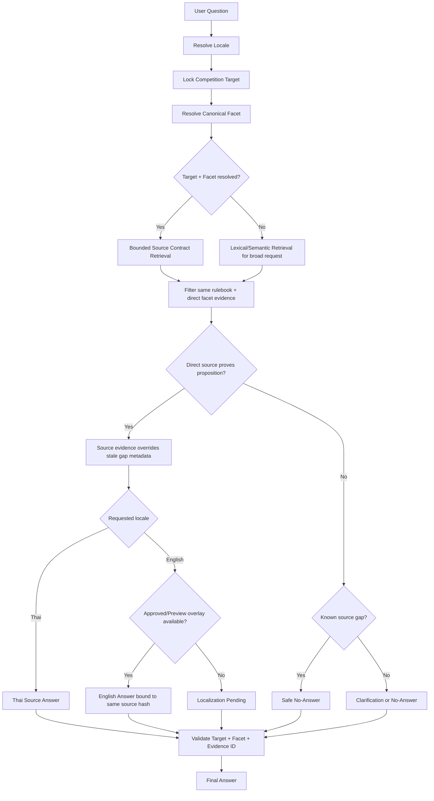

# Competition RAG Source-Contract Remediation Report

วันที่: 22 กันยายน 2026  
ขอบเขต: กติกาการแข่งขัน 4 เกม, ภาษาไทยและอังกฤษ, Ground Truth 528 ข้อ

## 1. ผลลัพธ์สรุป

รอบนี้ไม่ได้เพิ่ม alias รายคำเพื่อบังคับให้ Test ผ่าน แต่แก้สัญญาระหว่าง Query Facet, Source Chunk, Retrieval และ Evaluator ให้ใช้ความหมายชุดเดียวกัน

| รอบ | ภาษาไทย | ภาษาอังกฤษ | หมายเหตุ |
|---|---:|---:|---|
| Baseline ก่อนรอบนี้ | 211/264 (79.92%) | 203/264 (76.89%) | Gold และ runtime ใช้ facet คนละความหมาย |
| หลังแก้ Gold ชุดแรก | 218/264 (82.58%) | 218/264 (82.58%) | ตัด expected evidence ที่ไม่ตรง source บางส่วน |
| หลังเพิ่ม source contract | 263/264 (99.62%) | 237/264 (89.77%) | ไทยเหลือ lexical miss 1 ข้อ; อังกฤษยังมี taxonomy/localization selection gap |
| Final | **264/264 (100%)** | **264/264 (100%)** | Evidence alignment 264/264 ทั้งสองภาษา |

ผล Final Run:

- Thai: `reports/competition_rules_rag_eval/competition_rules_rag_eval_20260922_163333.json`
- English: `reports/competition_rules_rag_eval/competition_rules_rag_eval_20260922_163237.json`
- Focused Unit/Regression Tests: 35 tests passed
- Ground Truth validation: 528 cases valid

ข้อสำคัญ: English Final Run เปิด `PSU_ENGLISH_LOCALIZATION_DRAFT_PREVIEW=1` เพื่อทดสอบความถูกต้องของ route, source และ translation draft เท่านั้น Draft ยังไม่ใช่ Approved Production Localization และต้องผ่าน Human Approval ตามนโยบายเดิมก่อน Publish

## 2. สาเหตุที่คะแนนเดิมเพิ่มเพียงเล็กน้อย

### 2.1 Gold Contract ไม่ตรง Source จริง

Gold เดิมบางข้ออนุญาต section ที่ไม่ได้ตอบคำถาม เช่น:

- CS2 penalty matrix ชี้ไปยังข้อความ `แบนถาวร` แต่ไม่ได้อนุญาตตารางบทลงโทษจริง
- Tekken dispute ชี้ไปยังข้อตกลงทั่วไป แทน section ข้อพิพาทโดยตรง
- VALORANT team size ชี้ไปยัง tactical timeout เพราะมีคำว่า `team`
- VALORANT in-match ชี้ไปยัง rollback หรือ post-match procedure

ผลคือระบบอาจตอบจาก source ที่ตรงกว่าแต่ยังถูก evaluator ตัดว่าผิด หรือถูกบังคับให้เลือกหลักฐานที่แย่กว่าเพื่อให้คะแนนผ่าน

### 2.2 Facet Classification ใช้คำกว้างเกินไป

ตัวอย่าง false evidence:

- `two pauses per team` ถูกตีความเป็น team size
- `must be replaced by a substitute` ถูกตีความเป็น roster composition
- `Post-Match Procedure` ถูกตีความเป็น in-match procedure
- คำว่า `map` ใน tactical timeout ถูกตีความเป็น map-pool selection
- สถานที่แข่งขันอย่างเดียวถูกตีความเป็น on-site requirement

### 2.3 Query Taxonomy ไม่ครอบคลุมถ้อยคำกลาง

ก่อนแก้ มี English Gold 48 ข้อและ Thai Gold 12 ข้อที่มี expected facet แต่ runtime ตรวจ facet ไม่ได้ เช่น:

- `competition format`
- `competition equipment and devices`
- `tournament schedule`
- `maps, vetoes, and map selection`
- `เวอร์ชันเกมและการตั้งค่าแมตช์`
- `ตารางและเวลาแข่งขัน`

เคสเหล่านี้บางส่วนตอบถูกเพราะ lexical overlap แต่ไม่มี semantic contract ควบคุม จึงเสี่ยงดึง section ข้างเคียงมาปน

### 2.4 Lexical Top-K พลาดแม้ Source มีคำตอบ

คำถาม `Counter-Strike 2 แข่งจริง กฎเกี่ยวกับขั้นตอนระหว่างการแข่งขัน เป็นแบบไหน` ไม่ใช้ถ้อยคำเดียวกับ detail chunk จึงหลุดจาก top-k แม้ rulebook มี section ที่ตรง ผลเดิมคือ safe no-answer

### 2.5 Source Coverage Manifest Stale

Manifest ระบุว่า CS2 ไม่มี pre-match/on-site rule แต่ source ปัจจุบันมีข้อห้ามอุปกรณ์ในพื้นที่แข่งและการส่งเอกสารให้กรรมการก่อนทุกแมตช์ Metadata เก่าจึงกดทับหลักฐานใหม่

### 2.6 English Overlay เลือก Candidate จากคำร่วมแทน Facet

เมื่อ query facet ตรวจไม่พบ ระบบอังกฤษเลือก section ในเกมเดียวกันจากคำร่วม เช่น equipment query ของ RoV เคยรวม schedule และ pause causes ด้วย แม้ evidence ID ยังอยู่ใน rulebook ที่ถูกต้อง

## 3. Flow ใหม่



### Invariants

1. Explicit game target ห้ามเปลี่ยนหลัง Target Lock
2. Source row ต้องรองรับ canonical facet โดยตรง ไม่ใช้ import tag เป็นหลักฐาน
3. Targeted query ใช้ source contract retrieval ก่อน lexical fallback
4. Direct source ปัจจุบันชนะ manifest ที่ stale
5. Manifest gap ใช้ได้เมื่อไม่มี direct source เท่านั้น
6. English overlay เปลี่ยนเฉพาะข้อความแสดงผล ไม่เปลี่ยน evidence ID
7. ไม่มี source ตรงให้ตอบ no-answer แทนการยืมหัวข้ออื่น
8. Multi-target comparison ต้อง ground ทุกเกมก่อนตอบ

## 4. การแก้ไขที่ Implement

### Shared taxonomy

- เพิ่ม canonical phrases ที่ขาดสำหรับ format, equipment, schedule, map selection และ match configuration
- ใช้ taxonomy เดียวกันใน query understanding, retrieval, source contract และ Gold builder
- ตรวจ Ground Truth แล้วไม่เหลือคำถามที่มี expected facet แต่ resolve ไม่ได้

### Source facet contract

- เพิ่ม conservative multi-facet classifier
- แยก `post-match` ออกจาก `in-match`
- แยก venue-only ออกจาก on-site requirement
- การกล่าวถึง substitute เพียงครั้งเดียวไม่ถือเป็น roster policy
- map mention ใน pause/penalty ไม่ถือเป็น map-pool rule

### Bounded target-facet retrieval

- เพิ่ม fallback ที่อ่านเฉพาะ source rows ของ rulebook ที่ Target Lock ยืนยันแล้ว
- Filter ด้วย canonical facet ก่อน ranking
- ไม่สแกนข้ามเกมและไม่สร้าง target ใหม่
- ใช้ loaded index เดิมและจำกัดผลสูงสุด 8 rows

### Coverage precedence

- Direct active-source evidence มีสิทธิ์ชนะ stale manifest
- Known source gap ยังบังคับ safe no-answer เมื่อ source ปัจจุบันไม่มีข้อที่ตรงจริง

### English selection

- Candidate ต้องผ่าน source facet ก่อนพิจารณา localization
- Explicit canonical facet สามารถเลือก direct clause ได้แม้ lexical overlap ต่ำ
- ตัด near-duplicate excerpt
- Comparison จำกัดหนึ่ง focused excerpt ต่อ target

### Ground Truth และ evaluator

- สร้าง allowed evidence จาก literal source chunks
- Unknown/unsupported facet ใช้ expected safe no-answer
- Safe no-answer ไม่ถูกตัดว่า target หายเพราะไม่มี evidence hit
- ไม่ใช้ unreviewed canonical migration label เป็น Gold

## 5. Final Quality Audit

### Accuracy และ evidence

- Thai pass: 264/264
- English pass: 264/264
- Thai evidence alignment: 264/264
- English evidence alignment: 264/264
- Unsupported English Thai-prose leakage: 0 cases
- Expected facet unresolved: 0 cases

### Outcome distribution ต่อภาษา

- Answer: 224
- Safe no-answer: 38
- Clarification: 2

Safe no-answer 38 ข้อประกอบด้วย source-gap cases 36 ข้อและ unknown-game cases 2 ข้อ เป็นพฤติกรรมที่ตั้งใจ ไม่ใช่ retrieval failure

### Latency จาก Final Run

| Locale | Average | P95 | Max |
|---|---:|---:|---:|
| Thai | 0.3192 s | 0.6073 s | 2.5086 s |
| English | 0.1064 s | 0.2088 s | 1.4208 s |

ทุกข้ออยู่ต่ำกว่า Ground Truth ceiling 20 วินาที และไม่มี timeout/crash ในสองรอบ Final

### Answer length

| Locale | Average | P95 | Max |
|---|---:|---:|---:|
| Thai | 397 chars | 1,030 chars | 1,463 chars |
| English | 456 chars | 940 chars | 1,043 chars |

English average ลดจากประมาณ 492 เป็น 456 ตัวอักษรหลังเพิ่ม facet coverage และ deduplicate excerpt

## 6. Source Gaps ที่ยังคงตอบ No-Answer อย่างถูกต้อง

Active rulebooks ยังไม่มี direct clause สำหรับ:

- RoV: pre-match/on-site procedure ที่เป็นข้อกำหนด ไม่ใช่เพียงสถานที่
- VALORANT: conduct
- VALORANT: fair-play/sportsmanship
- VALORANT: general in-match procedure
- VALORANT: map pool/veto/selection
- VALORANT: team size

หากต้องการให้ตอบหัวข้อเหล่านี้ ต้อง ingest official clause เพิ่ม ไม่ควรแก้ด้วย alias, prompt หรือให้ LLM แต่งข้อมูล

## 7. สิ่งที่ต้องทำก่อน Production Publish

1. Human reviewer ตรวจ English draft เทียบ source ทีละ record
2. เปลี่ยนเฉพาะ record ที่ผ่านเป็น `approved` พร้อม reviewer, timestamp และ source hash
3. Build English projection ใหม่แบบ atomic
4. รัน Full 528 cases โดยไม่เปิด Draft Preview
5. รัน HTTP concurrent load test แยกจาก serial Ground Truth
6. เพิ่ม owner-approved official source สำหรับ 6 source-gap groups หากต้องการ coverage

## 8. ไฟล์หลักที่เปลี่ยน

- `app/pipeline/competition_taxonomy.py`
- `app/pipeline/competition_source_facets.py`
- `app/pipeline/competition_coverage.py`
- `app/pipeline/retrieval.py`
- `app/pipeline/engine.py`
- `app/pipeline/bilingual_english.py`
- `tools/build_competition_rules_rag_ground_truth.py`
- `tools/run_competition_rules_rag_ground_truth.py`
- `tests/test_competition_source_facets.py`
- `tests/test_competition_rules_rag_ground_truth.py`
- `data/competition_rules/source_coverage_manifest.jsonl`
- `data/eval/competition_rules_rag_ground_truth_v1.jsonl`

## 9. Verification Commands

```powershell
python -X utf8 tools/build_competition_rules_rag_ground_truth.py --check
python -X utf8 -m unittest tests.test_competition_source_facets tests.test_competition_target_grounding tests.test_competition_rules_rag_ground_truth tests.test_competition_rule_canonical -q
python -X utf8 tools/run_competition_rules_rag_ground_truth.py --locale th --rag-fallback

$env:PSU_BILINGUAL_EN_ENABLED='1'
$env:PSU_ENGLISH_LOCALIZATION_DRAFT_PREVIEW='1'
$env:PSU_ENGLISH_LOCALIZATION_DRAFT_PREVIEW_PATH=(Resolve-Path 'data/locales/en/localization_review_drafts_competition_20260921_repaired.jsonl').Path
python -X utf8 tools/run_competition_rules_rag_ground_truth.py --locale en --rag-fallback
```
