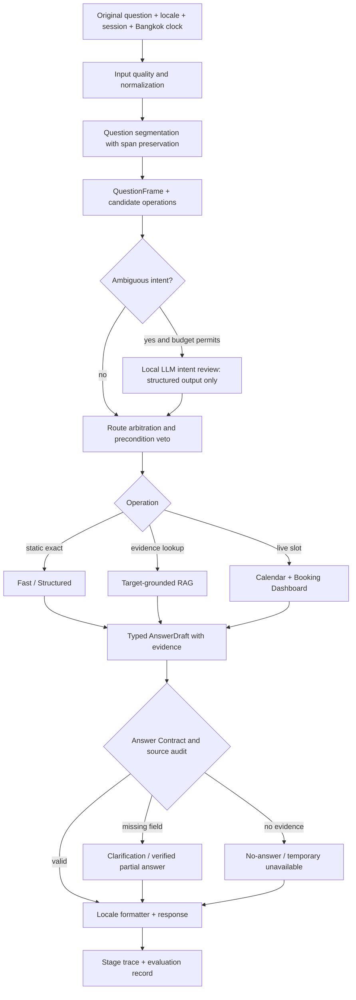

# Flow แก้ Intent Trap, การตอบผิดประเด็น และผลทดสอบสองภาษา

สถานะ: เริ่ม implement แล้ว; ผลและงานค้างดู `docs/98_intent_trap_bilingual_implementation_report_20260924.md`  
วันที่: 2026-09-24  
ขอบเขต: PSU Esports Chatbot, ภาษาไทยและอังกฤษ, โดยเฉพาะชุด `intent_trap_bilingual_1000_v2`

## 1. วิธีอ่านเอกสารและหลักฐาน

เอกสารนี้ใช้ป้ายสามชนิดเพื่อไม่ให้ข้อเสนอถูกอ่านเป็นผลที่เกิดขึ้นแล้ว:

- **ยืนยันแล้ว**: พบจาก raw result, การเรียกฟังก์ชันเฉพาะจุด หรือ source code ปัจจุบัน
- **ต้องพิสูจน์**: สมมติฐานที่มีตัวอย่างสนับสนุน แต่ยังไม่มี stage trace หรือ source audit ครบ
- **ออกแบบให้ทำ**: สัญญาและขั้นตอน implementation ที่เสนอในเอกสารนี้

หลักฐานหลัก:

- ผลรันจริง: `reports/master_ground_truth_eval/master_gt_eval_20260924_134028.json`
- Rescore แบบไม่รัน pipeline ซ้ำ: `reports/master_ground_truth_eval/master_gt_eval_20260924_134028_intent_trap_rescored_v2.json`
- สรุปและตัวอย่าง: `docs/96_intent_trap_bilingual_1000_eval_20260924.md`
- Corpus ที่ใช้รันคือ `data/eval/intent_trap_bilingual_1000_v1.jsonl`; v2 เปลี่ยนเกณฑ์ route identity/greeting แต่ไม่เปลี่ยนคำถามหรือคำตอบใน raw run
- Full-run ก่อนหน้า: `docs/95_master_ground_truth_v2_remediation_analysis_20260923.md`

**ยืนยันแล้ว:** ชุด focused นี้มี 100 สถานการณ์ต่อภาษา คูณ 5 รูปแบบการถาม รวมไทย 500 + อังกฤษ 500 ไม่ใช่ 1,000 เจตนาอิสระ ผลหลัง rescore คือผ่านเกณฑ์อัตโนมัติ 167, ไม่ผ่าน 477, ต้องตรวจด้วยคน 261, และตรวจ live slot ไม่ได้เพราะ Dashboard ไม่พร้อม 95 ข้อ ตัวเลขนี้ไม่ใช่ production accuracy; การผ่าน string/route check ไม่รับประกันว่าคำตอบจริงถูกต้อง

ใน 477 ข้อที่ไม่ผ่าน พบ route mismatch 382, status mismatch 203, content-contract mismatch 277 และ latency เกินเพดาน 7 ตัวเลขซ้อนกันได้ ไม่ควรนำมาบวกเป็นจำนวนข้อใหม่ การแก้ต้องรายงานทั้ง **จำนวนคำถาม** และ **จำนวน scenario-language pair** เพื่อไม่ให้หนึ่งบั๊กที่ซ้ำ 5 สำนวนถูกเข้าใจเป็นห้าต้นเหตุ

## 2. เป้าหมายและขอบเขตที่ล็อก

### เป้าหมาย

1. หยุดคำตอบผิดเรื่องที่ดูมั่นใจ เช่นสิทธิ์ใช้อุปกรณ์กลับเป็นรายการอุปกรณ์ หรือค่าปรับกลับเป็นรายชื่อเกม
2. แยกข้อเท็จจริงที่ตรวจสอบได้ออกจากคำตอบที่ต้องถามเพิ่มหรือรอระบบภายนอก
3. ให้ Fast/Structured, RAG และ Local LLM ใช้ `QuestionFrame` และสัญญาคำตอบเดียวกันทั้งไทยและอังกฤษ
4. ปรับ evaluator ให้บอกความถูกต้องเชิงเป้าหมาย/หลักฐานได้ ไม่ปรับ Gold เพียงเพื่อเพิ่มคะแนน
5. คง response ceiling 20 วินาทีตามโจทย์ปัจจุบัน โดยวัดที่ HTTP จริง; เป้าหมาย P95 <= 5 วินาทีเป็นเป้าหมาย optimization หลัง correctness ไม่ใช่เงื่อนไขให้ตัด RAG อย่างไม่ปลอดภัย

### Invariants

- ข้อความต้นฉบับไม่ถูกเขียนทับเมื่อ normalize, แก้คำผิด หรือแยกคำถาม
- คำว่า `PS5`, `controller`, `equipment`, `member`, `จอง` หรือชื่อ Zone เป็น **target/signal** ไม่ใช่คำสั่งเลือก route โดยลำพัง
- Handler ต้องไม่คืนคำตอบก่อนผ่านการเทียบ `requested_facet` กับชนิดคำตอบที่ handler ผลิต
- `studio_open` ไม่เท่ากับ `slot_free`; `consume_allowed` ไม่เท่ากับ `bring_allowed`
- ราคา/สิทธิ์ต้องตรงกับกลุ่มผู้ใช้ บริการ และระยะเวลาที่แหล่งข้อมูลระบุ; negation มีผล
- RAG/LLM ห้ามเติมราคา สิทธิ์ กฎ หรือสถานะสดที่ evidence ไม่ยืนยัน
- คำตอบอังกฤษใช้แหล่งไทยได้โดยระบุภาษาต้นฉบับ แต่ข้อความอังกฤษต้องผ่าน localization policy เดิม; ไม่แปลข้อมูลสดด้วย LLM
- Safe outcome (`clarification`, `no_answer`, `temporarily_unavailable`) เป็นผลลัพธ์ที่ยอมรับได้เมื่อข้อมูลไม่พอ ไม่ใช่ข้ออ้างให้เดา
- การเปลี่ยน evaluation label ต้องมี adjudication trail; raw log เดิมห้ามเขียนทับ

## 3. Target Flow และ ownership



**ออกแบบให้ทำ:** เพิ่ม `RequestPlan` เป็นข้อมูลระดับ request ที่ประกอบด้วย `QuestionFrame`, `LocaleDecision`, `TemporalTarget`, `TargetSet`, `candidate_routes`, `selected_route`, `source_version` และ `budget` เก็บใน `RequestExecutionContext` ปัจจุบันที่ `app/pipeline/execution_context.py` โดยไม่สร้าง global mutable state และไม่ให้ข้าม session แก้ `QuestionFrame` ใน `app/pipeline/question_frame.py` ให้มี requested facet และ dependency ที่ตรวจได้ชัดเจนก่อน handler ส่วน renderer รับ `AnswerDraft` ที่มีชนิดข้อมูล ไม่พยายามอนุมานชนิดคำตอบจากคำที่ปรากฏใน prose เท่านั้น

ตัวอย่าง schema ที่ต้องล็อกก่อนแก้ handler:

```python
@dataclass(frozen=True)
class RequestPlan:
    original_question: str
    effective_locale: Literal["th", "en"]
    operation: str  # eligibility | inventory | damage | weekly_hours | live_slot | ...
    requested_facet: str
    targets: tuple[str, ...]
    user_group: str | None
    user_group_polarity: Literal["positive", "negative", "unknown"]
    temporal_target: TemporalTarget | None
    missing_slots: tuple[str, ...]
    confidence: float
    evidence_version: str

@dataclass(frozen=True)
class AnswerDraft:
    status: Literal["answer", "clarification", "no_answer", "temporarily_unavailable"]
    answered_facet: str
    target_ids: tuple[str, ...]
    claims: tuple[VerifiedClaim, ...]
    evidence_ids: tuple[str, ...]
    source_version: str
    locale: Literal["th", "en"]
```

`VerifiedClaim` ต้องมี `claim_type`, `value`, `evidence_id`, `target_id` และ qualifier ที่สำคัญ เช่น `user_group`, `service`, `date`, `slot` การเพิ่ม field ทำภายใน pipeline ก่อน; API ภายนอกเพิ่มเฉพาะ optional metadata เพื่อไม่ทำลาย client เดิม

## 4. งาน P0-A: แยกคำถามและสร้าง Intent ก่อน route

### A1. Input และ segmentation

**ยืนยันแล้ว:** `_split_shared_tail_multi_entity_question()` ใน `app/pipeline/engine.py` สามารถแยกคำว่า `เกี่ยวกับ` ที่ `กับ` ได้ เช่นคำถาม `ขอถามเกี่ยวกับศูนย์หน่อยครับ: บุคคลภายนอกใช้อุปกรณ์คิดราคาเท่าไหร่` กลายเป็นข้อความเสียรูปสองส่วน

**ออกแบบให้ทำ:**

1. เก็บ `original_question`, normalized form และ mapping ของ character spans แยกกัน
2. ตัด preface เช่น `ขอถามเกี่ยวกับศูนย์หน่อยครับ:` หรือ `A question about the studio:` เป็น `context_note` เฉพาะเมื่อมีประโยคคำถามหลักชัดเจน ห้ามทิ้ง target/date ที่อยู่ใน preface
3. แยกหลายคำถามเฉพาะขอบเขตอนุประโยคหรือเครื่องหมายที่ชัดและแต่ละส่วนมี operation ต่างกัน; คำว่า `กับ` ภายในคำไทยไม่ใช่ separator
4. `PC กับ VR ว่างไหม` เป็นหนึ่ง operation + สอง targets; `PC ว่างไหม และ VR ราคาเท่าไหร่` เป็นสอง operations
5. หลังแยก ตรวจว่าข้อความทุกส่วนยังรักษา negation, target, date, time และ object ของประโยคเดิม หากตรวจไม่ได้ให้คงเป็นคำถามเดียว

**Tests:** unit สำหรับ `เกี่ยวกับ`, `พร้อมกับ`, `PC กับ VR`, สอง operation จริง, คำสุภาพนำหน้า และข้อความไทย/อังกฤษผสม; metamorphic test เพิ่ม preface แล้ว target/operation ต้องคงเดิม

### A2. Requested facet และ candidate operations

**ยืนยันแล้ว:** ใน `app/pipeline/bilingual_english.py` English resolver คืนผล non-None รายแรก; คำถามเกี่ยวกับสิทธิ์หรือความเสียหายจึงถูก Game/Equipment Catalog จับก่อน แม้ `QuestionFrame` มีอยู่แล้วก็ตาม

**ออกแบบให้ทำ:** ให้ `QuestionFrame` ตอบคำถามแยกกัน: `operation` = การกระทำที่ผู้ใช้ขอ, `domain` = แหล่งข้อมูลที่เกี่ยวข้อง, `target` = สิ่ง/คน/เครื่องที่ถาม, `requested_facet` = ชนิดข้อเท็จจริงที่ต้องส่งกลับ ตัวอย่าง:

| Question | operation / facet | target | ห้ามตอบด้วย |
|---|---|---|---|
| คนนอกใช้ PS5 ได้ไหม | eligibility / public_access | PS5 | equipment list |
| PS5 เสียต้องชดใช้ไหม | damage / responsibility | PS5 | game detail/catalog |
| จอง PC ได้วันไหน | weekly_hours / bookable_period | PC | booking how-to, live slot |
| PC #02 พรุ่งนี้ 13:00 ว่างไหม | live_slot / resource_availability | PC #02 + date + slot | opening hours อย่างเดียว |
| นำอาหารเข้าได้ไหม | food_policy / bring_permission | food | consume-area rule อย่างเดียว |

สร้าง candidate route มากกว่าหนึ่งรายการ แล้วใช้ **specific operation > generic noun match**; กฎ damage/access/price/temporal ที่ตรง facet มีสิทธิ์ veto catalog กว้าง ๆ `member` ต้องแยก `customer_membership` ออกจาก `staff_lookup` ห้าม substring ที่ปรากฏใน `member of the public` เลือกรายชื่อเจ้าหน้าที่

เมื่อ confidence ต่ำหรือ candidate เสมอกัน ให้ Local LLM ทำ intent review เป็น JSON ที่บังคับ enum + span จากคำถามต้นฉบับ + `missing_slots`; ไม่ให้โมเดลตอบข้อเท็จจริง ถ้า JSON invalid, เวลาไม่พอ หรือยังเสมอ ให้ clarification ที่ระบุทางเลือกจริง ไม่ fallback ไป catalog

**Tests:** focused cases `EN-0151`, `EN-0156`, `EN-0401`, `EN-0101`, `TH-0116`; ตรวจ operation/target/facet ไม่ใช่ดูเพียงข้อความคำตอบ

### A3. Rule preconditions และ precedence

**ยืนยันแล้ว:** `RuleMatcher` ใน `app/rules/matcher.py` เรียงตาม priority และคืน match แรกหลัง sort; `about.*studio` ใน `data/rules/overview_rules.jsonl` จับคำเกริ่นได้

**ออกแบบให้ทำ:** RuleMatcher คืน candidate พร้อม `matched_span`, `priority`, `category`, `required_operation`, `excluded_operations` ให้ route arbiter เลือก กฎ overview ต้องการ `operation=studio_overview` จริงและ match อยู่ใน main question กฎรายชื่อบุคลากรต้องการคน/ตำแหน่งจริง; กฎ food-consume ไม่รับ facet `bring_permission` กฎทั่วไปที่ไม่มี precondition ห้ามชนะ operation ที่มีหลักฐานเฉพาะกว่า

**Compatibility:** คง `match()` เดิมสำหรับ caller ชั่วคราว เพิ่ม `candidates()` แล้ว migrate ทีละ handler; feature flag เพื่อปิด arbitration ใหม่โดยไม่เปลี่ยน rule data ทั้งหมดในครั้งเดียว

## 5. งาน P0-B: เวลา ตาราง และ Booking Dashboard

### B1. แยกสี่ operation ให้เด็ดขาด

**ยืนยันแล้ว:** `จองเครื่องเล่นเกมเปิดจองวันไหนและช่วงเวลาไหนบ้าง` ถูก `_looks_like_booking_howto()` จับเพราะมี `จองเครื่อง`; `จอง PC ได้วันอะไร ช่วงกี่โมง` ถูก `is_live_booking_question()` จับเพราะมี resource + `จอง` ทั้งที่ถามตารางปกติ

**ออกแบบให้ทำ:**

| Operation | คำถามหลัก | Data source | Safe result เมื่อ source ไม่พร้อม |
|---|---|---|---|
| `opening_hours` | ศูนย์เปิดวัน/เวลาไหน | schedule + calendar release | บอกว่าไม่ยืนยันวันที่พิเศษ ถ้าข้อมูล exception ไม่พร้อม |
| `booking_window` | วัน/ช่วงไหนเปิดให้จอง | approved reservation schedule | ตอบตารางพร้อมเงื่อนไข ไม่อ้างว่าเครื่องว่าง |
| `booking_howto` | ขั้นตอนจองอย่างไร | reservation rules | ไม่เดา deadline/payment ถ้ากฎไม่ยืนยัน |
| `live_slot` | เครื่อง/โซนว่าง ณ วันเวลาหนึ่งไหม | Booking Dashboard snapshot | `temporarily_unavailable` เฉพาะ live status |

คำว่า `จอง` ไม่ใช่ sufficient condition สำหรับ `live_slot`; ต้องมีการขอสถานะของ resource + จุดเวลา/คำว่า `ตอนนี้` หรือบริบทที่บอกว่าถามสถานะจริง ส่วน `วันไหน`, `ช่วงเวลาไหน`, `กี่โมง` แบบทั่วไปควรอยู่ `booking_window` จนกว่าจะมีวัน/เวลารายครั้งชัดเจน คำถาม `ตอนนี้ศูนย์เปิดไหม` ใช้ calendar/clock ไม่ใช้ Dashboard slot

**Tests:** 100 ข้อ booking-days-hours ต้องตอบ day + interval ไม่ใช่รายการขั้นตอน; Dashboard unavailable ไม่ทำให้ booking-window ตอบไม่ได้; slot query ไม่ได้ตอบเพียงว่า studio open

### B2. Temporal target และ resource target

**ยืนยันแล้ว:** `resolve_live_target_date()` ใน `app/booking/live_status.py` fallback เป็นวันนี้เมื่อไม่เข้าใจ `วันจันทร์`; เมื่อจำลองวันที่อ้างอิง 2026-09-24 คำถามวันจันทร์ควรชี้อย่างน้อยไปวันจันทร์ถัดไป 2026-09-28 หรือถามให้ชัด ไม่ควร silently ชี้ 2026-09-24

**ออกแบบให้ทำ:** `TemporalTarget` มี `reference_now` ใน Asia/Bangkok, `target_date`, `date_resolution_method`, `time_start`, `time_end`, `day_part`, `ambiguity` รับ clock แบบ dependency injection ทดสอบได้ คำว่า `จันทร์หน้า` กับ `วันจันทร์นี้` ต้องมี policy นิยาม explicit; สำหรับ `วันจันทร์` เฉย ๆ เลือกจันทร์ถัดไปและแสดงวันที่ในคำตอบ หรือ clarification หากแยกไม่ได้ ห้าม fallback เป็นวันนี้เมื่อมี weekday signal ที่ resolve ไม่ได้

ก่อนเรียก Dashboard ต้องระบุ `ResourceTarget(zone, unit_id|all, date, slot_start, slot_end)` ถ้า `PC2` ให้ตอบเฉพาะ PC #02; ถ้า `PC` กว้างให้ aggregate ทุกเครื่อง; `PC กับ VR` ให้คำตอบสองส่วนโดยไม่ปะปน snapshot ระหว่างโซน ถาม `13:00` ให้แปลงเป็น slot ตามข้อมูลจริง เช่น `13:00-14:00` เฉพาะเมื่อระบบจองยืนยัน slot นั้น ห้ามคิดเองว่าหนึ่งชั่วโมงเสมอ

**Tests:** fake Dashboard snapshot สำหรับ booked/free/unknown/closed, หลายเครื่อง, หลายโซน, ย้อนหลัง, วันหยุด, timeout, stale cache, data-version mismatch; response assert `date + unit + slot + snapshot timestamp` ตรง request ก่อนนับผ่าน อีก 95 blocked ใน run ปัจจุบันไม่ใช่ correctness result ต้องแยก integration fake กับ live test

## 6. งาน P0-C: ราคาและ customer group

**ยืนยันแล้ว:** `app/pipeline/preprocess.py` ตี `ไม่ใช่นักศึกษา` เป็นกลุ่มนักศึกษาเพราะพบ substring; `บุคคลภายนอกใช้อุปกรณ์คิดราคาเท่าไหร่` ไม่มี service ชัด แต่บางเส้นทางตอบราคา PC หรือสิทธิ์ฟรีของนักศึกษา/บุคลากร

**ออกแบบให้ทำ:** parser ต้องระบุ `user_group` และ polarity จากทั้ง clause ไม่ใช่คำเดี่ยว; `ไม่ใช่นักศึกษา`, `no PSU ID`, `not a student`, `คนทั่วไป` ต้องไม่ map เป็น student และต้องผ่าน source-specific fee eligibility check แยก `service`, `duration`, `number_of_people`, `zone` เป็น slots ต่างหาก ห้ามเติม PC เป็น default เพราะคำว่าอุปกรณ์ ถ้า source price card ต้องใช้ 3 slot แต่คำถามมีเพียง user group ให้ถามต่อเฉพาะ service/duration หรือแสดงทางเลือกที่ยืนยันได้หลายแบบพร้อมระบุเงื่อนไข ไม่มีการเสนอราคาเดียวแบบไม่มีฐาน

```text
parse group and negation
→ extract service/duration/person count
→ look up approved price card by exact keys
→ if one exact card: answer
→ if multiple cards: clarification or bounded options
→ if no card: no-answer, never borrow another group/service
```

**Tests:** outsider / non-student / staff / student / no ID, English and Thai negation, fee without service, same game offered in multiple zones, missing duration, source version change; `TH-0003` และสำนวนใกล้เคียงต้องไม่ตอบ 0 บาทหรือราคา PC โดยไม่มีเงื่อนไข

## 7. งาน P1-D: กฎความเสียหาย อาหาร และสิทธิ์ใช้งาน

### D1. Damage responsibility

**ยืนยันแล้ว:** `data/rules/penalty_rules.jsonl` มีกฎ generic และ `answer_en` แต่คำถามอังกฤษ `If I damage a studio PS5, is there a penalty?` เข้า Games และ `break a game controller` ได้ game catalog

**ออกแบบให้ทำ:** `damage/fine/compensation/เสียหาย/ทำพัง` ในบริบททรัพย์สินศูนย์สร้าง facet `damage_responsibility` ก่อน GameResolver ตัวชื่อเกม/อุปกรณ์เป็น target ของ policy ไม่ใช่ domain ให้ retrieval หา approved penalty rule ตาม scope ของอุปกรณ์และ effective version ถ้ากฎระบุเพียงความรับผิดชอบทั่วไป ให้ตอบเพียงนั้น; ตัวเลข tier หรือราคาซ่อมต้องมี claim ที่ยืนยันสำหรับกรณีนั้น ไม่ยืมตัวอย่าง VR ไปใส่ PS5

### D2. Food bring vs consume

**ยืนยันแล้ว:** กฎเรื่องรับประทานในพื้นที่กำหนดถูกใช้ตอบ `นำอาหารเข้าได้ไหม`; บางข้อจึงผ่าน string check ทั้งที่ไม่ได้ยืนยันการนำเข้า และมีกรณี LLM ตอบอนุญาตนำกาแฟเข้าโดยไม่มี source ยืนยัน

**ออกแบบให้ทำ:** แยก `bring_permission`, `consume_permission`, `allowed_area`, `drink_exception` ใน fact schema; แต่ละ facet ต้องมี source claim ของตัวเอง ถ้า source ยืนยันเฉพาะพื้นที่รับประทาน ให้ตอบว่าเรื่องนั้นยืนยันได้ แต่ไม่ยืนยันสิทธิ์นำเข้า อย่าสรุป `bring_allowed=true` โดยอนุมานจาก `consume_in_designated_area=true`

### D3. Public access and membership

**ออกแบบให้ทำ:** แยก `public_access`, `equipment_usage_eligibility`, `customer_membership_requirement`, `staff_directory`; `บุคคลภายนอก`, `member of the public`, `สมาชิกก่อนเข้า` ไม่มีเหตุให้เรียก staff list หากแหล่งข้อมูลยืนยันได้เฉพาะวิธีจอง แต่ไม่ได้ยืนยันว่าใครมีสิทธิ์ ให้ระบุขอบเขตที่ทราบและถาม/แนะนำตรวจ official channel ไม่ตอบว่าอนุญาตหรือห้ามเอง

**Tests ร่วม:** ตรวจคำตอบทั้งเชิงบวกและเชิงลบ; ห้ามมี catalog list ในคำถาม policy, ห้ามมีตัวเลขโทษที่ evidence ไม่ระบุ, ห้ามคำตอบ partial ถูกนับว่า complete

## 8. งาน P1-E: RAG, Local LLM และ Answer Contract

### E1. Retrieval ที่เคารพ Question Frame

**ต้องพิสูจน์:** บางคำตอบ `rag_direct_curated` ผิดกลุ่มราคาอาจเกิดตั้งแต่ entity parse, retrieval filtering หรือ answer selection; raw output ยังแยกสาเหตุราย stage ไม่ครบ ต้องเก็บ candidate/evidence trace ก่อนฟันธงจุดเดียว

**ออกแบบให้ทำ:** ใช้ `requested_facet`, category, target, user group, effective date, trust level และ content version เป็น filter ก่อน similarity scoring; similarity สูงเพียงอย่างเดียวไม่พอ ถ้า evidence ตรงราคาแต่คนละกลุ่ม หรือ rule ใกล้เคียงแต่คนละ facet ให้ reject พร้อม reason code เช่น `wrong_user_group`, `facet_mismatch`, `source_stale`, `target_mismatch` Structured/RAG ต้องอ่าน release เดียวกัน และใช้ request-local cache เดิมเพื่อไม่คำนวณซ้ำ

### E2. Local LLM เฉพาะจุดที่เพิ่มความเข้าใจได้จริง

**ออกแบบให้ทำ:**

1. เรียก intent-review model เมื่อ candidate operations สูสี, พิมพ์ผิดเล็กน้อย, พูดอ้อม หรือ route แรกถูก veto; ไม่ต้องเรียกกับ exact price card/slot ที่ชัด
2. Prompt ให้คืน JSON enum สำหรับ operation/facet/target/required slots และ cite substring ของคำถามที่ใช้ตัดสิน; parser reject output นอก schema
3. Composer ใช้เฉพาะ `VerifiedClaim` จาก evidence ที่ผ่าน filter; ห้ามแปล/สร้างข้อมูลนโยบายสดและห้ามเลือก target ใหม่
4. ถ้า model timeout, invalid JSON, หรือขัดกับ explicit negation/date ให้ข้ามและใช้ clarification/verified partial answer
5. Trace บอก `llm_called`, `reason`, `queue_ms`, `inference_ms`, `parse_result`, `veto_reason`; การเปิด `--allow-llm` ไม่ได้แปลว่าทุกคำถามไปถึง LLM เพราะ early return ปัจจุบันยังมีอยู่

### E3. Typed Answer Contract ก่อนส่งทุกเส้นทาง

**ยืนยันแล้ว:** `app/pipeline/answer_contracts.py` ยังอนุมาน answer type บางส่วนจาก mode และคำที่ปรากฏในคำตอบ จึงเสี่ยงให้รายการอุปกรณ์ผ่านเพราะมี keyword ที่ดูเกี่ยวข้อง แม้ไม่ตอบสิทธิ์ใช้งาน

**ออกแบบให้ทำ:** ทุก handler คืน `AnswerDraft` แบบ typed; validator เทียบกับต้นฉบับและ `RequestPlan` ทั้ง `answered_facet`, target, user group/polarity, date, slot, locale, source/version และ claim coverage ถ้า draft ไม่ตอบ facet หลัก ให้ veto แล้วเลือก candidate ที่ยังไม่ลองได้สูงสุดหนึ่งรอบภายใน budget; หากยังไม่มีหลักฐานให้ clarification/no-answer ไม่เผย `โหมดทดลอง RAG` หรือข้อความ debug แก่ผู้ใช้ การจัด format ไทย/อังกฤษทำหลังผ่าน contract เพื่อไม่ให้ format เป็นตัวกำหนดความจริง

## 9. งาน P1-F: Identity, คำผิด และภาษาพูด

**ยืนยันแล้ว:** `who r u` และ `นายเปนไค` ตอบตัวตนได้ใน raw run แต่ evaluator v1 ตี route ผิด; ขณะเดียวกันสำนวนใกล้เคียงอื่นยังไม่ผ่านจริง

**ออกแบบให้ทำ:** บันทึก original + normalized candidate, ใช้ input recovery ที่มีอยู่เฉพาะเมื่อ confidence สูง; LLM intent review ช่วยจำแนกคำสั้น/ภาษาพูด เช่น `who is this bot`, `นายเปนไค`, `helllo` โดยไม่แปลงคำผู้ใช้เป็นข้อเท็จจริงใหม่ identity/greeting ตอบด้วย verified fixed response และตรวจว่า `chatbot_identity` เป็น route ที่ยอมรับใน Gold ไม่เพิ่ม alias รายประโยคเพื่อไล่คะแนน

**Tests:** typo, duplicated characters, English slang, mixed script, keyboard layout, negative controls ที่หน้าตาคล้าย identity แต่ถามบุคลากรจริง; precision ต้องไม่ลดจาก keyboard/input guard baseline

## 10. งาน P1-G: Eval, Gold และ Observability

### G1. แก้ความน่าเชื่อถือของผลทดสอบ

**ยืนยันแล้ว:** raw 406/1,000 และ rescore 167 auto-pass ต่างก็ไม่ใช่อัตราตอบถูกจริง; `who r u` เป็น false fail เดิม และ `TH-0201` เป็น false pass เชิงความหมาย ชุด 261 ข้อ route-only ต้องตรวจด้วยคน

**ออกแบบให้ทำ:**

1. Freeze corpus/run/manifest/hash; ทุก rerun ใช้ run ID ใหม่ ห้าม overwrite raw
2. ทำ adjudication sheet ต่อ `scenario_id + locale`: expected operation, facet, target, status, allowed sources, evidence coverage, reviewer และ decision reason; label `needs_clarification` ต้องอนุญาต verified option-list เมื่อปลอดภัย ไม่บังคับข้อความเดียว
3. เกณฑ์ evaluator แยก `route_correct`, `fact_correct`, `complete`, `source_grounded`, `safe_abstention`, `format_correct`, `latency_ok`, `external_blocked`
4. `manual_review` 261 ข้อให้ตรวจ blind จาก answer + cited evidence; ข้อที่ source ไม่ยืนยันผลจริงห้าม label expected yes/no
5. รายงานทั้ง per-question และ per-scenario pass เพื่อเห็นผลของสำนวน 5 แบบ; เพิ่ม adversarial negative controls เพื่อจับ false pass
6. สำหรับ live 95 ข้อ ให้รัน fake Dashboard ด้วย snapshot ที่กำหนด expected slot ได้ และแยกรายงาน live external availability จริง

### G2. Stage trace ที่ใช้วิเคราะห์จริง

เพิ่ม `question_id`, `scenario_id`, `request_id`, `locale`, `original_question_hash`, `frame`, `candidate_routes`, `veto_reason`, `selected_route`, `evidence_ids`, `source_version`, `answer_status`, `contract_failures`, `stage_ms` และ `external_dependency_status` ใน performance log ที่แยกจาก chat log/PII เก็บ stage start/end ฝั่ง parent ด้วย เพื่อเห็นขั้นสุดท้ายหาก worker ถูก kill สรุป critical path แบบไม่บวก stage ที่ทำงานซ้อนกัน ห้ามเปิดเผย booking PII ใน trace

**Latency:** รอบ focused ไทย P95 11.086s, 31 ข้อ >10s และ 7 ข้อ >20s; อังกฤษเร็วแต่ผิด route มากกว่า ยังสรุปไม่ได้ว่า stage ใดใช้เวลามากที่สุดจาก evaluator นี้ ต้องเก็บ trace เพิ่มก่อน optimize ปรับ HTTP/worker hard deadline ให้ client ได้ response ภายใน 20s จริง ไม่ใช่แค่ pipeline พบ timeout ภายหลัง

## 11. ลำดับลงมือและ Gate ก่อนขยับขั้น

| Phase | งาน | Gate ที่ต้องผ่านก่อนขั้นถัดไป |
|---|---|---|
| 0 | Freeze baseline, human-adjudicate ตัวอย่างผิดร้ายแรงและ 261 route-only, เพิ่ม stage trace ขั้นต่ำ | มี manifest, labels และตัวอย่างที่ตรวจย้อนกลับได้ |
| 1 | A1-A3: segmentation, RequestPlan/Frame, route arbitration และ rule preconditions | ตัวอย่าง policy ห้ามเข้าคลังเกม/อุปกรณ์; preface invariance ผ่าน |
| 2 | B1-B2 และ C: booking operation, date/slot, price/group negation | weekly schedule ไม่เรียก Dashboard; วัน/เครื่อง/ราคาไม่เปลี่ยน target |
| 3 | D1-D3: damage, food, eligibility fact scope | ไม่มี unsupported permission/penalty claim ใน focused review |
| 4 | E1-E3 และ F: grounded RAG, targeted LLM review, typed answer contract, typo | ไม่มี false confident answer ที่ validator ปล่อยผ่านในชุด adversarial |
| 5 | G1-G2: focused 1,000 + fake Dashboard + full Thai/English regression + HTTP load | รายงาน correctness/latency/external block แยกชัด และไม่มี regression ที่ไม่อธิบาย |

หลังแต่ละ phase ให้รัน unit → focused cases ที่เปลี่ยน → 1,000 focused ทั้งชุด → full 5,000 ไทย + 5,000 อังกฤษเมื่อ phase เสถียร ห้ามเอาคะแนน full-run จาก version ก่อนหน้ามาเทียบราวกับเป็น commit เดียวกัน หากพบ previously-correct case ตก ให้เก็บ diff ของ `Frame -> route -> evidence -> draft -> contract` แล้วแก้สาเหตุ ไม่เพิ่ม regex โดยไม่มี negative tests

ตัวอย่างคำสั่งอ้างอิง (ปรับ path/output ID ก่อนใช้ และตรวจ option ของ runner ที่ติดตั้งจริง):

```powershell
python -X utf8 tools/build_intent_trap_ground_truth_1000.py
python -u -X utf8 tools/run_master_ground_truth_eval.py --corpus data/eval/intent_trap_bilingual_1000_v2.jsonl --allow-llm --rag-fallback
python -u -X utf8 tools/run_master_ground_truth_eval.py --corpus data/eval/master_ground_truth_bilingual_10000_v2.jsonl --locale th --allow-llm --rag-fallback
python -u -X utf8 tools/run_master_ground_truth_eval.py --corpus data/eval/master_ground_truth_bilingual_10000_v2.jsonl --locale en --allow-llm --rag-fallback
```

Corpus วันที่สัมพันธ์กับ clock ต้อง regenerate หรือ inject reference date ให้ตรงวันรันเสมอ มิฉะนั้นการถาม `วันจันทร์`/`พรุ่งนี้` จะมี expected date เก่า

## 12. Acceptance Criteria และ Rollback

### Safety gates แบบต้องผ่าน

- 0 คำตอบที่เลือกผิด target/user group แล้วให้ราคา สิทธิ์ หรือค่าปรับแบบยืนยัน; ตรวจด้วย human review ของ critical scenarios และ source audit
- 0 live-slot answer ที่อ้างสถานะว่างจากตารางเปิดศูนย์แทน Dashboard snapshot
- 0 weekday query ที่ silently ใช้วันนี้เมื่อผู้ใช้ระบุชื่อวันไว้
- 0 policy question ที่ตอบเพียง game/equipment catalog แล้วนับเป็นคำตอบครบ
- 0 answer ที่อ้าง source คนละ facet/version หรือเผย experimental/debug text ให้ผู้ใช้
- English output ต้องไม่หลุด Thai prose ที่ไม่อนุญาต และไม่ใช้ unapproved localization

### Measurable progress gates

- Focused 1,000 รายงาน pass/fail/manual/external-blocked แยก ไม่ใช้ตัวเลขรวมเดียว; รายการ 261 manual ต้อง adjudicate ก่อนอ้าง accuracy
- Booking-days-hours 100 ข้อต้องไม่มี `booking_howto` หรือ `live_dashboard_unavailable` เมื่อถามตารางประจำสัปดาห์
- Damage 100 ข้อต้องไม่มี Game/Equipment Catalog เป็น final answer
- Fee-without-service 100 ข้อต้องไม่เดา service/group; การถามกลับที่ถูกต้องต้องผ่าน Gold หลัง review
- Segmentation ต้องผ่านทุก negative-control และ multi-target test; preface ที่ไม่เปลี่ยนความหมายต้องไม่เปลี่ยน route
- Fake Dashboard test สำหรับ blocked 95 ข้อผ่าน target/date/slot assertions; live external run รายงานแยก
- HTTP response <= 20s ทุกข้อใน focused run และ full regression; P95 <= 5s เป็นเป้าหมายหลังแก้ correctness โดยไม่ลด grounding
- Full Thai/English 5,000 เปรียบเทียบกับ baseline version เดียวกัน; ไม่มี previously-passing critical fact ตก หากมีต้อง triage รายข้อก่อน rollout

**Rollback:** เปิด feature flags แยก `frame_arbitration`, `booking_operation_split`, `temporal_target`, `typed_answer_contract`, `llm_intent_review` ตามลำดับ หาก critical factual error, unsupported claim, worker crash หรือ >20s เพิ่ม ให้ปิดเฉพาะ flag ล่าสุดและคง trace/corpus ไว้วิเคราะห์ ห้าม rollback safety guard เพื่อดัน pass rate หากการปิด guard จะทำให้ตอบเดา

## 13. จุดแก้ใน repository และ dependencies

| ส่วน | ไฟล์หลัก | พึ่งพา |
|---|---|---|
| Segmentation/route orchestration | `app/pipeline/engine.py`, `app/pipeline/router.py` | RequestPlan, trace |
| Frame/context/intent | `app/pipeline/question_frame.py`, `app/pipeline/execution_context.py`, `app/pipeline/universal_intent.py` | locale, entity/target resolver |
| Rule matching | `app/rules/matcher.py`, `data/rules/*.jsonl` | main-question spans, preconditions |
| English early handlers | `app/pipeline/bilingual_english.py` | route arbitration, approved English content |
| Thai fast answer | `app/runtime/fast_answer.py` | operation-specific preconditions |
| Date/live status | `app/calendar/service_calendar.py`, `app/booking/live_status.py` | clock injection, Dashboard adapter |
| Price/user group | `app/pipeline/preprocess.py`, structured price tools | negation-aware entities, price cards |
| RAG/LLM/contract | `app/pipeline/retrieval.py`, `app/pipeline/experimental_fallback.py`, `app/pipeline/answer_contracts.py` | source version, typed claims |
| Evaluation | `tools/run_master_ground_truth_eval.py`, `tools/analyze_intent_trap_eval.py`, `tests/test_intent_trap_ground_truth_1000.py` | reviewed Gold, fake Dashboard |

เอกสารที่ควรอ่านต่อ: `docs/96_intent_trap_bilingual_1000_eval_20260924.md` สำหรับ case IDs และข้อจำกัดคะแนน, `docs/95_master_ground_truth_v2_remediation_analysis_20260923.md` สำหรับ full regression และ `docs/79_current_bilingual_pipeline_problem_inventory_and_remediation_flow_20260911.md` สำหรับ bilingual architecture เดิม
