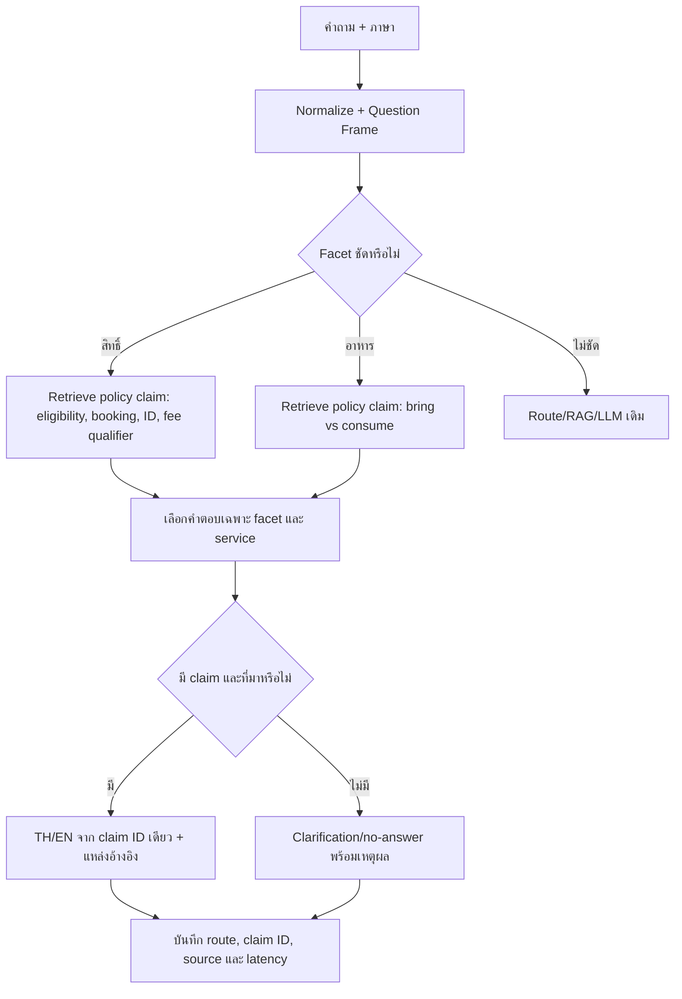

# Flow ใหม่: ใช้ผลตรวจ 400 ข้อแก้สิทธิ์บริการและกฎอาหาร

วันที่: 2026-09-24

## 1. หลักฐานและขอบเขต

- ผลตรวจต้นฉบับของผู้ใช้มี 200 decision: ไทย 199, อังกฤษ 1; ห้ามนับผลเทียบภาษาเป็น human-reviewed.
- `intent_trap_review_bilingual_assisted_20260924.json` มี 200 human-reviewed และ 200 assistant-projected เพื่อหา regression เท่านั้น.
- เว็บไซต์จองระบุขั้นตอนจองล่วงหน้า, การชำระเงิน และใช้ Student/Staff/National ID ตอนเช็กอิน:
  `https://esports.computing.psu.ac.th/` ส่วน Booking of Services, Check-in and Use of Services และ How to Use the Reservation System.
- เว็บไซต์เดียวกันข้อ 4.2 ระบุอาหารและเครื่องดื่มให้อยู่เฉพาะพื้นที่ที่กำหนด; หน้าเว็บภาษาไทยพูดถึงการรับประทาน ส่วนภาษาอังกฤษใช้คำว่า allowed. การอนุญาตให้นำจากภายนอกเป็นการตีความร่วมกับผลตรวจของผู้ใช้ ไม่ใช่ข้อความที่เว็บเขียนแยกชัด.
- ตารางราคาในข้อมูลเก่าบางไฟล์มีวันหมดอายุแล้ว Flow นี้จึงไม่ออกตัวเลขราคาเมื่อถามเพียงสิทธิ์.

## 2. เป้าหมาย

ตอบคำถามสิทธิ์คนนอก/อุปกรณ์และอาหารให้ตรง facet โดยใช้หลักฐานที่มีอยู่ ไม่ให้ inventory หรือ generic no-answer กลบคำถาม และไม่เพิ่ม alias รายสำนวน.

## 3. Claim contract

เก็บ claim ใน `data/curated/service_policy_answers.json` แยกจากคำถามทดสอบ. แต่ละ claim ต้องมี `id`, `basis`, `source_url`, `source_section`, คำตอบไทย/อังกฤษ และ variant ที่ตอบคนละ facet. `basis` แยก `site_explicit` ออกจาก `reviewer_interpretation_with_site_context`. ห้ามตีความรายการอุปกรณ์ว่าเป็นสิทธิ์ และห้ามใช้ผลติ๊กเป็นหลักฐานของราคา.

| Facet | ตัวอย่าง | คำตอบต้องมี | ห้ามทำ |
|---|---|---|---|
| eligibility | คนนอกใช้ PS5 ได้ไหม | ได้, เงื่อนไขจองและค่าบริการขึ้นกับกลุ่ม/บริการ | แสดงรายการอุปกรณ์หรือราคาเดา |
| booking | แขกต่างมหาวิทยาลัยจองได้ไหม | ได้, วิธีจองและเช็กอิน | บอกว่าต้องมีรหัส PSU |
| check-in ID | คนนอกใช้เอกสารอะไร | บัตรประชาชน, แยกจากเอกสารกลุ่ม PSU | ตอบแค่จองและโอนเงิน |
| membership | ต้องสมัครสมาชิกไหม | ไม่ต้องเป็นนักศึกษา PSU; ใช้ช่อง National ID | อ้างว่ามีค่าสมาชิกที่ไม่พบ |
| bring food | พกน้ำ/อาหารเข้ามาได้ไหม | ตอบการนำเข้าก่อน, แล้วระบุพื้นที่ที่กำหนด | ตอบแต่กฎการรับประทานหรือบอกว่าไม่รู้โดยไม่อ่านผลตรวจ |
| consume food | กินที่โต๊ะเกมได้ไหม | เฉพาะพื้นที่ที่กำหนด | อนุมานว่าทุกโต๊ะคือพื้นที่ดังกล่าว |

## 4. ลำดับ implement

1. เพิ่ม claim record แบบสองภาษาพร้อม provenance และ validation ตอนโหลด. ไม่ย้ายหรือเขียนทับ source record/rule เดิม.
2. ให้ `protected_intents` เลือก facet แล้วดึง claim record ก่อนคืน `ProtectedAnswer` เฉพาะสิทธิ์และการนำอาหารเข้า; การรับประทานยังใช้กฎเดิม. ถ้า record หายให้ safe fallback เดิม.
3. แยกคำถามเอกสาร, สมาชิก, การจอง, สิทธิ์ใช้อุปกรณ์ และการนำ/รับประทานอาหาร. คำตอบขึ้นต้นด้วยคำตอบต่อคำถามนั้นโดยตรง.
4. เก็บ `source_id`, `source_url`, mode และ category ที่สอดคล้องกับ answer. ไม่ส่งข้อมูลราคาเฉพาะเมื่อไม่มีตารางที่ยังใช้ได้.
5. แก้ tests เก่าที่คาด `no_answer` เฉพาะจุด เปรียบเทียบกับผลตรวจและเพิ่ม negative controls: inventory, fee, food delivery, damage, booking live.
6. รัน 400 ข้อแบบ serial บันทึก raw output ใหม่ แล้วสรุป route/category, คำตอบที่ยังไม่ตรง, Thai/English parity, latency. รัน focused regression ต่อโดยไม่เปลี่ยน gold เพื่อดันคะแนน.

## 5. Gate ก่อนใช้จริง

- ชุดสิทธิ์/อาหาร 300 ข้อไม่ตอบ generic no-answer หรือ inventory ผิด facet; กรณีราคาเฉพาะยังไม่ทราบต้องไม่แต่งตัวเลข.
- ไทยและอังกฤษใช้ claim ID เดียวกัน; ห้ามคำตอบอังกฤษเดินคนละข้อเท็จจริง.
- 100 ข้อกำกวม/นอกขอบเขตยังตอบปลอดภัยและไม่สร้างข้อเท็จจริง PSU.
- `bring food` ต้องได้รับการยืนยันถ้อยคำจากเจ้าของศูนย์ก่อนถือเป็น policy ที่พร้อมเผยแพร่เต็มรูปแบบ; จนกว่านั้น claim ต้องแสดง basis ว่าเป็น reviewer interpretation.
- ผลคะแนนของ assistant-projected 200 ข้อรายงานแยกจาก human-reviewed 200 ข้อ.

## 6. Rollback

ถ้าคำตอบสิทธิ์ขัดกับนโยบายเจ้าของหรือ regression หมวดราคา/จองเพิ่ม ให้ถอยเฉพาะ claim record/ทางตอบใหม่นี้ แล้วใช้ safe outcome เดิม; ห้ามแก้ raw evaluation หรือหมายเหตุผู้ตรวจเดิม.

## 7. ผลการทำจริง (2026-09-24)

- เพิ่ม registry `data/curated/service_policy_answers.json` และตัวอ่าน `app/pipeline/service_policy_claims.py` เพื่อใช้ claim ID เดียวกันสำหรับไทย/อังกฤษ พร้อม `basis` และ source section. สิทธิ์คนนอกแยกคำตอบ `general`, `booking`, `documents`, `membership`; การนำอาหารเข้าแยกจากการรับประทาน.
- ปรับ `app/pipeline/protected_intents.py` ให้ตอบ facet สิทธิ์และการนำอาหารเข้าก่อน route ที่อาจหลงไป inventory. คำถามรับประทานอาหารยังใช้ `rule_food_drink` เดิม. `app/pipeline/engine.py` บันทึก `basis` ใน trace.
- เพิ่ม tests สำหรับ claim parity, provenance, facet/route และ safe fallback. `python -m unittest tests.test_review_grounded_service_policy tests.test_intent_trap_protected_flow tests.test_master_ground_truth_route_regressions tests.test_intent_trap_ground_truth_1000 -q`: ผ่าน 45/45.
- รัน 300 ข้อใน `outsider_eligibility`, `food_bring_scope`, `equipment_access_trap` แบบเปิด model: `reports/master_ground_truth_eval/master_gt_eval_20260924_215858.json`. ทั้ง 300 ได้ route เฉพาะสิทธิ์/อาหารตาม contract; ไม่มี generic no-answer หรือ inventory แทนสิทธิ์.
- รัน 100 ข้อกำกวม/นอกขอบเขตแบบเปิด model: `reports/master_ground_truth_eval/master_gt_eval_20260924_215956.json`. คำตอบและ route ไม่เปลี่ยนจาก baseline `master_gt_eval_20260924_195543.json`.
- รายงาน `reports/master_ground_truth_eval/review_grounded_400_analysis_20260924.json`: contract-aligned 400/400, P95 0.3399 วินาที, สูงสุด 7.3793 วินาที. ตัวเลขนี้ตรวจการเลือก facet/route/รูปคำตอบ ไม่ใช่คะแนนความถูกต้องที่ผู้ใช้ตรวจคำตอบใหม่แล้ว.
- รัน regression เพิ่มอีก 500 ข้อในหมวดราคาแบบไม่ระบุบริการ, วันจอง, ความเสียหาย, การรับประทานอาหาร และ identity typo: `reports/master_ground_truth_eval/master_gt_eval_20260924_220727.json` ผ่าน evaluator 500/500. เทียบ baseline 500 ข้อที่ตรง ID กันแล้วคำตอบและ route เปลี่ยน 0 ข้อ. รอบแรกเคยตก 50 ข้อเพราะเปลี่ยนถ้อยคำกฎอาหาร จึงคืนหมวดการรับประทานให้ใช้กฎเดิมก่อนรันยืนยันใหม่.

### สิ่งที่ยังต้องตรวจโดยคน

1. Reviewer ต้องตรวจ **คำตอบใหม่** โดยเฉพาะ 200 ข้อที่เดิมติ๊กเอง; decision เดิมใช้กับคำตอบเก่าเท่านั้น. English อีก 199 ข้อเป็นผล project จากภาษาไทย ไม่ใช่ human-reviewed.
2. เจ้าของศูนย์ต้องยืนยันถ้อยคำว่าอนุญาต **นำอาหาร/เครื่องดื่มเข้ามา** และเงื่อนไขสิทธิ์บุคคลภายนอก. เว็บไซต์ระบุช่อง National ID และข้อจำกัดพื้นที่รับประทาน แต่ไม่ได้เขียนทุกนัยของสอง claim นี้ตรง ๆ. Registry จึงติด `reviewer_interpretation_with_site_context` และยังไม่ควรถือเป็น production-approved policy.
3. การรันนี้เป็น focused serial evaluation ไม่ใช่ full-corpus หรือ concurrent load test; ไม่สรุป SLA ภายใต้ผู้ใช้พร้อมกันจากผลนี้.
