# PSU Esports Chatbot Response Flow - 2026-07-18

ไฟล์นี้สรุป flow การตอบของ chatbot ตั้งแต่รับ input จนออก output โดยเน้นว่าแต่ละชั้นทำอะไร และ Local LLM ถูกใช้ตรงไหนบ้าง

```mermaid
flowchart TD
    A["User Input<br/>เว็บ / local CLI / notebook ask()"] --> B{"มี session history ไหม"}
    B -->|มี| C["Context Resolver<br/>ดูคำถามก่อนหน้า / route เดิม / universal_intent เดิม"]
    B -->|ไม่มี| D["ใช้คำถามเดิม"]
    C --> C1{"เป็น follow-up หรือเปลี่ยนเรื่อง"}
    C1 -->|follow-up| C2["Rewrite คำถามให้ครบบริบท<br/>เช่น 'ปุ่มอะไร' -> 'TEKKEN 8 ปุ่มอะไร'"]
    C1 -->|topic shift| D
    C2 --> E["Preprocess & Normalize"]
    D --> E

    E --> E1["Normalize คำ<br/>ตัดช่องว่าง/ปรับภาษา/สร้าง query variants"]
    E1 --> E2["Alias Matching<br/>ชื่อเกม/โซน/อุปกรณ์/คำไทย-อังกฤษ/คำพิมพ์เพี้ยน"]
    E2 --> E3["Entity Extraction<br/>วัน เวลา service user group duration price intent"]
    E3 --> F["Route Intent<br/>จัดหมวดแรก เช่น games reservation equipment schedule general"]
    F --> G["Universal Intent<br/>แปลงเป็น domain/operation เช่น members/group_count"]
    G --> G1{"ต้องใช้ LLM ช่วยตี intent ไหม"}
    G1 -->|confidence ต่ำ + allow_llm| G2["Local LLM Intent Parser<br/>Ollama model เช่น qwen2.5:3b<br/>คืน JSON intent เท่านั้น"]
    G1 -->|confidence พอ| H["Refine Route"]
    G2 --> H

    H --> TR["LLM Tool Router (optional)<br/>ช่วยแนะนำว่าจะไป structured / fast / rule / retrieval / general_llm / clarification<br/>เปิดด้วย PSU_LLM_TOOL_ROUTER=1"]
    TR --> TR1{"คำแนะนำปลอดภัยพอให้ refine route ไหม"}
    TR1 -->|ใช่ เฉพาะ general/unknown -> retrieval domain| TR2["Tool Route Refine<br/>เช่น general -> competition_rules/contact/knowledge"]
    TR1 -->|ไม่ใช่| CR["Capability Registry / Policy Ranking<br/>สร้าง candidate: structured, fast, rule, retrieval, LLM, clarification<br/>reject ตัวเลือกผิด policy"]
    TR2 --> CR
    CR --> DA0["Decision Artifact Draft<br/>selected candidate + rejected candidates + policy reason"]
    DA0 --> I["Structured Tool Registry<br/>ดึง facts object จากข้อมูลที่จัดโครงแล้ว"]
    I --> I1{"เจอ structured answer ไหม"}
    I1 -->|เจอ| I2["Evidence Builder<br/>members / games / game_controls / equipment / schedule / reservation / service_fee"]
    I2 --> I3{"เปิด Facts-only Composer ไหม<br/>PSU_FACTS_LLM_COMPOSER=1"}
    I3 -->|เปิด| I4["Local LLM Composer<br/>Ollama model เช่น qwen2.5:3b<br/>เรียบเรียงจาก FACTS_JSON + DRAFT_ANSWER เท่านั้น"]
    I3 -->|ปิด| I5["ใช้ Draft Answer จาก structured tool"]
    I4 --> I6{"คำตอบปลอดภัยไหม"}
    I6 -->|ปลอดภัย| O1["ใช้คำตอบที่ LLM เรียบเรียง"]
    I6 -->|timeout / leak / เปลี่ยน source| I5
    I5 --> O1
    I1 -->|ไม่เจอ| J["Special Guard / Clarification"]

    J --> J1{"คำถามปุ่มเกมแต่ไม่มีชื่อเกมไหม"}
    J1 -->|ใช่| J2["ตอบขอชื่อเกมก่อน<br/>กันดึงปุ่มเกมผิด"]
    J1 -->|ไม่ใช่| K["Game Control Vector First"]
    K --> K1{"เป็นคำถามปุ่ม/จอยไหม"}
    K1 -->|ใช่| K2["Vector Retrieval จาก control_game<br/>หา button/action ที่ตรงเกม"]
    K2 --> K3{"confidence ผ่านไหม"}
    K3 -->|ผ่าน| O2["ตอบจาก Vector/RAG control data"]
    K3 -->|ไม่ผ่าน| L["Deterministic Fast Path"]
    K1 -->|ไม่ใช่| L

    L --> L1["Fast Answer Handlers<br/>price / schedule / equipment / games / static_domain"]
    L1 --> L2{"fast path ตอบได้ไหม"}
    L2 -->|ได้| O3["ตอบจาก Fast/Rule"]
    L2 -->|ไม่ได้| M["Category Rule Base"]
    M --> M1["Rule Matcher<br/>data/rules/*.jsonl<br/>pattern -> answer"]
    M1 --> M2{"rule match ไหม"}
    M2 -->|match| O3
    M2 -->|ไม่ match| N["Retrieval Layer"]

    N --> N1{"หมวดเสี่ยง/ต้องแม่นไหม"}
    N1 -->|competition_rules| N2["Competition Fact Cards"]
    N1 -->|ควรใช้ hybrid| N3["Hybrid Retrieval<br/>BM25/keyword + vector + guard/rerank"]
    N1 -->|ทั่วไปในหมวด| N4["Curated Retrieval<br/>ดึงข้อมูล curated ตาม category"]
    N2 --> N5{"เจอคำตอบ confidence ผ่านไหม"}
    N3 --> N5
    N4 --> N5
    N5 -->|ผ่าน| O4["ตอบจาก RAG/Curated/Hybrid"]
    N5 -->|ไม่ผ่าน| N6["Guarded Vector Retrieval"]
    N6 --> N7{"vector answer ผ่านไหม"}
    N7 -->|ผ่าน| O5["ตอบจาก Guarded Vector"]
    N7 -->|ไม่ผ่าน| P["Experimental Fallback"]

    P --> P1{"route เป็น general/out-of-domain ไหม"}
    P1 -->|ใช่ + allow_llm| P2["General Local LLM<br/>Ollama model เช่น qwen2.5:3b<br/>ตอบความรู้ทั่วไปโดยไม่ดึง PSU context"]
    P1 -->|ไม่ใช่ + มี context| P3["RAG + Local LLM<br/>ส่ง context ที่ retrieve ได้ให้ model สรุป"]
    P1 -->|ไม่อนุญาต LLM หรือไม่มี context| P4["No Answer / บอกว่ายังไม่มีข้อมูลยืนยัน"]
    P2 --> O6["ตอบจาก Local LLM general"]
    P3 --> O7["ตอบจาก RAG + Local LLM"]
    P4 --> O8["ตอบ no answer"]

    O1 --> Q["Formatter<br/>จัด bullet / แหล่งข้อมูล / ภาษาไทย"]
    O2 --> Q
    O3 --> Q
    O4 --> Q
    O5 --> Q
    O6 --> Q
    O7 --> Q
    O8 --> Q
    Q --> R["Validator<br/>เช็กคำตอบตาม route/entities/source"]
    R --> S["Build Result<br/>answer + mode + route + confidence + trace + sources"]
    S --> T["Log<br/>session_id / question / resolved_question / source_type / elapsed / trace"]
    T --> U["Output to User"]
```

## ใช้ Model ตรงไหนบ้าง

| จุด | ใช้ model ไหม | ใช้ทำไม | ค่า default ที่ใช้ใน local |
|---|---:|---|---|
| Context Resolver | ไม่ใช้ | ใช้ history + heuristic rewrite คำถามต่อเนื่อง | ไม่มี |
| Normalize / Alias | ไม่ใช้ | normalize คำและจับ alias เช่นชื่อเกม/โซน/ปุ่ม | ไม่มี |
| Universal Intent | ใช้ได้แบบ optional | ให้ LLM ช่วยแปลงคำถามเป็น JSON intent เมื่อ heuristic ไม่มั่นใจ | `qwen2.5:3b` ผ่าน Ollama |
| LLM Tool Router | ใช้ได้แบบ optional | ให้ LLM ช่วยแนะนำว่าจะใช้ structured / fast / rule / retrieval / general_llm / clarification โดยยังมี guard คุมไม่ให้ทับ route สำคัญ | `qwen2.5:3b` ผ่าน Ollama |
| Capability Registry / Policy Ranking | ไม่ใช้ | ให้คะแนน candidate และ reject เส้นทางที่ผิด policy เช่น PSU-specific ห้ามไป general LLM | ไม่มี |
| Decision Artifact | ไม่ใช้ | เก็บเหตุผลว่าเลือก capability ไหน, reject อะไร, ใช้ evidence กี่ชิ้น, final mode คืออะไร | ไม่มี |
| Structured Tools | ไม่ใช้ | ดึง facts object ตรงจากไฟล์ curated | ไม่มี |
| Facts-only Composer | ใช้ได้แบบ optional | ให้ LLM เรียบเรียงคำตอบจาก facts ที่ดึงมาแล้ว ห้ามแต่งข้อมูลใหม่ | `qwen2.5:3b` ผ่าน Ollama |
| Fast Path | ไม่ใช้ | ตอบจาก function เฉพาะทาง เช่นราคา ตาราง อุปกรณ์ เกม | ไม่มี |
| Rule Base | ไม่ใช้ | pattern match จาก `data/rules/*.jsonl` | ไม่มี |
| Curated / Hybrid / Vector Retrieval | ไม่ใช่ LLM ตอบตรง | ดึงข้อมูลที่เกี่ยวข้องจาก curated/vector/hybrid | ใช้ index/score ที่เตรียมไว้ |
| General LLM Fallback | ใช้ | ตอบคำถามนอกฐาน PSU เช่นความรู้ทั่วไป | `qwen2.5:3b` ผ่าน Ollama |
| RAG + LLM Fallback | ใช้ | ให้ LLM สรุปจาก context ที่ retrieve ได้ | `qwen2.5:3b` ผ่าน Ollama |

## สรุปทางเดินหลัก

1. คำถามจะผ่าน `Universal Intent` แล้วเข้า `LLM Tool Router` แบบ optional เพื่อช่วยแนะนำว่าควรไป structured/fast/rule/retrieval/general/clarification
2. ระบบจะสร้าง candidate จาก `Capability Registry` แล้วทำ `Policy Filtering + Ranking` เพื่อเลือกเส้นทางที่เหมาะสุดและบันทึก `Decision Artifact`
3. คำถามที่มี facts ชัดเจนจะพยายามเข้า `Structured Tools` ก่อน เช่น สมาชิก เกม ปุ่ม อุปกรณ์ ตาราง จอง ราคา
4. ถ้าเปิด `ask_with_composer(...)` จะเพิ่มชั้น `Facts-only Composer` หลัง structured tools เพื่อให้คำตอบอ่านธรรมชาติมากขึ้น
5. ถ้าเป็นคำถามเฉพาะทางที่มี fast function เช่นคำนวณราคา จะเข้า `Fast Path`
6. ถ้า fast path ไม่เจอ จะลอง `Rule Base`
7. ถ้ายังไม่เจอ จะไป retrieval: fact card, hybrid, curated, vector
8. ถ้าเป็นคำถามทั่วไปนอกฐาน PSU และเปิด LLM fallback จะให้ Local LLM ตอบแบบ general
9. ทุกทางต้องผ่าน formatter/validator แล้วค่อยส่ง output พร้อม trace และ log
