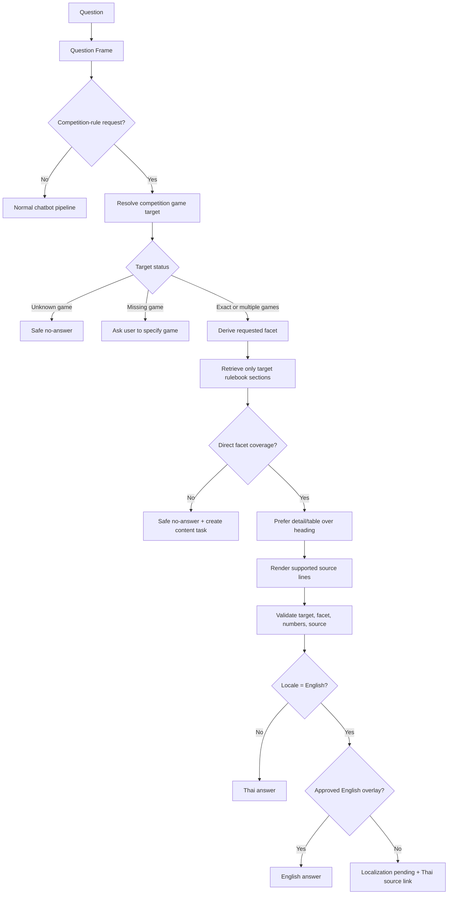
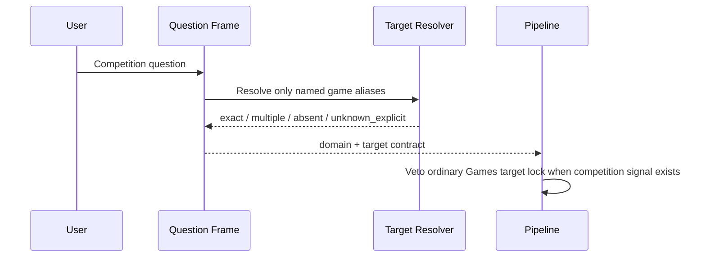
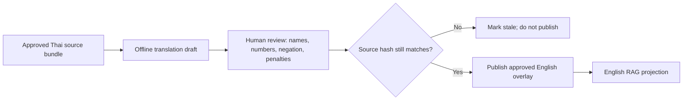
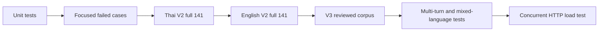

# Competition Rules RAG: Detailed Remediation Execution Flow

## Goal

Make Thai and English competition-rule answers reliable without accumulating
one-off aliases for each new wording. An answer must use the named game's
rulebook, a source section that proves the requested facet, and an approved
language representation. Otherwise, the system must clarify or safely state
that it cannot verify the requested fact.

## Invariants

1. Never use a rule from another game.
2. Same rulebook does not mean same topic: the source section must prove the
   requested facet.
3. A heading cannot replace a rule detail.
4. Thai source text is the factual source of truth.
5. English rule text requires an approved localization overlay; do not translate
   rules or penalties live with an LLM.
6. Preserve raw test outputs. Each evaluation run writes a new report ID.
7. Change Gold evidence only after source review; do not change it simply to
   improve a score.

## Main Runtime Flow



## Phase 1: Freeze and Classify Every Failure

### Capture

For every reported bad answer, save these fields before changing code:

- exact question and locale
- case/run ID
- route category and intent
- Question Frame target status and game IDs
- retrieved source IDs and source URL
- final mode, answer, elapsed time, and validator result
- trace stages from `route` through `final answer`

### Classification Matrix

| Observation | Root cause class | Correct next step |
| --- | --- | --- |
| Wrong route | `routing_or_target_failure` | Fix Question Frame/router/target lock |
| Right game, no direct topic section | `source_coverage_gap` | Return safe no-answer and request source content |
| Right source, answer picks unrelated line | `presentation_failure` | Fix renderer/section role selection |
| Right answer, wrong allowed Gold ID | `gold_or_section_contract_gap` | Review source bundle; create V3 Gold later |
| Thai source exists, English not approved | `english_localization_gap` | Add approved English overlay |
| Expected clarification but got no-answer | `safe_outcome_contract_gap` | Define target/ambiguity policy explicitly |

### Exit Gate

Do not add an alias or edit retrieval ranking until the failure has exactly one
primary class above. A single question can create follow-up tasks, but the
first failing stage determines the first fix.

## Phase 2: Verify Route and Target First



### Decision Rules

| Target status | Response |
| --- | --- |
| `exact` | Retrieve only this rulebook |
| `multiple` | Retrieve each named rulebook; do not use the first game as a proxy |
| `absent` | Ask: CS2, RoV, Tekken 8, or VALORANT? |
| `unknown_explicit` | State that no verified rulebook exists for the named game |

### Required Tests

- Each supported game in Thai and English
- Unsupported names: Free Fire, Dota 2, Mobile Legends
- Untargeted pause, protest, and penalty questions
- Multi-game comparisons
- Exact game name plus generic rule wording such as `setting`, `fair play`, or
  `check-in`

### Exit Gate

- No cross-game evidence
- No game-detail route replacing a target-grounded competition request
- Untargeted and unsupported cases have deliberate safe outcomes

## Phase 3: Create a Reviewed Section Registry

The imported legacy tags are not reliable enough to be the final semantic
contract. Create `data/competition_rules/competition_rule_section_registry.jsonl`.

```json
{
  "rulebook_id": "competition_rules_cs2_psu_phuket_2026",
  "source_chunk_ids": [
    "competition_rules_cs2_psu_phuket_2026_s22_c01",
    "competition_rules_cs2_psu_phuket_2026_s23_c01",
    "competition_rules_cs2_psu_phuket_2026_s24_c01"
  ],
  "facets": ["game_setting"],
  "section_role": "rule_detail",
  "source_text_sha256": "<hash>",
  "review_status": "approved",
  "approved_by": "owner-reviewer-id",
  "approved_at": "2026-09-21T00:00:00+07:00"
}
```

### Closed Facet Set

```text
rulebook_identity, registration, eligibility, team_size,
pre_match_on_site, in_match_operations, game_setting, equipment,
map_pool, conduct, penalty_matrix, penalty, dispute, pause,
disconnect, format, schedule
```

### Section Roles

| Role | Use in answer |
| --- | --- |
| `heading` | Navigation only; never replaces a missing fact |
| `rule_detail` | Direct answer lines |
| `table` | Preserve row/pair relationship |
| `definition` | Definition/scope questions only |
| `reference_only` | Link only |

### Review Procedure

1. Read original source text, not just imported tags.
2. Assign only facets directly supported by the text.
3. Keep headings separate from their detail rows.
4. Group adjacent chunks only if they form one rule statement.
5. Store the source hash and reviewer identity.
6. Source text changes invalidate approval until reviewed again.

### Exit Gate

Every answerable V3 Gold case maps to an approved registry section bundle. If
there is no bundle, the product behavior remains safe no-answer.

## Phase 4: Target-Grounded Retrieval

### Retrieval Order

1. Filter to rulebook IDs from the Question Frame.
2. Filter approved registry entries by requested facet.
3. Prefer `rule_detail` and `table` over `heading`.
4. Rank only the remaining candidates.
5. Take a small evidence bundle, not an entire document.
6. Verify direct coverage before rendering.

```python
target = resolve_competition_targets(question)
facet = derive_competition_facet(question)
sections = registry.find(
    rulebook_ids=target.rulebook_ids,
    facets=[facet],
    review_status="approved",
    source_hash_current=True,
)

if not sections:
    return safe_no_answer("facet_not_covered")

evidence = rank_within_sections(question, sections, limit=4)
return render_supported_answer(question, evidence)
```

### Narrow Evidence Guards

| User request | Evidence that must exist | Never substitute |
| --- | --- | --- |
| Who to notify during a match | contact/notify plus official/staff/referee | FPS or device restriction |
| Starters and substitutes | both starter and substitute rule | emergency-pause substitute mention |
| Player conduct | conduct/sportsmanship behavior policy | technical pause |
| Penalty table | violation-to-penalty rows | generic penalty heading |

### Exit Gate

The answer cannot be accepted merely because a target rulebook was retrieved.
Its individual source lines must support the requested proposition.

## Phase 5: Render From Evidence, Not Similarity Order

### Direct Rule Template

```text
คำตอบ: <direct source-supported fact>

รายละเอียดที่เกี่ยวข้อง:
- <up to five supporting lines from the same approved bundle>

อ้างอิงจากกติกา: <game / tournament>
แหล่งข้อมูล: <source URL>
```

### Table Template

```text
คำตอบ: ตารางบทลงโทษระบุผลตามประเภทการละเมิดที่ยืนยันได้ เช่น

รายละเอียดที่เกี่ยวข้อง:
- <violation> -> <penalty>
- <violation> -> <penalty>
```

### Regression Tests

- Generic CS2 settings renders `Competitive` and round/freeze values, not a
  timeout merely because it contains `Freeze time`
- Penalty matrix preserves violation-to-penalty pairs
- In-match contact question never returns FPS text
- Roster question never turns pause text into a roster rule

## Phase 6: English Localization



### Localization Rules

1. Local LLM may draft offline, but may not publish facts.
2. English record must reference identical Thai `source_chunk_id` and hash.
3. A stale overlay is unavailable.
4. A multi-game English comparison needs approved evidence for every game.
5. When any required English overlay is missing, return localization pending;
   never provide a one-sided comparison.

### Priority Queue

1. CS2 fair play/conduct
2. CS2 penalty table
3. CS2 pre-match/check-in
4. RoV disconnect/restart
5. VALORANT after missing Thai policies are supplied/reviewed

## Phase 7: Gold and Evaluation Repair

### Correct Process

1. Compare the Gold expected facet with approved registry bundles.
2. Preserve V2 results and raw reports as historical baseline.
3. Create V3 only after owner review confirms valid source bundles.
4. Record target rulebooks, source bundles, expected outcome, locale, and
   source version/hash in V3.
5. Run V2 and V3 side-by-side until V3 is trusted.

### Never Do

- Do not broaden allowed evidence IDs just to pass a failing row.
- Do not force retrieval to prefer a weaker section because old Gold chose it.
- Do not overwrite old raw output.

## Phase 8: Test Ladder and Release Gate



### Metrics

| Metric | Required result |
| --- | --- |
| Route accuracy | Correct domain before retrieval |
| Target accuracy | Named game remains named game |
| Facet coverage | Direct source support |
| Unsupported factual claims | Zero |
| Safe outcome accuracy | Clarification/no-answer is intentional |
| English localization coverage | Report separately from answer accuracy |
| Latency | P50/P95/P99, cold and warm runs separated |

### Current Priority Order

1. Build reviewed section registry for all four games.
2. Fill or formally mark unavailable VALORANT conduct, contact, and roster
   policies.
3. Implement registry-filtered retrieval.
4. Complete English overlays for high-frequency CS2/RoV topics.
5. Make English multi-game comparison require evidence for all selected games.
6. Review 15 Gold/section contract gaps and produce V3 Gold.
7. Run full Thai/English and multi-user tests again.

## Commands

```powershell
py -3 -X utf8 -m unittest tests\test_competition_target_grounding.py tests\test_competition_rule_canonical.py tests\test_canonical_competition_fact_guard.py -v

py -3 -X utf8 tools\run_competition_rules_rag_ground_truth.py --cases data\eval\competition_rules_rag_ground_truth_v2_expanded.jsonl --locale th --rag-fallback

py -3 -X utf8 tools\run_competition_rules_rag_ground_truth.py --cases data\eval\competition_rules_rag_ground_truth_v2_expanded.jsonl --locale en --rag-fallback

py -3 -X utf8 tools\analyze_competition_rules_rag_failures.py --report <report-1.json> --report <report-2.json>
```
