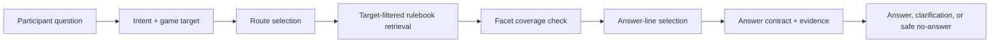
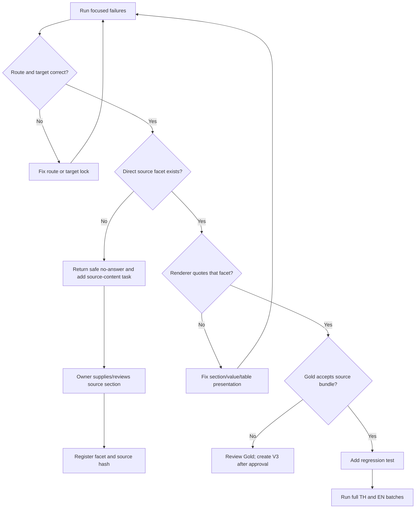

# Competition Rules RAG: Root-cause Analysis and Iteration Flow

## 1. Scope and Evidence

This report analyses the V2 natural-language competition corpus, which has
282 cases: 141 Thai and 141 English. Each result is examined through five
observable stages:



The analysis does not treat every failing evaluation row as an application bug.
For each row, compare the question, route, target rulebook, retrieved source,
rendered answer, and Gold evidence contract before changing code.

## 2. Latest Measured Baseline

The last complete V2 RAG-only batch run, before the final narrow evidence
guards described below, produced:

| Locale | Passed | Total | Rate | P95 | Maximum | Over 20 seconds |
| --- | ---: | ---: | ---: | ---: | ---: | ---: |
| Thai | 120 | 141 | 85.1% | 0.467s | 2.376s | 0 |
| English | 116 | 141 | 82.3% | 0.500s | 1.075s | 0 |

The previous measured baseline was Thai 117/141 and English 113/141. The
three-point improvement in each locale came from target-aware routing and
source ranking, not from broadening the Gold allowed-evidence lists.

The final targeted checks after this batch verified three additional behavior
changes:

1. VALORANT questions asking whom to contact during a match now return a safe
   no-answer when no direct contact instruction exists, instead of an FPS rule.
2. VALORANT questions about starters/substitutes now return a safe no-answer
   when the rulebook only mentions emergency substitutes, instead of treating
   that as a roster policy.
3. English `protest rules` without a game target now asks which game is meant.
   The original V2 case `COMP-RAG-V2-EN-093` was re-run after this change and
   passed; run the next complete English batch before treating that one-case
   verification as a new aggregate score.

## 3. How to Diagnose a Single Bad Answer

Use this sequence for every new failure. Do not add aliases before completing
the evidence checks.

1. **Freeze the case.** Record question, locale, expected route, expected
   target, expected answer status, and run ID. Never overwrite the original
   output.
2. **Inspect route and target.** If the route is not `competition_rules`, or
   the game is not the explicitly named game, fix routing/target lock first.
3. **Inspect retrieved chunks.** Check whether a chunk with the requested
   semantic facet is present. If none exists, this is a data-coverage problem,
   not a ranking problem.
4. **Inspect the selected answer line.** When the relevant chunk is present
   but the answer quotes another chunk, fix presentation ranking or add a
   source-structure rule; do not create a query-specific answer.
5. **Inspect the source proposition.** A chunk can be in the same rulebook
   yet still fail to answer the narrow question. For example, `technical
   pause` does not establish `player conduct`.
6. **Inspect the Gold contract.** If the answer is source-correct but its
   canonical source ID is outside the Gold list, mark it as `Gold/source
   review required`. Do not silently widen the list.
7. **Write a regression test.** The test must assert the observable behavior:
   route, mode, required evidence, and forbidden unrelated wording.
8. **Re-run focused cases first, then the full locale batch.** Report the
   score and the remaining failure taxonomy separately.

## 4. Confirmed System Defects Fixed

| Failure pattern | Root cause | Fix | Verification |
| --- | --- | --- | --- |
| Natural wording such as `setting ที่ผู้เล่น` entered ordinary game detail | Exact game target lock overrode competition context | Competition signal vetoes the later game-detail restoration | Tekken settings case routes to `competition_rules` |
| CS2 generic settings question answered tactical timeout | `Freeze time` incorrectly made a timeout row look like a settings row | Generic configuration ranking promotes real settings sections/values and penalizes timeout rows | Answer now states `Competitive (5v5)` and `1:55 / Freeze 15 seconds` |
| CS2 penalty table was rendered as a heading plus unrelated details | Imported table alternates violation and penalty lines, then generic rendering mixed other chunks | Table renderer preserves verified `violation -> penalty` pairs | Five concrete entries are displayed from the table |
| Explicit unsupported Free Fire rulebook request reached live booking | `check`/availability wording was evaluated before the competition target guard | Explicit competition/unknown targets bypass live booking | Returns `competition_unknown_target_no_answer` |
| English pause/protest question without a game returned generic no-answer | English competition handler did not treat absent target as clarification | English target clarification runs before localization handling | Asks for CS2, RoV, Tekken 8, or VALORANT |
| VALORANT conduct/contact/roster questions used adjacent but unrelated chunks | Same-rulebook membership was incorrectly treated as enough evidence | Facet coverage guard now requires direct facet and narrow line support for contact and starter/substitute requests | Returns a source-safe no-answer instead of pause/FPS content |

## 5. Remaining Failures by Category

### A. Gold evidence contract differs from a source-correct answer

These Thai cases return a reasonable answer from the correct rulebook, but
the V2 Gold permits a different narrow source ID:

- `COMP-RAG-V2-TH-157`: CS2 fair-play answer correctly uses the conduct
  section, but the allowed evidence contract does not include it.
- `COMP-RAG-V2-TH-178` to `TH-180`: CS2 penalty-table output correctly uses
  section `s54`, while the inherited Gold points to another section bundle.
- `COMP-RAG-V2-TH-195`: CS2 schedule response cites the actual schedule
  section; Gold lists a different source chunk.
- `COMP-RAG-V2-TH-213`: RoV disconnect policy spans adjacent chunks, while
  Gold accepts only one narrow chunk.

Required action: build a reviewer-approved section registry that maps a
semantic facet to one or more source chunks. Preserve V2 as historical data;
create a reviewed V3 Gold only after the registry is approved.

### B. Source coverage is missing or too ambiguous

VALORANT content does not currently prove several propositions that V2 expects
to be answerable:

- `conduct` and `fair_play_conduct`: the relevant imported chunks cover
  technical pause, equipment, bugs, and venue rules, not a general conduct
  policy.
- `in_match_operations`: no direct instruction establishes whom to notify for
  a general in-match issue.
- `team_size`: `Match Prep maximum 6 people` does not prove an official
  roster, starter, or substitute limit.

Current runtime behavior deliberately returns no-answer for the narrow cases
that lack proof. This lowers a Gold score where Gold expects an answer, but it
removes fabricated or misleading answers. The required product fix is to add
the missing source sections, not infer policy from an adjacent rule.

### C. English localization is incomplete

Twenty-four remaining English failures use the correct Thai target source but
return `competition_source_localization_pending_en`. This is intentional
under the current policy: no live translation of competition facts without an
approved English overlay.

Required action:

1. Create approved English localizations for the reviewed CS2 conduct,
   penalty-table, pre-match, and RoV disconnect source sections.
2. Add English overlays only after matching the Thai source hash.
3. For multi-game comparisons, approve an English comparison template only
   after both game-specific sections are localized.
4. Re-run English V2 and separately measure `answered`,
   `localization_pending`, and `unsafe_claim` rates. Do not count a pending
   localization as a translated answer.

## 6. Proposed Source Registry Format

Create `data/competition_rules/competition_rule_section_registry.jsonl`.
One row represents a reviewer-approved semantic section, not a user alias.

```json
{
  "rulebook_id": "competition_rules_cs2_psu_phuket_2026",
  "source_chunk_ids": [
    "competition_rules_cs2_psu_phuket_2026_s22_c01",
    "competition_rules_cs2_psu_phuket_2026_s23_c01",
    "competition_rules_cs2_psu_phuket_2026_s24_c01"
  ],
  "facets": ["game_setting"],
  "section_role": "rule_detail",
  "source_text_sha256": "<hash>",
  "review_status": "approved",
  "approved_by": "owner-reviewer-id",
  "approved_at": "2026-09-21T00:00:00+07:00"
}
```

Rules for this registry:

- A chunk may have multiple facets only when its text explicitly supports all
  of them.
- A heading is `section_role=heading`; it cannot substitute for a rule detail.
- A table is `section_role=table` and can expose pairs or rows only as stored.
- A hash mismatch makes the row stale and disables it until re-approved.
- English overlays reference the same `source_chunk_id` and source hash.

## 7. Iteration Order



Priority order for the next implementation cycle:

1. Build and approve the source-section registry for all four rulebooks.
2. Fill missing VALORANT conduct, in-match contact, and roster policy at the
   source level, or explicitly mark each as unavailable.
3. Add English overlays for the high-frequency reviewed sections.
4. Make multi-target English comparison wait for both approved sources.
5. Create reviewed V3 Gold with section bundles rather than a single narrow
   chunk where the source policy spans headings/details.
6. Re-run V2 and V3; retain V2 unchanged as regression history.

## 8. Regression Commands

```powershell
py -3 -X utf8 -m unittest tests\test_competition_target_grounding.py tests\test_competition_rule_canonical.py tests\test_canonical_competition_fact_guard.py -v

py -3 -X utf8 tools\run_competition_rules_rag_ground_truth.py `
  --cases data\eval\competition_rules_rag_ground_truth_v2_expanded.jsonl `
  --locale th --rag-fallback

py -3 -X utf8 tools\run_competition_rules_rag_ground_truth.py `
  --cases data\eval\competition_rules_rag_ground_truth_v2_expanded.jsonl `
  --locale en --rag-fallback
```

## 9. Relevant Outputs

- Thai full-batch reports: `competition_rules_rag_eval_20260921_165620.json`
  through `competition_rules_rag_eval_20260921_165723.json`
- English full-batch reports: `competition_rules_rag_eval_20260921_165739.json`
  through `competition_rules_rag_eval_20260921_165806.json`
- Existing first-pass analysis:
  `competition_rules_rag_v2_analysis_20260921.md`
- Automated triage generated from all 12 full-batch reports:
  `competition_rules_rag_triage_20260921_171836.md`
