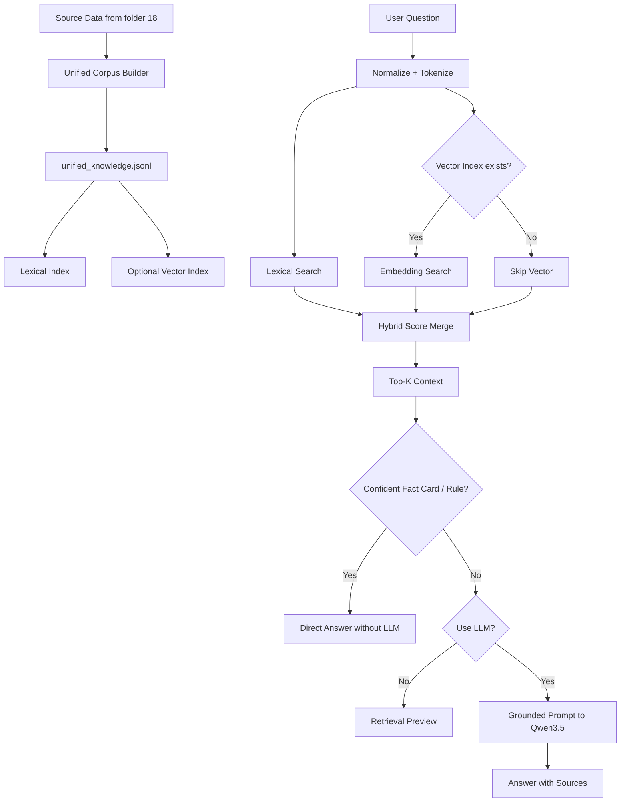

# Pipeline Design: Qwen3.5 Hybrid RAG

วันที่: 2026-07-03

## เป้าหมาย

ออกแบบ pipeline ใหม่ที่ทำให้ RAG ถามตอบได้ดีขึ้น โดยแก้ปัญหาหลักจากระบบเดิม:

- ข้อมูลหลายชนิดปนกัน เช่น rulebase, curated facts, competition chunks, calendar
- บางคำถามควรตอบด้วย fact card แต่บางคำถามควรให้ LLM สรุปหลาย chunk
- ถ้าใช้ LLM ทุกคำถามจะช้าและมีโอกาส hallucinate
- ถ้าใช้ rulebase ทุกคำถามจะ fix เกินไปและไม่ยืดหยุ่น

## หลักคิด

ระบบควรแบ่งหน้าที่ให้ชัด:

- Data layer เป็นแหล่งความจริง
- Retrieval layer หา context
- LLM layer เรียบเรียงจาก context เท่านั้น
- Validation/no-answer layer กันตอบมั่ว

## Pipeline หลัก



## Stage 1: Data Copy

คัดลอกจาก:

```text
C:\Users\Chokhun\Downloads\Learn-LLM\18_PSU_Esports_Update_Route_Data\data
```

มาไว้ที่:

```text
C:\Users\Chokhun\Downloads\Learn-LLM\19_PSU_Esports_Qwen35_Hybrid_RAG\data\source_18
```

หมวดที่ copy:

- `curated`
- `rules`
- `competition_rules`
- `calendar`
- `ground_truth`

## Stage 2: Unified Corpus

สคริปต์:

```text
tools/01_build_unified_corpus.py
```

Output:

```text
data/unified/unified_knowledge.jsonl
reports/unified_corpus_report.md
```

Schema ใหม่:

```json
{
  "id": "...",
  "source_kind": "curated_fact | rulebase | competition_fact_card | competition_chunk | calendar_closure",
  "category": "reservation | service_fee | competition_rules | schedule | ...",
  "title": "...",
  "text": "...",
  "answer": "...",
  "evidence": "...",
  "answer_type": "...",
  "question_patterns": [],
  "source_url": "...",
  "source_ids": [],
  "tags": [],
  "priority": 100,
  "metadata": {},
  "search_text": "..."
}
```

ข้อดีของ schema นี้:

- RAG รู้ว่าข้อมูลมาจากชนิดไหน
- Fact card ให้ priority สูงกว่า chunk ยาว
- Rulebase ยังเก็บไว้ได้ แต่ไม่ต้องเอาไปปนกับ chunk แบบไม่รู้ที่มา
- LLM เห็น context ที่สะอาดขึ้น

## Stage 3: Lexical Index

สคริปต์:

```text
tools/02_build_lexical_index.py
```

ใช้ TF-IDF cosine แบบ lightweight:

- ไม่ต้องติดตั้ง library เพิ่ม
- ค้น keyword, ภาษาไทยแบบ character n-gram, คำอังกฤษ ได้ดีพอสำหรับข้อมูลเล็ก/กลาง
- เหมาะเป็น baseline และ fallback

## Stage 4: Vector Index

สคริปต์:

```text
tools/03_build_vector_index_ollama.py
```

แนะนำ embedding model:

```text
qwen3-embedding:0.6b
```

เหตุผล:

- เล็ก
- รองรับ multilingual
- เหมาะกับ query ไทย/อังกฤษ/คำผสม

ใช้เมื่อ:

- user พิมพ์คนละคำกับข้อมูล
- สะกดไม่ตรง
- ถามแบบยาวๆ
- ต้องหา chunk ที่ความหมายใกล้เคียง ไม่ใช่ keyword ตรงเท่านั้น

## Stage 5: Hybrid Search

คะแนนรวม:

```text
final_score = lexical * 0.58 + vector * 0.32 + priority + exact_bonus + source_bonus
```

เหตุผล:

- Lexical ยังสำคัญมากสำหรับราคา/กฎ/ชื่อเกม/ตัวเลข
- Vector ช่วยเรื่องความหมายใกล้เคียง
- Priority ทำให้ fact card/rule ที่ curate แล้วขึ้นก่อน chunk ดิบ
- Exact bonus ทำให้ question_patterns ที่ตรงขึ้นอันดับแรก

## Stage 6: Direct Answer Gate

ถ้า top hit เป็น:

- `competition_fact_card`
- `rulebase`
- `curated_fact`

และ score สูงพอ ระบบตอบโดยไม่เรียก LLM

เหมาะกับ:

- ราคา
- จำนวนคน
- วันหยุด
- กฎตรงๆ
- check-in/cancel/payment

## Stage 7: RAG + Qwen3.5

ถ้าคำถามต้องสรุปหลายส่วน เช่น:

```text
สรุปกฎ RoV เรื่อง pause และมาสายให้หน่อย
เปรียบเทียบ technical pause กับ tactical timeout ของ CS2
ถ้าจะจองและเช็คอินต้องทำยังไงบ้าง
```

ค่อยให้ Qwen3.5 เรียบเรียงจาก context

Prompt บังคับ:

- ใช้เฉพาะ context
- ห้ามเดาราคา/กฎ/เวลา
- ตอบประเด็นหลักก่อน
- ถ้าข้อมูลไม่พอให้บอกไม่พบข้อมูลที่ยืนยันได้
- ใส่ source

## Stage 8: Evaluation

ควรทดสอบอย่างน้อย 3 ชุด:

- Ground Truth 360 เดิม
- Competition Ground Truth 228 เดิม
- คำถามใหม่ที่เป็น synthesis เช่น สรุป/เปรียบเทียบ/ขั้นตอน

สำหรับ Qwen3.5 ควรเทียบกับ:

- `qwen2.5:3b`
- `qwen3:4b`
- `qwen3.5:4b`

เพื่อดู:

- latency
- ความครบ
- ตอบตรงคำถาม
- hallucination
- รูปแบบคำตอบ

## Production Recommendation

MVP:

```text
Rule/Fact/Calculator จากระบบเดิม
Hybrid RAG เป็น fallback
Qwen3.5 เฉพาะคำถามที่ต้องสรุป
```

Phase ถัดไป:

```text
เพิ่ม Qwen3-Embedding-0.6B
เพิ่ม reranker
เพิ่ม cache
เพิ่ม evaluator ที่ตรวจ exact price/time/rule
```
