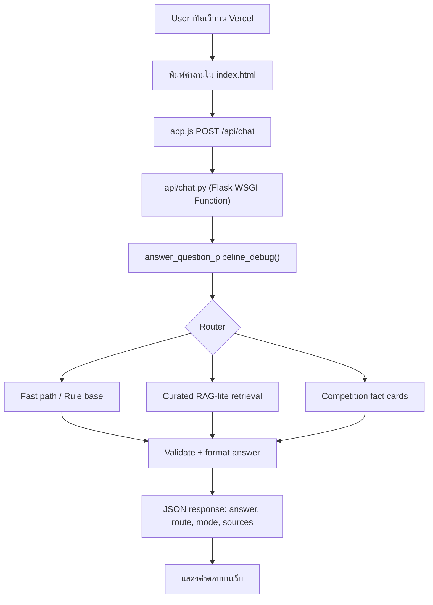

# PSU Esports Chatbot - Vercel Deploy Package

โฟลเดอร์นี้เป็นชุดทดลอง deploy บน Vercel สำหรับ Chatbot ของ PSU Esports Studio - Phuket โดยคัดมาเฉพาะไฟล์ที่จำเป็น:

- `index.html`, `styles.css`, `app.js` = หน้าเว็บ demo
- `api/chat.py` = Python serverless API สำหรับถามตอบ
- `api/health.py` = health check
- `app/` = pipeline/rule/runtime ที่ใช้ตอบคำถาม
- `data/curated`, `data/rules`, `data/competition_rules`, `data/calendar` = ฐานข้อมูลที่ใช้ตอบ
- `vercel.json`, `.python-version`, `requirements.txt` = config สำหรับ Vercel

## Flow



## Deployed URL

Production:

- https://psu-esports-chatbot.vercel.app

ตรวจแล้ว:

- `/api/health` ตอบ `ok: true`
- `/api/chat` ตอบคำถาม `Sony PlayStation VR2 คืออะไร`
- `/api/chat` ตอบคำถาม `เล่น Minecraft ได้ไหม`
- อัปเดตรอบ game details แล้ว: `/api/chat` ตอบ `Beat Saber เล่นยังไง`, `อะไรคือ Cockpit`, `ตอนนี้มีเกมแข่งอะไรบ้าง`, และคำถามราคา PS5/Cockpit ได้ถูก route

## วิธีลองบนเครื่องก่อน deploy

ติดตั้ง dependency ในโฟลเดอร์นี้:

```powershell
cd C:\Users\Chokhun\Downloads\Learn-LLM\20_PSU_Esports_Vercel_Deploy
py -3.12 -m venv .venv
.\.venv\Scripts\Activate.ps1
pip install -r requirements.txt
```

ทดสอบ import/pipeline:

```powershell
python -m py_compile api\chat.py api\health.py app\runtime\fast_answer.py app\pipeline\router.py
python -c "from app.runtime.pipeline_answer import answer_question_pipeline_debug as ask; r=ask('Sony PlayStation VR2 คืออะไร'); print(r.mode); print(r.answer)"
```

ถ้าต้องการจำลอง Flask function แบบ local:

```powershell
$env:FLASK_APP="api.chat:app"
flask run --host 127.0.0.1 --port 8020
```

แล้วลองยิง:

```powershell
Invoke-RestMethod -Method Post -Uri http://127.0.0.1:8020/api/chat -ContentType "application/json; charset=utf-8" -Body (@{question="VR Zone คืออะไร"; debug=$true} | ConvertTo-Json)
```

## วิธี deploy ขึ้น Vercel

วิธีที่ง่ายสุด:

```powershell
cd C:\Users\Chokhun\Downloads\Learn-LLM\20_PSU_Esports_Vercel_Deploy
npm i -g vercel
vercel
vercel --prod
```

หรือเอาโฟลเดอร์นี้ขึ้น GitHub แล้ว Import Project ใน Vercel Dashboard ก็ได้

## ข้อควรรู้

- ชุดนี้ไม่ได้ใช้ Ollama/LLM local บน Vercel เพราะ Vercel Function ไม่เหมาะกับการรันโมเดล local ขนาดหลาย GB
- คำตอบจะมาจาก pipeline/rule/RAG-lite/fact-card ที่อยู่ใน repo จึงเร็วและไม่เสียค่า API
- ถ้าต้องการใช้ LLM จริงใน production ให้แยก backend ไปอยู่บน VPS/Render/Fly/Railway/เครื่องศูนย์ แล้วให้เว็บบน Vercel เรียก API ภายนอก
- Vercel serverless ไม่ควรใช้เขียน log ลงไฟล์ถาวร ให้ดู logs ใน Vercel Dashboard หรือส่ง log ไป database ภายหลัง
- ถ้าข้อมูลใหญ่ขึ้นมาก ควรแยก vector database หรือ search service แทนการ bundle data ทั้งหมดใน function
