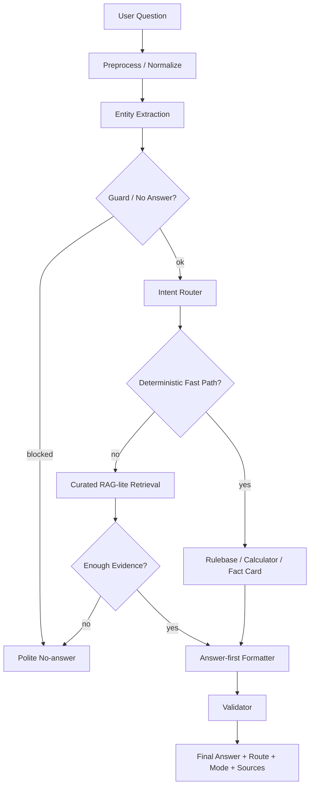

# Pipeline, Rulebase, RAG และ LLM Design

ไฟล์นี้อธิบายว่าระบบถามตอบปัจจุบันทำงานยังไง และทำไมคำตอบจำนวนมากจึงเร็วมาก

## Pipeline ปัจจุบัน

ภาพรวม:



## ไฟล์โค้ดหลัก

```text
app\pipeline\engine.py
app\pipeline\router.py
app\pipeline\preprocess.py
app\pipeline\retrieval.py
app\pipeline\formatter.py
app\pipeline\validator.py
app\runtime\fast_answer.py
app\calculator\service_fee.py
app\calendar\service_calendar.py
```

## ขั้นตอน 1: Preprocess / Normalize

หน้าที่:

- ทำให้คำถามอ่านง่ายขึ้น
- normalize คำไทย/อังกฤษ
- จัดการ alias
- ลดปัญหาพิมพ์ต่างรูปแบบ

ตัวอย่าง alias ที่ต้องเข้าใจ:

- มอ, PSU, Prince of Songkla University
- นักศึกษา มอ, เด็ก มอ, student PSU
- ต่างมหาลัย, สจล, จุฬา, นักศึกษาทั่วไป
- PlayStation, PS5, เพลย์ห้า
- VR, แว่น, PlayStation VR2
- Cockpit, พวงมาลัย, simulator

## ขั้นตอน 2: Entity Extraction

ระบบพยายามจับ entity เช่น:

- service: PS5, Nintendo, VR, Cockpit
- user group: PSU student, general student, adult
- time: วันนี้, พรุ่งนี้, วันจันทร์, morning, afternoon
- game: VALORANT, Minecraft, Roblox, Beat Saber
- competition: CS2, RoV, Tekken, VALORANT
- intent: price, schedule, booking, rule, game availability

Entity ที่จับได้จะช่วย router และ calculator

## ขั้นตอน 3: Guard / No-answer

ใช้กันไม่ให้ระบบตอบมั่ว

ตัวอย่าง:

- ถามนอกโดเมนมาก ๆ
- ถามข้อมูลที่ไม่มีในฐานข้อมูล
- ถามข้อมูลที่ต้องใช้ policy/เจ้าหน้าที่
- ถาม booking action จริง เช่น ยกเลิกจองผ่านระบบ แต่ยังไม่มี API

คำตอบควรเป็น:

```text
ยังไม่พบข้อมูลที่ยืนยันได้ในฐานข้อมูลของ PSU Esports Studio - Phuket สำหรับคำถามนี้ครับ
```

หรือถ้ารู้หมวด:

```text
ยังไม่พบข้อมูลที่ยืนยันได้ในฐานข้อมูลของ PSU Esports Studio - Phuket สำหรับหมวด penalty ตอนนี้ครับ
```

## ขั้นตอน 4: Intent Router

ไฟล์:

```text
app\pipeline\router.py
```

Route สำคัญ:

- `service_fee`
- `schedule`
- `reservation`
- `rules`
- `penalty`
- `contact`
- `overview`
- `knowledge`
- `games`
- `equipment`
- `competition_rules`
- `events_news`
- `general`
- `no_answer`

Route order ล่าสุดในแนวคิด:

1. equipment item
2. equipment game catalog
3. specific news date
4. competition game list
5. game availability
6. zone/equipment
7. competition rule
8. game detail
9. penalty
10. reservation/checkin/payment
11. service fee
12. schedule/calendar
13. fallback

เหตุผลที่ order สำคัญ:

- ถ้าตรวจ game availability ก่อน equipment catalog คำถาม `อุปกรณ์มีเกมอะไรบ้าง` จะตอบผิด
- ถ้าตรวจ game availability ก่อน competition rule คำถาม `Tekken 8 เกมนึงมี 3 rounds ใช่ไหม` จะหลุด route
- ถ้าตรวจ schedule กว้างเกิน คำถาม `Roblox เล่นได้ไหม` อาจโดน schedule

## ขั้นตอน 5: Deterministic Fast Path

ไฟล์:

```text
app\runtime\fast_answer.py
```

ใช้ตอบคำถามที่แน่นอนและควบคุมได้ เช่น:

- เปิดปิดกี่โมง
- ราคาเท่าไหร่
- เช็คอินกี่นาที
- จองล่วงหน้าได้ไหม
- ศูนย์อยู่ไหน
- PC Zone คืออะไร
- VR เล่นเกมอะไรได้บ้าง
- Minecraft มีไหม
- RoV สมาชิกทีมกี่คน

ข้อดี:

- เร็วมาก
- ไม่เสียค่า API
- ไม่ hallucinate ถ้า guard ดี
- ทดสอบ regression ง่าย

ข้อเสีย:

- ต้องเขียน logic และ alias เอง
- ถ้าคำถามใหม่มาก ๆ อาจตอบไม่ได้
- ถ้า route กว้างเกินอาจตอบผิดหมวด

## Service Fee Calculator

ไฟล์:

```text
app\calculator\service_fee.py
```

หน้าที่:

- คำนวณราคาตาม service/user group/duration/session
- จัดการคำถามเทียบราคา
- ตอบราคาเป็นบรรทัดแรก

ตัวอย่าง:

```text
เด็ก สจล เล่น VR 30 นาทีเท่าไหร่
```

ควรตอบ:

```text
ราคา: 190 บาทต่อ 30 นาที สำหรับนักศึกษาหรือนักเรียนต่างสถาบัน / General Student
```

แล้วค่อยรายละเอียด

## Equipment Game Catalog

เพิ่มล่าสุดเพื่อแก้ปัญหา:

```text
อุปกรณ์เล่นเกมอะไรได้บ้าง
```

Route:

```text
equipment/equipment_game_catalog
```

Mode:

```text
pipeline:equipment_game_catalog_fast_path
```

หลักการ:

- ถ้าถาม generic catalog ให้ตอบทุกโซน
- ถ้าถามเฉพาะโซน ให้ตอบเฉพาะโซนนั้น
- ถ้าถาม `มีอุปกรณ์อะไรบ้าง` และไม่มีคำว่าเกม/เล่น ให้ตอบอุปกรณ์ ไม่ใช่ game catalog

ตัวอย่าง:

```text
PC Zone เล่นเกมอะไรได้บ้าง -> รายชื่อเกม PC
PC Zone มีอุปกรณ์อะไรบ้าง -> รายชื่ออุปกรณ์ PC
```

## Game Availability

ใช้ตอบว่าเกมนี้มีในศูนย์ไหม

ตัวอย่าง:

```text
คอมมีวาโลไหม
เพลย์ห้ามี Tekken 8 ไหม
เล่น Minecraft ได้ไหม
Roblox เล่นได้ไหม
```

ถ้าเจอเกมที่มี:

```text
มีครับ VALORANT อยู่ในรายการเกมที่ยืนยันได้ของ PC Zone
```

ถ้าไม่เจอ:

```text
ยังไม่พบ Minecraft ในรายการเกมที่ยืนยันได้ของ PSU Esports Studio - Phuket ครับ
ถ้าต้องการเล่นเกมนอกเหนือจากรายการนี้ ควรสอบถามเจ้าหน้าที่ก่อนจองหรือก่อนเข้าใช้บริการ
```

แล้วแสดงเกมที่มีในระบบ

## Competition Fact Cards

ใช้กับกติกาการแข่งขัน

Mode:

```text
pipeline:competition_fact_card
```

ข้อดี:

- เร็ว
- ตอบตรง section
- คุม answer style ได้

ข้อเสีย:

- ต้องสร้าง fact cards ให้ครอบคลุม
- ถ้าคำถามนอก fact card จะไป RAG-lite

## Curated RAG-lite

ไม่ใช่ vector RAG เต็มรูปแบบ

ทำงานโดย:

- ค้นใน curated JSONL/chunks
- ใช้ lexical/keyword/category matching
- ดึง evidence ที่เกี่ยวข้อง
- format คำตอบจากข้อมูลที่พบ

ใช้กับ:

- competition rules ที่ไม่มี fact card
- curated facts ที่ไม่ได้อยู่ fast path
- คำถาม summary บางอย่าง

ข้อดี:

- ไม่ต้องใช้ LLM
- เร็วกว่า vector/LLM
- คุม source ได้

ข้อเสีย:

- semantic ยืดหยุ่นน้อยกว่า embedding
- อาจพลาดถ้าคำถามใช้คำคนละชุดกับ data

## LLM ในระบบนี้อยู่ตรงไหน

ปัจจุบัน production Vercel:

```text
ไม่ได้ใช้ LLM เป็นตัวหลัก
```

เหตุผล:

- Vercel serverless ไม่เหมาะกับโมเดล local
- ไม่มี budget สำหรับ API
- FAQ จำนวนมาก deterministic ตอบได้ดีกว่า

โฟลเดอร์ทดลอง LLM:

```text
19_PSU_Esports_Qwen35_Hybrid_RAG
```

ใช้เพื่อ:

- ทดสอบ Qwen 3.5/4B
- ทำ unified corpus
- ทำ lexical/vector index
- ทดลอง hybrid mode

แนวทาง phase 2:

```text
Rulebase/Calculator/Fast path -> ถ้าไม่เจอ -> RAG retrieval -> ถ้า evidence ดี -> LLM เรียบเรียงจาก evidence -> ถ้า evidence ไม่ดี -> no-answer
```

ไม่ควร:

```text
User question -> LLM เดาเอง
```

## Answer Style Policy

คำตอบควร:

- ตอบประเด็นก่อน
- ไม่เวิ่นเว้อ
- ใส่รายละเอียดหลังคำตอบหลัก
- ใส่แหล่งข้อมูลท้ายคำตอบ
- ถ้าไม่รู้ให้บอกไม่พบข้อมูล ไม่แต่งเอง
- ถ้าเสี่ยงเข้าใจผิดให้ถามกลับหรือแสดงทุกกรณี

ตัวอย่างราคา:

```text
ราคา: 190 บาทต่อ 30 นาที สำหรับนักศึกษาหรือนักเรียนต่างสถาบัน

รายละเอียด:
- VR 30 นาทีรองรับ 1-5 คน
- ถ้าเป็นนักศึกษา/บุคลากร PSU ราคา 0 บาท
- ถ้าเป็นบุคคลทั่วไป ราคา 525 บาท
แหล่งข้อมูล: ...
```

ตัวอย่าง schedule:

```text
วันจันทร์ช่วงเช้า 09:00-12:00 เล่นไม่ได้ เพราะเป็น Maintenance และช่วงบ่าย 13:00-16:00 เปิดให้บริการ
```

ไม่ควรขึ้นต้นด้วย:

```text
ไม่ได้เปิด 24 ชั่วโมง...
```

ถ้าผู้ใช้ไม่ได้ถามเรื่อง 24 ชั่วโมง

## Validator

ไฟล์:

```text
app\pipeline\validator.py
```

หน้าที่:

- จับคำตอบที่ยาวเกินไป
- จับ schedule ที่พูด 24 ชั่วโมงผิดบริบท
- จับ route confidence สูงแต่ตอบ no-answer
- จับ service fee ที่ไม่ตอบราคาในส่วน direct answer

ควรเพิ่ม validator ต่อในอนาคต เช่น:

- ถามวันเฉพาะต้องไม่ตอบวันจันทร์เสมอ
- ถามราคา PS5/VR ต้องมีหน่วยเวลา
- ถามกติกาเกมหนึ่งต้องไม่อ้างอีกเกม
- ถาม unknown game ต้องไม่ดึง schedule/competition มาตอบ

